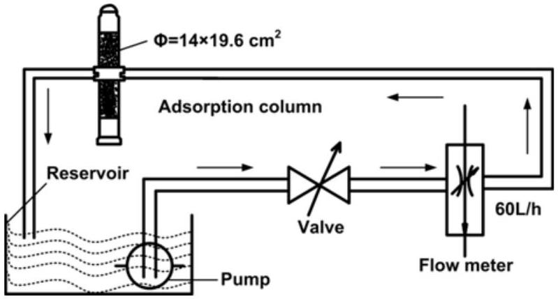
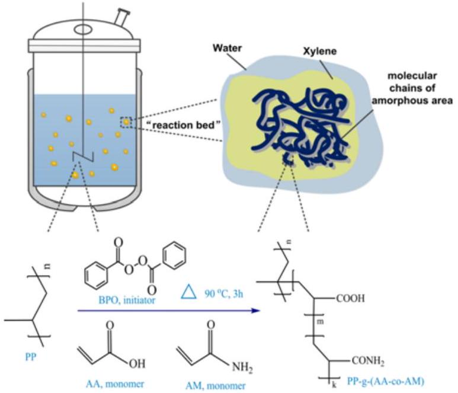
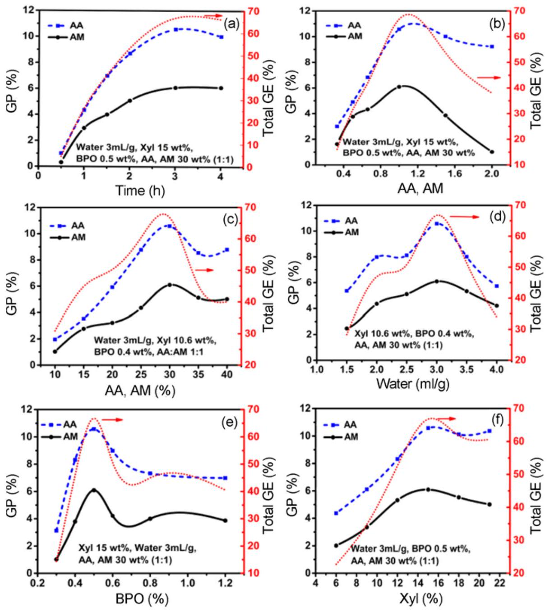
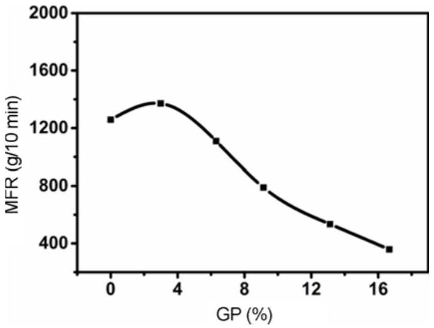
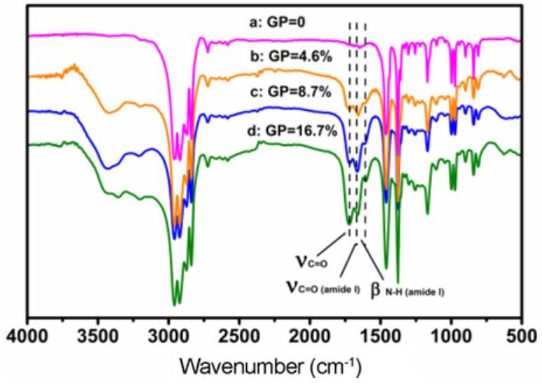
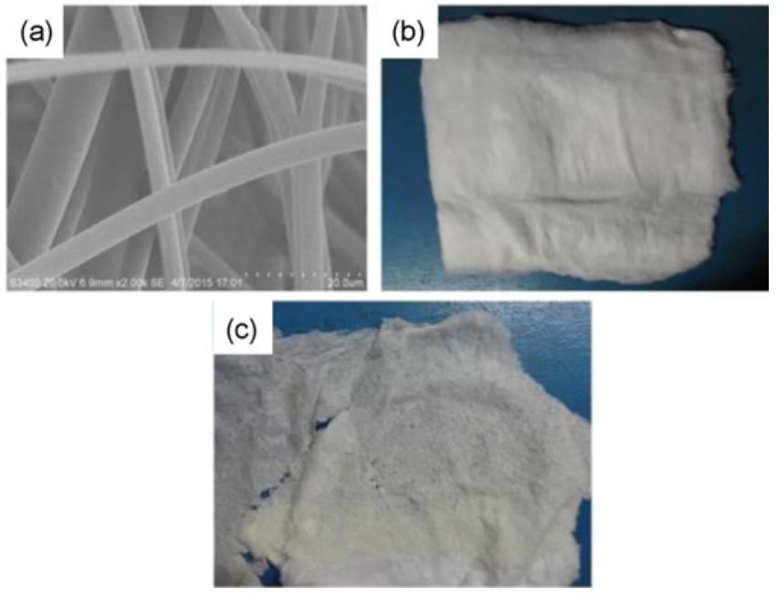
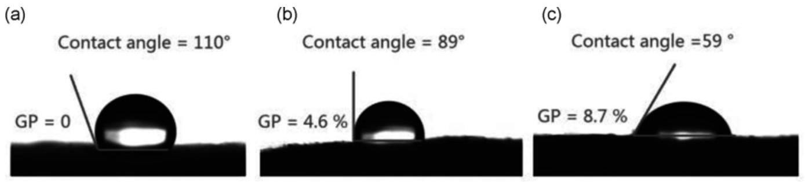
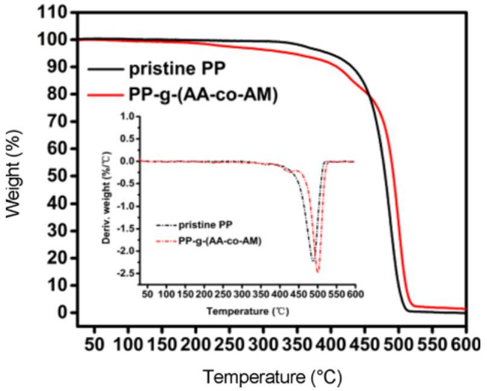
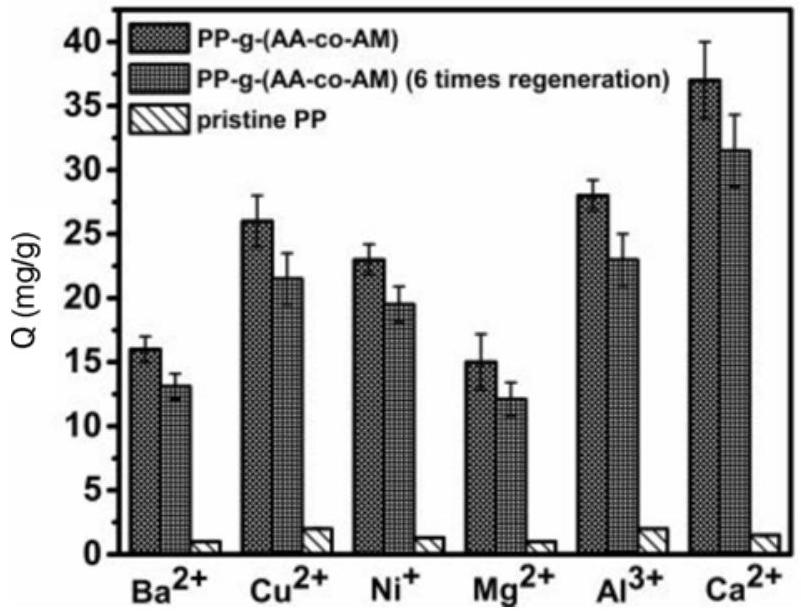

# An Efficient, Simple and Facile Strategy to Synthesize Polypropylene-g-(acrylic acid-co-acrylamide) Nonwovens by Suspension Grafting Polymerization and Melt-blown Technique 

Mulin Guo, Chao Zhang ${ }^{\mathbf{1}}$, Jianjian Xu ${ }^{\mathbf{1}}$, Zhengwei Luo ${ }^{\mathbf{2}}$, and Wuji Wei ${ }^{\mathbf{1}}$ * College of Chemical Engineering, Nanjing Tech University, Nanjing 210009, China ${ }^{1}$ College of Environmental Science and Engineering, Nanjing Tech University, Nanjing 211800, China ${ }^{2}$ College of Safety Science and Engineering, Nanjing Tech University, Nanjing 210009, China

(Received April 6, 2016; Revised June 16, 2016; Accepted June 19, 2016)

#### Abstract

An efficient, simple and facile process, i.e., suspension grafting polymerization combined with melt-blown technique, was employed to synthesize Polypropylene-g-(acrylic acid-co-acrylamide) nonwoven fabrics [PP-g-(AA-co-AM) nonwovens]. In this study, the grafting mechanism and the effect of synthesis parameters on grafting percentage (GP) were investigated. The as-synthesized products were characterized by melt flow rate (MFR), Fourier transform infrared spectroscopy (FTIR), scanning electron microscope (SEM), water contact angle (WCA) and thermalgravimetric analysis (TGA). Besides, the uptake properties of metal ions (i.e., $\mathrm{Ba}^{2+}, \mathrm{Cu}^{2+}, \mathrm{Ni}^{2+}, \mathrm{Mg}^{2+}, \mathrm{Al}^{3+}, \mathrm{Ca}^{2+}$ ) on the PP-g-(AA-co-AM) nonwovens in dynamic condition were studied. Results of FTIR showed that AA and AM were successfully grafted onto the PP surface. The decrease in WCAs of the grafted nonwovens with the increasing GP indicated that (AA-co-AM) side chains existed as the hydrophilic component. TGA results revealed that no significant change in thermal stability was found in grafted PP samples. The synthesis experiments showed that the highest GP was obtained at grafting time 3 h, water 3 ml/g, xylene 15 wt\%, benzoyl peroxide 0.5 wt\%, AA, AM 30 wt\% and AA: AM 1:1, with a GP of 16.7 \%, and a grafting efficiency of 67 \%. However, MFR measurement and SEM image demonstrated that PP-g-(AA-co-AM) nonwovens with the highest GP showed almost no mechanical strength existed between filaments resulting in the occurrence of deformation and contraction of nonwovens, and breaking up into small pieces. Comprehensively, the optimal GP was 8.7 \%, and the corresponding PP-g-(AA-co-AM) nonwovens exhibited higher metal ions uptake capacity than pristine PP nonwovens in the dynamic adsorption process.

Keywords: Polypropylene, Grafting, Melt-blown technique, Heavy metals, Adsorption

## Introduction

The increasing rate of heavy metal ion production such as $\mathrm{Pb}^{2+}, \mathrm{Cd}^{2+}, \mathrm{Cr}^{3+}$, and $\mathrm{As}^{2+}$, together with associated discharges into the surrounding highlights the attention of heavy metal ion removal from wastewaters. These heavy metal ions could cause chronic intoxication even in a small amount through food chain bioaccumulation, and also may permanently damage the body system. Therefore, the removal of heavy metal ions from wastewaters in a timely manner to minimize their hazards is an urgent task in the perspective of environment and public health [1-4]. This issue can be addressed by developing a simple, facile, and largescaleproducing approach for the manufacture of adsorbents, while minimizing the impact on the environment. The preferable adsorbent materials are those which, besides being low-cost and readily available, exhibit a fast adsorption capacity for metal ions, chemical stability, and excellent reusability [5-10]. There is no doubt that polypropylenebased (PP-based) materials have great potential to be useful materials for separating heavy metal ions. Particularly, unlike organic, natural adsorbents, they are readily available in versatile forms such as powder, membrane, resin, and fiber.

[^0] Such a special property is favorable for laboratory researches and various forms of industrial applications. However, the shortcomings such as hydrophobic property and lack of active groups limit their applications in separating of heavy metal ions. Therefore, it is very imperative to modify PPbased materials for better utilization of them.

The specific forms of PP-based adsorbents, such as granules, resins and membrane have received an increased interest in recent years [11-13]. Only a few researchers have devoted themselves to the synthesis of a nonwoven form of PP-based adsorbents, which are materially the thermallybonded construction with the oriented or random fibers, and well known for their good kinetic property, easy to recycle, improved strength and large external specific surface area. For example, Vandenbossche et al. [14] prepared PP nonwovens grafted with acrylic acid using low pressure cold plasma technology, and then cysteine was immobilized by a chemical coupling between the carboxyl of acrylic acid and the amine group of cysteine. Then the modified PP nonwovens were employed as adsorbent to remove $\mathrm{Pb}^{2+}, \mathrm{Cr}^{3+}$ and $\mathrm{Cu}^{2+}$ from aqueous solutions. Wang et al. blended the PP nonwovens with feather fibers, which were chemically modified by sodium pyrosulfite previously, to improve the $\mathrm{Pb}^{2+}$ adsorption capacity of the raw materials [15]. However, none of these methodologies of synthesis, such as radiation-
induced grafting and chemical modification, is potentially being applied at industrial scale. Because such the methodologies that are directly functionalized on the readymade nonwoven materials, suffer from the limitation of the size of reactor, occurrence of deformation and contraction, and extensive cost of preparation. Accordingly, in this study, a novel and facile strategy, by which the PP resins were modified first, and then the modified nonwovens were prepared, was used.

Currently, for bulk polymer modification, many methods that are being used to prepare PP-based grafting polymers include melt grafting [16], solution grafting [17], solid phase grafting [18], radiation-induced grafting [19] and suspension grafting [20]. Comparing to suspension grafting, however, other grafting methods are confined to several significant disadvantages, e.g., $\beta$-chain scission, low grafting efficiency, high energy consumption, requirement of specialized equipment, and environmental pollution caused by the use of massive organic solvent [20-22]. Consequently, it is believed that the method of suspension grafting to modify PP resins is promising. Regarding the manufacture of nonwovens, electrospinning, melt spinning, and melt-blown spinning are the most commonly used processes for nonwoven production [23]. Among them, melt-blown spinning technique has advantages of easy operation, low energy consumption, environmentally benign processing, and would be applicable to the production using a conventional production line on large scale. Besides, the diameter of filaments made by meltblown spinning technique is about $5 \mu \mathrm{~m}$ that providing a larger external specific surface area for the application in separating of heavy metal ions [24]. Until now, however, there are few reports on the preparation of adsorbents by suspension grafting polymerization combined with meltblown spinning technique.

In the present work, we report on the synthesis and characterization of new PP-based chelating melt-blown nonwovens by suspension grafting polymerization and meltblown spinning technique. Functional hydrophilic monomers, acrylic acid (AA) and acrylamide (AM), that possessing N and O donor atoms were introduced onto the PP chain. The products [PP-g-(AA-co-AM)] were characterized by scanning electron microscope (SEM), Fourier transform infrared spectroscopy (FTIR), water contact angle (WCA), melt flow rate (MFR) measurement, and thermogravimetric (TG) analysis. Also, the application of the grafted nonwovens for metal ions $\left(\mathrm{Ba}^{2+}, \mathrm{Cu}^{2+}, \mathrm{Ni}^{2+}, \mathrm{Mg}^{2+}, \mathrm{Al}^{3+}\right.$ and $\left.\mathrm{Ca}^{2+}\right)$ uptakes in continuous dynamic adsorption system was studied with the aim to establish a practical industrialized application for metals removal.

## Experimental

Materials
PP melt-blown resins, P6313, were supplied by Shanghai Expert in the Developing of New Material Co., Ltd., China. AA, analytical grade, was provided by Aladdin Industrial Corporation, China, and used after vacuum distillation. AM and xylene, analytical grade, were obtained from Shanghai Lingfeng Chemical Reagent Co., Ltd., China. Benzoyl peroxide (BPO), chemically pure, purchased from Shanghai Lingfeng Chemical Reagent Co., Ltd., China, had been purified by recrystallization in methanol prior to use. All other chemicals were analytical grade and used as received without further purification. DI water was used in all of the experiments.

## Suspension Grafting

PP-g-(AA-co-AM) melt-blown resins were synthesized using the suspension grafting polymerization method, as described in the following steps. First, the PP melt-blown resins must be processed with quenching pretreatment to reduce the crystallinity, and the procedure was already described in detail in our previous work [8]. Then, the quenched PP melt-blown resins, a certain amount of xylene, and DI water were added to the reactor. The mixture was stirred at 90 °C for 60 min to ensure that the PP melt-blown resins were fully swollen by xylene. Finally, BPO, AA and AM were dropwise added to initiate the grafting polymerization for extra 3 h at 90 °C. All the steps were proceeding under a nitrogen atmosphere. After the grafting polymerization, the products were washed with DI water and extracted with acetone for 4 h, and then dried in a vacuum oven at 45 °C. The grafting percentage (GP) of AA on PP-g-(AA-co-AM) melt-blown resins was determined according to the literature [8], and the GP of AM was calculated according nitrogen contents tested by an elemental analyzer (CHN-O-Rapid, heraeus, Germany). The total grafting efficiency (GE) of the products was calculated by using equation (1) as follows:

$$
\begin{equation*}
G E=m_{A A, A M}^{\prime} / m_{A A, A M} \times 100 \% \tag{1}
\end{equation*}
$$

where $m_{A A, A M}^{\prime}(\mathrm{g})$ is the weight of grafted AA and AM in the products. $m_{A A, A M}(\mathrm{~g})$ is the amount of AA and AM monomers used in the grafting polymerization.

## Melt-blown Spinning

The PP-g-(AA-co-AM) melt-blown nonwovens were manufactured by as-prepared PP-g-(AA-co-AM) resins using an experimental melt-blown spinning machine (Changshu Weicheng Non-Woven Equipment Co., Ltd., China). The main processing parameters were as follows: $\mathrm{T}_{\text {extruder }}=160$ -$230^{\circ} \mathrm{C}, T_{\text {flow channel }}=270^{\circ} \mathrm{C}, T_{\text {die }}=300^{\circ} \mathrm{C}, T_{\text {hot air }}=330^{\circ} \mathrm{C}$, metering pump speed $=10 \mathrm{rpm}$, air pressure $=45 \mathrm{~Hz}$, nozzle diameter $=0.42 \mathrm{~mm}$ and receiving distance $=32 \mathrm{~cm}$.

Determination of Xylene-water Partition Coefficients of AA, AM

The experiments were performed in a constant temperature
oscillator with 2.50±0.01 g of AA or AM in a 250 ml conical flask containing 50 ml xylene and 50 ml water. The solution was vigorously shaken with a rate of 200 rpm for 180 min at 25 °C, and then let it stand for 60 min. Then, the concentrations of AA or AM in aqueous and xylene phase were tested. The xylene-water partition coefficients of AA, AM were obtained according to equation (2):

$$
\begin{equation*}
K=C_{1} / C_{0} \tag{2}
\end{equation*}
$$

where $K$ is xylene-water partition coefficients of AA or AM; $C_{1}$ and $C_{0}$ are the concentrations of AA or AM in xylene and the water phase ( $\mathrm{mg} / l$ ), respectively.

## MFR Measurement

The MFR of grafting products was measured using a RL-Z1B1 Melt Indexer (Shanghai S.R.D. scientific instrument Co., Ltd., China). The measurement was performed at 250 °C with a load of 2.16 kg.

## FTIR Spectroscopy

To investigate the functional groups of original PP and grafted PP, FTIR spectra were recorded using a Nicolet-Nexus 670 FTIR spectrometer in the spectral range of 4000-$500 \mathrm{~cm}^{-1}$ with pressing potassium bromide troche.

## SEM Observation

The surface morphology of original PP and grafted PP were observed by SEM (S-3400N II, Hitachi Ltd., Japan), and the images were taken at 1000× magnification. Prior to observe, the samples were coated with gold to eliminate the electron charging effects. The average fiber diameter was obtained based on randomly selected 80 fibers using Image Pro Plus software.

## Thermogravimetric Analysis (TGA)

The thermal property of original PP and grafted PP was tested by Pyris 1 TGA (PerkinElmer, USA). The measurements were performed from 25°C to 600°C at a heating rate of $20^{\circ} \mathrm{C} / \mathrm{min}$ under a constant nitrogen flow. Differential thermogravimetric (DTG) curves were obtained by differential method.

## WCA Measurement

To test the wettability of grafted PP, WCA was measured by sessile drop technique using a contact angle analyzer (JC2000D, Shanghai powereach digital technology equipment Co., Ltd., China) at room temperature (20±1 °C). A drop of $5 \mu \mathrm{l}$ DI water was probed on the sample surface, and the WCA was recorded by a high-resolution camera. For each sample, five measurements of WCAs were obtained from different positions, and the average values were calculated.

Dynamic Adsorption of $\mathbf{B a}^{\mathbf{2}+}, \mathbf{C u}^{\mathbf{2}+}, \mathbf{N i}^{\mathbf{2}+}, \mathbf{M g}^{\mathbf{2}+}, \mathbf{A l}^{\mathbf{3}+}, \mathbf{C a}^{\mathbf{2}+}$
The schematic illustration of the dynamic adsorption is

Scheme 1. Schematic illustration of the dynamic adsorption.

shown in Scheme 1. About 12.0 g of PP-g-(AA-co-AM) nonwoven fabrics were packed into the adsorption column $\left(\Phi=14 \times 19.6 \mathrm{~cm}^{2}\right)$, Artificial contaminated water containing metal ions ( $538 \mathrm{mg} / l$ for $\mathrm{Ba}^{2+}, 596 \mathrm{mg} / l$ for $\mathrm{Cu}^{2+}, 353 \mathrm{mg} / l$ for $\mathrm{Ni}^{2+}, 475 \mathrm{mg} / l$ for $\mathrm{Mg}^{2+}, 556 \mathrm{mg} / l$ for $\mathrm{Al}^{3+}, 501 \mathrm{mg} / l$ for $\mathrm{Ca}^{2+}$, respectively) flowed through the reservoir, valve, flow meter, and adsorption column and went back to reservoir, and then repeated in this way at a rate of $60 l / \mathrm{h}$. The temperature was controlled at 25°C. After 5 h of adsorption, the aqueous samples were taken, and the concentrations were measured by inductively coupled plasma-atomic emission spectrometry (ICP-AES). The uptake capacity (Q) was calculated according to equation (3):

$$
\begin{equation*}
Q=\left(C_{0}-C_{1}\right) V / W \tag{3}
\end{equation*}
$$

where $V$ is the volume of the artificial contaminated water (L), $C_{0}$ and $C_{1}$ are the initial and equilibrium concentrations of metal ions ( $\mathrm{mg} / l$ ), respectively, and $W$ is the weight of the PP-g-(AA-co-AM) nonwoven fabrics (g). All the adsorption experiments were conducted twice and the average value was reported.

## Regeneration Experiment

For adsorption-regeneration experiment studies, metalsloaded PP-g-(AA-co-AM) nonwovens were washed thoroughly with DI water to remove unabsorbed metals, and dried in a vacuum oven at 318 K . Then the nonwovens were immersed in 100 ml 0.1 M EDTA. To test the reusability of the nonwovens, this adsorption-desorption cycle was repeated six times.

## Results and Discussion

## Mechanism of the Grafting Polymerization

The objective of this study was to explore the mechanism of suspension grafting polymerization of AA and AM inside the PP melt-blown resins. In suspension grafting system, each PP resins could be considered as an independent reaction bed surrounded by the dispersion medium under the condition of high-speed stirring. The grafting polymerization in

Scheme 2. Schematic illustration of suspension grafting of AA and AM.

each "reaction bed" mainly occurs in the amorphous area of macromolecular chains of PP, which are swelled by interface agent, namely xylene in this study. Before the grafting polymerization, BPO, AA and AM diffused into the micropores of PP resins under the action of capillarity. Inside the PP resins, the BPO first decomposed into benzoyl radicals and further decomposed into phenyl radicals with strong surface-H abstraction ability because of space limitation [8]. Then, the AA and AM monomers mostly dissolved in a dispersion medium continuously diffused into the interface layer to involve in the grafting polymerization. However, it can be obtained the data from the experiments that the xylene-water partition coefficients of AA and AM were about 1:5 and 1:24, respectively. Thus, AM alone is difficult to directly graft onto the surface of PP resins in the suspension grafting system due to the limitation in mass transfer. Therefore, the presence of a comonomer AA is essential for the grafting of AM onto the PP surface. Besides, the reactivity ratios for

Figure 1. Effects of synthesis parameters on GP of AA, AM and GE; (a) polymerization time, (b) ratio of monomers, (c) monomers concentration, (d) amount of water, (e) amount of BPO, and (f) amount of interface agent.

AA and AM were both less than 1 according to Q-e theory, which could provide the possibility of copolymerization. The mechanism of suspension grafting polymerization and molecular formula of the grafting products are shown in Scheme 2.

## The Effects of Synthesis Parameters on GP of AA, AM and Total GE

The extent of grafting of monomers on PP particles was studied at different polymerization time. The data of the GP of AA, AM and total GE is shown in Figure 1(a). The observation of the grafting trend onto PP particles clearly indicated that GP and GE increased rapidly during the initial 2 h but started leveling off beyond 2 h, and finally became stagnation after 3 h. This trend can be assumed to be due to the depletion of the monomers in reaction. Besides, the initiator BPO mostly decomposed into phenyl radicals within initial 2 h because the half-life time of BPO at 90 °C is about 1 h, and then the phenyl radicals triggered polymerization reaction. At the end of 3 h of grafting polymerization, the BPO had been exhausted, either in formation of the reactive sites on the PP particles or in other side reactions. This phenomenon confirmed that the optimal time for grafting polymerization of AA and AM on PP particles was 3 h . Therefore the reaction time of subsequent grafting polymerization was fixed at 3 h.
The effects of the ratio of monomers (AA/AM) on GP and total GE are shown in Figure 1(b). When the ratio of monomers increased, total GE and GP of both AA and AM initially increased, arrived at the maximum when their ratio was about 1:1, and then decreased. The maximum GP of AA and AM were 10.6 \% and 6.1 \%, respectively, and the total GE was approached to 70 \%. It can be also observed that the GP of AA was higher than AM at any monomer ratios and the GP curves exhibited a similar trend for the two monomers. These phenomena may be explained by the mechanism of grafting copolymerization. However, excess AA could accelerate the homopolymerization, and then the flowability got worse, leading to decrease in GE and GP for both AA and AM.
As shown in Figure 1(c), GE and GP of both AA and AM generally increased with increasing monomers concentration and reached their maximum total value 16.7 \% at the total concentration of 30 \%, and then total GP dropped to 13.8 \%. The reason for this phenomenon may be that, the probability of collision between monomers and active free radicals of macromolecular chain improved that resulted in increasing GP and GE at the initial stage of copolymerization. However, as is known to all that PP melt-blown resins, though pretreated by quenching, are a high-crystalline macromolecular, and grafting copolymerization mainly occurs at the amorphous area. The interface that swelled by xylene suitable for polymerization is limited. The homopolymerization of monomers initiated by dissociative radicals would become aggravation leading to the decrease of GP and GE when the total concentration exceeded a certain critical value. Furthermore, crosslinking between homopolymer and grafted products also restrained the fluidity of monomers resulted in decrease of GP and GE.

Comparing to other grafting polymerization, the suspension grafting process exclusively uses water as the dispersion medium. It performs two functions: PP particles can be dispersed into it forming the suspension system under the action of shear force, and most of monomers can be dissolved in it and gradually diffused to interface. However, only a few researches reported on the effects of dispersion medium on grafting polymerization. Figure 1(d) showed the effects of dispersion medium on GP and GE. A small amount of dispersion medium could not disperse the PP particles effectively, which resulted in adhesion between particles. Besides, the increased monomer concentration in a dispersion medium could accelerate the homopolymerization. However, an excess of dispersion medium led to a low concentration gradient between dispersion medium and interface agent, affecting the diffusion of monomers and making the monomers unable to participate in the grafting polymerization timely and effectively. Consequently, the optimal dosage of dispersion medium was 3 ml/g.

To understand the effects of BPO concentration on the grafting polymerization, the ratios of BPO/PP from 0.3 to $1.2 \mathrm{wt} \%$ were investigated. Both GP and GE increased with increasing amount of BPO, and achieved its maximum value at the ratios of $0.5 \mathrm{wt} \%$, and then gradually decreased when the ratio of BPO/PP increase further to 1.2 wt\% (Figure 1(e)). The increase in the ratios of BPO/PP could increase the phenyl radical concentration in the grafting system and improve the GP of the final products. However, the high phenyl radical concentration could accelerate the homopolymerization of the monomers, which was unfavorable for the grafting polymerization leading to occurrence of degradation of PP, affecting the mechanical properties of the final product [25].

The monomer, AA and AM, used in this experiment have polar functional groups. The large difference in solubility parameter of monomers and PP made the monomers a poor swelling agent. The addition of a suitable amount of xylene as the interface agent increased the swelling degree of PP in the grafting process and provided more available reaction sites, as shown in Figure 1(f).

## Characterizations

Nonwoven fabrics prepared by melt-blown spinning technique have a high requirement on the flow properties of the substrate materials. The MFR is required to be at least $800 \mathrm{~g} / 10 \mathrm{~min}$ for the melt-blown resins to be spun successfully in our melt-blown machine previously [8]. Many factors, such as the length of grafting chain, intermolecular forces of grafting chain and PP backbone, might have an influence on

Figure 2. Effects of GP on MFR.

the MFR of PP resins [20]. The effects of GP on the MFR of PP resins are shown in Figure 2. Obviously, when the total GP was less than 3.1 \%, MFR slightly increased with the increasing GP. Because when the total GP was relatively small, the $\theta$ bond of the PP macromolecule chains, whose $\alpha$ -H was captured by the phenyl radicals decomposed from the initiators, was easy to cleave, leading to the occurrence of $\beta$ -scission. This might result in the reduction of molecular weight, and the fluidity of the grafting products was therefore improved. When the total GP was more that 3.1 \%, MFR decreased sharply with the increase in GP. The intermolecular interaction between the grafting chains strongly increased, which plays a leading role in MFR, and the occurrence of crosslinked action of macromolecule might also lead to the decrease in the fluidity of the grafting products.

FTIR spectra can be used to characterize the functional groups of polymers. The original PP and grafted PP were analyzed by FTIR spectra, and are shown in Figure 3. Compared with the spectrum of PP, a strong absorption band appeared at $1715 \mathrm{~cm}^{-1}$ in grafting products. This characteristic band was attributed to the stretching of C=O of AA. Another two characteristic peaks were observed at $1664 \mathrm{~cm}^{-1}$ and $1619 \mathrm{~cm}^{-1}$, which were due to the presence of C=O of AM (amide I) and bending of N-H (amide II), respectively. Besides, characteristic peak intensity was increased with the increasing GP. Considering that the homopolymer of the monomers had been removed by DI water and acetone, the spectra could confirm that AA and AM were successfully grafted onto the surface of PP particles.

The morphology of the original PP and grafted PP nonwovens were observed by SEM and digital camera, and are shown in Figure 4. The PP-g-(AA-co-AM) nonwovens with a total GP of 8.7 \% have a smooth surface with loose structure, and the average fiber diameter was about $3.6 \mu \mathrm{~m}$ (Figure 4(a)) (diameter distribution: $<2.0 \mu \mathrm{~m}: 9 \%$, 2.0-$3.0 \mu \mathrm{~m}: 21 \%, 3.0-4.0 \mu \mathrm{~m}: 32 \%, 4.0-5.0 \mu \mathrm{~m}: 15 \%, 5.0- 6.0 \mu \mathrm{~m}: 14 \%,>6.0 \mu \mathrm{~m}: 9 \%$ ). And the digital photo also

Figure 3. FTIR spectra of samples; (a) $\mathrm{GP}=0$, (b) $\mathrm{GP}=4.6 \%$, (c) $\mathrm{GP}=8.7 \%$, and (d) $\mathrm{GP}=16.7 \%$.

Figure 4. Images of (a) PP-g-(AA-co-AM) fibers (SEM: 2000×, $\mathrm{GP}=8.7 \%$ ), (b) PP-g-(AA-co-AM) nonwovens (digital camera, $\mathrm{GP}=8.7 \%$ ), and (c) PP-g-(AA-co-AM) nonwovens (digital camera, $\mathrm{GP}=16.7 \%$ ).

showed that the nonwovens were compact, flexible, well integrated, and had a certain of strength (Figure 4(b)). Comparing to Figure 4(b), however, the nonwovens with a total GP of 16.7 \% (Figure 4(c)) exhibited a very rough surface without any mechanical strength, resulting in the occurrence of deformation and contraction of nonwovens, and breaking up into small pieces. PP with relative low MFR (GP $16.7 \%$, MFR $358 \mathrm{~g} / 10 \mathrm{~min}$ ) that are being processed into nonwoven fabrics has a high requirement for the spinning machine, such as excellent pressure keeping capacity, high temperature of screw extruder and large shearing force, etc. In this work, the melt were difficult to spray from the spinneret leading to no mechanical strength due to the limitation of our laboratory machine used in this experiment. Besides, PP resins with relative high MFR are beneficial to lower energy consumption, extend die life, reduce the

Figure 5. WCAs of the PP nonwovens; (a) $\mathrm{GP}=0$, (b) $\mathrm{GP}=4.6 \%$, and (c) $\mathrm{GP}=8.7 \%$.

Figure 6. TG and DTG (inset) profiles for pristine PP and PP-g-(AA-co-AM).

production of degradation products, and flexibility of use of additives. Therefore, it is believed PP with MFR 358 g/ 10 min are unsuitable for melt-blown spinning in this study.
WCA measurement is a simple method to investigate the wettability of the modified nonwovens. WCAs of the PP nonwovens before and after grafting were measured, and the results are shown in Figure 5. The pristine PP nonwovens showed a WCA approximately 110 °, indicative of a relatively hydrophobic surface (Figure 5(a)). The introduction of AA-co-AM side chains improved the surface polarity of PP and therefore reduced the WCAs to $89^{\circ}$ (total $\mathrm{GP}=4.6 \%$, Figure 5(b)) and $59^{\circ}$ (total $\mathrm{GP}=8.7 \%$, Figure 5(c)), respectively. This suggested that the wettability of the PP nonwovens had been greatly improved.

The TG and DTG results for original and grafted PP are shown in Figure 6. The thermogravimetric analysis showed that the variation range of rapid decomposition temperature was between 400 °C and 510 °C in both PP and grafted PP samples, indicating that the PP backbone chains were not destroyed after grafting of AA-co-AM (GP 8.7 \%), and no significant change in thermal stability was found for PP and grafted PP. Continuous weight loss before the rapid decomposition temperature in the grafted PP could be

Figure 7. The uptake capacity of metal ions on PP-g-(AA-co-AM) nonwovens in continuous dynamic adsorption system.

probably due to the evaporation of residual water content of the hydrophilic groups, i.e., carboxyl and acylamino [26]. When the temperature was above 458 °C, the higher mass retaining of the grafted PP may due to the formation of crosslinking structure between monomers and the decrease in the number of tertiary hydrogens after grafting side chains which are instable.

## Dynamic Adsorption on PP-g-(AA-co-AM) Melt-blown Nonwovens

Recently, most of researches on the separation of metal ions have been focused on batch adsorption experiments. It is imperative to establish a continuous dynamic adsorption system to investigate the adsorption characteristics, which is useful for practical applications. Figure 7 demonstrates the uptake capacity of different metal ions on PP-g-(AA-co-AM) nonwovens (GP 8.7 \%). Obviously, grafting modification led to an obvious increase in different metal ions uptake capacity, especially for $\mathrm{Ca}^{2+}$. The higher uptake capacity of PP-g-(AA-co-AM) nonwovens was attributed to the improved hydrophilic property and the existence of active groups such as carboxyl and acylamino that containing a large amount of N and O donor atom, which have the strong coordination ability with metal ions.

In this study, 0.1 M EDTA solutions were used to desorb the metals from the PP-g-(AA-co-AM) nonwovens, and PPg-(AA-co-AM) nonwovens were reused for six adsorptionregeneration cycles. As it is shown in Figure 7, no appreciable loss in uptake capacity happened over at least six adsorptionregeneration cycles, indicating that the PP-g-(AA-co-AM) nonwovens were not dissolved during the adsorptionregeneration cycles.

## Conclusion

Novel PP-g-(AA-co-AM) nonwoven fabrics were successfully prepared by suspension grafting polymerization and melt-blown spinning technique. The xylenewater partition coefficients of monomers indicated that AM alone is difficult to directly graft onto the surface of PP resins due to the limitation in mass transfer, and the presence of a comonomer AA is essential for the grafting of AM. By studying the effects of polymerization conditions on GP and GE, it is found that the highest GP was obtained at grafting time 3 h, water 3 ml/g, xylene 15 wt\%, benzoyl peroxide 0.5 wt\%, AA, AM 30 wt\% and AA:AM 1:1, with a corresponding total GP of 16.7 \% (AA 10.6 \%, AM 6.1 \%) and GE of 70.0 \%. However, almost no mechanical strength existed between filaments resulting in the occurrence of deformation and contraction of nonwovens. Comprehensively, the optimal total GP was 8.7 \%, and the nonwoven fibers were smooth with a certain mechanical strength. The decrease of WCAs with the increasing GP was result of the introduction of a relatively hydrophobic surface, i.e., carboxyl and acylamino. No significant change in thermal stability was found for PP and grafted PP samples. Finally PP-g-(AA-co-AM) nonwovens exhibited higher metal ions uptake capacity than pristine PP nonwovens in the dynamic adsorption process.

## References

1. M. Y. Bai and J. C. Tsai, Fiber. Polym., 15, 2265 (2014).
2. Q. C. Chen, J. Wang, K. M. Chen, R. Zhang, L. Li, and X. H. Guo, Chinese J. Polym. Sci., 32, 432 (2014).
3. A. Massoud and S. A. Waly, Colloid. Polym. Sci., 292, 3077 (2014).
4. M. M. Beisebekov, S. B. Serikpayeva, S. N. Zhumagalieva, M. K. Beisebekov, Z. A. Abilov, S. Kosmella, and J. Koetz, Colloid. Polym. Sci., 293, 633 (2015).
5. H. Guo, Y. Z. Ren, X. L. Sun, Y. D. Xu, X. M. Li, T. C. Zhang, J. X. Kang, and D. Q. Liu, Appl. Surf. Sci., 283, 660 (2013).
6. F. L. Fu, L. P. Xie, B. Tang, Q. Wang, and S. X. Jiang, Chem. Eng. J., 189, 283 (2012).
7. P. Kanagaraj, A. Nagendran, D. Rana, T. MatsVuura, S. Neelakandan, T. Karthikkumar, and A. Muthumeenal, Appl. Surf. Sci., 329, 165 (2015).
8. Q. Zhou, M. X. Li, X. H. Yao, Z. Y. Lian, C. Zhang, W. J. Wei, and J. Huang, Fiber. Polym., 15, 2238 (2014).
9. X. H. Li, Z. Wang, Q. Li, J. X. Ma, and M. Z. Zhu, Chem. Eng. J., 273, 630 (2015).
10. S. Lin, W. Wei, X. H. Wu, T. Zhou, J. Mao, and Y. S. Yun, J. Hazard. Mater., 299, 10 (2015).
11. J. N. Wang, C. Cheng, X. Yang, C. Chen, and A. M. Li, Ind. Eng. Chem. Res., 52, 4072 (2013).
12. M. Monier, N. Nawar, and D. A. Abdel-Latif, J. Hazard. Mater., 184, 118 (2010).
13. D. J. Zhou, L. B. Dai, H. Ni, G. L. Hui, and S. G. Yuan, Chinese Chem. Lett., 25, 221 (2014).
14. M. Vandenbossche, H. Vezin, N. Touati, M. Jimenez, M. Casetta, and M. Traisnel, J. Environ. Manage., 143, 99 (2014).
15. H. Wang, X. Y. Jin, and H. B. Wu, J. Appl. Polym., Sci., 132, 41555 (2015).
16. S. Al-Malaika and E. Eddiyanto, Polym. Degrad. Stabil., 95, 353 (2010).
17. Z. Yao, Z. Q. Lu, X. Zhao, B. W. Qu, Z. C. Shen, and K. Cao, J. Appl. Polym. Sci., 111, 2553 (2009).
18. F. Picchioni, J. G. P. Goossens, M. van Duin, and P. Magusin, J. Appl. Polym. Sci., 89, 3279 (2003).
19. S. K. Hee and J. K. Hyun, Fiber. Polym., 14, 793 (2013).
20. Z. Li, Y. H. Ma, and W. T. Yang, J. Appl. Polym. Sci., 129, 3170 (2013).
21. A. Zare, M. Morshed, R. Bagheri, and K. Karimi, Fiber. Polym., 14, 1783 (2013).
22. H. A. Karahan and E. Ozdogan, Fiber. Polym., 9, 21 (2008).
23. C. J. Ellison, A. Phatak, D. W. Giles, C. W. Macosko, and F. S. Bates, Polymer, 48, 3306 (2007).
24. M. L. Guo, H. X. Liang, Z. W. Luo, Q. G. Chen, and W. J. Wei, Fiber. Polym., 17, 257 (2016).
25. L. T. Zhang, Z. Q. Fan, Q. T. Deng, and Z. S. Fu, J. Appl. Polym. Sci., 104, 3682 (2007).
26. M. Kumari, B. Gupta, and S. Ikram, Radiat. Phys. Chem., 81, 1729 (2012).

[^0]:    *Corresponding author: wjwei@njtech.edu.cn

