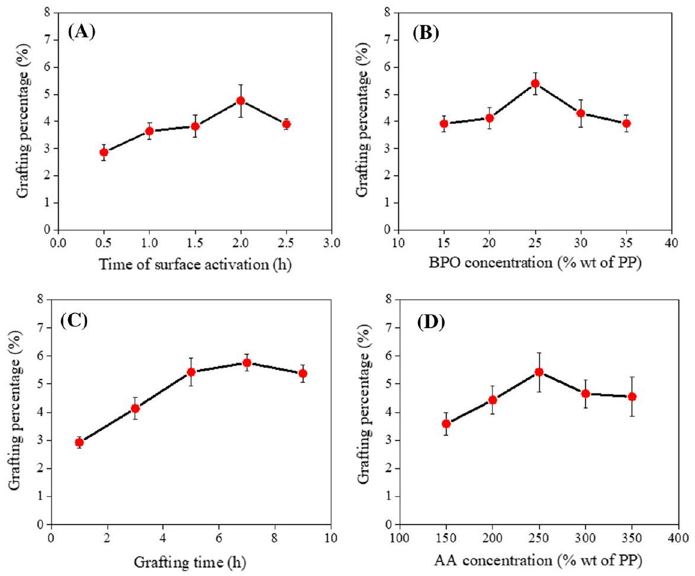
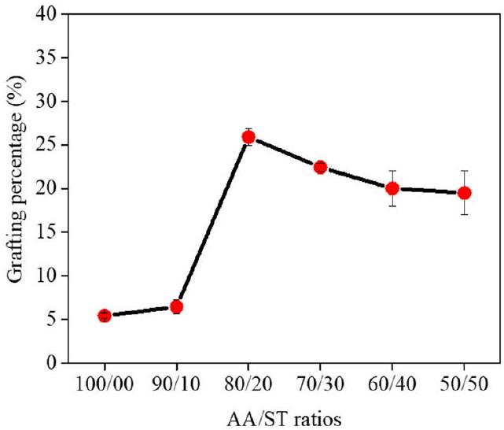
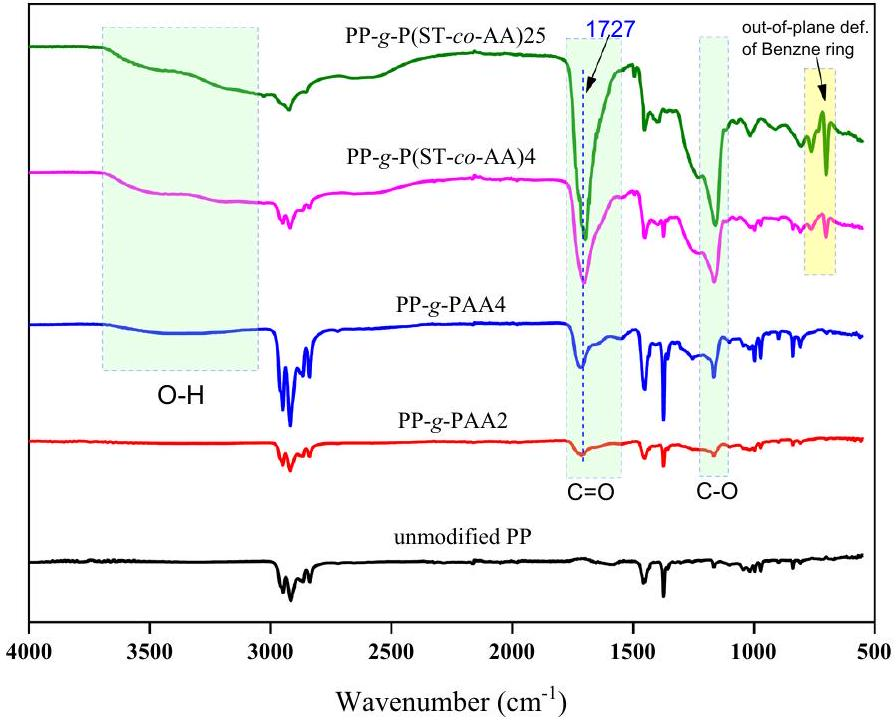
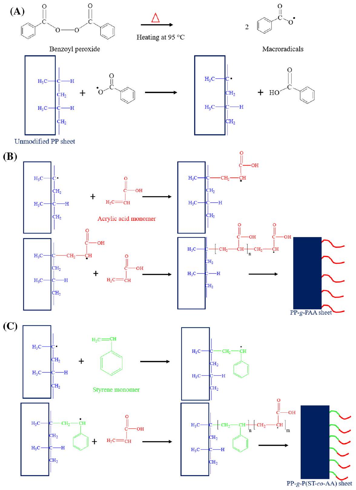
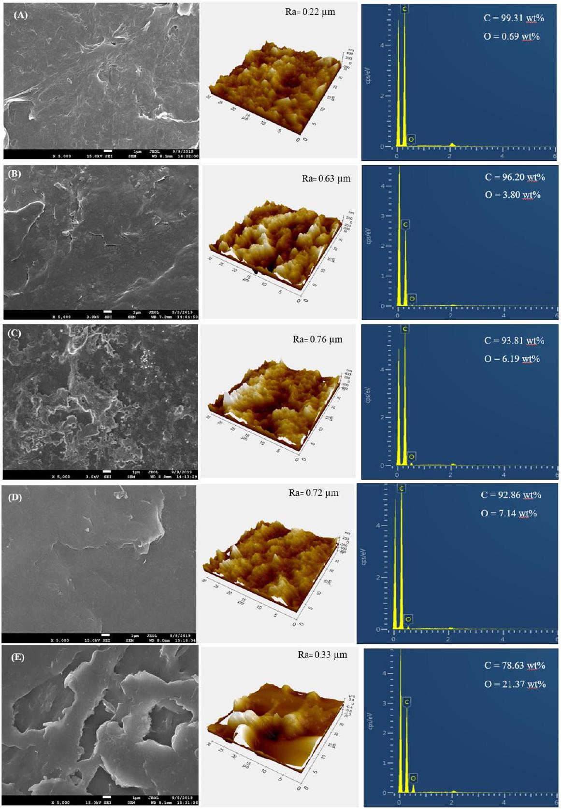
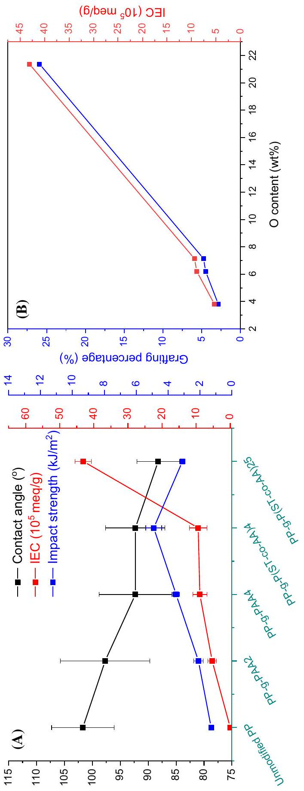
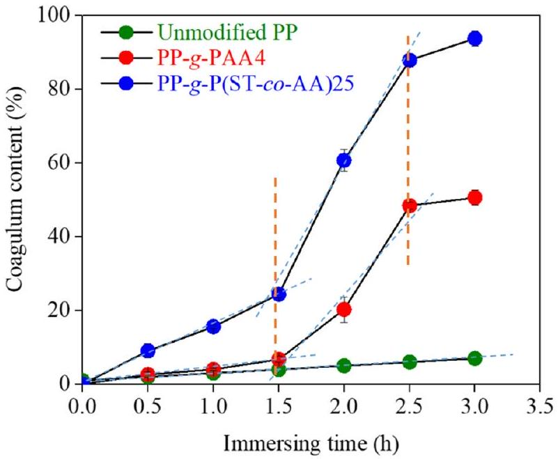
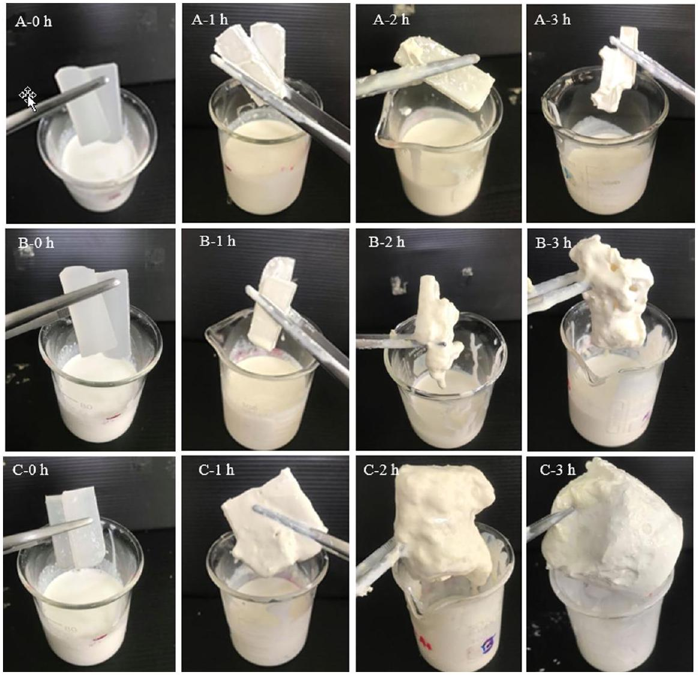
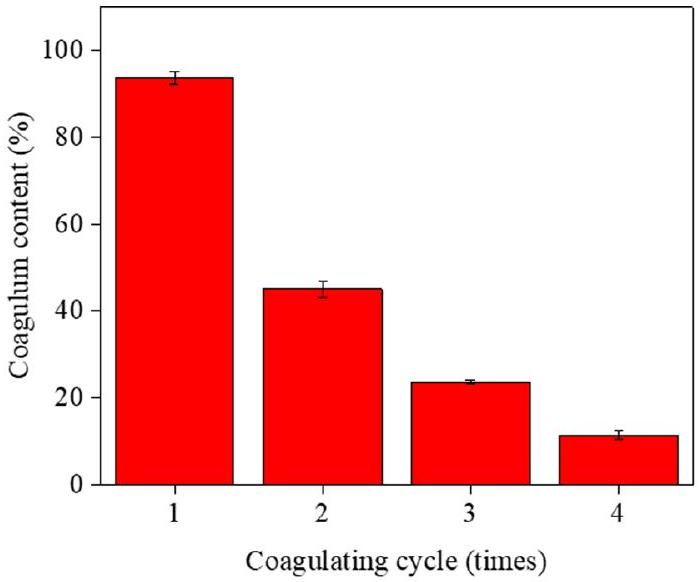
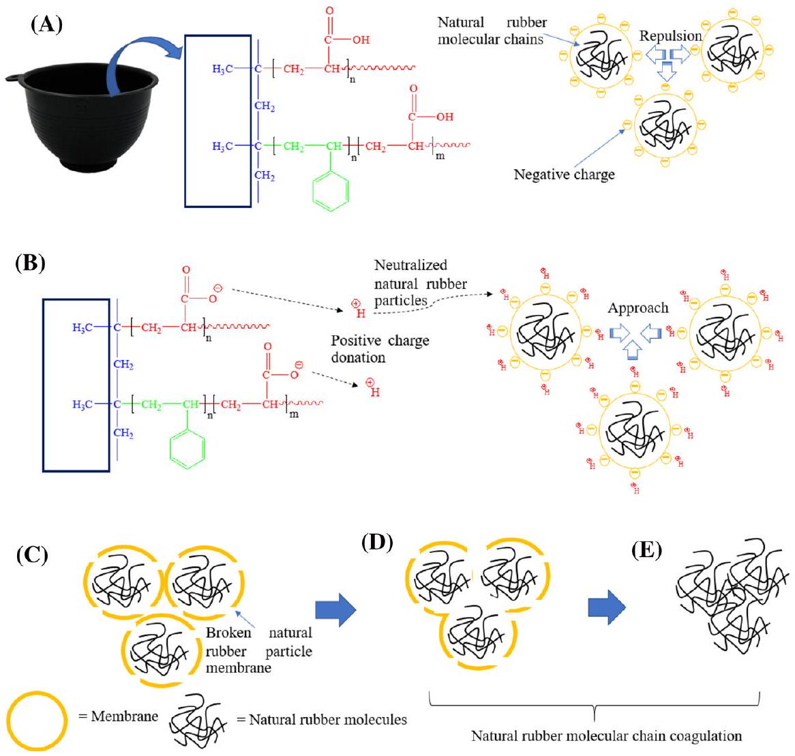

# Styrene-assisted acrylic acid grafting onto polypropylene surfaces: preparation, characterization, and an automatically latex-coagulating application 

Chaiwute Vudjung ${ }^{1}$ • Pranee Nuinu ${ }^{1}$ • Ponsakda Yupas ${ }^{1}$ • Rattapong Seelakun ${ }^{1}$ • Sayant Saengsuwan ${ }^{\mathbf{1 , 2}}$ ®

Received: 12 October 2021 / Revised: 21 February 2022 / Accepted: 22 May 2022
© The Author(s), under exclusive licence to Springer-Verlag GmbH Germany, part of Springer Nature 2022

#### Abstract

This work aimed to modify the polypropylene (PP) surface by grafting with acrylic acid (AA) monomer in toluene solution using styrene (ST) and benzoyl peroxide (BPO) as comonomer and initiator, respectively, for potential application as an automatically latex-coagulating cup. The grafting percentage of PP- $g$-PAA was slightly increased with increasing time of surface activation, grafting reaction time, and concentrations BPO and AA. Interestingly, the presence of ST comonomer significantly improved the grafting percentage of AA onto PP sheets (PP- $g$-P(ST-co-AA)) and its ion exchange capacity from 5.76 to 25\% and $8.87 \times 10^{-5}$ to $43.1 \times 10^{-5} \mathrm{meq} / \mathrm{g}$, respectively. This indicated that the incorporation of ST could significantly enhance the grafting reaction of AA onto the PP surfaces. The possible mechanism of grafting reaction was also described and demonstrated. Besides, the PP- $g$-P(ST-co-AA)25 exhibited high coagulum performance of natural rubber latex (NRL) of 93.8\% and high NRL coagulation rate of 63.5\% \%/h. Thus, the grafted PP with ST/ AA monomers as an automatically latex-coagulating cup/container could offer not only the lower production cost and lesser environmental problems but also improved properties, qualities, and price of cup lump products.

Keywords Surface modification $\cdot$ Natural rubber $\cdot$ Ion exchange capacity $\cdot$ Cup lump • Acetic acid

[^0]
## Introduction

Generally, cup lump is an upstream and important product in natural rubber (NR) industries which is mostly supplied for block rubber productions [1]. Cup lump is produced by coagulation process of the field natural rubber latex (NRL) in a cup container. The rubber particles of NRL have a core-shell structure consisting of cis-1,4-polyisoprene as a core and mixed membranes of proteins and lipids as a shell $[2-4]$. To harvest latex in the solid state, the NRL can be coagulated by either natural or chemical coagulations using the bacteria action or weak acid, respectively [2-5]. However, the natural coagulation of NRL takes very long time. Thus, weak acid is normally used instead to lessen the coagulation time. Formic and acetic acids are recommended as latex coagulant for the upstream production of NR manufacturing such as rubber sheet and cup lump but sulfuric acid $\left(\mathrm{H}_{2} \mathrm{SO}_{4}\right)$ is more popular latex coagulant used by Thailand rubber farmers due to its low price and ready to use [6]. However, it causes the lower plasticity and low final properties of rubber blocks, compared to the Standard Thailand Rubber (STR). Besides, it generates $\mathrm{H}_{2} \mathrm{SO}_{4}$ wastewater with $\mathrm{H}_{2} \mathrm{~S}$ toxic gases and rotten eggs smell [7]. Therefore, if the NRL can be automatically coagulated in a collecting cup without using any acids or with less acid content, it could not only reduce the labor time, production cost, and environmental impact but also improve the properties, qualities, and price of cup lump products. Polypropylene (PP) is well known as a commodity thermoplastic polymer used widely in several applications. It is a non-polar and mechanically rugged material with high chemical resistance and low price [8] Therefore, PP is extensively used as raw material for NRL container (cup) in Thailand. PP has also been modified for various applications such as textile dyeability, adhesion, and polarity improvement of packaging industry, plastic parts for many industries including consumer products, and elaborated membranes with specific properties [9]. Acrylic acid monomer (AA) is used as a raw material for proton exchange membrane because polyacrylic acid (PAA) is an anionic polyelectrolyte possessing the high charge density based on the dissociated carboxyl group [10]. The AA monomer is usually grafted with polyurethane and poly(ethylene terephthalate) for tissue engineering and antibacterial properties, respectively [11, 12]. Moreover, it is popularly chosen to modify the PP surface as reported by several researches [13-16]. For instance, AA monomers were grafted on PP films with grafting percentage of 34.55\% by simultaneous radiation grafting reaction to improve hydrophilicity and their biodegradability [13]. The PP monofilaments were grafted with PAA by plasma-induced graft polymerization to immobilize chitosan onto the PP filaments for enhancing the antibacterial and antifungal properties [14]. In addition, PP film was grafted with AA using photo-initiated graft polymerization and the grafted PP film was assembled with chitosan and sodium alginate to remove the trace transition metal ions which catalyze the oxidation in food [15]. PAA was also grafted on the PP surface film by radical photo-grafting polymerization but its grafting percentage was just only $12.9 \%$ for covalent bonding with specific organic molecules (dye, antimicrobial or antifungal drugs, etc.) [16]. However, the grafting percentage of

AA monomers onto the PP surface, in particular the solution free-radical polymerization, is normally low and thus inadequate to generate the enough positively charged ions for NRL coagulation process. To solve this drawback, improvement of the grafting percentage by grafting copolymerization could be an alternative pathway. Also, styrene (ST) as a comonomer is also found to be an effective way for improving the grafting degree of maleic anhydride (MA) onto the polymer matrix [17, 18]. The presence of ST comonomer generates electrons which can promote the MA activity and reduce its unsymmetrical structure and its $\pi$ radicalanion bonds [17]. For example, Phadnis et al. [18] prepared the ST/AA comonomers grafted onto fluorinated ethylene propylene copolymer via pre-irradiation technique. The grafting degree increased with increasing monomer content, radiation dose, temperature, and reaction time. Moreover, considerable researches have been devoted to graft ST/AA comonomers onto the different polymers for several application such as hydrophilic fibers, ion exchange membranes, and environment fields [19, 20]. To the best of our knowledge and the above literature reviews, the surface modification of PP grafting with ST/AA comonomers prepared by using solution free-radical polymerization has been rarely reported especially an automatically NRL coagulating application. The main aim of this study was to improve the surface-grafting degree of PP sheet with ST/AA comonomers. The PP sheet was grafted with AA in toluene using benzoyl peroxide (BPO) as an initiator. More importantly, styrene (ST) comonomers were also incorporated to enhance the grafting degree of AA monomers on the PP surfaces. The effects of time of surface activation, grafting time, concentration of BPO and AA, and ratio of ST/AA on the grafting percentage were carried out. The grafted PP samples were then characterized by FTIR, EDX, SEM, and AFM techniques. Contact angle and ion exchange capacity (IEC) including hardness and impact strength of the grafted PP samples were also investigated. Finally, the coagulation of NRL by using the grafted PP sheets was also evaluated to see their efficiency. Results reveal that the presence of ST monomer significantly enhances the grafting percentage of PP- $g$-P(ST-co-AA) which is $377 \%$ higher than that of PP- $g$-AA. And the obtained PP- $g$-P(ST-co-AA)25 sheet can be applied as an automatically latexcoagulating material and exhibits the excellent coagulum content of 93.8\%.

## Experiments

## Materials

Isotactic polypropylene (PP, 1100PK POLIMAXX) produced for rubber cup injection molding was obtained from IRPC Public Co. Ltd, Thailand. The official data sheet of manufacturer has reported that PP has a melt flow index = 15 g/10 min (230 °C and 2.16 kg, ASTM D1238), and tensile strength and elongation at yield $=36 \mathrm{~N} / \mathrm{mm}^{2}$ and 26\%, respectively. Acrylic acid (AA; Loba Chemie PVT. Co. Ltd., India), styrene (ST; Arcos Organic Co. Ltd., Belgium), and benzoyl peroxide (BPO; Arcos Organic Co. Ltd, Belgium, as initiator) were obtained for use in this work. The ST and AA monomers were firstly purified by distillation prior to use.

Acetone, xylene, toluene, NaOH, and NaCl were obtained from Fisher Chemical Co. Ltd., USA. The field natural rubber latex (NRL) was harvested from rubber trees clones RRIM 600 cultivated by Faculty of Agriculture, Ubon Ratchathani University, Thailand. The field NRL without alkaline preservation was ca. $30 \%$ dry rubber content (DRC).

## Preparation of polypropylene (PP) sheet

PP pellets were molded into a sheet (7 mm thick) by a compression molding at 210 °C for 7 min and rapidly cooled down to room temperature in cooling press. The prepared PP sheets were then cut into a rectangle bar of $13 \times 64 \times 7 \mathrm{~mm}^{3}$ and washed with an excess acetone for 10 min to remove any impurity adhered on its surface.

## Grafting reaction

In order to produce PP sheet with automatically latex-coagulating properties, the PP surface was modified by a free-radical grafting reaction with AA and ST monomers in toluene adopted from Wang et al. [21] The PP sheets were firstly washed and placed into a three-necked reaction flask with an overhead stirrer, a thermometer, a reflux condenser, and nitrogen supply. The grafting procedure can be divided into two steps as follows. In the first step, the surface activation), toluene (250 mL), and BPO (15-25 wt\% of PP) were added into the flask and kept for 0.5-2.5 h at $95 \pm 5{ }^{\circ} \mathrm{C}$. In the latter step, the grafting reaction, various AA/ST mixed solutions (150-350 mL) at volume ratios of 100/0, 90/10, 80/20, 70/30, 60/40, and 50/50 were added in the reaction flask and the grafting reaction was performed under $\mathrm{N}_{2}$ atmosphere for 1-9 h. At the predetermined time, the reaction was cooled down quickly in water bath to yield the PP- $g$-P(ST-co-AA) sheets. For comparison, the grafted PP without ST comonomer (the PP- $g$-PAA) was also prepared with the same procedures without using ST in the reaction. The chemical compositions and reaction conditions for preparation of PP- $g$-PAA and PP- $g$-P(ST-co-AA) samples are summarized in Table 1.

## Purification of grafted PP products

The grafted PP products were washed with acetone and xylene mixture (1:1 ratio) for 1 h to remove the unreacted AA, ST, and AA/ST reactants and then dried in a vacuum oven at 80 °C for 15 h until weight constants. The grafting percentage is calculated by using Eq. (1) [12].

$$
\begin{equation*}
\text { Grafting percentage }(\%)=\frac{w-w_{o}}{w_{o}} \times 100 \tag{1}
\end{equation*}
$$

where $w$ is weight of the grafted PP sheets after washing with acetone and xylene, and $w_{o}$ is weight of PP sheet before grafting.

Table 1 Chemical compositions and reaction conditions for preparation of PP-g-PAA and PP-g-P(ST-co-AA) samples
| Sample | PP- $g$-PAA | PP- $g$-P(ST-co-AA) |
| :--- | :--- | :--- |
| Surface acting step |  |  |
| PP sheets (g) | 5 | 5 |
| Toluene (mL) | 250 | 250 |
| BPO (wt\% of PP) | 15-25 | 25 |
| Reaction time (h) | 0.5-2.5 | 25 |
| Temperature ( ${ }^{\circ} \mathrm{C}$ ) | $95 \pm 5$ | $95 \pm 5$ |
| Grafting reaction step |  |  |
| AA (wt\% of PP) | 0-350 |  |
| AA/ST (wt\%) |  | 100/0, 90/10, 80/20 |
| (total weight $=250 \mathrm{wt} \%$ of PP) |  | 70/30, 60/40 and 50/50 |
| Monomer (wt\% of PP) | 150-350 | 250 |
| Reaction time (h) | 1-9 | 7 |
| Temperature ( ${ }^{\circ} \mathrm{C}$ ) | $95 \pm 5$ | $95 \pm 5$ |

## Characterizations

## FTIR spectroscopy

The chemical compositions of unmodified PP, PP- $g$-PAA, and PP- $g$-P(ST-coAA) sheets were analyzed using an attenuated total reflectance Fourier transform infrared spectrometer (ATR-FTIR, Spectrum Two, Perkin Elmer) equipped with a diamond head for 16 scans in the range between 4000 and $650 \mathrm{~cm}^{-1}$.

## Scanning electron microscopy (SEM) and energy-dispersive X-ray spectroscopy (EDX)

A field emission scanning electron microscopy (FESEM, JSM-7610F Plus, JEOL, Japan) was used to observe the surface morphology of the unmodified PP, PP$g$-PAA, and PP- $g$-P(ST-co-AA) sheets previously dried in an oven at 80 °C for 30 min . All specimens were firstly mounted onto stubs and then coated with gold plasma before observation. The SEM morphology of gold-coated samples was later taken at various magnifications. Besides, energy-dispersive X-ray spectroscopic (EDX) technique was also performed. The acquisition time was set to 196.6 s.

## Atomic force microscopy (AFM)

The AFM morphology of all the specimens (unmodified PP, PP- $g$-PAA and PP$g$-P(ST-co-AA) sheets) was taken by Park XE100 instrument (Parks Systems, South Korea). Scanning was carried out in tapping mode and collected with a unique XY $(30 \mu \mathrm{~m})$ axis at a scan rate of $2-4$ lines/s in ambient conditions. The tested
specimens were mounted onto a double-sided tape on magnetic AFM sample stubs before observation.

## Contact angle measurement

The unmodified PP, PP- $g$-PAA, and PP- $g$-P(ST-co-AA) sheets were cut into $\sim 1.0 \times 4.0 \times 0.1 \mathrm{~cm}^{3}$ dimension. The contact angle of deionized water as a test liquid on the samples was also analyzed at room temperature using a goniometer equipped with a system of drop shape analysis (DM-CE2, Kyowa, Japan). The contact angle values of all samples with maximum values of five measurements were averaged and reported.

## Ion exchange capacity

Ion exchange capacity (IEC) of the grafted PP sheets is defined as the number of exchangeable ions per dry weight of the sample (meq/g). Titration method was used, in this work, to determine the IEC of the surface of modified PP sheets, adopting from El-Arnaouty et al. [22] and Jiang and Ladewing [23]. All the grafted PP sheets (in $\mathrm{H}^{+}$form) were immersed in 3 M NaCl solution for 24 h to convert $\mathrm{H}^{+}$into $\mathrm{Na}^{+}$ forms. During the conversion process, the $\mathrm{H}^{+}$ions were released into the solution. The grafted PP sample was then removed from the solution and completely washed with DI water. Then, the released solution was titrated with 0.01 M NaOH using phenolphthalein as an indicator. The IEC value of the grafted PP samples was determined by using Eq. (2).

$$
\begin{equation*}
\operatorname{ICE}(\mathrm{meq} / g)=\frac{C V}{w_{d r y}} \tag{2}
\end{equation*}
$$

where $C$ and $V$ are the concentration and consumed volume of NaOH solution, respectively, and $w_{\text {dry }}$ is the dry weight of the grafted PP sample in the $\mathrm{H}^{+}$forms.

## Hardness analysis

The hardness of the unmodified PP, PP- $g$-PAA, and PP- $g$-P(ST-co-AA) sheets were measured using Shore durometer (Durometer GS-706G, Teclock, Japan). The hardness test was conducted on specimens according to ASTM D2240 standards, each reading was 6 mm in between each point. The maximum hardness values of 5 measurements were averaged and reported.

## Impact strength

The impact strength of the unmodified PP, PP- $g$-PAA, and PP- $g$-P(ST-co-AA) sheets were measured using Izod Impact Tester (GT 7045 Impact tester, GOTECH, Taiwan). The impact test was conducted on specimens according to ASTM D 256 standard. Dimension of Izod type impact test specimen was $64 \times 12.7 \times 3.2 \mathrm{~mm}$. Notching was made on the impact specimens in v-notch with an angle of $60^{\circ}$ and
a width of 0.25 mm. At least five replicates of each specimen were made for the impact test and the average values were reported.

## Evaluation of latex coagulation

The possible application of the grafted PP sheets as an automatically latex-coagulating container was evaluated from the efficiency of the field NRL coagulation. The coagulum content or sieve residue was chosen as coagulation of latex in this research adapting from the ISO 706. The unmodified PP, PP- $g$-PAA4, and PP-$g$-P(ST-co-AA)25 sheets (64 $\times 12.7 \times 3.2 \mathrm{~mm}^{3}$ ) were immersed in the field NRL (100 g) with impurity filtered and without alkaline preservation for 1-3 h to evaluate their coagulation efficiency. At time interval of 30 min, the coagulated NRL (including coagulum, rubberized-trapped on PP sheets, stable latex) was filtered by a sieve or stainless-steel wire cloth with an average aperture width of $180 \pm 10 \mu \mathrm{~m}$ to obtain the residue coagulum on sieve (larger coagulum was also taken from the surface of PP sheets to combine with the residue coagulum on sieve). The obtained coagulum was then compressed between two-steel rolls where the excess of serum was squeezed out and dried at $100 \pm 5$ °C until the weight was constant. The coagulum content was then calculated by using Eq. (3).

$$
\begin{equation*}
\text { Coagulum content }(\%)=\frac{w_{2}-w_{1}}{w_{o}} \times 100 \tag{3}
\end{equation*}
$$

where $w_{o}$ is the weight of dry rubber in the field NRL before coagulation testing, $w_{1}$ is the weight of test sieve or stainless-steel wire cloth, and $w_{2}$ is the dry weight of dried residue (coagulum) and sieve.

## Results and discussion

## Preparation of PP-g-PAA and PP-g-P(ST-co-AA) sheets

The main purpose of this study was to fabricate the PP sheets with the released ability of $\mathrm{H}^{+}$or positively charged ions for an automatically latex-coagulating application. To reach the goal, the AA monomer was carefully chosen to graft on the surface of PP for delivering the $\mathrm{H}^{+}$ions from its carboxylic groups (-COOH). Firstly, the reaction conditions of grafting polymerization; time of surface activation (forming the radical species on the PP surfaces), grafting time, BPO, and AA monomer concentrations were thus optimized, as shown in Fig. 1, to gain the best grafting percentage of AA onto the PP sheet. It can be seen that the grafting percentages of AA on the PP sheet are increased with increasing time of surface activation (see Fig. 1A) and BPO concentration (see Fig. 1B), yielding a maximum value at 2 h and 25 wt\% of PP, respectively. This could be due to the increase in active sites on the PP surface with increasing the time of surface activation and BPO concentration. In other words, the higher active sites result in the higher free radicals on the PP surface, subsequently accelerating the grafting reaction.

Fig. 1 The effect of (A) time of surface activation, (B) BPO concentration, (C) grafting time, and (D) AA concentration on the grafting percentage of AA on the PP surface

However, when the time of surface activation and BPO concentration were higher than 2 h and 25 wt\% of PP, respectively, the grafting percentage was slightly decreased. This may be due to the fact that when density of active sites on the PP surface was too high, the PP surface was bombarded and etched violently [24], resulting in the weight loss and the decrease of grafting percentage of AA onto the PP sheets. The effect of grafting/reaction time and AA concentration on the grafting percentage of AA onto the PP surface is also presented in Fig. 1C and D, respectively. It is obviously seen that the grafting percentage is initially increased and tends to remain steady with increasing the grafting time and AA concentration. The grafting percentage trends to linearly increase in the first 1-5 h of reaction time and reaches the maximum grafting percentage of $5.43 \%$ at 7 h of reaction time. In the first 5 h of reaction time, the AA monomers could fully contact in the rapid chain-growth reaction of PAA. After 5 h of reaction time, the active sites on the PP surface could be decreased, resulting in the reduction of grafting reaction and the termination of chain growth reaction (Fig. 1C). However, when AA concentration was higher than 250 wt\% (Fig. 1D), the grafting percentage is somewhat decreased due to the physical absorption of AA monomers onto the grafted PP surfaces and the PAA formation on the PP surface [12]. In
summary, the optimum conditions to obtain the highest grafting percentage of AA monomer onto the PP surface without ST monomer (5.43\%) were found to be as follows; time of surface activation $=2 \mathrm{~h}, \mathrm{BPO}$ content $=25 \mathrm{wt} \%$ of PP, grafting reaction time $=7 \mathrm{~h}$ and AA concentration $=250 \mathrm{wt} \%$, at a fixed temperature of 95 °C. However, these optimized conditions still provided the very low grafting percentage of AA monomer onto the PP surface which could not practically apply for an automatically latex-coagulating method in the cup lump production. In order to promote the grafting percentage of AA onto the PP surface, the graft copolymerization technique of AA and ST monomers onto the PP surface has been chosen and applied by variation of AA/ST ratios (total weight $=250 \mathrm{wt} \%$ of PP). The various ratios of AA/ST at 100/0, 90/10, 80/20, 70/30, 60/40, and 50/50 wt\% were carried out using the optimized conditions listed in Table 1. Figure 2 shows the effect of AA/ST ratios on the grafting percentage of AA/ST onto PP surfaces. It is apparent that the grafting percentage of AA on the PP surface are sharply increased with the presence of ST monomer compared to the absence one (PP- $g$-PAA; AA/ST $=100 / 0$ ). The grafting percentages of AA onto the PP surfaces are slightly increased with increasing AA/ST ratio of 90/10 wt\% and increased sharply to the maximum value of $25.91 \%$ at the AA/ST ratio of $80 / 20$ wt\%, after that they are slightly decreased. Therefore, the optimum AA/ST ratio for obtaining the highest grafting percentage of AA onto the PP sheet was 80/20 $\mathrm{wt} \%$. The highest grafting percentage of PP- $g$-P(ST-co-AA) (25.91\%) is found to be about 377\% higher than that of the PP- $g$-PAA sample without ST (5.43\%). This could be due to the more miscibility and wettability between reactive grafting ST molecules and the PP substrates [18], resulting in the higher reactivity of grafting reactions and the higher grafting percentages. Besides, it is found that solubility parameter of ST monomer $\left(9.1\left(\mathrm{cal} / \mathrm{cm}^{3}\right)^{1 / 2}\right)$ is almost similar to that of PP $\left(8.08\left(\mathrm{cal} / \mathrm{cm}^{3}\right)^{1 / 2}\right)$ and toluene $\left(8.9\left(\mathrm{cal} / \mathrm{cm}^{3}\right)^{1 / 2}\right)$ [25, 26]. Consequently, the ST monomer could interact strongly with the PP surface and react effectively with the active sites on the PP surfaces. In contrast, the grafting percentage of AA onto the PP surface without ST monomer is significantly deteriorated because the solubility parameter of AA monomer ( $14.04\left(\mathrm{cal} / \mathrm{cm}^{3}\right)^{1 / 2}$ ) is much different

Fig. 2 The effect of AA/ST weight ratios (total weight $=250$ $\mathrm{wt} \%$ of PP) on the grafting percentage of AA/ST onto the PP surface

from that of the PP substrates $\left(8.08\left(\mathrm{cal} / \mathrm{cm}^{3}\right)^{1 / 2}\right)$ [25]. Moreover, AA monomer has lesser reactivity with PP, compared to the ST monomer [27]. Similar behavior was also observed in the deproteinized NR grafted with maleic anhydride (MA) using ST monomer as an assistant monomer in the graft copolymerization. It was reported that the strong improvement of grafting percentage of MA onto the PP was because the ST molecules acted as an electron donor to activate the $\mathrm{C}=\mathrm{C}$ bonds of MA molecules by generating a charge transfer complex between them, leading to highly activates the weakly reactive double bonds of MA toward the rubber macroradicals [28]. However, it is found that when the AA/ST ratios are lower or higher than 80/20 wt\%, their AA grafting percentages are significantly lower than at the optimum ratio. At the lower ST content (10 wt\%), the free radicals on the surface of PP surface were fully contacted with ST monomers, resulting in the rapidly chain-growth reactions of ST and AA monomers. While, at the higher ST content (30-50 wt\%), the active sites on the PP surface were decreased and the chain-growth reaction was thus gradually slowed down [24]. Moreover, with the richer phase of ST monomers, polystyrene formed by the ST self-polymerization and the previous P(ST-co-AA) grafted onto the PP surface could prevent the diffusion of ST and AA molecules onto the PP surfaces, resulting in a significant lower grafting reaction and eventually low grafting percentage [29, 30].

## FTIR analysis and possible mechanism of PP-g-PAA and PP-g-P(ST-co-AA)

The chemical structures of PP- $g$-PAA and PP- $g$-P(ST-co-AA) samples washed with acetone and xylene were examined by FTIR technique as shown in Fig. 3.

Fig. 3 ATR-FTIR spectra of unmodified PP, PP- $g$-PAA, and PP- $g$-P(ST-co-AA) samples

The PP- $g$-PAA with grafting percentage of $2.86 \%$ and $4.49 \%$ and PP- $g$-P(ST-coAA) with grafting percentage of 4.77\% and 25.91\% were labeled as PP- $g$-PAA2, PP- $g$-PAA4, and PP- $g$-P(ST-co-AA)4, PP- $g$-P(ST-co-AA)25, respectively, as representative samples. For the unmodified PP sheet, it exhibits the characteristic absorption bands of -CH stretching vibration at $3000-2850 \mathrm{~cm}^{-1},-\mathrm{CH}_{3}$ bending vibration at 1458 and $1375 \mathrm{~cm}^{-1}$ and $-\mathrm{CH}_{2}$ bending vibration at $1465 \mathrm{~cm}^{-1}$. For PP-g-PAA, the presence of absorption bands at 1559 and $1406-1410 \mathrm{~cm}^{-1}$ is attributed to the stretching vibrations of carboxylate groups (-COOH) in the AA fractions. In addition, three new peaks appeared at $3000-3600,1727$ and $1167 \mathrm{~cm}^{-1}$ are ascribed to the stretching vibrations of -OH, $\mathrm{C}=\mathrm{O}$ and C-O of carboxylic groups, respectively [31]. For the FTIR spectra of PP- $g$-P(ST-co-AA) sheets, the characteristic bands of CH stretching ( $3028 \mathrm{~cm}^{-1}$ ) and $\mathrm{C}=\mathrm{C}$ out of plane bending ( 754 and $698 \mathrm{~cm}^{-1}$ ) of aromatics in the styrene structure are clearly observed [32]. Moreover, the carboxylic groups of AA monomers exhibit OH stretching vibration at $3000-3600 \mathrm{~cm}^{-1}$, C=O stretching at $1727 \mathrm{~cm}^{-1}$ and C-O stretching at $1167 \mathrm{~cm}^{-1}$. Certainly, the intensity of OH, C=O and C-O peaks are found to strongly increase with increasing grafting percentage values of the PP- $g$-P(ST-co-AA) samples. Besides, the peak at around $704 \mathrm{~cm}^{-1}$ is assigned to out-of-plane deformation of the benzene rings of ST molecules. Subsequently, these evidences could confirm that the P(ST-co-AA) copolymers were fruitfully grafted onto the PP surfaces, producing the successful PP- $g$-P(ST-co-AA) samples. As previous described, the surface modification of PP grafted with AA and ST monomers was carried out through the chemical free radical reactions in toluene solution using BPO initiator. The possible mechanism of grafting reaction of the PP- $g$-P(ST-co-AA) is graphically presented in Scheme 1. Firstly, the BPO initiator is decomposed by thermal heating at 95 °C [31] to generate two macroradicals which then interacts with hydrogen atoms (H) on the PP molecular chains to deliver the free radicals (-C) on the PP surface (see Scheme 1A). Then, these free radicals will react with the AA monomers resulting in the polymerization of AA monomers to form the PP- $g$-PAA (see Scheme 1B). In the presence of ST monomers having more reactivity, and more miscibility and wettability with PP than the AA monomers, hence in the first stage, the C radicals on the PP surface could firstly reacted with the ST monomers to polymerize with ST monomers to produce PP- $g$-PST with radicals at the ends. In the second stage, the PP- $g$-PST sections could further react with the AA monomers to produce the PP- $g$-P(ST-co-AA) (see Scheme 1C).

## Surface morphology of PP-g-PAA and PP-g-P(ST-co-AA)

Morphology, elemental quality and quantity, and topography of the unmodified PP and grafted PP sheets were performed by scanning electron microscopy (SEM), energy-dispersive X-ray spectroscopy (EDX), and atomic force microscopy (AFM) as revealed in Fig. 4. It is seen that the surface of unmodified PP sheet (Fig. 4A) is rather smooth with no wrinkles on the surface totally differing from the grafted PP sheets. While, the surface of grafted PP sheet is heterogeneous and non-uniform surface due to the considerable deposition of AA and ST monomers onto the PP

Scheme 1 The possible mechanism of PP grafted with PAA and P(ST-co-AA); (A) surface acting step, (B) PP- $g$-PAA, and (C) PP- $g$-P(ST-co-AA)

surfaces [13, 33]. The AFM analysis is usually employed to observe the surface morphology and the average surface roughness (Ra) of polymer after the grafting process. The topographical surface morphologies of the unmodified PP and all the

Fig. 4 SEM (left), AFM (middle), and EDX spectra (right) of (A) unmodified PP, (B) PP- $g$-PAA2, (C) PP- $g$-PAA4, (D) PP- $g$-P(ST-co-AA)4, and (E) PP- $g$-P(ST-co-AA)25 sheets

grafted PP sheets were therefore investigated by AFM as displayed in Fig. 4 (middle column). It is found that the surface roughness of unmodified PP $(\mathrm{Ra}=0.22 \mu \mathrm{~m})$ is smoother than that of all the grafted PP $(\mathrm{Ra}=0.63-0.76 \mu \mathrm{~m})$. In addition, the grafting percentage of both the PP- $g$-PAA and PP- $g$-P(ST-co-AA) samples are increased with increasing the surface roughness of the grafted PP samples. The surface roughness of PP is mostly related to the sites of graft initiation, frequently taking place in the amorphous regions rather than in the crystalline sections [33]. Furthermore, it is seen that the surfaces of all the grafted PP samples exhibit hill-valley structures with significant heterogeneity. However, it is also observed that the increase in grafting percentage may response to the increase in the flattening surface of the PP surface, possibly resulting from the incorporation and/or agglomeration of the P(ST-co-AA) polymer chains within the valleys (see Fig. 4D). Obviously, it is seen from Fig. 4D and E (left and middle column, respectively) that the Ra is significantly decreased from $0.72 \mu \mathrm{~m}$ to $0.33 \mu \mathrm{~m}$ when the grafting percentage is increased from 4.77\% to 25.91\%, respectively. In this case, the smoother surface of PP- $g$-P(ST-co-AA) Samples at the higher grafting levels could be due to the higher extent of homogenization [14, 34]. Similar trends of the morphological arrangement were also observed in the chitosan immobilization on the PP- $g$-PAA monofilament surfaces [14] and the glassy and rubbery polymer brush layers [34]. Therefore, from these results, it could be concluded that the P(ST-co-AA) fractions were successfully grafted on the PP surface. In order to confirm the existence of PAA on the grafted PP samples, EDX analysis was also performed in this work to detect the oxygen (O) atoms derived from the carboxylate groups (Fig. 4 (right column)). It is found that the O atoms amount on the unmodified PP surface is detected to be very low just $0.69 \mathrm{wt} \%$, resulting from some oxidation reactions took place on the surface of PP sheet during the processing at high temperature [32]. After the grafting process, the O atom amounts on all the grafted PP surfaces are found to be strongly increased when compared to that of the unmodified PP sample. For the PP- $g$-PAA samples, the O atom fractions increase from $3.80 \mathrm{wt} \%$ to $6.19 \mathrm{wt} \%$ with increasing the grafting percentage from $2.86 \%$ to $4.49 \%$, respectively. Fascinatingly, for the PP- $g-$ P(ST-co-AA) samples, the fractions of O atom are reported to be $7.14 \mathrm{wt} \%$ and $21.37 \mathrm{wt} \%$ when the grafting percentages are increased from 4.77\% to 25.91\%, respectively, which are about 1.67-5.43 times higher than those of the PP- $g$-PAA samples. These results are in good agreement with the SEM, AFM, and FTIR results. Therefore, the remarkable improvement of grafting percentage of PAA on the PP surface can be successfully obtained by using the styrene-assisted grafting reaction pathway which was already reported by many researches [35-37].

## Contact angle of PP-g-PAA and PP-g-P(ST-co-AA) sheets

Fundamentally, the contact angle is very sensitive to the chemical and structural changes occurred on the polymer surfaces because the liquid contacts outermost molecular layer of the surface [36]. In order to investigate the structural change of the unmodified PP and grafted PP surfaces, the contact angle measurement was also thus performed. The values of water contact angle on the sample sheets with different

Fig. 5 (A) Contact angle, IEC and impact strength of the unmodified PP, PP- $g$-PAA, and PP- $g$-P(ST-co-AA) sheets and (B) the relationship of grafting percentage and ICE versus the O contents of the grafted PP sheets

grafting percentages are illustrated in Fig. 5A (black line). It is seen that the value of water contact angle on the unmodified PP sheet $\left(101.7^{\circ}\right)$ is the largest value compared to all values of the grafted PP sheets (88.2-97.7°). Besides, it is observed that the contact angle values tend to decrease with increasing the grafting percentage of AA onto the PP surfaces. The lowest value of contact angle (88.2°) is exhibited by the PP-$g$-P(ST-co-AA)25 sample containing the AA grafting percentage of $25.91 \%$. This result indicates that surfaces of the grafted PP sheets have more significant polarity compared to the unmodified PP sheet due to the presence of more carboxylate groups of PAA on their surfaces. Similar behavior was also observed in the PAA grafted on the PP surface films by a radical photo-grafting polymerization [16, 38]. For example, Fasce et al. [16] reported that the values of liquid contact angle of the surface of PP- $g$-PAA were decreased from 79.7 ± 1.1° (the unmodified PP) to 18.6±3.5° (the grafted PP). Li et al. [38] also studied the adaptation and kinetics of random copolymerization composed of ST and AA monomers and reported that the receding contact angle was decreased with increasing the AA content. In conclusion, the growth of polar components could mainly contribute to the improved affinity of the grafting surfaces, directly resulting in the decrease of contact angle values and the increase of grafting percentages of AA onto the PP surfaces.

## Ion exchange capacity (IEC) of the unmodified PP and grafted PP sheets

Fundamentally, ion exchange capacity (IEC) informs us about the ion exchangeable groups presenting in a polymer matrix. The ICE values are accountable for the conduction of protons and therefore it is an indirect and reliable estimation of the proton conductivity [22, 23, 39]. The IEC values of all the grafted PP sheets are plotted in Fig. 5A (red line). It is seen that the IEC values of the grafted PP samples tend to increase with increasing the grafting percentages as shown in Fig. 5B. The IEC values of the PP-$g$-PAA samples are increased from $5.32 \times 10^{-5}$ to $8.87 \times 10^{-5} \mathrm{meq} / \mathrm{g}$ when the grafting percentages are increased from 2.28\% to 4.77\%, respectively.

Similar behavior is also observed in the PP- $g$-P(ST-co-AA) sheets. The IEC values of the PP- $g$-P(ST-co-AA)4 and PP- $g$-P(ST-co-AA)25 samples are found to be $9.4 \times 10^{-5}$ and $43.1 \times 10^{-5}$ meq $/ \mathrm{g}$, respectively. The increment of ICE values is in good agreement with the amount of oxygen atoms in the grafted PP sheets (see Fig. 4 (right column) and Fig. 5B), especially in the PP- $g$-P(ST-co-AA)25 sample. Hence, the relation between grafting percentage values, ICE values, and O contents of all the grafted PP sheets is plotted as shown in Fig. 5B. As expectedly, it is found that the increase in oxygen (O) contents results in the similar behavior of both the grafting percentages of AA onto the PP surfaces and the ICE values of the grafted PP specimen. In other words, the grafting percentages and the ICE values are correlated very well with increasing O contents on the grafted PP sheets, confirming the successful grafting reaction of AA monomers onto the PP surfaces.

## Mechanical properties of the unmodified PP and grafted PP sheets

In general, the surface modification of PP sheets via grafting copolymerization may also cause some degradations of the polymer chains. Hence, the attention needs to be taken to ensure that the mechanical properties of the PP- $g$-PAA and PP- $g$-P(ST-co-AA) samples did not suffer from the treatment. The impact strength and hardness as basic properties of the unmodified PP and grafted PP samples are measured and presented in Fig. 5A (blue line). It is seen that the impact strength of the grafted PP sheets is slightly increased with increasing grafting percentages up to 4\% and then slightly decreased. The slight increase in impact strength could be due to the formation of physical crosslinking of the grafted polymer chains and the intermolecular hydrogen bonding interactions between the grafted PAA chains [31]. However, it is found that the grafting copolymerization and the grafting percentages of AA onto the PP surface sheets did not affect significantly on the hardness properties of all PP sheets because the thickness of PAA grafted films attached onto the PP surface is very thin. As a result, the hardness values were determined to be $69.9 \pm 0.4,71.3 \pm 0.3,70.1 \pm 0.1,70.6 \pm 0.4$ and $67.9 \pm 1.8$ Shore D for the unmodified PP, PP- $g$-PAA2, PP- $g$-PAA4, PP- $g$-P(ST-co-AA)4, and PP- $g$-P(ST-co-AA)25 sample, respectively.

## Evaluation of latex coagulation

To explore the efficiency of the grafted PP sheets as an automatically latex-coagulating materials, the field NRL sample was immersed by the grafted PP sheets for 3 h to investigate the coagulum content (\%). The unmodified PP, PP- $g$-PAA4 and PP- $g$-P(ST-co-AA)25 sheets were used as representative samples. The efficiency of

Fig. 6 The coagulum content (\%) of the unmodified PP, PP- $g$-PAA4, and PP- $g$-P(ST-co-AA)25 sheets as a function of immersing time (h) (dashed lines define the rate of NRL coagulum)

Fig. 7 Latex coagulation of (A) unmodified PP, (B) PP- $g$-PAA4, and (C) PP- $g$-P(ST-co-AA)25 sheet at different soaking times (h)

coagulation was reported as the obtained coagulum content (\%) which is calculated using Eq. (3). The calculated results are presented in Fig. 6. Evidently, it is seen that the field NRL immersed with the unmodified PP sheet was stable in the latex state (see Fig. 7). Interestingly, the coagulum contents of the PP- $g$-PAA4 and PP-g-P(ST-co-AA)25 sheets at 3 h were significantly higher than that of the unmodified PP sheet. As can be seen from Fig. 6, at the immersion time of 1.0-1.5 h, the rates of coagulum content of the PP- $g$-PAA4 and PP- $g$-P(ST-co-AA)25 samples are steadily increased with immersion time. However, the coagulum content of the PP-g-P(ST-co-AA)25 sheet is significantly higher than that of the PP- $g$-PAA4 sheet. The average coagulation rate of NRL over time was evaluated by dividing the change in coagulum content or concentration by the time interval used. The instantaneous rate (d[coagulum]/dt) of coagulation can thus be obtained from the slope of the plot of coagulation content (\%) versus time (t) as presented in Fig. 6. It is obviously seen that the coagulation behavior of the NRL influenced by the grafted PP sheets
contains three stages; initial (0-1.5 h), growth (1.5-2.5 h), and equilibrium stages (>2.5 h). The calculated NRL coagulation rates of the unmodified PP, PP- $g$-PAA4, and PP- $g$-P(ST-co-AA)25 samples, at the initial stage, are found to be 0.58, 4.12, and $15.38 \% / \mathrm{h}$, respectively. While at the growth stage, the coagulum contents of the PP- $g$-P(ST-co-AA)25 and PP- $g$-PAA4 sheets are sharply increased from $24.42 \%$ to 93.8\% and from 6.77\% to 48.46\%, respectively. The coagulation rates of NRL immersed with the unmodified PP, PP- $g$-PAA4, and PP- $g$-P(ST-co-AA)25 sheets are about 1.52, 41.69 and 63.48\%/h, respectively. The significant increase in the NRL coagulation rate (63.48\%/h) caused by the PP- $g$-P(ST-co-AA)25 could mainly be due to the incorporation of ST comonomer, facilitating the remarkable grafting percentage of the PAA fractions onto the PP surface sheet. The photographs of coagulation of the NRL immersed with the unmodified PP, PP- $g$-PAA4, and PP- $g$-P(ST-co-AA)25 sheets are presented in Fig. 7. It is seen that the NRL coagulum was trapped on the surface of PP sheets. The NRL coagulum were firstly trapped by the unmodified PP, PP- $g$-PAA4, and PP- $g$-P(ST-co-AA)25 sheets at 3, 2, and 1 h, respectively. The coagulum size was increased from the beginning of the first-trapped NRL and continuously improved with increasing the immersion time. This result indicates that the hydrogen ions $\left(\mathrm{H}^{+}\right)$located on the grafted PP surfaces could neutralize and coagulate the rubber particles as proposed by the possible mechanism of coagulum process (see Fig. 9). Furthermore, the coagulum contents of PP- $g$-P(ST-co-AA)25 sheet are significantly higher than that of the PP- $g$-PAA4 and unmodified PP sheets. This is because the positively charged ions generated from the PAA grafted on the PP surface cause the instability and coagulation of the NRL particles. Thus, from this result, it could summarize that the PP surface grafted with positively charged ions or proton donors is a promising candidate to produce an automatically latexcoagulating container. The effect of coagulating cycles on the coagulum content (\%) of the PP- $g$-P(ST-co-AA)25 sheet was also investigated as shown in Fig. 8. The result demonstrates that the coagulum content of NRL decreases drastically with increasing the coagulating cycle. The coagulum contents in the 1st, 2nd, 3rd, and 4th cycles are found to be $93.8 \%, 45.0 \%, 23.7 \%$, and $11.4 \%$, respectively. The significant

Fig. 8 The effect of coagulating cycles on the coagulum content (\%) of PP- $g$-P(ST-co-AA)25 sample at 3 h

Fig. 9 Possible graphical mechanism of latex coagulation of the PP- $g$-PAA and PP- $g$-P(ST-co-AA) sheets

decrease in coagulum content with increasing the coagulating cycles could result from the reduction of the amount of $\mathrm{H}^{+}$ions which were used each coagulating cycle. Therefore, the PP- $g$-P(ST-co-AA) sheet developed in this research could be potentially applied for cup lump production, reducing an inappropriate coagulant used and being environmentally friendly. Furthermore, our result could provide the useful information for the further development of an automatically latex-coagulating PP container to have more coagulating cycles which can be eventually produced as a commercial product in the near future.

## Possible mechanism of latex coagulation by the grafted PP sheets

The possible mechanism of latex coagulation by the grafted PP sheet is schematically illustrated in Fig. 9. In the NRL state, each rubber particle is made up of rubber polymers covered by negative charges of protein membrane layers [40]. The negatively charged rubber particles repel each other, preventing themselves from
the combination and coagulation (see Fig. 9A). When the NRL is collected in the grafted PP container, the hydrogen ions $\left(\mathrm{H} .^{+}\right)$as positive charges from the carboxylic groups on the surface of grafted PP sheet will neutralize the negative charges of rubber particles and thus neutral rubber particles is then generated (see Fig. 9B). In addition, when these neutral particles collide with each other, their outer membrane layers will be broken up (see Fig. 9C). The rubber polymers are then set free and start to be coagulated by combining each rubber particles together to form a larger lump of rubber polymer which is subsequently precipitated from the latex solution (see Fig. 9D and E).

## Comparison of percentage grafting values of AA onto PP and other substrates

In order to compare the grafting percentage value of AA onto the PP sheets and other substrates, the grafting efficiency (\%), grafting methods, and potential applications are listed in Table 2. It is found that the grafting percentage of our grafted PP- $g$-P(ST-co-AA)25 sheet (25.91\%) was in gradual range compared to that of other samples attained by other grafting methods. The grafting efficiency of AA onto the different substrates is varied from the low to very high measurement values. However, according to the potential applications listed in Table 2, there is no work reporting that their modified samples have been applied as an automatically latex-coagulating application. Interestingly, even the grafting percentage of our PP-$g$-P(ST-co-AA)25 sample was in just $25.91 \%$ but it exhibited the satisfactory coagulum content of 93.8\% in the first cycle. However, the PP- $g$-P(ST-co-AA) sheet is further needed to improve their grafting percentage and their coagulating cycles for the large-scale production and commercial products on the future.

## Conclusion

The automatically latex-coagulating PP sheet was successfully fabricated by surface-grafting modification using various AA/ST monomer ratios. Grafting percentage, contact angle, and ion exchange capacity (IEC) of grafted PP sheet increased with increasing the ST-assisted grafting and AA concentration. The possible mechanism of an automatically latex-coagulating PP sheet was proposed by the fact that the negative charges on the surface of rubber particle membranes was neutralized by $\mathrm{H}^{+}$ions released from the PP- $g$-P(ST-co-AA) surfaces. The latex coagulation performance of PP- $g$-P(ST-co-AA)25 (93.8\%) and PP- $g$-PAA4 (48.46\%) at 3 h (equilibrium) was significantly higher than the unmodified PP sheet ( $5.43 \%$ ), corresponding well to the coagulation rates of 63.48, 41.69, and 1.52\%/h, respectively. Our results demonstrated that the PP- $g$-P(ST-co-AA) sheet could be used as an automatically latex-coagulating container for cup lump production, with the benefit of reducing the inappropriate coagulant acid and the environmental impact but also increase in the added value of cup lump product.

Table 2 Degree of grafting of AA onto the different substrates using several methods and their potential applications
| Sample | Grafting method | Degree of Grafting | Application | Ref. |
| :--- | :--- | :--- | :--- | :--- |
| Grafted PAA/FTO ${ }^{\mathrm{a}}$ | Plasma-initiated graft polymerization | $84 \mu \mathrm{~g} / \mathrm{cm}^{2}$ | Water-oxidation catalysts | [41] |
| PAA-PA ${ }^{\mathrm{b}}$ membrane | UV-initiated graft polymerization | $120 \mu \mathrm{~g} / \mathrm{cm}^{2}$ | Pervaporation membrane | [42] |
| PAA-g-PPM ${ }^{\text {c }}$ | Ultrasonic-assisted graft polymerization | $0.82 \mathrm{mg} / \mathrm{cm}^{2}$ | Membrane | [43] |
| AA-g-fiber. ${ }^{\text {d }}$ | Radiation-induced graft polymerization | 190\% | Pharmaceutical | [44] |
| AA-grafted fiber. ${ }^{\text {e }}$ | Electron beam polymerization | 1.63\% |  | [45] |
| PAA-g-PCL ${ }^{\text {f }}$ | Plasma-induced | $18 \mu \mathrm{~g} / \mathrm{cm}^{2}$ | Human healthcare | [46] |
| PAA-g-PET TeMs ${ }^{\mathrm{g}}$ | Photoinduced graft polymerization | $112 \mathrm{nmol} / \mathrm{cm}^{2}$ | Track-etched membrane | [47] |
| AA-g-PEEK ${ }^{\mathrm{h}}$ | UV-induced graft polymerization | $3.5 \mathrm{mg} / \mathrm{cm}^{2}$ | Knee arthroplasty | [48] |
| PP- $g-\mathrm{P}(\mathrm{ST}-c o-\mathrm{AA})$ | Free-radical polymerization | 25.91\% | An automatically latex-coagulating cup | This work |

Acknowledgements This work was financial supported by Faculty of Science, Ubon Ratchathani University. The center of excellent for innovation in chemistry (PERCH-CIC), Ministry of Higher Education, Science, Research, and Innovation are also acknowledged for some partial supports.

## Declarations

Conflict of interest The authors declare that they have no conflict of interest or personal relationships that could have appeared to influence the work reported in this paper.

## References

1. Suchat S, Theanjumpol P, Karrila S (2015) Rapid moisture determination for cup lump natural rubber by near infrared spectroscopy. Ind Crops Prod 76:772-780
2. Narongwongwattana S, Rittiron R (2015) The rapid determination of volatile fatty acid number in para rubber latex using fourier transform-near infrared spectroscopy based on quantification and discrimination model. J Innov Opt Heal Sci 8(5):1550042
3. Pamornnak B, Pipitsunthornsan P, Somwong S et al (2020) A microwave reflectometer technique for classifying a rubber cup lump. Comput Electron Agric 168:105152
4. Santipanusopon S, Riyajan S (2009) Effect of field natural rubber latex with different ammonia contents and storage period on physical properties of latex concentrate, stability of skim latex and dipped film. Phys Procedia 2:127-134
5. Bei-long Z, Hong-hai H, Yong-zhou W et al (2016) Effect of maturation time of coagulum of fresh natural rubber latex on oxidation kinetics of natural rubber. Adv Comput Sci Res 71:1244-1250
6. Nepacina MRJ, Foronda JRF, Haygood KJF et al (2019) Differentiation of rubber cup coagulum through machine learning. Sci Agric Bohem 50(1):51-55
7. Nguyen NH, Luong TT (2012) Situation of wastewater treatment of natural rubber latex processing in the Southeastern region Vietnam. J Viet Env 2(2):58-64
8. Liang F, Yuan H, Shao Q et al (2018) Study of suspension grafting process of polypropylene. Des Monomers Polym 21(1):130-136
9. Dogué LJ, Mermilliod N, Gandini A (1995) Modification of industrial polypropylene film by grafting of poly(acrylicacid). J Appl Polym Sci 56:33-40
10. Smitha B, Sridhar S, Khan AA (2004) Polyelectrolyte complexes of chitosan and poly(acrylic acid) as proton exchange membranes for fuel cells. Macromolecules 37:2233-2239
11. Butruk-Raszeja BA, Trzaskowska PA, Kuźminska A et al (2016) Polyurethane modification with acrylic acid by Ce(IV)-initiated graft polymerization. Open Chem 14:206-214
12. Abdolahifard M, Bahrami SH, Malek RMA (2011) Surface modification of PET fabric by graft copolymerization with acrylic acid and its antibacterial properties. ISRN Org Chem. https://doi.org/10.5402/2011/265415
13. Mandal DK, Bhunia H, Bajpai PK et al (2017) Optimization of acrylic acid grafting onto polypropylene using response surface methodology and its biodegradability. Radiat Phys Chem 132:71-81
14. Saxena S, Ray AR, Gupta B (2010) Chitosan immobilization on polyacrylic acid grafted polypropylene monofilament. Carbohydr Polym 82:1315-1322
15. Yu Z, Lua L, Lua L et al (2020) Multilayers assembly of bio-polyelectrolytes onto surface modified polypropylene films: Characterization, chelating and antioxidant activity. Carbohydr Polym 245:116456
16. Fasce LA, Costamagna V, Pettarin V et al (2008) Poly(acrylic acid) surface grafted polypropylene films: Near surface and bulk mechanical response. EXPRESS Polym Lett 2(11):779-790
17. Du J, Wang Y, Xie X et al (2017) Styrene-assisted maleic anhydride grafted poly(lactic acid) as an effective compatibilizer for wood flour/poly(lactic acid) bio-composites. Polym 9(11):623
18. Phadnis S, Patri M, Hande VR et al (2003) Proton exchange membranes by grafting of styreneacrylic acid onto FEP by preirradiation technique. I. Effect of synthesis conditions. J Appl Polym Sci 90:2572-2577
19. Benavides R, Urbano R, Morales-Acosta D et al (2019) Effect of gamma radiation on crosslinking, water uptake and ion exchange on polystyrene-co-acrylic acid copolymers useful for fuel cells. Int J Hydrogen Energ 44(24):12525-12528

20. Melo L, Benavides R, Martínez G et al (2017) Sulfonated polystyrene-co-acrylic acid membranes modified by transmembrane reduction of platinum. Int J Hydrogen Energ 42(51):30407-30416
21. Wang W, Wang L, Chen X et al (2006) Study on the graft reaction of poly(propylene) fiber with acrylic acid. Macromol Mater Eng 291:173-180
22. El-Arnaouty MB, Abdel Ghaffar AM, Eid M (2013) Properties of grafted polymer metal complexes as ion exchangers and its electrical conductivity. Polym Eng Sci 53(4):792-799
23. Jiang S, Ladewig BP (2017) High ion-exchange capacity semihomogeneous cation exchange membranes prepared via a novel polymerization and sulfonation approach in porous polypropylene. ACS Appl Mater Interfaces 9:38612-38620
24. Luo Z, Chen H, Xu J et al (2018) Surface grafting of styrene on polypropylene fibers by argon plasma and its adsorption-regeneration of BTX. J Appl Polym Sci 135(17):46171
25. Belmares M, Blanco M, Goddard WA III et al (2004) Hildebrand and Hansen solubility parameters from molecular dynamics with applications to electronic nose polymer sensors. J Comput Chem 25(15):1814-1826
26. Hadi AJ, Najmuldeen GF, Yusoh KB (2013) Dissolution/reprecipitation technique for waste polyolefin recycling using new pure and blend organic solvents. J Polym Eng 33(5):471-481
27. Chernikova EV, Zaitsev SD, Plutalova AV et al (2018) Control over the reactive reactivities of monomers in RAFT copolymerization of styrene and acrylic acid. RSC Adv 20(8):14300-14310
28. Wongthong P, Nakason C, Pan Q et al (2014) Styrene-assisted grafting of maleic anhydride onto deproteinized natural rubber. Eur Polym J 59:144
29. Wang D, Wang J, He S et al (2021) Efficient approach to produce functional polypropylene via solvent assisted solid-phase free radical grafting of multi-monomers. Appl Petrochem Res 11:99-111
30. El-Sayed Hegazy D (2012) Selectivity of acrylic acid radiation grafted non-woven polypropylene sheets towards some heavy metals ions. Open J Polym Chem 2:6-13
31. Abudonia KS, Saad GR, Naguib HF, Eweis M, Zahran D, Elsabee MZ (2018) Surface modification of polypropylene film by grafting with vinyl monomers for the attachment of chitosan. J Polym Res. https://doi.org/10.1007/s10965-018-1517-3
32. Hassan MIU, Taimur S, Khan IA et al (2018) Surface modification of polypropylene waste by the radiation grafting of styrene and upcycling into a cation-exchange resin. J Appl Polym Sci 47145:1-8
33. Mandal DK, Bhunia H, Bajpai PK et al (2016) Radiation-induced grafting of acrylic acid onto polypropylene film and its biodegradability. Radiat Phys Chem 123:37-45
34. Julthongpiput D, LeMieux M, Tsukruk VV (2003) Micromechanical properties of glassy and rubbery polymer brush layers as probed by atomic force microscopy. Polym 44:4557-4562
35. El-Toony MM, Abdel-Hady EE, El-Kelesh NA (2016) Application of poly (tetraflouroethylene) grafted with styrene/acrylic acid for proton exchange fuel cell. Egypt J Chem 59(5):799-818
36. Flores-Gallardo SG, Sanchez-Valdes S, Ramos De Valle LF (2001) Polypropylene/polypropylenegrafted acrylic acid blends for multilayer films: Preparation and characterization. J Appl Polym Sci 79:1497-1505
37. Dong Q, Liu Y (2004) Free-radical grafting of acrylic acid onto isotactic polypropylene using styrene as a comonomer in supercritical carbon dioxide. J Appl Polym Sci 92(4):2203-2210
38. Li X, Silge S, Saal A et al (2021) Adaptation of a styrene-acrylic acid copolymer surface to water. Langmuir 37(4):1571-1577
39. Lutful Kabir MD, Kim HJ, Choi S (2017) Comparison of several acidified chitosan/Nafion® composite membranes for fuel cell applications. J Nanosci Nanotechno 17:8128-8131
40. Berthelot K, Lecomte S, Estevez Y et al (1838) (2014) Rubber particle proteins, HbREF and HbSRPP, show different interactions with model membranes. Biochim Biophys Acta Biomembr 1:287-299
41. Badiei YM, Traba C, Rosales R et al (2021) Plasma-initiated graft polymerization of acrylic acid onto fluorine-doped tin oxide as a platform for immobilization of water-oxidation catalysts. ACS Appl Mater Interfaces 13:14077-14090
42. Ang MBMY, Huang S, Chang M et al (2020) Ultraviolet-initiated graft polymerization of acrylic acid onto thin-film polyamide surface for improved ethanol dehydration performance of pervaporation membranes. Sep Purif Technol 235:116155
43. Chen F, Xie L (2020) Enhanced fouling-resistance performance of polypropylene hollow fiber membrane fabricated by ultrasonic-assisted graft polymerization of acrylic acid. Appl Surf Sci 502:144098

44. Matsuzaki Y, Itabashi T, Kawai-Noma S et al (2019) Improvement of protein binding capacity of acrylic-acid-grafted fibers by polymer root-to-brush shift. Radiat Phys Chem 158:131-136
45. Xu L, Hu J, Ma H et al (2018) Electron-beam-induced post-grafting polymerization of acrylic acid onto the surface of Kevlar fibers. Radiat Phys Chem 145:74-79
46. Gupta B, Krishnanand K, Deopura BL (2012) Oxygen plasma-induced grafted polymerization of acrylic acid on polycaprolactone monofilament. Eur Polym J 48:1940-1948
47. Korolkov IV, Mashentseva AA, Güven O, Taltenov AA (2015) UV-induced graft polymerization of acrylic acid in the sub-micronchannels of oxidized PET track-etched membrane. Nucl Instrum Methods Phys Res Sec B: Beam Inter Mater Atoms 365:419-423. https://doi.org/10.1016/j.nimb. 2015.07.057
48. Zhao X, Xiong D, Wang K et al (2017) Improved biotribological properties of PEEK by photoinduced graft polymerization of acrylic acid. Mater Sci Eng C 75:777-783

Publisher's Note Springer Nature remains neutral with regard to jurisdictional claims in published maps and institutional affiliations.

[^0]:    Sayant Saengsuwan
    sayant.s@ubu.ac.th; sayants181@gmail.com
    ${ }^{1}$ Laboratory of Advanced Polymer and Rubber Materials (APRM), Department of Chemistry, Faculty of Science, Ubon Ratchathani University, Ubon Ratchathani, Warinchamrap 34190, Thailand
    ${ }^{2}$ Department of Chemistry and Center of Excellence for Innovation in Chemistry (PERCH-CIC), Faculty of Science, Ubon Ratchathani University, Ubon Ratchathani, Warinchamrap 34190, Thailand

