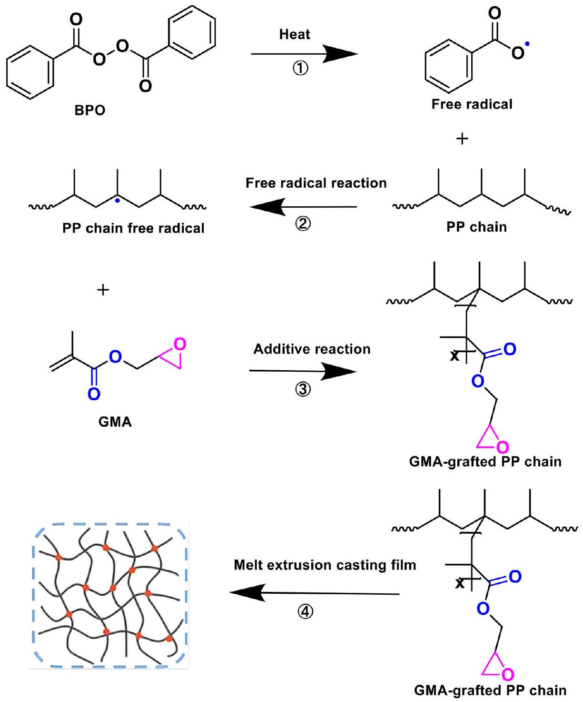
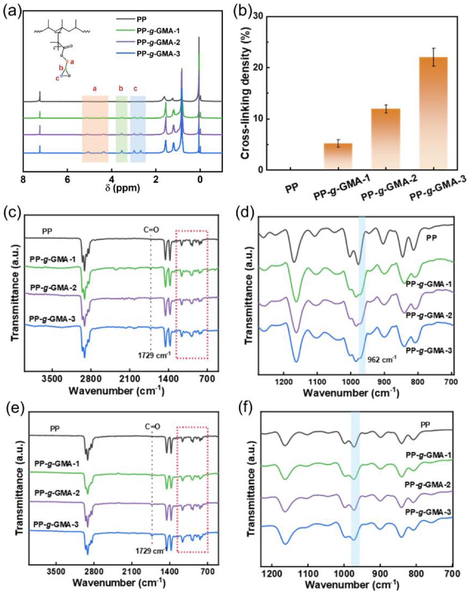
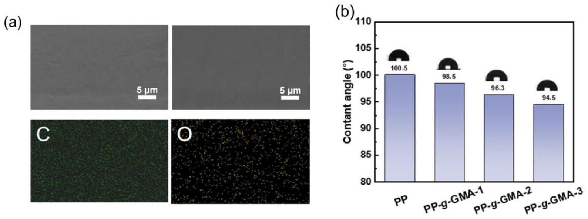
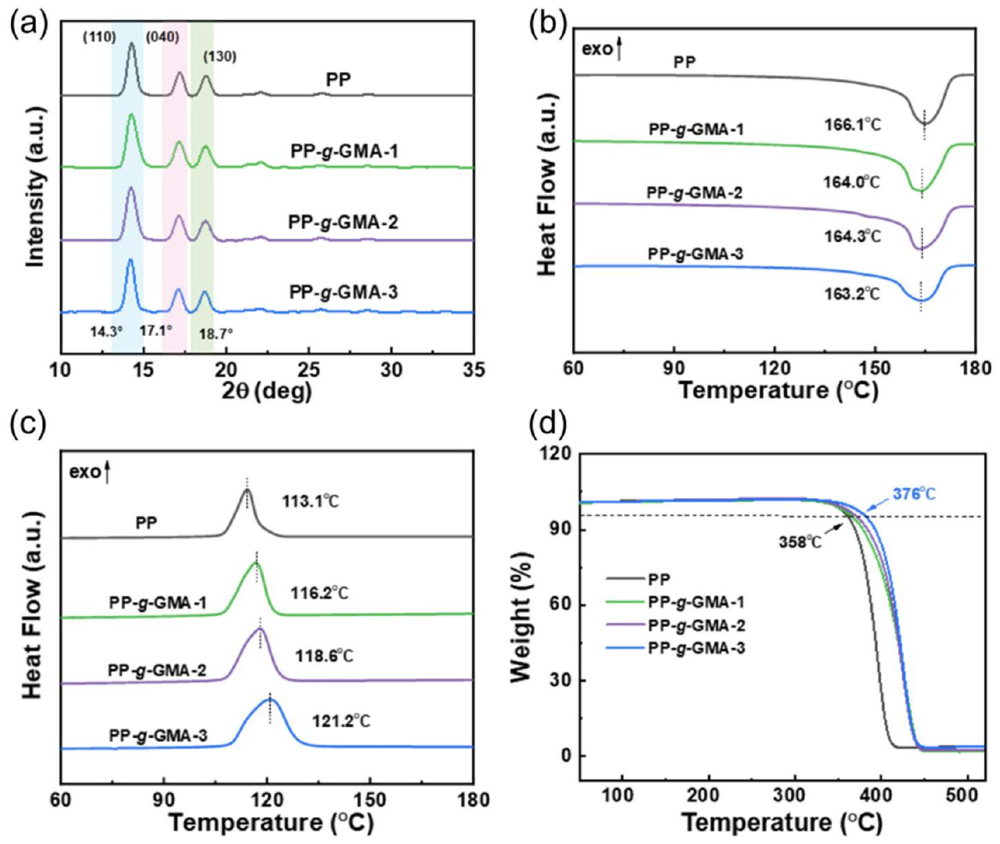
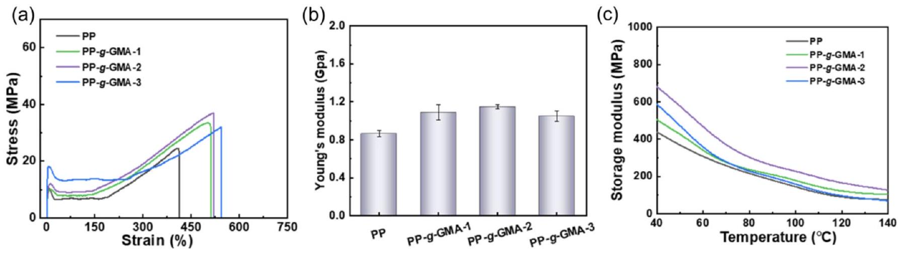
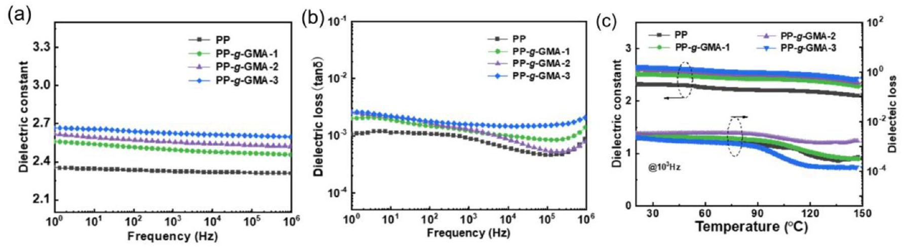
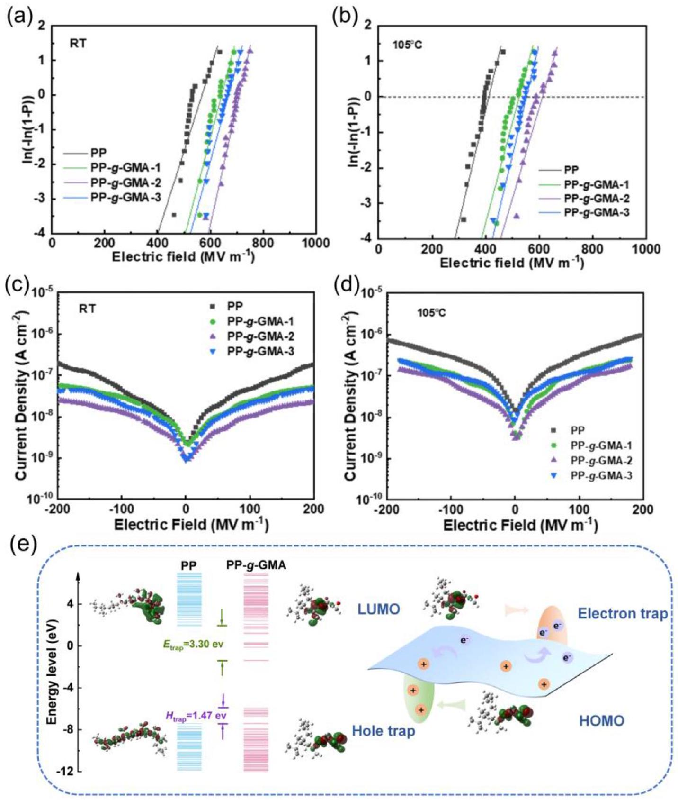
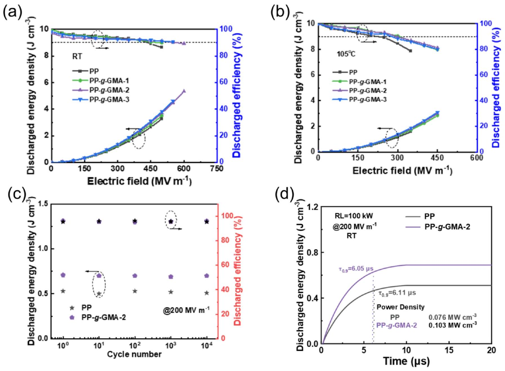

# Enhancing high-temperature resistance and energy storage properties of polypropylene via grafting with glycidyl methacrylate 

Gang Liu ${ }^{\mathrm{a}}$, Sen Meng ${ }^{\mathrm{a},{ }^{*}}$ (ㄷ), Cheng Yao ${ }^{\mathrm{a}}$, Zhiwu Xiong ${ }^{\mathrm{b}}$, Qingjiang Li ${ }^{\mathrm{b}}$, Taishan Hu ${ }^{\mathrm{a}}$, Chengqian Yi ${ }^{\mathrm{a}}$, Shangmao Hu ${ }^{\mathrm{a}}$ ${ }^{\mathrm{a}}$ Electric Power Research Institute, China Southern Power Grid, Guangzhou, 510663, PR China ${ }^{\mathrm{b}}$ Department of Power Transmission and Distribution, China Southern Power Grid, Guangzhou, 510663, PR China

ARTICLE INFO

Keywords:
Polypropylene
Graft modification
Crosslinked network
High-temperature resistance
Energy storage

#### Abstract

Conventional biaxially oriented polypropylene (PP) often suffers from elevated leakage current and reduced dielectric strength at high temperatures, preventing it from meeting the requirements for high-temperatureresistant, high-energy-density dielectric materials in advanced equipment, such as ultrahigh-voltage power transmission and new energy vehicles. This work proposes a strategy for grafting crosslinkable polar monomer glycidyl methacrylate (GMA) onto PP to improve its temperature resistance and energy storage performance. The introduction of GMA enhances the polarization capacity of PP and forms a crosslinked network structure within the matrix via the ring-opening reaction of epoxy groups, substantially strengthening intermolecular interactions and improving the mechanical and breakdown properties of PP. The modified PP exhibits a discharged energy density at 25 °C that is 60\% higher than that of pure PP and maintains excellent stability even at 105 °C. The application of chemical grafting of crosslinkable functional monomers overcomes the limitations of traditional physical modification in terms of processing properties and provides a new approach to the fabrication of hightemperature-resistant, high-energy-storage all-organic dielectrics.

## 1. Introduction

Dielectric capacitors are essential in contemporary energy storage systems because of their unique advantages, such as rapid charging and discharging capabilities and high power density [1-5]. As the core functional material of dielectric capacitors, dielectric films directly determine the energy storage performance through their dielectric constant, breakdown field strength, energy storage density, and energy release efficiency. With the rapid advancement of the global microelectronics and power electronics industries, energy storage devices must be lightweight, amenable to miniaturization, and have extended lifetimes [6-8]. Consequently, the development of high-performance polymer dielectric materials through chemical structure design and molecular functional regulation has become pivotal to enhancing the entire performance of dielectric capacitors [9-12]. Currently, biaxially oriented polypropylene (BOPP) is the most widely used film material in commercial capacitors owing to its low dielectric loss, excellent self-healing properties, and low cost [13-16]. However, traditional BOPP films exhibit an exponential decrease in resistivity at temperatures exceeding 100 °C, accompanied by a sharp increase in dielectric loss and leakage current and a reduction in breakdown voltage [17-21]. In addition, the relatively low dielectric constant $\left(\varepsilon_{r}\right)$ of BOPP limits the energy storage density ( $U_{e}$ ) to only $2-3 \mathrm{~J} \mathrm{~cm}^{-3}$ [22-24].

Recently, regulating polarization mechanisms has been widely adopted as an efficient approach to overcome these issues. The primary strategies for enhancing the dielectric constant of polymers include incorporating polar groups into molecular structures and inducing dipole orientation. For example, in polyvinylidene fluoride and its copolymers with trifluoroethylene and hexafluoropropylene, ferroelectric phase transitions increase the $\varepsilon_{r}$ by around 12 [25-27]. However, these ferroelectric polymers exhibit intense dipole reversal and nonlinear polarization under external electric fields, leading to energy release efficiencies below 60\%. In addition, the melt processing temperatures approach decomposition thresholds, resulting in narrow processing windows, challenging film formation, and poor dimensional stability [28,29]. Consequently, research attention turned to polar glassy polymers such as polyethylene terephthalate and polyphenylene oxide as alternatives to ferroelectric polymers. In such materials, the polarization

[^0]
Fig. 1. Preparation process of PP-g-GMA.

Table 1
Grafting reaction conditions for PP-g-GMA with different components.
| samples | PP/GMA (wt\%) | reaction time (h) | reaction temperature (°C) | grafting ratio |
| :--- | :--- | :--- | :--- | :--- |
| PP | 100/0 | 5 | 80 | 0 |
| PP-g-GMA-1 | 90/10 | 5 | 80 | 1.6\% |
| PP-g-GMA-2 | 80/20 | 5 | 80 | 3.3\% |
| PP-g-GMA-3 | 70/30 | 5 | 80 | 5.3\% |

process primarily originates from the cooperative orientation of dipole groups within molecular chains rather than from ferroelectric phase transitions, resulting in lower dielectric losses. Nevertheless, polar glassy polymers exhibit high structural rigidity and difficulty in chain segment orientation, yielding constrained dielectric response and typically low dielectric constants [30,31]. Moreover, these polymers demonstrate inferior processability and increased costs [32,33]. Although physical blending with fillers has been shown to be highly effective for enhancing the dielectric constant of the polymer matrix, filler agglomeration and insufficient interfacial stability limit its applicability [34].

In addition to enhancing the relative dielectric constant of polymeric dielectric materials, strategies that regulate molecular structure to improve high-temperature breakdown strength and energy storage performance have recently emerged. For instance, the introduction of polar or rigid segments into polymer matrices via molecular grafting strengthens intermolecular forces and improves thermomechanical properties and dielectric strength [35-37]. In addition, introducing specific functional groups enables molecular crosslinking, thereby restricting chain motion, suppressing charge migration, and enhancing high-temperature breakdown strength [38,39]. These approaches provide crucial theoretical foundations and design insights for overcoming the performance degradation of conventional polymers under high-temperature and high-field conditions.

This work proposes a molecular design strategy for grafting glycidyl methacrylate (GMA) onto polypropylene (PP). The incorporation of polar monomers considerably enhances the polarization capability of PP and forms a stable three-dimensional crosslinked network via the ring opening of the epoxy groups in GMA. Therefore, the high-temperature dielectric stability is enhanced and the leakage current under hightemperature and high-electric-field conditions is effectively suppressed, substantially improving energy storage performance. The

Fig. 2. (a) ${ }^{1} \mathrm{H} \mathrm{NMR} \mathrm{Spectrum} \mathrm{of} \mathrm{uncrosslinked} \mathrm{modified} \mathrm{PP}. \mathrm{(b)} \mathrm{Crosslinking} \mathrm{density} \mathrm{of} \mathrm{modified} \mathrm{PP}. \mathrm{(c)} \mathrm{FT-IR} \mathrm{spectrum} \mathrm{of} \mathrm{uncrosslinked} \mathrm{modified} \mathrm{PP} \mathrm{and} \mathrm{(d)}$ magnification at $700-1200 \mathrm{~cm}^{-1}$. (e) FT-IR spectrum of crosslinked modified PP and (f) magnification at $700-1200 \mathrm{~cm}^{-1}$.

modified PP film achieves an energy storage density of $5.22 \mathrm{~J} \mathrm{~cm}^{-3}$ under an electric field of $650 \mathrm{MV} \mathrm{m}^{-1}$, with an energy release efficiency of 88.9\%. Moreover, the material maintains an energy storage density of $3.00 \mathrm{~J} \mathrm{~cm}^{-3}$ and a release efficiency of 81.3\% at 105 °C as well as excellent cycling stability. The synergistic regulation of molecular grafting and thermal crosslinking effectively enhances the high- temperature energy storage performance of PP films. This approach enables the development of PP dielectric materials that combine highenergy-storage capacity with industrial adaptability, providing a reference for the design and application of next-generation high-performance energy storage dielectrics.

Fig. 3. (a) SEM surface morphology of PP-g-GMA-2. (b) Contact angle of the modified PP.

Fig. 4. (a) XRD curves of modified PP. (b) DSC melting curves of modified PP. (c) DSC crystallization curves of modified PP. (d) TGA curves of modified PP.

Table 2
Crystallinity of modified PP.
| samples | PP | PP-g-GMA-1 | PP-g-GMA-2 | PP- $g$-GMA-3 |
| :--- | :--- | :--- | :--- | :--- |
| Crystallinity (\%) | 41.5 | 40.8 | 38.7 | 35.9 |

## 2. Materials and methods

### 2.1. Materials

PP powder was provided by Zhongyuan Petrochemical. Glycidyl methacrylate (GMA, 99\%) was purchased from Adamas. Benzoyl Peroxide (BPO, 75\%) was provided by Sigma-Aldrich. Acetone $(\geq 99.5 \%)$ was purchased from Greagent. All the chemicals were used without further purification.

Fig. 5. (a) Stress-strain curves of modified PP. (b) Young modulus of modified PP. (c) Dynamic thermomechanical analysis (DMA) curves of modified PP.

Fig. 6. Frequency-dependent (a) dielectric constant and (b) dielectric constant curves of modified PP. (c) Temperature-dependent curves of dielectric constant and dielectric loss for modified PP.

### 2.2. Synthesis of graft-modified PP

Modified PP was synthesized using the aqueous suspension polymerization method. 4 L of deionized water and 100 g of PP powder were added to a 10 L single-layer glass reactor with nitrogen atmosphere. A xylene solution comprising GMA and BPO was slowly added dropwise to the reaction system, followed by reaction at 80 °C for 5 h. After reaction completion, the mixture was cooled to room temperature, filtered to collect the product, and thoroughly washed with acetone to remove unreacted monomer and residual initiator. Subsequently, Vacuum drying at 50 °C for 12 h to obtain the product PP-g-GMA.

### 2.3. Preparation of modified PP film

Modified film was prepared using the melt extrusion casting method. 1 kg of PP-g-GMA modified resin was fed into the casting machine (DL-LYJ-QE150) with the screw speed of 28 rpm and temperature of $230 \pm 5{ }^{\circ} \mathrm{C}$. The cast film was collected when the melt-extruded film thickness stabilizes $(10-12 \mu \mathrm{~m})$, with winding speed of 10 rpm. To evaluate polymer crosslinking, film samples were immersed in xylene solvent. After swelling equilibrium for 10 h, the crosslinking degree was measured, and each experimental group was set three replicate samples. The crosslinking degree ( $\nu$ ) of PP-g-GMA was calculated using the gravimetric method, with the formula as follows:

$$
\nu=\frac{\mathrm{m}_{0}}{\mathrm{~m}_{\mathrm{a}}} \times 100 \%
$$

where $\mathrm{m}_{0}$ is the mass of the gel at swelling equilibrium after drying, and $\mathrm{m}_{\mathrm{a}}$ is the mass of initial sample.

To evaluate the electrical properties of the film, metal electrodes were fabricated on both sides of the modified film using cryogenic magnetron sputtering system (JFC-3000FC, JEOL). Gold with a purity of 99.99\% was used as the ion sputtering target. The films were placed in fixtures with areas of $0.069 \mathrm{~cm}^{2}$ (ferroelectric property testing) and $0.785 \mathrm{~cm}^{2}$ (dielectric properties testing), respectively. Ion sputtering was performed at a chamber pressure below 3.0 Pa, with the current of 30 mA and single sputtering duration of 60 s. The dielectric material were subjected to double-sided ion sputtering, with three sputtering cycles per side. The resulting gold electrode thickness ranges from 50 to 80 nm.

### 2.4. Characterization of modified PP

Nuclear Magnetic Resonance Spectroscopy (NMR): the sample was dissolved in deuterated chloroform, with tetramethylsilane serving as the internal standard. The ${ }^{1} \mathrm{H} \mathrm{NMR}$ spectrum is collected using Nuclear Magnetic Resonance Spectroscopy (JEOL 400 MHz). The grafting ratio of PP-g-GMA can be calculated by integrating the ${ }^{1} \mathrm{H} \mathrm{NMR}$ signals. The specific calculation formula is as follows:

$$
G D \%=\frac{\frac{\int_{3.1}^{3.3} C H_{(P P-g-G M A)}}{1}}{\frac{\int_{0.8}^{1.8} C H_{(P P-g-G M A)}}{6}}
$$

where $\int_{3.1}^{3.3} C H_{(P P-g-G M A)}$ is the integral area of hydrogen atoms in the secondary methylene (-CH-) groups within the epoxy moiety, and $\int_{0.8}^{1.8}$ $C H_{(P P-g-G M A)}$ is the integral area of hydrogen atoms in the PP segment. It should be noted that the values obtained from the analysis represent the actual amount of GMA grafted onto the PP molecular chains, rather than the theoretical amount of monomer fed into the system. This results in a discrepancy between the two values. The primary reasons for this discrepancy are as follows:

Fig. 7. Weibull distribution of breakdown strength at (a) 25 °C and (b) 105 °C for modified PP. Leakage current density of modified PP at (c) 25 °C and (d) 105 °C. (e) Energy level distribution of PP and PP-g-GMA.

a) Some GMA monomers did not participate in the grafting reaction, and which were removed during the washing process.
b) GMA homopolymerization or side reactions may occur during the reaction.
c) Limitations on the grafting efficiency of free-radical grafting reactions.

Fourier Transform Infrared Spectroscopy (FT-IR): the analysis was conducted utilizing a Thermo Fisher Nicolet iS 10 spectrometer in transmission mode, encompassing 32 scans across the wavenumber spectrum from 3500 to $500 \mathrm{~cm}^{-1}$, with the objective of characterizing the polymer functional groups.

X-ray Diffraction (XRD): the crystal structure, crystallinity, and grain size of the samples were determined by Bruker D8 ADVANCE diffractometer. The scan range was set ranging from 10° to 50°, with the scan rate of $5^{\circ} \min ^{-1}$.

Scanning Electron Microscopy (SEM): the surface morphology of the films was observed using a TESCAN MAIA3 LMH microscope. The acceleration voltage and magnification were adjusted in accordance with the surface characteristics of the samples.

Contact Angle Testing: the water contact angles of the films were measured by KRUSS DSA100S surface tension meter.

Mechanical Property Testing: the Young's modulus and the elongation at break were determined using the Jinan Chenxin CMT 6401 universal tensile testing machine, with the tensile rate of $5 \mathrm{~mm} \mathrm{~min}^{-1}$.

Differential Scanning Calorimetry (DSC): the thermal transition behaviour of the samples was determined using the METTLER DSC-3 instrument within the temperature range of 40-200 °C and heating rate of $10 \mathrm{~K} \mathrm{~min}^{-1}$.

Thermogravimetric Analysis (TGA): the thermal stability of the

Fig. 8. Discharged energy density curves of modified PP at (a) 25 °C and (b) 105 °C. (c) Charge-discharge cycle of pure PP and PP-g-GMA-2 at 25 °C with the electric field of $200 \mathrm{MV} \mathrm{m}^{-1}$. (d) Power density curves of pure PP and PP-g-GMA-2 at 25 °C.

samples was evaluated using a METTLER TOLEDO TGA-2 instrument within a nitrogen atmosphere, encompassing the temperature range of 50-700 °C and heating rate of $10 \mathrm{~K} \mathrm{~min}^{-1}$.

Dynamic Mechanical Analysis (DMA): the polymer storage modulus was measured using a Netzsch DMA242E. The frequency of the signal is 1 Hz , and the heating rate is $10 \mathrm{~K} \mathrm{~min}^{-1}$. The dynamic force is, and the test temperature range is 40-140 °C.

Dielectric Property Testing (BDS): the dielectric constant and loss factor were measured using a Novocontrol Concept 80 broadband dielectric spectrometer. The test voltage was set at 1 V, and the frequency range is from $10^{7}$ to $10^{-1} \mathrm{~Hz}$, and the temperature range is from 20 to $150^{\circ} \mathrm{C}$.

Ferroelectric Property Testing: the evaluation of energy storage characteristics and leakage current was conducted utilizing PolyK FERRO20B ferroelectric analyser at the test frequency of 10 Hz. In order to ensure the stability and reliability of the P-E loop testing process, the maximum electric field in energy storage testing was limited to within 450 MV/m for PP-g-GMA-2 at 105 °C.

Breakdown Strength Testing: the breakdown electric field strength was measured by Trek 5201CE high-voltage amplifier power supply. Samples were clamped between two electrodes, and the DC voltage was increased gradually until breakdown occurred. Each sample was tested at least 50 points.

Energy level distributions simulation: The energy level distributions of PP and PPg-GMA are simulated by using Quantum Espresso. Molecular structures were constructed using Large-scale Atomic/Molecular Massively Parallel Simulator (LAMMPS) and optimized for the structure and frequency. The pure PP sample consists of nine propylene units, while the PP-g-GMA sample consists of four propylene units and one monomer unit. Quantum Espresso was used to perform density functional theory-based simulation and analysis of the molecular energy levels.

## 3. Results and discussion

PP- $g$-GMA was prepared via aqueous suspension polymerization. As shown in Fig. 1, benzoyl peroxide, as the initiator, decomposes at high temperatures to generate free radicals. These free radicals initially attack the tertiary carbon atoms on the PP chains, forming PP radicals that react with the GMA monomers.

Table 1 summarizes the composition of the PP- $g$-GMA samples prepared under different grafting reaction conditions.

To verify the grafting reaction of PP, a PP- $g$-GMA sample was characterized using ${ }^{1} \mathrm{H}$ nuclear magnetic resonance spectroscopy. As shown in Fig. 2a, the peaks at 2.6-2.8 and 3.1-3.3 ppm can be attributed to the methylene $\left(-\mathrm{CH}_{2}-\right)$ group and the methenyl (-CH-) group within the epoxy moiety, respectively, and those at 3.5-4.3 ppm are due to the $-\mathrm{CH}_{2}-$ group adjacent to the epoxy. As the GMA monomer content increases, the proton signals of the epoxy group intensify considerably, indicating the successful grafting of GMA onto the PP backbone. Furthermore, the characteristic peaks at $0.8-1.8 \mathrm{ppm}$ correspond to PP. Fig. 2b shows the crosslinking degrees calculated using the swelling
method, demonstrating that an increase in the grafting ratio increases the number of crosslinking sites in the matrix, leading to a higher crosslinking degree.

Further confirmation of the structural characteristics of PP- $g$-GMA was provided by FT-IR spectroscopy. Thus, the appearance of a distinct stretching vibration absorption peak for carbonyl (C=O) at $1729 \mathrm{~cm}^{-1}$ in the FT-IR spectra of the PP- $g$-GMA samples compared with that of pure PP indicates the grafting of GMA onto the PP backbone (Fig. 2c). In addition, the decrease in the intensity of the peak at $962 \mathrm{~cm}^{-1}$ attributed to the epoxy group (Fig. 2d) after the epoxy ring-opening reaction indicates the occurrence of crosslinking reactions (Fig. 2e and f). Notably, the intensity of the carbonyl absorption peak increases with rising GMA content, indicating that more GMA monomers are being effectively grafted onto the PP backbone.

The scanning electron microscopy (SEM) image in Fig. 3a shows that the surface of the PP- $g$-GMA-2 sample is smooth and dense, with no evident defects or phase separation. Energy-dispersive X-ray spectroscopy analysis reveals a uniform distribution of C and O elements on the sample surface, confirming the homogeneity of PP- $g$-GMA. As shown in Fig. 3b, with increasing GMA grafting ratio, the surface contact angle of the PP- $g$-GMA film decreases and hydrophilicity increases, indicating that the PP- $g$-GMA surface possesses more polar functional groups. In particular, the contact angle of the PP- $g$-GMA-3 film decreases to 94.5°, a reduction of approximately 6.0\% relative to that of pure PP.

The crystallization behavior of PP- $g$-GMA was analyzed via X-ray diffraction (XRD) and differential scanning calorimetry (DSC). As shown in Fig. 4a, the XRD patterns of the PP and PP- $g$-GMA samples exhibit distinct diffraction peaks at 14.3°, 17.1°, and 18.7°, corresponding to the (110), (040), and (130) crystal planes of the $\alpha$ phase, respectively. This indicates that the grafting modification does not alter the crystalline phase type of PP. As shown in Fig. 4b and c, the DSC results reveal that the melting temperature $\left(T_{m}\right)$ of the PP- $g$-GMA samples decreases with increasing GMA grafting ratio, whereas the crystallization peak temperature ( $T_{c}$ ) increases from 113.1 °C for pure PP to 121.2 °C. Despite this increase in $T_{c}$, the calculated crystallinity $\left(\chi_{c}\right)$ (Table 2) indicates that the overall crystallinity of PP- $g$-GMA slightly decreases. This phenomenon is primarily attributable to the active epoxy groups in the GMA molecules, which form partial crosslinked network structures during ring-opening reactions. These structures impede the regular stacking of chain segments and consequently inhibit further crystal growth. Notably, the elevated $T_{c}$ indicates that GMA monomers act as heterogeneous nucleating agents during crystallization, promoting nucleation and accelerating crystallization rates, thereby optimizing the crystallization behavior of PP.

Thermal decomposition analysis (TGA) indicates that the thermal decomposition temperatures of pure PP and the PP- $g$-GMA-1, PP- $g$-GMA-2, and PP- $g$-GMA-3 samples are 358 °C, 366 °C, 370 °C, and 376 °C, respectively. This increase in thermal decomposition temperature with increasing GMA content indicates improved thermal stability (Fig. 4d). This can be primarily attributed to the crosslinked network formed via the ring-opening reaction of epoxy groups, which enhances the thermal stability of the matrix and effectively delays thermal degradation.

The internal crosslinking network of PP- $g$-GMA results in enhanced mechanical properties. As shown in Fig. 5a and b, the Young's modulus of PP- $g$-GMA first increases and then decreases with increasing GMA grafting ratio. This is primarily due to the increase in molecular chain rigidity stemming from the formation of a moderate three-dimensional crosslinked network at appropriate grafting ratios. However, when the grafting ratio is excessively high, overcrosslinking disrupts the regular stacking of crystals and restricts the ordered arrangement of molecular chains, leading to a decrease in modulus. The dynamic thermomechanical analysis (DMA) of the PP- $g$-GMA samples is illustrated in Fig. 5c. At 40 °C, the storage modulus of PP-g-GMA-2 is 682 MPa, approximately 1.6 times that of pure PP. However, the storage modulus decreases with further increasing grafting ratio. This result aligns with the mechanical property, indicating that moderate crosslinking density is essential for enhancing thermomechanical stability while preserving chain segmental mobility.

Fig. 6a and b shows the frequency dependence of $\varepsilon_{r}$ and dielectric loss $(\tan \delta)$ for the PP- $g$-GMA samples under low electric field conditions. All samples exhibit excellent frequency stability across the frequency range of $10^{2}-10^{6} \mathrm{~Hz}$. With increasing GMA grafting content, the dielectric constant increases approximately by 17\%, from 2.3 for pure PP to 2.7 for PP-g-GMA-3 (at 1 kHz). This enhancement can be ascribed to the high dipole moment of the GMA monomer (2.95 D), which substantially enhances the dipole polarization capability of PP. Concurrently, the relaxation from the orientation polarization of polar groups also increases dielectric loss. Fig. 6c illustrates the temperature dependence of the dielectric properties at 1 kHz from 20 °C to 150 °C for the PP- $g$-GMA samples. Across the entire temperature range, all samples exhibit stable dielectric constants, with dielectric losses remaining at the same order of magnitude, demonstrating excellent dielectric stability.

The introduction of GMA substantially enhances the breakdown strength of PP. In particular, the breakdown strength increases by approximately 23.7\% for PP- $g$-GMA-2 at room temperature (25 °C), from $557 \mathrm{MV} \mathrm{m}^{-1}$ for pure PP to $689 \mathrm{MV} \mathrm{m}^{-1}$ (Fig. 7a). This enhancement can be attributed to the localized crosslinking network within the PP- $g$-GMA molecules, which strengthens intermolecular interactions and suppresses the formation and propagation of electrical dendrites. However, as the GMA grafting ratio is further increased to 4.6\%, the breakdown strength decreases due to local electric field distortion caused by the uneven distribution of the polar monomer molecules. Furthermore, at high temperatures, the PP- $g$-GMA samples exhibit exceptional dielectric breakdown stability. As shown in Fig. 7b, the breakdown field strength of PP- $g$-GMA-2 reaches $561 \mathrm{MV} \mathrm{m}^{-1}$ at $105^{\circ} \mathrm{C}$, representing an enhancement of approximately 40\% over pure PP. This result indicates that the crosslinked structure effectively restricts carrier migration at high temperatures.

Leakage current is a critical parameter for evaluating the insulation performance and reliability of dielectric materials. As shown in Fig. 7c, at $200 \mathrm{MV} \mathrm{m}^{-1}$, the leakage current density of the PP-g-GMA samples remains within the range of $10^{-7}-10^{-8} \mathrm{Acm}^{-2}$ at room temperature, considerably lower than that of pure PP; however, the values substantially increase as the temperature rises to 105 °C (Fig. 7d). Among them, the leakage current of pure PP increases the most, whereas the PP-g-GMA samples still exhibit excellent suppression of leakage current. This phenomenon is due to the three-dimensional crosslinked structure, which effectively restricts free electron transitions, thereby endowing the material with outstanding high-temperature dielectric stability.

At the molecular level, the energy level of the lowest unoccupied molecular orbital reflects the capacity for electron capture, with a lower energy level indicating stronger electron trapping capability. Fig. 7e shows the molecular orbital energy level results for PP- $g$-GMA. The electron capture depth of the PP- $g$-GMA film is 3.30 eV, effectively suppressing carrier migration and accumulation, reducing leakage current, and markedly enhancing stability and reliability under hightemperature and high-electric-field conditions.

The discharged energy density and discharged efficiency of the PP- $g$ -GMA samples were obtained by integrating the electrical hysteresis loop. As shown in Fig. 8a, at 25 °C, PP-g-GMA-2 displays a discharged energy density of $5.22 \mathrm{~J} \mathrm{~cm}^{-3}$ under an electric field of $650 \mathrm{MV} \mathrm{m}^{-1}$, approximately 1.6 times that of pure $\operatorname{PP}\left(3.26 \mathrm{~J} \mathrm{~cm}^{-3}\right)$, and a discharged efficiency of $88.9 \%$. This indicates that grafting GMA monomers enhances dielectric polarization capability while maintaining low dielectric loss, enabling efficient energy conversion. Furthermore, at 105 °C, PP-g-GMA-2 still exhibits a discharged energy density of $3.00 \mathrm{~J} \mathrm{~cm}^{-3}$ and a discharged efficiency of $81.3 \%$ (Fig. 8b). To further evaluate the practical application potential of PP- $g$-GMA, continuous charge-discharge cycling tests were conducted on PP and PP-g-GMA films under an electric field of $200 \mathrm{MV} \mathrm{m}^{-1}$. As shown in Fig. 8c, both pure PP and PP-GMA-2 exhibit excellent charge-discharge cycling stability after 10,000 cycles. Fig. 8d shows the power density curves of the PP- $g$-GMA
samples. The power density of PP-g-GMA-2 reaches 0.103 MW cm ${ }^{-3}$, representing an approximate 43\% increase compared with pure PP $\left(0.076 \mathrm{MW} \mathrm{cm}^{-3}\right)$. In addition, the discharge time constant $\tau_{0.9}$ is 6.05 $\mu \mathrm{s}$, approximately $0.06 \mu \mathrm{~s}$ lower than that of pure PP, indicating rapid and efficient energy release.

## 4. Conclusion

Herein, PP- $g$-GMA polymers were successfully prepared using the aqueous suspension grafting method and their molecular composition, microstructure, mechanical properties, and dielectric energy storage characteristics were systematically investigated. The following conclusions can be drawn from the results.

1) GMA forms a crosslinked network structure between PP molecular chains, increasing the thermal decomposition temperature by approximately 12 °C relative to pure PP, imparting excellent thermal stability. However, this process concomitantly imposes constraints on the mobility of the molecular chains, resulting in a slight decrease in crystallinity.
2) GMA considerably enhances the dipole polarization ability of PP. Optimal electrical performance is observed at a grafting ratio of 3.3\%; the discharged energy density and discharged efficiency are $5.22 \mathrm{~J} \mathrm{~cm}^{-3}$ and $88.9 \%$, respectively, at 25 °C and $3 \mathrm{~J} \mathrm{~cm}^{-3}$ and >81.3\% at 105 °C.
3) The experimental results and molecular simulations indicate that PP-$g$-GMA displays enhanced electron capture capability at high temperatures. This property effectively suppresses carrier migration, reduces leakage current, and enhances energy storage performance.

## CRediT authorship contribution statement

Gang Liu: Conceptualization, Funding acquisition, Methodology, Supervision. Sen Meng: Data curation, Funding acquisition, Investigation, Writing - original draft. Cheng Yao: Formal analysis, Validation, Writing - review \& editing. Zhiwu Xiong: Investigation, Project administration, Resources. Qingjiang Li: Methodology, Project administration, Resources. Taishan Hu: Methodology, Validation, Writing -review \& editing. Chengqian Yi: Data curation, Formal analysis, Writing - original draft. Shangmao Hu: Funding acquisition, Supervision, Writing - review \& editing.

## Declaration of competing interest

The authors declare that they have no known competing financial interests or personal relationships that could have appeared to influence the work reported in this paper.

## Acknowledgements

This work was supported by the National Natural Science Foundation of China (NNSFC grants 52503033).

## Data availability

Data will be made available on request.

## References

[1] L. Xing, Q. Li, G. Zhang, X. Zhang, F. Liu, L. Liu, Y. Huang, Q. Wang, Self-healable polymer nanocomposites capable of simultaneously recovering multiple functionalities, Adv. Funct. Mater. 26 (2016) 3524-3531.
[2] T. Zhang, H. Yu, Y.H. Jung, C. Zhang, Y. Feng, Q. Chen, K.J. Lee, Q. Chi, Significantly improved high-temperature energy storage performance of BOPP films by coating nanoscale inorganic layer, Energy Environ. Mater. 7 (2024) e12549.
[3] D. Ma, J. Hou, G. Zhang, S. Meng, R. Zhang, J. Xiong, W. He, X. Zhang, M. Zhang, Z. Zhang, Significantly enhancing the energy-storage properties of polypropylenefilms by physically manipulating their permittivity and crystalline behavior with polar organic molecules, Adv. Funct. Mater. 35 (2025) 2418631.
[4] W. Li, Q. Wang, G. Zhang, Y. He, B. Qin, X. Zhang, Z. Liu, H. Gong, Z. Zhang, Ultrahigh energy density achieved at high efficiency in dielectric capacitors by regulating $\alpha$-Phase crystallization in polypropylene films with fluorinated groups, Adv. Funct. Mater. 34 (2024) 2410959.
[5] C. Bi, C. Xie, Q. Wang, D. Zhang, A. Zhong, H. Cai, Y. Han, J. Fu, Q. Li, R. Wang, Polymer dielectrics with customized substituent for high temperature capacitive energy storage, Energy Storage Mater. 86 (2026) 104945.
[6] H. Liu, B.X. Du, M. Xiao, T. Tanaka, High-temperature performance of dielectric breakdown in BOPP capacitor film based on surface grafting, IEEE Trans. Dielectr. Electr. Insul. 28 (2021) 1264-1272.
[7] J. Xiong, X. Wang, X. Zhang, Y. Xie, J. Lu, Z. Zhang, How the biaxially stretching mode influence dielectric and energy storage properties of polypropylene films, J. Appl. Polym. Sci. 138 (2021) 50029.
[8] M. Jarvid, A. Johansson, V. Englund, A. Lundin, S. Gubanski, C. Müller, M. R. Andersson, High electron affinity: a guiding criterion for voltage stabilizer design, J. Mater. Chem. A 3 (2015) 7273-7286.
[9] B. Du, J. Zhang, M. Xiao, H. Liu, Z. Ran, J. Xing, Improvement of dielectric properties of polypropylene films for capacitors based on metal-ash suppression, Mater. Today Commun. 32 (2022) 104189.
[10] S. Zhong, X. Liu, S. Zheng, M. Lv, Q. Wang, J. Song, S. Sun, High-temperature dielectric energy storage boosted by electron beam-induced grafting of glycidyl methacrylate onto polypropylene films, Polymer 346 (2026) 129670.
[11] K. Chen, B.X. Du, H. Liu, M. Xiao, Enhanced high-temperatures energy storage performance of BOPP film via surface grafting modification, Chem. Eng. J. 505 (2025) 159724.
[12] R. Wang, Y. Zhu, S. Huang, J. Fu, Y. Zhou, M. Li, L. Meng, X. Zhang, J. Liang, Z. Ran, M. Yang, J. Li, X. Dong, J. Hu, J. He, Q. Li, Dielectric polymers with mechanical bonds for high-temperature capacitive energy storage, Nat. Mater. 24 (2025) 1074-1081.
[13] Y. Gong, W. Xu, D. Chen, Y. Ma, C. Zhao, W. Yang, All-organic sandwich-structured BOPP/PVDF/BOPP dielectric films with significantly improved energy density and charge-discharge efficiency, Chem. Eng. J. 458 (2023) 141525.
[14] M. Ritamäki, I. Rytöluoto, K. Lahti, Performance metrics for a modern BOPP capacitor film, IEEE Trans. Dielectr. Electr. Insul. 26 (2019) 1229-1237.
[15] A. Yadegari, T. Ebel, Exploring modification strategies to enhance energy storage performance of BOPP dielectric films, J. Mater. Chem. A 13 (2025) 30768-30795.
[16] K. Zhang, J. Yao, F. Zhu, Y. Gao, Y. Gu, Y. Guo, Y. Sun, Y. An, Recent advances in preparation and application of BOPP film for energy storage and dielectric capacitors, Molecules (2025) 1596.
[17] C. Zhang, Y. Zhao, H. Ye, J.-J. Xu, Y. Zhou, F. Luo, Q. Pan, J. Xu, The effect of temperature on the energy storage performance of BOPP film, Mater. Lett. 386 (2025) 138230.
[18] Q. Li, F.-Z. Yao, Y. Liu, G. Zhang, H. Wang, Q. Wang, High-temperature dielectric materials for electrical energy storage, Annu. Rev. Mater. Res. 48 (2018) 219-243.
[19] H. Wu, F. Zhuo, H. Qiao, L. Kodumudi Venkataraman, M. Zheng, S. Wang, H. Huang, B. Li, X. Mao, Q. Zhang, Polymer-/Ceramic-based dielectric composites for energy storage and conversion, Energy Environ. Mater. 5 (2022) 486-514.
[20] J.-Y. Pei, L.-J. Yin, S.-L. Zhong, Z.-M. Dang, Suppressing the loss of polymer-based dielectrics for high power energy storage, Adv. Mater. 35 (2023) 2203623.
[21] R. Wang, Y. Zhu, J. Fu, M. Yang, Z. Ran, J. Li, M. Li, J. Hu, J. He, Q. Li, Designing tailored combinations of structural units in polymer dielectrics for high-temperature capacitive energy storage, Nat. Commun. 14 (2023) 2406.
[22] F. Zheng, Y. Miao, J. Dong, Z. An, Q. Lei, Y. Zhang, Space charge characterization in biaxially oriented polypropylene films, IEEE Trans. Dielectr. Electr. Insul. 23 (2016) 3102-3107.
[23] Y. Zhou, J. Hu, B. Dang, J. He, Mechanism of highly improved electrical properties in polypropylene by chemical modification of grafting maleic anhydride, J. Phys. D Appl. Phys. 49 (2016) 415301.
[24] S. Meng, C. Yao, G. Liu, X. Lin, L. Jia, S. Hu, H. Liu, Q. Mei, Enhanced breakdown and energy storage performance of capacitor films via heterogeneous nucleation and high-temperature annealing, ACS Omega 10 (2025) 22711-22718.
[25] K. Han, Q. Li, C. Chanthad, M.R. Gadinski, G. Zhang, Q. Wang, A hybrid material approach toward solution-processable dielectrics exhibiting enhanced breakdown strength and high energy density, Adv. Funct. Mater. 25 (2015) 3505-3513.
[26] Y. Huang, D.L. Elder, A.L. Kwiram, S.A. Jenekhe, A.K.Y. Jen, L.R. Dalton, C. K. Luscombe, Organic semiconductors at the university of Washington: Advancements in materials design and synthesis and toward industrial Scale production, Adv. Mater. 33 (2021) 1904239.
[27] L. Ma, Q. Zhang, C. Cui, Q. Zhong, X. Chen, Z. Li, A. Mariappan, Y. Cheng, Z. Zhang, Y. Zhang, Introduction of a stable radical in polymer capacitor enables high energy storage and pulse discharge efficiency, Chem. Mater. 32 (2020) 9355-9362.
[28] H.M. Banford, R.A. Fouracre, A. Faucitano, A. Buttafava, F. Martinotti, The influence of chemical structure on the dielectric behavior of polypropylene, IEEE Trans. Dielectr. Electr. Insul. 3 (1996) 594-598.
[29] X. Chen, Y. Wang, D. He, Y. Deng, Enhanced dielectric performances of polypropylene films via polarity adjustment by maleic anhydride-grafted polypropylene, J. Appl. Polym. Sci. 134 (2017) 45029.
[30] J. Chen, Z. Pei, Y. Liu, K. Shi, Y. Zhu, Z. Zhang, P. Jiang, X. Huang, Aromatic-Free polymers based all-organic dielectrics with breakdown self-healing for high-temperature capacitive energy storage, Adv. Mater. 35 (2023) 2306562.
[31] Q.-K. Feng, S.-L. Zhong, J.-Y. Pei, Y. Zhao, D.-L. Zhang, D.-F. Liu, Y.-X. Zhang, Z.-M. Dang, Recent progress and future prospects on all-organic polymer dielectrics for energy storage capacitors, Chem. Rev. 122 (2022) 3820-3878.

[32] Y. Cheng, Q. Ji, B. Zhu, X. Zhang, H. Gong, Z. Zhang, Manipulating fluorine induced bulky dipoles and their strong interaction to achieve high efficiency electric energy storage performance in polymer dielectrics, Chem. Eng. J. 476 (2023) 146738.
[33] Q. Li, Y. He, S. Tan, B. Zhu, X. Zhang, Z. Zhang, Dielectric elastomer with excellent electromechanical performance by dipole manipulation of poly(vinyl chloride) for artificial muscles under low driving voltage application, Chem. Eng. J. 441 (2022) 136000.
[34] X. Li, Y. Xie, J. Xiong, D. Long, J. Zhang, B. Zhu, X. Zhang, X. Duan, Z. Liu, Z. Zhang, X. Huang, Structural tailoring enables ultrahigh energy density and charge-discharge efficiency of PAEK copolymer dielectrics at high temperatures, Chem. Eng. J. 466 (2023) 143324.
[35] G. Zhang, H. Li, M. Antensteiner, T.C.M. Chung, Synthesis of functional polypropylene containing hindered phenol stabilizers and applications in metallized polymer film capacitors, Macromolecules 48 (2015) 2925-2934.
[36] Y. Zhang, W. Zhang, Q. Li, C. Chen, Z. Zhang, Design and fabrication of a novel humidity sensor based on ionic covalent organic framework, Sens. Actuators, B 324 (2020) 128733.
[37] S. Meng, C. Yao, G. Liu, X. Lin, L. Jia, S. Hu, T. Hu, L. Yao, Tuning the electron trapping for enhancing the dielectric energy storage performance of polypropylene, J. Appl. Polym. Sci. 142 (2025) e57162.
[38] B. Zhang, X.-m. Chen, W.-w. Wu, A. Khesro, P. Liu, M. Mao, K. Song, R. Sun, D. Wang, Outstanding discharge energy density and efficiency of the bilayer nanocomposite films with BaTiO3-dispersed PVDF polymer and polyetherimide layer, Chem. Eng. J. 446 (2022) 136926.
[39] G. Zhang, C. Nam, T.C.M. Chung, L. Petersson, H. Hillborg, Polypropylene copolymer containing cross-linkable antioxidant moieties with long-term stability under elevated temperature conditions, Macromolecules 50 (2017) 7041-7051.

[^0]:    * Corresponding author.
    E-mail address: mengsen@csg.cn (S. Meng).

