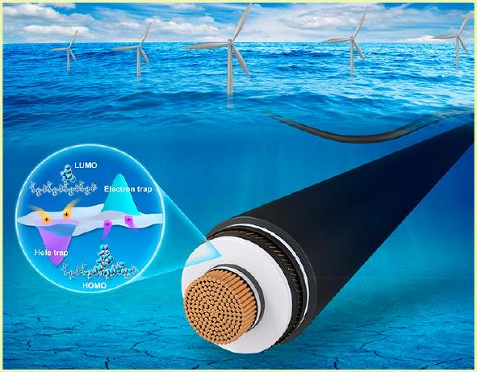
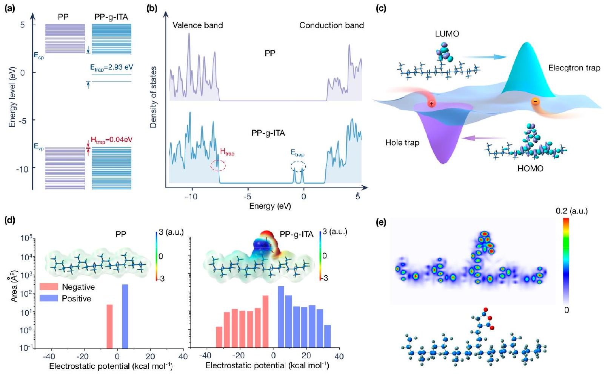
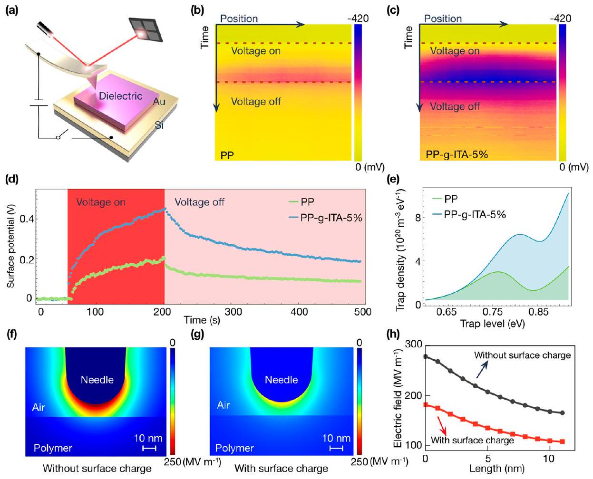
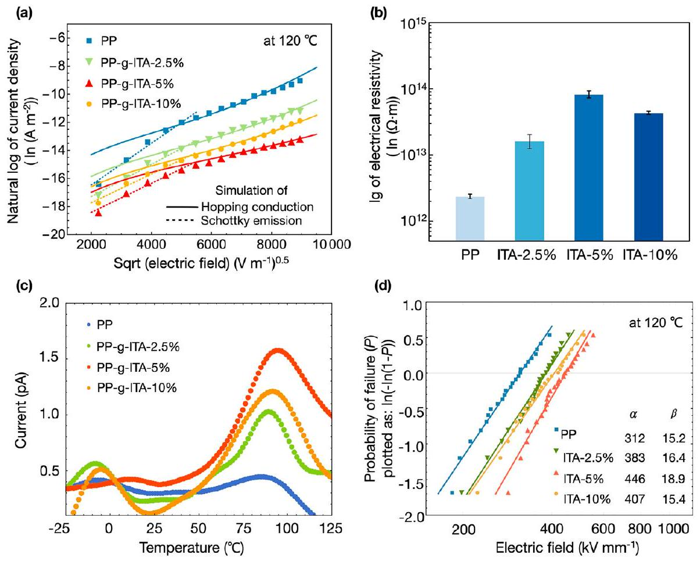
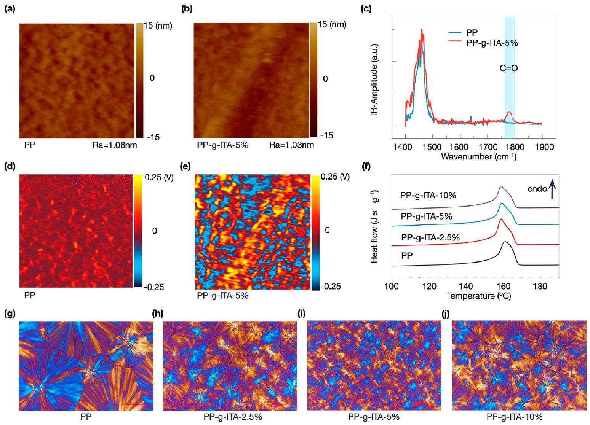
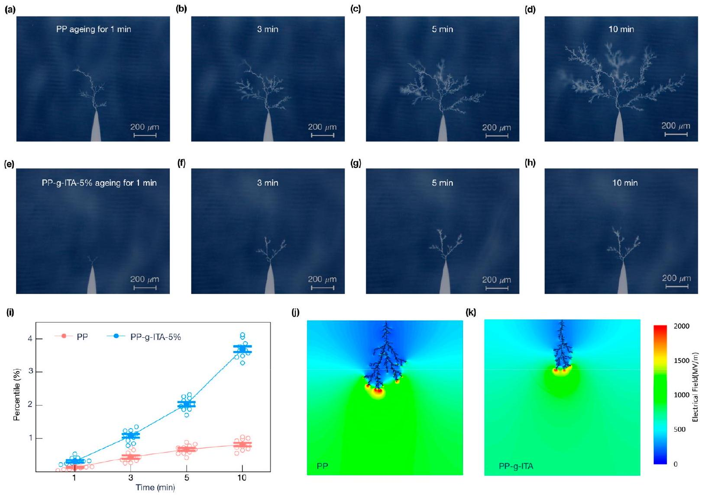

# Improved High-Temperature Electrical Properties of Polymeric Material by Grafting Modification 

Chao Yuan, Yao Zhou, Yujie Zhu, Shixun Hu, Jiajie Liang, Zhen Luo, Bing Gao, Tan Zeng, Yaru Zhang, Juan Li, Shangshi Huang, Zhifei Han, Xiao Yang, Yang Yang, Pengfei Meng, Jun Hu, Jinliang He,* Hao Yuan,* and Qi Li*

#### Abstract

Grafting modification is an effective method to enhance the electrical characteristics of polymeric materials by establishing deep traps that prevent carriers from being injected and transmitted. However, grafted polymers for electrical insulation suffer from large leakage current at elevated temperatures, limiting their application in harsh environments. We report that an itaconic anhydride grafted polypropylene synthesized by the solution grafting method preserves excellent insulating properties up to 120 °C. It is demonstrated that the grafted itaconic anhydride restrains free electrons employing strong electrostatic attraction and obstructs charge injection and transport. Furthermore, we reveal that strong intramolecular forces, deep energy traps, and fragmentized spherulites are essential factors contributing to grafted polymers' superior high-temperature electrical properties. This work provides insights into the sophisticated charge transport mechanisms in grafted polymers and their effects on the insulation characteristics, which is critical for the suitable design of polymeric materials with exceptional electrical properties.

KEYWORDS: Polymeric materials, Grafting modification, Electrical property, Surface charge

## ■ INTRODUCTION

Polymers have been extensively used as dielectric materials and electrical insulations in power electronics, ${ }^{1}$ soft robotics, ${ }^{2}$ electric energy storage, ${ }^{3,4}$ and high voltage electrical insulations ${ }^{5-7}$ due to their extraordinary properties, e.g., lightweight, high electrical resistivity, excellent voltage endurance, and low manufacturing cost. ${ }^{8,9}$ The fundamental concern is that the combined effect of high temperature and high electric field charge injection and transport results in sharp increment of leakage current. ${ }^{10}$ Therefore, low breakdown strength and electrical deterioration limit the hightemperature performance of polymeric materials. Although there are a variety of synthesis and modification methods that can be used to enhance the electrical properties of polymeric materials, usually these methods are effective only for room temperature application and are usually accompanied by the complexity of processing or electrical deterioration characteristics. Recent research has shown that inorganic nanostructures can be utilized to restrict charge carrier movement in polymeric materials, improving their performance. ${ }^{7,11,12}$ The deep traps generated at microscopic interface composed of polymer matrix and nanofiller are responsible for the enhanced electrical characteristics, including electrical resistivity and breakdown strength. ${ }^{13,14}$ These deep traps are localized states capturing charge carriers, limiting the increase of leakage current and charge injection. ${ }^{15,16}$ Although polymer nano-

Received: December 14, 2021
Revised: June 6, 2022
Published: June 24, 2022

Figure 1. (a) Energy band structure and (b) density of states for pristine PP and PP- $g$-ITA simulated by DFT. (c) Schematic spatial distributions of potential and LUMO and HOMO molecular orbitals in PP- $g$-GMA. (d) Electrostatic potential distribution and area percentage in each electrostatic potential range of PP and PP- $g$-ITA. Blue and red colors, respectively represent positive and negative potentials. (e) Intermolecular force in PP- $g$ -ITA and molecular structure.

properties under extremely harsh operating conditions to extend the application range.

This work shows that itaconic anhydride grafted polypropylene (2.5-10 wt \%) under a proper grafting ratio can preserve excellent electrical insulation characteristics up to 120 °C. The grafted itaconic anhydride with high electron affinity can capture the transported electrons via electrostatic attraction, thus forming distributed deep energy traps in polypropylene. This is in contrast to polymer nanocomposites and traditional functional group grafted polymers, which introduce trap sites primarily through fluctuating the polymer chain conformation and local arrangement. ${ }^{20}$ If the intermolecular interactions are strong enough, the deep traps produced by the itaconic anhydride will effectively imprison the free carriers transporting in the polymer even at elevated temperatures and high electric fields. Furthermore, both charge injection and transport are anticipated to be disrupted by these deep traps.

## ■ RESULTS AND DISCUSSION

Quantum Chemical Computation. Our material design is based on the polymer grafted molecular monomer having a lower LUMO (lowest unoccupied molecular orbital) level and a greater HOMO (highest occupied molecular orbital) level than the pristine polymer, enabling capture of free carriers via strong electrostatic attraction. The energy band structures for PP and PP- $g$-ITA are shown in Figure 1a. The LUMO level of PP is 2.03 eV, which is much higher than that of PP- $g$-ITA (-0.90 eV). Because the LUMO level determines the material's electron affinity, it implies that free electrons are more easily captured in grafted polypropylene with lower LUMO level energy. The electron trap depth $E_{\text {trap }}$ can be defined as the energy difference between the LUMO level for pristine and grafted polymer. ${ }^{18,21}$ Large differences in the structure of the electron energy states can cause deep energy traps. The electron trap depth is estimated to be 2.93 eV based on the electronic band structure changes after itaconic anhydride grafting. By substituting the HOMO level for the LUMO level, the hole trap depth $E_{\text {hole }}$ could be acquired as 0.04 eV in a similar calculation.

The density of states spectra of the PP and the PP- $g$-ITA in Figure 1b could also be used to assess the effect of grafting on trap property. According to the density of states spectrum, PP-$g$-ITA has two energy states in the region near the conduction band and the valence band, representing electron traps and hole traps, respectively. Particularly noteworthy are two very low energy levels at -0.90 and -0.22 eV in PP- $g$-ITA, which correspond to deep electron traps that are anticipated to affect charge injection and transport. The electron has a lower mass, greater mobility, and a quicker diffusion rate than the hole, resulting in more injected electrons contributing to leakage current than holes. ${ }^{22}$

A schematic diagram of the electrostatic potential traps and the frontier molecular orbitals for PP- $g$-ITA is illustrated in Figure 1c. It is shown that electron delocalization is mainly concentrated on the grafted itaconic anhydride, which is of benefit to capturing free electrons injected or excited, resulting in a solid electronic coupling with the molecular side-chain surface and thus suppression of electron transmission efficiency. Since the mobility of hole carriers is much lower than that of electron carriers in insulating materials, it becomes an effective method to limit the transport process of electron carriers by introducing electron traps to suppress leakage currents. ${ }^{23}$ The electronegative components in the molecule

Figure 2. (a) Schematic diagram of the Kelvin probe force microscopy (KPFM) testing. Before the measurement, the circuit is utilized for charge injection, and it is disconnected during the measurement. (b, c) Time-dependent surface potential distribution on the scanned line in pristine PP and PP- $g$-ITA. (d) Time-dependent surface potential decay at a point on the scanned line. (e) Charge trap level distribution was obtained from the surface potential decay curves. (f, g) Simulated electric field distribution around the KPFM needle tip irradiated sideways, without and with charge on the polymer's surface. (h) Electric field stresses on a line from the KPFM needle tip to the surface of the polymer.

are shown in the electrostatic potential distribution computed using density functional theory (DFT) (Figure 1d). The quantitative molecular surface analysis of the grafted itaconic anhydride surfaces revealed predominantly negative and positive electrostatic potential regions compared to the PP. This further verifies the attraction characteristics of the grafted itaconic anhydride to positive and negative carriers.

Although high-energy carriers can be captured by grafted itaconic anhydride, driven by continuous partial discharge, the resulting electron avalanches will still be the leading cause of polymer molecular chain scission if the intermolecular interactions are not strong enough. ${ }^{24}$ Therefore, an electron density-based methodology is introduced to identify intermolecular interactions in PP- $g$-ITA (Figure 1e). The Independent Gradient Model is based on representing the electron density gradient in terms of atomic components. ${ }^{25}$ The intramolecular force of grafted itaconic anhydride is robust, making it difficult for molecular ionization and molecular chain breaking. This is critical for maintaining the stability of the grafted polymer, especially in the combination of high temperature and high electric fields.

Isothermal Surface Charge Distribution Characteristic. To verify that the grafted polymer's exceptional electrical performance is due to the grafted molecule's influence on charge injection and transport, we used Kelvin probe force microscopy (KPFM) to perform a nanoscale spatially resolved measurement of surface potential on pristine PP and PP- $g$-ITA (Figure 2a, Figure S1 and Supporting Note 1 in the Supporting Information). Comparing the charge injection and decay characteristics of the pristine PP and the PP- $g$-ITA, it is not difficult to see that more charge accumulated on the latter and dissipated more slowly (Figure 2b,c). To quantitatively describe the process, the time-dependent surface potential decay at the middle point on the scanned line was recorded (Figure 2d). As shown in the figure, the initial surface potential on the PP- $g$-ITA specimen is 0.452 V, nearly 2.18 times that of the pristine PP specimen (0.207 V) after 60 s of charging. In addition, the potential decay of the PP specimen is faster than that of the PP- $g$-ITA specimen. The time required for the surface potential to drop to 50\% of its initial value is 348 and 247 s for the PP- $g$-ITA and the pristine PP, respectively. This result suggests that the PP- $g$-ITA has more/deeper charge traps than the pristine PP. To further acquire the distribution of charge traps, the charge trap density distribution for the pristine PP and PP- $g$-ITA derived based on the demarcation energy model ${ }^{26}$ were presented in Figure 2e (the detailed calculation process shown in ref 14). It was evident that the PP- $g$-ITA exhibits higher trap density in the high energy region (>0.75 eV), which verifies that the grafting induces deeper traps in the polymer to inhibit charge transportation. It is important to note that, because the impact of retrapping during charge drift is disregarded, trap density determined from surface potential decay may underestimate the shallow trap density relative to deeper trap density.

To investigate the impact of the trapped charges on the electric field, we used finite element method to simulate the electric field distribution around the KPFM needle tip, without and with the charge on the polymer surface, as shown in parts f and g of Figure 2. The detailed finite element model is discussed in the Experimental Section (finite element

Figure 3. (a) Current density as a function of the applied electric field of pristine PP and PP-g-ITA with varied grafting ratios at 120 °C. (b) Volume electrical resistivity of pristine PP and PP- $g$-ITA with varied grafting ratios at $40 \mathrm{kV} \mathrm{mm}^{-1}$ and 120 °C. (c) TSDC curves of pristine PP and PP-g-ITA with varied grafting ratios. (d) Weibull statistic of dielectric breakdown strength of pristine PP and PP- $g$-ITA with varied grafting ratios at $120^{\circ} \mathrm{C}$.

simulation and Figure S9 in the Supporting Information). From the intensity of electric field contrast, the electric field applied on the needle electrode is considerably reduced by the inverse electric field generated by the surface trapped charges, as can be observed. The distribution of the electric field along a line from the needle tip to the polymer surface is presented in Figure 2h. The electric field measured at polymer surface is $108 \mathrm{MV} \mathrm{m}^{-1}$ with trapped charges, which is 65\% that with trapped charges $\left(165 \mathrm{MV} \mathrm{m}^{-1}\right)$. It implies that the surface charges trapped on the polymer create an electric field opposing the supplied field, preventing the intake of additional net electrons.

Charge Injection and Transport. The charge transport behavior was revealed by analyzing the relationship between the applied electric field and the leakage current density. As the electric field strength raises from 5 to $80 \mathrm{kV} \mathrm{mm}^{-1}$, a transition from Schottky emission (charge injection-governed conduction) to variable-range hopping (transport-limited conduction) occurs in the pristine PP and the graft polymer, according to the fitting of leakage current density against electric field at 120 °C (Figure 3a). Although the curve of current density versus field can be fitted by the Schottky emission model (Supporting Note 2 in the Supporting Information) in the lower electric field regime, the resulting dielectric constants are not consistent with that measured by the dielectric spectrum. The potential barrier heights of PP- $g$-ITA ( $\phi=1.14-1.17 \mathrm{eV}$ ) calculated by the Schottky emission model are higher than that of the pristine PP $(\phi=1.12 \mathrm{eV})$. Therefore, the existence of the inverse field, we hypothesize, raises the potential barrier height and limits charge injection from the electrode, resulting in a changed conduction mechanism in the lower electric field domain. In the higher electric field domain, fitting the current density versus electric field data to the hopping conduction model reveals that the PP- $g$-ITA forms a larger trap density, which means shorter distances between traps ( $\lambda$, 2.03-3.38 nm) than the pristine $\operatorname{PP}(\lambda=4.13 \mathrm{~nm})$ (Supporting Note 3 in the Supporting Information). Temperature-dependent electrical conductivity results are used to calculate the activation energy associated with the carrier trapping/detrapping process (Figure S8 and Supporting Note 4 in the Supporting Information). The PP- $g$-ITA with varied grafting ratio has higher activation energies than the pristine PP, indicating a greater trap depth. Comparison of electrical resistivity for pristine PP and PP- $g$-ITA with varied grafting ratio at 40 kV $\mathrm{mm}^{-1}$ and 120 °C are summarized in Figure 3b. The electrical resistivity of the PP- $g$-ITA rises to $8.13 \times 10^{13} \Omega \mathrm{~m}$ at 5\% grafting, which is about 40 times higher than that of the pristine $\mathrm{PP}\left(2.13 \times 10^{12} \Omega \mathrm{~m}\right)$, and then decreases with increasing the grafting ratio. This suggests that fewer carriers were injected from the electrodes into the PP- $g$-ITA, or more carrier trap sites suppressed their transport. As indicated in Figure 3c, the thermally stimulated depolarization current (TSDC) measurements confirm that itaconic anhydride grafted polypropylene brings different carrier trap sites, and the energy level for trap sites is calculated to be around 0.98 eV (Figure S7 in the Supporting Information). Combined with the KPFM measurements, these results reveal that the grafted itaconic anhydride group has effect of immobilizing the free charges, especially at the appropriate grafting ratio.

The breakdown strengths of pristine PP and PP- $g$-ITA with varied grafting ratios at 120 °C are analyzed and shown in Figure 3d, according to the two-parameter Weibull statistic (Supporting Note 5 in the Supporting Information). The grafting of itaconic anhydride significantly enhances break-

Figure 4. (a, b) $1 \times 1 \mu \mathrm{~m}^{2}$ AFM-IR topography of the specimens surface for pristine PP and the PP- $g$-ITA, respectively, on contact mode. $R_{\mathrm{a}}$, the arithmetic average of absolute values of surface height deviations measured from the mean plane, is characterized as the roughness of the material. (c) Local AFM-IR spectra corresponding to tip locations indicated by markers. (d, e) Simultaneously measured with a (a, b) AFM-IR chemical map irradiated with a $1780 \mathrm{~cm}^{-1}$ laser. (f) Differential scanning calorimetry (DSC) heating curves of pristine PP and PP- $g$-ITA with different varied grafting. ( $\mathrm{g}-\mathrm{j}$ ) Isothermal crystallization morphologies of pristine PP and PP- g -ITA with varied grafting ratios measured by polarization microscope.

down field strength under high temperatures, e.g., from 312 kV $\mathrm{mm}^{-1}$ of pristine PP to 383, 446, and $407 \mathrm{kV} \mathrm{mm}^{-1}$ of PP- $g$ -ITA at 2.5, 5, and 10 wt \% grafting, respectively. Due to its high electron affinity energy, the grafted itaconic anhydride can easily capture high-energy electrons and thus reduce the impact of high-energy electrons on the molecule, thus contributing to the improvement in $\mathrm{E}_{\mathrm{b}}$. On the other hand, the intramolecular force of the grafted itaconic anhydride is strong enough to avoid molecular ionization and molecular chain breaking (see the discussion above, Figure 1e). The further increase of the grafting ratio of polypropylene leads to the reduction in breakdown field strength, which is attributed to the agglomeration of grafting moieties, as suggested by the increase in the conduction current and polarization microscope images (see the discussion below, Figure 4g-j).

Structural Characterization. Using an atomic force microscope infrared spectroscopy (AFM-IR), we present a direct experimental mapping of the grafting group's distribution features in polymers. AFM-IR builds chemical maps by using an AFM tip to detect the sample's thermal expansion caused by infrared radiation locally. The measured topography for the pristine PP and PP- $g$-ITA is shown in parts a and b of Figure 4. It can be seen that the morphology of the specimens is relatively flat, and the fluctuation is about 10 nm. Local infrared spectra (Figure 4c) were obtained by positioning the AFM-IR probe in contact with the surface of the pristine PP and PP- $g$-ITA specimens and stepping the pulsed radiation incident on the probe tip through the mid-IR fingerprint range $\left(1400-1900 \mathrm{~cm}^{-1}\right)$. At the point marked in parts a and b of Figure 4, infrared spectra for the PP- $g$-ITA specimen displayed new absorption peaks at $1780 \mathrm{~cm}^{-1}$, corresponding to the carbonyl group in itaconic anhydride, which indicated that itaconic anhydride was successfully grafted onto the molecular chain of polypropylene. The spatial distribution of grafted itaconic anhydride was further confirmed by nanoscale infrared mapping, as shown in parts d and e of Figure 4. Infrared amplitude signals corresponding to carbonyl groups (at 1780 $\mathrm{cm}^{-1}$ ) were highly intense and evenly distributed in the PP- $g$ -ITA while comparatively depleted in the pristine PP. Consequently, our AFM-IR results show definitive evidence to support the homogeneous grafting of itaconic anhydride onto polypropylene was achieved.

The DSC heating curves of pristine PP and PP- $g$-ITA with varied grafting ratio (2.5-10 wt \%) are illustrated in Figure 4f. The crystalline melting point is almost the same in all polymers during the heating process. This reveals that grafting does not affect the melting points of the pristine PP and PP- $g$-ITA. Furthermore, the melting enthalpies of the PP- $g$-ITA are higher than that of the pristine PP, indicating a higher total crystallinity for the PP- $g$-ITA. This behavior can be explained by the grafted groups acting as nucleation sites for the crystallization of the polymer matrix. However, with the further increase of grafting ratio, the crystallinity of the grafted polypropylene increased first and then decreased. It is probably

Figure 5. Typical optical images of electrical tree morphologies corresponding to (a-d) the pristine PP and (e-h) PP-g-ITA during electrical aging under DC and polarity reversal for 10 min at 90 °C. (i) The statistical results for the percentile value of electric tree pixels in the binary image. The average values and error bars of the results were obtained from 10 parallel specimens. (j, k) Simulation of electrical tree propagation in PP and PP$g$-ITA.

due to the steric effect enhanced by the increase of the anhydride group, which inhibits crystallization of the polypropylene molecular chain.

The crystal morphology of pristine PP and PP-g-ITA with varied grafting ratio ( $2.5-10 \mathrm{wt} \mathrm{\%}$ ) are observed by polarization microscope (POM) in Figure 4g-j. It can be seen that the crystal morphology of the pristine PP is mainly composed of large-sized spherulites with obvious boundaries. In contrast, the PP- $g$-ITA is composed of a large number of small-sized spherulites with blurred boundaries and disordered spherulite regularity. Interestingly, as the grafting ratio increases, the size of the spherulites in the PP- $g$-ITA decreases first and then increases, i.e., PP- $g$-ITA-5\% shows the smallest spherulites. This is attributed to the inferior compatibility of the grafted itaconic anhydride molecular chain with PP, promoting the heterogeneous nucleation in the cooling crystallization process, which increases the number of crystal nuclei resulting in the reduction of the spherulite size of the graft polymer. The graft side chain can destroy the regularity of the polypropylene chain, which prevents the macromolecular chain from folding into the lattice in an orderly way, resulting in the increase of spherulite defects and the enhancement of the boundary of a spherulite. With a further increase of grafting ratio, the content of itaconic anhydride autopolymer will also increase. This results in the microphase separation in the polymer, and the grafted itaconic anhydride is extruded out of the unit cell area as an impurity. Therefore, the effect of grafted itaconic anhydride to promote the nucleation of polypropylene crystal will be weakened. In a semicrystalline polymer, crystalline boundaries are strongly correlated to the electrical breakdown process. Spherulite boundaries show lower charge carrier resistivity, which contributes to the development of electrical breakdown. Therefore, grafting of particular groups effectively disrupts spherical crystal boundaries, thus breaking the carrier transport path.

Electrical Degradation. Electrical degradation is a complex aging process accompanied by various chemical degradation, such as thermal degradation, oxidation, field ionization, photodegradation, and hydrolysis. ${ }^{27-29}$ The electrical tree morphological characteristics can directly assess the electrical degradation resistance for the polymers. Electrical tree morphologies of the pristine PP and PP-g-ITA under polarity reversal voltage were shown in Figure 5a-h. As is evident from the figures, the propagation rate of the electrical tree in the PP- $g$-ITA is slower. After the same period of electric field aging, the length of the electrical tree in the PP- $g$-ITA along the direction of the electric field is shorter, and there are fewer split channels. The method based on image segmentation is adopted to further quantitatively describe the degree of electrical tree aging. Its basic idea is to determine an appropriate threshold and use the pixels greater than or equal to the threshold as objects or backgrounds to generate a binary image. The statistical results for the percentage of electrical tree pixels in the binary image are shown in Figure 5i. The average values and error bars are obtained from 10 parallel specimens. With the increase of aging time, the proportion of
space occupied by the electrical tree in the polymers becomes higher, which is obvious in the pristine PP. Different electrical tree propagation properties in polymers are results from various trap distribution and carrier mobility behaviors.

The tree morphologies in the pristine PP and the PP- $g$-ITA are simulated to examine the electrical tree growth features at different phases, as shown in Figure 5j,k. See Supporting Note 6 in the Supporting Information for the simulation model and parameters for specific information. The PP- $g$-ITA has a shorter electrical tree and fewer tree channels than the pristine PP, which is consistent with the results indicated by the electrical aging experiments. When an electric field accelerates charge carriers to obtain adequate kinetic energies, the creation of a low-density region, where chain scissions are more likely to occur, is linked to the inception of an electrical tree. The charge carriers are either injected from the needle tip or stimulated by an Auger-type mechanism when the nonradiative energy transition occurs through trapping and recombination of charge carriers. The grafted itaconic anhydride inhibits the expansion of the electrical tree by introducing deep traps in PP to prevent the accelerated movement of high-energy carriers under electric fields. Meanwhile, solid intramolecular forces in PP- $g$-ITA cause the molecular chains less prone to dissociation and reduce the splitting coefficient of electrical tree propagation.

## ■ CONCLUSIONS

In conclusion, we report a new material design strategy that can substantially enhance the electrical properties of polymers at high temperatures. This strategy is to covalently graft molecular monomers with a particular electronic band structure onto polymer molecular chain. The grafted itaconic anhydride could capture the free carriers via strong electrostatic attraction to inhibit the charge injection and transportation, which is crucially essential to the electrical properties of polymer enhanced at high temperatures. Furthermore, Using the improved KPFM technique, we captured the dynamic process in which additional injected charges are trapped in the grafted polymer and progressively dissipate once the electric field is removed. The accumulated charge creates an inverse electric field that inhibits further charge injection verified by simulation. TSDC results showed that the detrapping of more charges in the grafted polymer, which is consistent with the KPFM test results, corroborates the reliability of the improved KPFM technique in detecting surface charge distribution features. Ultimately, electrical breakdown and electrical tree degradation results indicated that the grafted polymer has excellent resistance to electrical aging, attributed to its solid intramolecular force, deep energy traps and fragmentized spherulites. Excellent design of grafting functional groups may considerably enhance the high-temperature electrical properties of polymeric material, which increases the life of electrical and electronic equipment by improving the durability and dependability of polymer dielectrics.

## ■ EXPERIMENTAL SECTION

Materials. Isotactic polypropylene used in this work was provided by Maoming Petrochemical Company (China). It has a melt flow rate of 5 g/10 min (230 °C, 2.16 kg), a melting point of 164 °C, and a degree of crystallinity of $46.6 \%$. The itaconic anhydride was purchased from Sigma-Aldrich, a boiling point of 114 °C and a melting point of 66 °C. Toluene, solvents, methanol, and 1,2,4-trichlorobenzene, and the initiator, dicumyl peroxide (Aldrich), were utilized without being purified further.

Preparation. The PP- $g$-ITA with varied grafting ratio is synthesized in the following procedure. The radical grafting of ITA onto PP was performed in 1,2,4-trichlorobenzene solution at 160 °C under a nitrogen atmosphere in the presence of dicumyl peroxide as an initiator. For solution grafting, given amounts of monomer (2.5- 10 wt \%), the initiator (1.0 wt \%), and PP solution in 1,2,4- trichlorobenzene were charged into a round-bottom-flask glass reactor equipped with a condenser, a heating unit, and a magnetic stirrer. Before the reaction, the solution was purged for 10 min with nitrogen, and a continuous nitrogen flow was maintained on the top of the condenser during the reaction process. The grafting process was controlled by titration of the reaction mixture before and after grafting. The grafted polymers were isolated from the reaction mixture by precipitation with methanol and then filtered and dried under vacuum at 100 °C up to constant weight. The PP- $g$-ITA with varied grafting ratio was calculated and summarized as follows. The grafted polymer was added into a Soxhlet extractor and extracted with ethyl acetate for 24 h to remove the unreacted monomer and homopolymer. Then the residual polymer was dried and then weighed. The itaconic anhydride grafting content was calculated by $\left(w_{1}-w_{0}\right) / w$, where $w_{1}$ is the weight of the residual polymer after extraction and $w_{0}$ is the weight of the pristine polypropylene.

Characterization. Differential scanning calorimetry (DSC) analysis was performed with a Q2000 from TA Instruments at a heating rate of 10 °C min ${ }^{-1}$. TSDC was measured using a Keithley 6517B electrometer with the following recipe. The samples were first polarized under $30 \mathrm{kV} \mathrm{mm}^{-1}$ DC electric field at 50 °C for 30 min and then were rapidly cooled to -50 °C with the applied electric field. Afterward, the samples were placed at -50 °C for 10 min, and then the electric field was removed. Finally, the samples were shortcircuited and heated to 150 °C at a heating rate of 2 °C $\mathrm{min}^{-1}$ with the current recorded. Dielectric spectra were conducted over a broad frequency ( $10^{1}-10^{6} \mathrm{~Hz}$ ) using a Novocontrol Concept 80 dielectric spectroscopy meter in conjunction with a Quatro-Cryo system temperature control system. The resistivities of the samples were measured using a high precision amperemeter (Keithley 2635B). The applied voltage was set according to electric field requirements and generated using a Keithley 2290-10. Fourier-transform infrared spectrometer (FTIR) spectra were measured in the attenuated total reflectance (ATR) mode with a Thermo Scientific Nicolet iS10 spectrometer. AFM-IR measurement was performed on an Anasys nanoIR3 system (Bruker). Both the height and chemical images were simultaneously collected in trapping mode. The spectra were obtained by placing the AFM tip on the top of samples within the range 1400- $1900 \mathrm{~cm}^{-1}$ with a spectral resolution of $4 \mathrm{~cm}^{-1}$. Polarizing microscopy (POM, Zeiss Axio Imager A1m, Germany) was used to characterize the spherulite morphology. The samples were heated to 210 °C for 3 min to erase the heat history and then cooled to room temperature at 10 °C/min. Meanwhile, the POM images were captured by an optical microscope.

Isothermal Surface Charge Distribution Experiments. A Bruker Dimension Icon scanning probe microscope was used to record the surface potential. SCM-PIT v2, a probe with a sharp tip and excellent conductivity, was chosen as the probe of choice. The samples were placed out on a gold-coated substrate. A straight line from the sample's center was chosen to execute the charge injection and decay measurements. To guarantee proper charging of the sample, a DC voltage of -5 V was supplied to the probe tip, and the selected line was repeatedly scanned with the DC voltage on. After about 2 min of charging, the surface potential was immediately recorded using the interleave mode, in which the tip was lifted 80 nm above the obtained topography to avoid the convolution effect of morphology.

Electrical Tree Degradation Tests. The sample temperature was maintained at 90 °C for the electrical tree degradation experiments, which were carried out using the equipment shown in Figure S11, which is similar to the HVDC cable's operating conditions. A needleplane electrode arrangement is used to stress the sample. The distance
between the needle and ground electrodes is 3 mm , as determined by the electron microscope's observation. A power supply system is used to initiate the electrical tree, and an image processing system is used to capture the picture throughout the electrical treeing process. A high-voltage generator that can generate repeated pulse voltage with amplitudes ranging from 0 to 30 kV is referred to as a power source system. In this experiment, the pulse frequency is 100 Hz. A digital monitoring system, a computer, and a regulated light source constitute the picture processing system.

DFT Calculation. DFT determines the spatial distribution of electrostatic potential for molecular semiconductor models. DFT is based on first-principles calculations, and the wave functions of computed molecules are derived by solving Schrodinger's equation. The B3LYP hybrid function and the 6-31 G(d) basis function are used to do DFT computations in Gaussian 09. The grid spacings in Multiwfn software 3.7 for quantitative studies of the electrostatic potential on the van der Waals surface are set to 0.25 bohr. ${ }^{30}$ In this study, the isosurface of electron density $0.001 \mathrm{e} / \mathrm{bohr}^{3}$ is referred to as the van der Waals surface. The color mapped isosurface of electrostatic potential distribution and area percentage in each electrostatic potential range can be obtained. In the 2D plot of intermolecular force based on electron density topology, the identification and visualization of regions of weak interactions in the space are implemented by providing chemically intuitive isosurfaces of the reduced density gradient.

Finite Element Simulation. The simulation models of electric field distribution around the KPFM needle electrode are established by using finite element software Comsol Multiphysics 5.6. A DC voltage of -5 V was applied to the needle electrode. The model of the needle electrode with the tip apex radius of 25 nm is built according to the parameters of an actual probe. The surface charge density of the polymer (with surface charge) is $-250.2 \times 10^{-7} \mathrm{C} / \mathrm{m}^{2}$, corresponding to the surface potential of the polymer is 0.452 V, which is consistent with the initial surface potential of KPFM test. The distance between the needle electrode and the polymer is 11 nm . The permittivity of polymer is 2.4 . The computational domain of the considered case is illustrated in Figure S9 in the Supporting Information.

## ■ ASSOCIATED CONTENT

## (s) Supporting Information

The Supporting Information is available free of charge at https://pubs.acs.org/doi/10.1021/acssuschemeng.1c08417.

> KPFM, surface topography, dielectric spectrum, space charge dynamic characteristics, Arrhenius function of conductivity, TSDC data, finite element simulation, and electrical tree model (PDF)

## ■ AUTHOR INFORMATION

## Corresponding Authors

Jinliang He - State Key Laboratory of Power System, Department of Electrical Engineering, Tsinghua University, Beijing 100084, China; © orcid.org/0000-0002-4458-5026; Email: hejl@tsinghua.edu.cn
Hao Yuan - SINOPEC Beijing Research Institute of Chemical Industry, Beijing 100013, China; Email: yuanhao.bjhy@sinopec.com
Qi Li - State Key Laboratory of Power System, Department of Electrical Engineering, Tsinghua University, Beijing 100084, China; © orcid.org/0000-0002-8282-4884;
Email: qili1020@tsinghua.edu.cn

## Authors

Chao Yuan - State Key Laboratory of Power System, Department of Electrical Engineering, Tsinghua University, Beijing 100084, China; College of Electrical and Information

Engineering, Hunan University, Changsha 410082, China; orcid.org/0000-0001-9346-7256
Yao Zhou - State Key Laboratory of Power System, Department of Electrical Engineering, Tsinghua University, Beijing 100084, China
Yujie Zhu - State Key Laboratory of Power System, Department of Electrical Engineering, Tsinghua University, Beijing 100084, China
Shixun Hu - State Key Laboratory of Power System, Department of Electrical Engineering, Tsinghua University, Beijing 100084, China
Jiajie Liang - State Key Laboratory of Power System, Department of Electrical Engineering, Tsinghua University, Beijing 100084, China
Zhen Luo - State Key Laboratory of Power System, Department of Electrical Engineering, Tsinghua University, Beijing 100084, China
Bing Gao - College of Electrical and Information Engineering, Hunan University, Changsha 410082, China
Tan Zeng - College of Electrical and Information Engineering, Hunan University, Changsha 410082, China
Yaru Zhang - SINOPEC Beijing Research Institute of Chemical Industry, Beijing 100013, China
Juan Li - SINOPEC Beijing Research Institute of Chemical Industry, Beijing 100013, China
Shangshi Huang - State Key Laboratory of Power System, Department of Electrical Engineering, Tsinghua University, Beijing 100084, China
Zhifei Han - State Key Laboratory of Power System, Department of Electrical Engineering, Tsinghua University, Beijing 100084, China
Xiao Yang - State Key Laboratory of Power System, Department of Electrical Engineering, Tsinghua University, Beijing 100084, China
Yang Yang - State Key Laboratory of Power System, Department of Electrical Engineering, Tsinghua University, Beijing 100084, China
Pengfei Meng - State Key Laboratory of Power System, Department of Electrical Engineering, Tsinghua University, Beijing 100084, China
Jun Hu - State Key Laboratory of Power System, Department of Electrical Engineering, Tsinghua University, Beijing 100084, China

Complete contact information is available at:
https://pubs.acs.org/10.1021/acssuschemeng.1c08417

## Notes

The authors declare no competing financial interest.

## ■ ACKNOWLEDGMENTS

This work was supported by the National Key R\&D Program of China under Grant 2018YFE0200100 and the National Natural Science Foundation of China, Grants 52007094 (C.Y.), 51922056, 92166203 (Q.L.), and 51921005 (J.L.H.).

## ■ REFERENCES

(1) Park, H.; Lee, Y.; Kim, N.; Seo, D.; Go, G.; Lee, T. Flexible Neuromorphic Electronics for Computing, Soft Robotics, and Neuroprosthetics. Adv. Mater. 2020, 32 (15), 1903558.
(2) Feig, V. R.; Tran, H.; Bao, Z. Biodegradable Polymeric Materials in Degradable Electronic Devices. Acs Central Sci. 2018, 4 (3), 337-348.
(3) Li, Q.; Chen, L.; Gadinski, M. R.; Zhang, S.; Zhang, G.; Li, H. U.; Iagodkine, E.; Haque, A.; Chen, L.-Q.; Jackson, T. N.; Wang, Q. Flexible High-Temperature Dielectric Materials from Polymer Nanocomposites. Nature 2015, 523 (7562), 576-579.
(4) Zhang, X.; Shen, Y.; Shen, Z.; Jiang, J.; Chen, L.; Nan, C.-W. Achieving High Energy Density in PVDF-Based Polymer Blends: Suppression of Early Polarization Saturation and Enhancement of Breakdown Strength. Acs Appl. Mater. Inter 2016, 8 (40), 27236-27242.
(5) Li, B.; Xidas, P. I.; Manias, E. High Breakdown Strength Polymer Nanocomposites Based on the Synergy of Nanofiller Orientation and Crystal Orientation for Insulation and Dielectric Applications. Acs Appl. Nano Mater. 2018, 1 (7), 3520-3530.
(6) Zhu, Y.; Cui, H.; Qu, G.; Wu, K.; Lu, G.; Li, S. Origin of Superb Electrical Insulating Capability of Cellulose-Liquid Biphasic Dielectrics by Interfacial Charge Behaviors. Appl. Phys. Lett. 2020, 117 (4), 042906.
(7) Zha, J.-W.; Wang, Y.; Wang, S.-J.; Zheng, M.-S.; Bian, X.; Dang, Z.-M. Space Charge Suppression in Environment-Friendly PP Nanocomposites by Employing Freeze-Dried MgO with Foam Nanostructure for High-Voltage Power Cable Insulation. Appl. Phys. Lett. 2019, 114 (25), 252902.
(8) Yuan, C.; Xie, C.; Li, L.; Xu, X.; Gubanski, S. M.; Zhou, Y.; Li, Q.; He, J. Space Charge Behavior in Silicone Rubber from In-Service Aged HVDC Composite Insulators. Ieee T Dielect El In 2019, 26 (3), 843-850.
(9) Gao, Y.; Huang, X.; Min, D.; Li, S.; Jiang, P. Recyclable Dielectric Polymer Nanocomposites with Voltage Stabilizer Interface: Toward New Generation of High Voltage Direct Current Cable Insulation. Acs Sustain Chem. Eng. 2019, 7 (1), 513-525.
(10) Zhou, Y.; Peng, S.; Hu, J.; He, J. Polymeric Insulation Materials for HVDC Cables: Development, Challenges and Future Perspective. Ieee T Dielect El In 2017, 24 (3), 1308-1318.
(11) Tian, F.; Lei, Q.; Wang, X.; Wang, Y. Investigation of Electrical Properties of LDPE/ZnO Nanocomposite Dielectrics. IEEE Trans. Dielect. Electr. Insul. 2012, 19 (3), 763-769.
(12) Zhou, Y.; Hu, J.; Dang, B.; He, J. Effect of Different Nanoparticles on Tuning Electrical Properties of Polypropylene Nanocomposites. Ieee T Dielect El In 2017, 24 (3), 1380-1389.
(13) Peng, S.; Zeng, Q.; Yang, X.; Hu, J.; Qiu, X.; He, J. Local Dielectric Property Detection of the Interface between Nanoparticle and Polymer in Nanocomposite Dielectrics. Sci. Rep 2016, 6 (1), 38978.
(14) Zhou, Y.; Yuan, C.; Wang, S.; Zhu, Y.; Cheng, S.; Yang, X.; Yang, Y.; Hu, J.; He, J.; Li, Q. Interface-Modulated Nanocomposites Based on Polypropylene for High-Temperature Energy Storage. Energy Storage Mater. 2020, 28, 255-263.
(15) Takada, T.; Kikuchi, H.; Miyake, H.; Tanaka, Y.; Yoshida, M.; Hayase, Y. Determination of Charge-Trapping Sites in Saturated and Aromatic Polymers by Quantum Chemical Calculation. Ieee T Dielect El In 2015, 22 (2), 1240-1249.
(16) Takada, T.; Hayase, Y.; Tanaka, Y.; Okamoto, T. Space Charge Trapping in Electrical Potential Well Caused by Permanent and Induced Dipoles for LDPE/MgO Nanocomposite. Ieee T Dielect El In 2008, 15 (1), 152-160.
(17) Zhou, Y.; Hu, J.; Dang, B.; He, J. Mechanism of Highly Improved Electrical Properties in Polypropylene by Chemical Modification of Grafting Maleic Anhydride. J. Phys. D Appl. Phys. 2016, 49 (41), 415301.
(18) Yuan, H.; Zhou, Y.; Zhu, Y.; Hu, S.; Yuan, C.; Song, W.; Shao, Q.; Zhang, Q.; Hu, J.; Li, Q.; He, J. Origins and Effects of Deep Traps in Functional Group Grafted Polymeric Dielectric Materials. J. Phys. D Appl. Phys. 2020, 53 (47), 475301.
(19) Zhang, C.; Chang, J.; Zhang, H.; Li, C.; Zhao, H. Improved Direct Current Electrical Properties of Crosslinked Polyethylene Modified with the Polar Group Compound. Polymers 2019, 11 (10), 1624-1637.
(20) Liu, F.; Li, Q.; Li, Z.; Liu, Y.; Dong, L.; Xiong, C.; Wang, Q. Poly(Methyl Methacrylate)/Boron Nitride Nanocomposites with Enhanced Energy Density as High Temperature Dielectrics. Compos. Sci. Technol. 2017, 142, 139-144.
(21) Yuan, C.; Zhou, Y.; Zhu, Y.; Liang, J.; Wang, S.; Peng, S.; Li, Y.; Cheng, S.; Yang, M.; Hu, J.; Zhang, B.; Zeng, R.; He, J.; Li, Q. Polymer/Molecular Semiconductor All-Organic Composites for High-Temperature Dielectric Energy Storage. Nat. Commun. 2020, 11 (1), 3919.
(22) Zheng, F.; Wang, L. Large Polaron Formation and Its Effect on Electron Transport in Hybrid Perovskites. Energ Environ. Sci. 2019, 12 (4), 1219-1230.
(23) Stallinga, P.; Benvenho, A. R. V.; Smits, E. C. P.; Mathijssen, S. G. J.; Cölle, M.; Gomes, H. L.; de Leeuw, D. M. Determining Carrier Mobility with a Metal-Insulator-Semiconductor Structure. Org. Electron 2008, 9 (5), 735-739.
(24) Khan, N.; Brettmann, B. Intermolecular Interactions in Polyelectrolyte and Surfactant Complexes in Solution. Polymers 2019, 11 (1), 51.
(25) Lefebvre, C.; Rubez, G.; Khartabil, H.; Boisson, J.-C.; Contreras-García, J.; Hénon, E. Accurately Extracting the Signature of Intermolecular Interactions Present in the NCI Plot of the Reduced Density Gradient versus Electron Density. Phys. Chem. Chem. Phys. 2017, 19 (27), 17928-17936.
(26) Tian, F.; Bu, W.; Shi, L.; Yang, C.; Wang, Y.; Lei, Q. Theory of Modified Thermally Stimulated Current and Direct Determination of Trap Level Distribution. J. Electrostat 2011, 69 (1), 7-10.
(27) Yang, Y.; He, J.; Li, Q.; Gao, L.; Hu, J.; Zeng, R.; Qin, J.; Wang, S. X.; Wang, Q. Self-Healing of Electrical Damage in Polymers Using Superparamagnetic Nanoparticles. Nat. Nanotechnol 2019, 14 (2), 151-155.
(28) Du, B.; Su, J.; Tian, M.; Han, T.; Li, J. Understanding Trap Effects on Electrical Treeing Phenomena in EPDM/POSS Composites. Sci. Rep 2018, 8 (1), 1-11.
(29) Liu, Y.; Cao, X. Electrical Tree Growth Characteristics in XLPE Cable Insulation under DC Voltage Conditions. Ieee T Dielect El In 2015, 22 (6), 3676-3684.
(30) Lu, T.; Manzetti, S. Wavefunction and Reactivity Study of Benzo[a]Pyrene Diol Epoxide and Its Enantiomeric Forms. Struct Chem. 2014, 25 (5), 1521-1533.

