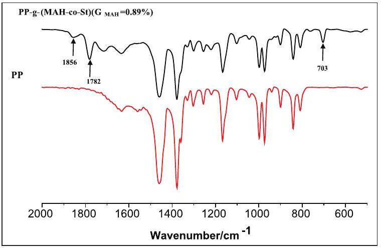
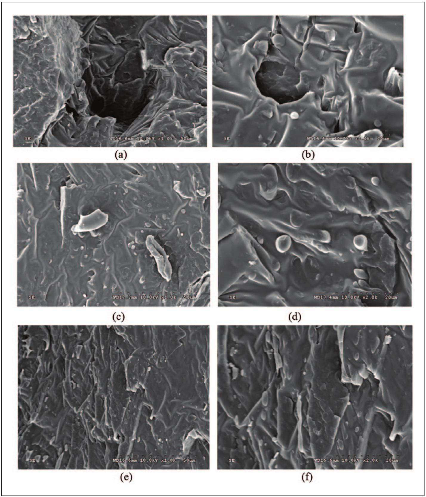
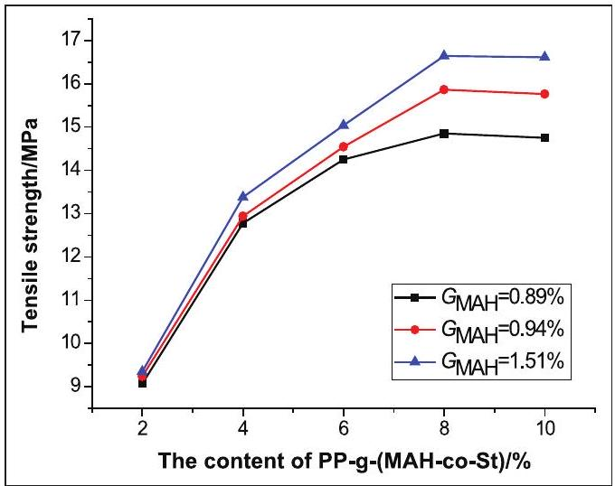
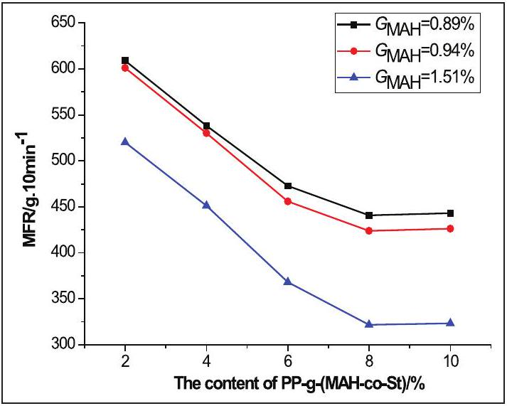
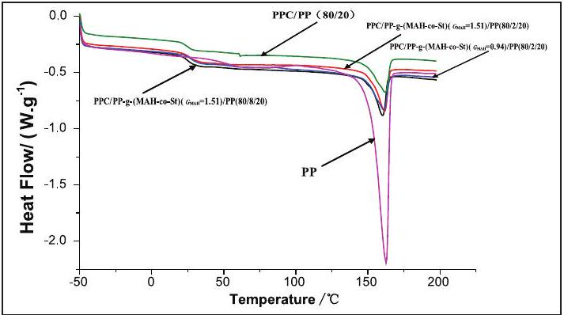
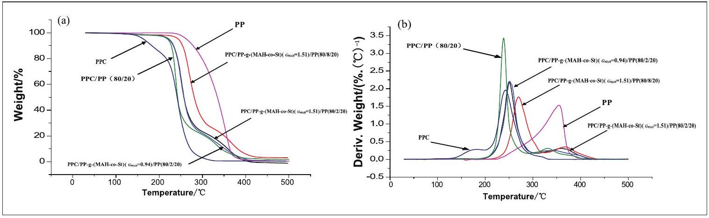
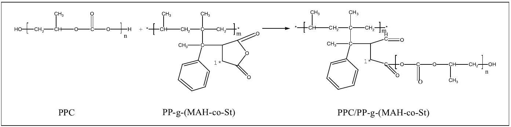
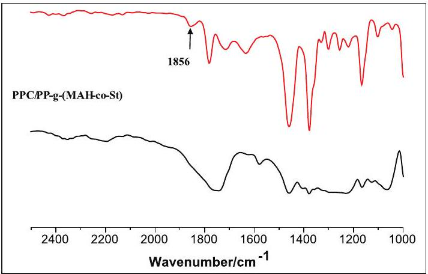
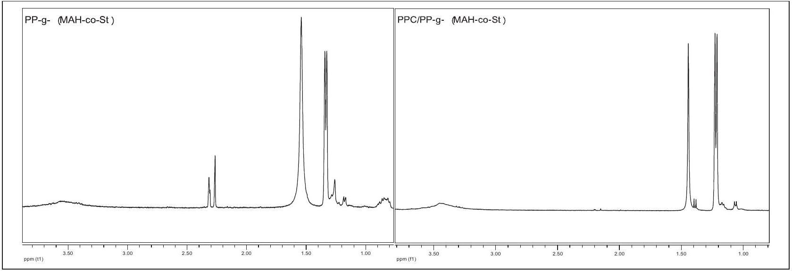

Zheng Tian ${ }^{\mathbf{1}, \mathbf{2}}$, Lisha Pan ${ }^{\mathbf{1}}$, and Qing Pan ${ }^{\mathbf{1}}$

#### Abstract

Polypropylene grafted with maleic anhydride and styrene [PP-g-(MAH-co-St)] was prepared by melt grafting. Fourier transform-infrared spectroscopy showed that maleic anhydride in the form of cyclic anhydride was successfully grafted onto the main chains of polypropylene. PP-g-(MAH-co-St) acts as a compatibilizer for the poly(propylene carbonate)/ polypropylene meltblown nonwoven fabric slices. The effect of different contents and grafting proportions of PP-g-(MAH-co-St) on the structure and performance of the poly(propylene carbonate)/polypropylene slices was investigated. The poly(propylene carbonate)/polypropylene slices had favorable compatibility, tensile properties, thermal stability, and degradability, and their melt flow rates were reduced by the addition of PP-g-(MAH-co-St). Fourier transforminfrared spectroscopy and 'H nuclear magnetic resonance spectroscopy spectra showed that ring-opening reactions occur between the anhydride functional groups of PP-g-(MAH-co-St) and poly(propylene carbonate). Ring-opening reactions, chemical bonds, cocrystallization, increased interface adhesion forces, and reduced interfacial tension may be the mechanisms by which PP-g-(MAH-co-St) acts a compatibilizer for poly(propylene carbonate)/polypropylene slices.

Keywords
Polypropylene graft, poly(propylene carbonate), polypropylene, biodegradable, compatibilizer

Date received: 21 August 2017; accepted: 17 April 2019

## Introduction

Polypropylene (PP), one of the most versatile polymers currently available, is widely used in many fields, such as in automobiles, electronics, packaging, building materials, and fibers, because of its low cost, high thermal stability, stable chemical properties, and water insolubility. ${ }^{1}$ Raw components used for nonwoven materials are composed of about 62\% PP fiber. Because PP is not biodegradable, it is not environment friendly. Furthermore, PP is a kind of nonpolar polymer, and it is low compatibility with other polar materials. The most widely used modification method for PP is grafting of polar monomers onto the main chains of PP in the presence of a radical initiator by melt grafting. Several studies have grafted PP with maleic anhydride (MAH). ${ }^{2,3}$ Chain scission can be prevented and the grafting proportion of MAH on polyolefin can be increased when styrene (St) is used as a comonomer in the

[^0]melt grafting process. ${ }^{4,5}$ PP grafted with MAH and St [PP- $g$-(MAH-co-St)] has been comprehensively studied, especially as a compatibilizer for PPs and other polar materials. ${ }^{6,7}$

Poly(propylene carbonate) (PPC) is one of the most environment-friendly aliphatic polymers industrialized for production. ${ }^{8-10}$ It is used as a one-off packing material, one-off dishware, board material, and so on, because of its water insolubility, biodegradability, and flexibility. ${ }^{11}$ Composite materials with favorable properties can be obtained when PPC is blended with other polymers, such as poly (ethylene-co-vinyl alcohol), ${ }^{12}$ poly( $\beta$ hydroxybutyrate-co-β-hydroxyvalerate), ${ }^{13}$ natural rubber elastomer, ${ }^{14}$ and poly(lactic acid) (PLA). ${ }^{15}$

Recent studies have discussed the preparation of composite fiber materials with high spinnability, high strength, controllable conduction, heat conduction, antistatic, and biodegradation properties by blending PP with PLA. ${ }^{16-18}$ However, the preparation of biodegradable meltblown nonwoven materials by melt blending of PP with PPC is rarely reported.

Meltblown nonwoven materials are used widely in health and industrial applications. ${ }^{19}$ The development of biodegradable meltblown nonwoven materials is very important because many nonwoven materials are nonbiodegradable. The compatibility between PPC and PP is poor because of the different polarities of the polymers. This study prepared biodegradable PPC/PP meltblown nonwoven fabric slices by melt blending and varying the raw material rates to produce PP- $g$-(MAH-co-St) with different grafting proportions as a compatibilizer for PPC/PP slices. The effect of the contents and grafting proportions of PP- $g$-(MAH-co-St) on the compatibility, tensile, melt flow rate (MFR), thermal, and degradation properties of PPC/PP meltblown nonwoven fabric slices was also investigated.

## Experimental

## Materials

Two kinds of PP were used in this study. Granular PP $\left(\mathrm{MFR}=4 \mathrm{~g} / 10 \mathrm{~min}, 230^{\circ} \mathrm{C} / 2160 \mathrm{~g}\right)$ used for the preparation of PP- $g$-(MAH-co-St) was provided by Sinopec Yangzi Petrochemical Company Ltd (Nanjing, Jiangsu, China). PP with lower viscosity $(\mathrm{MFR}=1243 \mathrm{~g} / 10$ $\mathrm{min}, 230^{\circ} \mathrm{C} / 2160 \mathrm{~g}$ ) used for the preparation of PPC/PP slices was provided by Hainan Xinlong Nonwoven Company Ltd., China. PPC $\left(M_{\mathrm{w}}=1.31 \times 10^{5}\right)$ was provided by Inner Mongolia Mengxi High-New Material Company Ltd., China. MAH was purchased from Shanghai Crystal Pure Company Ltd., China. St, dicumyl peroxide (DCP), dimethyl benzene, acetone, sodium hydroxide, alcohol, acetic acid, and phenolphthalein were purchased from Tianjin Fuchen Chemical Reagents Factory, China.

## Preparation of compatibilizers

Preparation of compatibilizers was carried out in an XS-60 blending machine (Shanghai Kechuang Rubber and Plastic Mechanical Equipment Company Ltd., China) with a blending rate of 40 r/min at 180°C for 3 min. Granular PP was mixed with MAH as a polar monomer, St as a comonomer, and DCP as an initiator in a sealed plastic bag. The mixture was then placed into the blending machine for immediate compounding. The code PP- $g$-(MAH-co-St) (100/6/6/0.4) represents the compatibilizer prepared from a mixture of 100.0 g of PP, 6.0 g of MAH, 6.0 g of St, and 0.4 g of DCP.

After melt grafting, PP- $g$-(MAH-co-St) was dissolved in dimethyl benzene by heat refluxing and precipitated in acetone to remove the unreacted MAH and St and polystyrene and poly(styrene-co-maleic anhydride) (SMA) that had formed during melt grafting. PP- $g-(\mathrm{MAH}-c o-\mathrm{St})$ precipitates were then filtered and dried at 50°C in a vacuum oven for 6 h.

## Preparation of PPC/PP slices

Prior to blending, PPC, PP, and PP- $g$-(MAH-co-St) were dried in a vacuum oven at 50°C for more than 12 h until constant weights were achieved. PPC and PP at a ratio of 80/20 (w/w) and predetermined amounts of PP- $g$-(MAHco-St) were mixed well using an XS-60 blending machine (mixer: LH60, shape of the rotor: roller, chamber capacity: 60 mL , highest heating temperature: 350°C, maximum working torque: 80 N m, and pressure of pressing block to material: $6.44 \times 10^{4} \mathrm{~Pa}$ ) with a blending rate of 35 r/min at $175^{\circ} \mathrm{C}$ for 5 min . The blends were then shaped by an LSJ20 extruder (Shanghai Kechuang Rubber and Plastic Mechanical Equipment Company Ltd., screw diameter: 20 mm, screw ratio(L/D): 25, highest heating temperature: 350°C, and maximum working torque: 120 N m) with a blending rate of 25 r/min at 100, 170, 175, and $150^{\circ} \mathrm{C}$ for zones 1, 2, 3, and 4, respectively, and a three-roller compressor machine (Shanghai Kechuang Rubber and Plastic Mechanical Equipment Company Ltd.) with a shear rate of 60 r/min. The code PPC/PP- $g$-(MAH-co-St) $\left(G_{\text {MAH }}=\right.$ 1.51\%)/PP (80/2/20) represents a PP- $g$-(MAH-co-St) grafting proportion of $1.51 \%, \mathrm{PP}-g-(\mathrm{MAH}-c o-\mathrm{St})$ content of 2\% of the sum of the weights of PPC and PP, and PPC and PP weight ratio of 80/20 (w/w).

## Analysis of the properties of PPC/PP slices

Grafting proportion measurement. The grafting proportion of MAH was determined by the back titration method. Briefly, 0.5 g of pure PP-g-(MAH-co-St) was dissolved in dimethyl benzene by heat refluxing at 120°C for 1 h. After the compound had dissolved completely, 20 mL of 0.05 mol/L sodium hydroxide/alcohol standard solution was added to the mixture by heat refluxing at 100°C for

15 min. Two drops of phenolphthalein were subsequently added to the solution, and $0.05 \mathrm{~mol} / \mathrm{L}$ acetic acid/dimethyl benzene standard solution was used to titrate the mixture until it was colorless. The grafting proportion was calculated by equation (1)

$$
\begin{equation*}
G_{\mathrm{MAH}}=\frac{98.06 \times\left(c_{1} \times V_{1}-c_{2} \times V_{2}\right)}{1000 \times 2 m} \times 100 \% \tag{1}
\end{equation*}
$$

where $G_{\text {MAH }}$ is the grafting proportion of MAH (\%), $c_{1}$ is the concentration of sodium hydroxide/alcohol standard solution $(\mathrm{mol} / \mathrm{L}), c_{2}$ is the concentration of acetic acid/ xylene standard solution $(\mathrm{mol} / \mathrm{L}), V_{1}$ is the volume of sodium hydroxide/alcohol standard solution (mL) consumed, $V_{2}$ is the volume of acetic acid/dimethyl benzene standard solution (mL) consumed, and $m$ is the weight of pure PP- $g-(\mathrm{MAH}-\mathrm{co}-\mathrm{St})(\mathrm{g})$. The molecular mass of MAH is 98.06.

Fourier transform-infrared spectroscopy. The Fourier transform-infrared spectroscopy (FT-IR) spectra of samples were recorded using KBr pellets with a TENSOR27 FT-IR spectrometer (Bruker, Germany).

Scanning electron microscopy. The internal microstructures of the samples were observed using an S-3500N-type scanning electron microscope (Hitachi, Tokyo, Japan). The samples were prepared by freezing PPC/PP slices in liquid nitrogen followed by application of a high-speed impact to create freshly fractured surfaces. The fractured surfaces were covered with gold before observation.

Tensile properties. The tensile properties of rectangularshaped slice samples (1 cm × 10 cm) were evaluated using an XLW-Intelligent electronic tensile testing machine (Jinan Labthink Mechanical and Electrical Company Ltd., China) at a tensile speed of 500 mm/min and an environment temperature of 30°C.

MFR. MFR tests were carried out using an RL218-MFR instrument (Shanghai Sierda Scientific Instrument Company Ltd., China) at $230^{\circ} \mathrm{C}$ and 2160 g load (ASTM D1238-2004) according to the Standard Test Method for Melt Flow Rates of Thermoplastics by an extrusion plastometer.

Thermal properties. The melting temperature ( $T_{\mathrm{m}}$ ) and glass transition temperature ( $T_{\mathrm{g}}$ ) were determined by differential scanning calorimetry (DSC) using a NETZSCH DSC Q100 (T.A. Instruments Inc., Los Angeles, USA). The thermal degradation temperatures ( $T_{-5 \%}, T_{-50 \%}, T_{-95 \%}$, and $T_{\mathrm{p}}$ ) were determined by thermogravimetric analysis (TG) using a NETZSCH TG Q600 (T.A. Instruments Inc.). DSC analysis was performed by scanning each sample from $-50^{\circ} \mathrm{C}$ to $200^{\circ} \mathrm{C}$ at a heating rate of $10^{\circ} \mathrm{C} / \mathrm{min}$. TG analysis was performed by scanning each sample from 30°C to 500°C at a heating rate of 10°C/min. The crystallinity of PPC/PP slices is calculated by equation (2)

$$
\begin{equation*}
X_{\mathrm{c}}=\frac{\Delta H_{\mathrm{m}}}{\Delta H_{0}} \times 100 \% \tag{2}
\end{equation*}
$$

where $X_{\mathrm{c}}$ is the crystallinity of PPC/PP slices (\%), $\Delta H_{\mathrm{m}}$ is the crystal melting enthalpy of the PPC/PP slices (J/g), and $\Delta H_{0}$ is the complete crystallization or melting enthalpy of the PPC/PP slices (J/g). $\Delta H_{0}$ is calculated from the ratio of PPC and PP, the standard melting enthalpy of PPC is 0 J/g, and the standard melting enthalpy of PP is 209 J/g.

Degradation test. PPC/PP slices (1 cm × 1 cm) of 0.4 mm thickness were dried in a vacuum oven at 50°C for more than 12 h until a constant weight was achieved and degraded in phosphate buffer solution (PBS; $\mathrm{pH}=7.7$ ) at 60°C. The PBS was replaced every 6 days to ensure the stability of the pH. The weightlessness rate represents the degradation rate and is calculated by equation (3)

$$
\begin{equation*}
W_{\mathrm{r}}=\frac{m_{0}-m_{1}}{m_{0}} \times 100 \% \tag{3}
\end{equation*}
$$

where $W_{\mathrm{r}}$ is the weightlessness rate (\%), $m_{0}$ is the initial weight of the PPC/PP slices (g), and $m_{1}$ is the weight of the PPC/PP slices after degradation (g).
${ }^{1} H$ nuclear magnetic resonance spectroscopy. The ${ }^{1} \mathrm{H}$ nuclear magnetic resonance spectroscopy ( ${ }^{1} \mathrm{H} \mathrm{NMR}$ ) spectra of samples dissolved in deuterated chloroform were recorded using an AV400 NMR spectrometer (Bruker, Switzerland).

## Results and discussion

## Characterization of PP-g-(MAH-co-St)

PP- $g-(\mathrm{MAH}-c o-\mathrm{St})$ with three grafting proportions $\left(G_{\mathrm{MAH}}\right)$ were prepared by varying experimental conditions such as the raw material ratio, processing temperature, and processing time. The $G_{\text {MAH }}$ of PP-g-(MAH-co-St) prepared with different raw material ratios is shown in Table 1. As shown in Table 1, when the ratio of PP/MAH/St/DCP is 100/6/6/0.2, the $G_{\text {MAH }}$ of PP- $g$-(MAH-co-St) is $0.89 \%$. The $G_{\text {MAH }}$ of PP- $g$-(MAH-co-St) (100/6/6/0.4) was higher than that of PP- $g$-(MAH-co-St) (100/6/0/0.4), which implies that the grafting reaction is promoted by St. The $G_{\text {MAH }}$ of PP- $g$-(MAH-co-St) (100/6/6/0.2) was lower than that of PP- $g$-(MAH-co-St) (100/6/6/0.4) because not enough free radicals are available for reaction when the

Table I. $\mathrm{G}_{\text {MAH }}$ of PP-g-(MAH-co-St) prepared with different raw material ratios.
| Raw material ratios (PP/MAH/St/DCP) | $G_{\text {MAH }}$ of PP-g-(MAH-co-St) (\%) |
| :--- | :--- |
| 100/6/6/0.2 | 0.89 |
| 100/6/0/0.4 | 0.94 |
| 100/6/6/0.4 | 1.51 |

PP: polypropylene; MAH: maleic anhydride; St: styrene; DCP: dicumyl peroxide.

Figure I. FT-IR spectra of PP-g-(MAH-co-St) $\left(G_{\text {MAH }}=0.89 \%\right)$ and PP.

initiator content is low. These results indicate that different raw material ratios could yield different results.

The grafting reaction of PP with MAH and St was confirmed by the FT-IR spectra. The FT-IR spectra of pure PP- $g-(M A H-c o-S t)\left(G_{\text {MAH }}=0.89 \%\right)$ and PP are shown in Figure 1. As a cyclic anhydride, MAH showed an asymmetrical stretching vibration peak of carbonyl at about $1800 \mathrm{~cm}^{-1}$ and a symmetrical stretching vibration peak at about $1750 \mathrm{~cm}^{-1} .{ }^{20}$ Characteristic peaks of MAH were clearly observed at 1782 and $1856 \mathrm{~cm}^{-1}$. The characteristic peak of St was clearly observed at $703 \mathrm{~cm}^{-1}$. These results indicate that MAH and St were successfully grafted onto the main chains of PP.

## Scanning electron microscopy analysis

Compatibility between PP meltblown nonwoven fabric slices and PPC is difficult to achieve without incorporation of a proper compatibilizer because the former is a nonpolar polymer, whereas the latter is a relatively polar polymer. The effect of PP- $g$-(MAH-co-St) on PPC/PP slices was investigated by scanning electron microscopy (SEM). SEM micrographs of PPC/PP slices are shown in Figure 2. Slices to which PP- $g-(\mathrm{MAH}-c o-\mathrm{St})$ had been added were smoother and showed fewer depressions and cavities than PPC/PP (80/20) slices without PP-g-(MAH-co-St). PP in the form of ball dispersed more uniformly in the PPC matrix when the content and grafting proportion of PP- $g$ (MAH-co-St) were increased. This result clearly demonstrates that the compatibility between polymers can be improved by the addition of PP- $g-(\mathrm{MAH}-c o-\mathrm{St})$.

## Tensile properties and MFR of PPC/PP slices

The tensile properties of PPC/PP slices are shown in Figure 3. The tensile strength reached 16.64 MPa when the content of PP- $g$-(MAH-co-St) $\left(G_{\text {MAH }}=1.51 \%\right)$ was 8\%, and then decreased with further increases in PP- $g$-(MAHco-St). Also, the tensile strength of PPC/PP slices was higher at higher grafting proportions of PP- $g$-(MAHco-St) than lower ones. The effect of the grafting proportion of PP- $g-(\mathrm{MAH}-c o-\mathrm{St})$ on the tensile strength of PPC/ PP slices was not obvious when the PP- $g-(\mathrm{MAH}-c o-\mathrm{St})$ content was low. With the increase in the content and grafting rate of PP- $g-(\mathrm{MAH}-c o-\mathrm{St})$, the elongation at break of PPC/PP slices was decreased, because the MAH grafted on the chain of PP- $g-(\mathrm{MAH}-c o-\mathrm{St})$ promoted the reaction of PPC with PP- $g$-(MAH-co-St), improved the interfacial adhesion strength of PPC with PP, and hence the elongation at break of PPC/PP slices was decreased. Furthermore, PP- $g$-(MAH-co-St) had a main chain of PP, its crystallization was similar to the rigid material PP, and the addition of PP- $g$-(MAH-co-St) promoted the crystallinity of PPC/ PP. Hence, the flexibility was reduced, and the elongation at break of PPC/PP slices was reduced by adding PP-g-(MAH-co-St).

MFRs of the PPC/PP slices with PP- $g-(\mathrm{MAH}-c o-\mathrm{St})$ are shown in Figure 4. The MFR of the PPC/PP slices decreased when the content and grafting proportion of PP-g-(MAH-co-St) were increased. The minimum MFR was observed at a PP- $g$-(MAH-co-St) $G_{\text {MAH }}$ of 1.51\%. Changes in the MFR of the PPC/PP slices were not obvious when the PP- $g$-(MAH- $c o$-St) content was higher than 8\%. These results indicate that addition of PP- $g$-(MAHco-St) could promote the compatibility, improve the interfacial adhesion strength, and inhibit the flowability between PPC and PP, consistent with the SEM and tensile strength analyses.

## Thermal properties

The DSC curves of PPC/PP- $g-(\mathrm{MAH}-c o-\mathrm{St}) / \mathrm{PP}$ slices are shown in Figure 5, and data of $T_{\mathrm{m}}$ and $T_{\mathrm{g}}$ are shown in Table 2. The $T_{\mathrm{m}}$ of the PPC/PP slices did not change after the addition of PP- $g$-(MAH-co-St). The $T_{\mathrm{g}}$ of the PPC/PP slices after the addition of PP- $g$-(MAH-co-St) is between $24.2^{\circ} \mathrm{C}$ and $28.0^{\circ} \mathrm{C}$. The $T_{\mathrm{g}}$ of the PPC/PP slices decreased when the content and grafting proportion of PP- $g$-(MAH$c o-\mathrm{St}$ ) were increased and tended to $T_{\mathrm{g}}$ between PPC and PP. ${ }^{21}$ The crystallinity of PPC/PP slices is improved with the increase in the grafting proportion and content of PP- $g$-(MAH-co-St). These findings confirm that the

Figure 2. SEM micrographs of PPC/PP slices: (a) PPC/PP (80/20) at $1000 \times$ magnification, (b) PPC/PP (80/20) at 2000× magnification, (c) PPC/PP-g-(MAH-co-St) $\left(G_{\text {MAH }}=0.94 \%\right) /$ PP $(80 / 2 / 20)$ at $1000 \times$ magnification, $(d)$ PPC/PP-g-(MAH-co-St) $\left(G_{\text {MAH }}=\right.$ 0.94\%)/PP (80/2/20) at 2000× magnification, (e) PPC/PP-g-(MAH-co-St) $\left(G_{\text {MAH }}=1.51 \%\right) / \mathrm{PP}(80 / 8 / 20)$ at 1000× magnification, and (f) PPC/PP-g-(MAH-co-St) $\left(G_{\text {MAH }}=1.51 \%\right) / P P(80 / 8 / 20)$ at 2000× magnification.

compatibility of PPC/PP slices is improved by the addition of PP- $g-(\mathrm{MAH}-c o-\mathrm{St})$.

The TG and derivative thermogravimetry (DTG) curves of PPC, PP, and the PPC/PP slices are shown in Figure 6, and data of $T_{-5 \%}, T_{-50 \%}, T_{-95 \%}$, and $T_{\mathrm{p}}$ are shown in Table 2. The $T_{-5 \%}$ of PPC was $55.5^{\circ} \mathrm{C}$ lower than that of the PPC/PP slices when PPC was blended with PP at a ratio of 80/20 (w/w). The thermal decomposition temperatures of the PPC/ PP slices increased with increasing PP-g-(MAH-co-St) content. The $T_{-5 \%}$ of the PPC/PP slices was mostly improved by 25°C by the addition of 8\% PP- $g$-(MAH- $c o-\mathrm{St}$ ) ( $G_{\text {MAH }}=$ 1.51\%). The thermal decomposition temperatures of the PPC/PP slices did not obviously change when the grafting proportion of PP- $g$-(MAH-co-St) was increased. PPC was easily decomposed to cyclic carbonate at low temperature, because the thermal degradation was inhibited by the reaction of PPC and the PP- $g-(\mathrm{MAH}-c o-\mathrm{St})$. Therefore, thermal decomposition temperatures and the thermal stability of the

Figure 3. Tensile properties of PPC/PP slices with PP-g-(MAH-co-St).

Figure 4. MFRs of PPC/PP slices with PP-g-(MAH-co-St).

Figure 5. DSC curves of PP and PPC/PP slices.

PPC/PP slices can be improved and the processing temperature range can be expanded by the addition of PP- $g$-(MAH-co-St).

## Degradation properties

The degradation rates of PPC, PP, and the PPC/PP slices in PBS are shown in Table 3. After 30 days, about 4.30\% of

Table 2. Thermal properties of PP and PPC/PP slices.
| Materials | $T_{g}\left({ }^{\circ} \mathrm{C}\right)$ | $T_{m}\left({ }^{\circ} \mathrm{C}\right)$ | $T_{-5 \%}\left({ }^{\circ} \mathrm{C}\right)$ | $T_{-50 \%}\left({ }^{\circ} \mathrm{C}\right)$ | $T_{-95 \%}\left({ }^{\circ} \mathrm{C}\right)$ | $T_{p}\left({ }^{\circ} \mathrm{C}\right)$ | $\Delta H_{m}(\mathrm{~J} / \mathrm{g})$ | $X_{c}$ (\%) |
| :--- | :--- | :--- | :--- | :--- | :--- | :--- | :--- | :--- |
| $\begin{aligned} & \text { PPC/PP-g-(MAH-co-St) } \\ & \left(G_{\text {MAH }}=0.94 \%\right) / \mathrm{PP}(80 / 2 / 20) \end{aligned}$ | 27.8 | 161.2 | 222.0 | 257.5 | 376.5 | 251.5 | 19.64 | 47.0 |
| $\begin{aligned} & \text { PPC/PP-g- }(\text { MAH-co-St }) \\ & \left(G_{\text {MAH }}=1.51 \%\right) / \text { PP }(80 / 2 / 20) \end{aligned}$ | 25.7 | 161.6 | 222.5 | 257.5 | 375.5 | 250.0 | 21.14 | 50.6 |
| $\begin{aligned} & \text { PPC/PP-g- }(\text { MAH-co-St }) \\ & \left(G_{\text {MAH }}=1.51 \%\right) / \text { PP }(80 / 8 / 20) \end{aligned}$ | 24.2 | 160.0 | 244.5 | 281.0 | 407.7 | 270.0 | 21.29 | 50.9 |
| PP | - | 162.6 | 263.5 | 334.5 | 370.0 | 355.0 | 94.04 | 45.0 |

PPC: poly(propylene carbonate); PP: polypropylene; MAH: maleic anhydride; St: styrene.

Figure 6. (a) TG and (b) DTG curves of PPC, PP, and the PPC/PP slices.

Table 3. Degradation rate of PPC, PP, and the PPC/PP slices.
| Materials | Degradation rate after 6 days (\%) | Degradation rate after 12 days (\%) | Degradation rate after 18 days (\%) | Degradation rate after 24 days (\%) | Degradation rate after 30 days (\%) |
| :--- | :--- | :--- | :--- | :--- | :--- |
| PPC | 3.24 | 3.68 | 3.96 | 4.11 | 4.30 |
| PPC/PP (80/20) | 2.89 | 3.25 | 3.43 | 3.62 | 3.82 |
| $\begin{aligned} & \text { PPC/PP-g-(MAH-co-St) } \\ & \left(G_{\text {MAH }}=0.94 \%\right) / \mathrm{PP}(80 / 2 / 20) \end{aligned}$ | 2.89 | 3.26 | 3.44 | 3.65 | 3.84 |
| $\begin{aligned} & \text { PPC/PP-g-(MAH-co-St) } \\ & \left(G_{\mathrm{MAH}}=1.51 \%\right) / \mathrm{PP}(80 / 2 / 20) \end{aligned}$ | 2.91 | 3.30 | 3.49 | 3.70 | 3.91 |
| $\begin{aligned} & \text { PPC/PP-g-(MAH-co-St) } \\ & \left(G_{\mathrm{MAH}}=1.51 \%\right) / \mathrm{PP}(80 / 8 / 20) \end{aligned}$ | 2.71 | 3.02 | 3.21 | 3.55 | 3.71 |
| PP | 0 | 0 | 0 | 0 | 0 |

PPC: poly(propylene carbonate); PP: polypropylene; MAH: maleic anhydride; St: styrene.

Figure 7. Reaction equation of PPC and PP-g-(MAH-co-St).

the PPC was degradable, while none of the PP and PP- $g$ (MAH-co-St) was degradable. The degradation rate of the PPC/PP slices was improved by the addition of PP- $g$-(MAH- $c o$-St). The effect of PP- $g$-(MAH- $c o$-St) $\left(G_{\text {MAH }}=1.51 \%\right)$ was better than that of PP- $g$-(MAH$c o-\mathrm{St})\left(G_{\mathrm{MAH}}=0.94 \%\right)$ at 2\% content. The degradation rate of the PPC/PP slices decreased when the PP- $g$-(MAH$\operatorname{co}-\mathrm{St})\left(G_{\mathrm{MAH}}=1.51 \%\right)$ content was 8\%. Therefore, the degradation rate of the PPC/PP slices may decrease by the addition of excess PP- $g$-(MAH-co-St). The degradation rate of the PPC/PP slices reached 3.91\% in PBS (pH = 7.7) after 30 days. PPC was degraded by chemical hydrolysis, random hydrolysis, and microbial degradation in PBS. The compatibilizer enhanced the interaction between PPC and PP by the addition of PP- $g-(\mathrm{MAH}-\mathrm{co}-\mathrm{St})$. This expansion led to the presentation of interior surface area and allowed the PBS solution to penetrate into slices for further degradation. ${ }^{22}$ These results provide basic data for the preparation of biodegradable meltblown nonwoven fabrics.

## Reaction mechanism of PPC with PP-g-(MAH-co-St)

The results indicate that ring-opening reactions between the anhydride functional groups of MAH occur on the main chains of PP- $g-(\mathrm{MAH}-c o-\mathrm{St})$ and PPC. ${ }^{23}$ The
reaction equation of PPC and PP- $g$-(MAH- $c o$-St) is shown in Figure 7. To confirm this ring-opening reaction, PPC and PP- $g-(\mathrm{MAH}-c o-\mathrm{St})\left(G_{\text {MAH }}=1.51 \%\right)$ at the ratio of 60/40 (w/w) were reacted by melt blending.

The FT-IR and ${ }^{1} \mathrm{H}$ NMR spectra of PP- $g$-(MAH- $c o$-St) and PPC/PP- $g$-(MAH-co-St) are shown in Figures 8 and 9, respectively. As shown in Figure 8, the characteristic peak of the anhydride functional groups of MAH on the main chains of PP- $g-(\mathrm{MAH}-c o-\mathrm{St})$ at $1856 \mathrm{~cm}^{-1}$ disappeared or shifted in PPC/PP- $g$-(MAH-co-St), thus proving that a ring-opening reaction had occurred.

As shown in Figure 9, the peak of "1" of PP- $g$-(MAHco-St) ranging from 2 to 2.5 ppm either disappeared or shifted in PPC/PP- $g-(\mathrm{MAH}-c o-\mathrm{St})$, which also proves that a ring-opening reaction had occurred between PPC and PP- $g$-(MAH-co-St). Thus, the compatibility of PPC and PP- $g-(M A H-c o-S t)$ can be promoted by the mutual effect of chemical reaction.

The PP chain of PP- $g-(\mathrm{MAH}-c o-\mathrm{St})$ and the PP of the PPC/PP slices are compatible and feature favorable cocrystallization. The most advantageous conformation must be obtained from their interface to promote compatibility. The interface bonding forces are less, the

Figure 8. FT-IR spectra of PP-g-(MAH-co-St) and PPC/PP-g(MAH-co-St).

## Conclusion

The results showed that PP- $g$-(MAH-co-St) with three different grafting proportions could be prepared by melt grafting. MAH in the form of cyclic anhydride was also grafted onto the main chains of PP successfully.

The effect of different contents and grafting proportions of PP- $g$-(MAH-co-St) on the performance of the PPC/PP slices was studied. The compatibility between PPC and PP was improved by the addition of PP- $g-(\mathrm{MAH}-c o-\mathrm{St})$. PPC/ PP slices had higher tensile strengths and lower MFRs at higher contents and grafting proportions of PP- $g$-(MAHco-St) than lower ones. The thermal decomposition temperatures of the PPC/PP slices were improved when the content of PP-g-(MAH-co-St) was increased. The impact of different grafting proportions of PP- $g$-(MAH-co-St) on the thermal decomposition temperatures of the PPC/PP slices was less. The degradation rate of the PPC/PP slices was improved by the addition of moderate amounts of PP- $g$-(MAH-co-St).

Ring-opening reactions, increased interface adhesion forces, and reduced interfacial tension may be the mechanisms of PP- $g$-(MAH-co-St). To endow PPC/PP slices with better application potential, further studies will be conducted to prepare biodegradable meltblown nonwoven fabrics using PPC/PP slices.

Figure 9. ${ }^{1} \mathrm{H}$ NMR spectra of PP-g-(MAH-co-St) and PPC/PP-g-(MAH-co-St).

## Declaration of conflicting interests

The author(s) declared no potential conflicts of interest with respect to the research, authorship, and/or publication of this article.

## Funding

The author(s) disclosed receipt of the following financial support for the research, authorship, and/or publication of this article: The authors would like to thank the Hainan Province Research and Development Project (ZDYF2016016), the Open Project Program of Key Laboratory of Advanced Materials of Tropical Island Resources (Hainan University), Ministry of Education (AM2017-26), National Natural Science Fund of China (51663010), for their financial support. This study was also supported by the Hainan Provincial Fine Chemical Engineering Research Center, the Analytical and Testing Center of Hainan University.

## References

1. Roder H and Vogl O. 17th international Herman F. Mark symposium: polypropylene-a material of the future. Prog Polym Sci 1999; 24: 1205-1216.
2. Kim DH, Fasulo PD, Rodgers WR, et al. Structure and properties of polypropylene-based nanocomposites: effect of PP-g-MA to organoclay ratio. Polymer 2007; 48: 5308-5323.
3. Dubnikova IL, Berezina SM, Korolev YM, et al. Morphology, deformation behavior and thermomechanical properties of polypropylene/maleic anhydride grafted polypropylene/layered silicate nanocomposites. J Appl Polym Sci 2007; 105: 3836-3850.
4. Cartier H and Hu GH. Styrene-assisted melt free radical grafting of glycidyl methacrylate onto polypropylene. $J$ Polym Sci Part A Polym Chem 1998; 36(7): 1053-1063.
5. Li Y, Xie XM and Guo BH. Study on styrene-assisted melt free-radical grafting of maleic anhydride onto polypropylene. Polymer 2001; 42: 3419-3425.
6. Lee J, Kim JK and Son Y. Evaluation of polypropylene grafted with maleic anhydride and styrene as a compatibilizer for polypropylene/clay nanocomposites. Polym Bull 2012; 68: 541-551.
7. Wang Y, Chen FB, Li YC, et al. Melt processing of polypropylene/clay nanocomposites modified with maleated polypropylene compatibilizers. Compos Part B Eng 2004; 35: 111-124.
8. Xu J, Li RKY, Xu Y, et al. Preparation of poly(propylene carbonate)/organo-vermiculite nanocomposites via direct melt intercalation. Eur Polym J 2005; 41(4): 881-888.
9. Xu J, Li RKY, Meng YZ, et al. Biodegradable poly(propylene carbonate)/montmorillonite nanocomposites prepared by direct melt intercalation. Mater Res Bull 2006; 41(2): 244-252.
10. Ge XC, Li XH, Zhu Q, et al. Preparation and properties of biodegradable poly(propylene carbonate)/starch composites. Polym Eng Sci 2004; 44(11): 2134-2140.
11. Zhang ZH, Mo ZS, Zhang HF, et al. Crystallization and melting behaviors of PPC-BS/PVA blends. Macromol Chem Phys 2003; 204: 1557-1566.
12. Jiao J, Wang S, Meng Y, et al. Processability, property, and morphology of bio-degradable blends of poly(propylene carbonate) and poly(ethylene-co-vinyl alcohol). Polym Eng Sci 2007; 47(2): 174-180.
13. Li J, Lai MF and Liu JJ. Effect of poly(propylene carbonate) on the crystallization and melting behavior of poly( $\beta$ hydroxybutyrate-co- $\beta$-hydroxyvalerate). J Appl Polym Sci 2004; 92: 2514-2521.
14. Pang H, Liao B, Huang Y, et al. Blends of PPC/NR elastomer I. Formula design. Polym Mater Sci Eng 2002; 18(2): 71-73.
15. Ma XF, Yu JG, Wang N, et al. Compatibility characterization of poly(lactic acid)/poly(propylene carbonate) blends. $J$ Polym Sci Part B Polym Phys 2006; 44: 94-101.
16. Zhang YC, Zhu HY, Wu HY, et al. The composite fiber materials of montmorillonite/polypropylene/polylactic acid and its preparation method. CN 200810203171.9, 2009, in Chinese.
17. Zhang YC, Qin Y, Wu HY, et al. The composite fiber materials of nanometer zinc oxide/polypropylene/polylactic acid and its preparation method. CN 200810203172.3, 2009, in Chinese.
18. Zhang YC, Zhou J, Wu HY, et al. The composite fiber materials of carbon nanotubes/polypropylene/polylactic acid and its preparation method. CN 200810203173.8, 2009, in Chinese.
19. Wang JH and He A. Bio-based and biodegradable aliphatic polyesters modified by a continuous alcoholysis reaction. Green Polym Chem 2010; 29: 425-437.
20. Xu J, Ban H, Ye C, et al. The long-term stress aging on the structure and properties of nylon 6. Polym Mater Sci Eng 2010; 26(6): 79-85.
21. Fu Y, Liu Y, Zhang L, et al. Molecular simulation of the glass transition of different configuration of polypropylene. J Mol Sci 2009; 25(1): 1-4.
22. Tao J, Song C, Cao M, et al. Thermal properties and degradability of poly(propylene carbonate)/poly( $\beta$ hydroxybutyrate-co- $\beta$-hydroxyvalerate)(PPC/PHBV) blends. Polym Degrad Stab 2009; 94: 575-583.
23. Diao JZ, Yang HF, Zhang JM, et al. Preparation and characterization of PP and PP-g-(MAH-co-St)/hyperbranched poly(amide-ester) blends. Iran Polym J 2007; 16(2): 97-104.
24. Kim HS, Lee BH, Choi SW, et al. The effect of types of maleic anhydride-grafted properties of bio-flour-filled polypropylene composites. Compos Part A 2007; 38: 1473-1482.
25. Dedecker K and Groeninckx G. Interfacial graft copolymer formation during reactive melt blending of polyamide 6 and styrene-maleic anhydride copolymers. Macromolecules 1999; 32: 2472-2479.
26. Tang T, Chen H, Zhang X, et al. Molecular state of polymer in the interfacial area of polyolefin and polar polymers. Acta Polym Sin 1996; 3: 336-341.

[^0]:    ${ }^{1}$ Key Laboratory of Advanced Materials of Tropical Island Resources of Ministry of Education, School of Chemical Engineering and Technology, Hainan University, Haikou, Hainan, China
    ${ }^{2}$ Dencare(Chongqing) Oral Care Co., Ltd, Chongqing, China
    Corresponding author:
    Lisha Pan, Hainan University, Haikou 570228, China.
    Email: happylisap@hainanu.edu.cn

