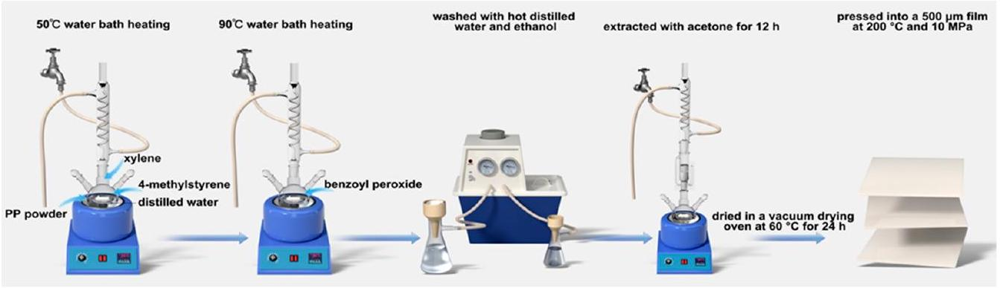
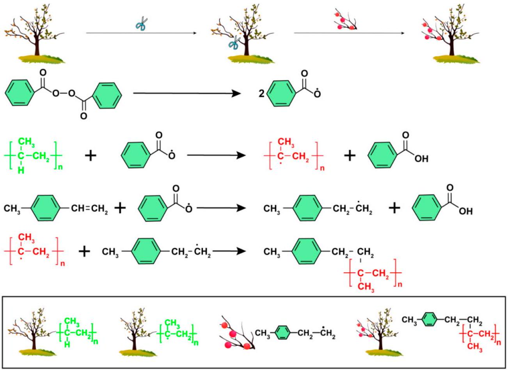
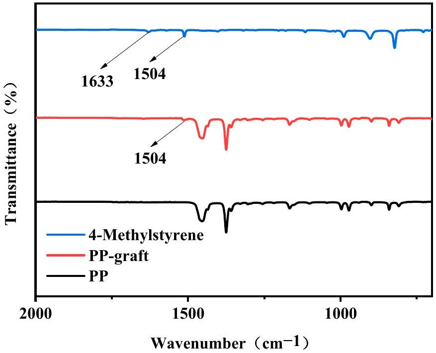
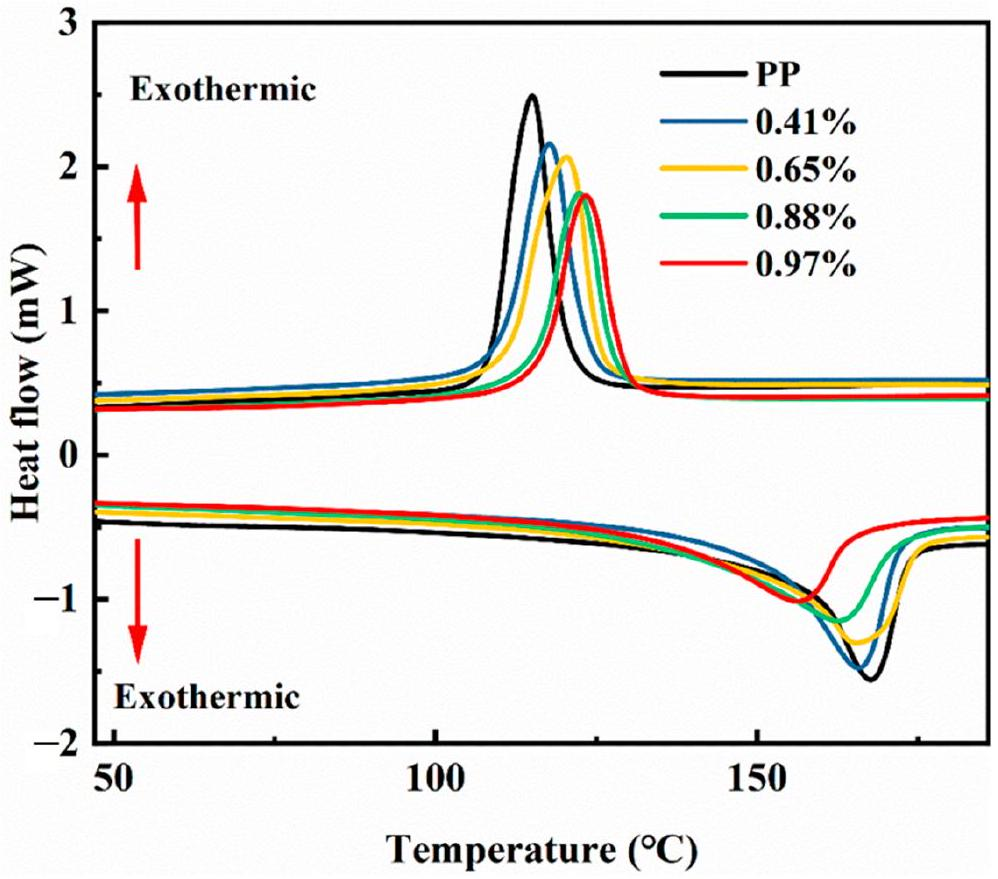
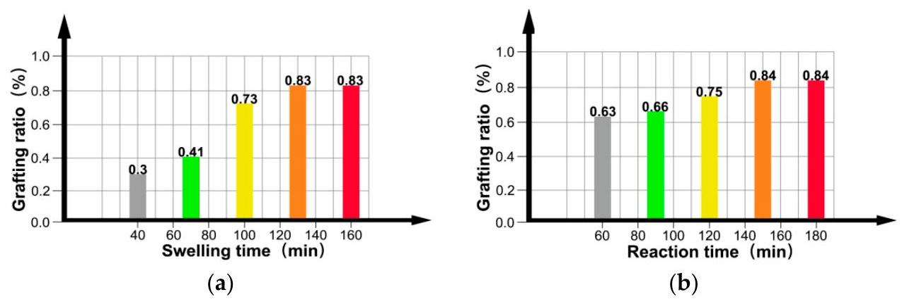
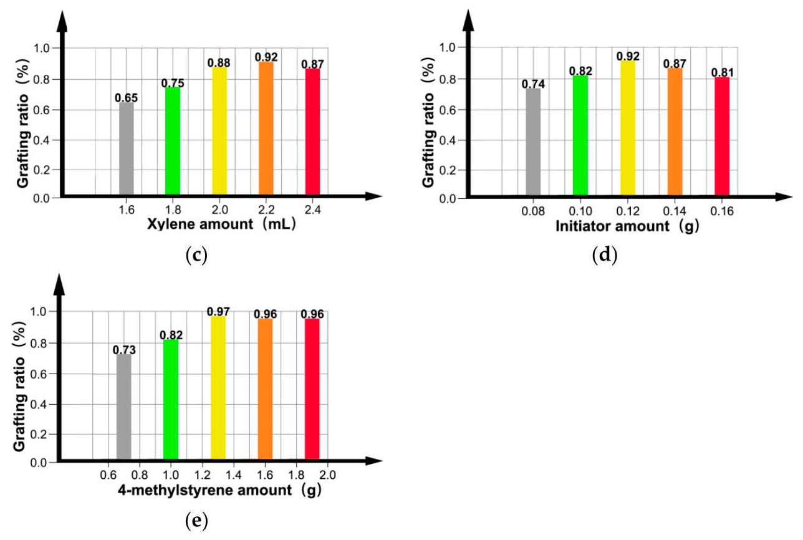
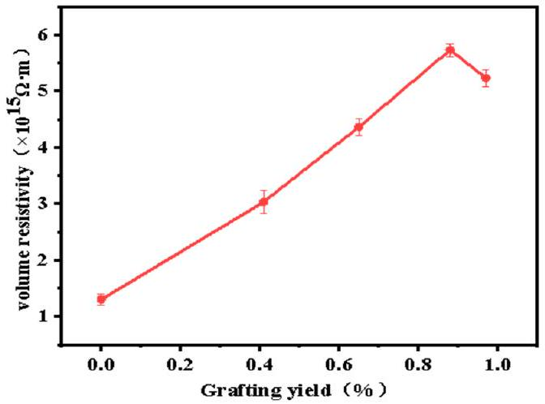
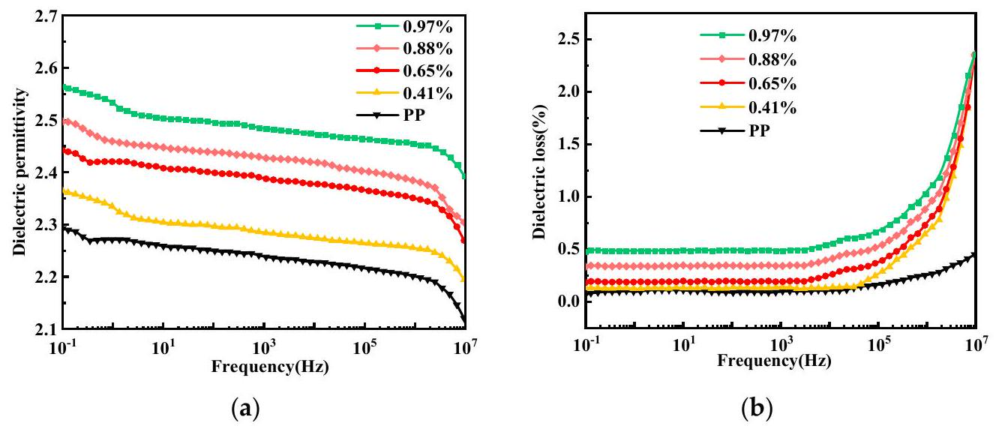
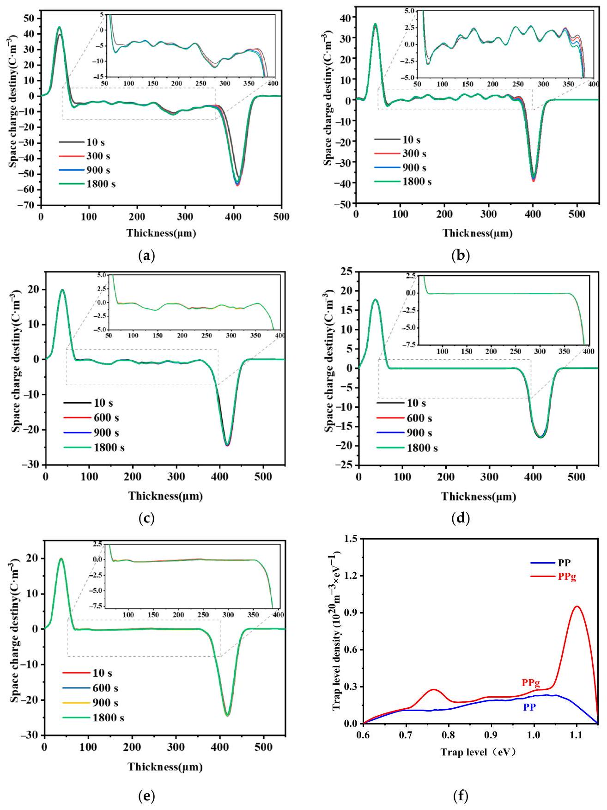
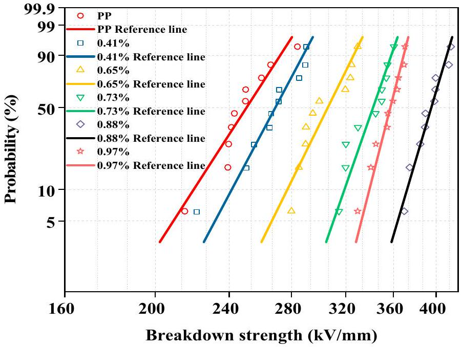

Article

# Improved Insulation Properties of Polypropylenes in HVDC Cables Using Aqueous Suspension Grafting 

Yiyi Zhang ${ }^{\mathbf{1} \sqrt{1}}$, Keshuo Shi ${ }^{\mathbf{1}}$, Chunyan Zang ${ }^{\mathbf{2}, *}$, Wenchang Wei ${ }^{\mathbf{1}}$, Chuanhui Xu ${ }^{\mathbf{3}}$ and Junwei Zha ${ }^{\mathbf{4}}$ ${ }^{1}$ Guangxi Key Laboratory of Intelligent Control and Maintenance of Power Equipment, Guangxi University, Nanning 530004, China ${ }^{2}$ College of Electical and Electronics Engineering, Huazhong University of Science and Technology, Wuhan 430074, China ${ }^{3}$ School of Chemistry and Chemical Engineering, Guangxi University, Nanning 530004, China ${ }^{4}$ School of Chemistry and Biological Engineering, University of Science and Technology Beijing, Beijing 100083, China * Correspondence: zcy_peace@hust.edu.cn

Citation: Zhang, Y.; Shi, K.; Zang, C.; Wei, W.; Xu, C.; Zha, J. Improved Insulation Properties of Polypropylenes in HVDC Cables Using Aqueous Suspension Grafting. Materials 2022, 15, 6298. https:// doi.org/10.3390/ma15186298

Academic Editor: Ji-Woong Kim
Received: 20 July 2022
Accepted: 31 August 2022
Published: 10 September 2022
Publisher's Note: MDPI stays neutral with regard to jurisdictional claims in published maps and institutional affiliations.

Copyright: © 2022 by the authors. Licensee MDPI, Basel, Switzerland. This article is an open access article distributed under the terms and conditions of the Creative Commons Attribution (CC BY) license (https://creativecommons.org/licenses/by/4.0/).

#### Abstract

Owing to its lack of crosslinking, polypropylene (PP) is considered an environmentally friendly alternative to crosslinked polyethylene as high-voltage direct current (HVDC) cable insulation. However, pure PP can accumulate space charges under a HVDC, and thus must be modified for use as an insulating material for HVDC cables. In this study, 4-methylstyrene is grafted onto PP using an aqueous suspension grafting method to improve its properties. The effects of the swelling time, reaction time, and 4-methylphenylene concentration on the reaction were investigated. The optimum process conditions were determined, including an optimum grafting ratio of 0.97\%. The volume resistivity, ability to suppress space-charge accumulation, and DC breakdown strength of modified PP were also studied. Modified PP with a grafting ratio of $0.88 \%$ showed optimal space-charge suppression and the highest volume resistivity and breakdown strength. The work will facilitate the design and development of more efficient insulation materials for HVDC cables.

Keywords: aqueous suspension grafting; polypropylene; HVDC cable insulation; DC breakdown strength; space-charge suppression; 4-methylphenylene

## 1. Introduction

High-voltage direct current (HVDC) cables are widely used in submarine and island power transmission, among other applications. The voltage rating and operational reliability of such power cables are determined by their level of insulation. It is imperative to further develop HVDC cable insulation materials for various high-voltage applications to contribute to the development of DC transmission technologies [1].

Crosslinked polyethylene (XLPE) is widely used as an insulating material for HVDC cables, owing to its excellent electrical and mechanical properties [2,3]. However, XLPE is difficult to recycle and persists in the environment, owing to its extremely slow degradation, necessitating the development of environmentally friendly cable insulation materials. Polypropylene exhibits excellent electrical insulation and high resistance to chemical corrosion, along with a high tensile strength, ratio strength, and elastic modulus. Polypropylene can also be easily recycled, making it a potential substitute for XLPE [4-9].

High-voltage electric fields cause space charges to accumulate in the insulating layers of the cables, leading to electric field distortion and, in turn, insulation breakdown. Methods to suppress the accumulation of space charges in HVDC cables have, therefore, attracted significant attention in recent years [10-16]. Among these methods, doping of pristine insulating materials with nanoparticles forms numerous deep traps that hinder the movement of charge carriers, thereby inhibiting the accumulation of space charges [17-22]. Nanoparticles are typically incompatible with polymers, owing to their high surface activity,
which facilitates the agglomeration of nanoparticles inside the polymer, thereby generating defects; this results in the accumulation of high numbers of space charges inside the nanocomposite, which degrades the electrical properties of the composite [23]. These problems can be avoided by grafting some functional groups onto these polymers. PP can be modified with maleic anhydride groups [14], 4-propoxyenyl-2-hydroxybenzophenone [15], by the melt grafting method. The insulating properties of the modified PP are superior to those of pure PP. Grafting can regulate the macroscopic properties of the polymer through molecular-level chemical modification, while avoiding poor dispersion. Grafting functional groups onto pristine insulating materials is, therefore, considered a viable strategy to inhibit the accumulation of space charges. However, despite its short reaction time and strong grafting effect, the high reaction temperature required by the melt grafting method causes significant side reactions that degrade PP. In contrast, the aqueous suspension grafting method is simple, cost effective, environmentally friendly, and proceeds under mild reaction conditions. Furthermore, the PP degradation and graft adhesion processes observed using the melt grafting method are avoided [24-27]. The aqueous suspension grafting method has been used to synthesize PP-g-styrene (PP-g-St) graft copolymers, wherein St is grafted onto the main chain of PP macromolecules, and the grafting reaction occurs primarily in the amorphous region of PP [28].

Building on this previous work, in this study, 4-methylstyrene was grafted onto PP using the aqueous suspension grafting method. The grafting effect was characterized by infrared spectroscopy, and the optimal mass ratio of the reactants was evaluated. The volume resistivities, DC breakdown field strength, and space-charge suppression capability of the resulting modified PP-based materials were analyzed. This paper presents a novel, environmentally friendly method for the fabrication of insulation materials for HVDC cables.

## 2. Materials and Methods

### 2.1. Materials and Instruments

Industrial-grade PP powder (T30S, Sinopec Daqing Petrochemical Co., Ltd., Beijing, China) was dried and used as isotactic PP; the particle size is $30 \mu \mathrm{~m}$ and the physicochemical parameters of T30S are as follows: the density is $0.9 \mathrm{~g} / \mathrm{cm}^{3}$, the melt flow index is $3.3 \mathrm{~g} / 10 \mathrm{~min}$, the isotactic index is 95.0-99.0, granular ash is $\leq 0.03$, the tensile yield stress $\geq 27.0$. Xylene, 4 -methylstyrene, and benzoyl peroxide were provided by Shanghai Aladdin Biochemical Technology Co., Ltd., Shanghai, China, and acetone was acquired from Tianjin Fuyu Fine Chemical Co., Ltd., Tianjin, China.

A flat vulcanizer (Guangdong Lina Industrial Co., Ltd., Dongguan, China) was used, along with a digital display intelligent temperature control magnetic stirrer (GongyiYuhua Instrument Co., Ltd., Gongyi, China). Infrared spectroscopy was performed using a Nicolet™ iS50 FTIR spectrometer (Thermo Fisher, Waltham, MA, USA). The reaction temperatures were measured using a synchronous thermal analyzer (DSC; NETZSCH Instruments GmbH, Germany). The resistivities and impedances of the prepared samples were measured using a Keithley 6517B electrostatic tester and a Concept 80 broadband dielectric tester (Novocontrol GmbH, Montabaur, Germany), respectively. The dielectric breakdown strength of the samples was measured using a breakdown tester (Beijing Huace Testing Instrument Co., Ltd., Beijing, China). Finally, the space-charge distribution in the samples was analyzed using a space-charge distribution tester.

### 2.2. Materials Preparation

The PP powder, 4-methylstyrene, xylene, and distilled water were added to a threenecked flask with a condenser. This reaction mixture was heated to 50 °C in a water bath, stirred, and left to swell. After the swelling had progressed for a specified time, the flask was removed from the bath. The flask was again heated at 90 °C, before benzoyl peroxide was added and continuously stirred for the reaction. The process was stopped after the reaction progressed for a specified time. The product was subsequently washed with hot
distilled water and ethanol, filtered to remove other impurities, and extracted with acetone for 12 h . The extracted product was then dried in a vacuum drying oven at 60 °C for 24 h, and the final drying was performed using a flat vulcanizer. The product was pressed into a $500 \mu \mathrm{~m}$ film at 200 °C and 10 MPa. The grafting reaction steps and mechanisms are shown in Figures 1 and 2. As shown in picture 2, under the action of the initiator benzoyl peroxide, the double bond on the graft group 4-methylstyrene is opened, and undergoes a radical polymerization reaction with polypropylene to form a rafted product.

Figure 1. Grafting reaction steps.

Figure 2. Grafting reaction mechanism.

### 2.3. Material Property Testing

The Fourier transform infrared spectra of pure PP, modified PP, and 4-methylstyrene were recorded in 32 scans at $3000-500 \mathrm{~cm}^{-1}$, using an infrared spectrometer with a resolution of $2 \mathrm{~cm}^{-1}$.

The grafting ratio of the grafted material was determined from the ratio of the height of the absorption peak of the $\mathrm{C}=\mathrm{C}$ bond of the benzene ring to that of the $\mathrm{C}-\mathrm{CH}_{3}$ absorption peak of PP in the absorbance image, which was obtained from the infrared spectral transmittance map. The relative grafting ratio is calculated by Equation (1).

$$
\begin{equation*}
R a \%=I_{1504} / I_{1375} \times 100 \tag{1}
\end{equation*}
$$

where $R a$ is the relative grafting ratio, $I_{1504}$ is the height of the absorption peak of the C=C bond of the benzene ring, and $I_{1375}$ is the height of the $\mathrm{C}-\mathrm{CH}_{3}$ absorption peak.

A differential scanning calorimeter was used to measure the thermal parameters of the material. Under nitrogen gas flowing at a ratio of $20 \mathrm{~mL} \cdot \mathrm{~min}^{-1}$, a sample of the material (5 mg) was then heated from 40 °C to 200 °C at a ratio of 10 °C. $\mathrm{min}^{-1}$, held at 200 °C for 3 min to eliminate the thermal history, and then cooled to 40 °C at a ratio of 10 °C.min ${ }^{-1}$. The heat absorbed was measured to extract the crystallization profile. Next, the temperature was again raised to 200 °C at a ratio of 10 °C. $\mathrm{min}^{-1}$ for 3 min, and the heat absorbed by the sample was measured to determine the melting profile. Each sample was tested in triplicate to ensure the high accuracy of the experimental results.

The space-charge profiles of the samples were determined using pulsed electroacoustic infrared spectroscopy, with a pulse voltage and width of 400 V and 5 ns, respectively. The test material was pressurized for 10, 300, 900, and 1800 s to analyze the space-charge distribution. The test sample specifications are $100 \times 100 \times 0.5 \mathrm{~mm}$.

The DC voltage breakdown strength was determined using a voltage breakdown tester in accordance with the GB1408.1-2006 standard, using two-column test electrodes with diameters of 25 mm and a boosting ratio of $1 \mathrm{kV} \mathrm{s}^{-1}$. The test sample specifications were $100 \times 100 \times 0.1 \mathrm{~mm}$. The breakdown field strength $E_{\mathrm{B}}$ was calculated using Equation (2).

$$
\begin{equation*}
E_{\mathrm{B}}=U_{\mathrm{B}} / d \tag{2}
\end{equation*}
$$

where $E_{\mathrm{B}}$ is the breakdown field strength (kV/mm), $U_{\mathrm{B}}$ is the breakdown voltage (kV), and $d$ is the thickness of the breakdown point (mm).

The dielectric properties of the samples were measured in the frequency range of $10^{-1}$ to $10^{7} \mathrm{~Hz}$, using a Concept 80 broadband electrostatic meter at room temperature.

The volume resistivity was measured using the three-electrode method in accordance with the GB/T-1410-2006 standard, using a Keithley 6517B electrometer with an applied voltage of 500 V and a pressing time of 5 min. Each sample was measured in triplicate, and its specifications were $100 \times 100 \times 0.1 \mathrm{~mm}$.

Trap levels of PP and the grafted materials (grafting ratio: $0.88 \%$ ) were measured using the thermal shock depolarization current method. Gold electrodes were sputtered on both sides of the sample prior to taking the measurement, after which the sample was polarized under a DC electric field of $4 \mathrm{kV} \cdot \mathrm{mm}^{-1}$ at 50 °C for 30 min and then rapidly cooled to $-90^{\circ} \mathrm{C}$, where it was maintained for 3 min . The polarization voltage was subsequently removed, and the sample was heated from $-90^{\circ} \mathrm{C}$ to $100^{\circ} \mathrm{C}$ at a heating ratio of 3 °C $\mathrm{min}^{-1}$ to determine the trapped space-charge distribution via the sample current measurements.

## 3. Results and Discussion

### 3.1. Infrared Spectroscopy

Figure 3 shows the infrared spectra of pure PP, modified PP, and 4-methylstyrene. The PP-grafted material exhibits a vibration absorption peak at $1504 \mathrm{~cm}^{-1}$, which is characteristic of the benzene ring in 4-methylstyrene; however, no vinyl C=C stretching vibration was observed at the characteristic absorption frequency of $1633 \mathrm{~cm}^{-1}$. Moreover, no new peaks corresponding to impurities were observed, confirming that the 4-methylstyrene monomer was successfully grafted onto PP.

Figure 3. Infrared spectra of the polymer materials.

### 3.2. DSC Analysis

Figure 4 shows the melting and crystallization curves of PP and modified PP with different grafting ratios. Figure 4 shows that the melting temperature of the material tends to decrease with the increasing grafting ratio; however, Figure 4 shows the crystallization temperature of the material increases with the increasing grafting ratio. As the grafting ratio increases, the structure becomes increasingly incomplete and the level of crystal imperfection becomes increasingly greater. Thus, the melting temperature tends to decrease. The increase in grafting ratio reduces the free volume inside the material, thereby increasing the steric hindrance, and the molecular motion requires more thermal energy. Thus, the crystallization temperature tends to increase. Table 1 shows that the crystallinity of the grafted product decreased from 53.2\% to 39.5\% as the grafting ratio increased.

Figure 4. Melting and crystallization diagram.

Table 1. Thermogravimetric properties of the grafted materials.
| Grafting Ratio (\%) | Crystallization Temperature (°C) | Melting Temperature (°C) | Crystallinity (\%) |
| :--- | :--- | :--- | :--- |
| 0 | 114.5 | 168.1 | 53.2 |
| 0.41 | 117.6 | 166.0 | 47.3 |
| 0.65 | 120.6 | 165.1 | 46.8 |
| 0.88 | 122.2 | 163.7 | 42.1 |
| 0.97 | 123.5 | 157.1 | 39.5 |

### 3.3. Process Condition Analysis

In the experiment where the control PP (10 g) was used with the dispersant (60 mL), Figure 5a shows the increase in grafting ratio with swelling time. Increasing the swelling time causes further wetting of xylene, which further wets and swells the amorphous region of PP, such that 4-methylstyrene is more likely to diffuse into the interior of the PP to promote the addition reaction, thereby increasing the grafting ratio. However, the area that can be wetted and swelled by xylene is limited; thus, after the optimal swelling time of 120 min, the grafting ratio levels off. Figure 5b shows that the grafting ratio increases with an increase in the reaction time. As the reaction time increased, the number of free radicals generated by the decomposition of benzoyl peroxide gradually increased. The grafting ratio initially increased gradually before saturating after 150 min, indicating that the optimal reaction time was 150 min. The diffusion of monomers and initiators into the interior of the PP is facilitated by xylene, which can wet and swell the amorphous region of PP. Accordingly, Figure 5c shows that the grafting ratio increases with the amount of xylene. However, the grafting ratio begins to decrease when the amount of xylene exceeds 2.2 mL because excess xylene dissolves some monomers and wraps PP. Thus, an excess of xylene inhibits the grafting reaction and reduces the grafting ratio. Based on our observations, the optimal amount of xylene is 2.2 mL . Figure 5d shows that the grafting ratio initially increases and then decreases with an increase in the initiator dosage because increasing the amount of initiator increases the number of decomposed free radicals, thereby increasing the grafting ratio. However, an excessive amount of the initiator causes the 4-methylstyrene to undergo a homopolymerization reaction that consumes a large amount of the monomer, and thus reduces the grafting ratio. Our observations reveal that the optimum amount of initiator benzoyl peroxide is 0.12 g. Furthermore, Figure 5e shows that the grafting ratio increases with an increase in the monomer dosage, and then remains essentially constant. Increasing the concentration of the monomer increases the probability that it will be grafted onto the main PP chain; however, this chain only has a limited number of graftable sites; thus, continuously increasing the monomer concentration beyond a certain threshold has no effect on the grafting ratio. Our results indicate that 1.3 mL is the optimal amount of monomer in this case.

Figure 5. Cont.

Figure 5. Effects of (a) swelling time, (b) reaction time, (c) amount of xylene, (d) amount of initiator, and (e) amount of monomer on the grafting ratio.

In summary, to synthesize a modified PP material with an optimal graft modification at a maximum grafting ratio of 0.97\%, PP (10 g), dispersant (60 mL), xylene (2.2 mL), benzoyl peroxide (0.12 g), and 4-methylstyrene (1.3 mL) are required, with a swelling and reaction time of 120 and 150 min, respectively.

### 3.4. Effect of Grafting Ratio on Volume Resistivity of the Grafted Materials

Volume resistivity is an important indicator of the insulation performance of modified PP materials. Accordingly, the volume resistivity of the prepared materials was analyzed to assess their applicability as insulating materials in HVDC cables. Figure 6 shows that the volume resistivity first increases and then decreases with the grafting ratio. A maximum volume resistivity 4.4 times that of pure PP $\left(5.73 \times 10^{15} \Omega \cdot \mathrm{~m}\right)$ was obtained at a grafting ratio of 0.88\%. Continuous grafting of monomers onto PP reduces its crystallinity, but increases the amorphous fraction. However, the carriers in the amorphous area are slower than those in the crystalline area. 4-methylstyrene contains large conjugated $\pi$ bonds, which increase the number of deep traps; this, in turn, hinders carrier transport in PP. Thus, the volume resistivity increased with the increasing grafting ratio; however, with a grafting ratio in excess of 0.88\%, the middle of the deep traps was connected, owing to the excessive number of deep traps.

Figure 6. Effect of material grafting ratio on volume resistivity.

Moreover, owing to the excessive number of conjugated molecules, self-aggregation or side reactions occurred, thereby increasing the number of impurities. Thus, the carriers were influenced by the reduced barrier, resulting in a reduction in the volume resistivity.
3.5. Influence of Grafting Ratio on the Dielectric Permittivity and Dielectric Loss of Grafted Materials

HVDC cable insulation materials require a low dielectric permittivity and low dielectric loss. Figure 7a shows that the dielectric permittivity of pure PP is approximately 2.25, while that of the grafted material increases with the increasing grafting ratio. Moreover, the number of conjugated molecules in the system increases, thereby increasing the polarity of the system and, consequently, the dielectric permittivity increases. Meanwhile, the dielectric permittivity decreases with increasing frequency because the motion of polar groups is affected by the change in electric field frequency in the high-frequency range. Figure 7b shows that the dielectric loss increases with the increasing grafting ratio, which may be due to the increase in the number of conjugated molecules and because the chain segments of the macromolecules cannot withstand the frequency of motion, resulting in the generation of macromolecules. The dielectric loss during relaxation polarization started increasing slightly at frequencies above $10^{5} \mathrm{~Hz}$, possibly owing to the energy loss resulting from the increased relaxation time.

Figure 7. (a) Dielectric permittivity and (b) dielectric loss of the materials with different grafting ratios.

### 3.6. Effect of Grafting Ratio on Space Charge of Grafted Materials

Space charges accumulate in the grafted materials under the action of a strong electric field, resulting in a local electric field inside the material, which, in turn, leads to a break down. The current goal of research in HVDC cable insulation materials testing is to prevent the accumulation of space charges.

Under the pressurized polarization of pure PP, Figure 8a shows that the number of carriers injected into the cathode and anode increases with increasing pressurization time, which inhibits the growth and accumulation of space-charge packets and the space-charge density inside the material between 0 and $12.5 \mathrm{C} \cdot \mathrm{m}^{-3}$. Therefore, a space-charge packet is formed inside the material under the action of a high electric field, resulting in a local effective electric field, rendering the material more prone to break down.

Figure 8b shows that grafting the 4-methylstyrene to the PP can reduce the spacecharge injection at the cathode and anode. Although space-charge packets are still formed inside the material, fewer internal space-charge packets are formed than in pure PP. This indicates that the space-charge injection has been partially suppressed.

Figure 8c-e show the internal space-charge density of the modified PP with a grafting ratio of $0.65 \%$, which fluctuates between 0 and $1.25 \mathrm{C} \cdot \mathrm{m}^{-3}$ and the grafting ratio of $0.88 \%$ is related to the grafting ratio. The internal space-charge density of the modified PP with a grafting ratio of 0.97\% is approximately 0 C•m ${ }^{-3}$, indicating that almost no space-charge
packet is formed; however, some space charge is still observed. Therefore, modified PP with a grafting ratio of 0.88\% exhibits the optimal suppression of the space charges.

Figure 8. Material space charge maps: (a) pure PP, and grafting ratio of (b) 0.41\%, (c) 0.65\%, (d) 0.88\% and (e) 0.97\%; (f) material trap energy level distribution.

This observation can be explained by the introduction of the 4-methylstyrene, which reduced the crystallinity of PP and the regularity of the spherulites, blurred the boundaries, produced numerous uniformly distributed traps in both the crystalline and amorphous regions, and enhanced the charge capture ability of the deep traps, thus preventing the accumulation of space charges. Both the influence of functional groups on the crystalline and amorphous regions and the space-charge suppression ability increased with the increasing grafting ratio. However, at a grafting ratio above 0.88\%, the space-charge suppression ability decreased, owing to the introduction of numerous deep traps, which not only generated channels between deep traps that facilitated the migration of opposite polar charges, but
also constituted the conductivity activation energy. The ability to suppress the injection of the same polarity charge will, thus, be reduced. In summary, the ability of the material to suppress space charges first increases and then decreases with the increasing grafting ratio. Optimal space-charge suppression was achieved with a grafting ratio of 0.88\%.

### 3.7. Trap Level Analysis

According to the thermal shock depolarization current measurements, Figure 8f shows that the trap energy level distributions of PP and the grafted materials both range from 0.6 to 1.1 eV, which result from the deep traps contained in the polymer materials. The maximum trap level density of the grafted material was $9.52 \times 10^{19} \mathrm{~m}^{-3} \cdot \mathrm{eV}^{-1}$, which is significantly better than that of the pure PP. Due to the incorporation of 4 -methylstyrene, deep traps are introduced into the material, so the maximum trap level density of the grafted material is significantly better than that of pure PP.

### 3.8. Influence of Grafting Ratio on the Breakdown Field Strength of Grafted Materials

An insulating material can be broken down into a conductor under the action of an excessively high electric field; thus, the breakdown strength of the modified PP should be tested. Figure 9 shows a fitting diagram of the Weibull distribution of the pure and modified PP with different grafting ratios, while the characteristic breakdown values and shape factors obtained from the fit of the Weibull distribution are tabulated in Table 2. The characteristic breakdown value and shape factor first increase and then decrease. The maximum breakdown characteristic value and shape factor are both obtained at a grafting ratio of 0.88\%. Table 2 shows that the breakdown field strength increased from $257.4 \mathrm{kV} \cdot \mathrm{mm}^{-1}$ to $400.8 \mathrm{kV} \cdot \mathrm{mm}^{-1}$ and the shape factor increased from 14.5 to 31.4. This is due to the existence of large conjugated $\pi$ bonds. After 4-methylstyrene is grafted to the PP molecular chain, delocalized $\pi$ electrons appeared in the system, which lead to a lower ionization potential and higher ionization potential. Molecules with high electron affinity can capture high-energy electrons, and thus prevent them from colliding and breaking molecular chains, thereby improving the breakdown field strength. However, with a grafting ratio above 0.88\%, many deep traps may be formed, resulting in "tunneling" between the deep traps, accumulation of space charges, and a reduction in the breakdown field strength.

Figure 9. DC breakdown field strength of materials with different grafting ratios.

Table 2. Breakdown eigenvalues and shape factors of the grafted materials with different grafting ratios.
| Grafting Ratio (\%) | Breakdown Field Strength ( $\mathrm{kV} \cdot \mathrm{mm}^{-1}$ ) | Shape Factor |
| :--- | :--- | :--- |
| 0 | 257.4 | 14.5 |
| 0.41 | 275.2 | 17.5 |
| 0.65 | 312.8 | 18.9 |
| 0.73 | 347.9 | 26.7 |
| 0.88 | 400.8 | 31.4 |
| 0.97 | 361.6 | 28.5 |

## 4. Conclusions

The aqueous suspension grafting method was used to successfully modify the insulating properties of PP. The following conditions were determined to be optimal for the process: 10 g of PP, 60 mL of dispersant, 2.2 mL of xylene, 0.12 g of benzoyl peroxide, 1.3 mL of 4-methylstyrene, a swelling time of 120 min, and a reaction time of 150 min. Modified PP with a maximum grafting ratio of 0.97\% was obtained. When the graft ratio is 0.88\%, it exhibited good insulating properties, the maximum volume resistivity was 4.4 times that of pure PP ( $5.73 \times 10^{15} \Omega \mathrm{~m}$ ) and the optimal suppression of the space charges and the breakdown field strength presented a maximum value of $400.8 \mathrm{kV} \mathrm{mm}^{-1}$; however, the dielectric constant and dielectric loss were also the highest. The results indicate that the above improvements in performance can be attributed to the grafting of 4-methylstyrene and the introduction of deep traps, which significantly reduced charge mobility and the presence of delocalized $\pi$ electrons in the system, which reduced the ionization potential and increased the electron affinity of the modified PP, meaning that it could trap and dissipate the energy of high-energy electrons. In summary, the modified PP is expected to provide a novel idea for the further development of HVDC cable insulation materials.

Author Contributions: Y.Z.: Conceptualization, Project administration, Computational resources, Funding acquisition. K.S.: Formal analysis, Data curation, Writing-original draft, Visualization. W.W.: Methodology, Investigation, Writing-review and editing. C.X.: Supervision, review. J.Z.: Supervision, review. C.Z.: Supervision, review. All authors have read and agreed to the published version of the manuscript.

Funding: This research was funded by the Guangxi Bagui Young Scholars Special Funding and the National Natural Science Foundation of China (51867003).

Institutional Review Board Statement: Not applicable.
Informed Consent Statement: Not applicable.
Data Availability Statement: Not applicable.
Conflicts of Interest: The authors declare no conflict of interest.

## References

1. He, J.; Peng, L.; Zhou, Y. Research progress of environment-friendly HVDC power cable insulation materials. High Volt. Eng. 2017, 43, 337-343.
2. Montanar, G.C.; Laurent, C.; Teyssedre, G.; Campus, A.; Nilsson, U.H. From LDPE to XLPE: Investigating the change of electrical properties. Part I. space charge, conduction and lifetime. IEEE Trans. Dielectr. Electr. Insul. 2005, 12, 438-446. [CrossRef]
3. Teyssedre, G.; Laurent, C.; Montanari, G.C.; Campus, A.; Nilsson, U.H. From LDPE to XLPE: Investigating the change of electrical properties. Part II. Luminescence. IEEE Trans. Dielectr. Electr. Insul. 2005, 12, 447-454. [CrossRef]
4. Green, C.D.; Vaughan, A.S.; Stevens, G.C.; Pye, A.; Sutton, S.J.; Geussens, T.; Fairhurst, M.J. Thermoplastic cable insulation comprising a blend of isotactic polypropylene and a propylene-ethylene copolymer. IEEE Trans. Dielectr. Electr. Insul. 2015, 22, 639-648. [CrossRef]
5. Hosier, I.L.; Vaughan, A.S.; Swingler, S.G. An investigation of the potential of ethylene vinyl acetate/polyethylene blends for use in recyclable high voltage cable insulation systems. J. Mater. Sci. 2010, 45, 2747-2759. [CrossRef]
6. Fu, M.; Chen, G.; Dissado, L.A.; Fothergill, J.C. Influence of thermal treatment and residues on space charge accumulation in XLPE for DC power cable application. IEEE Trans. Dielectr. Electr. Insul. 2007, 14, 53-64. [CrossRef]

7. Yuan, X.; Chung, T.C.M. Cross-linking effect on dielectric properties of polypropylene thin films and applications in electric energy storage. Appl. Phys. Lett. 2011, 98, 062901. [CrossRef]
8. Hosier, I.L.; Vaughan, A.S.; Swingler, S.G. An investigation of the potential of polypropylene and its blends for use in recyclable high voltage cable insulation systems. J. Mater. Sci. 2011, 46, 4058-4070. [CrossRef]
9. Dang, B.; He, J.; Hu, J.; Zhou, Y. Tailored sPP/Silica nanocomposite for ecofriendly insulation of extruded HVDC cable. J. Nanomater. 2015, 16, 439. [CrossRef]
10. Lau, K.Y.; Vaughan, A.S.; Chen, G.; Hosier, I.L.; Holt, A.F.; Ching, K.Y. On the space charge and DC breakdown behavior of polyethylene/silica nanocomposites. IEEE Trans. Dielectr. Electr. Insul. 2014, 21, 340-351. [CrossRef]
11. Pitsa, D.; Danikas, M.G.; Vardakis, G.E.; Tanaka, T. Influence of homocharges and nanoparticles in electrical tree propagation under DC voltage application. Electr. Eng. 2012, 94, 81-88. [CrossRef]
12. Danikas, M.G.; Tanaka, T. Nanocomposites-A review of electrical treeing and breakdown. IEEE Electr. Insul. Mag. 2009, 25, 19-25. [CrossRef]
13. Mazzanti, G.; Chen, G.; Fothergill, J.C. A protocol for space charge measurements in full-size HVDC extruded cables. IEEE Trans. Dielectr. Electr. Insul. 2015, 22, 21-34. [CrossRef]
14. Zha, J.; Wu, Y.; Wang, S.; Wu, D.; Yan, H.; Dang, Z. Improvement of space charge suppression of polypropylene for potential application in HVDC cables. IEEE Trans. Dielectr. Electr. Insul. 2016, 23, 2337-2343. [CrossRef]
15. Liang, Y.; Weng, L.; Zhang, W. Preparation and electrical properties of 4-allyloxy-2-hydroxybenzophenone grafted polypropylene for HVDC cables. J. Electron. Mater. 2021, 50, 6228-6236. [CrossRef]
16. Zhou, Y.; Hu, J.; Dang, B.; He, J. Mechanism of highly improved electrical properties in polypropylene by chemical modification of grafting maleic anhydride. J. Phys. D-Appl. Phys. 2016, 49, 415301. [CrossRef]
17. Dang, B.; Hu, J.; Zhou, Y.; He, J. Remarkably improved electrical insulating performances of lightweight polypropylene nanocomposites with fullerene. J. Phys. D-Appl. Phys. 2017, 50, 45503. [CrossRef]
18. Liu, W.; Cheng, L.; Li, S. Review of electrical properties for polypropylene based nanocomposite. Compos. Commun. 2018, 10, 221-225. [CrossRef]
19. Zhou, Y.; Hu, J.; Chen, X.; Yu, F.; He, J. Thermoplastic polypropylene/aluminum nitride nanocomposites with enhanced thermal conductivity and low dielectric loss. IEEE Trans. Dielectr. Electr. Insul. 2016, 23, 2768-2776. [CrossRef]
20. Yang, J.; Wang, X.; Zhao, H.; Zhang, W.; Xu, M. Influence of moisture absorption on the DC conduction and space charge property of MgO/LDPE nanocomposite. IEEE Trans. Dielectr. Electr. Insul. 2014, 21, 1957-1964. [CrossRef]
21. Tian, F.; Yao, J.; Li, P.; Wang, Y.; Wu, M.; Li, Q. Stepwise electric field induced charging current and its correlation with space charge formation in LDPE/ZnO nanocomposite. IEEE Trans. Dielectr. Electr. Insul. 2015, 22, 1232-1239. [CrossRef]
22. Li, S.; Zhao, N.; Nie, Y.; Wang, X.; Chen, G.; Teyssedre, G. Space charge characteristics of LDPE nanocomposite/LDPE insulation system. IEEE Trans. Dielectr. Electr. Insul. 2015, 22, 92-100. [CrossRef]
23. Huang, X.; Liu, F.; Jiang, P. Effect of nanoparticle surface treatment on morphology, electrical and water treeing behavior of LLDPE composites. IEEE Trans. Dielectr. Electr. Insul. 2010, 17, 1697-1704. [CrossRef]
24. Liu, G. Grafting copolymerization of cationic vinyl monomer with quaternary ammonium groups onto polypropylene. Iran. J. Chem. Chem. Eng. 2015, 34, 17-23.
25. Dou, Q.; Duan, J. Melting and crystallization behaviors, morphology, and mechanical properties of $\beta$-polypropylene/polypropylenegraft-maleic anhydride/calcium sulfate whisker composites. Polym. Compos. 2015, 37, 2121-2132. [CrossRef]
26. Badrossamay, M.R.; Sun, G. Graft polymerization of N-tert-butylacrylamide onto polypropylene during melt extrusion and biocidal properties of its products. Polym. Eng. Sci. 2009, 49, 359-368. [CrossRef]
27. Chen, L.; Wong, B.; Baker, W.E. Melt grafting of glycidyl methacrylate onto polypropylene and reactive compatibilization of rubber toughened polypropylene. Polym. Eng. Sci. 1996, 36, 1594-1607. [CrossRef]
28. Fei, J.; Xin, H. Grafting of styrene on to polypropylene by water phase suspension method. Petrochem. Technol. 2006, 35, 638-642.
