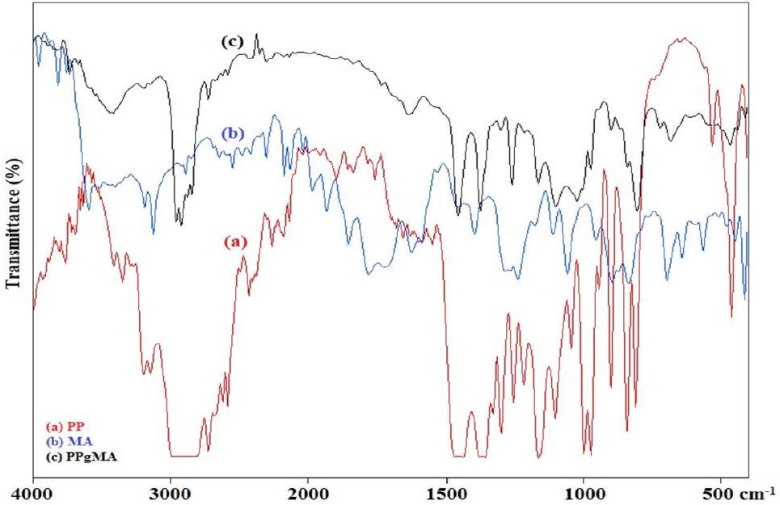
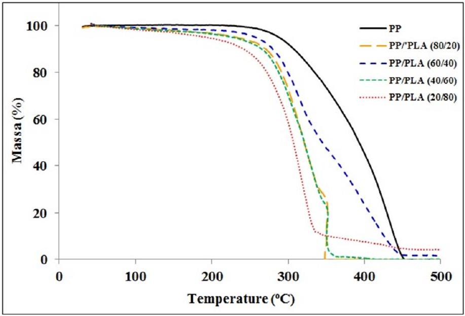
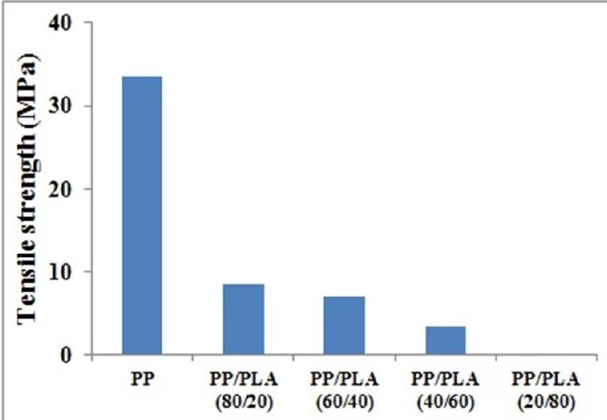
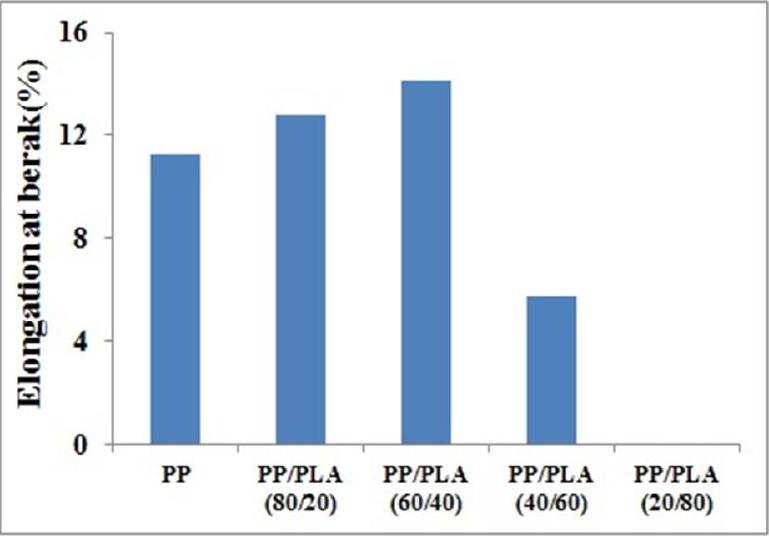
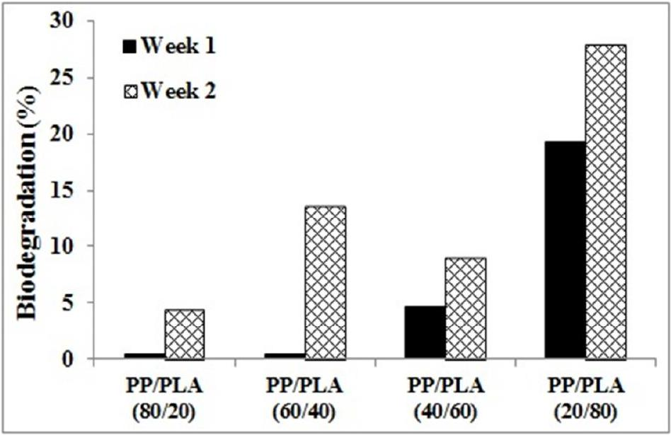

# Synthesis of PP-g-MA as compatibilizer for PP/PLA biocomposites: Thermal, mechanical and biodegradability properties 

Muhammad Ghozali and Elfi Nur Rohmah

Citation: 1803, 020044 (2017); doi: 10.1063/1.4973171
View online: http://dx.doi.org/10.1063/1.4973171
View Table of Contents: http://aip.scitation.org/toc/apc/1803/1
Published by the American Institute of Physics

Articles you may be interested in
Preface: International Symposium on Applied Chemistry (ISAC)
1803, 010001010001 (2017); 10.1063/1.4973126
Organizing Committee: International Symposium on Applied Chemistry (ISAC)
1803, 010002010002 (2017); 10.1063/1.4973127

# Synthesis of PP-g-MA as compatibilizer for PP/PLA Biocomposites : Thermal, Mechanical and Biodegradability Properties 

Muhammad Ghozali ${ }^{[1]}$ and Elfi Nur Rohmah ${ }^{[2]}$ ${ }^{1}$ Research Center for Chemistry, Indonesian Institute of Science, Serpong 15314, Indonesia ${ }^{2}$ Departement of Chemical Engineering, Sultan Ageng Tirtayasa University, Cilegon, Indonesia ${ }^{1)}$ Corresponding author: muhammad.ghozali@lipi.go.id ${ }^{2)}$ elfinurrohmah@gmail.com

#### Abstract

A synthesis of polypropylene-graft-maleic anhydride (PP-g-MA) with benzoyl peroxide (BPO) as an initiator has been conducted in a stainless-steel reactor at 120°C for 1 hours. The composition of maleic anhydride (MA) was varied between 10-40 phr, whereas BPO was between 0.5-2.0 phr. The grafting degree (GD) was determined by calculating the MA monomer grafted into polypropylene (PP). Fourier Transform Infrared (FTIR) analysis was performed to study the functional group in the copolymer PP-g-MA. The result shows that the highest GD of $11.85 \%$ was obtained when the use of MA and BPO are 40 phr and 1 phr, respectively. PP/PLA biocomposites have been manufactured by adding polypropylene (PP), polylactic acid (PLA) and PP-g-MA as compatibilizer into rheomix at a temperature of 200-210°C with a stirring speed of 25 rpm for 7-10 minutes. PP/PLA biocomposites were varied at a ratio of 0/100, 20/80, 40/60, 60/40, 80/20 and 100/0. Fourier Transform Infrared (FTIR), Ultimate Testing Machine (UTM), Thermogravimetric Analysis (TGA) and biodegradation analysis were performed to determine the functional groups, thermal stability, tensile strength and the biodegradability level of PP/PLA biocomposites, respectively. Thermal and mechanical analysis results indicate that the addition of PLA into PP/PLA biocomposites can reduce the thermal stability and mechanical properties, however the biodegradability is increased.

Keywords : biocomposite, biodegradability, polylactic acid, polypropylene, polypropylene-graft-maleic anhydride

## INTRODUCTION

Polymer materials have been used for several years. Various polymer products made from plastics, especially polyolefin, have increased significantly in recent years due to their low cost, good mechanical properties, light weight and durability. These advantages make plastic chosen for material for a various applications, especially for packaging. However, the increased use of plastics on a large scale also creates disposal waste related environment problems. To date, plastic waste can be solved with various methods such as recycling, incineration and burying in landfills [1]. Degradation of the polymer in environment can be classified into chemical degradation, physical / physic-chemical degradation and biodegradation. Chemical degradation is related to oxidation and hydrolysis with assistance of chemical additives, while physical/physic-chemical degradation is associated with thermal degradation, photo-degradation and mechanical degradation. Biodegradation is a degradation of the polymer which involves microorganisms in the process of hydrolysis and oxidation [1-2]. However, polyolefin also has limitations due to its polarity which causes low surface energy, poor adhesion properties and incompatibility with polar compounds [3]. Polyolefin used as plastic is generally petroleum derivatives such as polyethylene and polypropylene and difficult to biodegrade in natural environment. These problems lead a trend toward research and development of biodegradable plastics became a major topic to solve environmental problems caused by plastic waste. In addition, it can reduce the dependency on raw materials from petroleum derivatives which are non-renewable resources.

The enhancement of polyolefin biodegradability can be conducted by compositing or adding filler from biodegradable materials resources into polyolefin. Studies on addition of biodegradable materials such as starch [4-5], cithin, chitosan, cellulose, lignin [6], polylactic acid [7-9] into polyolefin have been done. Among those materials, polylactic acid is one of the promising material in order to replace non-renewable based polymer materials [10-12]. Polylactic acid is a biodegradable aliphatic polyester material [13] with high mechanical properties and
good melt process-ability [14-15]. It is a thermoplastic like petroleum-based plastic which can be processed by various methods such as injection molding, sheet extrusion, blow molding and thermoforming [16-17]. However, PLA also has limitations such as poor gas barrier properties, low toughness, low ductility, poor thermal stability and expensive cost [18-20]. Several studies of blending polypropylene with polylactic acid has been done [20-22]. It has been found that these composite did not show difficulties in extrusion and compression molding processes and can be processed in a similar way as PP based composites [23].

The addition of a natural biodegradable material into polyolefin have some problems related to the lack of compatibility between hydrophobic of polyolefin and natural biodegradable material which is generally hydrophilic. The different properties of both materials cause their incompatibilities which require compatibilizer compounds. One of those compounds which can be applied as compatibilizer for grafting into polyolefin is maleic anhydride and its analogues [24]. Studies on grafting polypropylene with maleic anhydride by various methods have been performed [25-28]. In this research, a synthesis of polypropylene-graft-Maleic anhydride (PP-g-MA) was conducted by grafting of maleic anhydride monomer into polypropylene backbone and used as compatibilizer in preparation of PP/PLA biocomposites. PP/PLA biocomposites were manufactured by adding PLA with various composition to study the effect on biodegradability, thermal and mechanical properties of PP/PLA biocomposites.

## MATERIALS AND METHODS

## Materials

The materials used in this research are Polypropylene (manufactured by PT. Tripolyta), Maleic Anhydride (MA), Benzoyl Peroxide (BPO), Xylene, Ethanol, Ethylmethylketone, Acetone, and Potassium Hydroxide (manufactured by Merck).

## Synthesis of PP-g-MA

A synthesis of polypropylene-graft-maleic anhydride (PP-g-MA) was conducted by adding polypropylene, xylene, maleic anhydride and benzoyl peroxide simultaneously in a stainless-steel reactor equipped with a stirrer, a thermometer and a nitrogen gas inlet. The reaction was done at 120°C for 1 hour [26]. The PP-g-MA products were washed using ethanol and warm water to remove the unreacted maleic anhydride, and then filtered and dried in a vacuum oven at 60°C. Subsequently, the PP-g-MA products were pured by soxhlet extracted with ethylmethylketone for 16 hours and then dried again in a vacuum oven at 60°C until a constant weight was reached. Fourier Transform Infrared (FTIR) analysis was performed to study the functional group in the PP-g-MA. The grafting degree (GD) was determined by calculating the MA monomer grafted onto PP in PP-g-MA product using titration method [27-29]. The composition of maleic anhydride (MA) was varied between 10-40 phr, whereas benzoyl peroxide (BPO) was between 0.5-2.0 phr.

## Preparation of PP/PLA Biocomposites

PP/PLA biocomposites have been manufactured by adding polypropylene (PP), polylactic acid (PLA) and PP-g-MA as compatibilizer into rheomix at 200-210°C with a stirring speed of 25 rpm for 7-10 minutes. The PP/PLA biocomposites were varied PP with PLA at a ratio of 20/80,40/60,60/40, and 80/20. PP/PLA biocomposite films have been made using Hydraulic Hot Press at temperatures of 175°C with pressure of 5 MPa for 15 minutes. Fourier Transform Infrared (FTIR) spectrum analysis was conducted to determine the functional groups of PP/PLA biocomposites using IR Prestige-21 Shimadzu. The mechanical property was measured as a tensile strength using Ultimate Testing Machine and thermal stability was measured by Thermogravimetric Analysis (TGA). In addition, biodegradation test was also conducted to determine the level of biodegradability of the PP/PLA biocomposites.

## RESULTS AND DISCUSSION

Table 1 shows Grafting degree (GD) of PP-g-MA as a function of concentration of BPO initiator and MA monomer. At concentration 0.5 phr and 2 phr of BPO, increasing the concentration of MA monomer tends to
decrease the GD. However, at 1 phr BPO concentration, adding MA monomer concentration will increase the GD. The results show that excess use of BPO may decrease of GD.

Table 1. Grafting degree of PP-g-MA on the various compositions of BPO and MA
| BPO (phr) | MA (phr) |  |  |  |
| :--- | :--- | :--- | :--- | :--- |
|  | 10 | 20 | 30 | 40 |
| 0.5 | 11.81 | 10.39 | 10.98 | 7.13 |
| 1 | 10.29 | 11.70 | 11.32 | 11.85 |
| 2 | 10.62 | 10.18 | 6.60 | 9.40 |

The initial increase in the grafting degree is caused by an increase concentration of radicals formed through the decomposition of BPO. An increase of BPO radical concentration results in the increase of chain transfer to PP backbone and resulting enhancement of grafting degree. However, an increase of BPO concentration also decrease the grafting degree due to the termination reactions between the PP radicals and result in lower concentration of radicals and grafting degree of PP-g-MA [28]. The maximum grafting degree at 11.85 \% was obtained by the concentration of 40 phr of MA and 1 phr of BPO. In the next steps, this concentration was used as a compatibilizer for PP/PLA biocomposites.

Figure 1. FTIR spectrum of a) PP, b) MA and c) PP-g-MA

The characterization by FTIR was performed to detect changes in functional groups that occur in the PP-g-MA synthesis. FTIR analysis of PP, MA and PP-g-MA was done at wave number of $400-4000 \mathrm{~cm}^{-1}$. The FTIR spectrum of PP, MA and PP-g-MA are shown in Figure 1. The FTIR spectrum of MA (Figure 1b) shows an absorption peak at wave number of $1776 \mathrm{~cm}^{-1}$ and $1726 \mathrm{~cm}^{-1}$ which indicates antisym C=O stretch of carbonyl group of MA. The peaks at wave number of 1267 cm-1 indicates a symmetric stretching C-O-C group in anhydrides cyclic and $802 \mathrm{~cm}^{-1}$ corresponding C=C group. Those absorption peaks represent the characteristic of MA. Meanwhile, the FTIR spectrum of PP-g-MA (Figure 1c) also shows peaks at wave number $1735 \mathrm{~cm}^{-1}$ and $1261 \mathrm{~cm}^{-1}$. It is confirmed that MA was grafted onto PP [25-26]. Moreover, the intensity at wave number of $1465 \mathrm{~cm}^{-1}, 1375 \mathrm{~cm}^{-1}$ and $1165 \mathrm{~cm}^{-1}$ decreases and showing that MA has been grafted onto PP backbone [28].

Figure 2. TGA curves of PP/PLA biocomposites

The thermal analysis of PP/PLA biocomposites was done using TG-HDSC LINSEIS STA PT 1600. A Thermogravimetric analysis (TGA) analysis was conducted to study and analyze the thermal stability behavior of PP/PLA biocomposites. The effect of the addition of PLA composition on thermal stability behavior of PP/PLA biocomposites are shown in Figure 2. TGA results show the addition of PLA into PP/PLA biocomposites can accelerate thermal degradation and reduce thermal stability of PP/PLA biocomposites. PP/PLA biocomposites (20/80) have the lowest thermal stability and the most susceptible to thermal degradation. An increase of addition of PLA into PP/PLA biocomposites resulted in a degradation of thermal stability showing that PP was thermally more stable than PLA [20]. However, at temperature over $445^{\circ} \mathrm{C}$, the addition of PLA into PP/PLA biocomposites will increase the thermal stability. PP/PLA biocomposites (80/20) and (40/60) show two-step degradation process. The percentage weight loss in the first and second decomposition step related to the amount of PLA and PP. This is probably due to the lack of blending between PP with PLA [22, 30].

The effect of addition of PLA with various composition on the mechanical properties of PP/PLA biocomposites was studied by analyzing the tensile strength and elongation at break. The analysis result of tensile strength and elongation at break are shown in Figure 3 and Figure 4, respectively. The tensile strengths of PP, PP/PLA (80/20), PP/PLA (60/40), PP/PLA (40/60), and PP/PLA (20/80) are 33.62 MPa, 8.56 MPa, 7.09 MPa, 3.56 MPa, and 0.00 MPa, respectively. While the elongations at break of PP, PP/PLA (80/20), PP/PLA (60/40), PP/PLA (40/60), and PP/PLA (20/80) are 11.24 \%, 12.78 \%, 5.77 \%, and 0.00 \% respectively.

Figure 3. Tensile Strength of PP/PLA Biocomposites

Figure 4. Elongation At Break of PP/PLA Biocomposites

The tensile strengths of PP/PLA biocomposites at various compositions are lower compared to those of PP. The addition of PLA into PP/PLA biocomposites can reduce the tensile strength while an increasing the addition of

PLA composition will decrease the tensile strength. This was allegedly due to the incompatibility of hydrophobic PP with the polarity of PLA which resulted in sharp boundaries between the two polymeric phases and lead to the formation of voids and cracks when PP/PLA biocomposites were subjected to deformation [20, 31]. The addition of PLA will increase the elongation at break of PP/PLA biocomposites. However, when composition below $40 \%$ of PP, the elongation at break of PP/PLA biocomposites decreases which explained as the change from ductile to brittle. This is due to the fact that PLA has a low elongation at break compared to PP and the incompatibility between PP and PLA. As a result, the PP/PLA biocomposites are not completely blended which lead to a decrease of the elongation at break [21, 22, and 32]. At PP/PLA biocomposite (20/80), the tensile strength and elongation at break cannot be measured. These results are obtained due to poor interaction interfacial mixture although it has been assisted with compatibilizer PP-g-MA.

Figure 5. Biodegradability of PP/PLA biocomposites

The effect of PLA addition on the biodegradability of PP/PLA biocomposites is studied using ASTM G21-70 for 2 weeks. The biodegradability level of PP/PLA biocomposites results are shown in Figure 5. The biodegradation rate of PP/PLA (80/20), PP/PLA (60/40), PP/PLA (40/60), and PP/PLA (20/80) are respectively 0.4606\%, 0.4983\%, $4.6371 \%$ and $19.2751 \%$ for a week while $4.4087 \%, 13.5920 \%, 8.9933 \%$ and $28.0118 \%$ for 2 weeks. The biodegradation rate shows that the addition of PLA into PP/PLA biocomposites enhances the biodegradability of PP/PLA biocomposites. Since both PLA and PP are hydrophobic, they do not swell in the presence of moisture and the pores are too small for fungi or microorganisms to penetrate and damage PP/PLA biocomposites. The biodegradation of the PP/PLA biocomposites should occur from the outside surface [21]. PLA has lower resistance to fungi or microorganism than PP. Therefore, increasing PLA composition added into PP/PLA biocomposites will increase the level of biodegradability of PP/PLA biocomposites

## CONCLUSIONS

A synthesis of polypropylene-graft-maleic anhydride (PP-g-MA) as compatibilizer for PP/PLA Biocomposite has been done. Benzoyl Peroxide (BPO) and Maleic Anhydride (MA) concentration has effects on the resulted grafting degree (GD) of PP-g-MA. The maximum grafting degree at 11.85 \% was obtained by the concentration of 40 phr of MA and 1 phr of BPO. In the next steps, this concentration was used as a compatibilizer for PP/PLA biocomposites. Thermal analysis results show the addition of PLA into PP/PLA biocomposites can accelerate thermal degradation and reduce thermal stability of PP/PLA biocomposites. The addition of PLA into PP/PLA biocomposites can reduce the tensile strength, while increasing concentration of the PLA addition will decrease the tensile strength. Furthermore, the addition of PLA will increase the elongation at break of PP/PLA biocomposites. However, when the composition of PP is below 40\%, the elongation at break of PP/PLA biocomposites will decrease. The biodegradation analysis shows that the addition of PLA into PP/PLA biocomposites will result in the enhancement the biodegradability of PP/PLA biocomposites.

## ACKNOWLEDGEMENT

The authors would like to thanks Evieta P. Rendini, Salmon H. Aritonang and Dr. Nino Rinaldi for the help in this research and Research Center for Chemistry DIPA Mandiri Program for providing the fund of this research.

## REFERENCES

1. A. Ammala, S. Bateman, K. Dean, E. Petinakis, P. Sangwan, S. Wong, Q. Yuan, L. Yu, C. Patrick, K.H. Leong. Prog. Polym. Sci. 36, 1015-1049 (2011).
2. J. Arutchelvi, M. Sudhakar, A. Arkathar, M. Doble, S. Bhaduri, P. V. Uppara. Indian J. Biotech. 7, 9-22 (2008).
3. X. He, S. Zheng, G. Huang, Y. Rong. J. Macromol. Sci., Part B : Physics. 52:9, 1265-1282 (2013).
4. H. M. Park, S. R. Lee, S. R. Chowdhury, T. K. Kang, H. K. Kim, S. H. Park, C. S. Ha. J. Appl. Poly. Sci. 86:11, 2907-2915 (2002).
5. R. R. N. Sailaja, M. Chanda. J. Appl. Polym. Sci. 80, 863-872 (2001).
6. R. R. N. Sailaja, M. V. Deepthi. Mater. Design 31, 4369-4379 (2010).
7. K. Hamad, M. Kaseem, F. Deri. Adv. Chem. Eng. Sci. 1, 208-214 (2011).
8. H. Balakrishnan, A. Hasan, M. U. Wahit. J. Elastom. Plastics, 42:23, 223-239 (2010).
9. G. Singh, H. Bhunia, A. Rajor, R. N. Jana, V. Choudhary. J. Appl. Polym. Sci. 118:1, 496-502 (2010).
10. W. Ouyang, Y. Huang, H. Luo, D. Wang. J. Polym. Environ. 20, 1-9 (2012).
11. S. K. Pillai, S. S. Ray, M. Scriba, V. Ojijo, M. J. Hato. J. Appl. Polym. Sci. 129, 362-370 (2013).
12. M. F. Mina, M. D. H. Beg, M. R. Islam, A. Nizam, A. K. M. M. Alam, R. M. Yunus. Polym. Eng. Sci. 54:2, 317-326 (2014).
13. O. Gordobil, I. Egüés, R. Llano-Ponte, J. Labidi. Polym. Degrad. Stabil. 108, 330-338 (2014).
14. I. Spiridon, K. Leluk, A. M. Resmerita, R. N. Darie. Composites: Part B 69, 342-349 (2015).
15. E. Fortunati, I. Armentano, A. Iannoni, J. M. Kenny. Polym. Degrad. Stabil. 95, 2200-2206 (2010).
16. W. Yang, E. Fortunati, F. Dominici, J.M. Kenny, D. Puglia. Eur. Poly. J. 71, 126-139 (2015).
17. L.T. Lim, R. Auras, M. Rubino. Prog. Polym. Sci. 33, 820-852 (2008).
18. M. Jamshidian, E.A. Tehrany, M. Imran, M.J. Akhtar, F. Cleymand, S. Desobry. J. Food. Eng. 110:3, 380-389 (2012).
19. M. Jonoobi, J. Harun, A.P. Mathew, K. Oksman. Compos. Sci. Technol. 70:12, 1742-1747 (2010).
20. P. Choudhary, S. Mohanty, S. K. Nayak, L. Unnikrishnan. J. Appl. Polym. Sci. 121, 3223-3237 (2011).
21. N. Reddy, D. Nama, Y. Yang. Polym. Degrad. Stabil. 93, 233-241 (2008).
22. N. Ploypetchara, P. Suppakul, D. Atong, C. Pechyen. Energy Procedia. 56, 201-210 (2014).
23. I. Spiridon, K. Leluk, A. M. Resmerita, R. N. Darie. Composites: Part B 69, 342-349 (2015).
24. Z. M. O. Rzayev. Inter. Rev. Chem. Eng. 3:2, 153-215 (2011).
25. D. Jia, Y. Luo, Y. Li, H. Lu, W. Fu, W. L. Cheung. J. Appl. Polym. Sci. 78, 2482-2487 (2000).
26. C. K. Hong, M. J. Kim, S. H. Oh, Y. S. Lee, C. Nah. J. Indust. Eng. Chem. 14, 236-242 (2008).
27. A. Oromiehie, H. Ebadi-Dehaghani, S. Mirbagheri. Intern. J. Chem. Eng. Appli. 5:2, 117-122 (2014).
28. S. Chongprakobkit, M. Opaprakasit, S. Chuayjuljit. J. Metal. Mater. Miner. 17:1, 9-16 (2007).
29. M. Ghaemy, S. Roohina. Iran. Polym. J. 12:1, 21-29 (2003).
30. S. Zhou, Y. Chen, H. Zou, M. Liang. Thermochimica Acta. 566, 84-91 (2013).
31. C. H. Ho, C. H. Wang, C. I. Lin, Y. D. Lee. Polymer. 49, 3902-3908 (2008).
32. B. Raj, V. Annadurai, Somashekar, M. Raj, Siddaramaiah. Eur. Polym. J. 37, 943-948 (2001).
