# An investigation on the role of GMA grafting degree on the efficiency of PET/PP- $\boldsymbol{g}$-GMA reactive blending: morphology and mechanical properties 

Omid Moini Jazani ${ }^{\mathbf{1}} \cdot$ Hadi Rastin ${ }^{\mathbf{2}} \cdot$ Krzysztof Formela ${ }^{\mathbf{3}} \cdot$ Aleksander Hejna ${ }^{3}$ • Mohammad Shahbazi ${ }^{4}$ • Bahman Farkiani ${ }^{\mathbf{5}}$ • Mohammad Reza Saeb ${ }^{\mathbf{6}}$

Received: 28 January 2016/Revised: 22 February 2017/Accepted: 27 February 2017
© Springer-Verlag Berlin Heidelberg 2017

#### Abstract

Glycidyl methacrylate (GMA) has been grafted on polypropylene (PP) with the aid of styrene (St) comonomer, by changing dicumyl peroxide initiator content, GMA level, and St concentration. The performance of the resulting PP- $g$ -GMA reactive material towards static and dynamic mechanical properties of poly (ethylene terephthalate) (PET) was monitored in terms of grafting reaction variables and compatibilizer content. Fourier transform infrared spectroscopy, scanning electron microscopy, mechanical properties, melt flow rate, and impact strength analyses were applied to correlate structural changes due to grafting (or undesired chain scission) with blends' properties. The competition between the desired reaction, i.e., GMA grafting onto PP chain, and undesired chain scission of PP macroradicals due to thermal degradation, was discussed based on torque-time curves and mechanical properties. Manipulation of grafting variables was

[^0]responsible for a special behavior over properties, means that optimal or ascending/ descending trends, which noticed high sensitivity of PET toughening to GMA grafting efficiency.

Keywords Free-radical grafting • Glycidyl methacrylate • PP- $g$-GMA • Grafting degree • Compatibilization

## Introduction

Polyolefins are the most commodity synthetic plastics commercialized so far, because of their reasonable price, facile processability, and excellent mechanical properties [1-3]. The lack of polar groups in polyolefin chains, however, brings about some limits to their use, individually (low adhesion, low paintability and insufficient affinity towards dyes and printing agents) or when blended with other polymers (inadequate compatibility with polar polymers) [4-6]. In the case of ternary polymer blends composed of polyolefins and polar polymers, the problem has a more complex nature where interface regions are naturally weak and nondiffusive [7-9].

Polypropylene (PP) and poly(ethylene terephthalate) (PET) are commodity polymers possessing good properties, but their blend is thermodynamically immiscible [10-12]. This shortcoming roots in large difference in their polarities [13, 14]. As a consequence of this, PP/PET blends reveal poor mechanical properties because of insufficient interfacial adhesion between components, and hence need to be strengthened by a compatibilizing agent [15-17].

Melt free-radical grafting of polar monomers on polyolefins has been widely used as an effective way to link polymers with different nature [18, 19]. Among reactive monomers grafted onto polyolefin backbone are maleic anhydride (MAH) [20, 21], glycidyl methacrylate (GMA) [22-24], oxazolines, and isocyanates [25]. Previous studies elucidated that bifunctional GMA monomer shows more tendency towards PP chains with respect to MAH because of unsaturated groups in GMA, meanwhile an epoxy ring capable of being opened with hydroxyl, carbonyl, and amine functional groups [26, 27]. In other words, epoxy functional groups in the GMA chemical structure cerate bond with other functional groups such as hydroxyls, amines, and anhydrides, and assist in free-radical grafting reaction with their unsaturated groups [22, 25]. From this perspective, thermoplastics polymers have widely been modified with GMA via melt free-radical grafting [28-30]. Awkwardly, however, the conversion of GMA grafting reaction on PP backbone was not sufficient even with excessive amount of peroxide in the system [31]. It was found that introduction of styrene, as comonomer, enhances grafting yield, particularly at equimolar concentration with reactive monomer [32-34]. In this regard, GMA concentration, peroxide concentration, and melt-processing time were optimized based on experimental, classical, and artificial intelligence-based methodologies to proceed grafting reaction of GMA on high-density polyethylene with minimum disturbance of crosslinking reactions [24].

Although compatibilization of PP/PET blend from properties enhancement view point has been the subject of many studies, design and analysis of reactive polyolefins for toughening of brittle polymers has rarely been reported. From a practical view point, two approaches, i.e., (i) melt free-radical grafting of GMA onto PP followed by applying PP- $g$-GMA to strengthening the interface between PP and PET; and (ii) optimization of grafting parameters for developing PP- $g$-GMA suitable for toughening of PET, are the same. Nonetheless, for instance in 80/20 PET/PP blends, PET forms as matrix phase and the situation resembles the case when high impact PET is needed, hence, grafting parameters have to controlled carefully.

In the present paper, we intend to control and characterize melt free-radical grafting of GMA onto PP to enhance its potential to strengthening of PET-PP interface in a PET-rich blend. Processing parameters of dicumyl peroxide (DCP) content, GMA content and comonomer concentration are changed to prepare a series of PP- $g$-GMA reactive polyolefins. The resulting material was then added to PET to have PET/PP- $g$-GMA. The morphology, static and dynamic mechanical properties of the reinforced PET specimens [100/10, 100/20, and 100/30 PET/PP- $g$ -GMA blends, in systems containing 100 parts by weight of PET and grafted PP (phr)] were then analyzed. Correlating the yield and weight percent of GMA grafting onto PP with impact strength and MFI data on PET/PP- $g$-GMA blends, some useful insights are given into the possibility of achieving high impact PET.

## Experimental

## Materials

PP was supplied by Navid Zar local Co. under trade name of Parslen ZH554N with melt flow index $\left[\mathrm{MFI}=12 \mathrm{~g} / 10 \mathrm{~min}\left(230^{\circ} \mathrm{C}, 2.16 \mathrm{~kg}\right)\right]$ and Izod impact strength of 35 J/m. Bottle grade PET granules were purchased from Shahid Tondgooyan local Co. under trade name of PET BG-821 with melting temperature $\left(T_{\mathrm{m}}\right)$ of 248 °C, intrinsic viscosity of 0.82 dl/g, maximum carboxyl end group content of 32 meq/g, and Izod impact strength of 10.5 J/m. Styrene monomer (St), dicumyl peroxide (DCP) and glycidyl methacrylate (GMA) were all purchased from Merck chemicals. Irganox B215 antioxidant was supplied by Ciba. Other solvents including xylene, acetone and methanol were industrial grades purchased from national petrochemical plants and used without further purification.

## Sample preparation and characterization

As shown in Scheme 1, grafting reaction was initiated by thermal decomposition of DCP initiator to yield free radicals and continued by detachment of hydrogen atoms from polymer chain [33]. Since PP macroradicals are highly reactive toward GMA monomers present in the system, grafting reaction onto PP chains in the molten state could proceed immediately. At the same time, degradation of PP chains could take place via chain scission in the presence of methyl side groups ( $\beta$-scission).

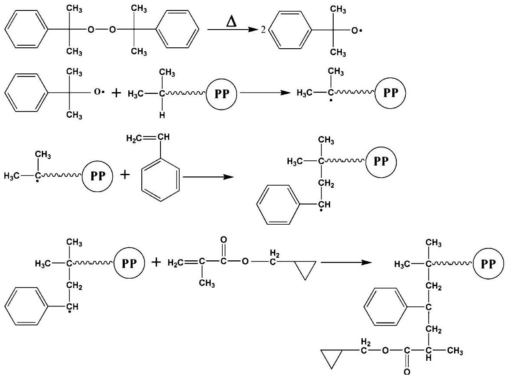
Scheme 1 Widely-accepted mechanism for St-assisted GMA grafting onto PP

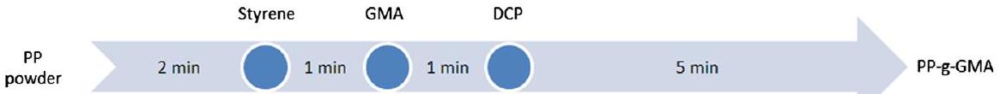
Scheme 2 Procedure used for grafting of GMA onto PP

Therefore, grafting of GMA molecules onto PP chins has been associated with undesired $\beta$-scission. The antagonism effect of $\beta$-scission thermo-oxidative reaction can be estimated by the FTIR spectroscopic and MFI measurements. To find the optimal processing parameters, i.e., concentrations of DCP, amount of GMA, and concentration of St comonomer that facilitates grafting reaction, a series of experiments are designed and carried out.

Prior to processing, PP in the form of powder was dried at 80 °C for 4 h and then introduced into the Internal Mixer Brabender Plasticorder PL2200 mixing chamber and allowed to become fully molten at 180 °C and rotor speed of 60 rpm. After 2 min, a homogeneous melt was reached and St comonomer was added using a syringe needle. The injection was performed very quickly to the bulk of molten PP to prevent evaporation of styrene, inspired by a previous study [14]. Exactly after 1 min elapsed, GMA was added to the chamber. The samples were taken out from the mixing chamber and quenched in liquid nitrogen to cease the reaction after 9 min . The procedure is schematized in Scheme 2.

The reaction products were then purified by dissolution in refluxing xylene followed by precipitation into acetone at room temperature under stirring to remove the unreacted monomers. After the precipitation, the PP- $g$-GMA was filtered, washed with excess acetone and dried under a vacuum at 80 °C for 10 h. The purified specimens were then compression molded at 300 bar pressure and 180°C into films 0.5 mm in thickness and used for FTIR analysis.

To calculate degree of GMA grafting onto PP chains, Fourier transform infrared (FTIR) spectroscopy was used. The FTIR measurements were conducted at a resolution of $4 \mathrm{~cm}^{-1}$ for 32 scans in the wavelength range of $4000-600 \mathrm{~cm}^{-1}$. As typically shown in Fig. 1 for GPP1 sample (samples are defined in Table 1), the transmittance peak appeared around $1730 \mathrm{~cm}^{-1}$ is assigned to the carbonyl stretching of grafted GMA and the one at $2722 \mathrm{~cm}^{-1}$ corresponds to the PP backbone. The assigned peak nearby the $720 \mathrm{~cm}^{-1}$ accounts for styrene. To determine the grafting yield of GMA, the ratio of intensity of GMA carbonyl peak to the PP one, named as $I_{1730} / I_{2722}$, was taken as a criterion and calculated for grafted samples.

PP- $g$-GMA (80 °C, 3 h) and PET (160 °C, 8 h) were dried and then blended at 260 °C and at a rotor speed of 60 rpm in the internal mixer with Irganox B215 as heat stabilizer for about 8 min . On the basis of 100 parts by weight of PET, PP- $g$ -GMA was added with different amounts (10, 20, and 30 phr) to PET and injection molded at 265 °C.

Table 1 represents results on grafting degree and yield of GMA onto PP and MFI results. To find the optimal concentration of the substances used in grafting of GMA on PP chains, various concentrations of materials were utilized as summarized in Table 1.

Scanning electron microscope (SEM, XL30 Philips, the Netherland) was used to observe morphological transitions. The micrographs were quantified by ImageJ 1.44p software, where totally 1000 particles were counted to determine the numberaverage diameter $\left(D_{\mathrm{n}}\right)$ of minor domains using the following equations:

Fig. 1 FTIR spectra of GPP1 specimen as a typical peak for PP- $g$-GMA copolymers
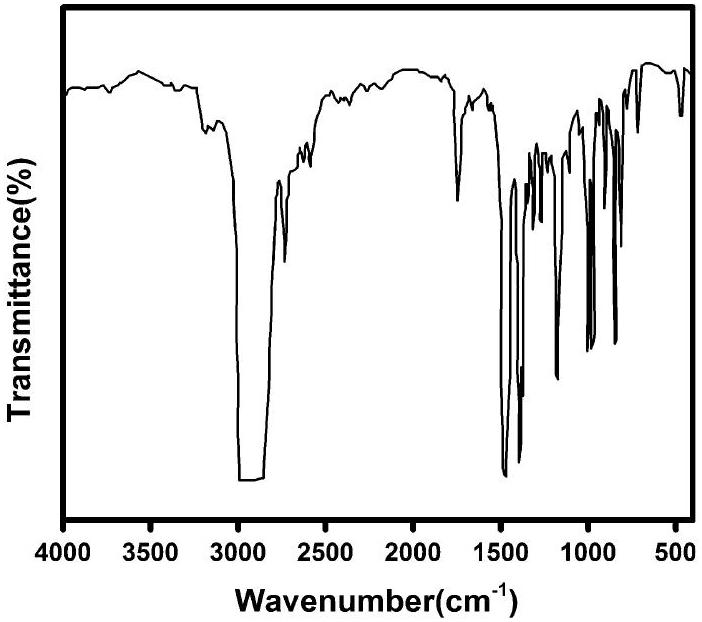

Table 1 Results on grafting degree and yield, and MFI measured for PP- $g$-GMA specimens
| Sample Code | GMA/(St/GMA)/ DCP ( ${ }^{\mathrm{a}} \mathrm{phr} /{ }^{\mathrm{b}} \mathrm{MR} / \mathrm{phr}$ ) | Degree of GMA grafted onto PP ( $\mathrm{Wt} \%$ ) | Yield of GMA grafted onto PP (\%) | MFI ( $230^{\circ} \mathrm{C}$, $2.16 \mathrm{~kg})(\mathrm{g} / 10 \mathrm{~min})$ |
| :--- | :--- | :--- | :--- | :--- |
| Neat PP | - | 0 | 0 | 12.0 |
| GPP1 | 4/1.5/0.3 | 2.28 | 57.0 | 35 |
| GPP2 | 6/1.5/0.3 | 2.72 | 45.36 | 18.6 |
| GPP3 | 8/1.5/0.3 | 3.07 | 38.45 | 13.5 |
| GPP4 | 6/1.5/0.5 | 3.02 | 50.26 | 20.2 |
| GPP5 | 6/1.5/0.7 | 3.13 | 52.12 | 24.8 |
| GPP6 | 8/0.0/0.5 | 1.58 | 19.64 | 51.9 |
| GPP7 | 8/1.0/0.5 | 3.33 | 41.65 | 23.8 |
| GPP8 | 8/1.5/0.5 | 3.68 | 45.97 | 23.0 |

${ }^{\mathrm{a}}$ Parts by weight based on 100 parts by weight of PP
${ }^{\mathrm{b}}$ Molar ratio

$$
\begin{equation*}
D_{\mathrm{n}}=\frac{\sum_{i=1}^{\infty} n_{i} D_{i}}{\sum_{i=1}^{\infty} n_{i}}, \tag{1}
\end{equation*}
$$

where $D_{i}$ and $n_{i}$ are the diameter and number of counted droplets, respectively.
Izod impact strength was conducted on the notched samples (Ueshima Seisakusho, Japan) to evaluate the toughness of samples according to ASTM D256. The specimens for the impact test were prepared by pressure molding under 400 bars and 300 °C. This test was repeated five times and an average value was reported for each sample. Thermal behavior of the neat and blend samples was assessed by dynamic mechanical analysis (DMA, TA Instruments, USA). For this purpose, samples were heated from room temperature to 150 °C at a rate of 2 °C/ min on the basis of three-point bending method. The MFI test was carried out using Davenport MFI recorder (LLOYD, AMETEK, UK). The MFI test was carried out at 230 °C and 2.16 kg according to ASTM D1238.

## Result and discussion

## Influence of grafting parameters on PET-PP interfacial adhesion

## Effect of St concentration

Difference in polarity reported between PP and GMA may lead to an expectation of low degree of grafting. The effects of addition of St comonomer on grafting, MFI and mechanical torque of melt during grafting reaction are visualized in Fig. 2. As shown in the Fig. 2a, grafting of GMA on PP takes place with the aid of St, for addition of St significantly promotes GMA grafting. This is owing to the higher reactivity of St toward PP, because of the fact that stable styryl macroradicals can simply react with GMA [24]. It has been reported that incorporation of St not only

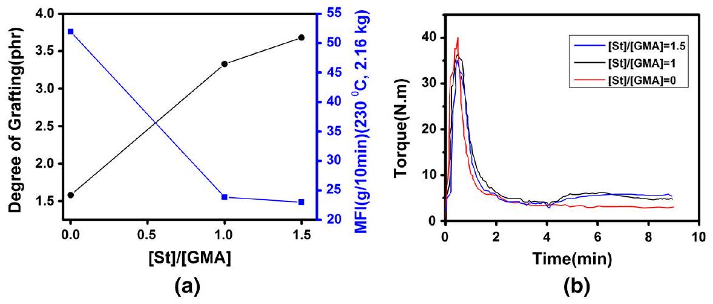
Fig. 2 Assessment of grafting reaction of GMA onto PP at different $[\mathrm{St}] /[\mathrm{GMA}]$ ratios ( $[\mathrm{GMA}]=8 \mathrm{phr}$, $[\mathrm{DCP}]=0.5 \mathrm{phr})$; a degree of grafting and MFI variation, b torque-time variation

increases the amount of grafted GMA molecules, but also accelerates the homopolymerization of GMA monomers [35, 36]. In agreement with this, for a given concentration of GMA, degree of grafting increased upon addition of St, but the rate of increase has fallen at [St]/[GMA] ratio above unity. It has been mentioned earlier that grafting of GMA onto PP chain would be limitedly successive in the absence of St comonomer due to the low affinity of PP towards GMA. In such a situation, chain scission is dominant and causes decrease in molecular weight of the final product, through which a rise in MFI value.

In agreement with these observations, mechanical torque has increased during grafting reaction upon addition of St to the system (Fig. 2b). Noticeably, upon addition of initiator to the system (after 4 min), the torque has increased significantly for the samples containing St, which can be attributed to the enhanced grafting of GMA onto PP chains.

Figure 3 shows the effect of addition and increasing the amount of St on the impact strength and glass transition temperature of 100/20 PET/PP binary blends. According to the figure, the higher interfacial bonding between PET and PP- $g$-GMA led to an increase in the impact strength of the assigned specimen [36]. Nonetheless, the degree of success is not significant, possibly because of probable homopolymerization of GMA monomers [35]. In parallel with enhanced impact strength, a descending trend was seen for glass transition temperature upon increase of St content. This suggests an enhanced interfacial adhesion between PP and PET phases on account of change in glass transitions from ca. -20 to 92.5 °C.

Strengthening of PET/PP interface can be interpreted in view of reaction between PET end-groups with GMA precursor, as illustrated in Scheme 3 [37]. Such improvement in interfacial adhesion between GMA and PET dramatically changes the morphology of PET-rich blends, as discussed in next sections.

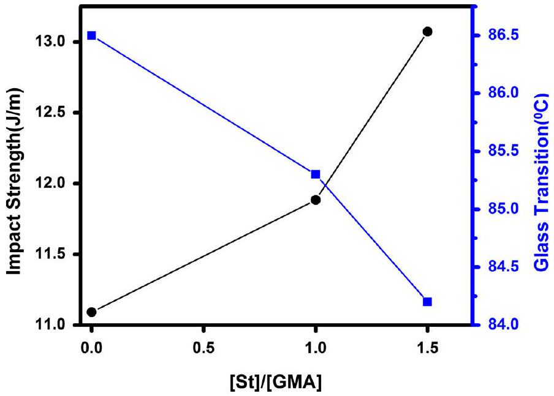
Fig. 3 Influence of [St]/[GMA] ratio on the impact strength and glass transition temperature of 100/20 (phr) PET/PP blend $([\mathrm{GMA}]=8 \mathrm{phr},[\mathrm{DCP}]=0.5 \mathrm{phr})$

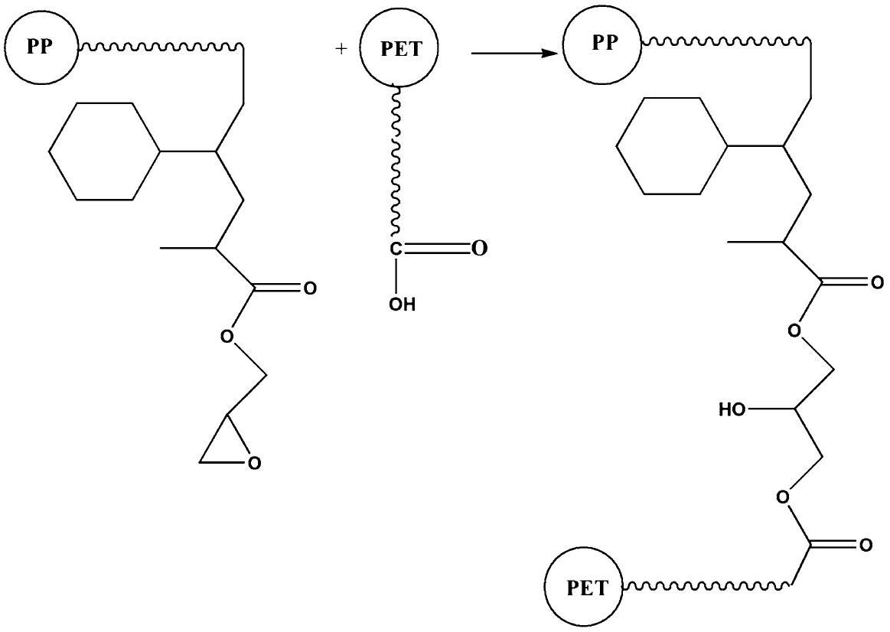
Scheme 3 Schematic representation of reaction between PET end-groups and GMA grafted onto PP backbone

Effect of GMA concentration
Alteration of grafting degree calculated based on FTIR spectra, together with the results of MFI and torque-time curves as a function of GMA content are presented

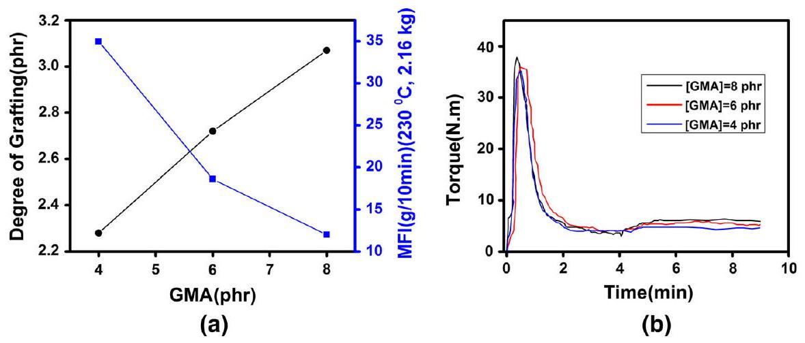
Fig. 4 Assessment of grafting reaction of GMA onto PP at different GMA content $[\mathrm{DCP}]=0.3 \mathrm{phr}$, $[\mathrm{St}] /[\mathrm{GMA}]=1.5)$; a Degree of grafting and MFI variation, $\mathbf{b}$ torque-time variation

in Fig. 4. It has been noticed that grafting and chain scission reactions are competitive in nature [33]. Since the total number of active sites remains almost unchanged at constant concentration of initiator, increase of GMA content assists in proceeding grafting reaction. A careful look at Fig. 4a elucidates that the rate of increase of degree of grafting is slightly decreasing with GMA addition, which suggests partial homopolymerization of GMA monomers via free-radical mechanism [28]. It should be added that grafting of GMA molecules onto polymer chain significantly decreases the mobility of free GMA molecules in the reaction chamber, especially in the bulk. This can similarly be signaled by a fall in flow ability of the prepared material. As a consequence of increased viscosity and decreased flow ability of material, the torque of the rotors during grafting is increased for samples with higher content of GMA (Fig. 4b). Thus, chain scission would be quite insignificant at elevated GMA contents.

SEM micrographs of 100/20 PET/PP- $g$-GMA blends with different amounts of GMA are shown in Fig. 5.

Several reports have made evident that PET/PP blends are completely immiscible [38, 39]. Very large particles of PP dispersed phase appeared in SEM micrograph of GMA-free blend (Fig. 5a) confirm this opinion. On the other hand, St, assisted in grafting of GMA onto PP, has improved the compatibility between PP and PET components. A significant drop in the size of PP dispersed domains (about 6 times) takes place from Fig. 5a-c, which is quantitatively represented in Fig. 6a. In agreement with this, impact strength increases with the amount of grafted GMA up to 6 phr, which provides support for an enhanced interaction between epoxy groups of GMA and carboxyl end-groups of PET, meanwhile hydrogen bonding between PP- $g$-GMA and PET (Fig. 6b). Such interactions decrease the interfacial tension and suppress the coalescence, leading to a reduction in particle size [40]. The reactive PP- $g$-GMA boosts covalent bonds between PP and PET and eases stress transfer through interface boundaries, which itself increases the mechanical properties [41, 42]. When the amount of GMA reached 8 phr, however, the impact strength is deteriorated. This can be explained in view of steric effects of grafted GMA

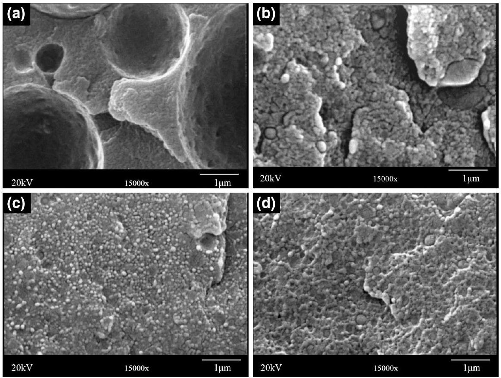
Fig. 5 SEM micrographs provided from fractured surfaces in PET/PP binary blends with various amounts of [GMA]: a 0 phr; b 4 phr; c 6 phr; and d 8 phr

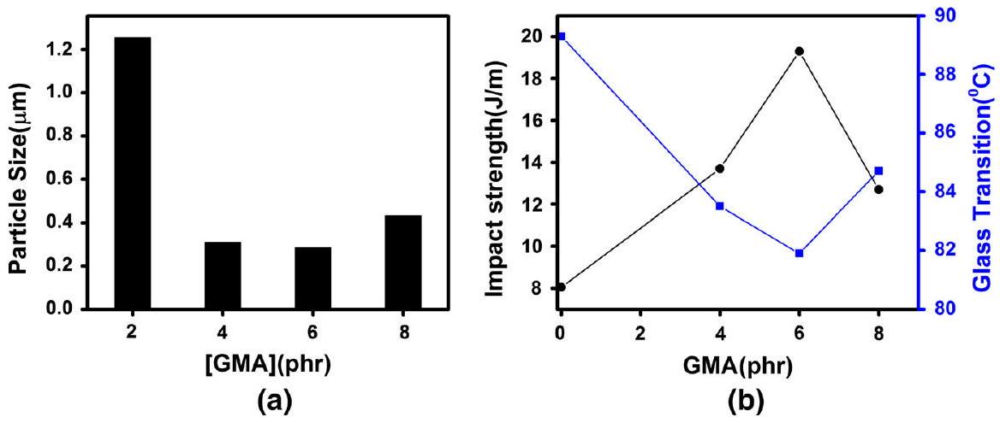
Fig. 6 Effect of GMA content on a particle size b impact strength and glass transition temperature of PET/PP $100 / 20$ phr $([\mathrm{St}] /[\mathrm{GMA}]=1.5,[\mathrm{DCP}]=0.3 \mathrm{phr})$

molecules, which makes effective bonding of PP with PET difficult. The imbalance between covalent and hydrogen bonds in the blend is supposed to be upset toward weaker hydrogen bonds, which has been featured by coarsening of morphology (Figs. 5d, 6a) as well as by a fall in impact strength and a rise glass transition temperature as well (Fig. 6b).

## Effect of DCP content

Figure 7 shows the effect of DCP content on the degree of grafting, MFI and mechanical torque of processing. In general, increase of initiator content causes formation of more free radicals, i.e., creating more active sites for grafting reactions on PP chains, but also assists in chain scission. With more radical sites, degree of grafting increases, which is in complete agreement with the results presented in other research works. With constant concentration of GMA monomer in the system, an increased grafting yield means that GMA molecules are consumed in grafting reactions noticeably, so that efficiency of grafting is increased [43]. Increase of initiator concentration does not necessarily upset the balance between grafting of GMA onto PP chain and $\beta$-scissions of PP macroradicals. Thus, intensity of chain scission is steadily increased with initiator concentration (Fig. 7a), leading to a fall in molecular weight of the resulting copolymer and torque enhancement (Fig. 7b). The obtained results are compatible with data already reported for similar cases in the literature, suggesting that increase of initiator concentration during grafting of GMA onto PP improves the fluidity of melt [44]. Thus, less energy should cogently be expected for having a proper mixing of blend components during grafting process.

An increase of DCP content leads to an increase in the number of PP macroradicals generated. Therefore, a lower molecular weight and higher density of grafting onto PP chain would be expected [28]. Results presented in Fig. 8 indicate that increase of DCP content above 0.5 phr has a negative influence on the compatibility and mechanical properties of PET/PP- $g$-GMA blends. This suggests that steric effects caused by highly grafted GMA and molecular weight suppression of PP- $g$-GMA due to $\beta$-scission reactions are both possible. As a result, glass transition temperature of sample containing 0.7 phr of DCP is markedly higher than that of materials with lower DCP content, suggesting a lower compatibility in PET/ PP- $g$-GMA blend with high amount of DCP.

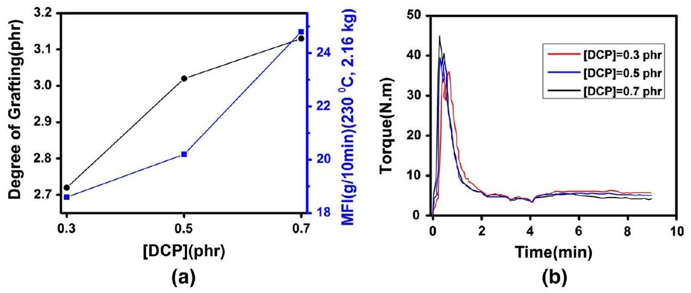
Fig. 7 Assessment of grafting reaction of GMA onto PP at different DCP content ([GMA] = 6 phr, [St]/ $[\mathrm{GMA}]=1.5)$; a degree of grafting and MFI variation, $\mathbf{b}$ torque-time variation

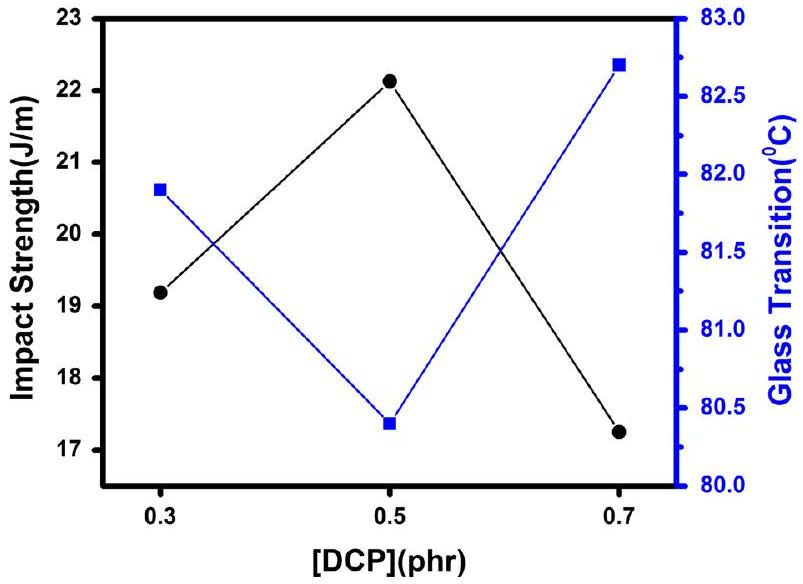
Fig. 8 Influence of DCP content on the impact strength and glass transition temperature of $100 / 20$ (phr) $\mathrm{PET} / \mathrm{PP}$ blend $([\mathrm{St}] /[\mathrm{GMA}]=1.5,[\mathrm{GMA}]=6 \mathrm{phr})$

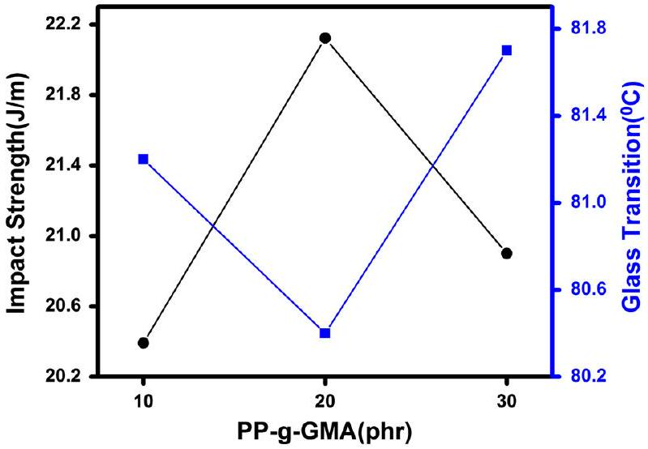
Fig. 9 Influence of DCP content on the impact strength and glass transition temperature of PET/PP- $g$ -GMA blends with $[\mathrm{GMA}]=6 \mathrm{phr},([\mathrm{St}] /[\mathrm{GMA}]=1.5,[\mathrm{DCP}]=0.5 \mathrm{phr}$

## Effect of PP- $\boldsymbol{g}$-GMA content on PET toughening

In the light of results presented above, it was interesting to know whether the content of PP- $g$-GMA added to PET could affect properties of the resulting blends with PET. According to Fig. 9, it was observed that impact strength of the prepared blends is enhanced upon increasing the PP- $g$-GMA content up to 20 phr, but above this the mechanical strength has been decreased.

As mentioned in case of PP/PET blends [45], the amount of grafted PP may cause noticeable changes in surface tension between two phases, resulting in an increase in particle size and deterioration of PET/PP- $g$-GMA compatibilization. Moreover, increased amount of GMA grafted on PP chain may cause unfavorable steric effects,
which hinder the covalent bonding of carboxyl end-groups from PET with epoxide groups in PP- $g$-GMA. So, hydrogen bonding could be the dominantly occurred phenomenon, which deteriorated the mechanical properties of blends. In agreement with this speculation, glass transition temperature of the blend shows maximum drop in case of neat PET. This is related to maximum interfacial adhesion or compatibility between PET and PP- $g$-GMA components. According to the results, addition of PP- $g$-GMA under specified condition can increase the impact of PET brittle matter.

## Concluding remarks

This work attempts to examine the potential of PP- $g$-GMA reactive precursor to improvement of static and dynamic mechanical properties of bottle grade PET. Melt free-radical grafting of GMA onto PP was performed through a controlled reaction, where GMA level, DCP content, and St comonomer concentration were changed as material parameters. FTIR analysis elucidated that PP- $g$-GMA has been formed and reacted with PET via chemical reaction between GMA and functional groups of PET. Morphological investigations confirmed interfacial tension suppression between PET and PP upon increase of GMA content, but DCP and St concentrations were found to be effective as well. Impact strength increased with the amount of grafted GMA up to 6 phr, due to an enhanced interaction between epoxy groups of GMA and carboxyl end-groups of PET, as well as hydrogen bonds formed between PP- $g$-GMA and PET. Further increase of GMA to 8 phr, however, deteriorated mechanical properties, possibly because of steric hindrance of grafted GMA molecules that hardened bonding of PP with PET. Optimal grafting results were obtained at GMA concentration of 5 phr, DCP content of 0.5 phr, and [St]/ [GMA] $=1.5$. Moreover, 100/20 PET/PP- $g$-GMA (phr) composition with [St]/ $[\mathrm{GMA}]=1.5$ revealed the highest impact among the studied blends.

## References

1. Roeder J, Oliveira RVB, Gonçalves MC, Soldi V, Pires ATN (2002) Polypropylene/polyamide-6 blends: influence of compatibilizing agent on interface domains. Polym Test 21(7):815-821. doi:10. 1016/S0142-9418(02)00016-8
2. Utracki LA (ed) (2002) Polymer blends handbook. Kluwer Academic Publishers, Dordrecht, The Netherlands
3. Wilkinson AN, Clemens ML, Harding VM (2004) The effects of SEBS- $g$-maleic anhydride reaction on the morphology and properties of polypropylene/PA6/SEBS ternary blends. Polymer 45(15):5239-5249. doi:10.1016/j.polymer.2004.05.033
4. Filippi S, Chiono V, Polacco G, Paci M, Minkova LI, Magagnini P (2002) Reactive compatibilizer precursors for LDPE/PA6 blends, 1. Ethylene/acrylic acid copolymers. Macromol Chem Phys 203(10-11):1512-1525. doi:10.1002/1521-3935(200207)203:10/11<1512:aid-macp1512>3.0.co;2-g
5. Jiang C, Filippi S, Magagnini P (2003) Reactive compatibilizer precursors for LDPE/PA6 blends. II: maleic anhydride grafted polyethylenes. Polymer 44(8):2411-2422. doi:10.1016/S0032-3861(03)00133-2

6. Rastin H, Jafari SH, Saeb MR, Khonakdar HA, Wagenknecht U, Heinrich G (2014) Mechanical, rheological, and thermal behavior assessments in HDPE/PA-6/EVOH ternary blends with variable morphology. J Polym Res 21(2):1-13
7. Rastin H, Saeb MR, Jafari SH, Khonakdar HA, Kritzschmar B, Wagenknecht U (2015) Reactive compatibilization of ternary polymer blends with core-shell type morphology. Macromol Mater Eng 300(1):86-98
8. Saeb MR, Khonakdar HA, Jafari SH, Rastin H, Wagenknecht U, Heinrich G (2015) Towards quantifying interfacial adhesion in the ternary blends with matrix/shell/core-type morphology. Polym Plast Technol Eng 54(2):223-232
9. Khalili R, Jafari SH, Saeb MR, Khonakdar HA, Wagenknecht U, Heinrich G (2014) Toward in situ compatibilization of polyolefin ternary blends through morphological manipulations. Macromol Mater Eng 299(10):1197-1212. doi:10.1002/mame.201300452
10. Khonakdar HA, Jafari SH, Mirzadeh S, Kalaee MR, Zare D, Saeb MR (2013) Rheology-morphology correlation in PET/PP blends: influence of type of compatibilizer. J Vinyl Addit Technol 19(1):25-30. doi:10.1002/vnl. 20318
11. Sarami R, Golshan Ebrahimi N, Razzaghi Kashani M (2008) Study of polypropylene/polyethylene terephthalate blend fibres compatibilized with glycidyl methacrylate. Iran Polym J 17(4):243
12. Calcagno CIW, Mariani CM, Teixeira SR, Mauler RS (2008) The role of the MMT on the morphology and mechanical properties of the PP/PET blends. Compos Sci Technol 68(10-11):2193-2200. doi:10.1016/j.compscitech.2008.03.012
13. Bettini SHP, de Mello LC, Muñoz PAR, Ruvolo-Filho A (2013) Grafting of maleic anhydride onto polypropylene, in the presence and absence of styrene, for compatibilization of poly(ethylene terephthalate)/(ethylene-propylene) blends. J Appl Polym Sci 127(2):1001-1009. doi:10.1002/app. 37891
14. Asgari M, Masoomi M (2013) Tensile and flexural properties of polypropylene/short poly(ethylene terephthalate) fibre composites compatibilized with glycidyl methacrylate and maleic anhydride. J Thermoplast Compos Mater 28(3):357-371. doi:10.1177/0892705713484748
15. Zhang C-L, Feng L-F, Gu X-P, Hoppe S, Hu G-H (2007) Efficiency of graft copolymers as compatibilizers for immiscible polymer blends. Polymer 48(20):5940-5949. doi:10.1016/j.polymer.2007. 07.042
16. Zhang X, Li B, Wang K, Zhang Q, Fu Q (2009) The effect of interfacial adhesion on the impact strength of immiscible PP/PETG blends compatibilized with triblock copolymers. Polymer 50(19):4737-4744. doi:10.1016/j.polymer.2009.08.004
17. Jazani OM, Arefazar A, Jafari SH, Peymanfar MR, Saeb MR, Talaei A (2013) SEBS- $g$-MAH as a reactive compatibilizer precursor for PP/PTT/SEBS ternary blends: morphology and mechanical properties. Polym Plast Technol Eng 52(2):206-212. doi:10.1080/03602559.2012.735739
18. Xie X-M, Chen N-H, Guo B-H, Li S (2000) Study of multi-monomer melt-grafting onto polypropylene in an extruder. Polym Int 49(12):1677-1683. doi:10.1002/1097-0126(200012)49: 12<1677:aid-pi590>3.0.co;2-0
19. Passaglia E, Coiai S, Augier S (2009) Control of macromolecular architecture during the reactive functionalization in the melt of olefin polymers. Prog Polym Sci 34(9):911-947. doi:10.1016/j. progpolymsci.2009.04.008
20. Shi D, Yang J, Yao Z, Wang Y, Huang H, Jing W, Yin J, Costa G (2001) Functionalization of isotactic polypropylene with maleic anhydride by reactive extrusion: mechanism of melt grafting. Polymer 42(13):5549-5557. doi:10.1016/S0032-3861(01)00069-6
21. Bae T-Y, Park K-Y, Kim D-H, Suh K-D (2001) Poly(ethylene terephthalate)/polypropylene reactive blends through isocyanate functional group. J Appl Polym Sci 81(5):1056-1062. doi:10.1002/app. 1527
22. Burton E-L, Woodhead M, Coates P, Gough T (2010) Reactive grafting of glycidyl methacrylate onto polypropylene. J Appl Polym Sci 117(5):2707-2714. doi:10.1002/app. 31085
23. Shashidhara GM, Kameshawari Devi SH, Preethi S (2013) Isothermal crystallization behavior of PP and PP- $g$-GMA copolymer at high undercooling. Polym Sci Ser A 55(6):393-403. doi:10.1134/ S0965545X13060059
24. Saeb MR, Garmabi H (2009) Investigation of styrene-assisted free-radical grafting of glycidyl methacrylate onto high-density polyethylene using response surface method. J Appl Polym Sci 111(3):1600-1605. doi:10.1002/app. 29123

25. Cho KY, Eom J-Y, Kim C-H, Park J-K (2008) Grafting of glycidyl methacrylate onto high-density polyethylene with reaction time in the batch mixer. J Appl Polym Sci 108(2):1093-1099. doi:10. 1002/app. 27715
26. Li J-L, Xie X-M (2012) Reconsideration on the mechanism of free-radical melt grafting of glycidyl methacrylate on polyolefin. Polymer 53(11):2197-2204. doi:10.1016/j.polymer.2012.03.035
27. Wang C, Dai W, Zhang Z, Mai K (2013) Effect of blending way on $\beta$-crystallization tendency of compatibilized $\beta$-nucleated isotactic polypropylene/poly(ethylene terephthalate) blends. J Therm Anal Calorim 111(2):1585-1593. doi:10.1007/s10973-012-2425-0
28. Saeb MR, Rezaee B, Shadman A, Formela K, Ahmadi Z, Hemmati F, Kermaniyan TS, Mohammadi Y (2017) Controlled grafting of vinylic monomers on polyolefins: a robust mathematical modeling approach. Des Monomers Polym 20(1):250-268
29. Kim CH, Cho KY, Park JK (2001) Grafting of glycidyl methacrylate onto polycaprolactone: preparation and characterization. Polymer 42(12):5135-5142. doi:10.1016/S0032-3861(01)00013-1
30. Chen L-F, Wong B, Baker WE (1996) Melt grafting of glycidyl methacrylate onto polypropylene and reactive compatibilization of rubber toughened polypropylene. Polym Eng Sci 36(12):1594-1607. doi:10.1002/pen. 10556
31. Esmizadeh E, Moghri M, Saeb MR, Mohsen Nia M, Nobakht N, Bende NP (2016) Application of Taguchi approach in describing the mechanical properties and thermal decomposition behavior of poly(vinyl chloride)/clay nanocomposites: highlighting the role of organic modifier. J Vinyl Addit Technol 22(3):182-190. doi:10.1002/vnl. 21395
32. Li Y, Xie X-M, Guo B-H (2001) Study on styrene-assisted melt free-radical grafting of maleic anhydride onto polypropylene. Polymer 42(8):3419-3425. doi:10.1016/S0032-3861(00)00767-9
33. Cartier H, Hu G-H (1998) Styrene-assisted melt free radical grafting of glycidyl methacrylate onto polypropylene. J Polym Sci Part A Polym Chem 36(7):1053-1063. doi:10.1002/(SICI)1099-0518(199805)36:7<1053:AID-POLA3>3.0.CO;2-3
34. Pesneau I, Champagne MF, Huneault MA (2004) Glycidyl methacrylate-grafted linear low-density polyethylene fabrication and application for polyester/polyethylene bonding. J Appl Polym Sci 91(5):3180-3191. doi:10.1002/app. 13487
35. Torres N, Robin JJ, Boutevin B (2001) Functionalization of high-density polyethylene in the molten state by glycidyl methacrylate grafting. J Appl Polym Sci 81(3):581-590. doi:10.1002/app. 1473
36. Pracella M, Chionna D (2003) Reactive compatibilization of blends of PET and PP modified by GMA grafting. Macromol Symp 198(1):161-172. doi:10.1002/masy. 200350814
37. Asgari M, Masoomi M (2012) Thermal and impact study of PP/PET fibre composites compatibilized with glycidyl methacrylate and maleic anhydride. Compos B Eng 43(3):1164-1170. doi:10.1016/j.compositesb.2011.11.035
38. Park Y, Song I, Kim H (2014) Characterization of PET/PP blend fiber and it's application to wig. Fibers Polym 15(5):1078-1083. doi:10.1007/s12221-014-1078-y
39. Gartner C, Suárez M, López BL (2008) Grafting of maleic anhydride on polypropylene and its effect on blending with poly(ethylene terephthalate). Polym Eng Sci 48(10):1910-1916. doi:10.1002/pen. 21106
40. Hale W, Keskkula H, Paul DR (1999) Compatibilization of PBT/ABS blends by methyl methacry-late-glycidyl methacrylate-ethyl acrylate terpolymers. Polymer 40(2):365-377. doi:10.1016/S0032-3861(98)00189-X
41. Jayanarayanan K, Thomas S, Joseph K (2008) Morphology, static and dynamic mechanical properties of in situ microfibrillar composites based on polypropylene/poly (ethylene terephthalate) blends. Compos A Appl Sci Manuf 39(2):164-175. doi:10.1016/j.compositesa.2007.11.008
42. Yi X, Xu L, Wang Y-L, Zhong G-J, Ji X, Li Z-M (2010) Morphology and properties of isotactic polypropylene/poly(ethylene terephthalate) in situ microfibrillar reinforced blends: influence of viscosity ratio. Eur Polym J 46(4):719-730. doi:10.1016/j.eurpolymj.2009.12.027
43. Ganzeveld KJ, Janssen LPBM (1992) The grafting of maleic anhydride on high density polyethylene in an extruder. Polym Eng Sci 32(7):467-474. doi:10.1002/pen. 760320703
44. Huang H, Liu NC (1998) Nondegradative melt functionalization of polypropylene with glycidyl methacrylate. J Appl Polym Sci 67(12):1957-1963. doi:10.1002/(SICI)1097-4628(19980321)67: 12<1957:AID-APP1>3.0.CO;2-M
45. Akbari M, Zadhoush A, Haghighat M (2007) PET/PP blending by using PP- $g$-MA synthesized by solid phase. J Appl Polym Sci 104(6):3986-3993. doi:10.1002/app. 26253

[^0]:    Omid Moini Jazani
    o.moini@eng.ui.ac.ir
    Mohammad Reza Saeb
    saeb-mr@icrc.ac.ir
    ${ }^{1}$ Department of Chemical Engineering, Faculty of Engineering, University of Isfahan, P.O. Box: 81746-73441, Isfahan, Iran
    ${ }^{2}$ School of Chemical Engineering, College of Engineering, University of Tehran, P.O. Box: 11155-4563, Tehran, Iran
    ${ }^{3}$ Department of Polymer Technology, Faculty of Chemistry, Gdansk University of Technology, Gdańsk, Poland
    ${ }^{4}$ Department of Organic Dyes and Pigments, Institute for Color Science and Technology, P.O. Box: 16765-654, Tehran, Iran
    ${ }^{5}$ Department of Polymer Engineering, Amirkabir University of Technology, Mahshahr Branch, Mahshahr, Iran
    ${ }^{6}$ Department of Resin and Additives, Institute for Color Science and Technology, P.O. Box: 16765-654, Tehran, Iran
