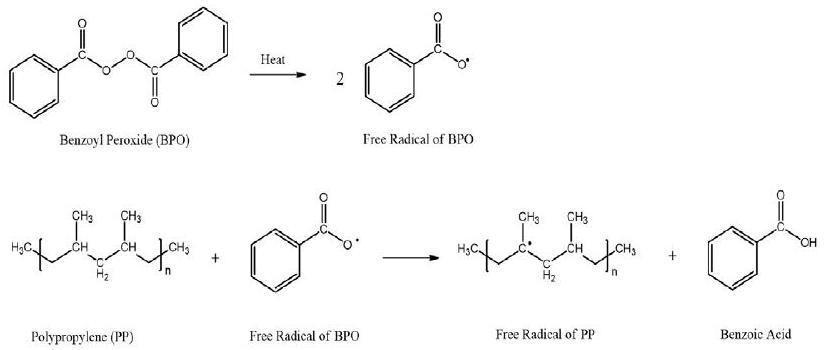
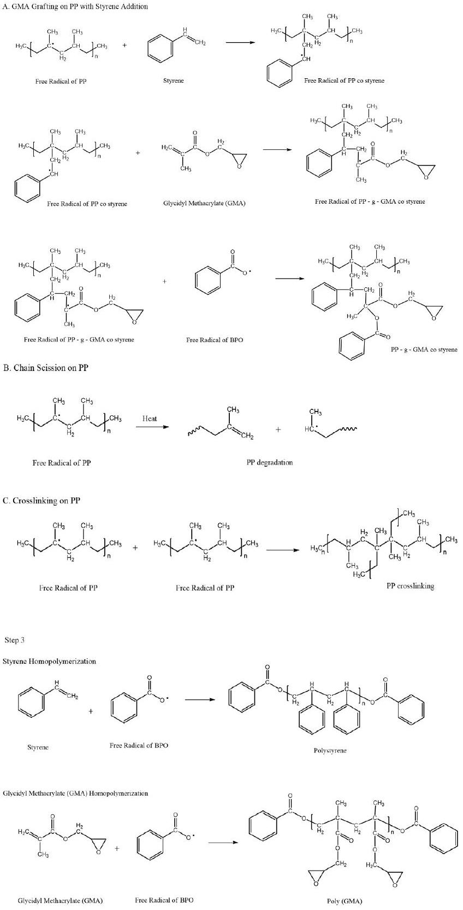
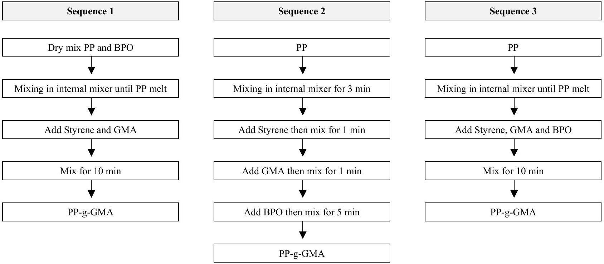
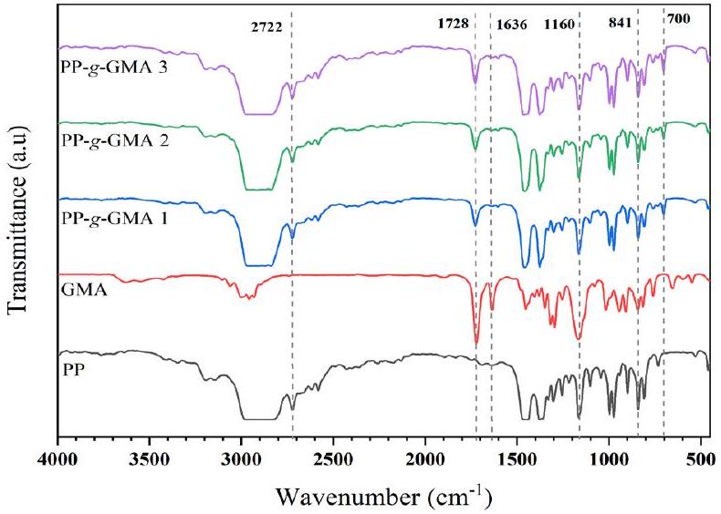
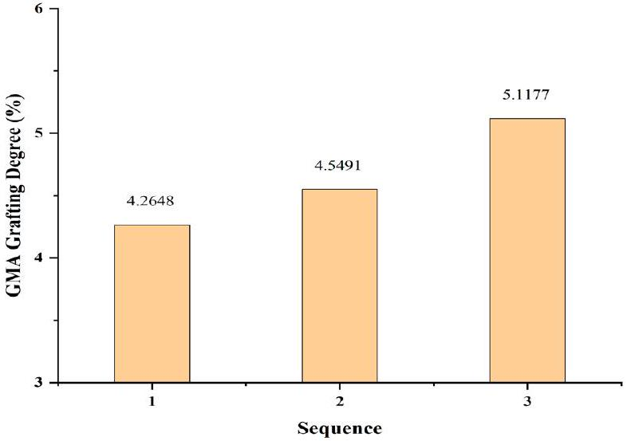
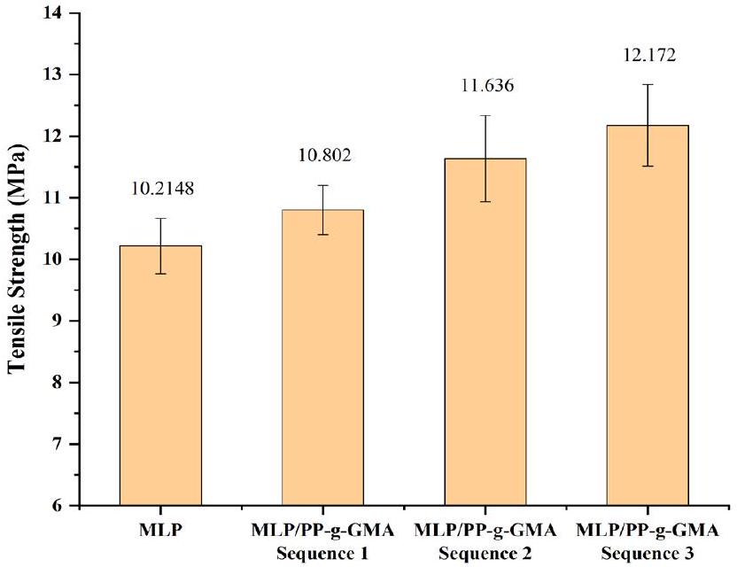
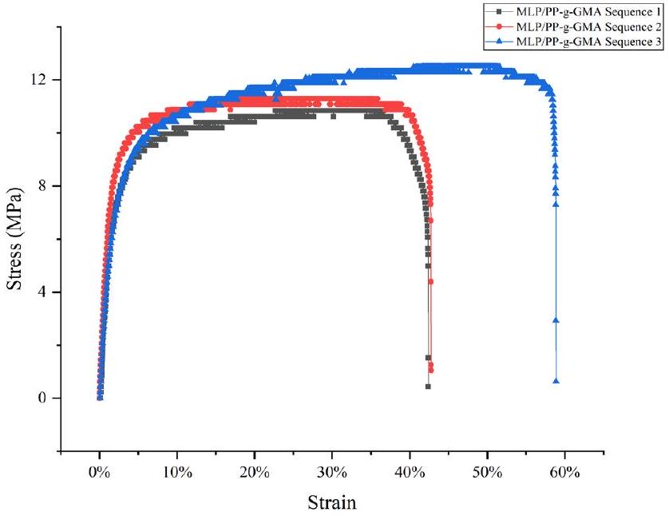
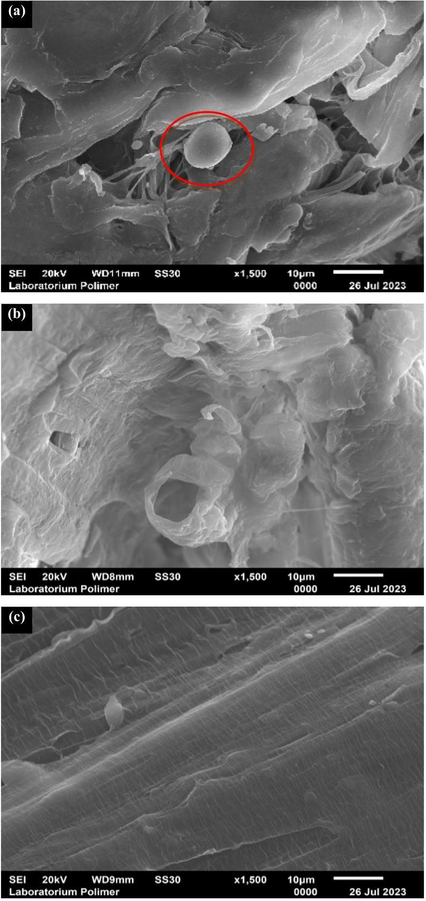

# The effect of mixing sequence on synthesis of PP-g-GMA compatibilizer for multilayer packaging (MLP) compounding 

Fitri Ayu RADINI ${ }^{1, *}$, Firda APRIYANI ${ }^{2}$, Yogi Angga SWASONO ${ }^{1}$, Reza Pahlevi RUDIANTO ${ }^{1}$, Nonni Soraya SAMBUDI ${ }^{3}$, and Yose Fachmi BUYS ${ }^{4}$ ${ }^{1}$ Research Centre for Polymer Technology, National Research and Innovation Agency, Gedung 460 Kawasan Sains dan Teknologi (KST) B.J. Habibie Setu, Tangerang Selatan, Banten, 15314, Indonesia ${ }^{2}$ Research Centre for Advanced Chemistry National Research and Innovation Agency, Gedung 460 Kawasan Sains dan Teknologi (KST) B.J. Habibie Setu, Tangerang Selatan, Banten, 15314, Indonesia ${ }^{3}$ Department of Chemical Engineering, Faculty of Industrial Technology, Universitas Pertamina, Jakarta 12220, Indonesia ${ }^{4}$ Department of Mechanical Engineering, Faculty of Industrial Technology, Universitas Pertamina, Jakarta 12220, Indonesia

*Corresponding author e-mail: fitr016@brin.go.id

## Received date:

14 July 2023
Revised date
13 February 2024
Accepted date:
5 April 2024

## Keywords:

Multilayer food packaging; PP-g-GMA;
GMA grafting degree; Initiator;
Compatibilizer

#### Abstract

Melt recycling Multilayer Packaging (MLP) waste is difficult due to challenging separation procedures. However, blending techniques with compatibilizers can simplify MLP waste melt recycling. PP-g-GMA is a common compatibilizer in polyolefin and PET blends. PP-g-GMA compatibilizer was synthesized by utilizing an internal mixer at 175°C, 50 rpm, and 10 min using styrene as a comonomer. Titration was a method to examine effect of three different sequences of adding the BPO initiator on GMA grafting. Each sequence's PP-g-GMA samples were compounded with MLP waste using a twin-screw extruder and injection molded to make tensile test specimens. FTIR analysis shows that the GMA and Styrene monomers had grafted onto the PP polymer backbone, with the GMA grafting degree by varying mixing sequence. Sequence 3, which introduced initiator, GMA, and styrene simultaneously to PP melt, yielded PP-g-GMA with the most significant GMA grafting degree of 5.11\%. Adding PP-g-GMA produced from sequence 3 into the MLP melt enhanced the highest increase in tensile strength and elongation at break of the MLP/PP-g-GMA compound.

## 1. Introduction

Recent estimates indicate that between 1.15 million tonnes and 2.41 million tonnes of plastics come to the oceans yearly from various rivers worldwide. The rivers that pollute the sea the most are primarily located in Asia and annually contribute more than 67\% of plastic waste to the ocean [1]. Multilayer food packaging (MLP) debris makes up approximately 21\% of the plastic waste floating in the waterways of West Java, Indonesia [2]. Polyethylene (PE), Polypropylene (PP), and Polyethylene Terephtalate (PET) are the most commonly utilized polymers in MLP waste [3]. Because of the various polymers used in MLP waste, processing MLP waste is less desirable because of the challenging separation procedure required [4]. Polymer blending technology is an alternative for processing MLP waste because PE, PP, and PET polymers can be mixed directly without separation. However, because of limited interfacial adhesion, the compatibility of PE, PP, and PET polymers is limited, resulting in blends with poor mechanical properties [5,6].

Utilizing a compatibilizer in a blend of polyolefin and PET polymers can improve the compatibility between the polymers by increasing interfacial adhesion and decreasing interfacial tension, thereby improving the mechanical properties of the mixture [6,7].

Polymers grafted with maleic anhydride (MA) or glycidyl methacrylate (GMA) monomers, such as polypropylene-graft-maleic anhydride (PP-g-MA), polyethylene-graft-maleic anhydride (PE-g-MA), poly (styrene-ethylene/butylene-styrene) block copolymer-graft-maleic anhydride (SEBS-g-MA), and ethylene-glycidyl methacrylate copolymer (E-GMA), are widely used as compatibilizers in polyolefin and PET blends [6]. Using these compatibilizers can improve the mixture's mechanical properties and morphological structure. The Ethylene-GMA compatibilizer gave better results in PE/PP/PET polymer blends than SEBS-g-MA [6]. Another GMA-based compatibilizer, PP-g-GMA, has been used in PP/PBT blends and is a more effective compatibilizer than PP-g-MA [8]. GMA is more reactive than MA due to the presence of epoxy groups that can react with the carboxyl and hydroxyl groups in PET [9].

GMA graft polymer compatibilizers are generally produced by melting grafting monomer into the polymer chain using an extruder or an internal mixer [10-13]. Figure 1 shows the proposed polymer-g-GMA compatibilizer synthesis reaction.

The reaction begins with the creation of polymer macroradicals due to thermo-mechanical action from the screw or a reaction with primary radicals from the initiator, as shown in step 1. The macroradical polymer undergoes three competing reactions: monomer grafting on
the polymer chain and structural change reaction, as shown in step 2, and monomer homopolymerization, as shown in step 3. Polymer structural changes can be chain scission or crosslinking. The grafting should dominate the others to increase polymer GMA grafting.

Step 1

Step 2

Figure 1. Proposed Melt Grafting Monomer Reaction in Polyolefin.

The formation of radicals by the initiator plays an essential role in the reaction to form the polymer-g-GMA. Consider the production of the primary radical from the initiator without monomers. In that case, a process will occur between the polymer macroradicals and other polymer chains to form crosslinked bonds (in PE) or chain termination (in PP). However, when the monomer is already present in the system, there are opportunities for side reactions other than the grafting reaction of the monomer on the polymer chain. The side reaction is the reaction of the monomer with the primary radical resulting in monomer homopolymerization.

Based on the preceding discussion, it is necessary to research variations in the sequence of adding an initiator to find out the best path for adding an initiator. A more dominant grafting reaction can occur and leads to an increase in \% GMA grafting in the polyolefin-g-GMA compatibilizer.

This research used an internal mixer to compound a PP-g-GMA compatibilizer. Styrene was used as a comonomer to increase the \% GMA grafting value in the PP chain [13]. The initiator utilized was Benzoyl Peroxide (BPO). The sequences for adding the initiator to the PP-g-GMA formulation were varied. Sequence 1 was when the initiator undergoes addition to the PP melt before the monomer and comonomer enter the system. Sequence 2 was when the addition of the initiator takes place after the monomer and comonomer enter the system. Sequence 3 was when the addition of the initiator takes place along with the monomer and comonomer to PP melt. The resultant PP-g-GMA would be a compatibilizer in a Polyolefin and PET polymer-based MLP waste mixture. The results observed in this study were the \% GMA grafting on PP-g-GMA and the mechanical properties of the MLP waste mixture.

## 2. Experimental

### 2.1 Materials

The materials used in this study included Polypropylene (PP) from PT. Chandra Asri Petrochemical, Glycidyl Methacrylate (GMA) in liquid phase with boiling point of $189^{\circ} \mathrm{C}$, Styrene in liquid phase with boiling point of 145°C, Benzoyl Peroxide (BPO) (Merck) in solid phase, Xylene (J.T.Baker), NaOH (Merck), Trichloroacetate (TCA) (Merck), Ethyl Acetate (Merck), Acetone (Merck), Methanol (J.T.Baker), and shredded MLP waste.

### 2.2 Synthesis of PP-g-GMA

The HAAKE Rheocord internal mixer was an instrument to produce PP-g-GMA. The PP-g-GMA formulation was 31.24 g PP, 0.36 g BPO, 2.4 g GMA, and 6 g styrene. The process condition of the internal mixer is $175^{\circ} \mathrm{C}, 50 \mathrm{rpm}$, and a mixing time of 10 min. Figure 2 shows PP-g-GMA production methods with different initiator addition sequences.

### 2.3 Purification of PP-g-GMA

PP-g-GMA purification was carried out to remove homo- and co-polymer from GMA and styrene so that the remaining sample was PP-g-GMA. The PP-g-GMA purification procedure was carried out
based on the procedure performed by Jazani et al. [13]. 5 g of PP-g-GMA was dissolved into 100 mL of hot xylene. Then acetone was added, resulting in the formation of precipitation. The precipitate was then filtered and washed using acetone. This pure PP-g-GMA precipitate was dried in the oven for 10 h at 180°C.

### 2.4 The determination of grafting degree

Acid-base titration determined GMA grafting degree [14]. A purified PP-g-GMA sample of 0.5 g was dissolved in hot xylene, approximately 80 mL . The purified PP-g-GMA solution was dissolved in xylene and then refluxed at 105°C to 110°C for 90 min after adding 2 mL of 0.3 M TCA solution in xylene. Then the solutions were cooled to condense at room temperature and filtered to separate the precipitate and filtrate. Then the filtrate was titrated with 0.1 M NaOH in methanol using phenolphthalein (pp) as an indicator. The degree of grafting (GD) is calculated by Equation (1). The volume of NaOH calculated in Equation (1) is the average of 3 times of titration data collection.

$$
\begin{equation*}
\mathrm{GD} \%=\frac{\left(\left(\mathrm{V}_{\mathrm{TCA}} \times \mathrm{M}_{\mathrm{TCA}}\right)-\left(\mathrm{V}_{\mathrm{NaOH}} \times \mathrm{M}_{\mathrm{NaOH}}\right)\right) \times \operatorname{Mr} \mathrm{GMA}}{\mathrm{~W} \text { Pure PP-g-GMA }} \times 100 \tag{1}
\end{equation*}
$$

### 2.5 Structure characterization of PP-g-GMA

Analysis of the functional groups of the PP-g-GMA compatibilizer was carried out using a Fourier Transform Infrared (FTIR) Bruker Tensor 27. The purified PP-g-GMA samples from each sequence were melted using a hot press at $165^{\circ} \mathrm{C}$ for 3 min and given a pressure of 3 tons for 3 min, resulting in the formation of a thin film. The thin film samples were then placed into a magnetic film holder, and the infra-red spectra were recorded at wave numbers $4000 \mathrm{~cm}^{-1}$ to $400 \mathrm{~cm}^{-1}$ using transmission method.

### 2.6 Compounding PP-g-GMA with MLP waste

The pre-treatment of shredded multilayer packaging (MLP) waste consisting of recycled PP, PE, and PET was dried in an oven at 70°C for 21 h. Table 1 shows the twin-screw extruder compounding formulation and conditions.

### 2.7 Mechanical testing on MLP waste compounds

Preparation of test specimens was conducted using injection molding Battenfeld BA 400/125 CDC. The ASTM type 4 mold was used for tensile test specimens. The injection molding conditions were barrel temperature $190^{\circ} \mathrm{C}$ to $240^{\circ} \mathrm{C}$, nozzle temperature $250^{\circ} \mathrm{C}$, mold temperature 50°C, injection speed 50 rpm, and cooling time 45 s. Sample conditioning was carried out at 23°C for 40 h. The tensile strength test was carried out based on the ASTM D638 type 1 test standard with a tensile speed of $5 \mathrm{~mm} \cdot \mathrm{~min}^{-1}$. Tensile tests were carried out using the Shimadzu AGS-10 kN Universal Testing Machine.

### 2.8 Morphology analysis

The scanning electron microscope (JEOL JSM6510LA) was used to obtain morphological images of the MLP/PP-g-GMA compound from fracture surfaces of specimens used in tensile testing. The samples were examined at 1500x magnification at an accelerated voltage of 20 kV after being coated with a thin film of platinum using a sputtering technique.

Figure 2. The Synthesis sequences of PP-g-GMA at $175^{\circ} \mathrm{C}$.

Table 1. The Formulation and process conditions for composite compounding
|  | Formula (wt\%) |  | Temperature zone ( ${ }^{\circ} \mathrm{C}$ ) |  |  |  |  |  |  |  | Rpm |
| :--- | :--- | :--- | :--- | :--- | :--- | :--- | :--- | :--- | :--- | :--- | :--- |
| MLP | PP-g-GMA | Antioxidant | 1 | 2 | 3 | 4 | 5 | 6 | 7 | 8 |  |
| 93 | 6 | 1 | 40 | 150 | 160 | 190 | 240 | 275 | 275 | 270 | 70 |

## 3. Results and discussion

### 3.1 FTIR analysis of PP-g-GMA

Figure 3 shows the FTIR spectra of PP, GMA, and PP-g-GMA seq 1, seq 2, and seq 3. The FTIR spectra of PP and PP-g-GMA seq 1, seq 2, and seq 3 show the distinctive peak of the PP backbone at $2723 \mathrm{~cm}^{-1}$ [13]. The peaks at $1728 \mathrm{~cm}^{-1}, 1160 \mathrm{~cm}^{-1}$ and $841 \mathrm{~cm}^{-1}$ in GMA correspond to C=O bonds, C-O bonds and epoxy groups, respectively [15]. The FTIR spectra of PP-g-GMA seq 1, seq 2, and seq 3 similarly exhibit these three peaks. However, the peak at $1160 \mathrm{~cm}^{-1}$ and $841 \mathrm{~cm}^{-1}$ is also seen in the FTIR spectra of PP, possibly the $-\left(\mathrm{CH}_{2}\right)_{\mathrm{n}}$ - and C-H bond [16]. Furthermore, the characteristic peak at $700 \mathrm{~cm}^{-1}$, specific to styrene [17], is observed in the FTIR spectra of PP-g-GMA seq 1, seq 2, and seq 3. The presence of characteristic peaks of PP, GMA, and styrene in the FTIR spectra of PP-g-GMA seq 1, seq 2, and seq 3 suggests that GMA and styrene monomers have been effectively grafted onto the PP backbone.

The FTIR spectra of GMA also show a peak at wave number $1640 \mathrm{~cm}^{-1}$, which is the C=C bond in GMA [15]. However, this peak does not appear in the PP-g-GMA seq 1, seq 2 and seq 3 FTIR spectra. The reason may be due to the cleavage of the C=C bond in GMA upon interaction with the free radicals of PP, resulting in the formation of PP-g-GMA [18]. The above reaction mechanism predictions are shown in Figure 1.

Figure 3. FTIR Spectra of PP, GMA, PP-g-GMA seq 1, seq 2, and seq 3.

Figure 4. GMA Grafting Degree of PP-g-GMA sequence 1,2 and 3.

### 3.2 Effect of three sequences grafting on GMA grafting degree

Figure 4 shows the value of GMA grafting degree (\%) on PP-g-GMA seq 1, seq 2, and seq 3. PP-g-GMA from seq 1 has the lowest GMA grafting degree among the three paths, namely 4.26\%. The polyolefin macroradicals produced by the BPO addition and consumed at the beginning of the reaction before the monomers and comonomers entered the system may explain the above. Polyolefin macroradicals react with other polyolefin chains resulting in PP chain degradation [19].

Whereas the GMA grafting degree on PP-g-GMA seq 2 was $4.54 \%$. This value is higher than PP-g-GMA seq 1. In this sequence, the polymer, the GMA monomer, and the styrene comonomer melted together before adding the BPO. The melt mixture formed before the formation of macroradicals will result in a more even distribution of GMA and styrene. GMA and styrene, which are more distributed, will be more quickly bound to macroradicals PP. The above leads to a higher consumption of macroradical PP during the grafting reaction than during the chain scission reaction [20].

However, the GMA grafting degree on PP-g-GMA seq 2 was lower than on PP-g-GMA seq 3. Including the initiator after adding the monomer and comonomer will reduce the grafting degree (\%). The above is probably due to the more styrene comonomer consumed in the homopolymerization reaction before the addition of the initiator. Even without the presence of an initiator, styrene is capable of undergoing polymerization. Consequently, there will be a reduction in the amount of GMA grafted onto the PP chain since the amount of styrene that acts as a promoter is reducing [20,21]. Moreover, polyolefin macroradicals produced without an initiator do not have adequate concentrations to create a grafting reaction, decreasing the likelihood of GMA and styrene grafting reactions [22]. The above finding is consistent with the results of research conducted by Li and Xie [10].

Therefore, PP-g-GMA produced from seq 3 has the highest GMA grafting degree, which is $5.11 \%$. Such a sequence simultaneously introduces GMA, styrene, and BPO into the system. This one-step mixing process in manufacturing a compatibilizer can reduce the possibility of side reactions such as homopolymerization of monomer or PP degradation. The above sequence produces a better quality product due to fewer components evaporating during processing, which optimizes the grafting process. In addition, manufacturing PP-g-GMA using seq3 was more efficient than other sequences.

### 3.3 Effect of the addition of PP-g-GMA on tensile strength property of MLP waste compound

Figure 5 shows the results of the tensile strength of the MLP waste compound without and using the PP-g-GMA seq 1, seq 2, and seq 3. Adding the PP-g-GMA compatibilizer could enhance the tensile strength of the MLP waste mixture. According to Razak [23], an increase in tensile strength value in the presence of a compatibilizer shows a positive mixing effect. It indicates good interfacial adhesion. Thus, the tensile strength value of the sample would be superior with adding a compatibilizer.

Figure 5. Tensile strength of MLP waste/PP-g-GMA compound.

Figure 6. Stress-strain curves of MLP waste/PP-g-GMA Ccompound.

A MLP waste compound sample without a compatibilizer has a tensile strength value of 10.214 MPa . This value increased to 10.802 MPa with the addition of the PP-g-GMA compatibilizer seq 1. Based on an earlier study, the tensile strength value would increase by adding the compatibilizer [24]. This was due to the presence of PP-g-GMA could lower the interfacial tension and improve the dispersion of the dispersed phase.

GMA grafting degree also affected the tensile strength value of the mixture. The higher GMA grafting degree on PP-g-GMA increased the tensile strength of the MLP waste compound. PP-g-GMA seq 3 yielded the highest tensile strength of 12.172 MPa . These results showed that the higher the GMA grafting degree on the compatibilizer, the better dispersion would be in the MLP waste mixture. Such was achievable due to increasing the amount of GMA, which is more polar and could increase the interaction between polyolefin and PET polymers with different polarities [13]. In addition, PP-g-GMA seq 3 also gives the highest elongation at the break value of MLP waste compound at around 60\%. The high elongation at break is likely due to improved compatibility in the compound [25]. Figure 6 shows MLP/PP-g-GMA seq 1, seq 2, and seq seq 3 stress-strain curves to better understand mechanical characteristics. A more concise stressstrain curves selected from one specimen per sample.

Figure 7. SEM micrographs of tensile-fractured of MLP/PP-g-GMA seq 1 (a) MLP/PP-g-GMA seq 2 (b), and MLP/PP-g-GMA seq 3 (c) specimens.

These morphological properties support the tensile strength results of the MLP/PP-g-GMA compound. The tensile strength value of MLP/PP-g-GMA compound seq 3 is the highest among the other sequences because there are no voids and agglomerated phases. Furthermore, the adhesion between interconnected phases is better, resulting in a more homogeneous mixture. This result is consistent with the research of Adekunle et al. [26], where more homogeneous compounds have the best mechanical properties..

## 4. Conclusions

This research has observed the effect of the variation sequence in adding an initiator on the percentage of GMA grafting in PP-g-GMA compatibilizer. The first sequence produced the lowest GMA grafting degree on PP and the lowest tensile strength in the MLP/PP-g-GMA compound. Meanwhile, The third sequence produced the highest degree of GMA grafting on PP, which was 5.11\%. In addition, seq 3 had the highest tensile strength and elongation at break in the MLP/ PP-g-GMA compound.. Therefore, the best sequence in manufacturing PP-g-GMA was adding an initiator simultaneously with GMA monomer and styrene comonomer in PP melts. This sequence gave a better result in the GMA grafting degree and the mechanical properties of the MLP/PP-g-GMA compound. This was due to reducing the possibility of side reactions such as homopolymerization of monomer or PP degradation, and there was fewer liquid-phase component evaporating during the compounding.

## Acknowledgements

UIN Syarif Hidayatullah Jakarta, National Research and Innovation Agency.

## References

[1] L. C. M. Lebreton, J. Van Der Zwet, J. W. Damsteeg, B. Slat, A. Andrady, and J. Reisser, "River plastic emissions to the world's oceans," Nature Communications, vol. 8, pp. 1-10, 2017.
[2] D. Honingh, T. van Emmerik, W. Uijttewaal, H. Kardhana, O. Hoes, and N. van de Giesen, "Urban river water level increase through plastic waste accumulation at a rack structure," Frontiers in Earth Science, vol. 8, no. February, pp. 1-8, 2020.
[3] K. Kaiser, M. Schmid, and M. Schlummer, "Recycling of polymer-based multilayer packaging: A review," Recycling, vol. 3, no. 1, 2018.1.
[4] M. C. Mulakkal, A. C. Castillo, A. C. Taylor, B. R. K. Blackman, D. S. Balint, S. Pimenta, and M. N. Charalambides, "Advancing mechanical recycling of multilayer plastics through finite element modelling and environmental policy," Resources,Conservation and Recycling, vol. 166, no. December 2020, p. 105371, 2021.
[5] L. Delva, C. Deceur, N. Van Damme, and K. Ragaert, "Compatibilization of PET-PE blends for the recycling of multilayer packaging foils," in AIP Conference Proceedings, American Institute of Physics Inc., Jan. 2019.
[6] M. Nechifor, F. Tanasă, C. A. Teacă, and M. Zănoagă, "Compatibilization strategies toward new polymer materials from re-/up-cycled plastics," International Journal of Polymer Analysis and Characterization, vol. 23, no. 8, pp. 740-757, 2018.
[7] D. Feldman, "Polyblend compatibilization," Journal of Macromolecular Science - Pure and Applied Chemistry, vol. 42 A, no. 5, pp. 587-605, 2005.
[8] Z. Baccouch, S. Mbarek, and M. Jaziri, "Experimental investigation of the effects of a compatibilizing agent on the properties of a recycled poly(ethylene terephthalate)/ polypropylene blend," Polymer Bulletin, vol. 74, no. 3, pp. 839-856, 2017.
[9] M. S. Lima, Á. A. Matias, J. R. C. Costa, A. C. Fonseca, J. F. J. Coelho, and A. C. Serra, "Glycidyl methacrylate-based copolymers as new compatibilizers for polypropylene/ polyethylene terephthalate blends," Journal of Polymer Research, vol. 26, no. 6, 2019.
[10] J. L. Li and X. M. Xie, "Reconsideration on the mechanism of free-radical melt grafting of glycidyl methacrylate on polyolefin," Polymer (Guildf)., vol. 53, no. 11, pp. 2197-2204.
[11] S. H. P. Bettini and A. C. R. Filho, "Styrene-assisted grafting of maleic anhydride onto polypropylene by reactive processing," Journal of Applied Polymer Science, vol. 107, no. 3, pp. 1430-1438, 2008.
[12] Q. Shi, L. Zhu, C. L. Cai, J. H. Yin, and G. Costa, "Kinetics study on melt grafting copolymerization of LLDPE with acid monomers using reactive extrusion method," Journal of Applied Polymer Science, vol. 101, no. 6, pp. 4301-4312, 2006.
[13] O. M. Jazani et al., "An investigation on the role of GMA grafting degree on the efficiency of PET/PP-g-GMA reactive blending: morphology and mechanical properties," Polymer Bulletin, vol. 74, no. 11, pp. 4483-4497, 2017.
[14] M. Daneshvar and M. Mahmood, "Synthesis and Application of MDPE-g-GMA as reactive compatibilizer in blends of MDPE/PET and MDPE/PA6," Journal of Applied Polymer Science, vol. 124, no. 3, pp. 2048-2054, 2012
[15] M. H. Kunita, M. R. Gulherme, L. C. Filho, E. C. Muniz, E. Franceschi, C. Dariva, and A. F. Rubira, "Solid-state radical grafting reaction of glycidyl methacrylate and poly(4-methyl-1pentene) in super-critical carbon dioxide: Surface morphology and adhesion," Journal of Colloid and Interface Science, vol. 361, no. 1, pp. 331-337, 2011.
[16] S. O. Celik, "The release potential of microplastics from face masks into the aquatic environment," Sustainability, vol. 15, no. 19, 2023.
[17] H. Cartier, and G.-H. HU, "Styrene-assisted melt free radical grafting of glycidyl methacrylate onto polypropylene," Journal of Polymer Science Part A Polymer Chemistry, vol. 36, pp. 1053-1063, 1998..
[18] S. Wang, N. Wang, L. Meng, J. Zhao, and Y. Feng, "Multi functionalization of polypropylene with controlled degradation and its structure characterization," Macromolecular Research, vol. 19, no. 9, pp. 951-964, 2011.
[19] X. M. Xie, N. H. Chen, B. H. Guo, and S. Li, "Study of multimonomer melt-grafting onto polypropylene in an extruder," Polymer International, vol. 49, no. 12, pp. 1677-1683, 2000.

[20] E.-L. Burton, M. Woodhead, P. Coates, and T. Gough, "Reactive grafting of glycidyl methacrylate onto polypropylene," Journal of Applied Polymer Science, vol. 117, no. 5, pp. 2707-2714, 2010.
[21] M. . Stevens and I. Sopyan, Kimia Polimer. Jakarta: Pradnya Paramita, 2001.
[22] A. E. Hamielec, P. E. Gloor, and S. Zhu, "Kinetics of, free radical modification of polyolefins in extruders - chain scission, crosslinking and grafting," The Canadian Journal of Chemical Engineering, vol. 69, no. 3, pp. 611-618, 1991.
[23] N. C. Abdul Razak, I. M. Inuwa, A. Hassan, and S. A. Samsudin, "Effects of compatibilizers on mechanical properties of PET/ PP blend," Composite Interfaces, vol. 20, no. 7, pp. 507-515, 2013.
[24] G. A. Uehara, M. P. França, and S. V Canevarolo Junior, "Recycling assessment of multilayer flexible packaging films using design of experiments," Polimeros, vol. 25, no. 4, pp. 371-381, 2015.
[25] L. Song, Q. Zhang, Y. Hao, Y. Li, W. Chi, Y. Shi, and L-Z, Liu, "Effect of different comonomers added to graft copolymers on the properties of PLA/PPC/PLA-g-GMA blends," Polymers (Basel)., vol. 14, no. 19, 2022.
[26] A. S. Adekunle, A. A. Adeleke, C. V. Sam Obu, P. P. Ikubanni, S. E. Ibitoye, and T. M. Azeez, "Recycling of plastics with compatibilizer as raw materials for the production of automobile bumper," Cogent Engineering, vol. 7, no. 1, 2020.
