# Octavinyl polyhedral oligomeric silsesquioxane on tailoring the DC electrical characteristics of polypropylene 

Xiaosi Lin ${ }^{\mathbf{1}} \boldsymbol{(} \boldsymbol{o} \boldsymbol{|} \mathbf{W a h}^{\mathbf{~}} \boldsymbol{\boldsymbol { H o o o n } ^ { \mathbf { 2 } }} \boldsymbol{\boldsymbol { S i e w } ^ { \mathbf { 1 } }} \boldsymbol{|}$ John Liggat ${ }^{\mathbf{2}} \boldsymbol{\|}$ Martin Given ${ }^{\mathbf{1}}$｜Jinliang He ${ }^{\mathbf{3}}$ ${ }^{1}$ Department of Electronic and Electrical Engineering，University of Strathclyde，Glasgow，UK ${ }^{2}$ Department of Pure and Applied Chemistry，University of Strathclyde，Glasgow，UK ${ }^{3}$ State Key Laboratory of Power System，Department of Electrical Engineering，Tsinghua University，Beijing，China

Correspondence
Xiaosi Lin，Department of Electronic and Electrical Engineering，University of Strathclyde， 204 George Street，Glasgow，G1 1XW，UK． Email：xiaosi．lin＠strath．ac．uk

Associate Editor：Yuriy Serdyuk

Funding information
National Key R＆D Program of China，Grant／Award Number：2018YFE0200100；National Natural Science Foundation of China，Grant／Award Number： 51921005

#### Abstract

This work reports the effect of octavinyl polyhedral oligomeric silsesquioxane（OvPOSS） on tuning the electrical performance of polypropylene（PP）．OvPOSS with different content are introduced into PP using the solution method．The microstructural morphology，crystallinity behaviour，breakdown strength，DC conductivity，space charge formation，and trapping level distribution are measured．The results indicate that the OvPOSS nanofiller can be dispersed uniformly with a doping content of 2.0 phr or less． The DC conductivity is decreased，and the breakdown strength of OvPOSS／PP nano－ composites is significantly increased．The space charge accumulation of the OvPOSS／PP nanocomposites is significantly suppressed due to the introduction of deeper traps by the OvPOSS nanofiller．Finally，the experimental results demonstrate that the OvPOSS nanofiller can greatly increase the electrical performance of the base PP and the OvPOSS／PP nanocomposites have much potential for HVDC applications．They further demonstrate that the PP is environmental－friendly due to its thermo－plastic property， which can be recycled after the manufacture．

## 1 ｜INTRODUCTION

With the development of polymeric insulation materials，low－ density polyethylene（LDPE）and cross－linked polyethylene （XLPE）have been widely used in HVDC cable insulation． However，due to the lower melting temperatures，LDPE does not have adequate electrical and mechanical properties and thermal stability under high temperatures［1］．XLPE，on the other hand，is manufactured through the crosslinking process of LDPE to achieve better mechanical properties and thermal stability than those of LDPE．However，some crosslinking impurities，including cumyl alcohol，phenol，and acetophenone， would be introduced into the bulk material and these might shorten the lifespan of XLPE in the long－term when used under HVDC［2］．Additionally，it is difficult to recycle XLPE due to its thermoset classification．Therefore，there is a need to find an alternative thermoplastic polymer with equivalent（or better）thermal stability，mechanical performance，and electrical properties to replace XLPE．

Polypropylene（PP）is another thermoplastic polymer with a huge potential to be the matrix of the next generation insulation material．Compared with LDPE and XLPE，PP has a high temperature tolerance，excellent electrical properties，including breakdown strength，space charge characteristics，low DC conductivity，and low dielectric loss［3］．Due to its thermoplastic properties，the recycle and reuse of PP is easy to achieve by melting．Also，the manufacture of PP does not need the crosslinking procedure，which can save lot of time and eliminate the residual impurities resulting from a crosslinking process．

Since the concept of nanodielectrics was proposed by Lewis in 1994 ［4］，a great deal of attention has been focussed on the study of different nanoparticles such as $\mathrm{SiO}_{2} \mathrm{Al}_{2} \mathrm{O}_{3}, \mathrm{TiO}_{2}, \mathrm{ZnO}$ ， and MgO on the performance of polymers（including PP），to achieve enhanced electrical properties，better thermal

[^0]characteristics, and longer lifespan than non-filled polymer insulation materials [5-10]. The enhanced performance is considered to be due to the interfacial effect between the surface of inorganic nanoparticles and the polymeric molecular chain [11]. However, all the above-mentioned nanofillers have poor compatibility with polymeric molecular chains. Therefore, they require the use of silane coupling agents such as 3-methyl propyl trimethoxy silane (MPTS) and $\gamma$-methylallyl oxypropyl trimethoxy silane ( $\gamma$-MPS) to modify the surface of the nanofillers to facilitate better coupling. However, the surface treatment of nanofillers would also result in contaminants and costs time.

Due to desirable advantages, different kinds of polyhedral oligomeric silsesquioxane (POSS) have attracted much attention in electrical applications [12-15]. Some reports reveal that the good dispersion of POSS in PP under higher contents and the AC breakdown strength of PP can be enhanced by adding POSS [16, 17]. From the study [18], the structure of POSS has a nano-silica cage structure in the nanometre scale and organicside groups. The classification of POSS is determined by the side groups. In contrast with some kinds of POSS that are in the liquid state, the OvPOSS is a crystalline solid at room temperature. The main cage of POSS can perform a similar role to traditional nano-silica to improve the electrical performance, and the side groups of OvPOSS can increase the compatibility between POSS and polymers due to their structural similarity. Additionally, nanofillers can achieve improved electrical properties in polymers [19]. Each single OvPOSS molecular chain has a length of about 1.5 nm . This means that, for the same volume of contents of the nanofiller, POSS nanofillers have more interfacial areas with the polymeric chain when compared with those of MgO and the like. However, only a few research studies have focussed on POSS as an additive to DC insulation.

In this research study, PP was chosen to be the matrix material and OvPOSS was selected as a nanofiller. The OvPOSS shown in Figure 1, was introduced into the base PP with different contents, including 0, 0.5, 1.0, and 2.0 phr by using the solution method [20]. Because the density of OvPOSS is $0.93 \mathrm{~g} / \mathrm{cm}^{3}$, which is much lower than that of inorganic nanofillers, the volume content of OvPOSS was much higher than that of inorganic nanofillers. Finally, the nanocomposites samples of OvPOSS/ PP were manufactured, and then the properties of nanocomposites films were evaluated by undertaking measurements including differential scanning calorimetry (DSC), scanning electron microscopy (SEM), polarised optical microscopy

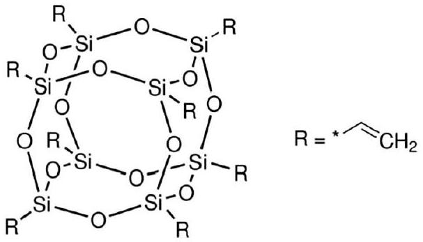
FIGURE 1 The chemical structure of octavinyl polyhedral oligomeric silsesquioxane molecular

## 2 | MATERIALS AND EXPERIMENTS

## 2.1 | Materials

The matrix material, isotactic polypropylene (iPP) with a density of $0.92 \mathrm{~g} / \mathrm{cm}^{3}$, was purchased from Aladdin Industrial Inc., China. The nanofiller, OvPOSS with the density of $0.93 \mathrm{~g} / \mathrm{cm}^{3}$ and purity of 98.0\% was obtained from Zhengzhou Alfache Co., LTD., China. The xylene solution with the purity of 99.0\% was provided by Tongguang Chemistry Co. LTD., China.

## 2.2 | Nanocomposite preparation

Xylene was chosen to dissolve the PP pellets. The required contents of the OvPOSS nanofiller shown in Table 1 were dispersed in the mixture of PP and xylene and then the mixed solution was stirred by a blender. The rotor speed was 500 rpm, the mixing time was 12 h and the operational temperature was 120°C/min. Next, the mixed solution was dried in a turbo blower at $120^{\circ} \mathrm{C} / \mathrm{min}$ for 12 h . Film samples with different thicknesses were manufactured by using compression moulding at a temperature of $200^{\circ} \mathrm{C} / \mathrm{min}$ for a duration of 12 min under the pressure of 15 MPa. After that, the films were cooled to 25°C/min under a pressure of 10 MPa for 15 min. The thicknesses of the samples were nominally 100 and $200 \mu \mathrm{~m}$ for the measurement of the electrical properties. Finally, the samples of pure PP and its nanocomposites with different content of OvPOSS were put in a vacuum oven (0.01 Pa) at 80°C/min for 24 h and then cooled down to room temperature at 0.1 K/min.

## 2.3 | Characterisation of nanocomposites

The crystallinity of PP and OvPOSS/PP nanocomposites were studied using the DSC technique (NETZSCH 200F3) under a nitrogen atmosphere with a cooling/heating rate of 5°C/min over the range of 20 to $200^{\circ} \mathrm{C} / \mathrm{min}$.

The dispersion of the OvPOSS nanofiller in OvPOSS/PP nanocomposites were observed by the SEM technique (Hitachi

TABLE 1 Sample notation and composition
| Sample | OvPOSS (phr) | PP (phr) |
| :--- | :--- | :--- |
| PP | 0 | 100 |
| PP/0.5-phr OvPOSS | 0.5 | 99.5 |
| PP/1.0-phr OvPOSS | 1.0 | 99.0 |
| PP/2.0-phr OvPOSS | 2.0 | 98.0 |

Abbreviations: OvPOSS, octavinyl polyhedral oligomeric silsesquioxane; PP, polypropylene.
8010). The OvPOSS/PP nanocomposite samples were kept in liquid nitrogen and then fractured after 5 min to provide access to the cross-section of the thickness. Gold was then sputtered on the cross-section of the broken edges to prevent charge accumulation during SEM imaging.

The POM (Nikon Eclipse microscope LV1100NPOL, Japan) was used to observe the spherulite size of OvPOSS/PP nanocomposites. The film samples of OvPOSS/PP with $100 \mu \mathrm{~m}$ thickness were placed between two glass plates, then melted and maintained at $200^{\circ} \mathrm{C} / \mathrm{min}$ for 15 min . After that, the melted samples were cooled to the crystallisation temperature, $130^{\circ} \mathrm{C} / \mathrm{min}$ with a cooling rate of $15^{\circ} \mathrm{C} / \mathrm{min}$ and kept for 15 min to achieve isothermal crystallisation before the spherulite size was observed.

The DC volume conductivity was carried out using a digital high-resolution electrometer (6517B) with a standard threeelectrode system under the temperature of 30°C. The OvPOSS/PP nanocomposite samples with the thickness of $100 \mu \mathrm{~m}$ were measured under the range of a DC electric field from 10 kV/mm to 80 kV/mm with a step of 10 kV/mm. The duration of each step was 600 s and the DC conductive current under different electric fields was determined by the stable value obtained at the end of each polarisation step. Before the sample measurement, each sample was short-circuited for 10 min to remove the surface charge in the samples. These conductivity results showed the effect of nano-OvPOSS on the DC volume resistivity of pure PP.

The TSC measurement was achieved by using a broadband dielectric spectrometer (Novocontrol GmbH Concept 40). Firstly, the contact area of the sample between sample and test electrodes was sputtered with gold. Secondly, the sample was polarised at 20°C/min for 40 min at 6 kV/mm and then cooled down to $-100^{\circ} \mathrm{C} / \mathrm{min}$ with a cooling rate of $10^{\circ} \mathrm{C} / \mathrm{min}$. After that, the samples were short-circuited for 5 min to remove the space charge on the surface of the OvPOSS/PP nanocomposites. Finally, the thermal stimulated depolarised current was measured by the heating rate of 10°C/min.

The DC breakdown strength was tested using a spheresphere electrode configuration with a sphere diameter of 2.0 cm to control the spread of breakdown points to within 2.0 mm of the axis of symmetry under the temperature of 30° C. The OvPOSS/PP nanocomposite samples with the thickness of $100 \mu \mathrm{~m}$ were put into silicone oil to prevent air flashovers from occurring during the breakdown tests. There were 20 measuring points marked uniformly on each film, and each point was aligned with the axis of the sphere electrodes prior to each DC breakdown test. The ramp rate of DC voltage applied was 1 kV/s until the breakdown occurred.

The space charge distribution in the bulk of PP/OvPOSS nanocomposites was measured by the PEA system under the temperature of 30°C. A DC electric field of 60 kV/mm was applied to the sample during the testing. The pulse voltage was 800 V with a frequency of 1.0 kHz so that the space charge inside could be activated to generate the pulse wave. A piezoelectric sensor was used to detect the pulse signal and convert it into an electronic signal for recording by an oscilloscope.

## 3 | RESULTS AND DISCUSSION

## 3.1 | DSC results

Figure 2 shows the melting and crystallisation curves of the OvPOSS/PP nanocomposites. The crystallinity $X_{c}$ can be calculated by using Equation (1):

$$
\begin{equation*}
X_{c}=\frac{\Delta H_{m}}{\Delta H_{m}^{\infty}} \times 100 \% \tag{1}
\end{equation*}
$$

where $\Delta H_{m}$ is the melting enthalpy, which is the integral value of the melting procedure from DSC curves, and $\Delta H_{m}^{\infty}$ is the melting enthalpy for complete crystallisation of pure PP with the value of 209 J/g. Through the integration of heat flow on

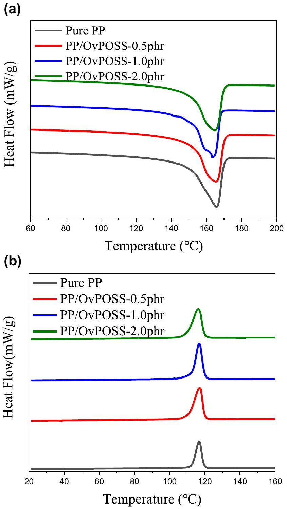
FIGURE 2 The results of differential scanning calorimetry (DSC) measurements. (a) DSC melting curves and (b) crystallising curves of octavinyl polyhedral oligomeric silsesquioxane/polypropylene nanocomposites with different contents

TABLE 2 Parameters from the differential scanning calorimetry measurement of octavinyl polyhedral oligomeric silsesquioxane (OvPOSS)/ polypropylene (PP) nanocomposites with different contents
| Sample | $T_{c}\left({ }^{\circ} \mathrm{C}\right)$ | $T_{m}\left({ }^{\circ} \mathrm{C}\right)$ | $\boldsymbol{\Delta} \boldsymbol{H}_{\boldsymbol{m}} \boldsymbol{(} \mathbf{J} \boldsymbol{/} \mathbf{g} \boldsymbol{)}$ | $\boldsymbol{X}_{\boldsymbol{C}}$ (\%) |
| :--- | :--- | :--- | :--- | :--- |
| Pure PP | 116.8 | 165.8 | 75.77 | 36.3 |
| PP/0.5 phr OvPOSS | 117.0 | 164.3 | 80.62 | 38.6 |
| PP/1.0 phr OvPOSS | 116.8 | 163.4 | 81.05 | 38.8 |
| PP/2.0 phr OvPOSS | 116.3 | 164.7 | 80.95 | 38.7 |

temperature for the heating process, the melting enthalpy $\Delta H_{m}$ can be calculated.

Table 2 summarises the crystallisation temperature $T_{c .}$, the melting peak point $T_{m}$, melting enthalpies $\Delta H_{m}$, and crystallinity $X_{c .}$ For the melting and crystallising points, the melting point of nanocomposites is around 164°C and the crystallising point is about 116°C. Also, the nanocomposites with 0.5, 1.0 and 2.0 phr have a higher melting enthalpy of about 81.0 J/g, while the melting enthalpy of PP is only 75.77 J/g. Therefore, using Equation (1), the crystallinities of nanocomposites can be calculated. As a result, the crystallinities of 0, 0.5, 1.0 and 2.0 phr nanocomposites are 36.3\%, 38.6\%, 38.8\% and 38.7\%, respectively. Also, the melting curves become gradually sharper after the addition of OvPOSS than pure PP, which may indicate subtle changes in the lamellar morphology in the presence of the OvPOSS as well as a more obvious change in spherulitic texture. The slightly increased crystallinity in the presence of OvPOSS reflects a slight nucleating effect. Since the differences between crystallinities of OvPOSS/PP nanocomposites are within 3\% and are not obvious, the crystallinity of PP could be regarded as slightly increased under the influence of the OvPOSS nanofiller.

## 3.2 | Dispersion and morphology

The morphology of the fractured surface of the pure PP and OvPOSS/PP nanocomposites with different contents was observed by SEM. Different contents of the OvPOSS nanofiller were well dispersed in the bulk of OvPOSS/PP nanocomposites with the contents of 0.5, 1.0 and 2.0 phr. Figure 3 shows that the diameters of most OvPOSS agglomerates were less than 100 nm when the doping level was less than 2.0 phr, while the severe agglomerates with the size of over 500 nm appeared in the nanocomposites when the doping level of OvPOSS was increased to 2.0 phr. The latter situation would introduce shallow traps and degrade the electrical performance of PP/OvPOSS. This is because there is a high-volume content of OvPOSS than many kinds of inorganic nanofillers under the same weight percentage in the polymers. This is due to the low density of the OvPOSS nanofiller. The dispersion of the OvPOSS nanofiller in PP means the compatibility of OvPOSS and PP is better than most of the surface-modified inorganic nanofillers under the same volume content without any coupling agent.

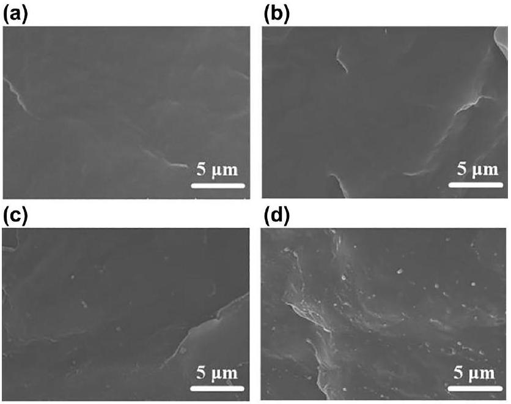
FIGURE $3 \times 10,000$ scanning electron microscopy photograph of the polypropylene (PP) and octavinyl polyhedral oligomeric silsesquioxane (OvPOSS)/PP nanocomposites sample. (a) PP, (b) 0.5 phr OvPOSS/PP, (c) 1.0 phr OvPOSS/PP, and (d) 2.0 phr OvPOSS/PP

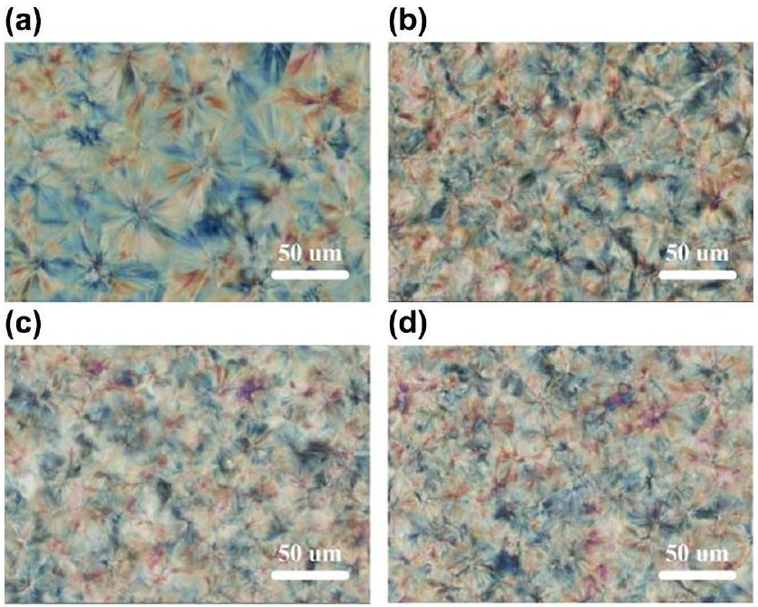
FIGURE 4 Polarised optical microscopy observation of the polypropylene (PP) and octavinyl polyhedral oligomeric silsesquioxane (OvPOSS)/PP nanocomposites samples. (a) PP, (b) 0.5 phr OvPOSS/PP, (c) 1.0 phr OvPOSS/PP, and (d) 2.0 phr OvPOSS/PP

Figure 4 indicates the spherulitic morphology of pure PP and OvPOSS/PP nanocomposites. Research has shown that the resistivity of the amorphous region is lower than the crystalline spherulites [21, 22] so that the charge transport mainly occurred in the region between spherulite boundaries. Compared with pure PP, the size of crystal spherulites within OvPOSS/PP nanocomposites decreases with the increasing content of the OvPOSS nanofiller. This means that the number of spherulites is obviously increased and the OvPOSS nanofiller acts as a hetero-nucleating agent. Consequently, the region between the spherulites' boundaries in the OvPOSS/PP nanocomposites is much narrower than pure PP and the length
of the path for charge movement is increased. The narrower regions between the spherulites' boundaries plus the increased path of charge movement can suppress the charge transport and enhance electrical breakdown strength.

## 3.3 | DC conductivity

Figure 5 shows the DC leakage current of pure PP and OvPOSS/PP nanocomposites under the DC electric field from 0 to 80 kV/mm. The relationship between the leakage current and electric field is close to linear up to about 30 kV/mm. When the electric field increases beyond 30 kV/mm, the leakage current increases dramatically and has a non-linear relationship with the electric field. This non-linear positive relationship between the leakage current and electric field could be due to the charge carrier transport characteristic and the theorem of energy band insulation under the high electric field [23].

With reference to Figure 5, the introduction of the OvPOSS nanofiller can significantly suppress the leakage current under a high electric field. In this case, OvPOSS/PP nanocomposites with 1.0 phr OvPOSS nanofiller have the best performance in decreasing the leakage current. It shows that the leakage current can be significantly suppressed from 35.0 pA in pure PP to 5.1 pA in 1.0 phr-OvPOSS-PP nanocomposite under 80 kV/mm at 30°C/min. Compared with pure PP, the DC resistivity of 1.0 phr OvPOSS/PP nanocomposites has the highest DC resistivity, which is 6.9 times higher than PP. It shows that the addition of OvPOSS can efficiently reduce the conductive current and enhance the resistivity of PP under the high electric field at 30°C/min. Compared with other contents of nanocomposites, 1.0 phr OvPOSS demonstrates the lowest leakage current and has the best leakage current suppression.

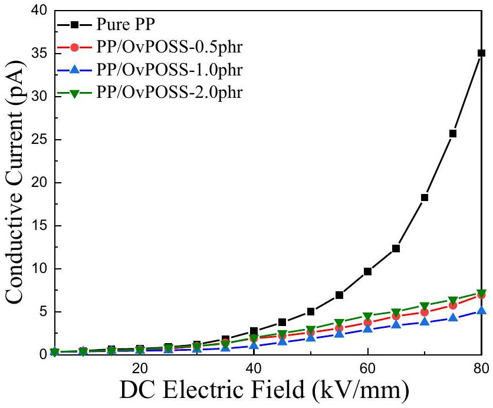
FIGURE 5 DC leakage current for polypropylene (PP) and octavinyl polyhedral oligomeric silsesquioxane (OvPOSS)/PP nanocomposites under the DC electric field from 0 to 80 kV/mm at 30°C

When the content of OvPOSS is increased beyond 1.0 phr, the leakage current increases again. Compared with the OvPOSS/PP nanocomposites with 1.0 phr, the nanocomposites with 2.0 phr has more agglomerates with a larger size. Even though the POM detection shows the boundaries scale between crystal spherulites has been decreased significantly, more agglomerates could introduce more defects into the matrix material [24]. These defects can increase the free path of electrons so that the conductivity may increase.

## 3.4 | Thermally stimulated current and trap characteristics

Figure 6 shows the results of thermally stimulated current (TSC) measurements made under the temperature from -100 to100° C/min. In the TSC curve, higher current at higher temperatures means that deeper trapping levels have higher trapping density. According to the journal study [25], the TSC result can be transformed to give a relationship between the trapping level and trapping density. Before adding OvPOSS, due to the glass transition of PP and the detrapping mechanism of electrons, there were two peaks in the thermally stimulated current, namely 0.1 pA at $-10^{\circ} \mathrm{C} / \mathrm{min}$ and 0.14 pA at $84^{\circ} \mathrm{C} / \mathrm{min}$, and these peaks correspond to trapping levels of 0.75 and 0.95 eV. After the introduction of OvPOSS, the peak current about 0.75 pA now occurs at about $92^{\circ} \mathrm{C} / \mathrm{min}$, which is corresponding to 1.05 eV, and the peak values of the current in the OvPOSS/PP nanocomposites are all significantly higher than PP. This indicates that deeper traps with high trapping density are increased by the addition of OvPOSS until the content of OvPOSS reached 1.0 phr. When the content of OvPOSS increases to 2.0 phr, the trapping density of deep traps in nanocomposites is reduced, and this may correspond to the introduction of defects and the reduction of the effective interfacial area by the agglomerates of OvPOSS shown in Figure 3.

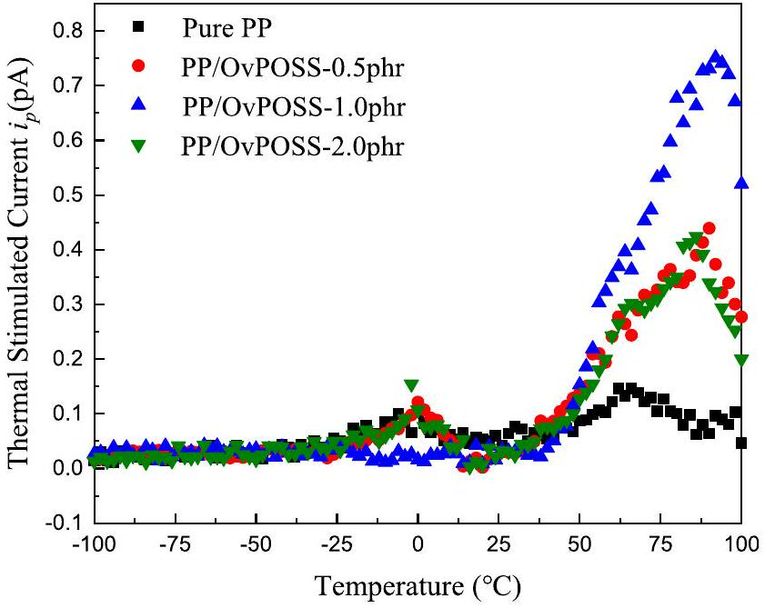
FIGURE 6 Thermally stimulated current curve of the octavinyl polyhedral oligomeric silsesquioxane/polypropylene nanocomposites

The electrostatic potential of OvPOSS is calculated by the density functional theory (DFT) in Gaussian view version 5.0, which is based on the first-principle calculation and the basic Schrodinger's equation to get the wave function [26]. The result shown in Figure 7 indicates that the side-groups of the OvPOSS molecule could capture electrons before folding the polymer molecular chains and building an interface between the OvPOSS molecule and the polymer molecular chain. Even though the content of the OvPOSS nanofiller is very low in the OvPOSS/PP nanocomposites with 0.5 phr OvPOSS, much deeper traps can still be introduced into the polymer by the empty orbitals by sp2 hybridisation to capture mobile electrons and the induction effect on the vinyl group due to the strong negativity of oxygen atom. With the increase of the OvPOSS content, the diameter of OvPOSS agglomerates could increase to 100 nm so that the molecular chain of PP can be folded by the agglomerate of the OvPOSS nanofiller. The interface between OvPOSS and PP is therefore facilitated. After that, the interfacial effects can be introduced into the OvPOSS/PP nanocomposites and the trapping level of PP can be enhanced again by these interfaces. In Figure 6, all peak values of thermally stimulated currents $i_{p}$ of the OvPOSS/PP nanocomposites are located at around the temperature of 92°C/min after the addition of OvPOSS, which is related to the electron capture ability at the interface of OvPOSS molecules and its agglomerates with the polymer.

In terms of trapping characteristics, the improved electrical performance of polymer insulation is highly related to the trap distribution modified by nanofillers [27-32]. It is also indicated by the suppressed DC conductivity of the OvPOSS/PP nanocomposites, shown in Figure 5. For the OvPOSS/PP nanocomposites, 1.0 phr OvPOSS can introduce the largest number of deep traps so that the OvPOSS/PP with 1.0 phr has the lowest DC resistivity.

## 3.5 | DC breakdown strength

The DC breakdown strength of the film samples of PP and OvPOSS/PP nanocomposites at room temperature may be described by the Weibull distribution, which can be used to

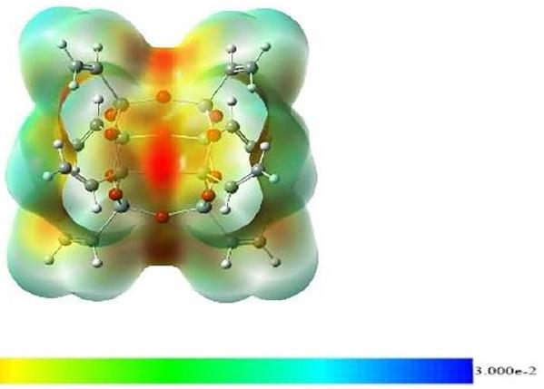
FIGURE 7 Electrostatic potential of octavinyl polyhedral oligomeric silsesquioxane by GaussianView

$$
\begin{equation*}
P=1-\exp \left[-\left(\frac{E}{E_{0}}\right)^{\beta}\right] \tag{2}
\end{equation*}
$$

where $P$ is the breakdown probability for the Weibull distribution, $E$ is the measured value of breakdown strength, $E_{0}$ is the critical value of the breakdown strength at $63.2 \%$ cumulative probability of the breakdown, and $\beta$ is the shape factor of the Weibull distribution, which indicates the distribution of the experimental data points of the breakdown strength.

The characteristic Weibull breakdown strength of PP and OvPOSS/PP nanocomposites is shown in Figure 8, and the critical values of breakdown strength and the shape factors are listed in Table 3. As shown in Figure 8 and Table 3, introducing OvPOSS can greatly enhance the breakdown strength of OvPOSS/PP nanocomposites. When the content of OvPOSS increased to 1.0 phr from 0.5 phr, the enhancements of the breakdown strength were up from 26\% to 30\%. After that, the enhancement of the breakdown strength was reduced to 23.0\% for 2.0 phr-OvPOSS-PP nanocomposites.

Therefore, it is shown that the addition of the OvPOSS nanofiller can greatly increase the breakdown strength of pure PP under the HVDC condition, especially for the OvPOSS/PP nanocomposites with the content of 1.0 phr due to the introduction of more deep traps according to TSC measurement results in Figure 6. Firstly, the interfacial area between the OvPOSS nanofiller and the base PP is significantly increased in the bulk of nanocomposites due to the smaller size of the OvPOSS nanofiller compared to some traditional inorganic nanofillers. As a result, interface energy is dramatically raised,

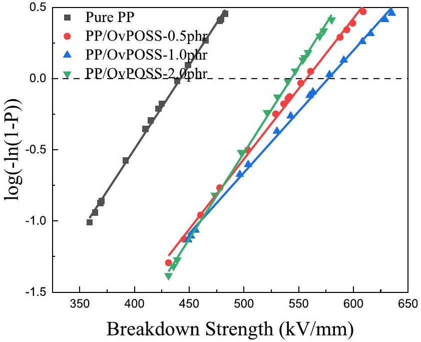
FIGURE 8 The breakdown strength of polypropylene/octavinyl polyhedral oligomeric silsesquioxane nanocomposite with different contents

TABLE 3 The DC breakdown strength of pure polypropylene (PP) and OvPOSS/PP nanocomposites
| Sample | Critical value of breakdown strength (kV/mm) | Shaping factor $\beta$ |
| :--- | :--- | :--- |
| Pure PP | 440.5 | 11.4 |
| PP/0.5phr OvPOSS | 555.5 | 11.8 |
| PP/1.0phr OvPOSS | 574.8 | 10.6 |
| PP/2.0phr OvPOSS | 542.0 | 13.9 |

Abbreviations: OvPOSS, octavinyl polyhedral oligomeric silsesquioxane; PP, polypropylene.

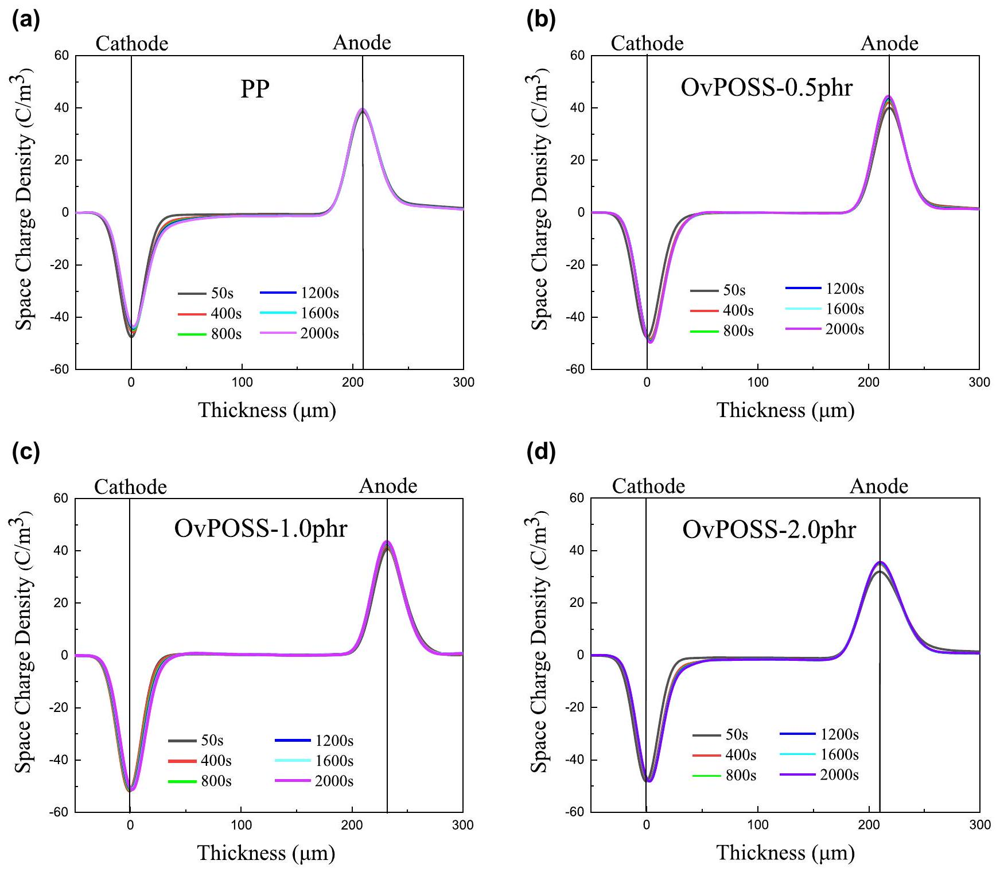
FIGURE 9 Space charge formation in the film samples under the DC electric field of 60 kV/mm. (a) polypropylene (PP), (b) 0.5 phr octavinyl polyhedral oligomeric silsesquioxane (OvPOSS)/PP, (c) 1.0 phr OvPOSS/PP, and (d) 2.0 phr OvPOSS/PP

and more deep traps can be introduced into the matrix material [2]. Secondly, when the charges flow through the insulation material, the deep traps with high density would reduce the charge injection and trap the charge carriers so that the mobility of hot electrons could be decreased significantly in the solid insulation materials (see Figures 5 and 6). Finally, according to the POM observation in Figure 4, the OvPOSS nanofiller act as a heterogeneous nucleating agent, and this decreases the size of the spherulites of PP and increases the number of spherulites. Then, the low-resistance path in the amorphous region for the mobility of charge carriers is increased after the addition of the OvPOSS nanofiller. Therefore, with a suitable content of the OvPOSS nanofiller, OvPOSS/PP nanocomposites can achieve a significant enhancement of DC breakdown strength.

## 3.6 | The formation of space charge and the distribution of the electric field

For the DC cable insulations, space charge accumulation is one of the key factors that can highly affect the lifespan of the polymer insulation materials. Therefore, there is a need to estimate the space charge accumulation in OvPOSS/PP nanocomposites. The space charge formation within different film samples over a charging time of 50, 400, 800, 1,200, 1,600, 1,800 and 2,000 s under the DC electric field of 60 kV/mm is shown in Figure 9.

In PEA measurements, the thicknesses of all samples have been controlled between 220 and $240 \mu \mathrm{~m}$ to get enough scale of the thickness domain for observing the space charge characteristics. In pure PP, after the applied electric field, the homocharges injected from the cathode and the anode start to accumulate on the surface between PP and the electrodes. With increasing polarising time, the homocharges from the cathode are injected to deeper depths. Those injected homocharges could increase the local electric field near the anode. Compared with PP, it is found that less charges are injected from the cathode and anode in the OvPOSS/PP nanocomposites with the content of 0.5 and 1.0 phr. This means that the addition of the OvPOSS nanofiller can capture the charges near the electrodes, which increase the potential barrier between the surface of the nanocomposite film and electrodes so that the space charge injected from the cathode and anode are significantly suppressed. However, some space charges flow into the bulk of the OvPOSS/PP nanocomposites with 0.5 and 2.0 phr. This is because there is not enough interfacial effect between pure PP and the OvPOSS nanofiller to capture the space charges under low content and the appearance of

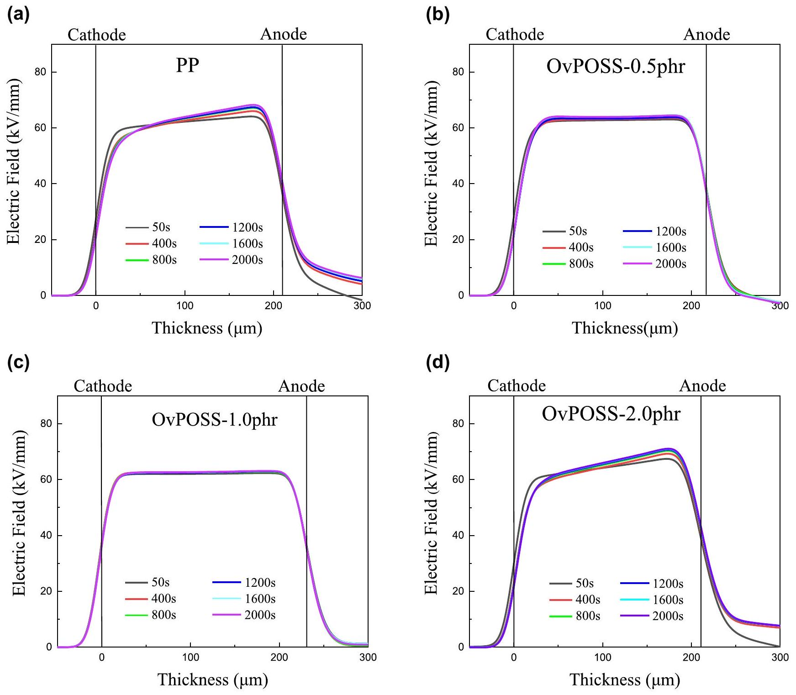
FIGURE 10 Electric field distribution in the film samples under the DC electric field of 60 kV/mm. (a) polypropylene (PP), (b) 0.5 phr octavinyl polyhedral oligomeric silsesquioxane (OvPOSS)/PP, (c) 1.0 phr OvPOSS/PP, and (d) 2.0 phr OvPOSS/PP

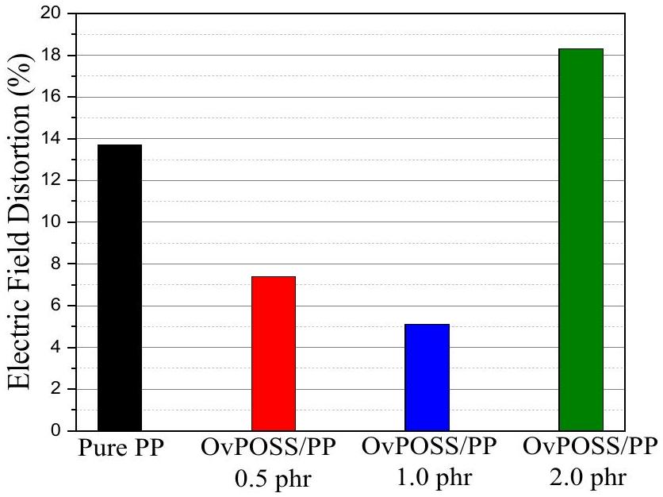
FIGURE 11 The electric field distortion of the octavinyl polyhedral oligomeric silsesquioxane/polypropylene nanocomposites

physical defects by agglomeration of the OvPOSS nanofiller under high content. Space charge accumulation is especially worse in the film sample with the 2.0 phr OvPOSS nanofiller than pure PP.

The space charge accumulation would cause serious electric field distortion, which may threaten the long-term use of the insulations. The electric field and the electric field distortion can be calculated by the formulae given below:

$$
\begin{gather*}
E(x)=\frac{1}{\varepsilon_{r} \varepsilon_{0}} \int_{0}^{d} \rho(x) d x  \tag{3}\\
\Delta E=\left|\frac{E_{\max }-E_{\min }}{E_{a v}}\right| \times 100 \% \tag{4}
\end{gather*}
$$

where in terms of the local electric field, $\rho(x)$ is the charge density distribution, $\varepsilon_{r} \varepsilon_{0}$ is the dielectric constant of the sample, $E(x)$ is the local electric field with the thickness of $x$ and $d$ is the thickness of the film samples. In the electric field distortion, $E_{\text {max }}$ is the maximum value of the electric field, $E_{\text {min }}$ is the minimum value of the electric field and $E_{a v}$ is the average value of the electric field within the sample, equal to the applied electric field. Figure 10 demonstrates the electric field distribution in the film samples at 50, 400, 800, 1,200, 1,600 and 2,000 s and the electric field distortion at 2,000 s is shown in Figure 11. The distortion of pure PP is 13.7\% while after the addition of OvPOSS, the electric field distortions are reduced to 7.4\% and 5.1\% with the contents of 0.5 and 1.0 phr, respectively. However, the electric field distortion increases to 18.3\% when the contents of OvPOSS raises to 2.0 phr due to the severe agglomerates shown in Figure 3d. The OvPOSS/PP nanocomposites with 1.0 phr OvPOSS have the lowest distortion of the electric field than pure PP. The lower distortion can improve the long-term performance and increase the lifespan of PP.

## 4 | CONCLUSION

The experiments have produced results that reveal the microstructure and morphology, conductivity, trapping characteristics, breakdown strength, space charge behaviour of pure PP and OvPOSS/PP nanocomposites. The results showed that the electrical properties have been enhanced by introducing OvPOSS. The effects of OvPOSS addition were also demonstrated.

Firstly, the crystallinity of PP is remarkably stable under the influence of the OvPOSS nanofiller according to DSC results. After introducing the OvPOSS nanofiller into PP, the OvPOSS nanofiller can act as a hetero-nucleating agent. More crystal spherulites with smaller size appear in the bulk of OvPOSS/ PP nanocomposites and the boundary regions between the crystal spherulites are narrowed. Additionally, because of the organic side group of the OvPOSS molecule, the OvPOSS nanofiller achieved good dispersion.

Secondly, the results of conductivity and TSC measurements showed that, after the addition of the OvPOSS nanofiller, the DC leakage current was significantly reduced. Much more electrons were detrapped at the higher temperatures when compared with pure PP, and this means more traps with a higher trapping level have been introduced into the pure PP matrix, especially for OvPOSS/PP-1.0 phr. Then through DFT calculation, the electrostatic potential of OvPOSS molecules showed that the structure of OvPOSS can attract electrons and act as a trap to capture the electrons in pure PP; that is why under low content of the OvPOSS nanofiller, the OvPOSS/PP nanocomposites still have a deeper trapping level than pure PP.

Thirdly, for the manufacture of PP nanocomposites, the melting point of PP is about $165^{\circ} \mathrm{C}$ while the decomposed point for OvPOSS is 210°C [34]. Therefore, the OvPOSS nanofiller can satisfy the manufacturing condition of cable manufacturing below $200^{\circ} \mathrm{C}$ without the weight loss.

Fourthly, the study indicated that the bad coupling between the nanofiller and polymers could cause the phase separation and reduce the lifespan of the polymer under the high operational temperature [35]. It can be found that the OvPOSS nanofiller can achieve a good dispersion under the content of 1.0 phr, which reveals that the compatibility between OvPOSS and PP is better than the surface-treated inorganic nanoparticles under the same volume contents, such as $\mathrm{MgO}, \mathrm{Al}_{2} \mathrm{O}_{3}$ etc. The lifespan enhancement in this work is due to the improvement of electrical properties, especially the higher breakdown strength, lower leakage current and less space charge accumulation, but there is still a need to explore the electrical performance and lifespan of OvPOSS/PP nanocomposites through the electric-thermal ageing process.

In conclusion, even though a solution blending is unlikely to be used for the cable manufacture in the current stage, the purpose of this work is to establish the potential of OvPOSS as a dielectrically active filler agnostic of the route of incorporation. The introduction of OvPOSS enhanced the trapping level of pure PP and this reduced the charge injection and mobility. Therefore, the DC conductivity, DC breakdown strength and space charge characteristics were highly improved.

## ACKNOWLEDGEMENTS

This work has been carried out at the State Key Laboratory of Power System, Department of Electrical Engineering, Tsinghua University, Beijing, China. This work was supported in part by the National Key R\&D Program of China (grant 2018YFE0200100) and the National Natural Science Foundation of China under grant 51921005. The author, Xiaosi Lin, acknowledges the receipt of a University of Strathclyde Scholarship to carry out this project.

## DATA AVAILABILITY STATEMENT

The raw/processed data required to reproduce these findings can be shared at this time as the data also forms part of an ongoing study.

## ORCID

Xiaosi Lin ® https://orcid.org/0000-0002-9956-9779

## REFERENCES

1. Huang, X., et al.: Material progress toward recyclable insulation of power cables. Part 1: polyethylene-based thermoplastic materials: dedicated to the 80th birthday of Professor Toshikatsu Tanaka. IEEE Electr. Insul. Mag. 35(5), 7-19 (2019)
2. Hirai, N., et al.: Chemical group in crosslinking byproducts responsible for charge trapping in polyethylene, Annual Report - Conf. on Electrical Insulation Dielectric Phenomena, CEIDP. Cankun, Mexico, pp. 626-630. (2002)
3. Lau, K.Y., et al.: On interfaces and the DC breakdown performance of polyethylene/silica nanocomposites, IEEE Conference on Electrical Insulation and Dielectric Phenomena (CEIDP), Des Moines, IA, USA, pp. 679-682. (2014)
4. Lewis, T.J.: Nanometric dielectrics. IEEE Trans. Dielectr. Electr. Insul. 1, 812-825 (1994)
5. Zhou, Y., et al.: Thermoplastic polypropylene/aluminum nitride nanocomposites with enhanced thermal conductivity and low dielectric loss. IEEE Trans. Dielectr. Electr. Insul. 23(5), 2768-2776 (2016)
6. Hu, S., et al.: Surface-modification effect of MgO nanoparticles on the electrical properties of polypropylene nanocomposite. High Volt. 5(3), 249-255 (2020)
7. Zhou, Y., et al.: Titanium oxide nanoparticle increases shallow traps to suppress space charge accumulation in polypropylene dielectrics. RSC Adv. 6(54), 48720-48727 (2016)
8. Zhou, Y., et al.: Effect of different nanoparticles on tuning electrical properties of polypropylene nanocomposites. IEEE Trans. Dielectr. Electr. Insul. 24(3), 1380-1389 (2017)
9. Duan, X., et al.: Effect of different surface treatment agents on the physical chemistry and electrical properties of polyethylene nano-alumina nanocomposites. High Volt. 5(4), 397-402 (2020)
10. Wang, S., et al.: Preparation, microstructure and properties of polyethylene/alumina nanocomposites for HVDC insulation. IEEE Trans. Dielectr. Electr. Insul. 22(6), 3350-3356 (2015)
11. Lewis, T.J.: Interfaces are the dominant feature of dielectrics at the nanometric level. IEEE Trans. Dielectr. Electr. Insul. 11(5), 739-753 (2004)
12. Du, B., et al.: Understanding trap effects on electrical treeing phenomena in EPDM/POSS composites. Sci. Rep. 8(1), 8481-8492 (2018)
13. Guo, M., et al.: Polyethylene/polyhedral oligomeric silsesquioxanes composites: electrical insulation for high voltage power cables. IEEE Trans. Dielectr. Electr. Insul. 24(2), 798-807 (2011)
14. Xu, Z., et al.: Space charge properties of LDPE-based composites with three types of POSS, IEEE Conference on Electrical Insulation and Dielectric Phenomena (CEIDP). Canada, Toronto, ON, pp. 679-682. (2016)
15. Heid, T., David, E., Fréchette, M.: Modeling the thermal conductivity of epoxy/POSS and Epoxy/POSS/cBN composites, IEEE International Conference on Dielectrics (ICD). Montpellier, France, pp. 414-417. (2016)
16. Albreto, F., et al.: Polypropylene-polyhedral oligomeric silsesquioxanes (POSS) nanocomposites. Polymer. 46(19), 7855-7866 (2005)
17. Markus, T., et al.: Dielectric properties of nanostructured polypropylenepolyhedral oligomeric silsesquioxane compounds. IEEE Trans. Dielectr. Electr. Insul. 15(1), 40-51 (2008)
18. Penso, I., et al.: Preparation and characterization of polyhedral oligomeric silsesquioxane (POSS) using domestic microwave oven. J. Non-Cryst. Solids. 428, 82-89 (2015)
19. Zhong, Q., et al.: Effect of nano-filler grain size on space charge behavior in LDPE/MgO nanocomposite, Proceedings of 2014 International Symposium on Electrical Insulating Materials, Niigata, Japan, pp. 429-432. (2014)
20. Chiu, F., Chu, P.: Characterization of solution mixed polypropylene/clay nanocomposites without compatibilizers. J. Polym. Res. 13(1), 73-78 (2006)
21. Ceres, B., Schultz, J.: Dependence of electrical breakdown on spherulite size in isotactic polypropylene. J. Appl. Polym. Sci. 29(12), 4183-4197 (1984)
22. Ham, J., Ham, J.S.: Electronic conduction through single crystals of polyethylene. J. Appl. Phys. 42(7), 2714-2718 (1971)
23. Ieda, M.: Electrical conduction and carrier traps in polymeric materials. IEEE Trans. Dielectr. Elect. Insul. 19(3), 162-178 (1984)
24. Kao, K.: New theory of electrical discharge and breakdown in low mobility condensed insulators. J. Appl. Phys. 55(3), 752-755 (1984)
25. Tian, F., et al.: Theory of modified thermally stimulated current and direct determination of trap level distribution. J. Electrostat. 69(1), 7-10 (2011)
26. Wang, W., et al.: Space charge mechanism of polyethylene and polytetrafluoroethylene by electrode/dielectrics interface study using quantum chemical method. IEEE Trans. Dielectr. Electr. Insul. 24(4), 2599-2606 (2017)
27. Peng, S., et al.: Functionalized $\mathrm{TiO}_{2}$ nanoparticles tune the aggregation structure and trapping property of polyethylene nanocomposites. J. Phys. Chem. C. 120(43), 24754-24761 (2016)
28. Wang, F., et al.: DC breakdown and flashover characteristics of direct fluorinated epoxy/ $\mathrm{Al}_{2} \mathrm{O}_{3}$ nanocomposites. IEEE Trans. Dielectr. Electr. Insul. 26(3), 702-737 (2019)
29. Fleming, R.J., et al.: Conductivity and space charge in LDPE/ $\mathrm{BaSrTiO}_{3}$ nanocomposites. IEEE Trans. Dielectr. Electr. Insul. 18, 15-23 (2011)
30. Teyssedre, G., et al.: Charge trap spectroscopy in polymer dielectrics: a critical review. J. Phys. D. 54(26), 263001 (2021)
31. Seven, K.M., et al.: The effect of inorganic and organic nucleating agents on the electrical breakdown strength of polyethylene. J. Appl. Polym. Sci. 135(22), 1-12 (2018)
32. Li, S., et al.: Short-term breakdown and long-term failure in nanodielectrics: a review. IEEE Trans. Dielectr. Electr. Insul. 17(5), 1523-1535 (2010)
33. Electric strength of insulating materials - test methods - Part 2: additional requirements for tests using direct voltage, IEC Standard 60243-2, 2013-11-26
34. Shi, M., et al.: Functionalization of graphene oxide by radiation grafting polyhedral oligomeric silsesquioxane with improved thermal stability and hydrophilicity. J. Mater. Sci. 55(5), 1489-1498 (2020)
35. Zhang, C., et al.: Effect of nano-clay filler on the thermal breakdown mechanism and lifespan of polypropylene film under AC fields. IEEE Access. 8, 36055-36060 (2020)

How to cite this article: Lin, X., et al.: Octavinyl polyhedral oligomeric silsesquioxane on tailoring the DC electrical characteristics of polypropylene. High Volt. 7(1), 137-146 (2022). https://doi.org/10.1049/hve2.12146

[^0]:    This is an open access article under the terms of the Creative Commons Attribution License，which permits use，distribution and reproduction in any medium，provided the original work is properly cited．
    © 2021 The Authors．High Voltage published by John Wiley＆Sons Ltd on behalf of The Institution of Engineering and Technology and China Electric Power Research Institute．

