# Hindered phenolic antioxidant grafting on tailoring the DC electrical characteristics of polypropylene cable insulation 

Boxue Du ${ }^{\text {® }}$｜Guoning Sun ${ }^{\text {® }}$｜Heyu Wang ${ }^{\text {® }}$｜Zhonglei Li ${ }^{\text {® }}$

The Key Laboratory of Smart Grid of Ministry of Education，School of Electrical and Information Engineering，Tianjin University，Tianjin，China

Correspondence
Zhonglei Li，School of Electrical Engineering and Automation，Tianjin University，Tianjin，China． Email：lizhonglei＠tju．edu．cn

Associate Editor：Jianying Li

Funding information
National Natural Science Foundation of China， Grant／Award Numbers：52077148，U1966203；Key Science and Technology Program of Yunnan Province，China，Grant／Award Number： 202202AC080002

#### Abstract

The authors focus on the impact of melt－free radical grafting with hindered phenolic antioxidants（AO3052）on the electrical properties of polypropylene（PP）for DC cable insulation．The DC conductivity，space charge distribution and breakdown characteristic tests of grafting－modified PP are performed by comparing unmodified PP．The results demonstrate that the grafting of antioxidants can effectively suppress space charge in－ jection，owing to the deeper trap sites at the grafting molecule．The breakdown strength of the grafted PP is significantly enhanced from 30°C to 90°C and especially achieves a 5．3％－6．7％increase after the same DC－prestressed time at 90°C．The surface electro－ static potential and molecular orbitals of the grafted PP are calculated．Simulation shows that the antioxidant introduces multi－level local state traps that can effectively trap the injected space charge，thus decreasing the destruction of molecular chains by electrons and increasing the breakdown strength level．In conclusion，antioxidant grafting modi－ fication can improve the breakdown characteristics with or without DC prestress，and thus it appears to be promising in the application of PP－insulated cables．

## 1 ｜INTRODUCTION

Polypropylene（PP）has the potential to become a significant high－voltage direct current（HVDC）transmission insulation material due to its excellent insulation properties，recyclability and low energy consumption［1－3］．However，the inherent brittleness and low toughness of PP restrict its usage in cable insulation applications．One common method to modify PP insulation is through blending it with polyolefin elastomers or rubber materials［4，5］．While this technique may enhance the mechanical properties，it also introduces a significant number of two－phase interfaces，thus affecting the charge transport and build－up characteristics，which is detrimental to the elec－ trical performance of insulation．［6］．Therefore，it becomes imperative to investigate approaches that can address the limitations associated with the mechanical properties of PP， while simultaneously enhancing its insulating characteristics．In addition，the voltage of the line－commutated converter－HVDC transmission system is subject to polarity reversal during tidal reversal，which is highly detrimental to the insulation of DC cables due to their tendency to accumulate space charges［7］．

Researchers have found that blending with small organic molecules such as nuclear agents，voltage stabilizers and photon－trapping agents can introduce multi－level local state energy levels to bind high－energy charges better and effectively improve electrical properties［8－10］．However，the migration and precipitation of small organic molecules in the blend can change the microstructure of the sample and reduce the anti－ oxidant capacity of the material［11］．

Grafting modification techniques can graft monomers with target functional groups onto polymer molecular chains to effectively solve the problem of small molecule migration［12］． Studies have shown that grafting hindered amine antioxidant N－ （4－anilinophenyl）maleimide（MC）onto polyethylene can effectively improve trap density，space charge suppression and DC breakdown strength［13］．In addition，grafting maleic an－ hydride and styrene onto PP can efficiently suppress space charge injection，enhance breakdown strength and homogenise the electric field distribution［14，15］．Meanwhile，grafting long molecular chains can also inhibit the slip of molecular chains， thus enhancing the mechanical properties of PP［16］．Further－ more，a study has investigated the effect of 4－allyloxy－2－ hydroxybenzophenone grafting rate on PP and concluded

[^0]that a grafting rate of 0.73\% resulted in the best improvement of electrical properties [17]. However, most small molecules used in grafting lack antioxidant functions that cannot limit the ageing deterioration of polymer insulation caused by oxidation reactions and has limited improvement in electrical properties [18]. Therefore, conducting further investigation in grafting hindered phenolic antioxidants onto PP is of great research value to solve physical blending disadvantages, inhibit the oxidation process and improve the electrical performance of insulation materials.

This paper investigates the effect of melt-free radical grafting with hindered phenolic antioxidants (AO3052) on the electrical properties of PP, particularly DC and DC-prestressed breakdown strength. PP/AO blending and PP-g-AO-grafted samples with a content of $0.5 \mathrm{wt}^{\circ} \%$ are prepared, and pure PP is prepared as a reference. Three samples are tested for DC conductivity, space charge, DC and DC-prestressed breakdown strength. The effect of AO3052 on the electrical properties of PP is analysed by trap energy level distribution and quantum chemical calculations.

## 2 | EXPERIMENTAL ARRANGEMENT

## 2.1 | Sample preparation

In this paper, isotactic polypropylene T30s produced by Sinopec is selected as the base material. The reactive hindered phenolic antioxidant used is acrylic acid 2-tert-butyl-6-(3-tert-butyl-2hydroxy-5-methylbenzyl)-4-methylphenyl ester (AO3052) and the initiator is dicumyl peroxide. The melt-free radical grafting procedure is shown in Figure 1. Grafted samples (PP-g-AO) and blended samples (PP/AO) with a content of 0.5 wt\% are prepared, taking the PP as a comparison. The samples are degassed in a vacuum drying oven for 24 h to remove the residual air and volatile components. Furthermore, to remove the unreacted antioxidants, a small amount of the PP-g-AO is put into xylene to be heated, dissolved and refluxed, until it is completely dissolved. Next, it is poured into an unheated acetone solution, left to precipitate and filtered. Finally, the grafted samples are placed in the vacuum oven, and the sample preparation is completed.

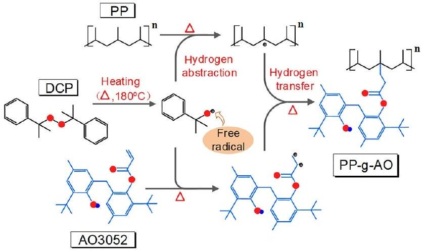
FIGURE1 Melt-free radical grafting procedure.

## 2.2 | Sample characteristics

The PP insulation structures have been characterised by Fourier transform infrared spectra instrument as shown in Figure 2. The C=O stretching vibrational absorption peak is contained in AO3052 at around $1725 \mathrm{~cm}^{-1}$. As can be seen, AO3052 showed an absorption peak at around $1725 \mathrm{~cm}^{-1}$, demonstrating the successful grafting of AO3052 onto PP.

The oxidative induction time (OIT) is the time at which the catalysed oxidation reaction of a material begins under high temperature and oxygen condition, characterising the thermal stability of the material. Figure 3 shows the OIT for the samples based on the differential scanning calorimetry method at 210°C. The OIT of PP is the lowest among the three samples. However, after adding antioxidants, the OIT of PP/ AO improved to 5.9 min, and the OIT of PP-g-AO further improved to 11.4 min. Thermal stability experiments further confirm that the antioxidants enhance the antioxidant performance of PP, with the grafted samples demonstrating superior effectiveness compared to the blended samples. It is highly probable that the spatial blocking effect of grafted side chains, which indicates that the growth of spherical crystals will stop

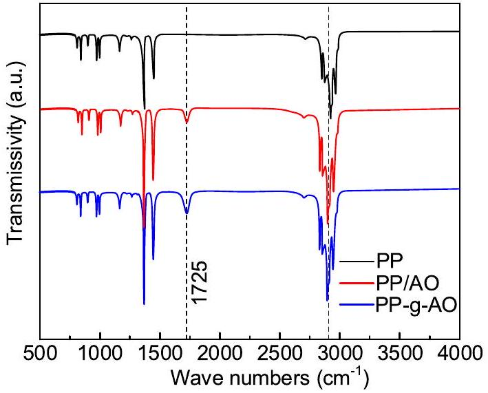
FIGURE 2 Fourier transform infrared spectra of the samples.

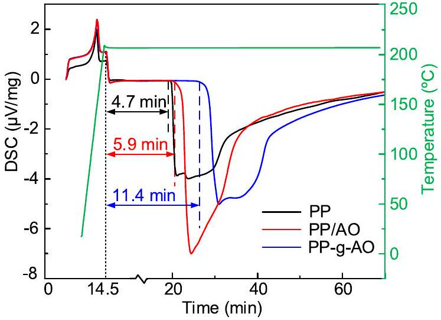
FIGURE 3 Oxidative induction time of the samples by DSC. DSC, differential scanning calorimetry.

when they encounter grafted side chains, could form a small crystalline structure with complex molecular chain structures in PP, thus preventing the diffusion of oxygen.

The crystalline morphology of the three samples is characterised using polarised optical microscopy as shown in Figure 4. In the case of PP, predominantly loosely connected small-sized spherulites are observed, with a high proportion of amorphous regions and relatively low crystallinity. In contrast, both the grafted and blended samples exhibited larger spherulite sizes with denser connectivity. Among them, PP-g-AO exhibited the fewest defects between spherulites, forming the densest aggregated structures.

## 2.3 | Experiments setup

DC conductivity is measured by a three-electrode system in this paper. The thickness of samples used is $(300 \pm 10) \mu \mathrm{m}$. Each set of samples is repeated three times, and the average value is taken as the final test result.

The dynamic distribution of space charge is measured by a pulsed electro-acoustic system. The samples used are $(300 \pm 10) \mu \mathrm{m}$. A polarization field of $40 \mathrm{kV} / \mathrm{mm}$ is applied to the samples for 30 min, and the sampling interval is set to 10 s, after which the dynamic distribution of the space charge with time is obtained. The space charge data of the three samples at a polarization time of 30 min are selected to calculate the electric field distortion rate as shown in Equation (1),

$$
\begin{equation*}
\delta=\frac{\left|E_{\max }-E_{\mathrm{p}}\right|}{E_{\mathrm{p}}} \times 100 \% \tag{1}
\end{equation*}
$$

where $\delta$ is the distortion rate, $E_{\text {max }}$ is the maximum electric field strength, $\mathrm{kV} / \mathrm{mm}$ and $E_{\mathrm{p}}$ is the polarization field strength, kV/mm.

The trap energy level distribution of PP samples is tested by the isothermal discharge current (IDC) system. The sample used is $(300 \pm 10) \mu \mathrm{m}$. The sample is polarised by applying a field strength of 30 kV/mm for 45 min at 50°C. Then the sample is depolarised, and the discharge current flowing in the external circuit is measured, from which the trap energy distribution of the sample can be calculated. The trap density function $N_{\mathrm{t}}(E)$ is related to the trap energy $E_{\mathrm{t}}$ as shown in Equation (2).

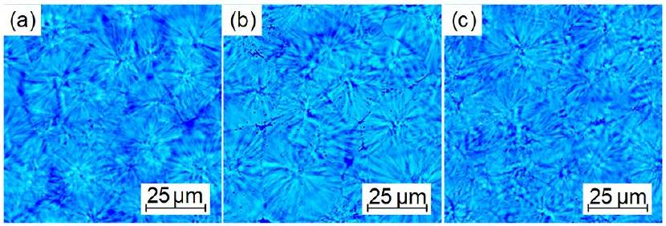
FIGURE 4 Crystalline morphology of the samples. (a) PP, (b) PP/AO and (c) PP-g-AO.

$$
\begin{equation*}
\frac{N_{\mathrm{t}}(E)}{E_{\mathrm{t}}}=\frac{I}{\frac{e L S k_{\mathrm{b}} T_{\mathrm{a}}}{2 t} k_{\mathrm{b}} T_{\mathrm{a}} \ln (v t)} \tag{2}
\end{equation*}
$$

where $N_{\mathrm{t}}(E)$ is the trap density function, $\mathrm{eV}^{-1} \mathrm{~m}^{-3} . E_{\mathrm{t}}$ is the trap energy, eV. $I$ is the external circuit current, and $\mathrm{pA} . L$ is the sample thickness, m. $e$ is the electron charge, C. $S$ is the electrode area, $\mathrm{m}^{2} . k_{\mathrm{b}}$ is the Boltzmann's constant. $T_{\mathrm{a}}$ is the test temperature, K. $v$ is the electron escape frequency, $10^{12}$ - $10^{14} \mathrm{~s}^{-1}$ [19].

The DC breakdown strength is tested using ball-plate electrodes. To simulate polarity reversal in a HVDC cable, a DCprestressed breakdown strength test system has been developed, which can prestress samples with different polarities of DC fields. The sample used is $(100 \pm 5) \mu \mathrm{m}$. The sample is placed between ball-plate electrodes to prestress for 0-60 min. Then a voltage is gradually applied until breakdown. Each set of samples is tested with 15 points. The breakdown strength is obtained using Weibull distribution and is shown in a box plot with the top and bottom corresponding to the 25\% quantile.

## 2.4 | Simulation methods

Quantum chemical calculation is an effective method used to analyse the structural properties of molecules. In this paper, Gaussian16 is selected as the platform for calculations. The molecular model of PP and AO3052 is established in GaussView, after which the model is optimised in Gaussian. Considering calculation accuracy and efficiency, the implementation of dispersion correction via Density functional theory-dispersion correction 3 (BJ) is employed in the optimization process to enhance the accuracy of weak interactions [20].

## 3 | RESULTS

## 3.1 | DC conductivity

Figure 5 illustrates the relationship between DC conductivity and electric fields of the PP samples at different temperatures. The electric fields are set at 1, 2, 3, 4, 5, 7, 9, 10, 15, 20 and 30 kV/mm. It can be observed that the relationship between sample conductivities is PP > PP/AO > PP-g-AO, while the relationship is reversed for the threshold electric field. Furthermore, with increasing temperature, the conductivity of all the three samples increases exponentially.

It can be found from Figure 5 that the conductivity of the sample shows a linear relationship with the applied electric field with two different slopes on both sides of the threshold electric field, which can be explained by space charge limited current (SCLC). When the electric field is low, the current in the dielectric and the applied voltage conform to Ohm's law, and when the electric field rises to a certain threshold, the traps in the dielectric are filled, at which time the relationship between the current density and the electric field obeys the Mott-Gurney formula as shown in Equation (3).

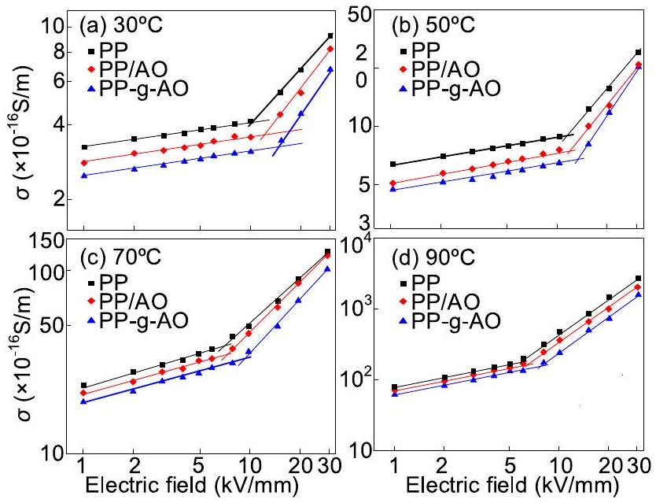
FIGURE 5 Relation between DC conductivity and electric fields at different temperatures. (a) 30°C, (b) 50°C, (c) 70°C and (d) 90°C.

$$
\begin{equation*}
J=\frac{9 \mu \varepsilon E^{2}}{8 d} \tag{3}
\end{equation*}
$$

where $\varepsilon$ is the dielectric constant of the sample. $E$ is the applied electric field, $\mathrm{V} / \mathrm{m} . d$ represents the thickness of the dielectric, m. $\mu$ is the carrier mobility, $\mathrm{m}^{2} / \mathrm{V} \mathrm{s}$ [21]. Therefore, the relationship between conductivity $(\sigma)$ and field strength is shown in Equation (4).

$$
\left\{\begin{array}{l}
\sigma \approx C,\left(E<E_{\mathrm{t}}, \text { for ohm region }\right)  \tag{4}\\
\ln \sigma \propto \ln E,\left(E>E_{\mathrm{t}}, \text { for SCLC region }\right)
\end{array}\right.
$$

where $C$ is a constant. $E_{\mathrm{t}}$ is the threshold electric field, kV/ mm. The slopes are approximately equal to 0 and 1 in the ohmic and SCLC regions in the double logarithmic coordinate system, respectively; furthermore, the slopes may be shifted slightly due to Schottky injection and Poole-Frenkel effects. In the SCLC region, the carriers in the dielectric mainly come from the injection of electrodes and thermally excited carriers. PP-g-AO has the smallest conductivity and the largest slope, which is due to the dissociation of the phenolic hydroxyl group to form a new carrier, which leads to a certain degree of increase in the conductivity.

The conductivities of the three samples at 5 kV/mm are selected, because at which point the conductivity-electric field curves are in the ohmic region. The logarithm of conductivity $(\ln \sigma)$ is calculated, and the relationship between $\ln \sigma$ and $10^{3} T^{-1}$ can be derived from the Arrhenius equation as shown in Equation (5),

$$
\begin{equation*}
\ln \sigma=\ln A-\frac{E_{i}}{R T} \tag{5}
\end{equation*}
$$

where $A$ is a constant. $E_{i}$ is the conductivity activation energy of the PP sample, eV. $T$ is the absolute temperature, K. $R$ is the molar gas constant. $\ln \sigma$ is linearly related to $10^{3} T^{-1}$ as shown in Figure 6a. The symbols in the figure are the actual test results,

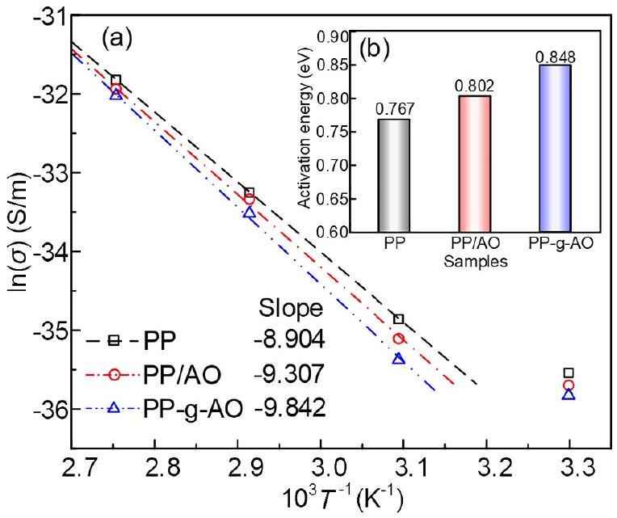
FIGURE 6 Relation between DC conductivity and activation energy. (a) Relation between the logarithm of conductivity $(\ln \sigma)$ and the temperature and (b) activation energy of conductivity.

and the lines are obtained by fitting. Due to the influence of low carrier mobility and hopping conduction, the conductivity current at room temperature cannot reach a steady state within the testing duration. Therefore, it is excluded from the curve fitting process. The conductivity activation energy of the samples can be calculated from the slope of the fitted lines as shown in Figure 6b. The relationship between the slopes of the three samples is PP < PP/AO < PP-g-AO, and the fitted line of PP-g-AO shows the highest slope (-9.842), signifying a notable increase in its temperature coefficient of conductivity, attributed to the ionization of polar groups at elevated temperatures. The charge in the trap will escape from the trap when it gains enough energy under the action of the applied electric field, and the energy absorbed in the process is called the conductivity activation energy. Figure 6b shows that PP-g-AO displays the highest conductivity activation energy (0.848), which is a consequence of phenolic hydroxyl groups introducing localised energy levels that serve as charge traps, necessitating higher energy for charge release and transport. Subsequent quantum chemical calculations have also demonstrated this inference.

## 3.2 | Space charge distribution

Figure 7 presents the space charge distribution for PP, PP/AO and PP-g-AO at 30°C and 70°C with an applied electric field of 40 kV/mm. At a temperature of 30°C, Figure 7a1 shows that as the polarization time is extended from 60 to 1800 s, significant homopolar charge accumulation near the anode occurs in PP, resulting in an electric field distortion rate of 10.51\%. Similarly, Figure 7a2 shows that a small amount of homopolar charge accumulation also appears near the anode in PP/AO. In contrast, for the grafted sample depicted in Figure 7a3, there is no significant charge accumulation, causing an electric field distortion rate of 59.1\% which is smaller than that of PP. As

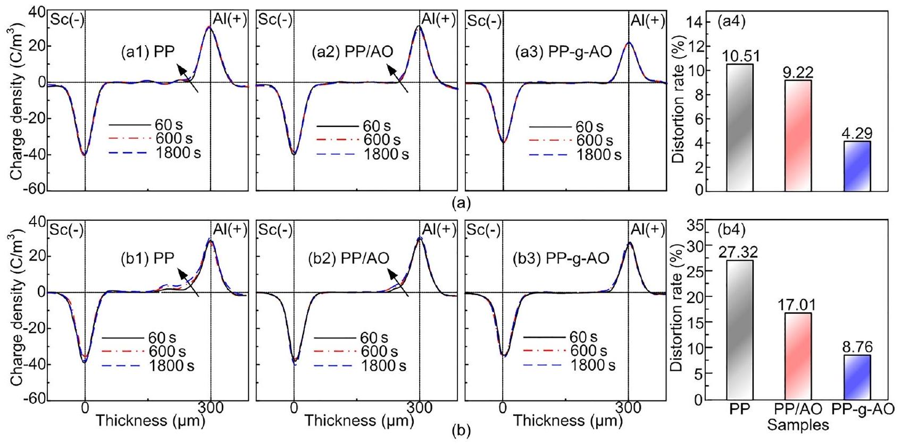
FIGURE 7 (a1)-(a3) Space charge distributions and (a4) electric field distortion rate at 30°C. (b1)-(b3) Space charge distributions and (b4) electric field distortion rate at 70°C.

depicted in Figure 7b1-b3, when the temperature rises to $70^{\circ} \mathrm{C}$, there is a notable increase in space charge density for PP, and the charge injection depth is close to $150 \mu \mathrm{~m}$. In the blended sample, the charge injection depth exceeds $100 \mu \mathrm{~m}$, resulting in an 84.8\% increase in the distortion rate. While, in contrast, the grafted sample continues to show no significant space charge accumulation. As shown in Figure 7b3, the electric field distortions of the three samples are 27.32\%, 17.01\% and 8.76\%, and the grafted sample shows the most uniform electric field distribution characteristics at both temperatures, with the lowest negative impact on the breakdown performance.

It can be concluded that the injection of space charges leads to electric field distortion within the sample, and these two factors exhibit a positive correlation. The increase in temperature can exacerbate the accumulation of space charges and injection depth. Compared to PP and PP/AO, the grafted sample can effectively suppress the injection and accumulation of space charges in the PP insulation layer under both room temperature and high temperature conditions, consequently reducing the extent of electric field distortion.

## 3.3 | Breakdown strength

Figure 8 depicts the DC breakdown strengths of PP, PP/AO, and PP-g-AO at 30, 50, 70, and 90°C. The characteristic DC breakdown strength of PP, PP/AO and PP-g-AO at 30°C exhibits values relatively closer to 380.7, 383.5 and 391.1 kV/ mm, respectively. However, all three samples show a decreasing trend with increasing temperature. At 90°C, the breakdown strength of PP decreases to 230.1 kV/mm, PP/AO decreases to 260.6 kV/mm and PP-g-AO decreases to 302.1 kV/mm. In

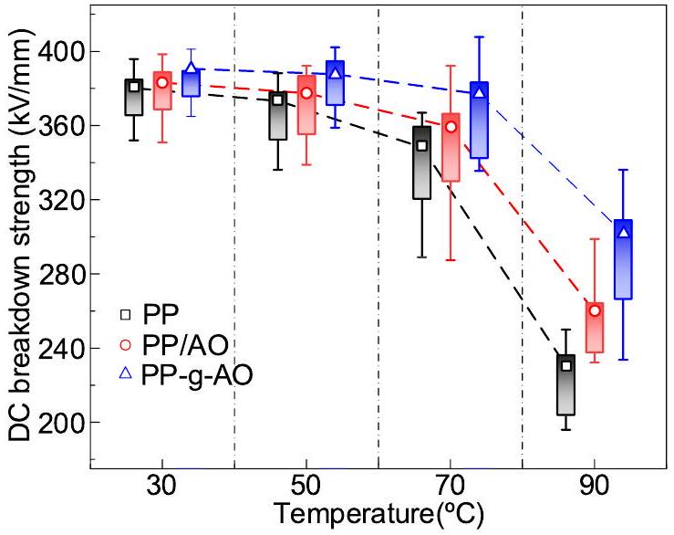
FIGURE 8 Relation between DC breakdown strength and temperature with different samples.

addition, the order of DC breakdown strength of the three samples at different temperatures is PP < PP/AO < PP-g- AO. The difference in the breakdown strengths among the samples gradually increases as the temperature increases. This indicates that the antioxidant-grafted sample has a more pronounced effect on the breakdown strength of PP, and this enhancement effect increases with the temperature. In particular, the antioxidant-grafted sample has a greater effect on improving the breakdown properties of PP. It is superior to the antioxidant-blended sample of the same mass fraction.

To assess the effect of voltage polarity reversal, a prestressed electric field of -40 kV/mm to PP, PP/AO and PP-g-AO for 60 min at 30, 50, 70 and 90°C is applied. Then the DC breakdown strength of the three samples at 40 kV/mm is
measured, as shown in Figure 9. The breakdown strength of all three samples is significantly lower than that of the nonprestressed samples, indicating that polarity reversal has a detrimental effect on the DC breakdown characteristic of PP. The breakdown strengths of PP, PP/AO and PP-g-AO are 356, 363.8 and 372.9 kV/mm, respectively, at 30°C. However, as the temperature increases to 90°C, the breakdown strength of the samples decreases to 203.4, 232.6 and 284.1 kV/mm, respectively, representing a decrease of 42.9\%, 36.1\% and 23.8\% compared to the measurements at 30°C. It indicates that the breakdown property of the PP-g-AO appears to be less affected by the test temperature.

To investigate the effect of hetero-polarity-prestressed time on breakdown strength, the DC breakdown strengths of the three samples are measured at prestressed times of 0, 10, 30 and 60 min at 30, 50, 70 and 90°C, respectively, as shown in Figure 10. To analyse the effect of polarity reversal conditions better, the parity reversal breakdown coefficient $k$ is defined in this paper, as shown in Equation (6).

$$
\begin{equation*}
k=\frac{E_{\text {prestressed }-t}}{E_{0}} \tag{6}
\end{equation*}
$$

where $E_{\text {prestreesed- } t}$ is the breakdown strength measured after hetero-polarity DC-prestressed, $t$ is the time of prestressed, and $E_{0}$ is the breakdown strength without prestressed procedure. The coefficient $k$ for each set of samples is calculated and shown in Figure 10.

The polarity reversal breakdown strengths of PP, PP/AO and PP-g-AO at different temperatures show a decreasing trend as the prestressed time increases. Notably, the fastest rate of decrease is observed within the first 10 min of prestressed time. The relationship between the breakdown strengths of the three samples after the same prestressed time follows the order of PP < PP/AO < PP-g-AO. For instance, Figure 10a shows that compared to the non-prestressed sample at 30°C, the breakdown strength of PP after 60 min DC-prestressed decreases from 380.7 to 356 kV/mm, and the coefficient $k$

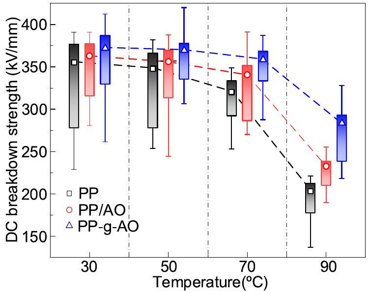
FIGURE 9 Relation between DC-prestressed breakdown strength and temperature with different samples.

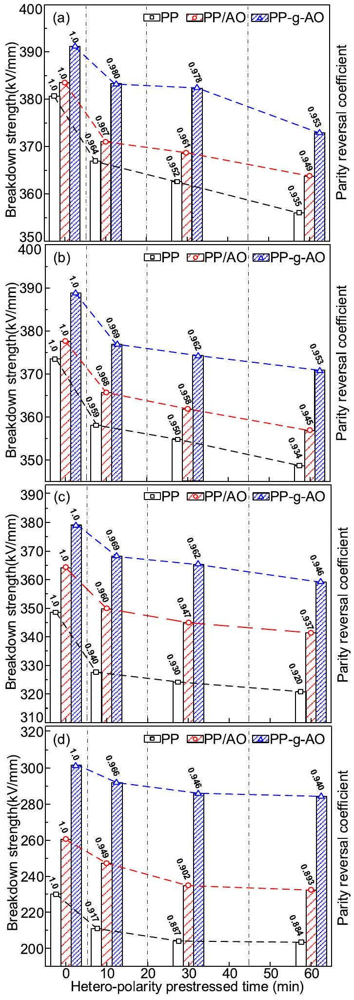
FIGURE 10 DC-prestressed breakdown strength after hetero-polarity prestressed times at (a) 30°C, (b) 50°C, (c) 70°C and (d) 90°C.

and PP/AO under the same experimental conditions. It can be inferred that PP-g-AO has a higher DC and DC-prestressed breakdown strength.

As shown in Figure 10a-d, the degree of reduction in breakdown strength due to prestressed increases for all three samples with the increase in temperature. The coefficient $k$ after 60 min of prestressed decreases from 0.935 to 0.884 for PP, from 0.94 to 0.893 for PP/AO and only from 0.953 to 0.940 for PP-g-AO. This is because the carrier mobility increases with temperature, which increases the injection and accumulation of space charge, and the breakdown strength of the sample decreases more significantly. It can be concluded that the hetero-polarity DC-prestressed breakdown performance of PP-g-AO has high temperature stability.

## 3.4 | Trap-level distribution

To further discuss the experimental results of the space charge and the breakdown properties of PP under the effect of antioxidants, the trap energy level distribution of PP, PP/AO and PP-g-AO at $50^{\circ} \mathrm{C}$ is measured using the IDC method, as shown in Figure 11. Under isothermal conditions, charge carriers possess the same average energy. Therefore, traptesting results at 50°C effectively serve the purpose of comparing the trap distributions among the three samples.

Furthermore, the traps within a material are intrinsic properties that do not change with variations in test temperature.

From the graph, it can be observed that the density of deep traps and shallow traps in PP increases significantly after grafting the antioxidant. The deep traps introduced by the polar groups in the antioxidant can trap carriers continuously, which could reduce their mobility. Meanwhile, the homopolar space charge trapped by the deep trap energy level can form an electric field opposite to the external electric field, which reduces the electric field strength between the electrode and the PP insulation. Thus, the local electric field distortion caused by subsequent space charge injection is inhibited, and the breakdown performance of the sample is further improved [22]. PP-g-AO has a high deep

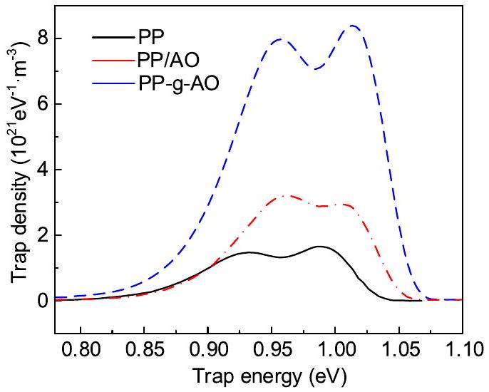
FIGURE 11 Trap level distribution characteristics of the samples at 50°C.

## 4 | DISCUSSION

## 4.1 | Effect of electrostatic potential on space charge

The electrostatic potential on the polar group of the antioxidant has a specific charge-trapping effect. To further analyse the impact, the wave function files of PP, AO3052 and PP-gAO are further analysed using Multiwfn. The electrostatic potential is calculated on a surface with an electron density of 0.001 and lattice spacing of 0.25 Bohr. The surface electrostatic potentials of the samples are presented by VMD, as shown in Figure 12. From Figure 12a-c, it is evident that grafting AO3052 introduces both positive and negative potential traps into PP within the energy range of -2 to 2 eV. The highenergy electrons in PP-g-AO experience a Coulomb attraction effect from the positive electrostatic potential on the

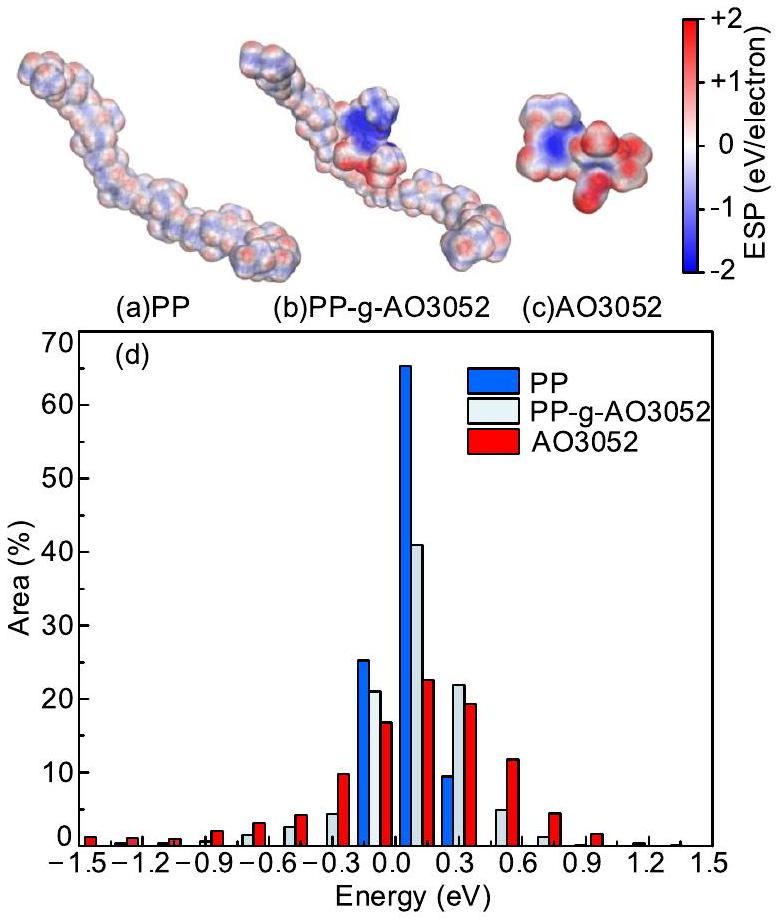
FIGURE 12 Surface electrostatic potential distribution of the samples. (a) PP, (b) PP-g-AO3052, (c) AO3052 and (d) surface area of electrostatic potential region.

molecular surface, while the holes experience a Coulomb attraction effect from the negative electrostatic potential. The charge carriers are trapped by the potential traps on the molecular surface, which suppresses the accumulation of space charge, thus reducing the degree of electric field distortion.

Figure 12d illustrates the surface electrostatic potential ratios of PP, AO and PP-g-AO. Potential traps in PP are primarily distributed within the electrostatic potential range of -0.15 to 0.3 eV. In comparison, PP-g-AO demonstrates a significantly higher number of potential traps in the electrostatic potential range below -0.3 eV and above 0.3 eV. The surface area of the electrostatic potential region serves as an important parameter for evaluating the effectiveness of potential traps. Within a specific interval, a larger surface area of the electrostatic potential region could lead to a stronger effect of trapping charge carriers, which can reduce the mobility of the carriers and decrease the energy of the electron obtained from the acceleration process in the electric field. Consequently, this characteristic exerts a more pronounced inhibitory effect on the process of high-energy electrons breaking molecular chains to form low-density regions.

## 4.2 | Effect of energy level on breakdown strength

In Figure 13, the density-of-states (DOS) distribution is presented for PP, AO3052 and PP-g-AO. DOS represents the number of different states that an electron is allowed to occupy at a given energy level. Next, the molecular structures of PP, AO3052 and PP-g-AO are optimised using the optimisation function in Gaussian to obtain the lowest potential energy conformation of the molecules. The lowest unoccupied molecular orbital (LUMO) and the highest occupied molecular orbital (HOMO) of the three molecules are extracted, as shown in Figure 13.

Research suggests that the negative value of LUMO energy level reflects the electron affinity energy of the molecule. A higher electron affinity energy means a stronger ability of the molecule to trap electrons. The negative value of HOMO energy level reflects the ionisation energy of the molecule. A lower ionisation energy implies a stronger ability to trap holes [23]. It can be noticed that the LUMO and HOMO of PP-gAO are mainly occupied by benzene rings and C-O groups. The HOMO-LUMO gap of PP is 9.829 eV. Within the HOMO-LUMO gap range, grafting the antioxidant introduces a hole trap (-6.716 eV) at the highest energy level of -7.471 eV and an electron trap ( -0.09 eV ) at the lowest energy level of 2.353 eV, mainly due to the benzene ring conjugation structure. Notably, the electron traps of PP-g-AO exhibit a higher DOS, thus showing it forms more electron traps. The presence of electron traps in PP-g-AO serves to trap the highenergy electrons generated in the presence of a strong electric field, thus inhibiting the injection of space charge and the breakdown degradation process.

Figure 14a illustrates the energy level and corresponding molecular orbital distribution for the sample/measurement electrode without the application of a polarised electric field. When the sample is not in contact with the measuring electrode, the distance between them is set to be much greater than $10 \AA$ [24]. From the intrinsic energy level distribution, the electron affinity $(\chi)$ of PP is -2.353 eV, the ionization energy $\left(\boldsymbol{\phi}_{\mathrm{i}}\right)$ is 7.471 eV and the HOMO-LUMO gap $\left(\boldsymbol{\phi}_{\mathrm{g}}\right)$ is 9.824 eV. The electron injection barrier at the electrode is denoted as $\phi_{\mathrm{Be}}$, and the hole injection barrier is denoted as $\phi_{\mathrm{Bh}}$. The energy difference between the vacuum energy level (VL) and the Fermi energy level $\left(E_{\mathrm{F}}\right)$ of the electrode materials is defined as the work function $\left(\phi_{\mathrm{W}}\right)$ of the electrode. In this paper, $\phi_{\mathrm{W}}(\mathrm{SC})$ and $\phi_{\mathrm{W}}(\mathrm{Al})$ are set to 5.56 and 4.25 eV, respectively. The Fermi energy level differences between PP and the electrode material are denoted as $\Delta E_{\mathrm{F}}(\mathrm{SC})$ and $\Delta E_{\mathrm{F}}(\mathrm{Al})$.

After contact, the sample/measurement electrode forms a stable thermodynamic system where all the Fermi energy levels coincide and the VL undergoes changes. Figure 14b presents the energy level distribution of the sample/measurement electrode with a DC electric field. Upon contact, as the Fermi energy levels of the SC and Al electrodes are higher than the HOMO energy level of the PP, electronic charges are transferred from the PP material to the electrodes. Under the

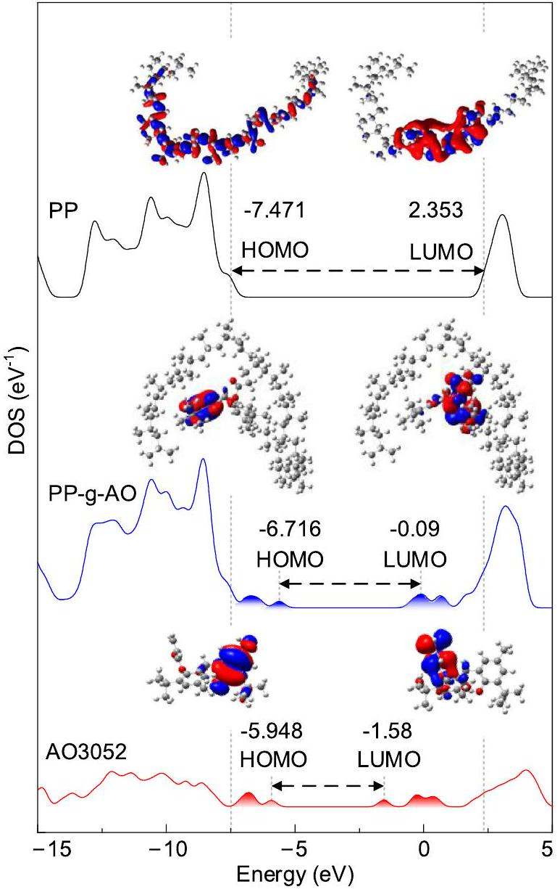
FIGURE 13 DOS and HOMO-LUMO orbitals of the samples. DOS, density-of-states; HOMO, highest occupied molecular orbital; LUMO, lowest unoccupied molecular orbital.

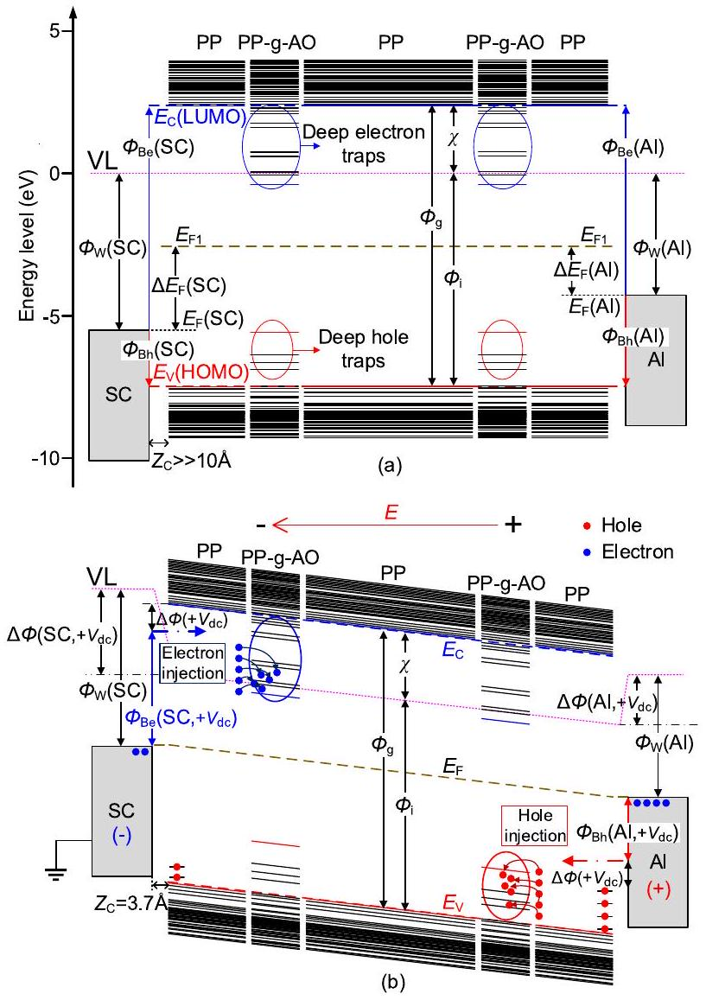
FIGURE 14 Energy level and corresponding molecular orbitals. (a) Before contact and (b) after contact and under electric field.

electric field $\left(+V_{\mathrm{dc}}\right)$, the migration of the charge generated by the energy level differences at the electrode interface will be altered. Affected by the electric field polarisation, the charge injection barriers in the sample/electrode system decrease, which is commonly governed by the Schottky emission effect as expressed in Equation (7),

$$
\begin{equation*}
\Delta \phi\left(+V_{\mathrm{dc}}\right)=\sqrt{e^{3} E /\left(4 \pi \varepsilon_{0} \varepsilon_{\mathrm{r}}\right)} \tag{7}
\end{equation*}
$$

where $e$ is the element charge of the electron $\left(1.6 \times 10^{-19} \mathrm{C}\right) . E$ is the electric field, $\mathrm{kV} / \mathrm{mm} . \varepsilon_{0}$ is the vacuum permittivity ( $8.85 \times 10^{-12} \mathrm{~F} / \mathrm{m}$ ), and $\varepsilon_{\mathrm{r}}$ is the relative permittivity of PP (2.2).

When $E$ is set at $100 \mathrm{kV} / \mathrm{mm}, \Delta \phi\left(+V_{\mathrm{dc}}\right)(0.26 \mathrm{eV})$ is calculated by Equation (3). This calculation demonstrates that the hole injection barrier (Al/PP) is significantly lower than the electron injection barrier (SC/PP). The electric field exerted on the system has a more pronounced impact on weakening the hole injection barrier than the electron injection barrier. Upon applying a positive voltage to the sample/electrode system, electrons from the cathode (SC/PP) are injected into the PP and migrate towards the anode. During migration, the deep traps introduced by the PP-g-AO can trap these electrons near the cathode and hinder their further injection. In a similar manner, a substantial quantity of hole charges is injected from the anode and subsequently trapped by deep traps near the anode. In addition, as shown in Figure 4, the dense crystalline morphology of PP-g-AO can also effectively inhibit carrier injection from both electrodes. Consequently, grafting PP with antioxidants could introduce localised state traps and improve the crystalline morphology, enhance the ability to trap charge carriers, suppress space charge injection and reduce the damage to molecular chains by high energy electrons during collisional ionization and energy release, thus ultimately improving the breakdown performance of PP [25].

## 5 | CONCLUSION

This paper focuses on the effect of the modification method of the grafted hindered phenolic antioxidant AO3052 on the space charge, DC and DC-prestressed breakdown properties of PP insulation. Through the analysis of electrical experiments and quantum simulation calculations, the conclusions are as follows:

(1) The grafted antioxidant method can enhance the oxidation induction time of PP. Compared to PP/AO, PP-g-AO effectively suppresses space charge injection and reduces the degree of electric field distortion from 10.51\% to 4.69\%.
(2) As the temperature increases from 30°C to 90°C, both PP/AO and PP-g-AO increase the DC breakdown field strength of PP. However, after 10, 30 and 60 min of hetero-polarity prestressing, PP-g-AO exhibits a superior effect in improving the hetero-polarity DC-prestressing breakdown field of PP compared to PP/AO. Particularly at 90°C, PP-g-AO achieves a 5.3\%-6.7\% increase after the same duration of DC-prestressing compared to PP.
(3) Analysis of the energy level structure and surface electrostatic potential suggests that antioxidants can introduce multi-level local state energy levels and electrical traps in PP. These deep traps enhance the insulation's ability to trap charge carriers, effectively restrict the charge transport process, reduce the damage to molecular chains caused by high-energy charges, and thus significantly improve the breakdown performance of PP insulation.

## ACKNOWLEDGEMENTS

This work was supported in part by the National Natural Science Foundation of China under the Grants 52077148 and U1966203; Key Science and Technology Program of Yunnan Province, China under Grant 202202AC080002.

## CONFLICT OF INTEREST STATEMENT

The authors declare no potential conflicts of interests.

## DATA AVAILABILITY STATEMENT

The data that support the findings of this study are available from the corresponding author upon reasonable request.

## ORCID

Boxue Du ® https://orcid.org/0000-0002-7500-1134

Guoning Sun ® https://orcid.org/0009-0008-2538-7914
Heyu Wang (D) https://orcid.org/0000-0002-3298-6770
Zhonglei Li (D) https://orcid.org/0000-0001-8780-8691

## REFERENCES

1. Li, C.Y., et al.: Insulating materials for realising carbon neutrality: opportunities, remaining issues and challenges. High Volt. 7(4), 610-632 (2022)
2. Li, G.C., et al.: Effect of graphene modified semi-conductive shielding layer on space charge accumulation in insulation layer for high-voltage direct current cable. High Volt. 7(3), 545-552 (2022)
3. Du, B.X., et al.: Effect of voltage stabilizers on the space charge behavior of XLPE for HVDC cable application. IEEE Trans. Dielectr. Electr. Insul. 26(1), 34-42 (2019)
4. Green, C.D., et al.: Thermoplastic cable insulation comprising a blend of isotactic polypropylene and a propylene-ethylene copolymer. IEEE Trans. Dielectr. Electr. Insul. 22(2), 639-648 (2015)
5. Du, B.X., Xu, H., Li, J.: Effects of mechanical stretching on space charge behaviors of PP/POE blend for HVDC cables. IEEE Trans. Dielectr. Electr. Insul. 24(3), 1438-1445 (2017)
6. Huang, X.Y., et al.: Highly conductive polymer nanocomposites for emerging high voltage power cable shields: experiment, simulation and applications. High Volt. 5(4), 387-396 (2020)
7. Vas, J.V., Venkatesulu, B., Thomas, M.J.: Tracking and erosion of silicone rubber nanocomposites under DC voltages of both polarities. IEEE Trans. Dielectr. Electr. Insul. 19(1), 91-98 (2012)
8. Zhang, W., et al.: Effect of $\beta$-crystals on the mechanical and electrica properties of $\beta$-nucleated isotactic polypropylene. IEEE Trans. Dielectr. Electr. Insul. 26(3), 714-721 (2019)
9. Su, J.G., et al.: Electrical tree degradation in high-voltage cable insulation: progress and challenges. High Volt. 5(4), 353-364 (2020)
10. Ga, Y., et al.: Effects of nanofiller and voltage stabilizer on partial discharge resistance of polypropylene/elastomer blends: a comparison study. High Volt. 8(2), 251-261 (2023)
11. Yang, X., et al.: Improved direct current electrical properties of XLPE modified by graftable antioxidant and crosslinking coagent at a wide temperature range. High Volt. 9(1), 94-104 (2024)
12. Zha, J.W., et al.: Improvement of space charge suppression of polypropylene for potential application in HVDC cables. IEEE Trans. Dielectr. Electr. Insul. 23(4), 2337-2343 (2016)
13. Zhang, C., et al.: Grafting of antioxidant onto polyethylene to improve DC dielectric and thermal aging properties. IEEE Trans. Dielectr. Electr. Insul. 28(2), 541-549 (2021)
14. Zhou, Y., et al.: Mechanism of highly improved electrical properties in polypropylene by chemical modification of grafting maleic anhydride. J. Phys. Appl. Phys. 49(41), 415301 (2016)
15. Yang, J.M., et al.: Optimisation method for carbon black distribution of polypropylene-based semi-conductive screen materials and its effect on charge emission behaviour at screen/insulation interface. High Volt. 8(2), 239-250 (2023)
16. Ran, Z.Y., et al.: Breakdown performance of polypropylene and its longchain branched blending for metalized film capacitors. IEEE Trans. Dielectr. Electr. Insul. 29(1), 145-152 (2022)
17. Liang, Y., Weng, L., Zhang, W.: Preparation and electrical properties of 4allyloxy-2-hydroxybenzophenone grafted polypropylene for HVDC cables. J. Electron. Mater. 50(11), 6228-6236 (2021)
18. Meng, F.-B., et al.: Effect of thermal ageing on physico-chemical and electrical properties of EHVDC XLPE cable insulation. IEEE Trans. Dielectr. Electr. Insul. 28(3), 1012-1019 (2021)
19. Simmons, J.G., Tam, M.C.: Theory of isothermal currents and the direct determination of trap parameters in semiconductors and insulators containing arbitrary trap distributions. Phys. Rev. B 7(8), 3706-3713 (1973)
20. Stefan, G., Ehrlich, S., Goerigk, L.: Effect of the damping function in dispersion corrected density functional theory. J. Comput. Chem. 32(7), 1456-1465 (2011)
21. Lau, K.Y., et al.: Polyethylene/silica nanocomposites: absorption current and the interpretation of SCLC. J. Phys. Appl. Phys. 49(29), 295305 (2016)
22. Li, Z.L., et al.: Temperature dependent trap level characteristics of graphene/LDPE nanocomposites. IEEE Trans. Dielectr. Electr. Insul. 25(1), 137-144 (2018)
23. Su, J.G., et al.: Multistep and multiscale electron trapping for high efficiency modulation of electrical degradation in polymer dielectrics. J. Phys. Chem. C 123(12), 7045-7053 (2019)
24. Toyoda, K., et al.: First-principles study of the pentacene/Cu(111) interface: adsorption states and vacuum level shifts. J. Electron. Spectrosc. Relat. Phenom. 174(1-3), 78-84 (2009)
25. Du, B.X., et al.: Effect of graphene nanoplatelets on space charge and breakdown strength of PP/ULDPE blends for HVDC cable insulation. IEEE Trans. Dielectr. Electr. Insul. 25(6), 2405-2412 (2018)

How to cite this article: Du, B., et al.: Hindered phenolic antioxidant grafting on tailoring the DC electrical characteristics of polypropylene cable insulation. High Voltage. 9(5), 971-980 (2024). https:// doi.org/10.1049/hve2. 12450

[^0]:    This is an open access article under the terms of the Creative Commons Attribution－NonCommercial License，which permits use，distribution and reproduction in any medium，provided the original work is properly cited and is not used for commercial purposes．
    © 2024 The Authors．High Voltage published by John Wiley＆Sons Ltd on behalf of The Institution of Engineering and Technology and China Electric Power Research Institute．

