# Preparation of Polypropylene Chelating Fibers by Quenching Pretreatment and Suspension Grafting and Their $\mathbf{P b}^{\mathbf{2}+}$ Adsorption Ability 

Qing Zhou, Mengxing Li, Xiaohong Yao, Zhouyang Lian, Chao Zhang, Wuji Wei*, and Jian Huang College of Environment, Nanjing Tech University, Nanjing, China (Received March 10, 2014; Revised June 16, 2014; Accepted June 25, 2014)

#### Abstract

To prepare polypropylene (PP) melt-blown fibers with $\mathrm{Pb}^{2+}$ adsorption ability in water, high-crystalline PP was first pretreated by quenching and then grafted with acrylic acid (AA) by the suspension-grafting method to prepare PP grafted with AA (PP-g-AA). Finally, the chelating fiber, PP-g-AA-DETA, was prepared by the amidation of PP-g-AA fiber, obtained by melt-blown spinning, with diethylenetriamine (DETA). In the quenching pretreatment, the effects of solvent amount on the crystallinity and specific surface area of PP were investigated. The main factors of suspension grafting affecting the PP-g-AA graft rate were investigated, and the melt flow rate (MFR) and water contact angle (WCA) of PP-g-AA were measured. The maximum $\mathrm{Pb}^{2+}$ adsorption ability of the chelating fiber was determined. The results indicate that the quenching pretreatment increased the size of PP amorphous area and formed pores on the particle surface. The specific surface area of PP and its crystallinity increased simultaneously with increasing solvent amount. The graft rate of PP-g-AA first increased with increasing solvent amount and then deceased. The MFR decreased rapidly after the graft rate reached 13 \%, and the WCA dropped from 102 ° to 50 °. The adsorption behavior of the chelating fiber matched the Langmuir adsorption isotherm model and showed good selective $\mathrm{Pb}^{2+}$ adsorption ability with $\mathrm{Mg}^{2+}$ as competing ion. The maximum adsorption capacities of PP-g-AA and PP-g-AA-DETA fiber calculated by the Langmuir equation were 12.2 and $25.7 \mathrm{mg} / \mathrm{g}$ respectively.

Keywords: Polypropylene, Melt-blown fiber, Quenching pretreatment, Suspension grafting, Acrylic acid, Diethylenetri-amine, Chelating adsorption

## Introduction

The detrimental effect of untreated and uncontrolled discharge of heavy metal ion containing wastewater into the environment has been increasingly recognized, intaking of heavy metals could cause health problems like disruption of the nervous system, depression, liver and kidney failure, bone tissue damage and reduces haemoglobin production [1,2]. The Concerns of environmental protection have posed compelling demands for effective adsorbents of heavy metal ions. Following the developing of ion exchange resins, functional fibers have also been modified for highly effective removal of these ions in wastewater [2].

The inexpensive PP (polypropylene) melt-blown fiber, known to have larger specific surface area than other common PP fiber, has many potential applications as an adsorbent [3,4]. However, the weak molecular polarity and poor hydrophilicity of PP cause its fibers to poorly adsorb polar molecules and metal ions in water [5-10].

Although, many attempts have been made to improve the polarity of PP, the most commercially feasible method is the grafting polymerization of polar functional monomers [11]. The methods mainly used are melt, solution, irradiation, and solid-phase grafting. The melt grafting is widely used in industry. However, the procedure requires to be carried out above the PP melting temperature. It suffers from several disadvantages such as PP $\beta$-chain scission, high energy consumption, and low grafting efficiency [6,8,12-15]. The solution grafting usually requires a large amount of suitable

[^0] solvent for the PP to dissolve. The pollution problems associated with organic solvents and highly expensive post process of the finial product limit the application of solution grafting in industry [12,13,16]. The irradiation grafting employs high-energy particles to initiate grafting polymerization and requires specialized equipment, which is difficult to industrialize [4,7,17-21]. The solid-phase grafting employs the surface of PP particles for grafting monomers [13], but suffers from the problems of particle adherence and poor heat and mass transfer.

The suspension grafting, which is recently developed, is environment-friendly. Usually, it uses water to disperse the PP particles. The grafting polymerization mainly takes place in the amorphous area of PP, which is swelled by a monomer or interface agent, and has high grafting efficiency, negligible side reaction and simple post processing of the finial product [10,12,22,23]. There have been rapid developments in grafting polymerization in recent years. However, the PP melt-blown resin has a high crystallinity due to its low molecular weight and high melt flow rate (MFR) and makes it difficult to be swollen by an interface agent during the grafting process. The graft rate of product is usually unsatisfactory. And there are few reports on the grafting modification of this PP resin by suspension grafting.

This article focuses on the chemical modification of PP melt-blown fiber by suspension grafting and its application to $\mathrm{Pb}^{2+}$ adsorption in water. The quenching pretreatment was first applied to the high-crystalline PP resin. Then, acrylic acid (AA) monomer was grafted to prepare PP grafted with AA (PP-g-AA) by the suspension grafting method. Finally, the PP-g-AA fiber obtained by melt-blown spinning was
condensed with diethylenetriamine (DETA) to improve its $\mathrm{Pb}^{2+}$ adsorption ability [24]. The effects of solvent amount used in quenching pretreatment on PP crystallinity, crystal type, specific surface area, and morphology were studied, and the main factors affecting the suspension grafting of PP-g-AA were determined. The water contact angle (WCA) and MFR of the modified PP were also measured. The chelating adsorption ability of PP-g-AA-DETA fiber was evaluated by studying the equilibrium adsorption behavior and maximum $\mathrm{Pb}^{2+}$ adsorption capacity in water.

## Experimental

## Materials

PP melt blown resins, P6313, were bought from Shanghai Expert in the Developing of New Material Company Limited, Shanghai, China. The MFR of the resin was 1300 g/10 min, measured with 2.16 kg load at 230 °C. AA, AR grade, was obtained from Aladdin Industrial Corporation, China, and used as received without further purification. Xylene, AR grade, and DETA, AR grade, were used as received; Benzoyl peroxide (BPO), CP grade, was purified by recrystallization prior to use. These were purchased from Shanghai Lingfeng Chemical Reagent Co., Ltd., China. Dicyclohexylcarbodiimide (DCC) and $N$-hydroxybenzotriazole (HOBt), AR grade, obtained from Ourchem Sinopharm Chemical Reagent Co., Ltd, China, were used as received. Lead nitrate and magnesium nitrate, AR grade, obtained from XILONG Chemical Co., Ltd., China, were used as received.

## Quenching Pretreatment

The quenching pretreatment was carried out in a $5 l$ magnetically stirred reaction vessel. The PP melt-blown resins were first dissolved in a certain amount of xylene at 140 °C, and the resulting polymer solution was slowly poured into an ice/water mixture for quenching. The solution was rapidly cooled to 0 °C; the precipitated PP particles (with low crystallinity) were separated, dried in a vacuum oven at 25 °C to constant weight, and stored at room temperature.

## Grafting Polymerization

PP-g-AA was prepared in a 250 ml three-necked roundbottom flask equipped with a twin-blade mechanical stirrer operating at 200 rpm, condenser, and nitrogen purging inlet. The reaction temperature was maintained at 90±2.0 °C. First, the quenched PP, certain amount of xylene (interface agent), and DI water were added to the flask. After purging with nitrogen, the mixture was stirred at $90 \pm 2.0^{\circ} \mathrm{C}$ on an oil bath for 60 min to ensure that the PP was fully swollen by xylene. Then, the initiator, BPO, and the monomer, AA, were added to start the grafting polymerization and allowed to proceed under continuous flow of nitrogen for additional 3 h. On completion of the grafting polymerization, the product obtained, PP-g-AA, was filtered and extracted with acetone in a Soxhlet extractor for 16 h. Finally, the product was dried in a vacuum oven at 35 °C to constant weight and hermetically sealed for storage.

## Determination of Graft Rate and Grafting Efficiency

The graft rate of the modified PP was determined by the back-titration procedure. Approximately 0.5 g of the extracted PP-g-AA was dissolved in $100 \mathrm{~m} l$ hot xylene, and 20 ml 0.05 M NaOH in ethanol was added. The mixture was refluxed for 30 min to complete the addition reaction and then titrated with 0.05 N HCl in isopropanol using thymol blue as the indicator.

The graft rate ( $G_{r}$ ) and grafting efficiency ( $G_{e}$ ) of PP-g-AA was calculated by using equations (1) and (2) as follows:

$$
\begin{align*}
& G_{r}=\left(M_{1} \times V_{1}-M_{2} \times V_{2}\right) \times \frac{M}{w} \times 100 \%  \tag{1}\\
& G_{e}=\frac{m_{A A}^{\prime}}{m_{A A}} \times 100 \% \tag{2}
\end{align*}
$$

where $V_{1}(\mathrm{~m} l)$ and $V_{2}(\mathrm{~m} l)$ are the volumes of NaOH and HCl solutions, respectively, used in the titration of grafted PP. $M_{1}(\mathrm{~mol} / l)$ and $M_{2}(\mathrm{~mol} / l)$ are the molar concentrations of NaOH and HCl solutions. $M(\mathrm{~g} / \mathrm{mol})$ is the molecular weight of AA, and $w(\mathrm{~g})$ is the weight of grafted PP. $m_{A A}(\mathrm{~g})$ is the amount of AA monomer used in the grafting polymerization. $m_{A A}^{\prime}(\mathrm{g})$ is the weight of grafted AA in the product.

## Melt-blown Spinning and Amination

The melt-blown fiber was manufactured using an experimental melt-blown spinning machine using hot air temperature of 300 °C. The PP-g-AA fiber obtained from the spinning was condensed with $0.10 \mathrm{~mol} / l$ DCC, $0.15 \mathrm{~mol} / l \mathrm{HOBt}$, and $0.10 \mathrm{~mol} / l$ DETA in dimethylformamide at 60 °C for 16 h. After the amination, the PP-g-AA-DETA chelating fiber was washed with water several times, extracted with acetone for 12 h, and dried at 105 °C to a constant weight.

## $\mathbf{P b}^{\mathbf{2}+}$ Adsorption Experiment

The $\mathrm{Pb}^{2+}$ adsorption experiment was carried out in a conical flask placed on a constant-temperature water bath equipped with a vibrator. A certain amount of chelating fiber and an aqueous solution of $\mathrm{Pb}^{2+}$ were added to the flask, which was then sealed and kept at 25 °C for 12 h. In competition adsorption experiments, the initial concentrations of $\mathrm{Pb}^{2+}$ were fixed at $153.2 \mathrm{mg} / l$, with $\mathrm{Mg}^{2+}$ concentrations increased from 20 to $100 \mathrm{mg} / l$. The concentration of $\mathrm{Pb}^{2+}$ was determined by inductively coupled plasma-atomic emission spectrometry (ICP-AES) analysis, and the adsorption capacity (Q) was calculated by using the following equation:

$$
\begin{equation*}
Q=\frac{V \times\left(C_{0}-C_{e}\right)}{m} \tag{3}
\end{equation*}
$$

where $C_{0}(\mathrm{mg} / l)$ and $C_{e}(\mathrm{mg} / l)$ are the concentrations of $\mathrm{Pb}^{2+}$ before and after the adsorption, respectively. $V(L)$ is the volume of $\mathrm{Pb}^{2+}$ aqueous solution, and $m(g)$ is the weight of the fiber added.

## Characterizations

## Melt Flow Rate Measurement

The MFR was measured using a RL-Z1B1 Melt Indexer. The measurement was performed at 230 °C with a load of 2.16 kg.

## Fourier-Transform Infrared Spectroscopy

The FT-IR spectra of the original PP and grafted PP were recorded using a Nicolet-Nexus 670 FT-IR spectrometer. The samples were analyzed in the range $4000-300 \mathrm{~cm}^{-1}$ with 32 scans.

## Morphology Observation

Hitachi S-3400N II scanning electron microscope was used to observe the morphology of quenched PP particles. Before the measurement, the specimens were coated with gold to eliminate the electron charging effects.

## Water Contact Angle Measurement

WCA was measured using an OEMDG01 contact angle analyzer at 25 °C. The samples were processed as 1 mm membranes by compression molding at 180 °C for 5 min. A water droplet of volume of $1 \mu \mathrm{l}$ was dropped on the membrane surface, and the WCA was recorded for a period of time. For each sample, at least five measurements of WCAs were obtained from five different positions on the membrane.

## X-ray Diffraction Analysis

The crystallinity of the original PP and quenched PP was studied by X-ray diffraction (XRD) analysis using an ARL X' TRA X-ray diffractometer in the range $2 \theta=3-45^{\circ}$. The voltage of the testing tube was 40 kV, and the current was 40 mA. The samples were tested without additional processing.

## Differential Scanning Calorimetry Analysis

DSC tests were conducted using a Perkin Elmer Pyris 1 DSC instrument. The data were collected from 30 to 200 °C at a heating rate of 10 °C/min.

Inductively Coupled Plasma-Atomic Eemission Spectrometry (ICP-AES) Analysis

The concentration of $\mathrm{Pb}^{2+}$ in water was determined using a Perkin Elmer Optima 5300DV ICP-AES instrument.

## Results and Discussion

## Quenching Pretreatment of the PP Melt-Blown Resin

The purpose of quenching pretreatment was to process the original PP melt-blown resin into a highly porous and low crystalline form, which was easier to swell during the grafting polymerization.

Figure 1 shows the XRD analysis results of the original PP and quenched PP. The shadowed areas in Figure 1 show that the peak intensity of the amorphous area increased in quenched PP. In the experiments conducted in this study, the

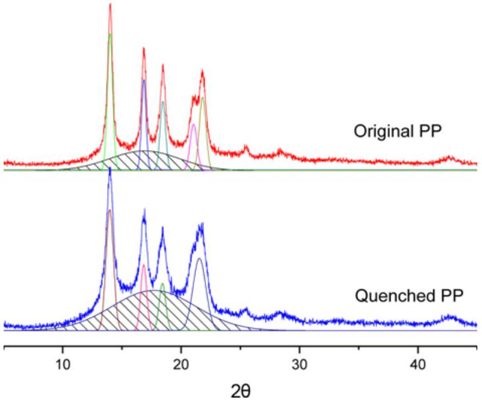
Figure 1. XRD analysis of original PP and quenched PP.

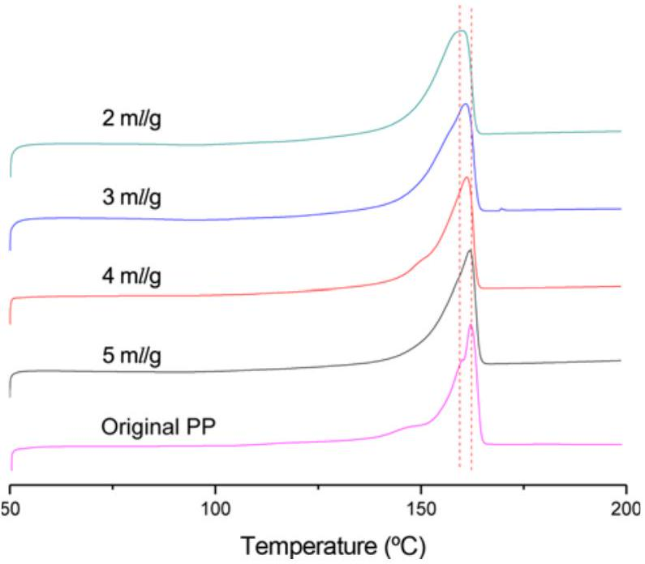
Figure 2. DSC test results of original PP and quenched PP.

PP was dissolved at 140 °C and quenched with ice water, and the crystallization time was reduced to a very limited period. The segments of PP had insufficient time to properly crystallize. Thus, the crystallinity of PP dramatically decreased.

The diffraction peaks of the $\alpha$-crystal, which were observed at $2 \theta=14.0^{\circ}, 16.9^{\circ}, 18.4^{\circ}, 21.0^{\circ}$, and $21.8^{\circ}$, represent the $o(110), \alpha(040), \alpha(130), \alpha(111)$, and $\alpha(131)$ planes, respectively [25,26]. The XRD analysis results show that the crystal type of the quenched PP remained the same as $\alpha$-crystal of original PP. In this case, without nucleating agents, PP with high MFR did not prefer to form $\beta$-crystal or other crystal types during the crystallization process.

To analyze the decrease in crystallinity of quenched PP, DSC experiments were conducted, and the melting DSC curves of the original and quenched PP are shown in Figure 2. The melting enthalpies and relevant data are listed in

Table 1. DSC test results of original and quenched PP
| Solvent dosage ( $\mathrm{m} / \mathrm{g}$ ) | Melting temperature (°C) | Melting enthalpy (kJ/g) |
| :--- | :--- | :--- |
| Original | 162.08 | 122.1 |
| 2 | 160.15 | 83.1 |
| 3 | 160.79 | 88.3 |
| 4 | 161.25 | 91.2 |
| 5 | 161.59 | 94.1 |

Table 1. When quenched with $2 \mathrm{ml} / \mathrm{g}$ solvent, the melting enthalpy of PP clearly decreased from $122 \mathrm{~kJ} / \mathrm{mol}$ to $83 \mathrm{~kJ} / \mathrm{mol}$. The melting temperature also decreased from 162.08 °C to 160.15 °C, indicting a decrease in the crystallinity [25,27,28]. Elmajdoubi et al. [27] studied the effect of cooling rates on the crystallization of PP and showed that a high cooling rate significantly decreased the crystallinity degree because of the short crystallization time. However, the glass transition temperature of PP was below 0 °C (approximately -10 °C); the amorphous area continuously crystallized until the chain segment movement was limited by the crystal area. Under the same conditions, the cooling rate did not affect the crystallinity of PP when the rate exceeded 100 °C/min.
However, the concentration of PP in the solution decreased with increasing solvent amount. Therefore, the chain segment of PP had more space for movement and facilitated its orientation, thus increasing the crystallinity. When the solvent amount increased from $2 \mathrm{ml} / \mathrm{g}$ to $5 \mathrm{ml} / \mathrm{g}$, the corresponding melting enthalpy increased from 83 to 94 kJ/g and the melting temperature increased from 160.15 to 161.59 °C.

Figure 3 shows the morphology of quenched PP particles. The surface of the PP particles showed a large number of pores, which were produced when the PP rapidly precipitated

Table 2. BET test results
| Solvent dosage (ml/g) | BET SSA $\left(\mathrm{m}^{2} / \mathrm{g}\right)$ |
| :--- | :--- |
| 2 | 0.8645 |
| 3 | 1.3856 |
| 4 | 2.8701 |
| 5 | 4.1095 |

from the solvent. The solvent in this case served as a poreforming agent. When the solvent amount increased from $2 \mathrm{ml} / \mathrm{g}$ to $5 \mathrm{ml} / \mathrm{g}$, the diameter of the PP granule decreased from $\sim 30 \mu \mathrm{~m}$ to $8 \mu \mathrm{~m}$. The two-fold effect increased the specific surface area of PP.

To further investigate the effect of solvent amount on the specific surface area of PP, the Brunauer-Emmett-Teller (BET) test on quenched PP particles produced with different solvent amount was conducted. The test results are summarized in Table 2. The specific surface area increased from $0.8645 \mathrm{~m}^{2} / \mathrm{g}$ to $4.1095 \mathrm{~m}^{2} / \mathrm{g}$ with increasing solvent amount.

## Main Factors Affecting the Graft Rate   Effect of Quenching Solvent Amount on Graft Rate

Figure 4 shows the effect of solvent amount on the graft rate (Gr) of PP-g-AA. During the suspension-grafting processes, the interface agent seeped into interior of PP particles through the pores on particle surface and caused the amorphous and incomplete crystal region of PP to swell. As the reaction temperature was below the melting temperature of PP, these swelled areas formed the main reaction sites for graft polymerization.

As the solvent amount increased from $2 \mathrm{ml} / \mathrm{g}$ to $5 \mathrm{ml} / \mathrm{g}$

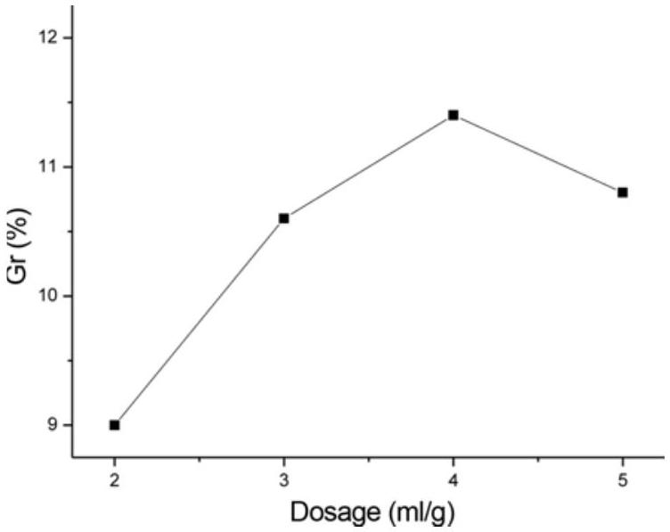
Figure 4. Effect of quenching amount of solvent on Gr (water: 3 ml/g, xylene: 10.6 \%, BPO: 0.4 \%, AA: 20 \%).

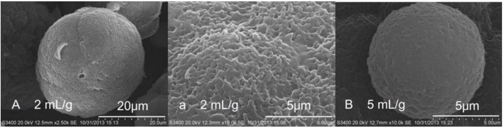
Figure 3. SEM photographs of quenched PP with different amounts of solvent; (A) and (a) were obtained with a solvent amount of $2 \mathrm{ml} / \mathrm{g}$ and (B) was obtained with a solvent amount of $5 \mathrm{ml} / \mathrm{g}$.

(the specific surface area increased from $0.8645 \mathrm{~m}^{2} / \mathrm{g}$ to $4.1095 \mathrm{~m}^{2} / \mathrm{g}$ ), the graft rate of PP-g-AA first increased from 9 \% to 11 \% and then decreased to 10 \%. The graft rate did not always increase with the surface area, despite the increasing specific surface area. In other words, the graft rate decreased because of the increasing crystallinity, which reduced the area for interface agent to swell. At this instant, the size of swelled amorphous region in PP significantly affected the graft rate and served as the main reaction site.

## Main Factors Affecting the Suspension Grafting

Unlike other grafting polymerization methods, the suspension grafting process uses water as the dispersion medium. The PP particles were dispersed and also independent from each other. The interface agent, xylene, and the initiator, BPO, were trapped in the pores of PP particles and covered by hot water. By heating and stirring, the interface agent first swelled the amorphous region of PP through the pores on its surface, formed an interface, and allowed to pass the initiator, BPO, and the grafting monomer, AA, into the interior of PP. Inside the particle, the BPO first decomposed into benzoyl radicals. Because of space limitation, the benzoyl radicals had enough time to further decompose into phenyl radicals with strong hydrogen abstraction ability. The formation of PP macromolecular radicals played a key role in this grafting system. According to Zhuo [12], within the enclosed PP particles, the flow and diffusion of free radicals are limited, thus enhancing the chain transfer reaction between the phenyl radials and PP. Two competitive reactions occurred; (1) the graft polymerization initiated by the PP radials and (2) the homopolymerization of AA monomer initiated by the initiator itself. In this suspension system, the water-soluble AA monomer was mainly dissolved in water. During the grafting process, the monomer continuously diffused into the interface layer to participate in the grafting polymerization. Thus, the concentration of AA monomer in the interface layer remained at a low level, thus effectively reducing the homopolymerization and improving the efficiency of grafting polymerization. In addition, the homopolymer that was produced in the process dissolved in water and came out of the PP particles. This could ease the crosslinking reaction between the homopolymer and PP molecular chain within the limited space, which influence the MFR of finial products.

Figure 5(a) shows that the amount of initiator BPO significantly affected the Gr. The increase in the BPO amount increased the radical concentration in the grafting system and improved the graft rate of the finial product. However, the high radical concentration not only aggravate the homopolymerization of the monomer, which was unfavorable for the graft polymerization, but also severely degraded PP, affecting the mechanical properties of the finial product [29]. Figure 5(b) shows that the amount of dispersion medium, water, also significantly affected the graft rate. A very small amount of water could not effectively disperse

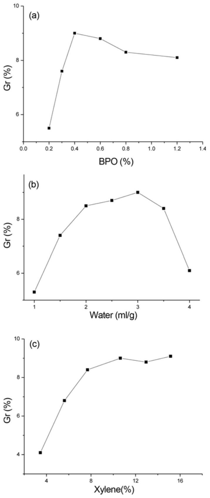
Figure 5. Factors affecting suspension grafting; (a) water: $3 \mathrm{ml} / \mathrm{g}$, xylene: 10.6 \%, AA: 20 \%, (b) BPO: 0.4 \%, xylene: 10.6 \%, AA: 20\%, and (c) water: 3 ml/g, BPO: 0.4 \%, AA: 20 \%.

the PP particles and increased the concentration of monomer. However, large amounts of water resulted in a low concentration gradient between the water and interface, affecting the diffusion of monomer and making the monomer unable to participate in the graft polymerization effectively. The monomer, AA, used in this experiment has polar carboxylic acid functional groups. The large difference in solubility parameter of monomer and PP made the monomer a poor swelling agent. The addition of a suitable amount of xylene
as the interface agent increased the swelling degree of PP in the grafting process and provided more reaction sites, as shown in Figure 5(c).

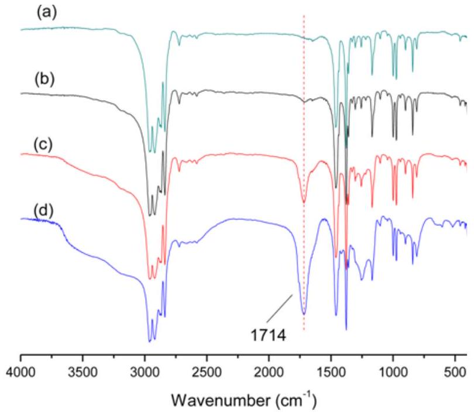
Figure 6. FT-IR spectra of PP-g-AA; (a) original PP, (b) PP-g-AA with Gr of 2.6 \%, (c) PP-g-AA with Gr of 4.4 \%, and (d) PP-g-AA with Gr of 8.7 \%.

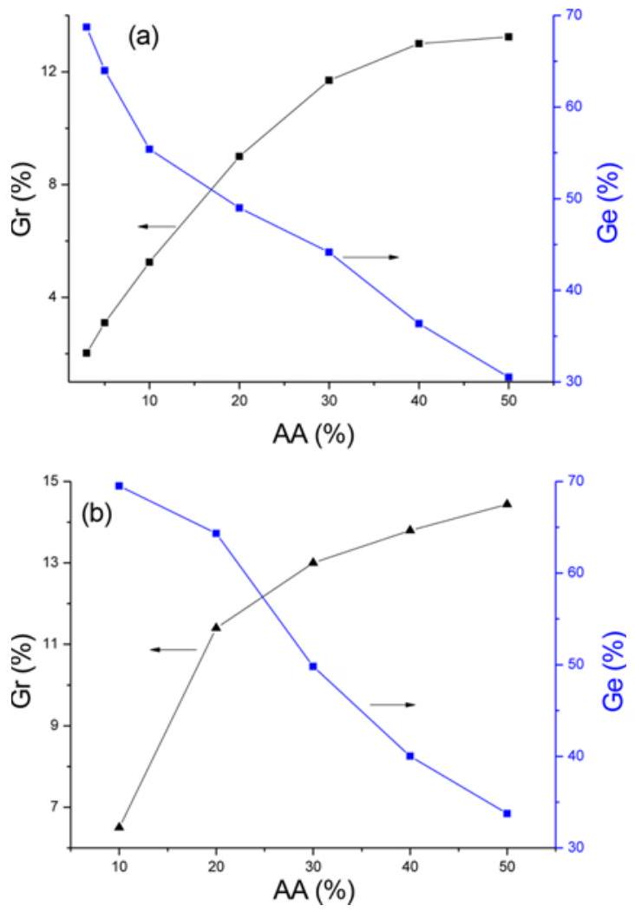
Figure 7. Effect of monomer amount on Gr and Ge; (a) water: 3 ml/g, xylene: 10.6 \%, BPO: 0.4 \% with a quenching solvent amount of 2 ml/g and (b) water: 3 ml/g, xylene: 10.6 \%, BPO: $0.4 \%$, with a quenching solvent amount of $4 \mathrm{ml} / \mathrm{g}$.

Figure 6 shows the FT-IR spectra of PP-g-AA after the extraction with acetone using a soxhlet extractor. The (b), (c), and (d) spectra show the grafting products, the values of Gr are 2.6 \%, 4.4 \%, and 8.7 \%, respectively. Compared to original PP (spectrum (a)), strong absorption bands appeared at $1714 \mathrm{~cm}^{-1}$ in the grafting products, which is the characteristic stretching band of the carbonyl group of AA [29]. Because the homopolymer of monomer had been removed by acetone, the spectra indicated that AA was successfully grafted onto the PP molecular chain.

For graft polymerization, the monomer graft efficiency and product graft rate are the important indicators of grafting method.

Figure 7 shows the effect of monomer dosage on Gr and Ge. The graft rate of the product increased with increasing monomer dosage, from 2.02 \% to 13.24 \% as shown in in Figure 7(a), and from 6.5 \% to 14.5 \% as shown in Figure 7(b). However, the graft efficiency decreased from 70 \% to 30 \% with increasing monomer concentration. When the feed ratio of AA monomer increased to a critical value, the homopolymerizations of AA initiated by the dissociative radicals became significant and decreased the Ge. Moreover, because of the space limitation in the swelled amorphous region of PP, a high monomer concentration was also likely to exacerbate the crosslinking [12], thus affecting the performance of the final product.

## Effect of Grafting Rate on Melt Flow Rate and Water Contact Angle

Melt-blown PP fiber has a high requirement on the flow properties of the original materials. The MFR is required to be at least 800 g/min for the melt-blown resin to be successfully spun. Figure 8 shows the effect of grafting rate on the flow properties of the product. Because the PAA graft chains are polar, hydrogen bonds can be formed between the molecular chains, thus increasing the interactions between them and decreasing the melt flow properties of the product [30]. When the graft ratio is small, the $\theta$ bond of the PP

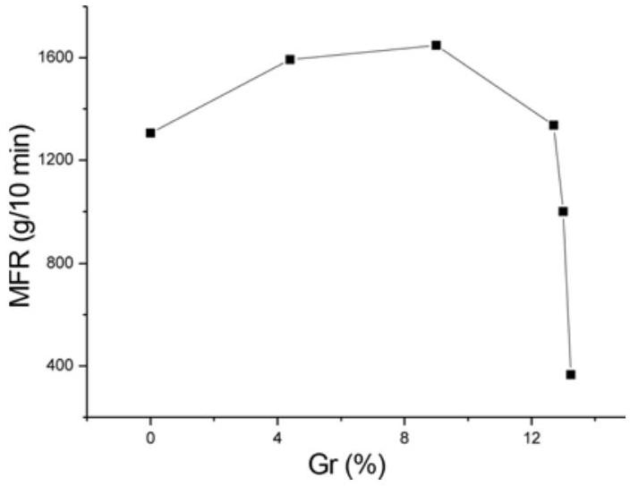
Figure 8. Effect of grafting rate on melt flow rate.

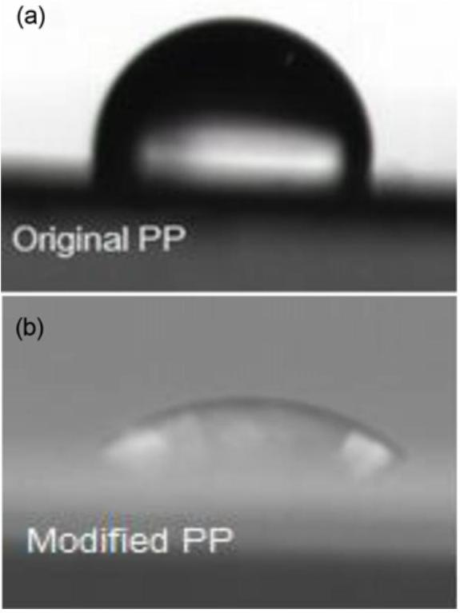
Figure 9. Water contact angle of PP; (a) before grafting modification and (b) after grafting modification.

molecular chains, whose $\alpha-\mathrm{H}$ was captured by the radical generated from the initiator, is easy to cleave [29,31]. This decreases the molecular weight and increases the MFR. When the graft rate reaches 13 \%, the force between the molecular chains sharply increases, thus sharply decreasing the flow properties of the grafted product.

Figure 9 shows the water contact angle of PP-g-AA products (Gr 4.4 \%). The introduction of polar carboxylic acid groups improved the surface polarity of PP and reduced the water contact angle from 102 ° (a) to 50 ° (b).

## $\mathbf{P b}^{\mathbf{2}+}$ Adsorption Ability of PP-g-AA and PP-g-AA-DETA Fiber in Water

The PP-g-AA fiber was obtained by melt-blown spinning of grafting product with a Gr of 4.4\%. The morphology is shown in Figure 10. The fiber was $\sim 10 \mu \mathrm{~m}$ in diameter with loose structure.

The carboxylic acid group of PP-g-AA besides improving the hydrophilicity of PP fiber could also condense with other monomers containing amine groups. DETA contains multiamine groups, makes it possible a ligand for metal ion chelaing adsorption. Using DCC/HOBt as the amidation reagent, the PP-g-AA-DETA fiber can be prepared by the condensation reaction of PP-g-AA with DETA. Thus, amine groups were introduced into the PP molecular chain, Figure 11.
The FT-IR spectra of PP-g-AA-DETA are shown in Figure 12. After the condensation reaction with DETA, two new characteristic peaks were observed at 1557 and $1657 \mathrm{~cm}^{-1}$, and these were attributed to the N-H bending vibration and

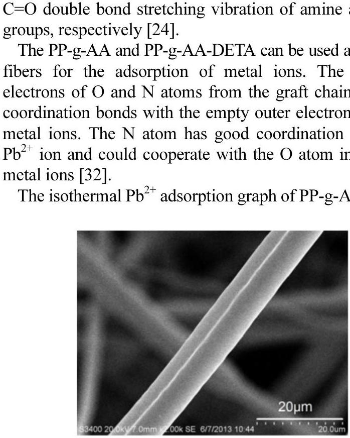
Figure 10. Morphology of PP-g-AA fiber.

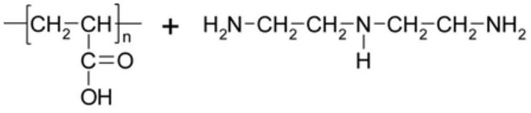
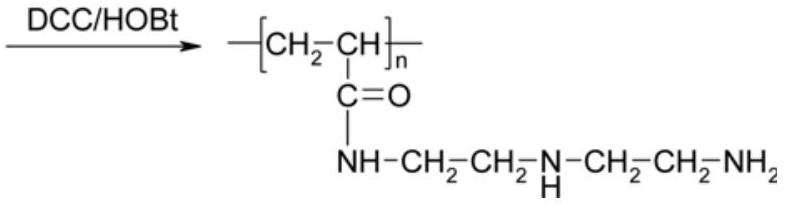

Figure 11. Condensation of PP-g-AA with DETA.
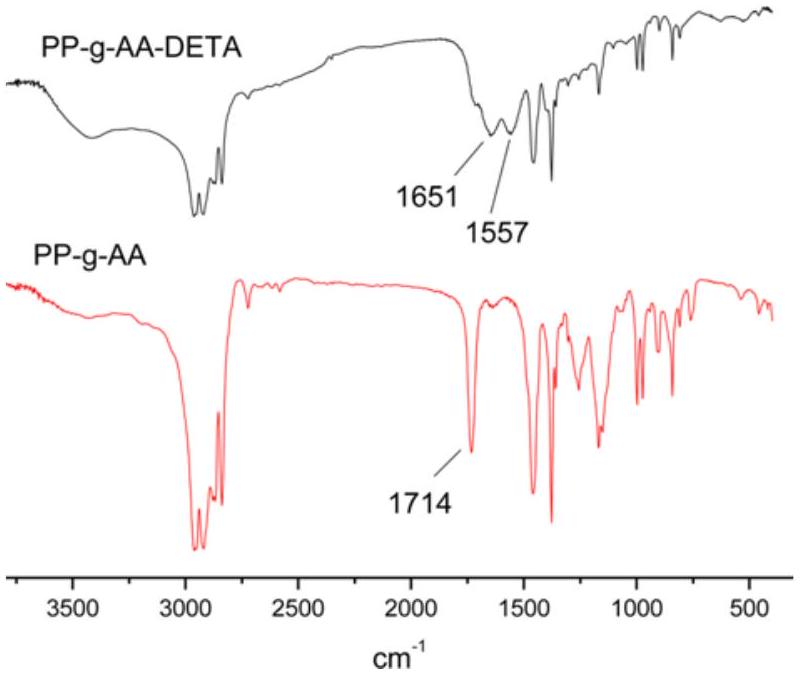

Figure 12. FT-IR spectra of PP-g-AA-DETA.

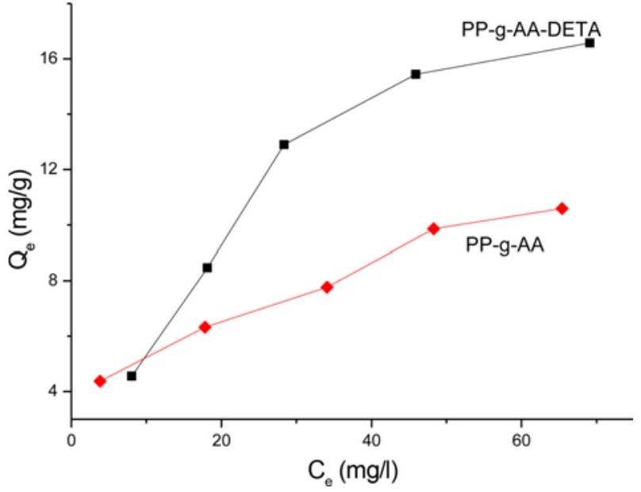
Figure 13. $\mathrm{Pb}^{2+}$ isothermal adsorption of PP-g-AA and PP-g-AA-DETA fiber.

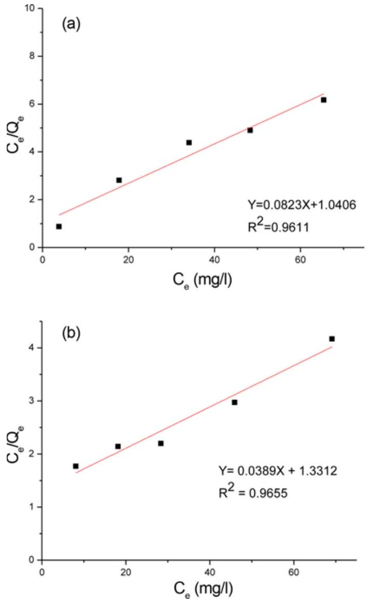
Figure 14. Isothermal adsorption of $\mathrm{Pb}^{2+}$ and linear regression; (a) PP-g-AA fiber and (b) PP-g-AA-DETA fiber.

g-AA-DETA fiber with the AA graft rate of $4.4 \%$ are shown in Figure 13. For PP-g-AA fiber, with equilibrium concentration $\left(C_{e}\right)$ increased from 3.8 to $65.4 \mathrm{mg} / l$, its adsorption capacity

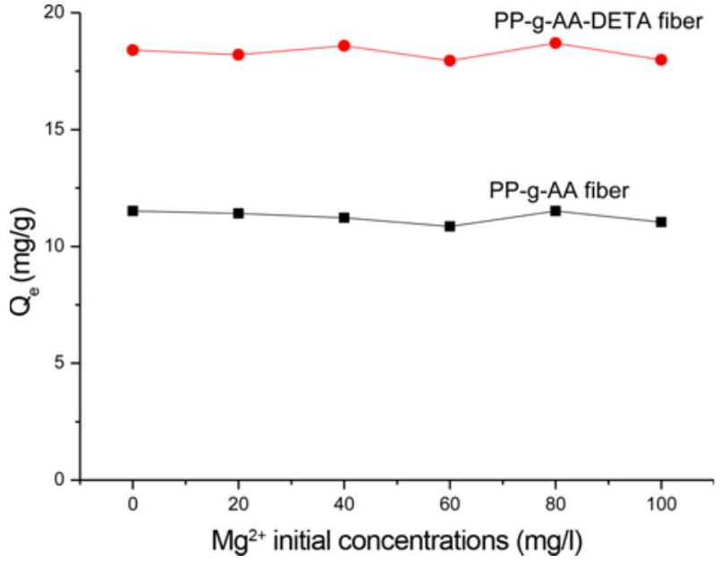
Figure 15. $\mathrm{Pb}^{2+}$ competition adsorption capacities of PP-g-AA and PP-g-AA-DETA fiber.

$\left(Q_{e}\right)$ increased from 4.4 to 10.6 mg/g. And the $Q_{e}$ of PP-g-AA-DETA fiber increased from 4.6 to 16.6 mg/g with $C_{e}$ increased from 8.1 to $69.1 \mathrm{mg} / l$. Their adsorption behaviors were in agreement with the Langmuir isotherm adsorption model. It should therefore be monolayer adsorption. The results were verified by obtaining linear regression relationship, as shown in Figure 14. An increase can be seen in adsorption capacity after the DETA was immobilized onto PP-g-AA fiber surface.

Langmuir isothermal adsorption equation is given by:

$$
\begin{equation*}
\frac{C_{e}}{Q_{e}}=\frac{C_{e}}{Q_{m}}+\frac{1}{b Q_{m}} \tag{4}
\end{equation*}
$$

where $Q_{e}$ is the equilibrium $\mathrm{Pb}^{2+}$ adsorption capacity of the chelating fiber, $Q_{m}$ is the maximum adsorption capacity, $C_{e}$ is the equilibrium concentration of $\mathrm{Pb}^{2+}$ and $b$ is a constant. In the Langmuir isothermal adsorption equation, the slope of the line between $C_{e} / Q_{e}$ and $C_{e}$ is the reciprocal of the maximum adsorption capacity $Q_{m}$. The maximum $\mathrm{Pb}^{2+}$ adsorption capacity of PP-g-AA and PP-g-AA-DETA chelating fibers were determined on this basis as 12.2 mg/g and 25.7 mg/g accordingly.

The removal of heavy metals from multi-metal solution by competitive adsorption is a relatively new and emerging technology in the field of water treatment by sorbent materials. The adsorption behavior of the two chelating fiber in binary solution was shown in Figure 15.

With $\mathrm{Mg}^{2+}$ initial concentrations increasing from 20 to $100 \mathrm{mg} / l$, the $\mathrm{Pb}^{2+}$ adsorption capacity of PP-g-AA and PP-g-AA-DETA fiber decreased from 11.5 to 11.0 mg/g and 18.4 to 17.9 mg/g respectively.
It can be seen that the competing $\mathrm{Mg}^{2+}$ ion has limited effect on the sorption of target $\mathrm{Pb}^{2+}$ ion in competitive adsorption system. And therefore makes PP-g-AA and PP-g-AA-DETA fibers potential candidates for selectively remove
$\mathrm{Pb}^{2+}$ ion from wastewater.

## Conclusion

The swelled amorphous region was an important reaction site for the suspension graft polymerization. Using quenching pretreatment, the crystallinity of PP could be decreased by shortening the crystallization time. The $\Delta H$ of PP decreased from 122.1 kJ/g to 83.1 kJ/g. Large number of pores were formed on the surface of PP, and the specific surface area of PP increased with increasing BET area of PP. The surface area could be increased by four times by increasing the solvent ratio. However, both the crystallinity and the graft rate of the product first increased with increasing solvent amount and then decreased. The strong polarity of AA graft chains increased the force between molecular chains and decreased the MFR of grafting product. Under reaction temperature of $90^{\circ} \mathrm{C}$, with xylene as the interface agent, water as the dispersing medium, and BPO as the initiator, the Gr of PP-g-AA reached 12.7 \%. The product also showed good MFR (1336 g/10 min). The polarity and hydrophilicity of PP were improved, and the WCA was reduced from $102{ }^{\circ}$ to 50 °. After melt-blown spinning and condensation with DETA, the PP-g-AA-DETA fiber obtained showed better $\mathrm{Pb}^{2+}$ adsorption ability in water than PP-g-AA and was found suitable as a chelating fiber. The Langmuir equation was used to determine the adsorption capacity of the PP-g-AA and PP-g-AA-DETA chelating fiber with the AA graft rate of 4.4\% as 12.2 and 25.7 mg/g respectively. The both chelating fiber have shown selective adsorption ability of target $\mathrm{Pb}^{2+}$ in solution with $\mathrm{Mg}^{2+}$ as competing ion.

## References

1. M. A. Hossain, H. H. Hgo, W. S. Guo, L. D. Nghiem, F. I. Hai, S. Vigneswaran, and T. V. Nguyen, Bioresource Technol., 160, 79 (2014).
2. L. H. Zhang, X. S. Zhang, P. P. Li, and W. Q. Zhang, React. Funct. Polym., 69, 48 (2009).
3. X. L. Shi, M. Zhang, Y. D. Li, and W. Q. Zhang, Green Chem., 15, 3438 (2013).
4. M. Barsbay and O. Guven, Polymer, 54, 4838 (2013).
5. C. Salas, J. Genzer, L. A. Lucia, M. A. Hubbe, and O. J. Rojas, Appl. Mater. Interf., 5, 6541 (2013).
6. C. Zhang, Y. P. Bai, and W. W. Liu, Ind. Eng. Chem. Res., 52, 14143 (2013).
7. K. Yamada and Y. Naohara, J. Appl. Polym. Sci., 130, 1369 (2013).
8. T. Sadik, V. Massardier, F. Becquart, and M. Taha, J. Appl.

Polym. Sci., 129, 2177 (2013).

9. H. S. Kim and H. J. Kim, Fiber. Polym., 14, 793 (2013).
10. B. Zhu, W. Dong, J. Wang, J. Song, and Q. Dong, J. Appl. Polym. Sci., 126, 1844 (2012).
11. G. M. A. Khan, M. Shaheruzzaman, M. H. Rahman, S. M. A. Razzaque, M. S. Islam, and M. S. Alam, Fiber. Polym., 10, 65 (2009).
12. Z. Li, Y. Ma, and W. Yang, J. Appl. Polym. Sci., 129, 3170 (2013).
13. E. Passaglia, S. Coiai, F. Cicogna, and F. Ciardelli, Polym. Int., 63, 12 (2014).
14. B. Francoise, F. Jean-Jacques, and V. Bruno, J. Polym. Eng., 33, 673 (2013).
15. A. Zare, M. Morshed, R. Bagheri, and K. Karimi, Fiber. Polym., 14, 1783 (2013).
16. J. Zhao, Q. Shi, L. G. Yin, S. F. Luan, H. C. Shi, L. J. Song, J. H. Yin, and P. Stagnaro, Appl. Surf. Sci., 256, 7071 (2010).
17. L. R. Ma, A. Meshude, A. Lucille, and G. Olgun, Radiat. Phys. Chem., 94, 93 (2013).
18. Y. Rancourt, B. Couturaud, A. Mas, and J. J. Robin, J. Colloid Interf. Sci., 402, 320 (2013).
19. Z. P. Zhao, M. S. Li, N. Li, M. X. Wang, and Y. Zhang, J. Membrane Sci., 440, 9 (2013).
20. B. Gupta, M. Kumari, and S. Ikram, J. Polym. Res., 20, 95 (2013).
21. H. A. Karahan and E. Ozdogan, Fiber. Polym., 9, 21 (2008).
22. W. F. Kong, W. J. Wei, and W. D. Liu, Morden Plast. Proces. Appl., 20, 24 (2008).
23. K. K. Du and Q. Q. Xu, China Plast., 19, 45 (2005).
24. H. J. Park and C. K. Na, J. Colloid Interf. Sci., 301, 46 (2006).
25. Z. W. Wang, J. Hu, F. Z. An, J. W. Gong, X. Q. Gao, C. Deng, and K. Z. Shen, J. Mater. Sci., 48, 6986 (2013).
26. C. G. Wang, Z. S. Zhang, Q. Ding, J. Jiang, G. Li, and K. C. Mai, Thermochim. Acta, 559, 17 (2013).
27. M. Elmajdoubi and T. Vu-Khanh, Theor. Appl. Fract. Mec., 39, 117 (2003).
28. A. Suplicz, F. Szabo, and J. G. Kovacs, Thermochim. Acta, 574, 145 (2013).
29. R. D. Wu, X. L. Tong, and Z. L. Yang, J. Functional Polym., 14, 85 (2001).
30. J. Y. Kim, E. S. Seo, D. S. Park, K. M. Park, S. W. Kang, C. H. Lee, and S. H. Kim, Fiber. Polym., 4, 107 (2003).
31. M. Zhang, R. H. Colby, S. T. Milner, and T. C. M. Chung, Macromolecules, 46, 4314 (2013).
32. C. Kavakh, P. A. Kavakh, and O. Guven, Radiat. Phys. Chem., 94, 111 (2014).

[^0]:    *Corresponding author: wjwei@njtech.edu.cn

