# Preparation of Cr(VI)-imprinted polypropylene nonwoven fibers using plasma polymerization-assisted grafting 

Zhengwei Luo ${ }^{\mathbf{1}}$ | Yiyang Xu ${ }^{\mathbf{2}}$ | Haonan Chen ${ }^{\mathbf{2}}$ | Hui Jiang ${ }^{\mathbf{1}}$ | Wenhua Geng ${ }^{\mathbf{1}}$ | Wuji Wei ${ }^{\mathbf{2}}$ | Zhouyang Lian ${ }^{\mathbf{2}}$

${ }^{1}$ College of Biotechnology and Pharmaceutical Engineering, Nanjing Tech University, Nanjing, China
${ }^{2}$ School of Environmental Science and Engineering, Nanjing Tech University, Nanjing, China

Correspondence
Wuji Wei and Zhouyang Lian, School of Environmental Science and Engineering, Nanjing Tech University, 30\# Puzhu South Road, Nanjing 211816, China. Email: wjwei@njtech.edu.cn (W. Wei) and lianzy1985@163.com (Z. Lian).

Funding information
National Natural Science Foundation of China, Grant/Award Number: 21676144

#### Abstract

Polypropylene (PP) fibers were grafted with glycidyl methacrylate (GMA) using plasma polymerization and then aminated, imprinted, and crosslinked to prepare Cr(VI)-imprinted fibers. The plasma polymerization conditions were optimized by single factor experiment and response surface methodology, and various properties and adsorption mechanism of the fibers were analyzed. The results showed that at pH 3, the imprinted fibers had a maximum Cr(VI) adsorption capacity of 173.36 mg/g, and the adsorption equilibrium could be reached within 40 min. In the presence of competing ions $\left(\mathrm{SO}_{4}{ }^{2-}\right.$, $\mathrm{NO}_{3}{ }^{-}$and $\mathrm{PO}_{4}{ }^{3-}$ ) each at a concentration of 5 times of that of Cr(VI), the Cr(VI) adsorption rate of the fibers could be maintained at around 50\%, which indicates that the imprinted fibers have high selectivity towards Cr(VI). The results also showed that the imprinted fibers had good reusability and enrichment ability, thus can be a good candidate for treating actual Cr(VI)-contaminated water.

KEYWORDS
adsorption, fibers, functionalization of polymers, grafting, separation techniques

## 1 | INTRODUCTION

Polypropylene (PP) fibers are widely used as adsorbents due to their physical and chemical stability, large external specific surface area, and high water flux. They are also inexpensive and easily accessible. ${ }^{[1-3]}$ However, PP fibers are highly hydrophobic and have no functional groups, thus cannot be directly used as adsorbents for metal ions in solutions. ${ }^{[4]}$ Therefore, it is necessary to introduce functional groups into the surface through surface modification method so that their other properties can be fully utilized. ${ }^{[5-8]}$ Furthermore, PP fibers-based ion-imprinted polymers, which can directly adsorb target ions, have many advantages, including high adsorption capacity, good selectivity, and repeatability. They can also overcome various disadvantages of adsorption process, such as slow process, poor accessibility, and difficulty in eluting target ions. Li et al. used PP fibers as substrates for the grafting of acrylic acid and polyethylene imine to prepare a $\mathrm{Cu}^{2+}$-imprinted polymer through crosslinking that has excellent $\mathrm{Cu}^{2+}$ adsorption capacity and high selectivity toward $\mathrm{Zn}^{2+.[9]}$ Zhang et al. also prepared modified PP fibers by irradiation grafting and surface ion-imprinted PP nonwoven fabric by copolymerization and crosslinking for selective adsorption of uranium from seawater. ${ }^{[10]}$

Low temperature plasma treatment is a good strategy for material modification. This treatment has various advantages, including simple operation, low reaction temperature, high reaction rate, low energy consumption, low exhaustion of pollution, and ability to maintain the mechanical properties of materials. ${ }^{[11]}$ Studies have reported many PP fibers that are mainly modified by plasmainduced graft polymerization. ${ }^{[12,13]}$ The plasma-induced
graft polymerization can usually be carried out either in two steps, which are gaseous plasma treatment and subsequent aqueous phase grafting, or in one step in an aqueous phase system, which is considerably tedious. Plasma polymerization, on the other hand, is a one-step process that combines the plasma treatment step with the grafting step, ${ }^{[14-16]}$ which has high grafting efficiency. However, the use of the method in the preparation of ion-imprinted polymers has not been reported.

Chromium (Cr(VI)), which is typically present in a form of oxyanion, is a chemical that is highly harmful to the environment and human and cannot be easily removed from wastewater. ${ }^{[17,18]}$ Industries, such as metal smelting, electroplating and tanning, release wastewater that contains Cr(VI) and other competitive ions such as sulfate and phosphate, which can interfere with adsorption selectivity of Cr(VI) on conventional chelating adsorption materials and ion exchange materials. Using a more specific and selective polymer containing template ions that has memory and recognition sites, such as surface ion-imprinted polymers, is expected to solve the above problem. ${ }^{[19,20]}$ In our previous study, PP fibers were treated with radio frequency discharge plasma and then grafted with acrylic acid, followed by amination reaction, imprinting and crosslinking to prepare surface ion-imprinted fibers that have high adsorption capacity and selectivity for Cr(VI). ${ }^{[21]}$ However, preparation of Cr(VI)-imprinted PP fibers using plasma polymerization has not been reported.

In this work, PP fibers, the matrix materials, were grafted with glycidyl methacrylate (GMA) via plasma polymerization and then subjected to amination reaction and ion imprinting process to prepare Cr(VI)-imprinted PP fibers. The grafting process was optimized by single factor test and response surface methodology. The surface morphology and functional groups of the prepared fibers were analyzed; and their adsorption characteristics, that is, influencing factors, adsorption isotherm, kinetics, selectivity, and reusability, were determined.

## 2 | EXPERIMENTAL

## 2.1 | Materials and reagents

Pristine PP fibers (diameters $=2-10 \mu \mathrm{~m}$, surface area $=1.5 \mathrm{~m}^{2} / \mathrm{g}$ ) were self-prepared by melt blowing process in our own laboratory. ${ }^{[2,5]}$ Argon (Ar) was supplied by Nanjing Shangyuan Industrial Gas Company (Nanjing, China). Other reagents including GMA, thiosemicarbazone (TSC), epichlorohydrin, N, N-dimethylformamide (DMF), formaldehyde, glutaraldehyde, and $\mathrm{K}_{2} \mathrm{Cr}_{2} \mathrm{O}_{7}$ were of analytical grade and were obtained from Sinopharm Chemical Reagent Co., Ltd. (Shanghai, China).

## 2.2 | Preparation of samples

### 2.2.1 | Grafting of GMA onto PP fibers

A diagram showing the plasma polymerization experiment is shown in Figure 1. PP fibers were successively cleaned with acetone and deionized water; and after drying, they were placed in a quartz reactor. Air in the reactor was replaced with Ar, which was subsequently sucked out to create vacuum. GMA monomer was placed in a flask containing a small amount of zeolite, which was then heated at 45°C to vaporize the monomer. Ar was used as a carrier gas to control that rate of the monomer that was flowed into the reactor. After the plasma power source was turned on, the polymerization process was proceeded under various discharge powers, treatment times, GMA monomer flow rates, and pulse duty cycles. After the plasma was discharged, the GMA monomer was released into the inlet of the plasma reaction chamber for about 2 min or until it was fully reacted with the remaining active sites on the surface of the PP fibers. The resulting GMA-grafted PP fibers (PG) were extracted with acetone (in a Soxhlet extractor) for 5 hr to remove unreacted monomer and homopolymer, and the extract was then dried in a vacuum oven.

PG fibers were immersed in 50 mL of xylene solution, into which a certain amount of trichloroacetic acid/xylene solution was then added. After being refluxed for 1-1.5 hr, the mixture was titrated with NaOH/ethanol solution using phenolphthalein/ethanol solution as an indicator. The grafting degree (\%) was calculated as follows:

$$
\begin{equation*}
\text { Grafting degree }(\%)=\left[\left(\left(V_{0}-V\right) \times c \times 142.15\right) / \mathrm{m}\right] \times 100 \% \tag{1}
\end{equation*}
$$

where $V_{0}$ and $V(\mathrm{~mL})$ are the volume of NaOH/ethanol solution consumed during titration with the blank

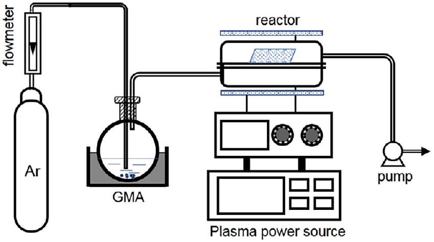
FIGURE 1 A process diagram of plasma polymerization [Color figure can be viewed at wileyonlinelibrary.com]

sample and with the PG fibers, respectively; $c(\mathrm{~mol} / \mathrm{L})$ is the concentration of the NaOH/ethanol solution; 142.15 $(\mathrm{g} / \mathrm{mol})$ is the molar mass of GMA; and $m(\mathrm{~g})$ is the mass of the PG fibers.

Response surface methodology based on Box-Behnken design test was carried out using four test factors including discharge power, treatment time, monomer flow rate (standard-state $\mathrm{cm}^{3} / \mathrm{min}$, sccm), and pulse duty cycle, each of which had three response levels that were chosen based on the results from the single factor experiment. Code and level of each factor are shown in Table 1.

### 2.2.2 | Amination of PG fibers

PG fibers were added to TSC solution (1 mol/L), of which the pH was adjusted to about 9 with $\mathrm{K}_{2} \mathrm{CO}_{3}$, and amination reaction was allowed to take place at various temperatures. ${ }^{[22,23]}$ After the reaction was completed, the products were washed with deionized water until a neutral pH was obtained and was then dried in a vacuum drying oven to a constant weight. The dry product was denoted as PP-g-GMA-TSC (PGT) chelated fibers.

The PGT fibers were placed in a $100-\mathrm{mL}$ triangular stoppered bottle; after that, 50 mL of hydrochloric acid/ethanol solution (0.05 mol/L) was added. After shaking, the bottle was sealed and then placed in a water bath at 40°C for 2 hr to allow the reaction to take place. Subsequently, the solution was titrated with NaOH/ethanol solution (0.05 mol/L) using phenolphthalein/ethanol solution as an indicator. A blank control experiment was carried out in parallel. Content of amine group ( $\mathrm{E}_{\mathrm{NH} 2}, \mathrm{mmol} / \mathrm{g}$ ) was calculated as follows:

$$
\begin{equation*}
\mathrm{E}_{\mathrm{NH} 2}=\left(V_{0}-V\right) \times c \times 1000 / m \tag{2}
\end{equation*}
$$

where $V_{0}$ and $V(\mathrm{~mL})$ are the volume of NaOH/ethanol solution consumed during titration with the blank control and with the PG fibers, respectively; $c(\mathrm{~mol} / \mathrm{L})$ is the

TABLE 1 Code and level of various factors used in Box-Behnken design test
| Factor | Code | Level |  |  |
| :--- | :--- | :--- | :--- | :--- |
|  |  | -1 | 0 | 1 |
| Discharge power (W) | A | 65 | 70 | 75 |
| Treatment time (min) | B | 45 | 50 | 55 |
| Monomer flow rate (sccm) | C | 35 | 40 | 45 |
| Pulse duty cycle (\%) | D | 75 | 80 | 85 |

concentration of the NaOH/ethanol solution; and $m(\mathrm{~g})$ is the mass of the PGT fibers.

### 2.2.3 | Ion imprinting and crosslinking

The PGT fibers were placed in a conical flask containing 100 mL of potassium dichromate solution ( $200 \mathrm{mg} / \mathrm{L}$, pH 3), and the adsorption took place in a thermostatic oscillator operated at 150 rpm for 2 hr. The resultant Cr(VI)-chelated PGT was crosslinked with epichlorohydrin, N, N-dimethylformamide (DMF), formaldehyde and glutaraldehyde, each at a concentration of 30\%. After that, the fibers were washed with dilute NaOH solution to remove the template Cr(VI) ions until Cr(VI) ions were no longer detected in the washing solution. The fibers were further washed five times each with acetone and deionized water to remove the remaining unreacted reactants on the surface of the fibers and were thereafter dried at 50°C to a constant weight. The resultant fibers were denoted as I-(PP-g-GMA-TSC) (IPGT). The non-imprinted fibers were also prepared using the same process but without the addition of Cr(VI) template ions; these non-imprinted fibers were denoted as NIPGT.

The IPGT fibers were placed in xylene, and then refluxed at 140°C for 30 min. While it remained hot, the solution was filtered through a sieve to obtain the crosslinked gel remaining on the sieve. ${ }^{[21]}$ The crosslinked gel was then rinsed three times with deionized water and was then dried at 55°C to a constant weight. The crosslinking degree (\%) of the imprinted fibers was calculated by the following equation:

$$
\begin{equation*}
C=m_{1} / m_{2} \times 100 \% \tag{3}
\end{equation*}
$$

where $m_{1}(\mathrm{~g})$ is the mass of the crosslinked gel, $m_{2}(\mathrm{~g})$ is the mass of the IPGT fibers. The experiment was repeated three times and the data were averaged.

## 2.3 | Characterizations

Fourier transform infrared (FT-IR) spectra of the fibers were recorded on an infrared spectrometer (Nexus670, Nicolet) in an attenuated total reflection mode from 600 to $4,000 \mathrm{~cm}^{-1}$ at a resolution of $1 \mathrm{~cm}^{-1}$. Morphology of fibers was observed using a scanning electron microscope (SEM, JSM-5900, JEOL) operated at a field voltage of 15 kV.

## 2.4 | Adsorption experiments

In a typical batch adsorption experiment, the fibers were placed in a $250-\mathrm{mL}$ corked conical flask containing

Cr(VI) solution, which was then placed in a water-bath equipped with a thermostatic oscillator. After the adsorption was allowed to occur for various times under adjusted temperature and pH , the concentration of Cr(VI) in the solution was measured using an inductively coupled plasma emission spectrometer (iCAP 6,300, Thermo Fisher scientific). The adsorption capacity $\left(q_{e}\right)$ was calculated as follows:

$$
\begin{equation*}
q_{e}=\frac{\left(C_{0}-C\right) \times V}{m} \tag{4}
\end{equation*}
$$

where $C_{0}$ and $C(\mathrm{mg} / \mathrm{L})$ are the concentrations of Cr(VI) before and after adsorption, respectively, $V(\mathrm{~L})$ is the solution volume, and $m(\mathrm{~g})$ is the mass of the adsorbent.

For competitive adsorption experiments, the fibers were added into 100 mL of Cr(VI) solution ( $100 \mathrm{mg} / \mathrm{L}$, pH 3) containing competing ions, including sulfate, nitrate, and phosphate, each at various concentrations (100, 200, 300, 400, and 500 mg/L). The adsorption was allowed to take place for 40 min at a temperature of $30^{\circ} \mathrm{C}$ at an oscillation speed of 150 rpm; after that, the Cr(VI) adsorption capacity of the fibers was measured. The selective adsorption ratio ( $S$, \%) was calculated by the following equation:

$$
\begin{equation*}
S=\frac{q_{c}}{q_{0}} \times 100 \% \tag{5}
\end{equation*}
$$

where $q_{c}$ and $q_{0}(\mathrm{mg} / \mathrm{g})$ are the adsorption capacities of Cr(VI) with and without competing ions, respectively.

## 3 | RESULTS AND DISCUSSION

## 3.1 | Preparation of ion-imprinted polymers

3.1.1 | Optimization of plasma polymerization process

Optimization by single factor experiment Figure 2 shows the effects of discharge power, treatment time, monomer flow rate, and duty cycle on the grafting degree of GMA. According to Figure 2a, at a discharge power of 70 W, the grafting degree of GMA reached a maximum value of $30 \%$. At low discharge powers, polymerization and etching were observed, and the polymerization reaction on the PP fibers surface was dominated. With increasing discharge power, the plasma energy increased and the etching on the GMA polymer structure was more intensified; as a result, the grafting degree of GMA began to decrease. ${ }^{[24]}$

With extended treatment time, the grafting degree of GMA continuously increased, reaching a maximum value at 50 min, but gradually decreased thereafter (Figure 2b). At the initial stage of the reaction, the monomer molecules could be stimulated, fragmented, polymerized, and in turn deposited onto the surface of PP fibers by extending the treatment time, causing the grafting degree to continuously increase. Additionally, GMA plasma appeared to also bombard on the polymer surface, causing the functional groups to become detached. ${ }^{[16,25]}$

Figure 2c shows the influence of monomer flow rate on the grafting degree of GMA. With increasing monomer

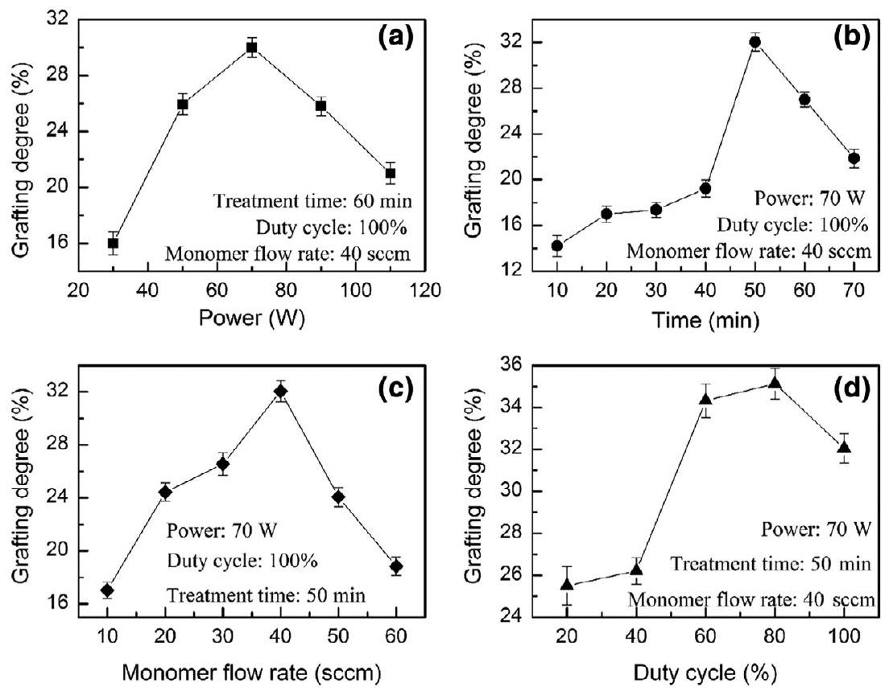
FIGURE 2 Influence of (a) discharge power, (b) treatment time, (c) monomer flow rate, and (d) pulse duty cycle on GMA grafting degree

flow rate, the amount of monomer in the reactor increased causing the grafting degree of GMA to increase. The maximum grafting degree of GMA (32.05\%) was obtained at the monomer flow rate of 40 sccm. However, at too high monomer flow rates, the retention times were shortened, thus causing the grafting degree of GMA to drop sharply. ${ }^{[26]}$

As illustrated in Figure 2d, the grafting degree was low when the duty cycle was too low, which is likely due to that the fragmentation of GMA molecules was limited. ${ }^{[15]}$ The grafting degree of GMA increased with the increase of duty cycle from 20 to 80\%, accompanied by the attachment of monomer molecules onto PP fibers. At the duty cycles exceeded 80\%, the grafting degree of GMA reduced, which may be due to bombardment by active species that can cause GMA to detach from the surface of PP fibers. ${ }^{[14,27]}$

Optimization by response surface methodology
Design Expert 8.0.6 software was used to analyze the experimental data (Table S1, Supporting Information), from which a quadratic multinomial regression model for the GMA grafting degree (Y) as a function of discharge power (A), treatment time (B), monomer flow rate (C), and pulse duty cycle (D) was obtained as follows:

$$
\begin{aligned}
\mathrm{Y}= & 31.16+1.50 \mathrm{~A}+0.88 \mathrm{~B}-1.94 \mathrm{C}-0.037 \mathrm{D}-0.63 \mathrm{AB} \\
& +3.23 \mathrm{AC}-0.26 \mathrm{AD}+0.025 \mathrm{BC}+0.93 \mathrm{BD}-0.06 \mathrm{CD} \\
& -1.90 \mathrm{~A}^{2}-1.05 \mathrm{~B}^{2}-3.17 \mathrm{C}^{2}+0.44 \mathrm{D}^{2}
\end{aligned}
$$

Results of variance analysis of the regression model are shown in Table 2. The model had an F-value = 2.52 and a $p$-value $=0.0476$, indicating that the model is significant. However, the $p$-value of missing items was 0.1572 (>.05), which is not significant, indicating that there are no outliers in the experimental data, and the introduction of items with higher orders is not required. These data indicate that the obtained regression model can suitably be used to analyze and predict the plasma polymerization of GMA onto PP fibers. In addition, the $p$-value of the monomer flow rate reached a significant level $(p<.05)$, indicating that the monomer flow rate has a significant impact on the amount of grafted GMA. The interaction between the discharge power (A) and monomer flow rate (C) was also significant, indicating that the influence of each of these factors on the response value is not simply linear. According to the F-value as shown in Table 2, the significance of the influence of the four factors on the GMA grafting degree can be ranked as follows: monomer flow rate (C) > discharge power (A) > treatment time (B) > pulse duty cycle (D).

The surface diagram of the response surface analysis (Figures S1-S6, Supporting Information) showed that the slope and thickness of the response surface curve of the monomer flow rate were highest. This suggests that the influence of the monomer flow rate on the amount of grafted GMA is highest (followed by the discharge power); on the other hand, that of the duty cycle is of the least significance. Based on the response surface analysis, the influence of the four factors on the grafted GMA can be ranked as follows: monomer flow rate > discharge power > treatment time > duty cycle, which is consistent with the results from analysis of variance.

The process conditions were further optimized by design-expert 8.0.6 software using the experimental GMA grafting degree as the evaluation index. The predicted optimal process conditions were obtained as follows: discharge power, 69.24 W; treatment time, 54.51 min; monomer flow rate, 38.05 sccm; and duty cycle, 85\%. Under these conditions, the predicted optimal grafting degree was 32.7\%. To validate these conditions, five parallel verification experiments were carried out under the predicted optimal conditions: discharge power, 69 W; time, 54 min ; monomer flow rate, 38 sccm ; and duty cycle, 85\%. A GMA grafting degree of $32.7 \pm 1.2 \%$, which is not significantly different from the predicted value, was obtained, indicating that the developed model can reliably optimize and predict the polymerization process parameters.

TABLE 2 Analysis of variance of the response surface regression model
| Source | Sum of squares | $\boldsymbol{d} \boldsymbol{f}$ | Mean square | F-value | $\boldsymbol{P}$-value (Prob>F) |  |
| :--- | :--- | :--- | :--- | :--- | :--- | :--- |
| Model | 216.88 | 14 | 15.49 | 2.52 | 0.0476 | Significant |
| C (monomer flow rate) | 45.05 | 1 | 45.05 | 7.32 | 0.0171 | Significant |
| A-C | 41.67 | 1 | 41.67 | 6.77 | 0.0209 | Significant |
| Residual | 86.12 | 14 | 6.15 |  |  |  |
| Lack of fit | 75.72 | 10 | 7.57 | 2.91 | 0.1572 | Insignificant |
| Pure error | 10.40 | 4 | 2.60 |  |  |  |
| Total | 303.00 | 28 |  |  |  |  |

### 3.1.2 | Amination of PG fibers

Effects of solvent, reaction time, and reaction temperature on the content of amino group after amination were determined. As depicted in Figure 3a, the amino content of PGT fiber obtained by an amination reaction in $\mathrm{DMF} / \mathrm{H}_{2} \mathrm{O}$ (volume ratio $=4: 1$ ) was highest. On the one hand, it appears that the presence of water, which is a polar solvent, can provide protons to the amination reaction, thus can promote the breakage of epoxy group. On the other hand, the amino content of PGT prepared by a reaction in ethanol $\mathrm{EtOH} / \mathrm{H}_{2} \mathrm{O}$ was lower compared to that prepared by a reaction in $\mathrm{DMF} / \mathrm{H}_{2} \mathrm{O}$, which may be due to that the swelling of fibers in $\mathrm{EtOH} / \mathrm{H}_{2} \mathrm{O}$ is poor.

According to Figure 3b, the amino group content of PGT fibers continuously increased with increasing reaction time, reaching a maximum value of about 1.15 mmol/g at a reaction time of 3 hr, and the value remained constant

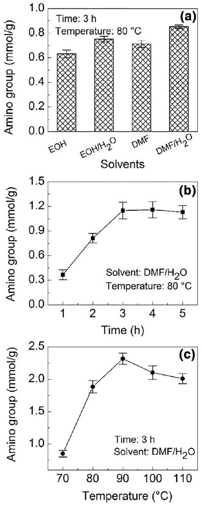
FIGURE 3 Effects of (a) solvent, (b) reaction time, and (c) reaction temperature on amino group content of PGT fibers

### 3.1.3 | Crosslinking of PGT

Figure 4a shows time-dependent changes of the crosslinking degree in the IPGT fibers crosslinked with epichlorohydrin, glutaraldehyde, and formaldehyde. When epichlorohydrin was used, the crosslinking degree of the IPGT fibers increased to 49.36\% within 2.5 hr. When glutaraldehyde was used, the crosslinking degree reached an equilibrium at 45.43\% after about 3.5 hr. This indicates that the reaction of the amino group on IPGT fibers with the epoxy group in epichlorohydrin is more complete than that with the aldehyde group in glutaraldehyde; as a result, the crosslinking degree was higher when epichlorohydrin was used. As shown in Figure 4b, with the increase of temperature, the crosslinking degree of IPGT fibers first increased reaching a maximum value at a temperature of about 60°C, and thereafter decreased. When the epichlorohydrin concentration was increased from 10\% to 30\%, the crosslinking degree of IPGT fibers increased rapidly (Figure 4c), but remained constant after the epichlorohydrin concentration reached 40\%, at which the amino group on the surface of fibers may be completely reacted causing the crosslinking degree to no longer increase. The above results show that the best crosslinking conditions for the IPGT fibers are as follows: crosslinking time, 3 hr; crosslinking temperature 60°C; and epichlorohydrin concentration, 30\%.

As illustrated in Figure 4d, the adsorption capacity of Cr(VI) on the IPGT fibers increased with the increase of crosslinking degree. It appears that a higher crosslinking degree on the surface of fibers allows more stable and specific adsorption sites for Cr(VI), thus causing the Cr(VI) adsorption capacity of the fibers to increase. By contrast, the Cr(VI) adsorption capacity of NIPGT (obtained through crosslinking without Cr(VI) template ions) decreased with the increase of crosslinking degree, likely due to that the functional amine and thiourea groups on the surface of fibers were consumed by epichlorohydrin. Therefore, we may conclude that the crosslinking degree of the imprinted fibers should be as high as possible to allow the highest possible adsorption capacity of the fibers.

FIGURE 4 Influence of (a) crosslinking agents, (b) epichlorohydrin concentration, and (c) temperature on the degree of crosslinking in IPGT. (d) Effect of crosslinking degree on Cr(VI)-adsorption capacity of IPGT and NIPGT [Color figure can be viewed at wileyonlinelibrary.com]
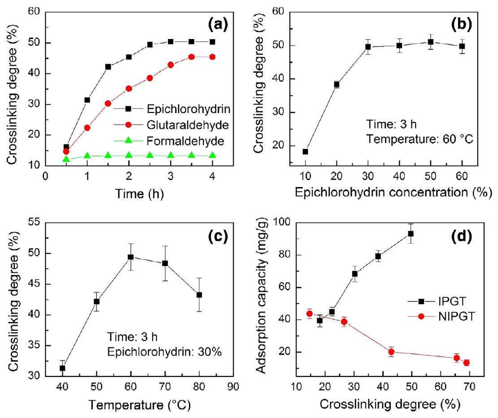

## FIGURE 5 SEM images of (a) PP, (b) PG,

(a)

(c) PGT, and (d) IPGT fibers (c) PGT, and (d) IPGT fibers
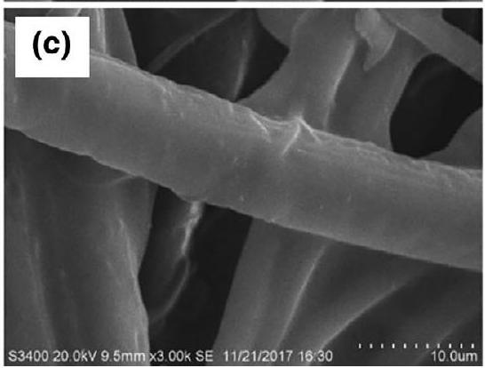

(TSC-aminated GT fibers) is slightly rough (Figure 5c), that of the IPGT fibers (imprinted PGT fibers) is very rough and uneven, and appears to be highly porous (Figure 5d).

As shown in Figure 6, the FT-IR spectra of PG fibers showed an absorption peak at $1724 \mathrm{~cm}^{-1}$ due to the stretching vibration of ester carbonyl group, and those at 902 and $840 \mathrm{~cm}^{-1}$ caused by the stretching vibration of epoxy group, which demonstrates that

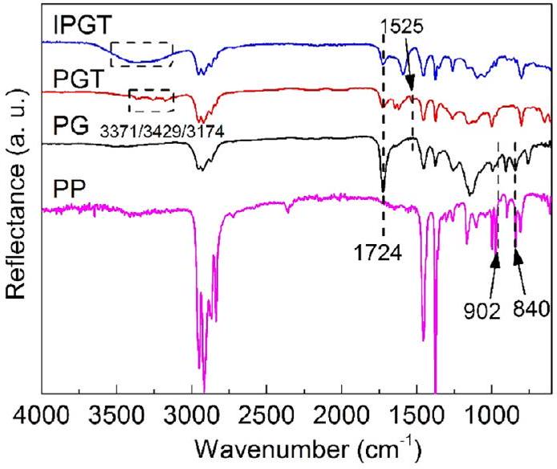
FIGURE 6 FT-IR spectra of PP, PG, PGT, and IPGT fibers [Color figure can be viewed at wileyonlinelibrary.com]

GMA was successfully grafted onto the surface of PP fibers by plasma polymerization. ${ }^{[28]}$ The FT-IR spectra of PGT fibers exhibited new absorption peaks of amino groups (introduced by TSC modification) at 3371, 3249, and $3,174 \mathrm{~cm}^{-1}$ and an absorption peak of N-C=S at $1525 \mathrm{~cm}^{-1 .}$ ${ }^{[29]}$ However, the absorption peaks of epoxy group at 902 and $840 \mathrm{~cm}^{-1}$ disappeared, indicating that the ring-opening reaction between epoxy group and thiourea groups has taken placed. ${ }^{[30]}$ The overlap of absorption peaks of -NH and -OH in the IPGT spectra was significantly wider than that in the PGT spectra, indicating that there is a higher content of -OH group in the IPGT fibers generated by the crosslinking reaction with epichlorohydrin compared to that in the PGT fibers. Overall, these SEM and FT-IR characterizations indicate the successful grafting and crosslinking of the surfaceimprinted IPGT fibers.

## 3.3 | Adsorption performance

### 3.3.1 | Influence of pH

The results depicted in Figure 7 show that the Cr(VI)adsorption capacity of IPGT increased with increasing pH from pH 1 to 3, reaching a maximum value of 138.49 mg/g at pH 3 . At pH of higher than 3, the adsorption capacity started to decrease and reached a minimum value of about $15.31 \mathrm{mg} / \mathrm{g}$ at pH 8 . These results indicate that the optimal pH for Cr(VI) adsorption is 3. At this pH (pH 3), free protons in the solution can combine with lone pair electrons of N and S atoms in the functional groups on the fiber surface, causing the atoms to become protonated and positively charged, thus can more effectively combine with Cr(VI) anion in the solution through electrostatic interactions. ${ }^{[29,31]}$ At pH values of lower than 3, the adsorption

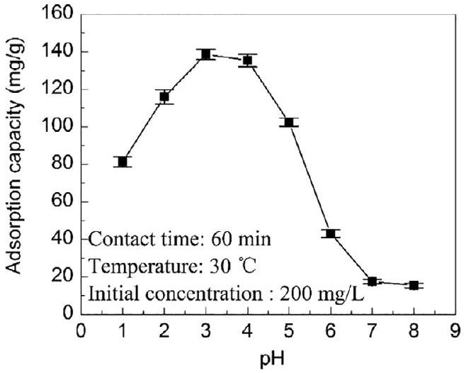
FIGURE 7 Change of Cr(VI)-adsorption capacity of IPGT fibers as a function of solution pH

capacity of the fibers was slightly lower, which may be due to that $\mathrm{HCrO}_{4}$ - can partly be converted to non-ionic $\mathrm{H}_{2} \mathrm{CrO}_{4}$ under strong acid conditions, thus cannot be easily combined with the protonated amine group. ${ }^{[32]}$ At pH values of higher than 3, the number of protons in the solution decreases, thus causing the number of protonated amine groups on the fiber surface to reduce; as a result, the Cr(VI)-adsorption capacity of the fibers decreased. In addition, the preparation of IPGT by the Cr(VI)-imprinting process was conducted at pH 3, at which Cr(VI) has fixed charge and ion radius, thus can be selectively recognized by the formed imprinted sites. Therefore, the adsorption capacity was higher at pH 3 . ${ }^{[21]}$

### 3.3.2 | Adsorption kinetics

As depicted in Figure 8, the Cr(VI)-adsorption rate of IPGT was very high within the first 20 min, reaching an equilibrium at 40 min, but was lower thereafter. It appears that the functional groups may be distributed on the fiber surface, thereby shorten the mass transfer distance between the Cr(VI) and the functional groups, thus causing the adsorption rate to be high and the equilibrium to be reached within a short period of time. ${ }^{[33]}$

The Cr(VI)-adsorption curve of IPGT fibers was fitted with the pseudo-first-order (Equation 6) and pseudosecond-order (Equation 7) dynamic models ${ }^{[21]}$ :

$$
\begin{gather*}
\ln \left(q_{e}-q_{t}\right)=\ln \mathrm{q}_{\mathrm{e}}-\mathrm{k}_{1} \mathrm{t}  \tag{6}\\
\frac{t}{q_{t}}=\frac{1}{k_{2} q_{e}^{2}}+\frac{t}{q_{e}} \tag{7}
\end{gather*}
$$

where $q_{\mathrm{t}}(\mathrm{mg} / \mathrm{g})$ is the adsorption capacity at time $t(\mathrm{~min})$, $q_{\mathrm{e}}(\mathrm{mg} / \mathrm{g})$ is the equilibrium adsorption capacity, and $k_{1}$ $\left(\mathrm{min}^{-1}\right)$ and $k_{2}\left(\mathrm{~g}\left[\mathrm{mg}^{-1} \cdot \mathrm{~min}^{-1}\right]\right)$ are the adsorption rate

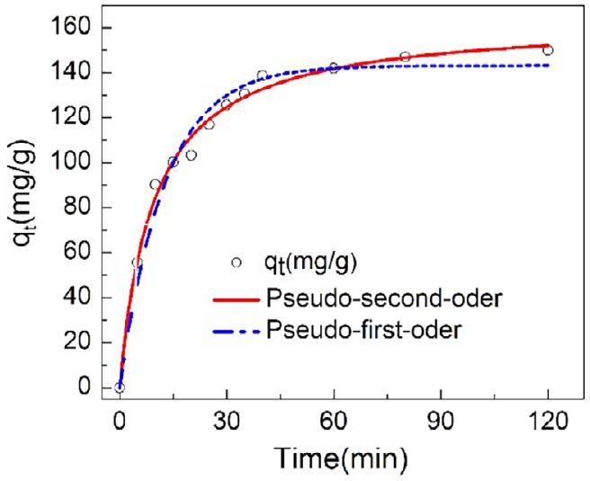
FIGURE 8 Cr(VI)-adsorption kinetics of IPGT ([Cr $(\mathrm{VI})]=200 \mathrm{mg} / \mathrm{L}, \mathrm{pH}=3$ ) [Color figure can be viewed at wileyonlinelibrary.com]

TABLE 3 Cr(VI)-adsorption kinetic parameters of IPGT obtained by model fitting
|  | $\boldsymbol{q}_{\boldsymbol{e}} \boldsymbol{(} \mathbf{m g} \boldsymbol{/} \mathbf{g} \boldsymbol{)}$ | $K$ | $\boldsymbol{R}^{\mathbf{2}}$ |
| :--- | :--- | :--- | :--- |
| Pseudo-first-order | 110.35 | 0.07975 | 0.8956 |
| Pseudo-second-order | 143.10 | $6.49 \times 10^{-4}$ | 0.9922 |

constants for the pseudo-first-order and pseudo-secondorder kinetic equations, respectively.

The kinetic parameters obtained from the fitting are shown in Table 3. According to the data, the correlation coefficient of the pseudo-second-order dynamic model $\left(R^{2}=0.9922\right)$ was significantly greater than that of the pseudo-first-order dynamic model $\left(R^{2}=0.8956\right)$. In addition, the curve fitted by the pseudo-second-order dynamic model gave the saturated adsorption capacity of $143.10 \mathrm{mg} / \mathrm{g}$, which is closer to the experimental value ( $138.51 \mathrm{mg} / \mathrm{g}$ ) than that of the pseudo-first-order fitting (110.35 mg/g). These results indicate that the Cr(VI)adsorption process of IPGT fibers is in accordance with the pseudo-second-order model, indicating that it is a chemical adsorption.

### 3.3.3 | Adsorption isotherms

Equilibrium Cr(VI)-adsorption capacity of IPGT fibers at different initial $\mathrm{Cr}(\mathrm{VI})$ concentrations is shown in Figure 9. The adsorption capacity of IPGT fibers increased (from 116.93 to 173.36 mg/g) with increasing initial Cr(VI) concentration. The Cr(VI)-adsorption isotherm of IPGT was fitted with the Langmuir (Equations (8) and (9)) and Freundlich (Equation [10]) isotherm models ${ }^{[34]}$ :

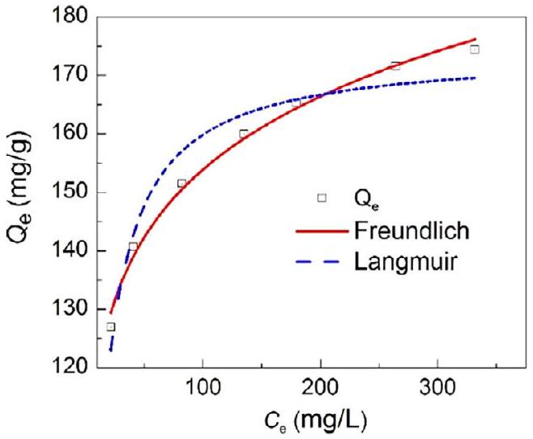
FIGURE 9 Measured and fitted Cr(VI)-adsorption isotherms of IPGT [Color figure can be viewed at wileyonlinelibrary.com]

$$
\begin{align*}
& \text { Langmuir: } \frac{C_{e}}{Q_{e}}=\frac{C_{e}}{Q_{m}}+\frac{1}{K_{L} Q_{m}}  \tag{8}\\
& \qquad R_{L}=\frac{1}{1+K_{\mathrm{L}} C_{0}}  \tag{9}\\
& \text { Freundlich: } \ln Q_{e}=\ln K_{\mathrm{F}}+\frac{1}{n} \ln C_{e} \tag{10}
\end{align*}
$$

where $C_{\mathrm{e}}(\mathrm{mg} / \mathrm{L})$ is the equilibrium concentration, $Q_{\mathrm{e}}$ $(\mathrm{mg} / \mathrm{g})$ is the equilibrium adsorption capacity, $q_{m}(\mathrm{mg} / \mathrm{g})$ is the saturated adsorption capacity, and $K_{\mathrm{F}}$ and $K_{\mathrm{L}}$ are the characteristic constants of the Langmuir and the Freundlich models, respectively. The fitting of the two isotherm models with the Cr(VI)-adsorption isotherm of IPGT is illustrated in Figure 9b, and the isotherm constants and the correlation coefficient $R^{2}$ are listed in Table 4. The $R^{2}$ value of the Langmuir isotherm was 0.9362, which is lower than that of the Freundlich isotherm (0.9915), indicating that the Freundlich isotherm model can better describe the Cr(VI)-adsorption isotherm of IPGT. This also suggests that the Cr(VI)-adsorption of IPGT fibers is a multilayer adsorption; thus, the adsorption energies of different areas are different. The $n$ values obtained from the Freundlich isotherm equation were between 2 and 10, indicating that the adsorption of Cr(VI) by the fibers is favorable. ${ }^{[20]}$

### 3.3.4 | Possible adsorption mechanism

To explore the Cr(VI)-adsorption mechanism of IPGT fibers, FT-IR spectra of the fibers before and after adsorption were recorded. The results illustrated in Figure 10 show that after adsorption, the absorption peak of $-\mathrm{C}=\mathrm{S}$ at $1263 \mathrm{~cm}^{-1}$ disappeared, whereas the absorption peak at $1375 \mathrm{~cm}^{-1}$ was significantly weakened, indicating that

TABLE 4 Cr(VI)-adsorption parameters of IPGT obtained from different isotherm models
| Langmuir |  |  |  | Freundlich |  |  |
| :--- | :--- | :--- | :--- | :--- | :--- | :--- |
| $\boldsymbol{Q}_{\mathbf{m}} \boldsymbol{(} \mathbf{m g} \boldsymbol{/} \mathbf{g} \boldsymbol{)}$ | $\boldsymbol{K}_{\mathbf{L}}$ | $\boldsymbol{R}_{\mathbf{L}}$ | $\boldsymbol{R}^{\mathbf{2}}$ | $\boldsymbol{n}$ | $\boldsymbol{K}_{\mathbf{F}}$ | $\boldsymbol{R}^{\mathbf{2}}$ |
| 174.13 | 0.1120 | 0.019 | 0.9362 | 8.87 | 91.61 | 0.9915 |

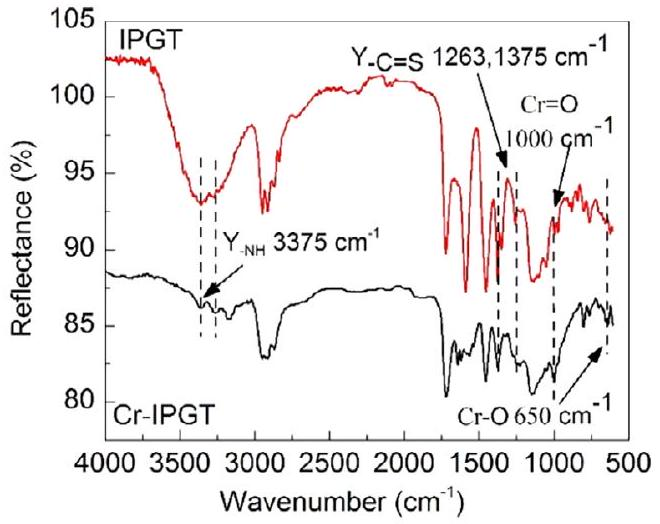
FIGURE 10 FT-IR spectra of IPGT fibers before and after Cr(VI) adsorption [Color figure can be viewed at wileyonlinelibrary.com]

-C=S, which may be formed by coordination bonds between Cr and S atoms, is involved in the adsorption process. In addition, the absorption peak of amine group $(-\mathrm{NH})$ at around $3,375 \mathrm{~cm}^{-1}$ had significantly decreased intensity and was shifted by about $60 \mathrm{~cm}^{-1}$ to a lower frequency, which is possibly due to the reaction between $\mathrm{HCrO}_{4}{ }^{-}$and N atoms in the amine group. ${ }^{[33]}$ The FT-IR spectra of Cr-IPGT fibers also exhibited two characteristic absorption peaks of Cr-O and $\mathrm{Cr}=\mathrm{O}$ near 650 and $1,000 \mathrm{~cm}^{-1}$, respectively. These FT-IR spectra demonstrate that Cr(VI) was successfully adsorbed onto the IPGT fibers, and the amino group $\left(-\mathrm{NH}_{2}\right)$ and $-\mathrm{C}=\mathrm{S}$ bonds in the fibers participate in the Cr(VI)-adsorption process.

### 3.3.5 | Adsorption selectivity

To evaluate the adsorption selectivity, the Cr(VI)adsorption rates of the three types of fibers (PGT, IPGT, and NIPGT) were determined in the presence of three competitive ions, including $\mathrm{SO}_{4}{ }^{2-}, \mathrm{NO}_{3}{ }^{-}$and $\mathrm{PO}_{4}{ }^{3-}$, which have similar morphology and can coexist with Cr(VI) in wastewater. The results in Figure 11 show that with increasing concentration of competitive ions, the Cr(VI)-adsorption capacity of all fibers decreased, indicating that the competitive ions can adsorb competitively with Cr(VI) onto the fibers. The Cr(VI)-adsorption rate in the presence of the three competitive ions can be ranked

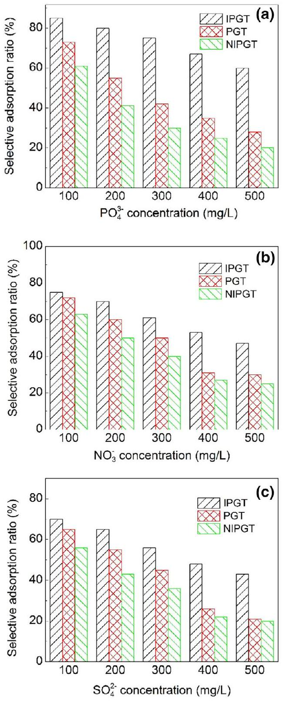
FIGURE 11 Cr(VI)-adsorption rate of IPGT, PGT, and NIPGT in the presence of (a) $\mathrm{PO}_{4}{ }^{3-}$, (b) $\mathrm{NO}_{3}{ }^{-}$, and (c) $\mathrm{SO}_{4}{ }^{2-}$ at various concentration. ([Cr(VI)] = 100 mg/L) [Color figure can be viewed at wileyonlinelibrary.com]

as follows: $\mathrm{SO}_{4}{ }^{2-}>\mathrm{NO}_{3}{ }^{-}>\mathrm{PO}_{4}{ }^{3-}$. The Cr(VI)-adsorption rate of IPGT fibers remained above 45\% in the presence of competitive ions at a concentration of five times higher than that of Cr(VI). With increasing concentration of

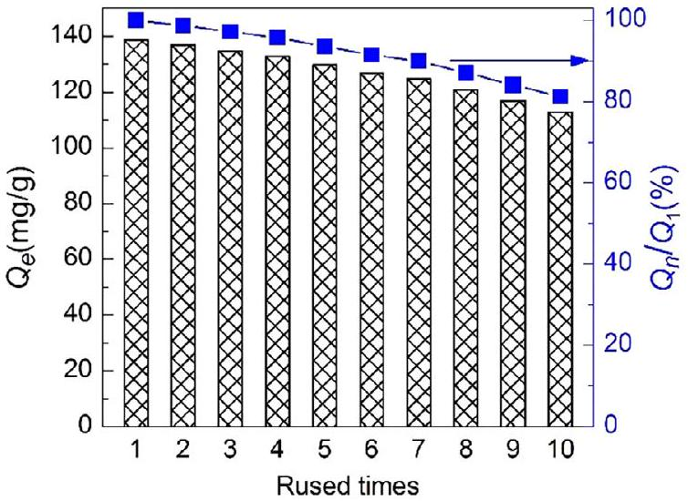
FIGURE 12 Variations of Cr(VI)-adsorption capacity of IPGT after 10 reuse cycles [Color figure can be viewed at wileyonlinelibrary.com]

competitive ions, the Cr(VI)-absorption of PGT and NIPGT fibers decreased significantly, indicating that these fibers have low selectivity toward Cr(VI). This finding indicates that the IPGT fibers have high selectivity toward Cr(VI).

### 3.3.6 | Reusability

An adsorbent is considered economical when it can be reused or recycled; thus, we evaluated the reusability in adsorption and desorption processes of the developed fibers. The Cr(VI)-adsorbed fibers were oscillated in 10 mL of $\mathrm{NaOH}(0.5 \mathrm{~mol} / \mathrm{L})$ for 30 min to elute $\mathrm{Cr}(\mathrm{VI})$, and the concentration of Cr(VI) in the eluted solution was determined. The change of Cr(VI)-adsorption capacity of IPGT with the reuse cycles is presented in Figure 12. After 10 reuse cycles, the adsorption capacity of IPGT remained high at $112.64 \mathrm{mg} / \mathrm{g}$, which is a decrease by only 18.68\%. This suggests that IPGT has high chemical stability and can be regenerated and reused.

### 3.3.7 | Enrichment ability

Cr(VI) has been listed as an index for wastewater control in China; its discharge concentration should not be higher than 0.5 mg/L. Thus, in this experiment, Cr(VI) concentration of 0.5 mg/L was used. IPGT fibers were added to Cr(VI) solution (0.5 mg/L) with various initial volumes (100, 200, 300, 500, and 1,000 mL). After sonication for 40 min, Cr(VI) was eluted five times from IPGT fibers using 10 mL of NaOH (0.5 mol/L) each. The eluted solution was collected, and its Cr(VI) concentration was determined and used to calculate the Cr(VI) recovery rate. According to the results, the recovery rate of Cr(VI) at all volumes was higher than 93.7\%, indicating that the IPGT fibers have a good enrichment ability, thus is suitable for use in separating and enriching Cr(VI) in actual wastewater.

## 4 | CONCLUSIONS

PP-based Cr(VI)-imprinted fibers (IPGT) were developed via plasma polymerization-assisted GMA grafting. Analysis of the fibers showed that the influence of four factors on the GMA grafting degree can be ranked in the following order: monomer flow rate > discharge power > treatment time > pulse duty cycle. The optimal process conditions were as follows: discharge power, 69 W; treatment time, 54 min; monomer flow rate, 38 sccm; and pulse duty cycle, 85\%; at these conditions, the grafting degree of 32\% was obtained. The best amination reaction was achieved at 90°C for 3 hr in $\mathrm{DMF} / \mathrm{H}_{2} \mathrm{O}$ (volume ratio = 4:1) solvent. The highest crosslinking degree was obtained when epichlorohydrin (30\%) was used at 60 °C for 3 hr. Furthermore, the Cr(VI)-adsorption of the developed imprinted fibers follows the pseudo-second-order kinetic model and the Freundlich isotherm, indicating that it is controlled by chemical adsorption and has multilayer adsorption mechanism. FT-IR characterization showed that Cr(VI) was successfully adsorbed through amino groups (-NH) and $-\mathrm{C}=\mathrm{S}$ bonds onto the fiber surface. The imprinted fibers had high adsorption selectivity and could maintain its adsorption capacity by 81.32\% after 10 reuse cycles. Preliminary enrichment experiments showed that the recovery rate of Cr(VI) at a concentration of 0.5 mg/L was 93.7\%, which is considered high and shows that the developed fibers is suitable for the treatment of actual Cr(VI) wastewater.

## ACKNOWLEDGMENTS

This work was financially supported by National Natural Science Foundation of China (Grant Number 21676144).

## ORCID

Wuji Wei ${ }^{\text {® }}$ https://orcid.org/0000-0001-6828-6111

## REFERENCES

[1] Z. Luo, H. Chen, J. Xu, M. Guo, Z. Lian, W. Wei, B. Zhang, J. Appl. Polym. Sci. 2018, 135, 46171.
[2] M. Guo, H. Liang, Z. Luo, Q. Chen, W. Wei, Fiber. Polym. 2016, 17, 257.
[3] Y. Zhu, J. Wei, H. Zhang, K. Liu, Z. Kong, Y. Dong, G. Jin, J. Tian, Z. Qin, Chem. Eng. J. 2018, 352, 53.
[4] K. Stakne, M. S. Smole, K. S. Kleinschek, A. Jaroschuk, V. Ribitsch, J. Mater. Sci. 2003, 38, 2167.
[5] H. Chen, M. Guo, X. Yao, Z. Luo, K. Dong, Z. Lian, W. Wei, Fiber. Polym. 2018, 19, 722.

[6] M. Guo, H. Chen, Z. Luo, Z. Lian, W. Wei, Fiber. Polym. 2017, 18, 1459.
[7] P. Akkaş Kavaklı, C. Kavaklı, N. Seko, M. Tamada, O. Güven, Radiat. Phys. Chem. 2016, 127, 13.
[8] R. Tao, Q. Pang, T. Xu, L. Xu, X. Yang, X. Zhu, J. Appl. Polym. Sci. 2020, 137, 48300.
[9] T. Li, S. Chen, H. Li, Q. Li, L. Wu, Langmuir. 2011, 27, 6753.
[10] L. Zhang, S. Yang, J. Qian, D. Hua, Ind. Eng. Chem. Res. 2017, 56, 1860.
[11] F. Bally-Le Gall, A. Mokhter, S. Lakard, S. Wolak, P. Kunemann, P. Fioux, A. Airoudj, S. El Yakhlifi, C. Magnenet, B. Lakard, Plasma Process. Polym. 2019, 16, 1800134.
[12] H. Tokuyama, S. Naohara, M. Fujioka, S. Sakohara, Reactive Funct. Polym. 2008, 68, 182.
[13] W. Lin, Y. Hsieh, J. Polym. Sci. Part A: Polym. Chem. 1997, 35, 631.
[14] P. Pleskunov, D. Nikitin, R. Tafiichuk, A. Shelemin, J. Hanuš, I. Khalakhan, A. Choukourov, J. Phys. Chem. B. 2018, 122, 8b.
[15] M. Gueye, T. Gries, C. Noël, S. Migot-Choux, S. Bulou, E. Lecoq, P. Choquet, K. Kutasi, T. Belmonte, Plasma Chem. Plasma P. 2016, 36, 1031.
[16] P. Sara, M. H. Reza, A. Farzaneh, Plasma Process. Polym. 2018, 15, 1800016.
[17] R. Yan, D. Luo, C. Fu, Y. Wang, H. Zhang, P. Wu, W. Jiang, Sep. Purif. Technol. 2020, 234, 116130.
[18] B. Ou, J. Wang, Y. Wu, S. Zhao, Z. Wang, Chem. Eng. J. 2020, 380, 122600.
[19] M. Hassanzadeh, M. Ghaemy, S. M. Amininasab, Z. Shami, Reactive Funct Polym. 2018, 130, 70.
[20] R. Huang, X. Ma, X. Li, L. Guo, X. Xie, M. Zhang, J. Li, J. Colloid, Interf. Sci. 2018, 514, 544.
[21] Z. Luo, J. Xu, D. Zhu, D. Wang, J. Xu, H. Jiang, W. Geng, W. Wei, Z. Lian, Polymers-Basel. 2019, 11, 1508.
[22] Y. Wang, Q. Dang, C. Liu, D. Yu, X. Pu, Q. Wang, H. Gao, B. Zhang, D. Cha, ACS Appl. Mater. Inter. 2018, 10, 40302.
[23] Y. Zhou, X. Hu, M. Zhang, X. Zhuo, J. Niu, Ind. Eng. Chem. Res. 2013, 52, 876.
[24] D. Cowieson, E. Piletska, E. Moczko, S. Piletsky, Anal. Bioanal. Chem. 2013, 405, 6489.
[25] K. H. Kale, S. S. Palaskar, J. Appl. Polym. Sci. 2012, 125, 3996.
[26] Y. Lin, T. Tsai, P. Chen, M. Liao, Y. Lai, Thin Solid Films. 2018, 651, 56.
[27] F. Moix, K. McKay, J. L. Walsh, J. W. Bradley, Plasma Process. Polym. 2016, 13, 236.
[28] O. M. Jazani, H. Rastin, K. Formela, A. Hejna, M. Shahbazi, B. Farkiani, M. R. Saeb, Polym. Bull. 2017, 74, 4483.
[29] S. Bhattarai, J. S. Kim, Y. Yun, Y. Lee, Macromol. Res. 2019, 27, 515.
[30] S. Deng, P. Wang, G. Zhang, Y. Dou, J. Hazard. Mater. 2016, 307, 64.
[31] M. K. Kim, K. Shanmuga Sundaram, G. Anantha Iyengar, K. Lee, Chem. Eng. J. 2015, 267, 51.
[32] W. Cai, F. Zhu, H. Liang, Y. Jiang, W. Tu, Z. Cai, J. Wu, J. Zhou, Chem Eng Res Des. 2019, 144, 150.
[33] C. Kavaklı, M. Barsbay, S. Tilki, O. Güven, P. A. Kavaklı, Water Air Soil Pollut. 2016, 227, 473.
[34] L. Fang, X. Min, R. Kang, H. Yu, S. G. Pavlostathis, X. Luo, Sci. Total Environ. 2018, 639, 110.

## SUPPORTING INFORMATION

Additional supporting information may be found online in the Supporting Information section at the end of this article.

How to cite this article: Luo Z, Xu Y, Chen H, et al. Preparation of Cr(VI)-imprinted polypropylene nonwoven fibers using plasma polymerization-assisted grafting. J Appl Polym Sci. 2020;e49317. https://doi.org/10.1002/app. 49317

