# Improved high－temperature electrical properties of polypropylene insulation material by grafting styrene 

Xinhua Dong ${ }^{1}$ ①｜Qing Shao ${ }^{2}$｜Yuanbo Cai ${ }^{2}$｜Qi Zhang ${ }^{2}$｜Wenjia Zhang ${ }^{1}$｜ Shixun $\mathbf{H u}^{\mathbf{3}} \boldsymbol{(} \boldsymbol{\circ}$｜Shangshi Huang ${ }^{\mathbf{3}}$｜Wei Wang ${ }^{\mathbf{1}}$｜Qi Li ${ }^{\mathbf{3}}$｜Jinliang $\mathbf{H e}^{\mathbf{3}}$

${ }^{1}$ State Key Laboratory of Alternate Electrical Power System with Renewable Energy Sources，North China Electric Power University，Beijing，China
${ }^{2}$ SINOPEC（Beijing）Research Institute of Chemical Industry Co．，Ltd．，Beijing，China
${ }^{3}$ State Key Laboratory of Power System，Department of Electrical Engineering，Tsinghua University， Beijing，China

Correspondence
Xinhua Dong and Jinliang He． Email：dongxinhuacn＠163．com and hej1＠tsinghua．edu．cn

Associate Editor：Jianying Li

Funding information
National Natural Science Foundation of China， Grant／Award Numbers：52237001， 51921005

#### Abstract

The electrical properties of polypropylene（PP）insulation material decrease dramatically at high temperature，which limits its application in harsh environments．This study in－ vestigates how grafting styrene（St）improves the high－temperature electrical properties of PP．Compared with pure PP，the space charge of the St－grafted PP（PP－g－St）samples is suppressed，the volume resistivity is significantly improved，and the breakdown strength at room temperature（30°C）and high temperature（90 and 110°C）is increased by 35．04％， 36．98％and 34．86％，respectively．The results show that the side chains generated by grafted St can increase the number of spherulites and improve the crystallinity，making the boundaries of the spherulites tortuous and narrow，which is not conducive to the formation of low－density regions．At the same time，because of the entanglement of grafted side chains and the presence of deep traps inside the PP－g－St samples，which inhibit the injection and migration of carriers，the effect of high temperature on the free volume is weakened．Consequently，the ability to capture charges at high temperature is enhanced，leading to an improvement in the high－temperature electrical properties of PP． This research can provide a reference for the development of high－performance grafted PP insulation materials．

## 1 ｜INTRODUCTION

In recent years，thermoplastic polyolefins have received sig－ nificant attention owing to their excellent processing perfor－ mance and recyclability．They have been extensively employed in electrical equipment such as cables and capacitors［1－4］． Among them，polypropylene（PP），as a thermoplastic insu－ lation material，without cross－linking treatment，has excellent insulation performance and has become an important devel－ opment direction for recyclable insulation materials in the future［5－7］．

However，during the normal operation of the equipment， the insulation material experiences a higher temperature owing to Joule heating and the loss of insulation［8］．The aggregation structure and molecular chain structures of PP are the major factors affecting its thermal resistance［9］． Firstly，increasing temperature reduces the injection barrier and increases the mobility of carriers．This results in an in－ crease in leakage current and a decrease in breakdown strength［10－12］．Also，the displacement of the molecular chain increases and the relaxation time of the chain segments shortens with increasing temperature．This results in free volume enlargement and formation of broken chains，result－ ing in conductive paths and a reduction in the breakdown strength［13］．

Space charge characteristics of insulation for high voltage direct current（HVDC）equipment have always been a key concern for scholars．This is mainly because polymer materials are more prone to accumulating space charges under a DC electric field with constant polarity［14，15］．Space charge accumulation can distort the electric field distribution inside the insulation and produce enhanced electric field regions， which in turn may induce partial discharges，electric trees and even the failure of insulation［16－18］．Currently，many

[^0]researchers have conducted extensive studies on enhancing the electrical properties of PP insulation materials. Common modification and enhancement methods include nano-doping [10, 19, 20], organic small molecule compounds [21], grafting modification [22-25] and so forth. Research has shown that appropriate nano-doping and organic small molecule compounds are beneficial for improving the electrical properties of PP. However, the agglomeration of nanoparticles and the dissociation and migration of organic small molecules may seriously deteriorate the electrical performance of PP. These issues have always been a bottleneck restricting the large-scale production of composites [21]. Du et al. reported that the homocharge injected into the pure PP by both electrodes increased obviously at 90°C, leading to a remarkable accumulation of space charge inside the sample [10]. Dang et al. reported that PP/ZnO nano modified composites exhibit space charge accumulation at 70°C, but less than pure PP [12]. These studies suggest that PP may exhibit more severe space charge accumulation at high temperatures, which in turn may adversely affect equipment insulation.

Grafting modification can impart a variety of excellent properties to materials by grafting special monomers onto polymer molecular chains [3]. It has been shown that proper grafting modification can bring in massive deep traps in PP and significantly reduce the space charge accumulation in PP [16, 23]. In recent years, grafting modification has been employed to enhance the insulation performance of PP material. Researchers have shown that PP material grafted with monomers such as maleic anhydride, styrene (St), 4-acetoxystyrene and 4allyloxy-2-hydroxybenzophenone exhibits excellent electrical properties such as volume resistivity [22-25]. Because of the significant improvement of electrical properties, while avoiding issues such as agglomeration of nanoparticles and migration or even migration of organic small molecules, graft-modified PP materials have significant application opportunities in the insulation of high voltage (HV) equipment and have become part of the current research hotspots. However, existing studies mainly concern the space charge characteristics of grafted PP materials at room temperature. Therefore, further exploration of the electrical properties of grafted PP under high temperatures is important for the exploration of efficient grafted PP insulation.

Considering that St is a common grafting monomer for polyolefin materials, it offers the benefits of low cost and easy grafting. For this reason, we prepared graft-modified PP samples using St as the grafting monomer. We then studied the electrical properties of these samples. Compared with pure PP, St-grafted PP (PP-g-St) samples have higher crystallinity and structural stability due to the presence of grafted side chains. Meanwhile, the PP-g-St samples exhibited good space charge inhibition effects because of the introduction of deep traps by the grafting St monomers. The electrical properties of PP-g-St samples are superior to pure PP at 30 and 90°C. This method has broad application prospects in high performance PP insulation equipment.

## 2 | EXPERIMENT

## 2.1 | Sample preparation

At present, the commonly used grafting modification methods for polyolefin materials include solution grafting, melt grafting, radiation grafting, solid-phase grafting and aqueous-phase suspension grafting. Among these methods, aqueous-phase suspension grafting refers to a method of suspending polyolefin powder, grafting monomers and initiators in water for grafting reaction. This method has the advantages of uniform grafting, fewer grafting side reactions and lower cost. Therefore, this paper adopts the aqueous-phase suspension grafting method to prepare graft-modified PP samples with different grafting contents.

The grafting reaction process is shown in Figure 1. Firstly, a suitable ratio of PP powder, benzoyl peroxide and St monomers was added into the reaction vessel. Thereafter the reaction vessel was heated to 60°C for 2 h to allow the monomers and initiators to fully swell into the PP powder. Then the mechanical agitation process was conducted for 30 min with the temperature further elevated to 90°C. The appropriate amount of deionised water was added and maintained for 4 h, ensuring the grafting reaction proceeded well. St monomers grow on the free radicals of the PP molecular chain to form grafted side chains [26]. These operations were completed under the protection of a nitrogen atmosphere. To further purify the product, the grafted PP powder was extracted in ethyl acetate for 24 h to remove as much as possible of the ungrafted St monomers and their homopolymers remaining in the PP matrix. The grafting rate $\left(G_{\mathrm{R}}\right)$ and grafting efficiency $\left(G_{\mathrm{E}}\right)$ of each sample are as follows:

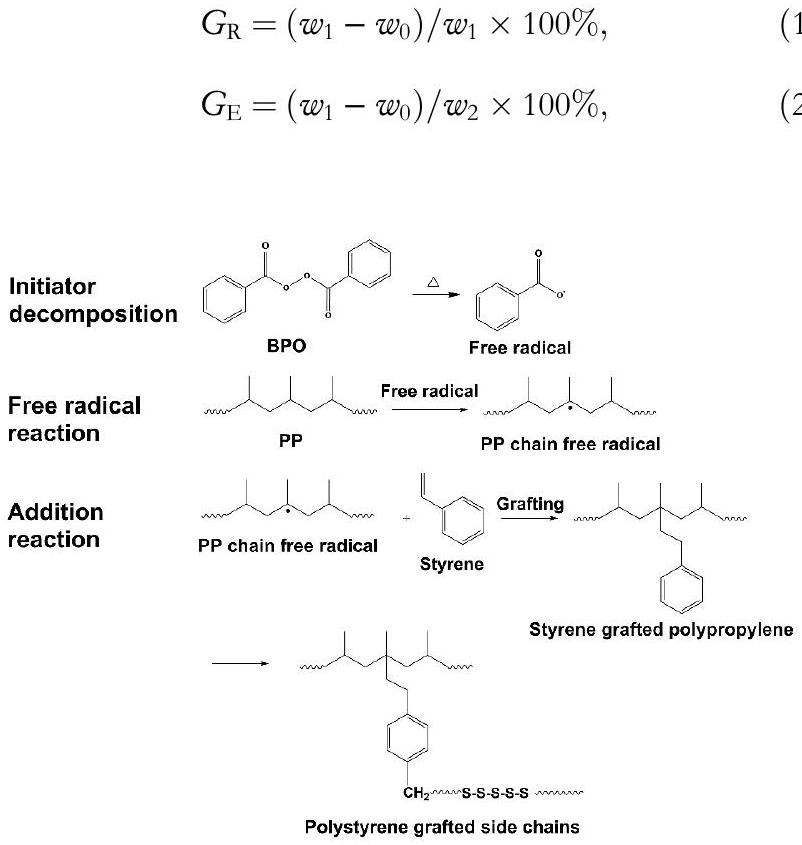
FIGURE 1 Process of grafting reaction.

where $w_{0}$ is the weight of pristine PP before grafting, $w_{1}$ is the weight of grafted PP after extraction and $w_{2}$ is the weight of monomer added before grafting. The components and grafting parameters of each sample are shown in Table 1.

The prepared pellets were hot-pressed by a plate vulcaniser at 200°C and 15 MPa for 10 min and then cooled to room temperature at 10 MPa, resulting in thicknesses of 100 and $200 \mu \mathrm{~m}$ for subsequent testing.

## 2.2 | Experimental methods

Fourier transform infrared spectroscopy (FTIR) was used to characterise the grafting effect of PP, and the measurements were performed in the range of $525-4000 \mathrm{~cm}^{-1}$ with a resolution of $6 \mathrm{~cm}^{-1}$. Gel permeation chromatography (GPC) with viscometer detector was used to characterise the molecular weight distribution. The crystal structure of the samples were characterised by x-ray diffraction (XRD) with the diffracted angle ( $2 \theta$ ) in the range of 5°-50° and the scanning rate of $3^{\circ} / \mathrm{min}$. The melting temperature, crystallisation temperature and crystallinity of the sample can be analysed by differential scanning calorimeter (DSC). The test temperature was 30-200°C, the heating and cooling rate is 10°C/min and the flow rate of nitrogen is $50 \mathrm{~mL} / \mathrm{min}$. Polarising microscope (POM) was employed to observe the spherulites morphology of the samples.

The space charge of the samples was tested by pulse electro-acoustic method with a thickness of $200 \mu \mathrm{~m}$. The test temperatures were 30, 90 and 110°C, and the test electric field strength was maintained at 30 kV/mm for 40 min. The electrical conduction current of the samples at 30, 90 and 110°C were measured by a standard three-electrode system with a sample thickness of $100 \mu \mathrm{~m}$. The test electric field strength was 5-80 kV/mm and the boosting step was 5 kV/mm every other 30 min . The DC breakdown strength of the samples at 30, 90, and $110^{\circ} \mathrm{C}$ were tested by a ball-ball electrode. Each sample was tested 16 times and the experimental data were analysed by Weibull distribution. The entanglement characteristics of grafted side chains in the sample were characterised by a dynamic rheometer. The experimental temperature was 200°C, the constant shear strain was 3\% and the angular frequency was 0.05-100 rad/s.

The thermally stimulated depolarisation current (TSDC) spectra were measured to analyse the trap properties of samples. The samples were first sputtered with gold electrodes and

TABLE 1 Components and grafting parameters of samples.
| Sample | $\boldsymbol{W}_{\mathbf{0}} \boldsymbol{(} \mathbf{g} \boldsymbol{)}$ | $\boldsymbol{W}_{\boldsymbol{2}} \boldsymbol{(} \mathbf{g} \boldsymbol{)}$ | $\boldsymbol{W}_{\mathbf{1}} \boldsymbol{(} \mathbf{g} \boldsymbol{)}$ | $G_{\mathrm{R}}(\%)$ | $G_{\mathrm{E}}(\%)$ |
| :--- | :--- | :--- | :--- | :--- | :--- |
| Pure PP | 100.0 | 0.0 | 100.0 | 0 | - |
| PP-g-St1 | 100.0 | 2.5 | 101.8 | 1.77 | 70.0 |
| PP-g-St2 | 100.0 | 5.0 | 103.5 | 3.38 | 72.0 |
| PP-g-St3 | 100.0 | 10.0 | 107.1 | 6.63 | 71.0 |

Abbreviations: PP, polypropylene; PP-g-St, St-grafted PP. then polarised under 10 kV/mm for 30 min at 90°C, subsequently rapidly cooled down to $-40^{\circ} \mathrm{C}$ and finally heated up to 135°C at a rate of 3°C/min. The temperature and current signals during the heating up process were recorded in real time.

## 3 | RESULTS AND DISCUSSION

## 3.1 | The microstructure of PP-g-St

The crystal structure, crystallinity and spherulite sizes can reflect the influence of introducing grafting groups on the aggregation structure of PP. These characteristics have significant impact on the dielectric performance of polymers.

Figure 2 shows the FTIR spectra of pure PP and PP-g-St samples. All samples show characteristic peaks of PP. New absorption peaks at 698, 756 and $1601 \mathrm{~cm}^{-1}$ appear in the FTIR spectra of PP-g-St samples. The absorption peaks of 698 and $756 \mathrm{~cm}^{-1}$, correspond to the vibration of the C-H bond of monosubstituted benzene ring in grafted St, whereas the absorption peak of $1601 \mathrm{~cm}^{-1}$ corresponds to the stretching vibration of the aromatic ring backbone of St [23]. Meanwhile, the intensity of the characteristic peaks was proportional to the amount of grafting, indicating that St has been successfully grafted.

As shown in Figure 3, the molecular weight $(M)$ distribution of each sample (where $\mathfrak{w}$ represents its weight) was obtained by GPC [27]. According to the molecular weight distribution curves, the number-average molecular weight $\left(M_{\mathrm{n}}\right)$ and the weight-average molecular weight ( $M_{\mathrm{w}}$ ) of each sample can be obtained by the following formula, and the results are as shown in Table 2.

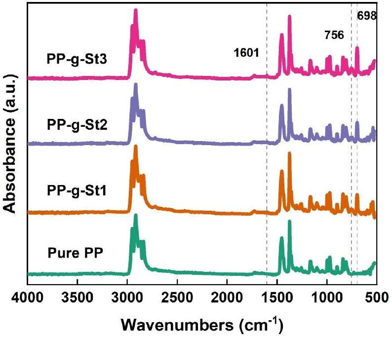
FIGURE 2 FTIR spectra of pure PP and PP-g-St samples. FTIR, Fourier transform infrared spectroscopy; PP, polypropylene; PP-g-St, Stgrafted PP.

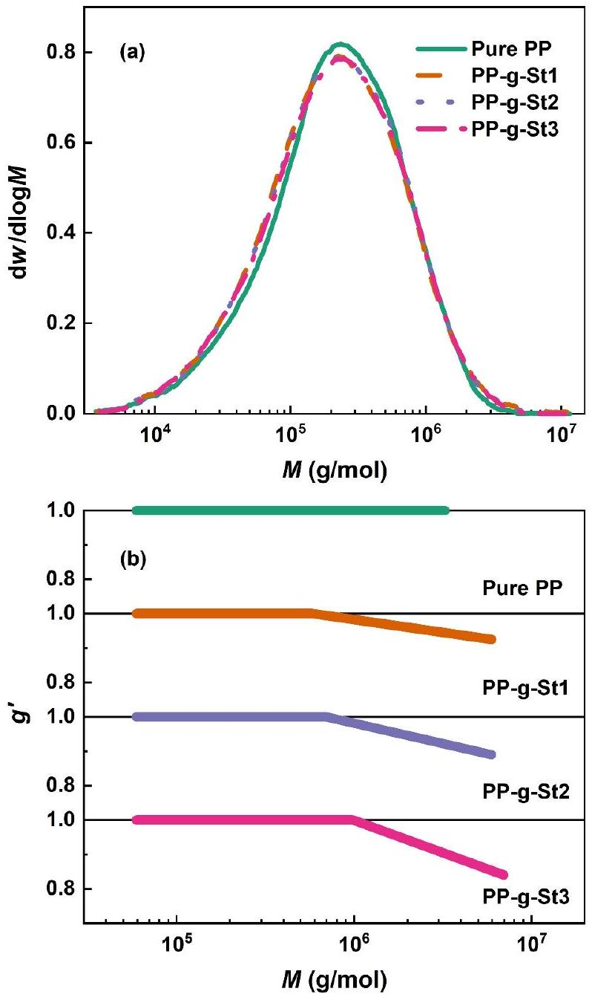
FIGURE 3 The GPC characterisation of pure PP and PP-g-St samples. (a) GPC curves and (b) branching index $\left(g^{\prime}\right)$ diagram. GPC, gel permeation chromatography; PP, polypropylene; PP-g-St, St-grafted PP.

TABLE 2 GPC parameters of pure PP and PP-g-St samples.
| Sample | $\boldsymbol{M}_{\mathbf{n}}$ | $\boldsymbol{M}_{\mathbf{w}}$ | Polydispersity index | $g_{\text {min }}^{\prime}$ |
| :--- | :--- | :--- | :--- | :--- |
| Pure PP | 107,313 | 378,632 | 3.53 | - |
| PP-g-St1 | 99,680 | 400,729 | 4.02 | 0.93 |
| PP-g-St2 | 98,700 | 407,562 | 4.13 | 0.89 |
| PP-g-St3 | 98,451 | 410,130 | 4.17 | 0.84 |

Abbreviations: GPC, gel permeation chromatography; PP, polypropylene; PP-g-St, St-grafted PP.

$$
\begin{gather*}
M_{\mathrm{n}}=\sum_{i}\left(n_{i} M_{i}\right) / \sum_{i} n_{i},  \tag{3}\\
M_{\mathrm{w}}=\sum_{i}\left(n_{i} M_{i}^{2}\right) / \sum_{i}\left(n_{i} M_{i}\right), \tag{4}
\end{gather*}
$$

where $n_{i}$ is the number of moles of the molecule $i$, and $M_{i}$ is the molecular weight of the molecule $i$.

The molecular weight distributions of PP-g-St samples exhibit a high-molecular-weight shoulder compared with pure PP as shown in Figure 3a. Meanwhile, according to Table 2, the weight-average molecular weight of the PP-g-St samples significantly increased, whereas the number-average molecular weight decreased. This indicates that there are two significant chemical reaction processes within the grafted samples. On the one hand, St monomers were grafted onto PP molecular chains mainly in the form of long molecular chains. Consequently, this leads to a significant increase in the weightaverage molecular weight [28]. On the other hand, some St monomers undergo a self-polymerisation reaction to produce polystyrene (PS), leading to a decrease in the number-average molecular weight. The branching factor $g^{\prime}$ characterises the existence of grafted side chains in the sample as shown in Figure 3b, and $g_{\min }^{\prime}$ is the minimum value of $g^{\prime}$. The branching factor can be obtained by the Equation provided by Li et al. [29]:

$$
\begin{equation*}
g^{\prime}=\frac{[\eta]_{\mathrm{B}}}{[\eta]_{\mathrm{L}}}, \tag{5}
\end{equation*}
$$

where $[\eta]_{\mathrm{B}}$ is the intrinsic viscosity of the PP-g-St samples and $[\eta]_{\mathrm{L}}$ is the intrinsic viscosity of pure PP with the same molecular weight as the PP-g-St samples. For linear PP, $g^{\prime}$ is 1, whereas for a branched structure, it is lower than unity, depending on the degree of branching. The values of $g_{\min }^{\prime}$ of the three PP-g-St samples are $0.93,0.89$ and 0.84 , respectively, indicating that there was a grafted side chains within molecular chains of the PP-g-St samples.

Figure 4 shows the XRD test results of pure PP and PP-g-St. In addition to the five diffraction peaks of $\alpha$-type, the (117) crystal plane of the $\gamma$-type also appears in PP-g-St samples. Grafting St does not significantly impact crystal structure of PP but a small number of $\gamma$ crystals appear due to the grafted side chains [30].

The influence of grafting St on PP crystallisation was investigated by DSC test. From Figure 5a, the crystallisation temperature $\left(T_{\mathrm{c}}\right)$ of pure PP is $116.8^{\circ} \mathrm{C}$, which increases to 119.2°C in PP-g-St1. With further increases in the St content, the crystallisation temperature of PP-g-St samples rises to 122.0°C, indicating that grafting St can accelerate the crystallisation process of PP. However, the crystallisation temperature of PP-g-St3 decreases, suggesting that higher St content is not necessary for accelerating the crystallisation process of PP. St grafted side chains play the role of heterogeneous nucleation in the crystallisation, resulting in an increase in the crystallisation temperature of PP-g-St samples [31]. Figure 5b displays the melting curves, and the melting temperatures $\left(T_{\mathrm{m}}\right)$ for all four samples are around $162^{\circ} \mathrm{C}$ with minimal variation. The crystallinity $\left(X_{\mathrm{c}}\right)$ of each sample was calculated from the melting enthalpy $\left(H_{\mathrm{m}}\right)$. Remarkably, the crystallinity of PP-g-St2 reaches 49.3\%, indicating that grafting St enhances the crystallinity. In addition, the entanglement of the grafted side chains can inhibit crystal growth, resulting in a decrease in crystallisation temperature and crystallinity. Overall, the promotion of

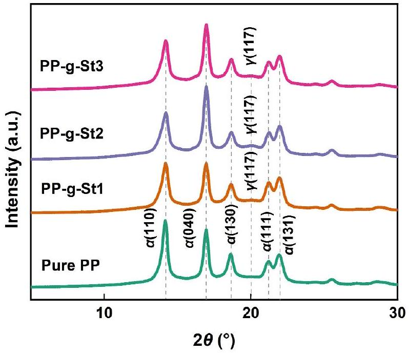
FIGURE 4 XRD patterns of pure PP and PP-g-St samples. PP, polypropylene; PP-g-St, St-grafted PP; XRD, x-ray diffraction.

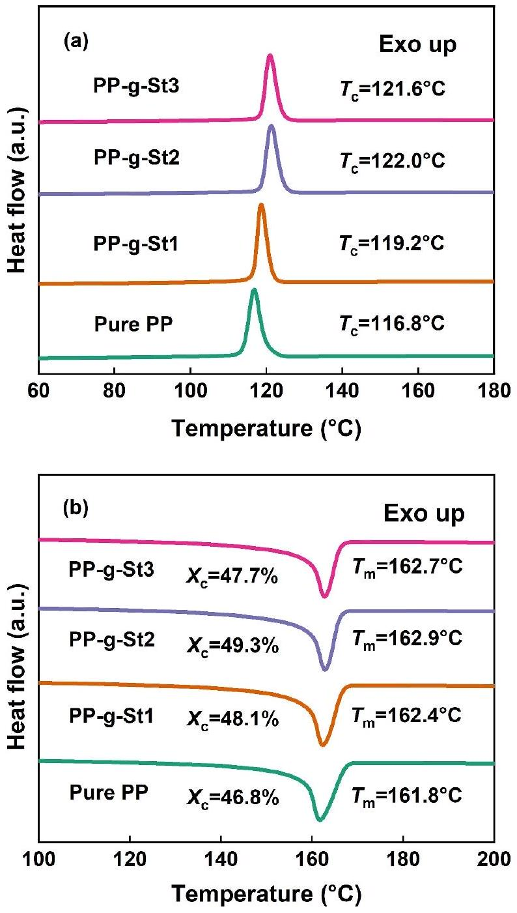
FIGURE 5 DSC temperature spectra in (a) crystallisation and (b) melting process of pure PP and PP-g-St samples. DSC, differential scanning calorimeter; PP, polypropylene; PP-g-St, St-grafted PP.

crystallisation by grafted side chains in PP-g-St samples outweighs the inhibition of crystallisation [32].

Figure 6 shows the POM images of the four samples, all of which exhibit spherical crystals. The size of the spherulites in pure PP is relatively large, with a diameter of about $80 \mu \mathrm{~m}$, and the boundaries of the spherulites are clear. During the crystallisation of PP-g-St samples, the grafted side chains act as heterogeneous nucleation. As a result, these microcrystals overlap, and their number increases with the St content. Consequently, the boundaries become blurred as the size of the spherical crystals decreases.

## 3.2 | Space charge characteristics

The generation, distribution, and transfer of charges can cause distortion of the electric field, which may induce partial discharges, electric trees and so forth, thereby affecting the insulation performance, especially under DC operation. Figure 7 displays the space charge distribution of pure PP and PP-g-St samples at 30, 90 and 110°C, respectively. In Figure 7, the horizontal coordinates represent the thickness direction of the samples, the left dashed line is for the lower electrode and the right dashed line is for the upper electrode. The vertical coordinates represent the charge density.

Figure 7a reveals a certain amount of homocharge accumulation inside the pure PP near the two electrodes, especially at the cathode. Figure 7b-d show virtually no accumulation of space charge inside the PP-g-St samples. The mean volume density of space charge can be calculated according to Montanari and Fabiani [33]:

$$
\begin{equation*}
q(t)=\frac{1}{x_{1}-x_{0}} \int_{x_{0}}^{x_{1}}|\rho(x, t)| \mathrm{d} x, \tag{6}
\end{equation*}
$$

where $q(t)$ is the mean volume density of space charge, $x_{0}$ and $x_{1}$ are the positions of the lower and upper electrodes respectively and $\rho(x, t)$ is the measured space charge density at position $x$ and the time of depolarisation $t$.

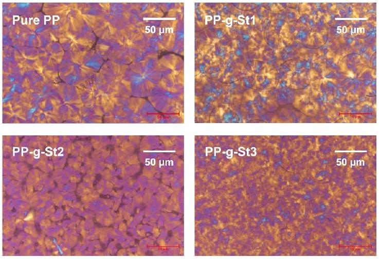
FIGURE 6 POM images of pure PP and PP-g-St samples. POM, polarising microscope; PP, polypropylene; PP-g-St, St-grafted PP.

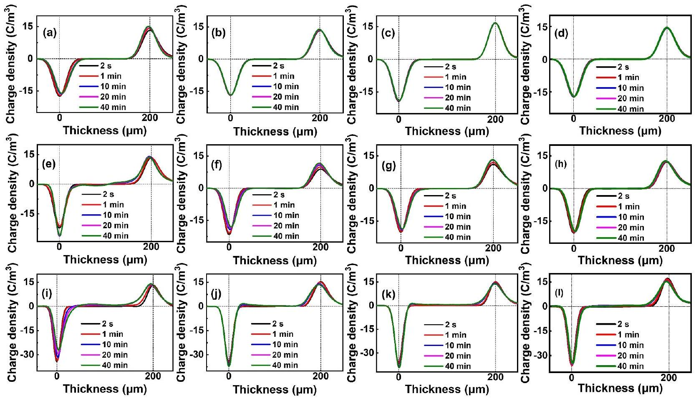
FIGURE 7 Space charge distribution of (a) pure PP, (b) PP-g-St1, (c) PP-g-St2 and (d) PP-g-St3 under 30°C. Space charge distribution of (e) Pure PP, (f) PP-g-St1, (g) PP-g-St2 and (h) PP-g-St3 under 90°C. Space charge distribution of (i) Pure PP, (j) PP-g-St1, (k) PP-g-St2 and (l) PP-g-St3 under 110°C. PP, polypropylene; PP-g-St, St-grafted PP.

After 2400 s, $q(t)$ of pure $\operatorname{PP}\left(q_{\text {PP }}(2400 \mathrm{~s})=1.271 \mathrm{C} / \mathrm{m}^{3}\right)$ is 2.56 times higher than that of PP g-St samples $\left(q_{\mathrm{St}}(2400 \mathrm{~s})=0.496 \mathrm{C} / \mathrm{m}^{3}\right)$. This indicates that grafting modification can remarkably improve the space charge suppression ability of PP at room temperature. As shown in Figure 7e-1, a significant homocharge accumulation occurred inside pure PP at 90 and 110°C, and with time, the injection amount and depth of homocharge increased sharply. The location of space charge accumulation has permeated the whole sample. For the PP-g-St samples, just a little homocharge accumulation occurs near the two electrodes. After 2400 s, $q(t)$ of pure PP $\left(q_{\mathrm{PP}}(2400 \mathrm{~s})=2.542 \mathrm{C} / \mathrm{m}^{3}\right)$ is 2.37 times higher than that of the PP-g-St samples $\left(q_{\mathrm{St}}(2400 \mathrm{~s})=1.073 \mathrm{C} / \mathrm{m}^{3}\right)$. At $110^{\circ} \mathrm{C}$, after $2400 \mathrm{~s}, q(t)$ of pure PP $\left(q_{\mathrm{PP}}(2400 \mathrm{~s})=4.525 \mathrm{C} / \mathrm{m}^{3}\right)$ is 2.14 times higher than that of the PP-g-St samples $\left(q_{\mathrm{St}}(2400 \mathrm{~s})=2.111 \mathrm{C} /\right.$ $\mathrm{m}^{3}$ ). This indicates that the PP-g-St samples still show superior space charge suppression characteristics at high temperatures. With the increase of St monomers content, the accumulation of space charge decreases, indicating that higher grafting content helps to further improve the space charge suppression ability of PP.

The space charge in the sample is mainly divided into homocharge and heterocharge. Among them, the former mainly arises from the charge injection at the electrode. Meanwhile, the heterocharge primarily originates from two sources: one is the dissociation of impurities in the sample and the other is electrons or holes injected into the electrode from the opposite side. This migration forms the heterocharge due to the interface potential barrier [15, 19, 34]. As a result of the introduction of grafted side chains, the crystallisation temperature and crystallinity of the PP are increased, enhancing the thermal and structural stability. Additionally, the reduction in spherulite size causes an enlargement of the interface between the spherulites and the amorphous regions. Consequently, the boundaries between the spherulites become more tortuous and narrow. The tortuous and narrow boundaries capture charge carriers and prolong their transport paths, significantly increasing the difficulty of carrier transport [31, 35]. Simultaneously, the homocharge accumulated on the surface of the sample can distort the electric field at the interface between the electrode and the sample. This distortion reduces the equivalent electric field for carrier injection, thus significantly inhibiting further carrier injection and homocharge accumulation.

## 3.3 | Conductivity

Figure 8 shows the relationship between the conduction current density ( $J$ ) and electric field ( $E$ ) of pure PP and PP-g-St samples in double logarithmic coordinates, and segmented fitting is performed on them. The slope $k_{1}$ of the fitted line in the lower electric field region is approximately 1 , which corresponds to the Ohmic stage. The slope $k_{2}$ of the fitted line in the higher electric field region is greater than 2, corresponding to the space charge limited current (SCLC) region [9]. This difference is mainly because of the effect of intrinsic carriers

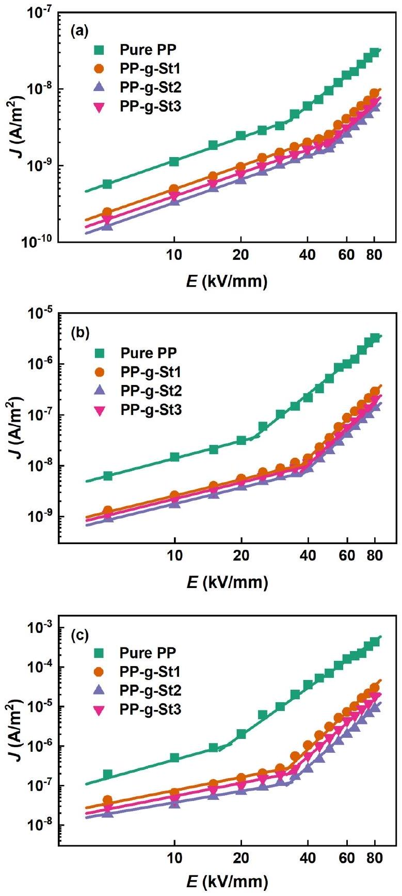
FIGURE $8 E-J$ plots of pure PP and PP-g-St samples under (a) $30^{\circ} \mathrm{C}$, (b) 90°C and (c) 110°C. PP, polypropylene; PP-g-St, St-grafted PP.

and electrode injected carriers [36, 37]. The critical electric field $\left(E_{\mathrm{c}}\right)$ at the turning point is equivalent to the transition of the conductivity mechanism from Ohm's law to SCLC.

As shown in Table 3, the critical electric fields of pure PP and PP-g-St samples at 30°C are around 33 and 50 kV/mm, respectively. This indicates that grafting modification can increase the critical electric field of PP. As shown in Table 4, the critical electric fields are around 23 and 39 kV/mm at 90°C, respectively. Meanwhile, as shown in Table 5, the critical electric fields are around 17 and 33 kV/mm at 110°C,

TABLE $3 E-J$ parameters of pure PP and PP-g-St samples at 30°C.
| Sample | Slope |  | $\boldsymbol{E}_{\mathbf{c}}(\mathbf{k V} / \mathbf{m m})$ |
| :--- | :--- | :--- | :--- |
|  | $\boldsymbol{k}_{\mathbf{1}}$ | $\boldsymbol{k}_{\mathbf{2}}$ |  |
| Pure PP | 1.04 | 2.27 | 33.02 |
| PP-g-St1 | 1.00 | 2.56 | 48.05 |
| PP-g-St2 | 1.01 | 2.46 | 50.05 |
| PP-g-St3 | 1.03 | 2.65 | 49.16 |

Abbreviations: PP, polypropylene; PP-g-St, St-grafted PP.

TABLE $4 \quad E-J$ parameters of pure PP and PP-g-St samples at 90°C.
| Sample | Slope |  | $\boldsymbol{E}_{\mathbf{c}}(\mathbf{k V} / \mathbf{m m})$ |
| :--- | :--- | :--- | :--- |
|  | $\boldsymbol{k}_{\mathbf{1}}$ | $\boldsymbol{k}_{\mathbf{2}}$ |  |
| Pure PP | 1.14 | 3.49 | 22.75 |
| PP-g-St1 | 1.06 | 4.38 | 37.42 |
| PP-g-St2 | 1.03 | 3.97 | 39.48 |
| PP-g-St3 | 1.07 | 4.17 | 38.59 |

Abbreviations: PP, polypropylene; PP-g-St, St-grafted PP.

TABLE $5 E-J$ parameters of pure PP and PP-g-St samples at $110^{\circ} \mathrm{C}$.
| Sample | Slope |  | $\boldsymbol{E}_{\mathbf{c}}(\mathbf{k V} / \mathbf{m m})$ |
| :--- | :--- | :--- | :--- |
|  | $\boldsymbol{k}_{\mathbf{1}}$ | $\boldsymbol{k}_{\mathbf{2}}$ |  |
| Pure PP | 1.54 | 3.97 | 17.07 |
| PP-g-St1 | 1.11 | 5.34 | 32.80 |
| PP-g-St2 | 1.06 | 4.94 | 33.21 |
| PP-g-St3 | 1.10 | 4.81 | 33.06 |

Abbreviations: PP, polypropylene; PP-g-St, St-grafted PP.
respectively. As the temperature increases, the critical electric fields of all four samples decrease, indicating that high temperature exacerbates the injection of space charges. However, the critical electric field of PP-g-St samples is still higher than that of pure PP.

According to Figure 8, it can be found that the DC conductivity characteristics are influenced by both the electric field and the temperature. In the presence of high electric fields, electronic conductivity dominates, and its conductivity is determined by the number and mobility of charge carriers. Conversely, at high temperatures, ions gain more energy, allowing them to overcome potential barriers and contribute significantly to ionic conductivity [31, 38]. At high temperature and high electric fields, ions have higher mobility along with higher energy, and the DC conductivity increases with increasing temperature and electric field. The introduction of grafted side chains in PP-g-St samples improves the thermal and structural stability of the materials. This improvement significantly suppresses the number and mobility of carriers, thereby restraining the increase in DC conductivity under high temperatures and high electric fields.

## 3.4 | DC breakdown strength

For HVDC equipment, space charge distribution is not the sole influencing factor. It is essential that the equipment can work under high temperatures and HV conditions, which necessitates the equipment has excellent high-temperature breakdown strength. Figure 9 shows the DC breakdown strength of pure PP and PP-g-St samples at 30, 90 and 110°C. The breakdown strength was analysed using the Weibull distribution and calculated by Zhou et al. [16]:

$$
\begin{equation*}
F\left(E_{\mathrm{b}}\right)=1-\exp \left(-\left(E_{\mathrm{b}} / E_{0}\right)^{p}\right), \tag{7}
\end{equation*}
$$

where $F\left(E_{\mathrm{b}}\right)$ is the breakdown probability, $E_{\mathrm{b}}$ is the breakdown strength of the sample in the experiment, $E_{0}$ is a scale parameter representing the characteristic breakdown strength at a failure probability of 63.2\% and $p$ is a shape parameter representing the scatter of the measured breakdown voltage value.

As shown in Figure 9, the characteristic breakdown strength of pure PP at 30°C is 393.06 kV/mm, and that of PPg-St samples is 509.13, 530.96 and 524.7 kV/mm, respectively. The breakdown strength of pure PP and PP-g-St samples decreases at 90 and 110°C but the breakdown strength of PPg-St samples remains higher than that of pure PP. Among them, PP-g-St2 exhibits the optimal breakdown strength, increasing by 35.04\%, 36.98\% and 34.86\% at 30, 90 and 110°C, respectively. This suggests that the grafting St can effectively restrain carrier migration, enhance the carrier transport path, and effectively improve the breakdown strength.

Meanwhile, the shear viscosity results of pure PP and PPg-St samples are displayed in Figure 10. Compared with pure PP, the shear viscosity of the PP-g-St samples obviously increases, indicating a notable enhancement of intermolecular forces within the PP-g-St samples. This is due to the entanglement of grafted side chains, which impedes the movement of molecular chains and weakens the effect of high temperature on the free volume [32]. Simultaneously, the dense spherulites create tortuous and narrow boundaries which impede the formation of low-density regions. It is worth noting that a higher grafting content of St does not necessarily lead to higher breakdown strength. PS, being an amorphous polymer, exhibits relatively low breakdown strength. When the grafting content is too high, defects form in the sample, causing a reduction in breakdown strength [39].

## 3.5 | Trap distribution

PP-g-St samples exhibit better space charge suppression characteristics at 30, 90 and 110°C. The injection, migration, accumulation and recombination of space charges in the sample are closely related to the trap characteristics [16]. For this reason, the trap characteristics of each sample are characterised by the TSDC method.

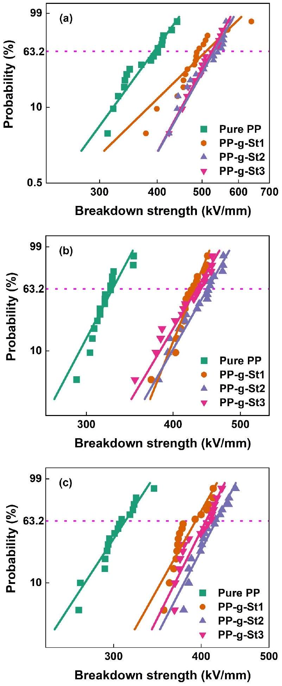
FIGURE 9 DC breakdown strength of pure PP and PP-g-St samples under (a) 30°C, (b) 90°C and (c) 110°C. PP, polypropylene; PP-g-St, St-grafted PP.

Figure 11 shows the measured and fitted TSDC plots for each sample. In all the samples, there are two peaks: one around 265 K, corresponding to the $\beta$-peak, and the other

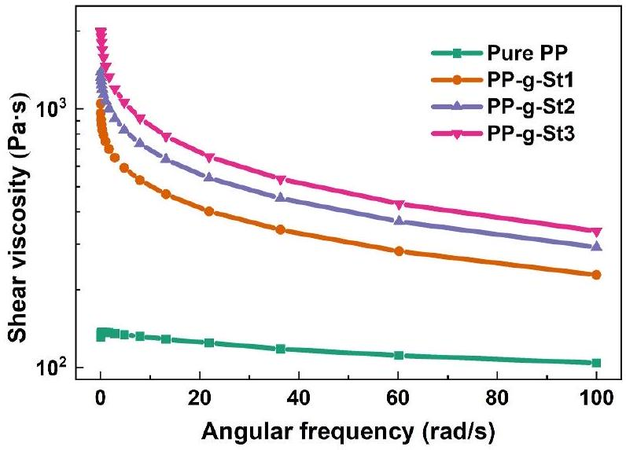
FIGURE 10 Shear viscosity of pure PP and PP-g-St samples. PP, polypropylene; PP-g-St, St-grafted PP.

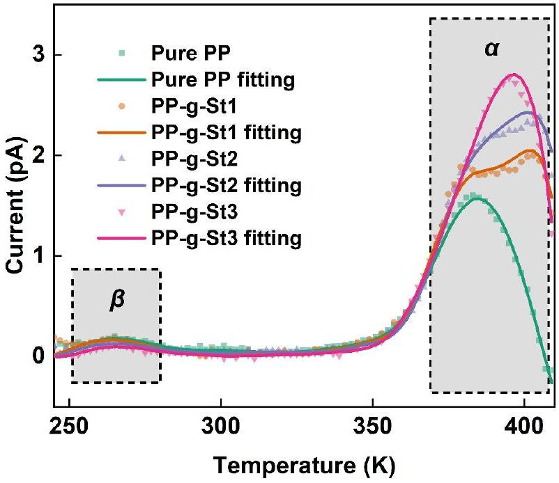
FIGURE 11 Thermally stimulated depolarisation current of pure PP and PP-g-St samples. PP, polypropylene; PP-g-St, St-grafted PP.

between 370 and 400 K, corresponding to the $\alpha$-peak. The $\beta$-peak corresponds to the glass transition of PP, induced by the movement and dipole orientation of the PP molecular chains. The $\alpha$-peak, on the other hand, is attributed to the electron trap, which determines the detrapping and migration process of charges in the PP material. Interestingly, for the $\beta$ peak, the peak value of PP-g-St samples is essentially consistent with pure PP. This consistency arises because the introduced St is a non-polar grafting monomer. However, for the $\alpha$ peak, the PP-g-St samples bring in a significant number of deep traps with energy levels around 1.15 eV. Both the trap energy levels and the number of deep traps in the PP-g-St samples increase significantly, and the number of deep traps rises with the increase in grafting content. For PP-g-St samples, the St monomers have different electronic energy band structures from the PP matrix, which brings in a significant number of deep traps [23]. Meanwhile, the heterogeneous nucleation of the grafted side chains reduces the size of spherulites, leading to an increase in the interface between the spherulites and the amorphous regions. This process also generates a certain number of deep traps [40], thereby reducing carrier migration and suppressing space charge injection and accumulation in the grafted polymers. As a result, the electrical properties of the material are enhanced.

It can be found that although the number of deep traps is higher in PP-g-St3, its electrical properties are lower than those of PP-g-St2. Since PS is an amorphous polymer, it introduces amorphous regions into the PP matrix, resulting in weak insulation properties. Although excessive grafting content can introduce more deep traps, it also leads to the emergence of weak insulation areas inside the sample. At this point, deep traps are no longer the dominant factor affecting electrical performance, resulting in a decrease in electrical properties.

## 3.6 | Mechanism of electrical performance improvement

Regarding the carrier conduction process, the conductivity and breakdown characteristics are closely related to the trap characteristics [41]. For PP-g-St samples, because of the formation of deep traps through grafting, volume resistivity and breakdown strength are higher. In general, the introduction of grafted side chains significantly impacts the trapping properties of PP-g-St samples. The schematic diagram of the structure of the PP-g-St samples is shown in Figure 12. In pure PP, a small number of electron traps are distributed inside and at the boundaries of the crystalline regions. Most of the carriers migrate easily in the direction of the electric field, and a small number of trapped electrons can also be detrapped in a very short time. For the PP-g-St samples, carrier transport is further suppressed because of the formation of a number of deep traps in the interfacial zone as well. More importantly, the introduction of grafted side chains enhances the crystallinity of the PP, and reduces the size of spherulites, resulting in the boundaries between spherulites becoming tortuous and narrow. These tortuous and narrow boundaries reduce the mean free path of the carriers, making them more easily captured by the deep traps. As a result, the probability of collision ionisation decreases, which improves the insulation performance of the material [42].

It is commonly believed that high temperature can enhance the injection and migration of charges [43]. Because of the lack of deep traps, the charge injection threshold electric field of pure PP exhibits a large decrease with increasing temperature, resulting in a rapid increase in current under high electric fields. Additionally, temperature can alter the aggregation structure of PP. The polymer's free volume gradually increases with increasing temperature, promoting the migration of charge carriers and improving the volume conductivity of the material [44]. Therefore, the electrical performance of pure PP deteriorates quickly at high temperatures. For the PP-g-St samples shown in Figure 12, the grafted St monomers introduce a significant number of deep traps, enhancing the power to capture charges at high temperatures. Meanwhile, the entanglement of grafted side chains enhances the thermal and

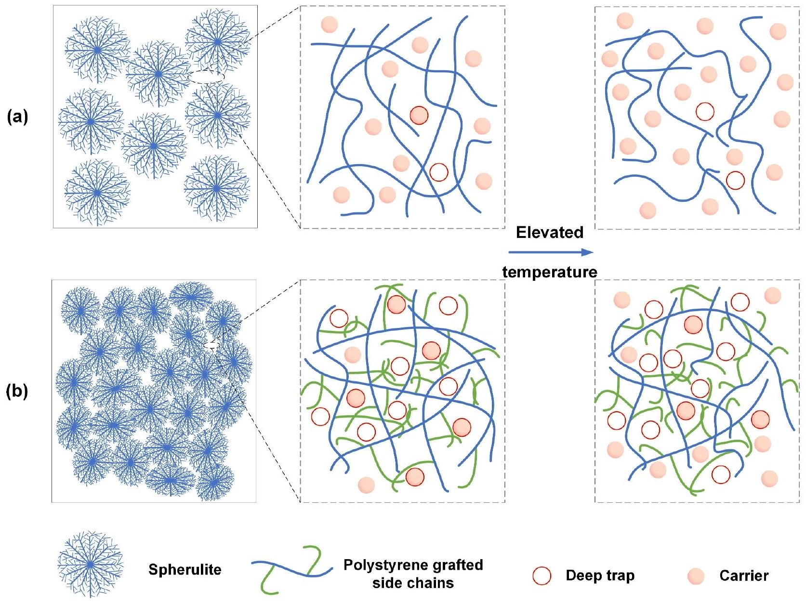
FIGURE 12 Schematic diagram of the structure in (a) pure PP and (b) PP-g-St samples. PP, polypropylene; PP-g-St, St-grafted PP.

structural stability of the material, hindering the movement of molecular chains and weakening the influence of high temperature on free volume. Additionally, the dense spherulites lead to narrow and tortuous boundaries between crystalline regions, which are not conducive to the formation of lowdensity regions. Therefore, the electrical properties of PP-g-St samples exhibit better temperature stability. The deep traps introduced by grafting St, the entanglement of grafted side chains, the reduction in spherulite size and the increase in spherulite quantity are all reasons for the higher electrical properties of PP-g-St samples at high temperatures.

## 4 | CONCLUSION

The PP-g-St samples were prepared by the grafting method, and four materials including pure PP, PP-g-St1, PP-g-St2 and $\mathrm{PP}-\mathrm{g}-\mathrm{St} 3$ were selected to analyse their electrical properties at high temperatures. The results show that the grafted St monomers can not only improve the thermal stability of PP but also enhance the structural stability of the material. Therefore, the space charge of PP-g-St samples is suppressed, and the breakdown strength and volume resistivity are significantly improved, demonstrating excellent electrical properties. PP-g-St2 exhibits the highest characteristic breakdown strength of 530.96 kV/mm, which is 35.04\% higher than that of pure PP. The high-temperature electrical properties of PP-g-St samples are also superior to those of pure PP. PP-g-St2 exhibits the highest characteristic breakdown strength at 90 and $110^{\circ} \mathrm{C}$, which is $36.98 \%$ and $34.86 \%$ higher than that of pure PP, respectively. Further research was conducted on the trap characteristics of PP-g-St samples, indicating that the grafted St monomers introduce a large number of deep traps, which inhibit carrier injection and migration and improve the insulation properties of the material. Simultaneously, the introduction of grafted side chains hinders the movement of molecular chains at high temperatures, thereby weakening the effect of high temperatures on the free volume of PP. Grafting St also significantly enhances the high-temperature electrical properties of PP. The present work demonstrates that grafting modification is an effective method to improve the hightemperature electrical properties of PP.

The research results indicate that grafting modification can effectively improve the insulation and high-temperature electrical properties of PP materials. It avoids the agglomeration problem that exists in modification methods such as nano-
doping, and demonstrates excellent development potential. In the next step of research, attention should be paid to the synergistic optimisation of the insulation performance, mechanical properties and heat resistance of the material to determine the optimal modification scheme. Additionally, further control of the entanglement effect of grafted side chains to enhance the comprehensive performance of materials is also a key research direction.

## ACKNOWLEDGEMENTS

This work was supported by the National Natural Science Foundation of China under Grant No. 52237001 and Grant No. 51921005.

## CONFLICT OF INTEREST STATEMENT

The authors declare no conflicts of interest.

## DATA AVAILABILITY STATEMENT

The data that support the findings of this study are available from the corresponding author upon reasonable request.

## ORCID

Xinhua Dong ${ }^{(1)}$ https://orcid.org/0009-0005-3099-0679 Wenjia Zhang (D) https://orcid.org/0000-0002-8906-0602 Shixun Hu ® https://orcid.org/0000-0002-0593-2494

## REFERENCES

1. Zhou, Y., et al.: Evaluation of polypropylene/polyolefin elastomer blends for potential recyclable HVDC cable insulation applications. IEEE Trans. Dielectr. Electr. Insul. 22(2), 673-681 (2015)
2. Li, G., et al.: Space charge characteristics and dielectric properties of PANI/PP-g-MAH/PP ternary composite. High Volt. 10(1), 178-185 (2025)
3. Zhou, Y., et al.: Polymeric insulation materials for HVDC cables: development, challenges and future perspective. IEEE Trans. Dielectr. Electr. Insul. 24(3), 1308-1318 (2017)
4. Ho, J.S., Greenbaum, S.G.: Polymer capacitor dielectrics for high temperature applications. ACS Appl. Mater. Interfaces 10(35), 29189-29218 (2018)
5. Li, C.Y., et al.: Insulating materials for realising carbon neutrality: opportunities, remaining issues and challenges. High Volt. 7(4), 610-632 (2022)
6. Zhou, Y., et al.: Polypropylene-based ternary nanocomposites for recyclable high-voltage direct-current cable insulation. Compos. Sci. Technol. 165(8), 168-174 (2018)
7. Zhou, Y., et al.: Scalable polyolefin-based all-organic dielectrics with superior high-temperature capacitive energy storage performance. Energy Storage Mater. 72, 103715 (2024)
8. Qin, W.Q., et al.: Distributed discharge detection based on improved COTDR method with dual frequency pulses. IEEE Trans. Instrum. Meas. 72, 9001308 (2023)
9. Xu, R.R., et al.: Dielectric properties dependent on crystalline morphology of PP film for HVDC capacitors application. Polymer 213(20), 123204 (2021)
10. Du, B.X., et al.: Temperature dependent space charge and breakdown strength of PP/ULDPE/graphene nanocomposites for HVDC extruded cable insulation. IEEE Trans. Dielectr. Electr. Insul. 26(3), 876-884 (2019)
11. Zheng, F.H., et al.: Space charge characterization in biaxially oriented polypropylene films. IEEE Trans. Dielectr. Electr. Insul. 23(5), 3102-3107 (2016)
12. Dang, B., et al.: Suppression of elevated temperature space charge accumulation in polypropylene/elastomer blends by deep traps induced by surface-modified ZnO nanoparticles. Compos. Sci. Technol. 153(1), 103-110 (2017)
13. Xie, D.R., et al.: Temperature- and thickness-dependent electrical breakdown modulated by a coupling model of charge transport and molecular chain dynamics. J. Phys. D Appl. Phys. 52(36), 365305 (2019)
14. Wu, Y.H., et al.: A remarkable suppression on space charge in isotatic polypropylene by inducing the $\beta$-crystal formation. Appl. Phys. Lett. 107(11), 112901 (2015)
15. Han, B., et al.: Space charge suppression induced by deep traps in polyethylene/zeolite nanocomposite. Appl. Phys. Lett. 102(1), 012902 (2013)
16. Zhou, Y., et al.: Mechanism of highly improved electrical properties in polypropylene by chemical modification of grafting maleic anhydride. J. Phys. D Appl. Phys. 49(41), 415301 (2016)
17. Zhao, J., Chen, G., Lewin, P.L.: Investigation into the formation of charge packets in polyethylene: experiment and simulation. J. Appl. Phys. 112(3), 034116 (2012)
18. Gao, Y., et al.: Compatibility dependent space charge accumulation behavior of polypropylene/elastomer blend for HVDC cable insulation. IEEE Trans. Dielectr. Electr. Insul. 27(3), 947-955 (2020)
19. Zhou, Y., et al.: Temperature dependent electrical properties of thermoplastic polypropylene nanocomposites for HVDC cable insulation. IEEE Trans. Dielectr. Electr. Insul. 26(5), 1596-1604 (2019)
20. Liu, W.F., Cheng, L., Li, S.T.: Review of electrical properties for polypropylene based nanocomposite. Compos. Commun. 10, 221-225 (2018)
21. Gao, Y.H., et al.: Recyclable dielectric polymer nanocomposites with voltage stabilizer interface: toward new generation of high voltage direct current cable insulation. ACS Sustain. Chem. Eng. 7(1), 513-525 (2019)
22. Zha, J.W., et al.: Improvement of space charge suppression of polypropylene for potential application in HVDC cables. IEEE Trans. Dielectr. Electr. Insul. 23(4), 2337-2343 (2016)
23. Yuan, H., et al.: Origins and effects of deep traps in functional group grafted polymeric dielectric materials. J. Phys. D Appl. Phys. 53(47), 475301 (2020)
24. Liang, Y., et al.: Preparation and electrical properties of 4-acetoxystyrene grafted polypropylene for HVDC cable insulation. J. Mater. Sci. Mater. Electron. 31(5), 3890-3898 (2020)
25. Liang, Y., Weng, L., Zhang, W.L.: Preparation and electrical properties of 4-allyloxy-2-hydroxybenzophenone grafted polypropylene for HVDC cables. J. Electron. Mater. 50(11), 6228-6236 (2021)
26. Caporaso, L., Iudici, N., Oliva, L.: Synthesis of well-defined polypropylene-graft-polystyrene and relationship between structure and the ability to compatibilize the polymeric blends. Macromolecules 38(11), 4894-4900 (2005)
27. Ritamäki, M., et al.: Large-area approach to evaluate DC electro-thermal ageing behavior of BOPP thin films for capacitor insulation systems. IEEE Trans. Dielectr. Electr. Insul. 24(2), 826-836 (2017)
28. Wang, H.Y., Guo, C.Y., Dong, J.Y.: Catalytic synthesis and characterization of well-defined polypropylene graft copolymers. Catal. Commun. 10(1), 61-67 (2008)
29. Li, K., et al.: Industrial adaptability of the Ziegler-Natta catalyst-friendly synthesis of long-chain-branched polypropylene based on $\omega$-alkenylmethyldichlorosilane-assisted propylene polymerization. Ind. Eng. Chem. Res. 60(12), 4589-4601 (2021)
30. Lezak, E., Bartczak, Z.: Plastic deformation of the $\gamma$ phase isotactic polypropylene in plane-strain compression at elevated temperatures. Macromolecules 40(14), 4933-4941 (2007)
31. Liu, W.F., et al.: Enhanced energy storage performance in polypropyleneacrylic acid grafted polypropylene- $\mathrm{ZrO}_{2}$ ternary nanocomposites. J. Phys. D Appl. Phys. 56(24), 244001 (2023)
32. Xiao, M., et al.: Breakdown strength improvement of polypropylene by introducing long-chain branched structures for film capacitors. J. Phys. D Appl. Phys. 55(24), 245501 (2022)
33. Montanari, G.C., Fabiani, D.: Evaluation of DC insulation performance based on space-charge measurements and accelerated life tests. IEEE Trans. Dielectr. Electr. Insul. 7(3), 322-328 (2000)

34. Montanari, G.C.: Bringing an insulation to failure: the role of space charge. IEEE Trans. Dielectr. Electr. Insul. 18(2), 339-364 (2011)
35. Meunier, M., Quirke, N., Aslanides, A.: Molecular modeling of electron traps in polymer insulators: chemical defects and impurities. J. Chem. Phys. 115(6), 2876-2881 (2001)
36. Vu, T.T.N., et al.: Correlating conductivity and space charge measurements in multi-dielectrics under various electrical and thermal stresses. IEEE Trans. Dielectr. Electr. Insul. 22(1), 117-127 (2015)
37. Yang, K., et al.: Enhancing electrical properties of impact polypropylene copolymer for eco-friendly power cable insulation by manipulating the multiphase structure through molten-state annealing. Compos. Sci. Technol. 223, 109422 (2022)
38. Cheng, L., et al.: Evolution of dielectric relaxation under elevated electric field of polypropylene-based films. J. Phys. D Appl. Phys. 53(44), 445502 (2020)
39. Yuan, H., et al.: Enhanced electrical properties of styrene-grafted polypropylene insulation for bulk power transmission HVDC cables. CSEE J. Power Energy Syst. 10(1), 361-370 (2024)
40. Smith, R.C., et al.: The mechanisms leading to the useful electrical properties of polymer nanodielectrics. IEEE Trans. Dielectr. Electr. Insul. 15(1), 187-196 (2008)
41. Min, D.M., et al.: Carrier transport and molecular displacement modulated DC electrical breakdown of polypropylene nanocomposites. Polymers (Basel) 10(11), 1207 (2018)
42. Cheng, L., et al.: Enhanced breakdown strength of multilayer polypropylene film with structured interface. J. Phys. D Appl. Phys. 54(34), 345503 (2021)
43. Dang, B., et al.: Remarkably improved electrical insulating performances of lightweight polypropylene nanocomposites with fullerene. J. Phys. D Appl. Phys. 50(45), 455303 (2017)
44. Kim, D.W., Yoshino, K.: Morphological characteristics and electrical conduction in syndiotactic polypropylene. J. Phys. D Appl. Phys. 33(4), 464-471 (2000)

How to cite this article: Dong, X., et al.: Improved high-temperature electrical properties of polypropylene insulation material by grafting styrene. High Voltage. 10(3), 603-614 (2025). https://doi.org/10.1049/hve2. 70058

[^0]:    This is an open access article under the terms of the Creative Commons Attribution License，which permits use，distribution and reproduction in any medium，provided the original work is properly cited．
    © 2025 The Author（s）．High Voltage published by John Wiley＆Sons Ltd on behalf of The Institution of Engineering and Technology and China Electric Power Research Institute．

