# Water-solid Suspension Grafting of Dual Monomers on Polypropylene to Prepare Ion-imprinted Fibers for Selective Adsorption of Cr(VI) 

Zhengwei Luo ${ }^{\mathbf{1}}$, Lei Li ${ }^{\mathbf{2}}$, Mulin Guo ${ }^{\mathbf{3}}$, Hui Jiang ${ }^{\mathbf{1}}$, Wenhua Geng ${ }^{\mathbf{1}}$, Wuji Wei ${ }^{\mathbf{2} \boldsymbol{*}}$, and Zhouyang Lian ${ }^{\mathbf{2}}$ * ${ }^{1}$ College of Biotechnology and Pharmaceutical Engineering, Nanjing Tech University, Nanjing 211816, China ${ }^{2}$ School of Environmental Science and Engineering, Nanjing Tech University, Nanjing 211816, China ${ }^{3}$ Nanjing Hydraulic Research Institute, Nanjing 210029, China (Received February 20, 2020; Revised March 26, 2020; Accepted March 30, 2020)

#### Abstract

In this work, a new strategy was developed to prepare Cr(VI)-imprinted polypropylene (PP) fibers-based materials for the adsorption of Cr(VI) from water. Granular PP was modified with dual monomers (glycidyl methacrylate (GMA) and acrylamide (AM)) by water-solid suspension grafting copolymerization. Then, this fibers morphology was obtained by melt-blowing. Hence, the preparation steps of the fibrous Cr(VI)-imprinted adsorbent involved surface ion-imprinting and crosslinking. The influence of the grafting conditions on the grafting percentage was investigated. The maxima grafting percentages of GMA and AM were 16.4 and 10.6 \%, respectively. The chemically modified products showed good mobility and stability, thus meeting the requirements of melt-blowing method. The prepared Cr(VI)-imprinted polymers showed a maximum adsorption capacity to Cr(VI) of 43.2 mg/g at pH 3. The adsorption data were well fitted by the pseudo-second-order and Langmuir adsorption models. The adsorbent showed good selectively toward Cr(VI) in a mixed solution containing Cu(II) and $\mathrm{SO}_{4}{ }^{2-}$. The X-ray photoelectron spectroscopy demonstrated that the adsorbed Cr(VI) was partly reduced to Cr(III).

Keywords: Suspension grafting, Dual monomers, Polypropylene fibers, Ion-imprinting, Cr(VI)

## Introduction

Hexavalent chromium (Cr(VI)) mainly originates from mining, metal smelting, electroplating, tanning, and other industries. Due to its extremely high toxicity and confirmed carcinogenic, teratogenic, and mutagenetic effects, the discharge of wastewater without proper pretreatment and containing Cr(VI) in a higher concentration than the legally allowed level is a real threat to the environment and human health [1,2]. Adsorption is one of the main methods for the removal of Cr(VI) from water, with the selective adsorption and removal of Cr(VI) by ion-imprinted polymer materials being the most commonly used nowadays [3-5]. Ion imprinting has emerged as an effective way to provide adsorbents with selective recognition and adsorption capabilities toward ions, which ultimately can be used for the preconcentration, detection, and especially the adsorption of ions [6-10]. Compared with bulk polymerization imprinted materials, surface imprinted materials have the advantages of fast adsorption, easy separation, and high recycling efficiency, with potential in real applications [11,12]. Polypropylene (PP) fibers can be successfully used to prepare imprinted materials due to the high porosity, large external surface area, high mass transfer efficiency, and easy recycling. Therefore, these polymer fibers have attracted the attention of researchers [13-15].

However, the preparation of imprinted PP involves first the surface modification of PP fibers with functional groups, which is commonly performed by surface grafting methods,

[^0]such as radiation-induced initiation [14] and plasma initiation [16]. In our previous study, the acrylic acid was grafted on the surface of PP fiber by plasma initiation and then Cr(VI) surface imprinted materials were prepared by amination, imprinting, and crosslinking [16]. The obtained material exhibited a good selectivity towards the adsorption of Cr(VI). Plasma polymerization is easy to perform, the polymerization time is short, and it is an environmentally friendly technique. However, it is challenging to construct large-size reactors, which, alongside with other specific technical problems, still limits the application of this method for the large-scale production. On the other hand, the grafted functional groups on the surface of PP fibers should be further modified, such as by amination, and after that they can be used for the preparation of ion-imprinted material.

The water-solid suspension grafting method uses water and polymer particles as dispersant and dispersed phase, respectively, to form a suspension system under mechanical agitation. In this suspension, each polymer particle can be regarded as an independent reaction bed, and the functional monomers can be grafted on the polymer surface in the presence of an initiator [17]. The grafting percentage of the suspension grafting polymerization is high, the reaction is performed under mild conditions, and the post-treatment of the products is simple [18]. Zhou et al. grafted maleic anhydride on the surface of PP and the melt-blown fibers showed significant increase in hydrophilicity and good adsorption capacity for $\mathrm{Cu}^{2+}$ [19]. Currently, single monomers are commonly used for the suspension grafting of PP, but grafting of comonomers is a more promising strategy because modified materials with various functionalities can be obtained [20-22]. Li et al. used water as dispersant,
acetone as interfacial agent, and benzoyl peroxide as initiator to graft methyl methacrylate on PP [23]. The product was then used as a compatilizer of PP/acrylonitrile-styreneacrylate mixture. In addition, the use of styrene comonomer increased the grafting percentage of methyl methacrylate. Zhao et al. grafted butyl acrylate and acrylic castor oil on the surface of PP by suspension grafting [24]. The influence of the polymerization parameters on the grafting efficiency was investigated and the mechanical properties of grafted products were significantly improved.

In this work, glycidyl methacrylate (GMA) and acrylamide (AM) were used as grafting monomers, and loaded on PP surface by a one-step suspension grafting. Then, the PP-g-(GMA-AM) (PGA) fibers were made by melt-blowing technology. Finally, the PP-g-(GMA-AM) ion-imprinted (IPGA) fibers were prepared by surface ion imprinting method. The effects of the monomers ratio, total monomer content, as well as dispersant and interfacial agent amounts, on the grafting percentage of GMA and AM were studied. The surface morphology, chemical composition, and structure of the modified materials were characterized by scanning electron microscopy (SEM), X-ray electron spectrometry (XPS), Fourier transform infrared spectroscopy (FT-IR), thermogravimetry analysis (TGA), and melt flow rate (MFR). The adsorption capacity and selectivity of the ionimprinted fibers were investigated. The mechanism of adsorption was also proposed.

## Experimental

## Preparation of Ion-imprinted PP Fibers

The schematic diagram of IPGA synthetic process is illustrated in Scheme 1, where the entire process is divided into three steps. (1) Pre-treatment of PP [19]. PP resin (P6313, Shanghai Expert in the Developing of New Material Co., Ltd., Shanghai, China) and xylene (3 ml/g PP) were introduced into a magnetic stirring reactor and heated to 140 °C with a rate of 3 °C/min under magnetic stirring. Then, the mixture was poured into an ice water mixture $\left(0{ }^{\circ} \mathrm{C}\right)$ for fast cooling and to enable the precipitation of PP from xylene and formation of low-crystallized microporous PP powders. The powder was recovered by filtration and then dried to a constant weight.
(2) Suspension grafting. PP powders (0.5 mm in diameter), dispersant (deionized water), and interfacial agent (xylene) were added to a magnetic stirring reactor and stirred at 90 °C for 1 h in the argon atmosphere to fully swell and disperse the PP powder. A certain amount of initiator (benzoyl peroxide, BPO) and monomers (GMA and AM) were added and copolymerized at 90 °C for 3 h. The obtained grafted products were washed with deionized water and acetone to remove the unreacted monomers and homopolymers. The grafting percentage of GMA and AM was calculated based on the titration and elemental analysis methods [25,26].

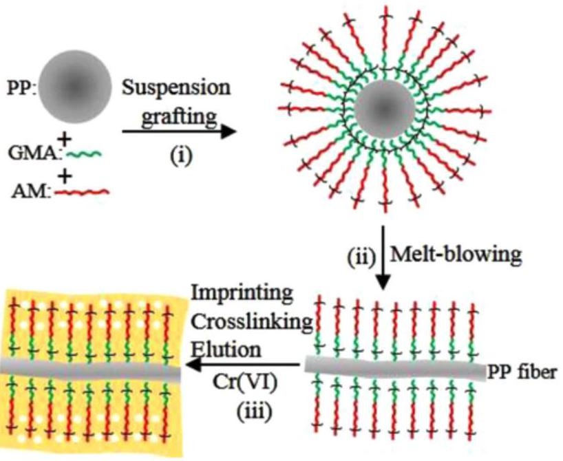
Scheme 1. Schematic diagram of IPGA fibers synthetic process.

Then, GMA and AM copolymerized PP fibers (PGA) were prepared through melt-blowing method [26].
(3) Surface ion-imprinting and crosslinking. PGA fibers were placed in $100 \mathrm{mg} / l$ potassium dichromate solution and shaken at pH 3 and 25 °C for 90 min to allow the adsorption of Cr(VI) on the functional groups. Then, the fibers were introduced into a diethylenetriamine/ethanol solution and refluxed at 60 °C for 4 h for crosslinking. After crosslinking, the fibers were washed with $0.1 \mathrm{~mol} / l \mathrm{NaOH}$ solution until Cr(VI) was not detected in the eluent. The resultant Cr(VI)-imprinted fibers were denoted as IPGA. The non-imprinted fibers were also prepared without addition of Cr(VI) ion, and denoted as NIPGA.

## Characterizations

Scanning electron microscopy (JEOL JSM-5900 microscope) was used to observe the surface morphology of fibers before and after modification. The fiber surface was observed after gold spraying treatment, and then the surface morphology was observed at a voltage of 15 kV. Fourier-transform infrared spectrometry (Nexus 670 spectrometer, Nicolet) was used to characterize the functional groups on the fiber surface before and after modification, and the surface attenuation total reflection mode was used for scanning. The samples were scanned within the range of $500-4000 \mathrm{~cm}^{-1}$ with a resolution of $1 \mathrm{~cm}^{-1}$. The water contact angle formed by water on fibers was measured on a contact Angle tester (JC2000D, Shanghai Zhongchen technology Co., Ltd.). Deionized water ( $5 \mu l$ ) was injected and the contact angle was recorded by a high-resolution camera. Five measurements were performed on different regions of the fiber and the results are their average. X-ray photoelectron spectroscopy (250XI spectrometer, Thermo Fisher) was used to characterize the surface chemical composition of the fibers. The melt
flow rate (MFR) of PP was measured at a temperature of 230 °C with a load of 2.16 kg. Three measurements were performed for each grafting percentage and averaged. A thermal analyzer (Pyris 1 DSC, PerkinElmer) was used to measure the weight loss and heat flow before and after chemical modification. The test temperature ranged from 25 to 600 °C with a heating rate of 20 °C/min under nitrogen gas with a flow of 20 ml/min.

## Adsorption Experiments

Adsorption experiments were carried out in batch mode, and the average value of the three repeated experiments was reported. Fibers were immersed into a Cr(VI) solution at constant pH and temperature. After adsorption under shaking for a certain interval of time, the concentration of Cr(VI) in the solution was measured on an inductively coupled plasma - optical emission spectrometer (ICP-OES, iCAP 6300, Thermo Fisher scientific). The adsorption capacity $\left(q_{e}\right)$ was calculated as:

$$
\begin{equation*}
q_{e}=\frac{\left(C_{0}-C\right) \times V}{m} \tag{1}
\end{equation*}
$$

where $C_{0}$ and $C(\mathrm{mg} / l)$ are the concentrations of $\operatorname{Cr}(\mathrm{VI})$ before and after adsorption, $V(\mathrm{~L})$ is the volume of solution, and $m(\mathrm{~g})$ is the mass of fibers.

The adsorption kinetics were fitted with pseudo-first-order (equation (2)) and pseudo-second-order (equation (3)) models [16].

$$
\begin{align*}
& \ln \left(q_{e}-q_{t}\right)=\ln q_{e}-k_{1} t  \tag{2}\\
& \frac{t}{q_{t}}=\frac{1}{k_{2} q_{e}^{2}}+\frac{t}{q_{e}} \tag{3}
\end{align*}
$$

where $q_{e}$ is the equilibrium adsorption capacity, $q_{t}$ is the adsorption capacity at time $t$, and $k_{1}\left(\mathrm{~min}^{-1}\right)$ and $k_{2}(\mathrm{mg} /(\mathrm{g}$ min)) are the rate constants of pseudo-first-order and pseudo-second-order models, respectively.

The Scatchard equation is expressed as [27]:

$$
\begin{equation*}
\frac{q_{e}}{C_{e}}=\frac{q_{\max }-q_{e}}{K_{s}} \tag{4}
\end{equation*}
$$

where $q_{e}(\mathrm{mg} / \mathrm{g})$ is the adsorption capacity at equilibrium, $q_{\text {max }}(\mathrm{mg} / \mathrm{g})$ is the maximum adsorption capacity, $C_{e}(\mathrm{mg} / l)$ is the residual concentration of Cr(VI), and $K_{s}$ is the equilibrium dissociation constant.

The adsorption isotherm was fitted with Langmuir, Freundlich, and Temkin models [16]:

$$
\begin{equation*}
\text { Langmuir: } \frac{C_{e}}{Q_{e}}=\frac{C_{e}}{Q_{m}}+\frac{1}{K_{L} Q_{m}} \tag{5}
\end{equation*}
$$

$$
\begin{equation*}
\text { Freundlich: } \ln Q_{e}=\ln K_{F}+\frac{1}{n} \ln C_{e} \tag{6}
\end{equation*}
$$

$$
\begin{equation*}
\text { Temkin: } Q_{e}=\frac{R T}{B_{T}} \ln \left(K_{T} C_{e}\right) \tag{7}
\end{equation*}
$$

where $C_{e}(\mathrm{mg} / l)$ is the concentration of Cr(VI) at equilibrium, $Q_{e}(\mathrm{mg} / \mathrm{g})$ and $Q_{m}(\mathrm{mg} / \mathrm{g})$ are the adsorption capacity at equilibrium and the maximum adsorption capacity, respectively, $K_{\mathrm{L}}(l / \mathrm{mg}), K_{\mathrm{F}}(l / \mathrm{mg})$, and $K_{\mathrm{T}}(\mathrm{J} / \mathrm{mol})$ are the constants of Langmuir, Freundlich, and Temkin models, respectively.

The thermodynamics of the adsorption processes was evaluated, and the thermodynamic parameters, i.e., Gibbs free energy $(\Delta G)$, enthalpy $(\Delta H)$, and entropy $(\Delta S)$, were calculated with the equations below [5].

$$
\begin{align*}
& \ln \frac{Q_{e}}{C_{e}}=-\frac{\Delta H}{R} \times \frac{1}{T} \times \frac{\Delta S}{R}  \tag{8}\\
& \Delta G=\Delta H-T \times \Delta S \tag{9}
\end{align*}
$$

where $R(8.314 \mathrm{~J} /(\mathrm{mol} \mathrm{K}))$ is the ideal gas constant and $T(\mathrm{~K})$ is the absolute temperature. The values of $\Delta H$ and $\Delta S$ were obtained from the slope and intercept of the plot of $\ln \left(Q_{e} / C_{e}\right)$ against 1/T.
$\mathrm{Cu}(\mathrm{II}), \mathrm{SO}_{4}{ }^{2-}$, and $\mathrm{Mo}(\mathrm{VI})$ were selected as interfering ions to evaluate the adsorption selectivity of IPGA fibers towards Cr(VI). The concentration of interfering ions was varied from 20 to $100 \mathrm{mg} / l$, and the concentration of Cr(VI) was constant ( $100 \mathrm{mg} / l$ ). After adsorption experiments, the distribution coefficient ( $K_{d}, \mathrm{~m} l / \mathrm{g}$ ), selectivity coefficient ( $K$ ), and relative selectivity coefficient $\left(K^{\prime}\right)$ were calculated using equations (10)-(12) [28].

$$
\begin{align*}
K_{d} & =\frac{C_{0}-C_{e}}{C_{e}} \times \frac{V}{m}  \tag{10}\\
K & =\frac{K_{f}(\mathrm{Cr}(\mathrm{VI}))}{K_{d}(\text { competing ion })}  \tag{11}\\
K^{\prime} & =\frac{K_{\mathrm{IPGA}}}{K_{\mathrm{NIPGA}}} \tag{12}
\end{align*}
$$

## Results and Discussion

## Dual Monomer-grafting of PP Fibers

The influences of the ratio of two monomers, total monomer content, as well as the content of interfacial agent and dispersant on the grafting percentage are shown in Figure 1. As can be seen from Figure 1(a), the grafting percentage of GMA and AM increased first and then decreased slightly with the increase in GMA: AM ratio. When the GMA: AM ratio was 1.2: 1, the grafting percentage of monomers reached the maximum. It should be mentioned that in the grafting polymerization process, the interfacial agent swells the PP fibers generating an interfacial layer where the grafting reaction mainly takes place. Therefore,
the oil-soluble GMA is first grafted on PP surface. As the GMA: AM ratio increases, the grafting percentage of GMA increases, but until a certain ratio (i.e., 1.2). After that, the excessive GMA tends to homopolymerize [29]. As a result, a slight decrease in the grafting percentage of GMA is noticed. Theoretically, the $Q$ values of GMA and AM (1.03 and 1.12, respectively) are around 1 and slightly higher than 1, respectively, indicating that GMA and AM can be easily converted into free radicals and are prone to copolymerize. The $e$ values of GMA and AM (0.57 and 1.19, respectively) are significantly different, highlighting the tendency of the two monomers to alternate in the copolymer chain. These values show that AM is usually grafted onto PP through the "bridge" of GMA, and GMA and AM alternate in the macromolecular chain. Therefore, the grafting percentage of GMA is higher than that of AM [26]. AM mainly exists in the aqueous phase. When the amount of AM is high, the GMA sites available for copolymerization are limited, resulting in a low grafting percentage of GMA and AM.

Figure 1(b) shows the influence of the total monomer content (GMA, AM) on the grafting percentage of GMA and AM at the optimum GMA: AM ratio of 1.2. As observed, the grafting percentage of both GMA and AM increases first and then decreases with increasing the total monomer content. At a total monomer content of 60 \% of the PP mass, the grafting percentage of both monomers reached the maximum. Appropriate monomer content promotes the collisions between monomers and free radicals, which is conducive to the grafting reaction. However, above this limit, excessive monomer concentration may lead to the homopolymerization of monomers, as well, phenomenon reflected by the decrease in monomer grafting percentage.

Figure 1(c) shows the effect of the content of dispersant (deionized water) on the grafting percentage of monomers. As can be seen, the grafting percentage of GMA and AM increased first and then decreased with the increase in water content. When the amount of deionized water was 8 ml/g PP, the grafting percentage of monomers reached the maximum. At low amount of water $(<8 \mathrm{mg} / l)$, the PP particles could not be effectively dispersed, leading to aggregation and low grafting percentage. When the amount of dispersant is too high ( $>8 \mathrm{mg} / l$ ), the concentration of the monomer dissolved in water is relatively low, causing a small concentration gradient between the dispersant and the interfacial reaction layer. Hence, the monomer cannot be effectively transferred to the interfacial reaction layer and participate in the graft polymerization reaction.

Above this concentration, the impact of this parameter on the grafting percentage of the two monomers was different. Therefore, the grafting percentage of GMA was almost

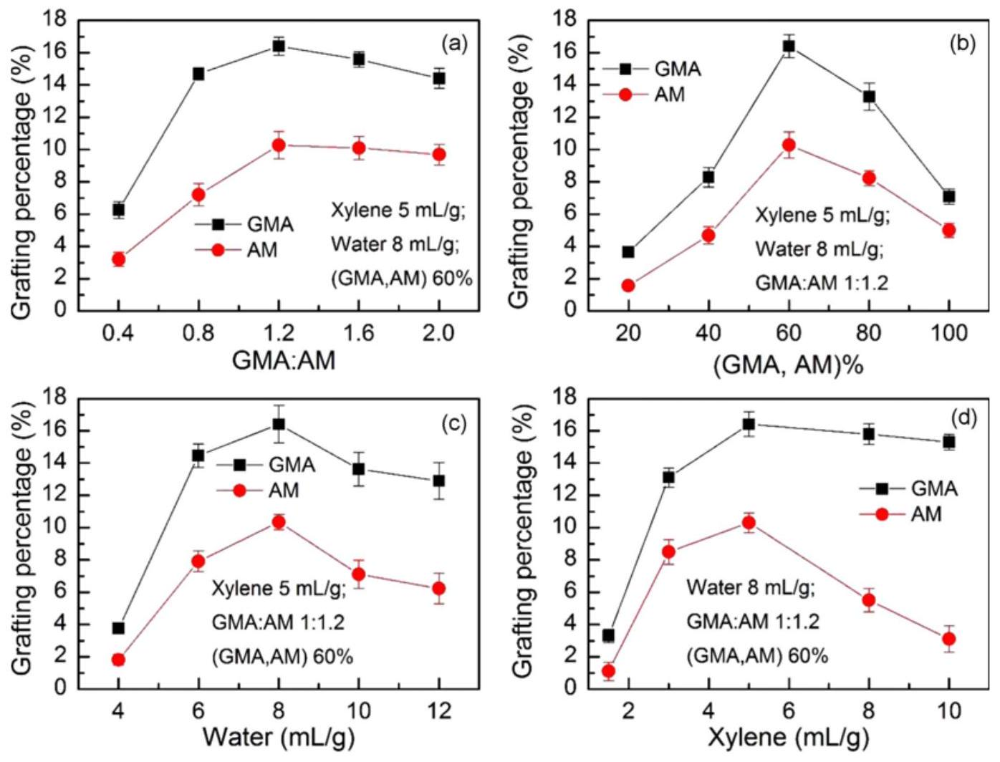
Figure 1. Effect of the (a) GMA to AM ratio, (b) monomer concentration, (c) water content, and (d) interfacial agent concentration on the grafting percentage of GMA and AM.

constant with only an insignificant decrease while that of AM decreased significantly. Therefore, increasing the amount of interfacial agent until an optimum concentration is helpful for the grafting reaction. However, when the amount of interfacial agent is too high, the concentration of GMA in the interfacial layer is low, which reduces the grafting efficiency. Moreover, the solubility of AM in the interfacial agent is low, and excessive interfacial agent seriously affects the mass transfer process, significantly decreasing the grafting percentage of AM.

## Characterizations

The polar branched chains of GMA and AM increase the strength of interaction of PGA molecules, with impact on the flow of the raw material and thus, on the melt-blown spinning process. Figure 2 shows how monomer grafting influences the MFR of grafted products. The MFR of pristine PP is about 1300 g/10 min. The MFR kept almost constant, with a slight increase, up to a grafting percentage of about 6 \%. The $\alpha-\mathrm{H}$ of PP macromolecular chain is easily captured by the benzoyl peroxide to produce free radicals

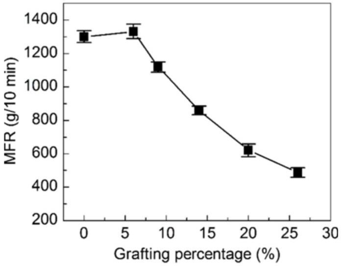
Figure 2. Effect of the grafting percentage on the MFR of PP powders.

[18]. At this time, the $\beta$ bonds are broken, resulting in a slight decrease in molecular weight and increase in MFR. Afterwards, as the grafting percentage continued to increase, the strength of hydrogen bonds between the polar side chains increased, and the MFR of PGA decreased rapidly [24]. In the light of the obtained results, it can be stated that the MFR of the grafted product meets the requirements of melt-blown spinning process.

Figure 3 displays the TGA and DTG curves of PP resin, PGA, and IPGA fibers. According to the TGA curves (Figure 3(a)), the suspension of the grafted PGA resin has better thermal stability than the unmodified PP resin. No significant weight loss before 200 °C was obtained and mainly associated with the removal of the physisorbed water. Therefore, the grafted product exhibits the thermal stability required by the melt-blown spinning process. However, the thermally resistant cross-linking products in the IPGA fibers are not decomposed even at temperatures higher than 500 °C. In addition, Figure 3(b) shows that the maximum temperature of the degradation of IPGA imprinted fibers is slightly higher than those of PP and PGA, which is attributed to the cross-linking products on the fiber surface.

Figure 4(a), (b), and (c) display the SEM images of PP, PGA, and IPGA fibers, respectively. As noticed, the surface morphology and diameter of PGA fibers did not significantly change compared with those of unmodified PP fibers. Therefore, the suspension grafting had no influence on the morphology and diameter of PGA fibers, which are mainly controlled by the melt-blowing process. The surface of imprinted IPGA fibers is rough and porous, mainly due to the imprinting and crosslinking on the fiber surface [30]. As illustrated in Figure 4(d), deionized water spread out on the surface of IPGA nonwoven fabrics instantly while the droplets of water formed on the PP fiber are illustrated in the inset. This demonstrates that the modified fiber has a good hydrophilicity.

As can be seen from Figure 5, illustrating the FT-IR spectra of samples, the spectrum of PGA displays the

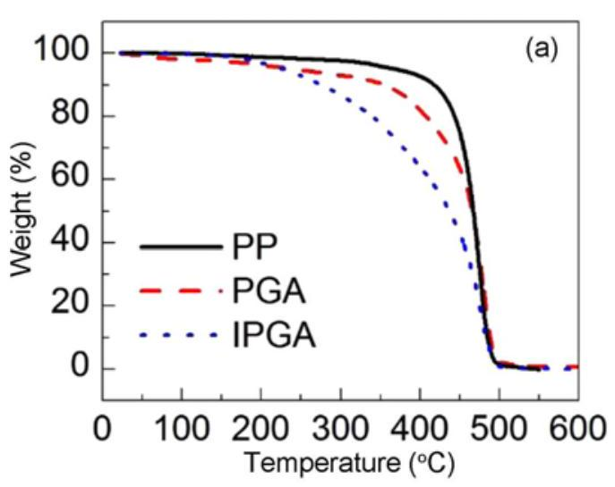
Figure 3. (a) TGA and (b) DTG curves of PP, PGA, and IPGA fibers.

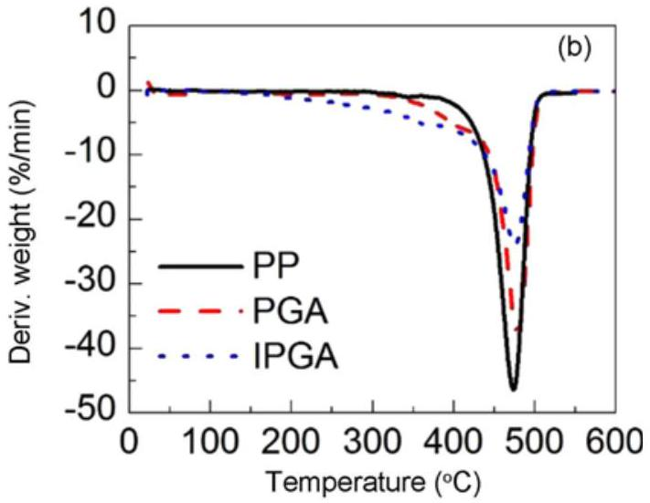
Figure 3. (a) TGA and (b) DTG curves of PP, PGA, and IPGA fibers.

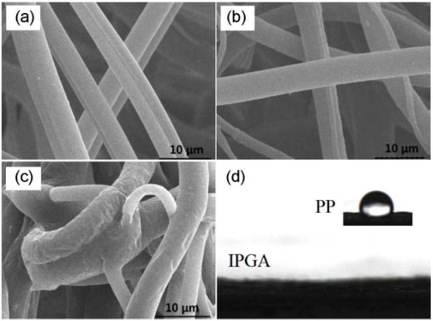
Figure 4. SEM images of (a) PP, (b) PGA, (c) IPGA fibers, and (d) water contact angle of IPGA and PP nonwoven fabrics.

characteristic vibration bands of the grafted monomers. The stretching vibration band of the C=O bond of GMA appeared at $1725 \mathrm{~cm}^{-1}$. The stretching vibration band of the C-O-C group of GMA is found at $1151 \mathrm{~cm}^{-1}$, whereas the vibration bands of the epoxy group appeared at 902 and $840 \mathrm{~cm}^{-1}$, respectively [31]. The stretching vibration band of the N-H functional group from primary amide in AM is found as a broad peak ranging from 3540 to $3125 \mathrm{~cm}^{-1}$. The stretching vibration band of the C=O from AM is shifted at lower wavenumber due to the unshared electron pair on the nitrogen atom and the p-conjugation of the carbonyl group compared with the C=O bond in GMA. Hence, the band at $1668 \mathrm{~cm}^{-1}$ is attributed to the C=O stretch vibration of AM. The infrared spectrum of IPGA imprinted fibers are similar to those of PGA, excepting the characteristic vibration bands at 902 and $840 \mathrm{~cm}^{-1}$ of epoxy group, which disappear as a

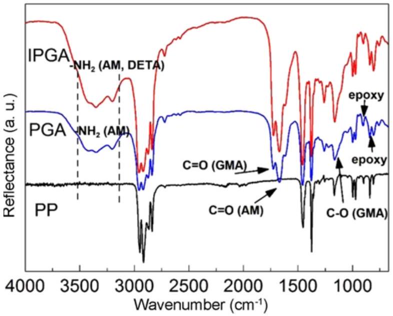
Figure 5. FT-IR spectra of PP, PGA, and IPGA fibers.

result of the open-loop crosslinking between diethylenetriamine (DETA) and epoxide.

## Adsorption Capacity   Effect of the $p H$

The adsorption capacity of IPGA toward Cr(VI) at different pH values ranging from 1 to 9 is depicted in Figure 6. As noticed, with the increase in pH of solution from 1 to 3, the adsorption capacity of IPGA increased slowly, achieving a maximum value of 43.2 mg/g at pH 3. After that, the adsorption capacity decreased rapidly with the increase in pH value. At low pH, the solution is rich in $\mathrm{H}^{+}$, which can combine with the lone pair electrons of N atom in - $\mathrm{NH}_{2}$ on the surface of IPGA, resulting in positively charged $-\mathrm{NH}_{3}{ }^{+}$. At this point, the Cr(VI) exists as anion state in the solution, which can combine with protonated functional groups through electrostatic interaction. It also can be seen in the figure that the pH drift (initial pH - final pH) of IPGA is relatively high at pH 3, indicating that the fiber surface is mainly positively charged and the adsorption amount of Cr(VI) is the highest [32]. When the pH value is less than 3, the adsorption capacity of the fibers decreased slightly, because within this pH range, the $\mathrm{HCrO}_{4}{ }^{-}$will be partially converted into non-ionic $\mathrm{H}_{2} \mathrm{CrO}_{4}$, which is difficult to combine with the protonated functional groups. However, when the pH value is higher than 3 , the deprotonation of functional groups on the surface of the fiber increases gradually with the pH , resulting in a competitive adsorption of $\mathrm{OH}^{-}$and $\mathrm{Cr}(\mathrm{VI})$. In addition, during the preparation of IPGA, the Cr(VI) template ion is mainly as $\mathrm{HCrO}_{4}{ }^{-}$and thus, the resulted imprinted cavities display the memory of $\mathrm{HCrO}_{4}{ }^{-}$anion [33-35].

## Adsorption Kinetics

Figure 7 shows the change in the adsorption capacity of IPGA over time. As can be seen, the adsorption Cr(VI) on the imprinted fiber was very fast within the first 30 min.

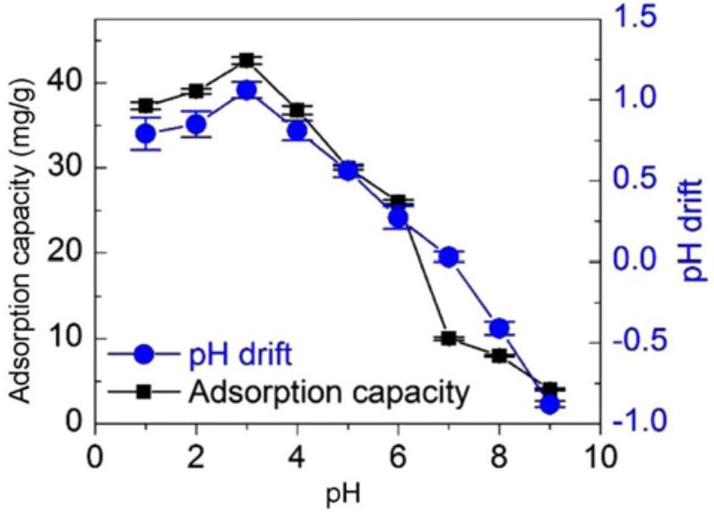
Figure 6. Effect of the pH on the adsorption capacity of IPGA to Cr(VI) and pH drift.

Then, the adsorption capacity of Cr(VI) increased slowly with the adsorption time. After 90 min of adsorption, the

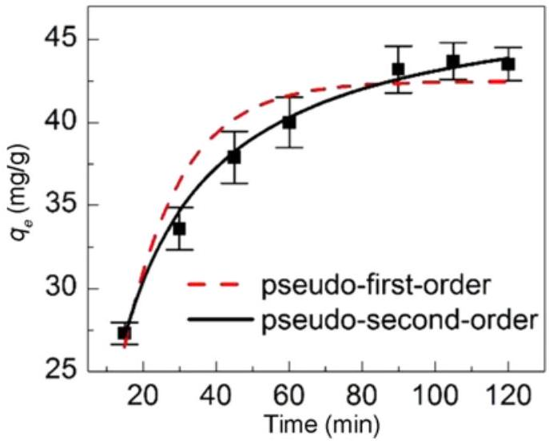
Figure 7. Effect of the contact time on Cr(VI) adsorption capacity of IPGA and fittings by pseudo-first-order and pseudo-secondorder models.

## Adsorption Isotherm

Figure 8(a) depicts the influences of the initial concentrations of Cr(VI) (10-80 mg/l) and temperature (20-35 °C) on the adsorption on IPGA. The experimental results revealed that the Cr(VI)-adsorption capacity increases with the initial concentration of Cr(VI) and temperature. Langmuir, Freundlich, and Temkin adsorption models were used to fit the adsorption data. The fitting results are depicted in Figure

Table 1. Kinetic parameters of Cr(VI) adsorption by IPGA
| $Q(\mathrm{mg} / \mathrm{g})$ | Pseudo-first-order |  |  | Pseudo-second-order |  |  |
| :--- | :--- | :--- | :--- | :--- | :--- | :--- |
|  | $q(\mathrm{mg} / \mathrm{g})$ | $k_{1}\left(\mathrm{~min}^{-1}\right)$ | $R^{2}$ | $q(\mathrm{mg} / \mathrm{g})$ | $k_{2}(\mathrm{~g} /(\mathrm{mg} \cdot \mathrm{min}))$ | $R^{2}$ |
| 43.2 | 41.21 | 0.0645 | 0.952 | 44.37 | 0.0067 | 0.994 |

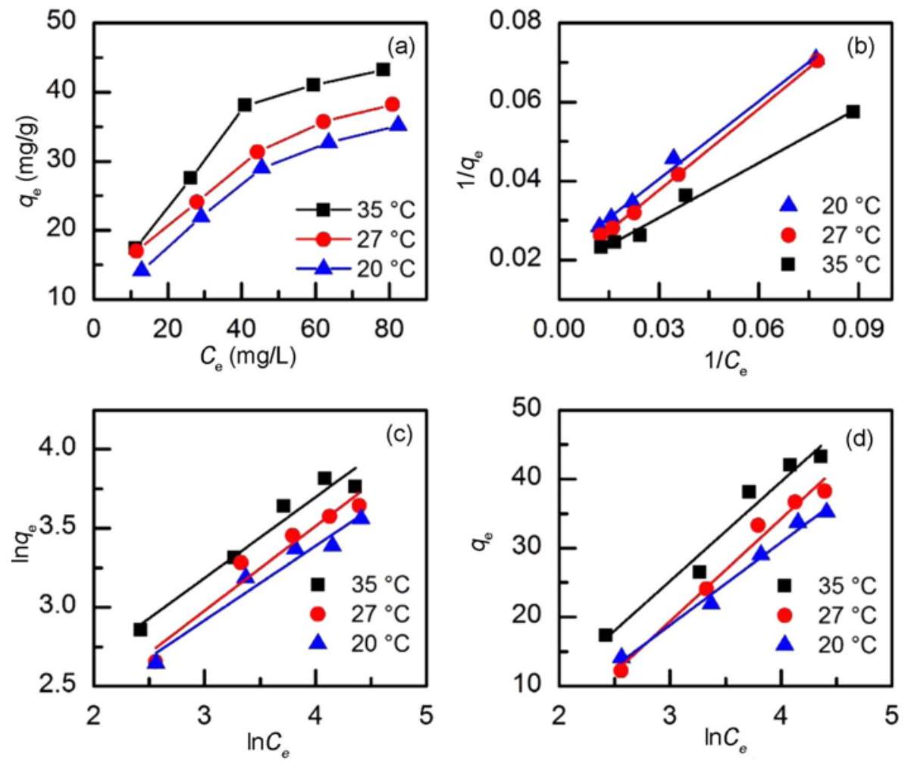
Figure 8. (a) Adsorption isotherm and fittings using (b) Langmuir, (c) Freundlich, and (d) Temkin models for Cr(VI) adsorption on IPGA fibers at different initial concentrations of Cr(VI) and temperatures.

Table 2. Isotherm parameters for the adsorption of Cr(VI) on IPGA
| $T\left({ }^{\circ} \mathrm{C}\right)$ | Langmuir |  |  | Freundlich |  |  | Temkin |  |  |
| :--- | :--- | :--- | :--- | :--- | :--- | :--- | :--- | :--- | :--- |
|  | $Q_{\mathrm{m}}(\mathrm{mg} / \mathrm{g})$ | $K_{\mathrm{L}}(l / \mathrm{mg})$ | $R^{2}$ | $n$ | $K_{\mathrm{F}}(l / \mathrm{mg})$ | $R^{2}$ | $B_{\mathrm{T}}$ | $K_{\mathrm{T}}(\mathrm{J} / \mathrm{mol})$ | $R^{2}$ |
| 20 | 48.1 | 0.0216 | 0.995 | 2.120 | 4.493 | 0.953 | 11.97 | 0.241 | 0.988 |
| 27 | 58.4 | 0.0249 | 0.999 | 1.870 | 3.954 | 0.947 | 14.80 | 0.185 | 0.981 |
| 35 | 59.5 | 0.0362 | 0.991 | 1.954 | 5.211 | 0.955 | 14.36 | 0.289 | 0.964 |

8(b)-(d), and the relevant fitting parameters are listed in Table 2. The fitting curve and the correlation coefficient, $R^{2}$, indicate that the Langmuir adsorption model better explains the Cr(VI) adsorption on IPGA, indicating that the process involves the adsorption of Cr(VI) as a monolayer [36]. In addition, the $K_{\mathrm{L}}$ values increase with the increase in temperature, indicating that adsorption is an endothermic process, and temperature is conducive to the adsorption. $K_{\mathrm{L}}$ values of the Langmuir adsorption model are in the range of 0-1, prove of a favorable adsorption process [37].

## Adsorption Thermodynamics

The thermodynamic parameters of the adsorption process obtained by fitting are listed in Table 3. As can be seen, $\Delta G_{0}$ of Cr(VI) adsorption on IPGA is negative irrespective of the temperature, indicating that the adsorption process is spontaneous. In addition, the absolute value of $\Delta G_{0}$ increases with the increase in temperature, confirming the positive role of the temperature in the Cr(VI) adsorption. The positive value of $\Delta H_{0}$ indicates that the adsorption process is endothermic and a high temperature (e.g., 27 °C) is beneficial to the adsorption of Cr(VI). Since hydrated Cr(VI) ions may release water molecules during the adsorption on the surface of fibers, the degree of disorder increases, resulting in an positive value of $\Delta S_{0}$ [38].

## Adsorption Selectivity

Figure 9 depicts the isotherms of Cr(VI) adsorption on IPGA and NIPGA fitted with the Scatchard model. It can be seen that the Scatchard plot analysis of IPGA led to two straight lines with different slopes and intercepts. The left end of the fitting curve is associated with the high affinity and selectivity of the adsorption sites while the right end shows the low affinity and selectivity of the sites [39]. The maximum apparent adsorbed amount and the equilibrium dissociation constant can be calculated based on the slope and intercepts of these curves. Therefore, according to the obtained lines, the surface of IPGA displays both specific

Table 3. Thermodynamic parameters for Cr(VI) adsorption on IPGA
| $T\left({ }^{\circ} \mathrm{C}\right)$ | $\ln K_{0}$ | $\Delta G_{0}$ (kJ/mol) | $\Delta H_{0}$ (kJ/mol) | $\Delta S_{0} (\mathrm{kJ} / \mathrm{mol} \cdot \mathrm{K})$ |
| :--- | :--- | :--- | :--- | :--- |
| 20 | 0.6687 | -1.63 | 18.57 | 0.070 |
| 27 | 0.9204 | -2.30 |  |  |
| 35 | 1.0260 | -2.63 |  |  |

and non-specific adsorption sites. The data of Cr(VI) adsorption on non-imprinted fibers (NIPGA) is fitted by a straight line, indicating the presence of the non-specific sites exclusively.

Figure 10 shows the selectivity coefficient, $K$ and relative selectivity coefficient, $K^{\prime}$, of IPGA and NIPGA for Cr(VI) at different concentrations of the competitive ions (Cu(II), $\mathrm{SO}_{4}{ }^{2-}$, and Mo(VI)). The experimental results show that $K$ of IPGA and NIPGA decrease with increasing competing ion concentration, indicating the influence of the competing ions on the adsorption of Cr(VI). However, $K$ value of IPGA is higher than that of NIPGA, demonstrating that the specific adsorption sites generated by the imprinting process can effectively recognize Cr(VI) ion, which is in contrast to NIPGA. In addition, $K$ value of IPGA and NIPGA in the presence of $\mathrm{SO}_{4}{ }^{2-}$ and Mo(VI) is significantly lower than that of Cu(II), indicating that $\mathrm{SO}_{4}{ }^{2-}$ and Mo(VI) are more competitive for Cr(VI) adsorption. This is because $\mathrm{SO}_{4}{ }^{2-}$ and Mo(VI) (especially Mo(VI)) are anions and have similar structure and electric charge compared with Cr(VI), thus interfering with the selective recognition of Cr(VI) on IPGA fibers [5,6]. Furthermore, the competitive adsorption of anionic $\mathrm{SO}_{4}{ }^{2-}$ and Mo(VI) on NIPGA is stronger, in which $K^{\prime}$ value in the presence of these two anions is higher than that of Cu(II). In spite of the influence of competitive ions on the selective adsorption of Cr(VI), IPGA fibers show preferential adsorption to Cr(VI) due to the imprinted cavities, which are similar to Cr(VI) ion in shape, size,

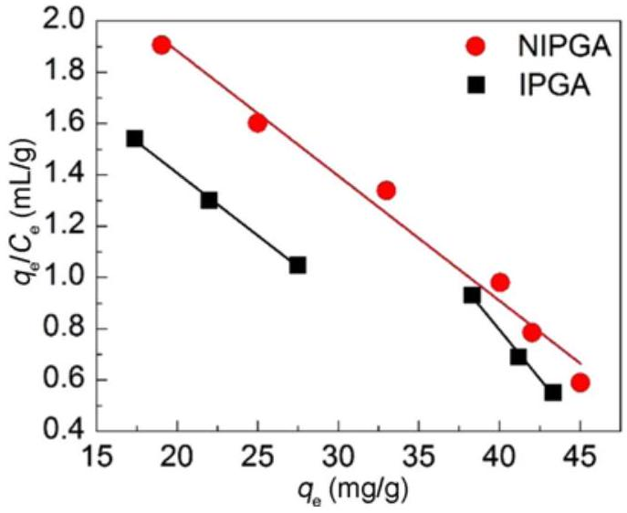
Figure 9. Scatchard analysis of IPGA and NIPGA for Cr(VI) adsorption.

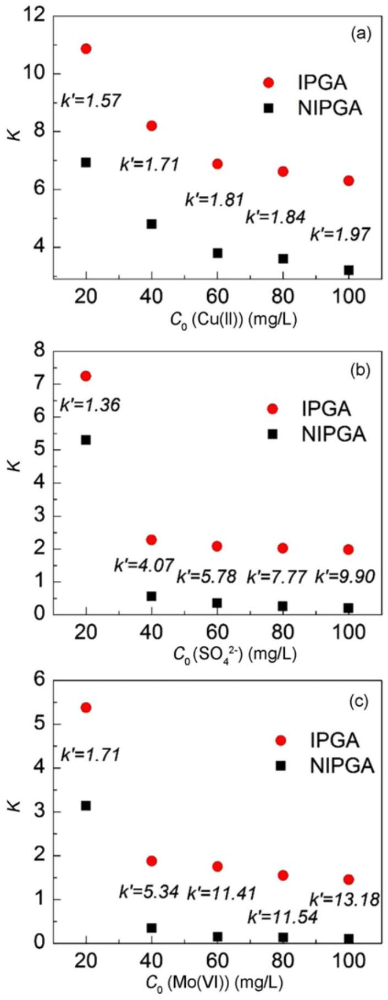
Figure 10. Effect of the (a) $\mathrm{Cu}(\mathrm{II})$, (b) $\mathrm{SO}_{4}{ }^{2-}$, and (c) Mo(VI) competitive ions on $K$ and $K^{\prime}$ of IPGA and NIPGA for Cr(VI) adsorption.

charge, and three-dimensional structure.
Adsorption Mechanism
To understand the mechanisms of Cr(VI) adsorption on IPGA, the XPS spectra of IPGA fibers after Cr(VI) adsorption was recorded. The survey spectrum displays four main peaks, which shows the presence of C, N, O, and Cr in the sample. The N 1s signal (Figure 11(b)) was fitted with three peaks. The peaks at 398.2 and 399.0 eV were assigned to $\mathrm{NH}_{2}$ and N-H, respectively, and the peak at 399.9 eV was attributed to the amine-Cr complex. The coordination of the amine groups to Cr(VI) involves sharing of electrons of N atom with Cr(VI) ions. As a result, the outer electron pair of N moves, the electron cloud density decreases, and a new characteristic peak at higher binding energy, 399.9 eV, appears. Figure 11(c) shows the high-resolution O 1s spectrum. The O 1s signal was fitted with three peaks. The peak at 533.2 eV was attributed to the complex made between oxygen-containing groups of IPGA and Cr species, whereas the peaks at 532.1 and 531.6 eV were attributed to $\mathrm{O}=\mathrm{C}$ and C-O-C, respectively [40]. Cr 2p3/2 signal was fitted with two peaks at 577.0 and 580.0 eV, indicating that part of Cr(VI) was reduced to Cr(III). In line with the previous studies, it can be affirmed that the amine groups can act as electron donors that reduce Cr(VI) into Cr(III) [40]. However, the redox potential of amino groups on IPGA may not be high enough to totally convert the adsorbed Cr(VI) into Cr(III) [41].
Reusability
The reusability of IPGA fibers for Cr(VI) adsorption was investigated. The adsorption experiments were conducted in batch mode. Typically, IPGA fibers were placed into Cr(VI) solution and sonicated for adsorption. The adsorption conditions were: temperature at 30 °C, Cr(VI) concentration of $100 \mathrm{mg} / l$ and volume of $50 \mathrm{ml}(\mathrm{pH}=3)$. After 90 min , IPGA fibers were removed and Cr(VI) was eluted using dilute NaOH solution (0.5 mol/l) several times until Cr(VI) was not detected in the elute solution. The elute was collected and the concentration of Cr(VI) was analyzed using ICP-OES, then the Cr(VI) adsorption capacity was calculated. After regeneration, rinsing with water, and dried, IPGA fibers were used in the next adsorption-regeneration cycle. The results of 6 cycles are shown in Figure 12. Therefore, Cr(VI) adsorption capacity slightly decreases after 6 cycles, indicating that IPGA fibers are stable and have potential for practical application.

## Conclusion

In summary, this work proposes new IPGA imprinted fibers prepared by suspension graft polymerization and Cr(VI) ion-imprinting technology. The fibers were grafted with two monomers (GMA and AM) and the synthesis conditions affecting the grafting percentage were systematically studied. The pristine and modified fibers were carefully characterized and then the adsorption ability of the imprinted fibers towards Cr(VI) was investigated. The results showed that the best modified fibers were obtained at a GMA: AM monomer ratio of 1.2: 1, a total monomer content of 60 \%, a dispersant concentration of $8 \mathrm{ml} / \mathrm{g}$, and an interfacial agent

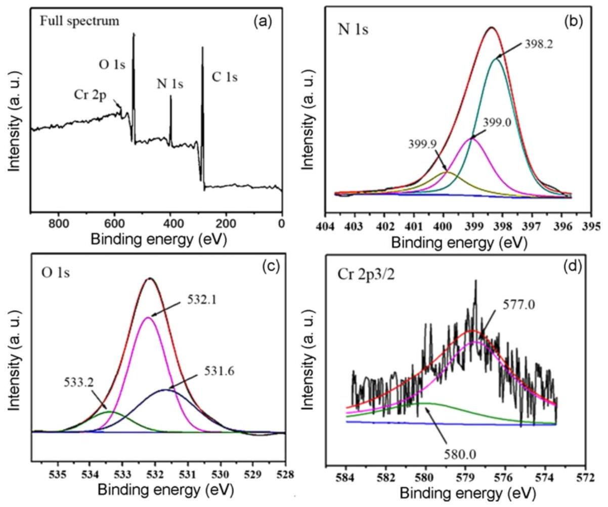
Figure 11. XPS spectra (a) full spectra, (b) N 1s, (c) O 1s, and (d) Cr 2p3/2) of IPGA after Cr(VI) adsorption.

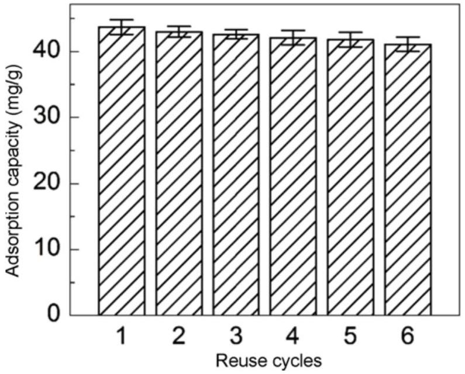
Figure 12. Variation of Cr(VI) adsorption capacity after 6 cycles.

concentration of $5 \mathrm{ml} / \mathrm{g}$. Under these conditions, the grafting percentages of GMA and AM were of 16.4 and 10.6 \%, respectively. The results of FT-IR, SEM, TGA, and water contact angle characterizations demonstrated the successful preparation of IPGA. The pH was an important factor affecting the adsorption of Cr(VI) on IPGA, the maximum adsorption capacity being at a pH value of 3, and the adsorption at equilibrium was 43.2 mg/g at 90 min. It was found that the adsorption of Cr(VI) on IPGA was consistent with the Langmuir model, involving the formation of a monolayer. The thermodynamics results revealed that the adsorption of Cr(VI) on IPGA is spontaneous and endothermic. The Scatchard analysis showed the presence of both specific and non-specific adsorption sites on the IPGA surface, whereas the corresponding non-imprinted fibers have only non-specific adsorption sites. The IPGA exhibited selectivity towards Cr(VI) in the presence of competing Cu(II) and $\mathrm{SO}_{4}{ }^{2-}$ ions. However, the experimental studies revealed that the competitive effect of the $\mathrm{SO}_{4}{ }^{2-}$ is more obvious than that of Cu(II). The adsorption mechanism was established based on XPS analysis performed for the IPGA fibers loaded with Cr(VI) The XPS results showed that N and O elements in functional groups participate to the adsorption process of Cr(VI), and the adsorption mechanism involved the electrostatic attraction between Cr(VI) and functional groups while a part of Cr(VI) was reduced into Cr(III).

## Acknowledgements

This study was supported by National Natural Science Foundation of China (Grant Number 21676144).

## References

1. Z. Zhou, X. Liu, M. Zhang, J. Jiao, H. Zhang, J. Du, B.

Zhang, and Z. Ren, Sci. Total Environ., 699, 134334 (2020).

2. F. He, Z. Lu, M. Song, X. Liu, H. Tang, P. Huo, W. Fan, H. Dong, X. Wu, and G. Xing, Appl. Surface Sci., 483, 453 (2019).
3. D. Kong, F. Zhang, K. Wang, Z. Ren, and W. Zhang, Ind. Eng. Chem. Res., 53, 4434 (2014).
4. G. Bayramoglu and M. Y. Arica, J. Hazard. Mater., 187, 213 (2011).
5. R. Huang, X. Ma, X. Li, L. Guo, X. Xie, M. Zhang, and J. Li, J. Colloid Interface Sci., 514, 544 (2018).
6. M. Y. Zhang, R. F. Huang, X. G. Ma, L. H. Guo, Y. Wang, and Y. M. Fan, Anal. Bioanal. Chem., 411, 7165 (2019).
7. Y. Chen, X. Ma, M. Huang, J. Peng, and C. Li, Analytical Methods, 8, 824 (2016).
8. M. Ghanei-Motlagh and M. A. Taher, Chem. Eng. J., 327, 135 (2017).
9. S. Hassanpour, M. Taghizadeh, and Y. Yamini, J. Polym. Environ., 26, 101 (2018).
10. Z. Ren, D. Kong, K. Wang, and W. Zhang, J. Mater. Chem. A, 2, 17952 (2014).
11. Z. Lu, G. Zhou, M. Song, X. Liu, H. Tang, H. Dong, P. Huo, F. Yan, P. Du, and G. Xing, Appl. Catal. B: Environ., 268, 118433 (2020).
12. Z. Lu, G. Zhou, M. Song, D. Wang, P. Huo, W. Fan, H. Dong, H. Tang, F. Yan, and G. Xing, J. Mater. Chem. A, 7, 13986 (2019).
13. L. Zhang, S. Yang, J. Qian, and D. Hua, Ind. Eng. Chem. Res., 56, 1860 (2017).
14. T. Li, S. Chen, H. Li, Q. Li, and L. Wu, Langmuir, 27, 6753 (2011).
15. M. A. Söylemez, M. Barsbay, and O. Güven, Radiat. Phys. Chem., 142, 77 (2018).
16. Z. Luo, J. Xu, D. Zhu, D. Wang, J. Xu, H. Jiang, W. Geng, W. Wei, and Z. Lian, Polymers, 11, 1508 (2019).
17. Z. Li, L. Wang, Y. Ma, and W. Yang, Chinese Chem. Lett., 26, 1351 (2015).
18. F. Liang, H. Yuan, Q. Shao, and W. Song, Des. Monomers Polym., 21, 130 (2018).
19. Q. Zhou, M. Li, X. Yao, Z. Lian, C. Zhang, W. Wei, and J. Huang, Fiber. Polym., 15, 2238 (2014).
20. Y. Zheng, S. Zhao, L. Cheng, and B. Li, Polym. Bull., 64, 771 (2010).
21. R. Tao, Q. Pang, T. Xu, L. Xu, X. Yang, and X. Zhu, J.

Appl. Polym. Sci., 137, 48300 (2020).

22. T. B. Mostafa, J. Appl. Polym. Sci., 111, 11 (2009).
23. Z. Li, Y. Ma, and W. Yang, J. Appl. Polym. Sci., 129, 3170 (2013).
24. D. Zhao, L. Wang, R. Zhang, Y. Ma, D. Chen, C. Zhao, and W. Yang, Polym. Eng. Sci., 58, 86 (2018).
25. Y. Kong, Y. Li, G. Hu, J. Lin, D. Pan, D. Dong, E. Wujick, Q. Shao, M. Wu, J. Zhao, and Z. Guo, Polymer, 145, 232 (2018).
26. M. Guo, C. Zhang, J. Xu, Z. Luo, and W. Wei, Fiber. Polym., 17, 1123 (2016).
27. L. He, Y. Su, Y. Zheng, X. Huang, L. Wu, Y. Liu, Z. Zeng, and Z. Chen, J. Chromatogr. A, 1216, 6196 (2009).
28. F. He, Z. Lu, M. Song, X. Liu, H. Tang, P. Huo, W. Fan, H. Dong, X. Wu, and S. Han, Chem. Eng. J., 360, 750 (2019).
29. S. Saxena, A. R. Ray, and B. Gupta, J. Appl. Polym. Sci., 116, 2884 (2010).
30. Y. Zheng, H. Liu, P. V. Gurgel, and R. G. Carbonell, J. Membr. Sci., 364, 362 (2010).
31. Y. Kong, Y. Li, G. Hu, J. Lin, D. Pan, D. Dong, E. Wujick, Q. Shao, M. Wu, J. Zhao, and Z. Guo, Polymer, 145, 232 (2018).
32. L. S. Balistrieri and J. W. Murray, Am. J. Sci., 281, 788 (1981).
33. G. Bayramoglu and M. Y. Arica, J. Hazard. Mater., 187, 213 (2011).
34. M. Etemadi, S. Samadi, S. S. Yazd, P. Jafari, N. Yousefi, and M. Aliabadi, Int. J. Biol. Macromol., 95, 725 (2017).
35. J. Fang, Z. Gu, D. Gang, C. Liu, E. S. Ilton, and B. Deng, Environ. Sci. Technol., 41, 4748 (2007).
36. M. M. Motsa, J. M. Thwala, T. A. M. Msagati, and B. B. Mamba, Phys. Chem. Earth, 36, 1178 (2011).
37. A. Baraka, P. J. Hall and M. J. Heslop, React. Funct. Polym., 67, 585 (2007).
38. A. D. Gupta, S. Pandey, V. K. Jaiswal, V. Bhadauria, and H. Singh, Carbohydr. Polym., 222, 114964 (2019).
39. P. Liu, H. An, Y. Ren, J. Feng, and J. Ma, Chem. Eng. J., 349, 176 (2018).
40. G. Dognani, P. Hadi, H. Ma, F. C. Cabrera, A. E. Job, D. L. S. Agostini, and B. S. Hsiao, Chem. Eng. J., 372, 341 (2019).
41. S. Yu, G. Yuan, H. Gao, and Y. Liao, J. Mater. Sci., 55, 163 (2020).

[^0]:    *Corresponding author: wjwei@njtech.edu.cn
    *Corresponding author: lianzy1985@163.com

