# Synthesis of Functional Polypropylene Via Solid-Phase Grafting Soft Vinyl Monomer and Its Mechanism 

Jian Wang, Dengfei Wang, Wei Du, Enguang Zou, Qun Dong Department of Chemistry and Chemical Engineering, Daqing Petroleum Institute, Daqing 163318, China

Received 14 August 2008; accepted 2 January 2009
DOI 10.1002/app. 30179
Published online 17 April 2009 in Wiley InterScience (www.interscience.wiley.com).

#### Abstract

Solid-phase grafting of a soft vinyl monomer, butyl methylacrylate (BMA), onto polypropylene (PP) matrixes with 2,2'-azobisisobutyronitrile (AIBN) as initiator was carried out to enhance the polarity of polymer. Soft vinyl monomer was a novel notion in grafting modification of PP. Effects of swell time, BMA concentration, AIBN concentration, grafting reaction time, and temperature on grafting percentage $\left(G_{p}\right)$ and grafting efficiency $\left(G_{e}\right)$ were examined. The optimal conditions of grafting reaction were obtained: swell time of 60 min, BMA concentration of 6 wt \%, AIBN concentration of 0.05 wt \%, reaction temperature of 85°C, and reaction time of 2 h. The grafting samples were investigated by such characterization techniques as Fourier transform infrared spectroscopy (FTIR), thermal gravimetric analysis (TGA), and scanning electron microscope (SEM) analysis. FTIR results

indicated that BMA was actually grafted onto PP backbone. TGA results showed that the decomposition temperature increases with addition of BMA into PP backbone. SEM results indicated that the surfaces of PP- $g$-BMA had a markedly bumpy texture, whereas the pure PP surface was very smooth. Water contact angle results showed that the polarity and hydrophilicity of PP were improved effectively. Compared with the traditional monomer MAH, $G_{p}$, and $G_{e}$, melt flow rate and mechanical property results all indicated that the soft vinyl monomer had a many advantages in the modification of PP. In the end, the mechanism of solid grafting was discussed. © 2009 Wiley Periodicals, Inc. J Appl Polym Sci 113: 1803-1810, 2009

Key words: soft vinyl monomer; polypropylene; butyl methylacrylate; solid-phase grafting

## INTRODUCTION

Polypropylene (PP) is one of the most widely used plastics in automotive, furniture, packaging, and other fields due to its excellent physical and chemical properties, along with low cost. However, PP has its inherent disadvantages such as low surface energy, lack of chemical functionality, and poor compatibility with synthetic polar polymers, which restrict its further applications. This can be resolved through grafting copolymerization, a well-established method for polyolefin modification. ${ }^{1-5}$

Grafting modification of PP has been widely investigated in past decades to modify the chemical structure of its backbone. Several techniques such as the solution process, melt process, and solid-phase grafting process have been reported, in which solidphase grafting is most promising. ${ }^{6-9}$ The main advantage of solid-state grafting of PP is that degradation of PP via $\beta$-scission reaction at temperature close to $100^{\circ} \mathrm{C}$, which would take place extensively when PP is processed in melt state, can be neglected. Most of all, the solid-phase grafting process does not

[^0]Journal of Applied Polymer Science, Vol. 113, 1803-1810 (2009) © 2009 Wiley Periodicals, Inc. need excess solvent; the modified PP practically retains its original versatile properties. ${ }^{10}$

In most published literature, ${ }^{11-15}$ the general standard of choosing grafting-monomer was grafting percentage of copolymer, but little attention was paid to the physical properties of grafting products. Maleic anhydride (MAH) is a common vinyl monomer widely used to graft onto polypropylene matrix. However, due to its low reactivity and structural confinement, the content of anhydride is very low in grafting copolymer (generally lower than 1 wt \%); the crosslinking and degradation often occur during the grafting process, thus leading to a limited degree of functionality and polarity. Besides, the toxicity of MAH also restricts its utility and adds difficulty in the manipulating process.

The soft vinyl monomers used in grafting modification of PP is a novel notion, and an excellent modified polymer may be obtained by introducing them into grafting modification of PP. ${ }^{16-19}$ The term "soft vinyl monomer" means the addition of polymerizable monomers, which, if homopolymerized, would yield a homopolymer having a glass transition temperature $\left(T_{g}\right)$ less than $25^{\circ} \mathrm{C} .^{19}$ Suitable examples of soft vinyl monomer include esters of unsaturated acids and saturated alcohols having from 3 to 15 carbons, such as $n$-butyl acrylate (BA),

TABLE I
$\boldsymbol{T}_{\boldsymbol{g}}$ Values of Some Soft Vinyl Monomers
| Soft vinyl monomer | $T_{g}\left({ }^{\circ} \mathrm{C}\right)$ | Soft vinyl monomer | $T_{g}\left({ }^{\circ} \mathrm{C}\right)$ |
| :--- | :--- | :--- | :--- |
| $n$-Butyl acrylate | -56 | 2-Hydroxypropyl acrylate | -7 |
| Ethyl acrylate | -24 | Methyl acrylate | 6 |
| 2-Ethylhexyl acrylate | -15 | $n$-Butyl methacrylate | 22 |

2-ethylhexyl acrylate (HEA), and $n$-butyl methacrylate (BMA). The $T_{g}$ of some soft vinyl monomers in common use are listed in Table I. ${ }^{20}$ Soft vinyl monomer can polymerize into long flexile branches that regulate the flexibility of PP, reducing the degradation and crosslinking. Moreover, routine consideration of polarity and grafting percentage and grafting efficiency are also satisfied.

Although BMA as a soft vinyl monomer is very reactive, its use for PP grafting has hardly been explored. In this work, grafting copolymer PP-g-BMA was synthesized and characterized. Mechanical property, thermal property, morphology, and hydrophilicity of the products were studied, and very satisfactory results were obtained in comparison with common vinyl monomer MAH system. As far as we know, little attention has been paid to introducing soft vinyl monomer in preparing a grafting copolymer. Therefore it is of significances for academic and industrial researchers.

## EXPERIMENTAL

## Materials

Porous polypropylene granule (T30s) was supplied by Daqing Petrochemical (Daqing, China). This granular PP was capable of absorbing a larger amount of liquid monomer than could the one in the films, therefore facilitating material feeding. BMA monomer (analytical grade) and 2,2'-azobisisobutyronitrile (AIBN) initiator (analytical grade) were commercially available from the Shenyang Donghua Chemical Company (Shenyang, China). BMA was purged to remove hydroquinone inhibitor, using an inhibitor remover disposable column (Aldrich Chemical) and distilled under reduced pressure prior to use. AIBN was recrystallized twice from methanol. Pure BMA and AIBN were stored at 0°C before use. MAH monomer (chemically pure reagent), commercial methanol, xylene, and acetone were used as received.

## Grafting process

The solid-phase grafting process was performed in a three-necked flask equipped with a twin-blade mechanical stirrer operated at 100 rpm, a nitrogen inlet, and a thermometer. The temperature of the flask was maintained with an accuracy of ±1.0°C. First, the reactor was flushed with nitrogen for 3-5 min at room temperature; porous PP granules were then added, followed by a mixed solution of initiator, monomer, and xylene. The solution was then agitated to swelling in an oil bath at the given temperature for 60 min to ensure that this mixture was absorbed by the PP granules. Subsequently the temperature was raised to start the grafting reaction in a nitrogen atmosphere.

## Purification of PP- $\boldsymbol{g}$-BMA

Before characterization, PP- $g$-BMA samples were purified by Soxhlet extraction in acetone for 12 h to remove BMA homopolymer, xylene, and initiator, then dried in vacuo at 50°C for 24 h. After drying, the extracted samples were weighed and reextracted until the weight of the samples was constant. To prove that BMA homopolymer and other small molecules were extracted, the extracted PP samples were purified in this way: dissolving in refluxing toluene at a concentration of 5\% (w/v) and then precipitating in three volumes of acetone at room temperature. The dissolving-precipitating procedure was conducted three times to remove poly (butyl methacrylate), which might be formed in the pores of PP granules. The precipitated samples were dried in vacuo at 50°C for 24 h. It was found that the weight was still constant. Therefore it was assumed that monomer and homopolymer were removed completely after extraction process.

## Calculation of grafting percentage and grafting efficiency

Grafting percentage ( $G_{p}$ ) and grafting efficiency ( $G_{e}$ ) were calculated according to the following equations:

$$
G_{p}(\%)=\frac{m_{1}-m_{0}}{m_{0}} \times 100 ; G_{e}(\%)=\frac{m_{1}-m_{0}}{m_{2}} \times 100
$$

where $m_{1}$ is sample mass after extraction, $m_{0}$ is original mass of PP in sample, and $m_{2}$ is total mass of feeding monomers.

Many previous studies ${ }^{21-23}$ have employed the ratio of FTIR characteristic peaks of monomer to internal standard peaks of PP method or titration method to calculate grafting percentage. It must be stressed that the conversion ratio obtained by gravimetry or by two methods mentioned above was in good agreement. Picchioni proved this when he grafted St onto PP. ${ }^{24-26}$ Therefore the gravimetry mode is adopted to calculate grafting percentage in this work.

## Gel content of PP- $\boldsymbol{g}$-BMA

PP might crosslink when a common vinyl monomer is grafted onto it, especially if the grafting percentage is high. If crosslinking occurs, the structures and properties of copolymers are deteriorated to a great extent, which is not what we expected. Thus the crosslinking issue was emphasized in this work. Detecting procedures were addressed as follows: 1.0 g purified PP-g-BMA was added into a given volume of xylene at 80°C and agitated to dissolve for 1 h. As is known, xylene did not dissolve crosslinked PP but pure PP and PP- $g$-BMA. To further prove that there was no gel in the PP- $g$-BMA sample, another 1.0 g purified PP- $g$-BMA was weighed and packed in a copper net with 150 mesh holes. The copper net was weighed beforehand. Then the net was put into a flask with excess hot xylene inside. After refluxing for 1 h, the net was taken out and washed with acetone, then dried in vacuo at 100°C for 24 h. Thereafter, the net was weighed again. The solution was poured into acetone slowly to precipitate PP- $g$-BMA.

## FTIR spectroscopy

FTIR spectra were recorded on a Perkin-Elmer 1760X FTIR Spectrometer from 4000 to $400 \mathrm{~cm}^{-1}$ with a $0.5 \mathrm{~cm}^{-1}$ resolution. Samples (0.1-0.2 g) were processed in $100-\mu \mathrm{m}$-thick films by compression molding between Teflon-covered aluminium sheets under 1 MPa at 200°C for 5 s.

## TGA analysis

TGA was carried out on a Perkin-Elmer RIS Diamond TG-DTA from room temperature to 500°C with a heating rate of 10°C/min under a dry nitrogen atmosphere.

## SEM analysis

Samples were fractured under liquid nitrogen and coated with chromium (3 nm) before measurement. The fracture surfaces of samples were observed with a JEOL JSM-6360LA scanning electron microscope operated at 15 kV.

## Contact angle measurements

Contact angles of PP and PP- $g$-BMA were determined using a JC2000C1 contact angle goniometer (Shanghai Zhongchen, Shanghai, China) at ambient temperature. Sample films were processed the same as the ones used in FTIR characterization. All measurements were preformed using the sessile drop method and made with drops of $1 \mu \mathrm{~L}$ distilled water

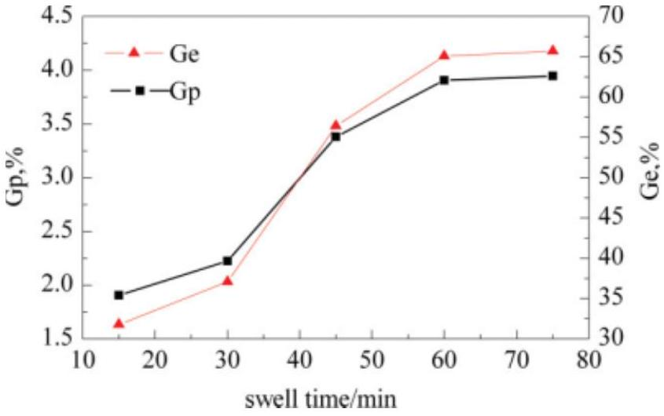
Figure 1 Influence of swell time on $G_{p}$ and $G_{e}$ (mass ratio of PP/BMA/ $\mathrm{AIBN}=100: 6: 0.3$; reaction time $=2 \mathrm{~h}$; and reaction temperature $=80^{\circ} \mathrm{C}$ ).

after about 15 s. The reported values were an average of eight measurements at various places on same sample.

## MFR and mechanical properties measurements

MFR was measured with a Takara X-416 Melt Indexer, (Takara Thermistor Instruments, Japan) Measurement was performed at 230°C with a load of 2.16 kg. Tensile properties of samples were investigated on a universal tensile tester (Instron 1122) using a load of 20.0 kg. Elongation at break and tensile strength were measured at a crosshead speed of 50 mm/min. An average of five test results was calculated and reported.

## RESULTS AND DISCUSSION

Experimental conditions such as reaction time and temperature, monomer, and initiator concentration have significant effects on grafting process. Because porous PP granules were first swollen by the solution of BMA/xylene/initiator, the swell time also has important effect on grafting reaction.

Figure 1 shows $G_{p}$ and $G_{e}$ versus swell time with diffusion of the solution of BMA/xylene/initiator. The ability of BMA/xylene/initiator solution is to etch and swell the polymer micropore and surface so that it can provide more surfacial areas for absorbing monomer and initiator uniformly. The results indicate that $G_{p}$ and $G_{e}$ both reach a constant value after 60 min, although the curves initially increase rapidly. In other words, diffusion equilibrium can be reached within 60 min. Since grafting copolymerization is a diffusion-controlled process, increase of the swell time benefits monomer diffusion into polymer matrix, leading to the presence of sufficient monomer units in grafting zone, which makes a contribution to increase of $G_{p}$ and $G_{e}$. When

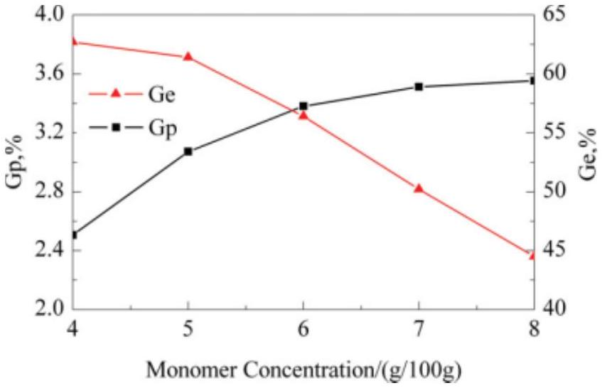
Figure 2 Influence of monomer concentration on $G_{p}$ and $G_{e}$ with the swell time of 60 min (other conditions were the same as those in Fig. 1).

the diffusion equilibrium is obtained, $G_{p}$ and $G_{e}$ will be constant, independent of time.

The influence of monomer concentration on $G_{p}$ and $G_{e}$ is shown in Figure 2. As was said in the Experimental section, BMA and AIBN were first mixed with xylene solution to agitating-swell the polymer matrix. $G_{p}$ increases quickly as the concentration of BMA increases initially; but when BMA concentration is over 6 wt \%, $G_{p}$ is constant. In contrast, $G_{e}$ is ceaselessly depressed. A similar trend was observed by Sathe. ${ }^{27}$ The initial increase in $G_{p}$ for higher BMA concentration may be attributed to increase of the number of BMA molecules diffusing and reaching the free radical sites on PP backbone. As is well known, PP is a semicrystalline polymer, and grafting copolymerization can only occur at amorphous and inner micropore areas, and their amounts are definite. Furthermore, the free radical sites on PP backbone are initiated by thermal decomposition of AIBN, and the number of active sites is also limited, so $G_{p}$ will be balanced and $G_{e}$ will be descended. This result also indicates that the possibility of BMA homopolymer formation increases as the concentration of BMA increases.

Effects of initiator concentration on $G_{p}$ and $G_{e}$ are shown in Figure 3. The observed curves are typical for grafting copolymerization reaction via chain transfer. The initial increase in $G_{p}$ and $G_{e}$ is caused by an increase in the concentration of initial radicals formed through decomposition of AIBN. Thus, the higher the concentration of initial radicals is, the more the chain transfer to polymer backbone. However, an excess of initiator increases the trend of BMA homopolymerization, which tends to terminate grafting reaction. As a result, $G_{p}$ and $G_{e}$ will drop.

Grafting reaction dependence on reaction time is presented in Figure 4. After an initial sharp increase of $G_{p}$ and $G_{e}$, the curves become parallel. This result shows that more than 55 wt \% BMA is grafted onto

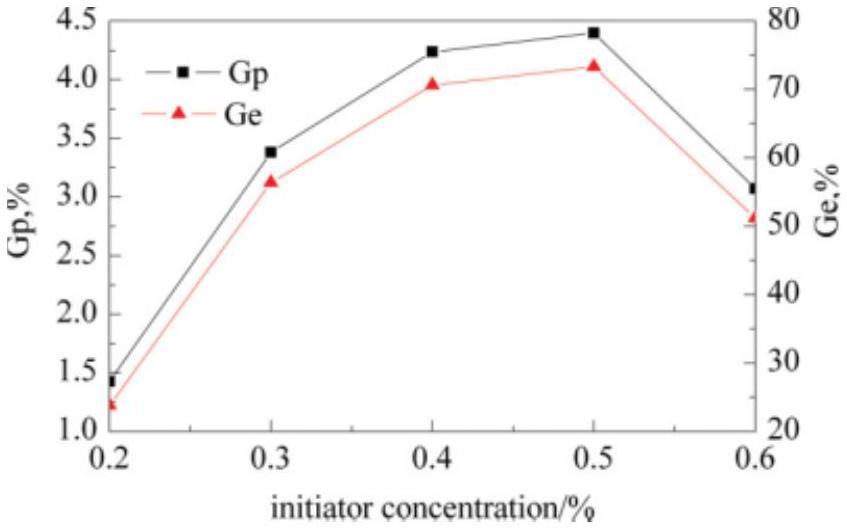
Figure 3 Influence of initiator concentration on $G_{p}$ and $G_{e}$ with the swell time of 60 min (other conditions were the same as those in Fig. 1).

PP chains after 2 h, and the rest is consumed in different ways: nonreaction, homopolymerization, or crosslinking.

Effects of temperature on $G_{p}$ and $G_{e}$ of grafting BMA onto PP chains were studied with the temperature varying from 75 to 95°C. The results are shown in Figure 5. It can be seen that as temperature increases, $G_{p}$ and $G_{e}$ initially increase and pass through a maximum, then begin to decrease. Because of reactive species (PP. radicals) mainly originated from decomposition of AIBN, high reaction temperature will lead to complete decomposition of AIBN and thereby provide enough reactive sites to initiate grafting copolymerization. However, if the temperature is too high, the decomposition rate of the initiator will exceed the grafting polymerization rate and monomers will be initiated to homopolymerize, so $G_{p}$ and $G_{e}$ decrease.

## Gel content of PP-g-BMA

As stated, the crosslinking issue of PP- $g$-BMA should be addressed first in this work. The grafted

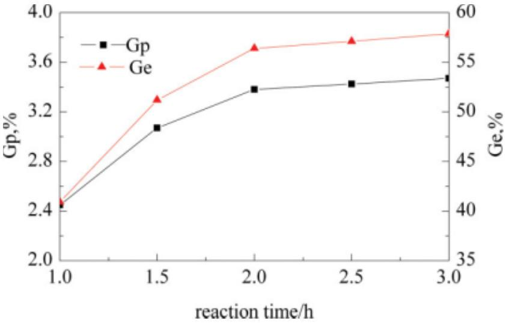
Figure 4 Influence of reaction time on $G_{p}$ and $G_{e}$ with the agitating swell time of 60 min (other conditions were the same as those in Fig. 1).

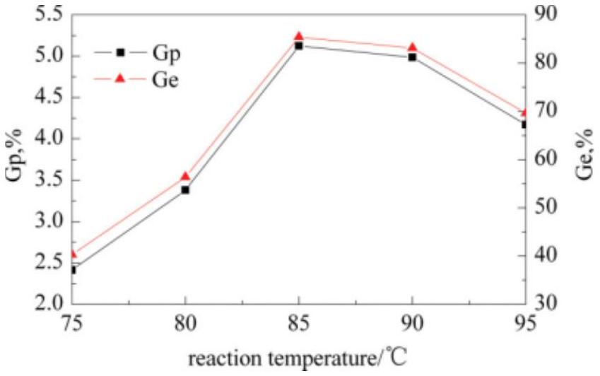
Figure 5 Influence of reaction temperature on $G_{p}$ and $G_{e}$ with the swell time of 60 min (other conditions were the same as those in Fig. 1).

polymer was dissolved completely within 30 min without any gel; the weight of the copper net and the purified PP- $g$-BMA did not change, indicating that BMA as a soft vinyl monomer was grafted onto the PP, and no crosslinking occurred during the grafting process.

## FTIR spectroscopy analysis

IR spectra of pure PP and PP- $g$-BMA are shown in Figure 6. BMA grafted onto PP film was confirmed by FTIR analysis. The presence of a band at 1728 $\mathrm{cm}^{-1}$ in the spectrum of the grafted polymer (characterizing the ester group of BMA), which is absent from the spectrum of pure PP, indicates that BMA was grafted onto PP.

## Thermal gravimetric analysis

Figure 7 shows TGA results of PP- $g$-BMA samples with different grafting percentage. It is evident that

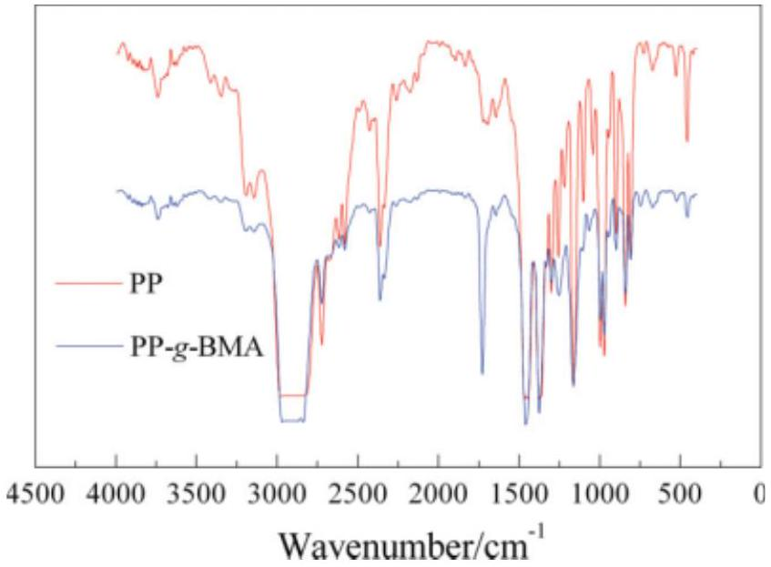
Figure 6 FTIR spectra of pure PP and PP- $g$-BMA ( $G_{p}=$ 5.08\%).

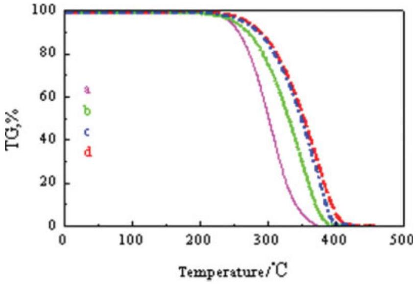
Figure 7 TGA curves of pure PP (a), 1.61\% PP- $g$-BMA (b), 3.43\% PP- $g$-BMA (c), and 5.08\% PP- $g$-BMA (d).

grafted samples have a higher-onset thermal degradation temperature and a lower weight loss at a particular temperature than pure PP. It must be stressed that the more the grafting percentage is, the higher the thermal degradation temperature is. This interesting phenomenon indicates that PP- $g$-BMA has better thermal stability than pure PP. Clearly, the improved thermal stability of PP- $g$-BMA results from incorporated BMA branches. This is because the poly(butyl methylacrylate) branch is thermally more stable than tertiary hydrogen atoms on the PP backbone, which results in retardation of degradation rate of PP.

## SEM measurements

Figure 8 shows SEM micrographs of cryogenically fractured surfaces of pure PP, as well as different grafting percentages of PP- $g$-BMA samples. The morphologies of grafted PP [Fig. 8(b,c)] are significantly different from those of pure PP [Fig. 8(a)]. The grafted surfaces show a markedly bumpy texture, whereas pure PP surfaces are very smooth. The bumpy surfaces of grafted layers can be explained by the difference in the swelling ability of xylene/ initiator/BMA for amorphous and semicrystalline sites on the PP matrix, resulting in different degrees of grafting in amorphous and micropore regions of PP. Figure 8(b,c) also indicates that grafted molecules are heterogeneously distributed in PP matrix.

## Contact angle measurements

Measurement of contact angle between water and a film surface is one of the easiest ways to characterize the polarity and hydrophilicity of a film. When water is applied to the surface, the outermost surface layers interact with water. A hydrophobic surface with low free energy gives a high contact angle with

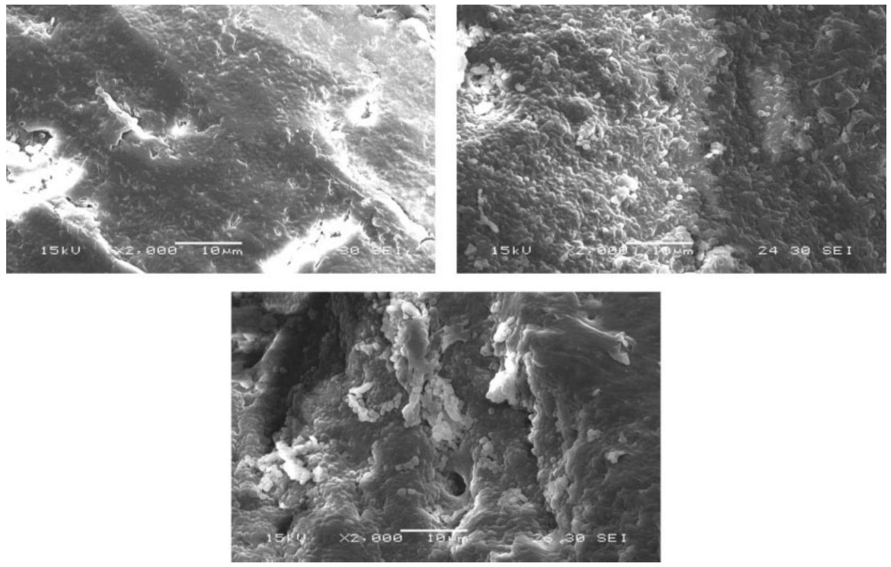
Figure 8 Scanning electron micrographs of pure PP and various grafting percentage of PP- $g$-BMA: (a) pure PP, (b) $G_{p}=$ $1.61 \%$, (c) $G_{p}=3.43 \%$.

water, whereas a wet high-energy surface allows the water droplets to spread, i.e., gives a low contact angle. In this study, the water contact angles of pure PP and PP- $g$-BMA were measured by contact angle goniometer, and the results are shown in Table II. As is seen, the contact angle decreases from 98° (pure PP) to 75°, indicating that the polarity and hydrophility of the polymer were improved efficiently.

## Comparison of different monomer systems

As addressed before, MAH is commonly used in grafting modification of PP. Therefore MAH as a common vinyl monomer was chosen in comparison with BMA. The differences of $G_{p}$ and $G_{e}$, MFR, tensile strength, and elongation at break of pure PP, PP- $g$-BMA, and PP- $g$-MAH at the same conditions are listed in Table III, respectively. The results in Table III show that $G_{p}$ and $G_{e}$ of grafted copolymer

TABLE II
Contact Angles of Pure PP and Different Grafting Percentage of PP- $g$-BMA
| $G_{p}$ (\%) | Pure PP | 1.61 | 4.25 |
| :--- | :--- | :--- | :--- |
| Contact angle $\left({ }^{\circ}\right)$ | 98 | 87 | 75 |

containing soft vinyl monomer, PP- $g$-BMA, are far higher than those of PP- $g$-MAH containing common vinyl monomer. Tensile strength and elongation at break of PP- $g$-BMA are similar to those of pure PP but far higher than those of PP- $g$-MAH. Interestingly, contrary results are shown in three MFR samples: the MFR of PP- $g$-MAH is highest, followed by that of PP- $g$-BMA; the lowest is pure PP. It is easy to understand: BMA as a soft vinyl monomer can improve the polarity of PP and retain its inherent properties, and MAH cannot tune the flexibility of PP backbone and degrades seriously. To further

TABLE III
Comparison of Different Monomer Systems on $G_{p}$ and $\boldsymbol{G}_{\boldsymbol{e} \boldsymbol{r}}$ MFR, and Mechanical Properties of Grafting Copolymer
| Sample | $G_{p} / G_{e}$ (\%) | MFR ( $\mathrm{g} \cdot 10 \mathrm{~min}^{-1}$ ) | Tensile strength (MPa) | Elongation at break (\%) |
| :--- | :--- | :--- | :--- | :--- |
| PP | - | 3.6 | 37.02 | 700 |
| PP-g-BMA | 4.25/70.8 | 6.5 | 36.79 | 640 |
| PP- $g$-MAH ${ }^{\text {a }}$ | 0.45/7.5 | 22 | 30.7 | 20 |

[^1]explain this phenomenon, we studied the morphology and microstructure of the composites by using different methods that will be reported later.

## Mechanism of grafting

In this study, solid-phase grafting is not only a surface grafting process but is also used for grafting onto inner and PP micropores. The mechanisms of grafting resemble that in solution grafting, but not all the same. In solution grafting process, grafting reaction takes place at the molecular level; so does the solid-phase grafting. The decomposition of initiator in the solid phase to form free radicals takes place at the molecular level, but the transport of radicals to PP and initiation of grafting takes place at the solid-liquid interface. The swell process can dif- fuse monomer and initiator uniformly into the spherical PP granules, so the whole solid-phase BMA grafting modification of PP can be divided into three steps as follows:

1. By using the porous polypropylene granules, the solution of AIBN/BMA/xylene can be diffused into micropores and surfaces of PP. Thus we can distinguish the transport process of components in the following steps: diffusion in the pores and surfaces of PP granules, absorption in the amorphous phase and micropores, and diffusion in the inner micropores and amorphous phase of microparticles.
2. The grafting mechanism of BMA onto polypropylene backbone with free radical initiation would involve the following steps:

A. Initiator decomposition
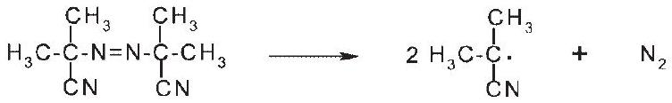

B. Intiation
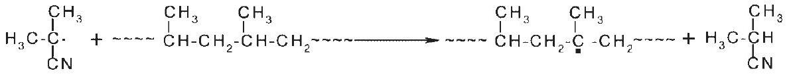

C. Propagtion
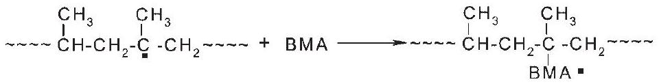

D. Chain transfer
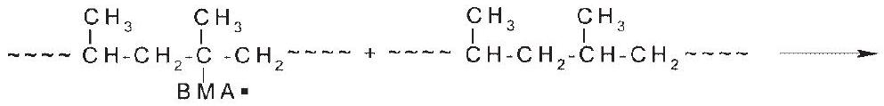

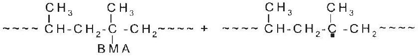
E. Termination

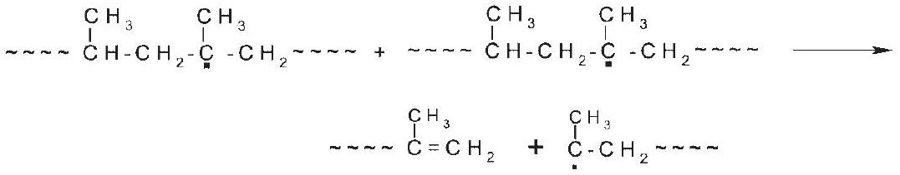
or,

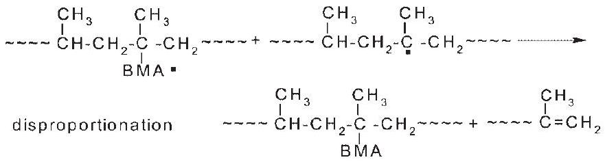
Journal of Applied Polymer Science DOI 10.1002/app

or
<img class="imgSvg" id = "mty9r32fi0eib1vr24n" src="data:image/svg+xml;base64,PHN2ZyBpZD0ic21pbGVzLW10eTlyMzJmaTBlaWIxdnIyNG4iIHhtbG5zPSJodHRwOi8vd3d3LnczLm9yZy8yMDAwL3N2ZyIgdmlld0JveD0iMCAwIDI1MyAxNTIuMjUwMTE5NTYzODkiIHN0eWxlPSJ3aWR0aDogMjUyLjU1MTE1Mjg0MDc5NjJweDsgaGVpZ2h0OiAxNTIuMjUwMTE5NTYzODlweDsgb3ZlcmZsb3c6IHZpc2libGU7Ij48ZGVmcz48bGluZWFyR3JhZGllbnQgaWQ9ImxpbmUtbXR5OXIzMmZpMGVpYjF2cjI0bi0xIiBncmFkaWVudFVuaXRzPSJ1c2VyU3BhY2VPblVzZSIgeDE9IjE4My43NDk5NTc2ODM1OTcwMiIgeTE9IjUyLjUwMDA1NjU0OTIxNjAxIiB4Mj0iMjA3Ljg4MDMzOTQ2NzI2MzMiIHkyPSI3Mi43NDc4ODc5MTM5NDUwNiI+PHN0b3Agc3RvcC1jb2xvcj0iY3VycmVudENvbG9yIiBvZmZzZXQ9IjIwJSI+PC9zdG9wPjxzdG9wIHN0b3AtY29sb3I9ImN1cnJlbnRDb2xvciIgb2Zmc2V0PSIxMDAlIj48L3N0b3A+PC9saW5lYXJHcmFkaWVudD48bGluZWFyR3JhZGllbnQgaWQ9ImxpbmUtbXR5OXIzMmZpMGVpYjF2cjI0bi0zIiBncmFkaWVudFVuaXRzPSJ1c2VyU3BhY2VPblVzZSIgeDE9IjE1Mi4yNDk5NTc2ODM2MDk3IiB5MT0iNTIuNTAwMDI4Mjc0NjAxNjUiIHgyPSIxODMuNzQ5OTU3NjgzNTk3MDIiIHkyPSI1Mi41MDAwNTY1NDkyMTYwMSI+PHN0b3Agc3RvcC1jb2xvcj0iY3VycmVudENvbG9yIiBvZmZzZXQ9IjIwJSI+PC9zdG9wPjxzdG9wIHN0b3AtY29sb3I9ImN1cnJlbnRDb2xvciIgb2Zmc2V0PSIxMDAlIj48L3N0b3A+PC9saW5lYXJHcmFkaWVudD48bGluZWFyR3JhZGllbnQgaWQ9ImxpbmUtbXR5OXIzMmZpMGVpYjF2cjI0bi01IiBncmFkaWVudFVuaXRzPSJ1c2VyU3BhY2VPblVzZSIgeDE9IjE1Mi4yNDk5NTc2ODM2MDk3IiB5MT0iNTIuNTAwMDI4Mjc0NjAxNjUiIHgyPSIxNTIuMjQ5OTg1OTU4MjI0MDQiIHkyPSIyMS4wMDAwMjgyNzQ2MTQzMzciPjxzdG9wIHN0b3AtY29sb3I9ImN1cnJlbnRDb2xvciIgb2Zmc2V0PSIyMCUiPjwvc3RvcD48c3RvcCBzdG9wLWNvbG9yPSJjdXJyZW50Q29sb3IiIG9mZnNldD0iMTAwJSI+PC9zdG9wPjwvbGluZWFyR3JhZGllbnQ+PGxpbmVhckdyYWRpZW50IGlkPSJsaW5lLW10eTlyMzJmaTBlaWIxdnIyNG4tNyIgZ3JhZGllbnRVbml0cz0idXNlclNwYWNlT25Vc2UiIHgxPSIxNTIuMjQ5OTI5NDA4OTk1MzQiIHkxPSI4NC4wMDAwMjgyNzQ1ODg5NiIgeDI9IjE1Mi4yNDk5NTc2ODM2MDk3IiB5Mj0iNTIuNTAwMDI4Mjc0NjAxNjUiPjxzdG9wIHN0b3AtY29sb3I9ImN1cnJlbnRDb2xvciIgb2Zmc2V0PSIyMCUiPjwvc3RvcD48c3RvcCBzdG9wLWNvbG9yPSJjdXJyZW50Q29sb3IiIG9mZnNldD0iMTAwJSI+PC9zdG9wPjwvbGluZWFyR3JhZGllbnQ+PGxpbmVhckdyYWRpZW50IGlkPSJsaW5lLW10eTlyMzJmaTBlaWIxdnIyNG4tOSIgZ3JhZGllbnRVbml0cz0idXNlclNwYWNlT25Vc2UiIHgxPSIxMjAuNzQ5OTU3NjgzNjIyMzgiIHkxPSI1Mi40OTk5OTk5OTk5ODczMSIgeDI9IjE1Mi4yNDk5NTc2ODM2MDk3IiB5Mj0iNTIuNTAwMDI4Mjc0NjAxNjUiPjxzdG9wIHN0b3AtY29sb3I9ImN1cnJlbnRDb2xvciIgb2Zmc2V0PSIyMCUiPjwvc3RvcD48c3RvcCBzdG9wLWNvbG9yPSJjdXJyZW50Q29sb3IiIG9mZnNldD0iMTAwJSI+PC9zdG9wPjwvbGluZWFyR3JhZGllbnQ+PGxpbmVhckdyYWRpZW50IGlkPSJsaW5lLW10eTlyMzJmaTBlaWIxdnIyNG4tMTEiIGdyYWRpZW50VW5pdHM9InVzZXJTcGFjZU9uVXNlIiB4MT0iMTUyLjI0OTkyOTQwODk5NTM0IiB5MT0iODQuMDAwMDI4Mjc0NTg4OTYiIHgyPSIxNzkuNTI5Njc2OTIyMDkxNjUiIHkyPSI5OS43NTAxMTk1NjM5MDI2OSI+PHN0b3Agc3RvcC1jb2xvcj0iY3VycmVudENvbG9yIiBvZmZzZXQ9IjIwJSI+PC9zdG9wPjxzdG9wIHN0b3AtY29sb3I9ImN1cnJlbnRDb2xvciIgb2Zmc2V0PSIxMDAlIj48L3N0b3A+PC9saW5lYXJHcmFkaWVudD48bGluZWFyR3JhZGllbnQgaWQ9ImxpbmUtbXR5OXIzMmZpMGVpYjF2cjI0bi0xMyIgZ3JhZGllbnRVbml0cz0idXNlclNwYWNlT25Vc2UiIHgxPSIxMjAuNzQ5OTU3NjgzNjIyMzgiIHkxPSI1Mi40OTk5OTk5OTk5ODczMSIgeDI9IjEyMC43NDk5ODU5NTgyMzY3MyIgeTI9IjIxIj48c3RvcCBzdG9wLWNvbG9yPSJjdXJyZW50Q29sb3IiIG9mZnNldD0iMjAlIj48L3N0b3A+PHN0b3Agc3RvcC1jb2xvcj0iY3VycmVudENvbG9yIiBvZmZzZXQ9IjEwMCUiPjwvc3RvcD48L2xpbmVhckdyYWRpZW50PjxsaW5lYXJHcmFkaWVudCBpZD0ibGluZS1tdHk5cjMyZmkwZWliMXZyMjRuLTE1IiBncmFkaWVudFVuaXRzPSJ1c2VyU3BhY2VPblVzZSIgeDE9IjEyMC43NDk5Mjk0MDkwMDgwMyIgeTE9IjgzLjk5OTk5OTk5OTk3NDYiIHgyPSIxMjAuNzQ5OTU3NjgzNjIyMzgiIHkyPSI1Mi40OTk5OTk5OTk5ODczMSI+PHN0b3Agc3RvcC1jb2xvcj0iY3VycmVudENvbG9yIiBvZmZzZXQ9IjIwJSI+PC9zdG9wPjxzdG9wIHN0b3AtY29sb3I9ImN1cnJlbnRDb2xvciIgb2Zmc2V0PSIxMDAlIj48L3N0b3A+PC9saW5lYXJHcmFkaWVudD48bGluZWFyR3JhZGllbnQgaWQ9ImxpbmUtbXR5OXIzMmZpMGVpYjF2cjI0bi0xNyIgZ3JhZGllbnRVbml0cz0idXNlclNwYWNlT25Vc2UiIHgxPSI4OS4yNDk5NTc2ODM2MzUwOSIgeTE9IjUyLjQ5OTk3MTcyNTM3Mjk0NCIgeDI9IjEyMC43NDk5NTc2ODM2MjIzOCIgeTI9IjUyLjQ5OTk5OTk5OTk4NzMxIj48c3RvcCBzdG9wLWNvbG9yPSJjdXJyZW50Q29sb3IiIG9mZnNldD0iMjAlIj48L3N0b3A+PHN0b3Agc3RvcC1jb2xvcj0iY3VycmVudENvbG9yIiBvZmZzZXQ9IjEwMCUiPjwvc3RvcD48L2xpbmVhckdyYWRpZW50PjxsaW5lYXJHcmFkaWVudCBpZD0ibGluZS1tdHk5cjMyZmkwZWliMXZyMjRuLTE5IiBncmFkaWVudFVuaXRzPSJ1c2VyU3BhY2VPblVzZSIgeDE9IjE3OS41Mjk2NDg2NDc0NzczIiB5MT0iMTMxLjI1MDExOTU2Mzg5IiB4Mj0iMTc5LjUyOTY3NjkyMjA5MTY1IiB5Mj0iOTkuNzUwMTE5NTYzOTAyNjkiPjxzdG9wIHN0b3AtY29sb3I9ImN1cnJlbnRDb2xvciIgb2Zmc2V0PSIyMCUiPjwvc3RvcD48c3RvcCBzdG9wLWNvbG9yPSJjdXJyZW50Q29sb3IiIG9mZnNldD0iMTAwJSI+PC9zdG9wPjwvbGluZWFyR3JhZGllbnQ+PGxpbmVhckdyYWRpZW50IGlkPSJsaW5lLW10eTlyMzJmaTBlaWIxdnIyNG4tMjEiIGdyYWRpZW50VW5pdHM9InVzZXJTcGFjZU9uVXNlIiB4MT0iMTc5LjUyOTY3NjkyMjA5MTY1IiB5MT0iOTkuNzUwMTE5NTYzOTAyNjkiIHgyPSIyMTAuNTUxMTUyODQwNzk2MiIgeTI9Ijk0LjI4MDM4MTc0MzM4MTk3Ij48c3RvcCBzdG9wLWNvbG9yPSJjdXJyZW50Q29sb3IiIG9mZnNldD0iMjAlIj48L3N0b3A+PHN0b3Agc3RvcC1jb2xvcj0iY3VycmVudENvbG9yIiBvZmZzZXQ9IjEwMCUiPjwvc3RvcD48L2xpbmVhckdyYWRpZW50PjxsaW5lYXJHcmFkaWVudCBpZD0ibGluZS1tdHk5cjMyZmkwZWliMXZyMjRuLTIzIiBncmFkaWVudFVuaXRzPSJ1c2VyU3BhY2VPblVzZSIgeDE9IjEyMC43NDk5Mjk0MDkwMDgwMyIgeTE9IjgzLjk5OTk5OTk5OTk3NDYiIHgyPSIxNDAuOTk3NjU4MzYzODAzOSIgeTI9IjEwOC4xMzA0Njc3MTU1NjQzNiI+PHN0b3Agc3RvcC1jb2xvcj0iY3VycmVudENvbG9yIiBvZmZzZXQ9IjIwJSI+PC9zdG9wPjxzdG9wIHN0b3AtY29sb3I9ImN1cnJlbnRDb2xvciIgb2Zmc2V0PSIxMDAlIj48L3N0b3A+PC9saW5lYXJHcmFkaWVudD48bGluZWFyR3JhZGllbnQgaWQ9ImxpbmUtbXR5OXIzMmZpMGVpYjF2cjI0bi0yNSIgZ3JhZGllbnRVbml0cz0idXNlclNwYWNlT25Vc2UiIHgxPSI3My40OTk5OTk5OTk5ODczMSIgeTE9Ijc5Ljc3OTc5NjM3NTg5NjM0IiB4Mj0iODkuMjQ5OTU3NjgzNjM1MDkiIHkyPSI1Mi40OTk5NzE3MjUzNzI5NDQiPjxzdG9wIHN0b3AtY29sb3I9ImN1cnJlbnRDb2xvciIgb2Zmc2V0PSIyMCUiPjwvc3RvcD48c3RvcCBzdG9wLWNvbG9yPSJjdXJyZW50Q29sb3IiIG9mZnNldD0iMTAwJSI+PC9zdG9wPjwvbGluZWFyR3JhZGllbnQ+PGxpbmVhckdyYWRpZW50IGlkPSJsaW5lLW10eTlyMzJmaTBlaWIxdnIyNG4tMjciIGdyYWRpZW50VW5pdHM9InVzZXJTcGFjZU9uVXNlIiB4MT0iNDIiIHkxPSI3OS43Nzk3NjgxMDEyODE5OSIgeDI9IjczLjQ5OTk5OTk5OTk4NzMxIiB5Mj0iNzkuNzc5Nzk2Mzc1ODk2MzQiPjxzdG9wIHN0b3AtY29sb3I9ImN1cnJlbnRDb2xvciIgb2Zmc2V0PSIyMCUiPjwvc3RvcD48c3RvcCBzdG9wLWNvbG9yPSJjdXJyZW50Q29sb3IiIG9mZnNldD0iMTAwJSI+PC9zdG9wPjwvbGluZWFyR3JhZGllbnQ+PGxpbmVhckdyYWRpZW50IGlkPSJsaW5lLW10eTlyMzJmaTBlaWIxdnIyNG4tMjkiIGdyYWRpZW50VW5pdHM9InVzZXJTcGFjZU9uVXNlIiB4MT0iNzMuNDk5OTk5OTk5OTg3MzEiIHkxPSI3OS43Nzk3OTYzNzU4OTYzNCIgeDI9Ijg5LjI1MDEwOTExOTA2MjE3IiB5Mj0iMTA3LjA1OTUzMzU5NDg4Nzk1Ij48c3RvcCBzdG9wLWNvbG9yPSJjdXJyZW50Q29sb3IiIG9mZnNldD0iMjAlIj48L3N0b3A+PHN0b3Agc3RvcC1jb2xvcj0iY3VycmVudENvbG9yIiBvZmZzZXQ9IjEwMCUiPjwvc3RvcD48L2xpbmVhckdyYWRpZW50PjwvZGVmcz48bWFzayBpZD0idGV4dC1tYXNrLW10eTlyMzJmaTBlaWIxdnIyNG4iPjxyZWN0IHg9IjAiIHk9IjAiIHdpZHRoPSIxMDAlIiBoZWlnaHQ9IjEwMCUiIGZpbGw9IndoaXRlIj48L3JlY3Q+PC9tYXNrPjxzdHlsZT4KICAgICAgICAgICAgICAgIC5lbGVtZW50LW10eTlyMzJmaTBlaWIxdnIyNG4gewogICAgICAgICAgICAgICAgICAgIGZvbnQ6IDE0cHggSGVsdmV0aWNhLCBBcmlhbCwgc2Fucy1zZXJpZjsKICAgICAgICAgICAgICAgICAgICBhbGlnbm1lbnQtYmFzZWxpbmU6ICdtaWRkbGUnOwogICAgICAgICAgICAgICAgfQogICAgICAgICAgICAgICAgLnN1Yi1tdHk5cjMyZmkwZWliMXZyMjRuIHsKICAgICAgICAgICAgICAgICAgICBmb250OiA4LjRweCBIZWx2ZXRpY2EsIEFyaWFsLCBzYW5zLXNlcmlmOwogICAgICAgICAgICAgICAgfQogICAgICAgICAgICA8L3N0eWxlPjxnIG1hc2s9InVybCgjdGV4dC1tYXNrLW10eTlyMzJmaTBlaWIxdnIyNG4pIj48bGluZSB4MT0iMTgzLjc0OTk1NzY4MzU5NzAyIiB5MT0iNTIuNTAwMDU2NTQ5MjE2MDEiIHgyPSIyMDcuODgwMzM5NDY3MjYzMyIgeTI9IjcyLjc0Nzg4NzkxMzk0NTA2IiBzdHlsZT0ic3Ryb2tlLWxpbmVjYXA6cm91bmQ7c3Ryb2tlLWRhc2hhcnJheTpub25lO3N0cm9rZS13aWR0aDoxLjI2IiBzdHJva2U9InVybCgnI2xpbmUtbXR5OXIzMmZpMGVpYjF2cjI0bi0xJykiPjwvbGluZT48bGluZSB4MT0iMTUyLjI0OTk1NzY4MzYwOTciIHkxPSI1Mi41MDAwMjgyNzQ2MDE2NSIgeDI9IjE4My43NDk5NTc2ODM1OTcwMiIgeTI9IjUyLjUwMDA1NjU0OTIxNjAxIiBzdHlsZT0ic3Ryb2tlLWxpbmVjYXA6cm91bmQ7c3Ryb2tlLWRhc2hhcnJheTpub25lO3N0cm9rZS13aWR0aDoxLjI2IiBzdHJva2U9InVybCgnI2xpbmUtbXR5OXIzMmZpMGVpYjF2cjI0bi0zJykiPjwvbGluZT48bGluZSB4MT0iMTUyLjI0OTk1NzY4MzYwOTciIHkxPSI1Mi41MDAwMjgyNzQ2MDE2NSIgeDI9IjE1Mi4yNDk5ODU5NTgyMjQwNCIgeTI9IjIxLjAwMDAyODI3NDYxNDMzNyIgc3R5bGU9InN0cm9rZS1saW5lY2FwOnJvdW5kO3N0cm9rZS1kYXNoYXJyYXk6bm9uZTtzdHJva2Utd2lkdGg6MS4yNiIgc3Ryb2tlPSJ1cmwoJyNsaW5lLW10eTlyMzJmaTBlaWIxdnIyNG4tNScpIj48L2xpbmU+PGxpbmUgeDE9IjE1Mi4yNDk5Mjk0MDg5OTUzNCIgeTE9Ijg0LjAwMDAyODI3NDU4ODk2IiB4Mj0iMTUyLjI0OTk1NzY4MzYwOTciIHkyPSI1Mi41MDAwMjgyNzQ2MDE2NSIgc3R5bGU9InN0cm9rZS1saW5lY2FwOnJvdW5kO3N0cm9rZS1kYXNoYXJyYXk6bm9uZTtzdHJva2Utd2lkdGg6MS4yNiIgc3Ryb2tlPSJ1cmwoJyNsaW5lLW10eTlyMzJmaTBlaWIxdnIyNG4tNycpIj48L2xpbmU+PGxpbmUgeDE9IjEyMC43NDk5NTc2ODM2MjIzOCIgeTE9IjUyLjQ5OTk5OTk5OTk4NzMxIiB4Mj0iMTUyLjI0OTk1NzY4MzYwOTciIHkyPSI1Mi41MDAwMjgyNzQ2MDE2NSIgc3R5bGU9InN0cm9rZS1saW5lY2FwOnJvdW5kO3N0cm9rZS1kYXNoYXJyYXk6bm9uZTtzdHJva2Utd2lkdGg6MS4yNiIgc3Ryb2tlPSJ1cmwoJyNsaW5lLW10eTlyMzJmaTBlaWIxdnIyNG4tOScpIj48L2xpbmU+PGxpbmUgeDE9IjE1Mi4yNDk5Mjk0MDg5OTUzNCIgeTE9Ijg0LjAwMDAyODI3NDU4ODk2IiB4Mj0iMTc5LjUyOTY3NjkyMjA5MTY1IiB5Mj0iOTkuNzUwMTE5NTYzOTAyNjkiIHN0eWxlPSJzdHJva2UtbGluZWNhcDpyb3VuZDtzdHJva2UtZGFzaGFycmF5Om5vbmU7c3Ryb2tlLXdpZHRoOjEuMjYiIHN0cm9rZT0idXJsKCcjbGluZS1tdHk5cjMyZmkwZWliMXZyMjRuLTExJykiPjwvbGluZT48bGluZSB4MT0iMTIwLjc0OTk1NzY4MzYyMjM4IiB5MT0iNTIuNDk5OTk5OTk5OTg3MzEiIHgyPSIxMjAuNzQ5OTg1OTU4MjM2NzMiIHkyPSIyMSIgc3R5bGU9InN0cm9rZS1saW5lY2FwOnJvdW5kO3N0cm9rZS1kYXNoYXJyYXk6bm9uZTtzdHJva2Utd2lkdGg6MS4yNiIgc3Ryb2tlPSJ1cmwoJyNsaW5lLW10eTlyMzJmaTBlaWIxdnIyNG4tMTMnKSI+PC9saW5lPjxsaW5lIHgxPSIxMjAuNzQ5OTI5NDA5MDA4MDMiIHkxPSI4My45OTk5OTk5OTk5NzQ2IiB4Mj0iMTIwLjc0OTk1NzY4MzYyMjM4IiB5Mj0iNTIuNDk5OTk5OTk5OTg3MzEiIHN0eWxlPSJzdHJva2UtbGluZWNhcDpyb3VuZDtzdHJva2UtZGFzaGFycmF5Om5vbmU7c3Ryb2tlLXdpZHRoOjEuMjYiIHN0cm9rZT0idXJsKCcjbGluZS1tdHk5cjMyZmkwZWliMXZyMjRuLTE1JykiPjwvbGluZT48bGluZSB4MT0iODkuMjQ5OTU3NjgzNjM1MDkiIHkxPSI1Mi40OTk5NzE3MjUzNzI5NDQiIHgyPSIxMjAuNzQ5OTU3NjgzNjIyMzgiIHkyPSI1Mi40OTk5OTk5OTk5ODczMSIgc3R5bGU9InN0cm9rZS1saW5lY2FwOnJvdW5kO3N0cm9rZS1kYXNoYXJyYXk6bm9uZTtzdHJva2Utd2lkdGg6MS4yNiIgc3Ryb2tlPSJ1cmwoJyNsaW5lLW10eTlyMzJmaTBlaWIxdnIyNG4tMTcnKSI+PC9saW5lPjxsaW5lIHgxPSIxNzkuNTI5NjQ4NjQ3NDc3MyIgeTE9IjEzMS4yNTAxMTk1NjM4OSIgeDI9IjE3OS41Mjk2NzY5MjIwOTE2NSIgeTI9Ijk5Ljc1MDExOTU2MzkwMjY5IiBzdHlsZT0ic3Ryb2tlLWxpbmVjYXA6cm91bmQ7c3Ryb2tlLWRhc2hhcnJheTpub25lO3N0cm9rZS13aWR0aDoxLjI2IiBzdHJva2U9InVybCgnI2xpbmUtbXR5OXIzMmZpMGVpYjF2cjI0bi0xOScpIj48L2xpbmU+PGxpbmUgeDE9IjE3OS41Mjk2NzY5MjIwOTE2NSIgeTE9Ijk5Ljc1MDExOTU2MzkwMjY5IiB4Mj0iMjEwLjU1MTE1Mjg0MDc5NjIiIHkyPSI5NC4yODAzODE3NDMzODE5NyIgc3R5bGU9InN0cm9rZS1saW5lY2FwOnJvdW5kO3N0cm9rZS1kYXNoYXJyYXk6bm9uZTtzdHJva2Utd2lkdGg6MS4yNiIgc3Ryb2tlPSJ1cmwoJyNsaW5lLW10eTlyMzJmaTBlaWIxdnIyNG4tMjEnKSI+PC9saW5lPjxsaW5lIHgxPSIxMjAuNzQ5OTI5NDA5MDA4MDMiIHkxPSI4My45OTk5OTk5OTk5NzQ2IiB4Mj0iMTQwLjk5NzY1ODM2MzgwMzkiIHkyPSIxMDguMTMwNDY3NzE1NTY0MzYiIHN0eWxlPSJzdHJva2UtbGluZWNhcDpyb3VuZDtzdHJva2UtZGFzaGFycmF5Om5vbmU7c3Ryb2tlLXdpZHRoOjEuMjYiIHN0cm9rZT0idXJsKCcjbGluZS1tdHk5cjMyZmkwZWliMXZyMjRuLTIzJykiPjwvbGluZT48bGluZSB4MT0iNzMuNDk5OTk5OTk5OTg3MzEiIHkxPSI3OS43Nzk3OTYzNzU4OTYzNCIgeDI9Ijg5LjI0OTk1NzY4MzYzNTA5IiB5Mj0iNTIuNDk5OTcxNzI1MzcyOTQ0IiBzdHlsZT0ic3Ryb2tlLWxpbmVjYXA6cm91bmQ7c3Ryb2tlLWRhc2hhcnJheTpub25lO3N0cm9rZS13aWR0aDoxLjI2IiBzdHJva2U9InVybCgnI2xpbmUtbXR5OXIzMmZpMGVpYjF2cjI0bi0yNScpIj48L2xpbmU+PGxpbmUgeDE9IjQyIiB5MT0iNzkuNzc5NzY4MTAxMjgxOTkiIHgyPSI3My40OTk5OTk5OTk5ODczMSIgeTI9Ijc5Ljc3OTc5NjM3NTg5NjM0IiBzdHlsZT0ic3Ryb2tlLWxpbmVjYXA6cm91bmQ7c3Ryb2tlLWRhc2hhcnJheTpub25lO3N0cm9rZS13aWR0aDoxLjI2IiBzdHJva2U9InVybCgnI2xpbmUtbXR5OXIzMmZpMGVpYjF2cjI0bi0yNycpIj48L2xpbmU+PGxpbmUgeDE9IjczLjQ5OTk5OTk5OTk4NzMxIiB5MT0iNzkuNzc5Nzk2Mzc1ODk2MzQiIHgyPSI4OS4yNTAxMDkxMTkwNjIxNyIgeTI9IjEwNy4wNTk1MzM1OTQ4ODc5NSIgc3R5bGU9InN0cm9rZS1saW5lY2FwOnJvdW5kO3N0cm9rZS1kYXNoYXJyYXk6bm9uZTtzdHJva2Utd2lkdGg6MS4yNiIgc3Ryb2tlPSJ1cmwoJyNsaW5lLW10eTlyMzJmaTBlaWIxdnIyNG4tMjknKSI+PC9saW5lPjwvZz48Zz48dGV4dCB4PSIyMDcuODgwMzM5NDY3MjYzMyIgeT0iNzIuNzQ3ODg3OTEzOTQ1MDYiIGNsYXNzPSJkZWJ1ZyIgZmlsbD0iI2ZmMDAwMCIgc3R5bGU9IgogICAgICAgICAgICAgICAgZm9udDogNXB4IERyb2lkIFNhbnMsIHNhbnMtc2VyaWY7CiAgICAgICAgICAgICI+PC90ZXh0Pjx0ZXh0IHg9IjE4My43NDk5NTc2ODM1OTcwMiIgeT0iNTIuNTAwMDU2NTQ5MjE2MDEiIGNsYXNzPSJkZWJ1ZyIgZmlsbD0iI2ZmMDAwMCIgc3R5bGU9IgogICAgICAgICAgICAgICAgZm9udDogNXB4IERyb2lkIFNhbnMsIHNhbnMtc2VyaWY7CiAgICAgICAgICAgICI+PC90ZXh0Pjx0ZXh0IHg9IjE1Mi4yNDk5NTc2ODM2MDk3IiB5PSI1Mi41MDAwMjgyNzQ2MDE2NSIgY2xhc3M9ImRlYnVnIiBmaWxsPSIjZmYwMDAwIiBzdHlsZT0iCiAgICAgICAgICAgICAgICBmb250OiA1cHggRHJvaWQgU2Fucywgc2Fucy1zZXJpZjsKICAgICAgICAgICAgIj48L3RleHQ+PHRleHQgeD0iMTUyLjI0OTk4NTk1ODIyNDA0IiB5PSIyMS4wMDAwMjgyNzQ2MTQzMzciIGNsYXNzPSJkZWJ1ZyIgZmlsbD0iI2ZmMDAwMCIgc3R5bGU9IgogICAgICAgICAgICAgICAgZm9udDogNXB4IERyb2lkIFNhbnMsIHNhbnMtc2VyaWY7CiAgICAgICAgICAgICI+PC90ZXh0Pjx0ZXh0IHg9IjE1Mi4yNDk5Mjk0MDg5OTUzNCIgeT0iODQuMDAwMDI4Mjc0NTg4OTYiIGNsYXNzPSJkZWJ1ZyIgZmlsbD0iI2ZmMDAwMCIgc3R5bGU9IgogICAgICAgICAgICAgICAgZm9udDogNXB4IERyb2lkIFNhbnMsIHNhbnMtc2VyaWY7CiAgICAgICAgICAgICI+PC90ZXh0Pjx0ZXh0IHg9IjE3OS41Mjk2NzY5MjIwOTE2NSIgeT0iOTkuNzUwMTE5NTYzOTAyNjkiIGNsYXNzPSJkZWJ1ZyIgZmlsbD0iI2ZmMDAwMCIgc3R5bGU9IgogICAgICAgICAgICAgICAgZm9udDogNXB4IERyb2lkIFNhbnMsIHNhbnMtc2VyaWY7CiAgICAgICAgICAgICI+PC90ZXh0Pjx0ZXh0IHg9IjE3OS41Mjk2NDg2NDc0NzczIiB5PSIxMzEuMjUwMTE5NTYzODkiIGNsYXNzPSJkZWJ1ZyIgZmlsbD0iI2ZmMDAwMCIgc3R5bGU9IgogICAgICAgICAgICAgICAgZm9udDogNXB4IERyb2lkIFNhbnMsIHNhbnMtc2VyaWY7CiAgICAgICAgICAgICI+PC90ZXh0Pjx0ZXh0IHg9IjIxMC41NTExNTI4NDA3OTYyIiB5PSI5NC4yODAzODE3NDMzODE5NyIgY2xhc3M9ImRlYnVnIiBmaWxsPSIjZmYwMDAwIiBzdHlsZT0iCiAgICAgICAgICAgICAgICBmb250OiA1cHggRHJvaWQgU2Fucywgc2Fucy1zZXJpZjsKICAgICAgICAgICAgIj48L3RleHQ+PHRleHQgeD0iMTIwLjc0OTk1NzY4MzYyMjM4IiB5PSI1Mi40OTk5OTk5OTk5ODczMSIgY2xhc3M9ImRlYnVnIiBmaWxsPSIjZmYwMDAwIiBzdHlsZT0iCiAgICAgICAgICAgICAgICBmb250OiA1cHggRHJvaWQgU2Fucywgc2Fucy1zZXJpZjsKICAgICAgICAgICAgIj48L3RleHQ+PHRleHQgeD0iMTIwLjc0OTk4NTk1ODIzNjczIiB5PSIyMSIgY2xhc3M9ImRlYnVnIiBmaWxsPSIjZmYwMDAwIiBzdHlsZT0iCiAgICAgICAgICAgICAgICBmb250OiA1cHggRHJvaWQgU2Fucywgc2Fucy1zZXJpZjsKICAgICAgICAgICAgIj48L3RleHQ+PHRleHQgeD0iMTIwLjc0OTkyOTQwOTAwODAzIiB5PSI4My45OTk5OTk5OTk5NzQ2IiBjbGFzcz0iZGVidWciIGZpbGw9IiNmZjAwMDAiIHN0eWxlPSIKICAgICAgICAgICAgICAgIGZvbnQ6IDVweCBEcm9pZCBTYW5zLCBzYW5zLXNlcmlmOwogICAgICAgICAgICAiPjwvdGV4dD48dGV4dCB4PSIxNDAuOTk3NjU4MzYzODAzOSIgeT0iMTA4LjEzMDQ2NzcxNTU2NDM2IiBjbGFzcz0iZGVidWciIGZpbGw9IiNmZjAwMDAiIHN0eWxlPSIKICAgICAgICAgICAgICAgIGZvbnQ6IDVweCBEcm9pZCBTYW5zLCBzYW5zLXNlcmlmOwogICAgICAgICAgICAiPjwvdGV4dD48dGV4dCB4PSI4OS4yNDk5NTc2ODM2MzUwOSIgeT0iNTIuNDk5OTcxNzI1MzcyOTQ0IiBjbGFzcz0iZGVidWciIGZpbGw9IiNmZjAwMDAiIHN0eWxlPSIKICAgICAgICAgICAgICAgIGZvbnQ6IDVweCBEcm9pZCBTYW5zLCBzYW5zLXNlcmlmOwogICAgICAgICAgICAiPjwvdGV4dD48dGV4dCB4PSI3My40OTk5OTk5OTk5ODczMSIgeT0iNzkuNzc5Nzk2Mzc1ODk2MzQiIGNsYXNzPSJkZWJ1ZyIgZmlsbD0iI2ZmMDAwMCIgc3R5bGU9IgogICAgICAgICAgICAgICAgZm9udDogNXB4IERyb2lkIFNhbnMsIHNhbnMtc2VyaWY7CiAgICAgICAgICAgICI+PC90ZXh0Pjx0ZXh0IHg9IjQyIiB5PSI3OS43Nzk3NjgxMDEyODE5OSIgY2xhc3M9ImRlYnVnIiBmaWxsPSIjZmYwMDAwIiBzdHlsZT0iCiAgICAgICAgICAgICAgICBmb250OiA1cHggRHJvaWQgU2Fucywgc2Fucy1zZXJpZjsKICAgICAgICAgICAgIj48L3RleHQ+PHRleHQgeD0iODkuMjUwMTA5MTE5MDYyMTciIHk9IjEwNy4wNTk1MzM1OTQ4ODc5NSIgY2xhc3M9ImRlYnVnIiBmaWxsPSIjZmYwMDAwIiBzdHlsZT0iCiAgICAgICAgICAgICAgICBmb250OiA1cHggRHJvaWQgU2Fucywgc2Fucy1zZXJpZjsKICAgICAgICAgICAgIj48L3RleHQ+PC9nPjwvc3ZnPg=="/>

crosslinked polymer
(3) The termination of grafting process and the purification of PP-g-BMA.

## CONCLUSIONS

This work concerned the performance of a soft vinyl monomer BMA for free-radical grafting modification of PP in a typical solid phase. Effects of chemical and processing parameters were discussed. The initial decomposition temperature of grafted samples was higher than that of pure PP. The polarity and hydrophilicity of PP were improved effectively. Compared with the common vinyl monomer MAH system, the grafting level, mechanical property, and thermal property of the soft vinyl monomer grafting samples were all satisfactory.

## References

1. Bucka, H.; Reichelt, N.; Rätzsch, M.; Borsig, E.; Arnold, M. Prog Polym Sci 2002, 27, 1195.
2. Graham, S.; Carraher, J. C. E.; Bowman, C. N. Polymer Modification; Plenum Press: New York, 1997.
3. Wang, D. F.; Wang, J.; Du, W.; Guo, L. Petrochem Technol 2008, 37, 412.
4. Qiu, W. L.; Endo, T.; Hirotsu, T. Eur Polym J 2005, 41, 1979.
5. Sengupta, S. S.; Parent, J. S.; Mclean, J. K. J Polym Sci Part A: Polym Chem 2005, 43, 4882.
6. Zhang, R. H.; Zhu, Y. T.; Zhang, J. G.; Jiang, W.; Yin, J. H. J Polym Sci Part A: Polym Chem 2005, 43, 5529.
7. Henry, G. R. P.; Drooghaag, X.; Rousseaux, D. D. J.; Sclavons, M.; Devaux, J.; Brynaert, J. M.; Carlier, V. J Polym Sci Part A: Polym Chem 2008, 46, 2936.
8. Cartier, H.; Hu, G. H. J Polym Sci Part A: Polym Chem 1998, 36, 1053.
9. Brahmbhatt, R. B.; Patel, A. C.; Jain, R. C.; Devia, S. Eur Polym J 1999, 35, 1695.
10. Moad, G. Prog Polym Sci 1999, 24, 81.
11. Xu, Z. K.; Wang, J. L.; Shen, L. Q.; Men, D. F.; Xu, Y. Y. J Membr Sci 2002, 196, 221.
12. Buchenska, J. J Appl Polym Sci 2002, 83, 2295.
13. Duanna, Y. F.; Chena, Y. C.; Shena, J. T.; Lin, Y. H. Polymer 2004, 45, 6839.
14. Jia, D. M.; Luo, Y. F.; Li, Y. M.; Lu, H.; Fu, W. W.; Cheung, W. L. J Appl Polym Sci 2000, 78, 2482.
15. Sathe, S. N.; Srinivasarao, G. S.; Devi, S. J Appl Polym Sci 1994, 53, 239.
16. Vainio, T.; Jukarainen, H.; Seppälä, J. J Appl Polym Sci 1996, 59, 2095.
17. Borsig, E.; Lazr, M.; Hrekov, L.; Fiedlerov, A.; Kristofic, M.; Reichelt, N.; Rtzsch, M. J Macromol Sci Pure Appl Chem 1999, 36, 1783.
18. Citovicky, P.; Mikulasova, D.; Mejzlik, J.; Majer, J.; Chrastova, V.; Beniska, J. Collect Czech Chem Commun 1989, 49, 1156.
19. Makati, C.; Lee, D. I.; Greene, B. W.; Iwamasa, T. Eur. Pat. Appl. 0,476,168 (1990).
20. Mark, J. E. Polymer Data Handbook; Oxford University Press: New York, 1999.
21. Severinia, F.; Pegoraroa, M.; Yuan, L.; Ricca, G.; Fanti, N. Polymer 1999, 40, 7059.
22. Ao, Y. H.; Tang, K.; Xu, N.; Yang, H. D.; Zhang, H. X. Polym Bull 2007, 59, 279.
23. Fuentes, Y. S. R.; Bucio, E.; Burillo, G. Polym Bull 2008, 60, 79.
24. Picchioni, F.; Goossens, J. G. P.; Duin, M. Macromol Symp 2001, 176, 245.
25. Picchioni, F.; Goossens, J. G. P.; Duin, M.; Magusin, P. J Appl Polym Sci 2003, 89, 3279.
26. Picchioni, F.; Goossens, J. G. P.; Duin, M. J Appl Polym Sci 2005, 97, 575.
27. Sathe, S. N.; Srinivasarao, G. S.; Devi, S. Polym Int 1993, 32, 233.

[^0]:    Correspondence to: J. Wang (duwey@163.com).

[^1]:    ${ }^{\text {a }}$ PP- $g$-BMA and PP- $g$-MAH were both obtained at the same grafting conditions: PP:AIBN:BMA $(\mathrm{MAH})=100$ : 0.3 : 6 (wt \%); swell time = 60 min; reaction time = 2 h; reaction temperature $=85^{\circ} \mathrm{C}$.

