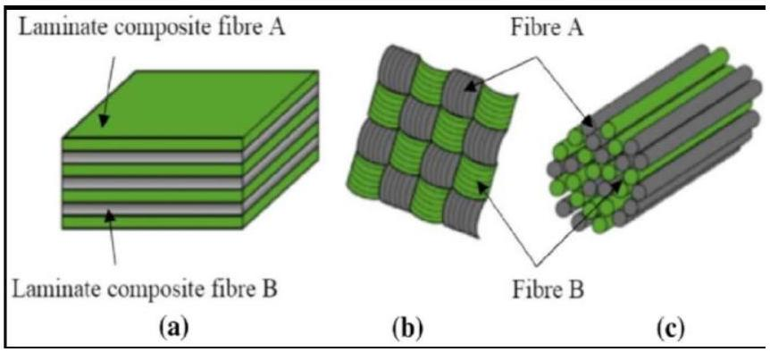
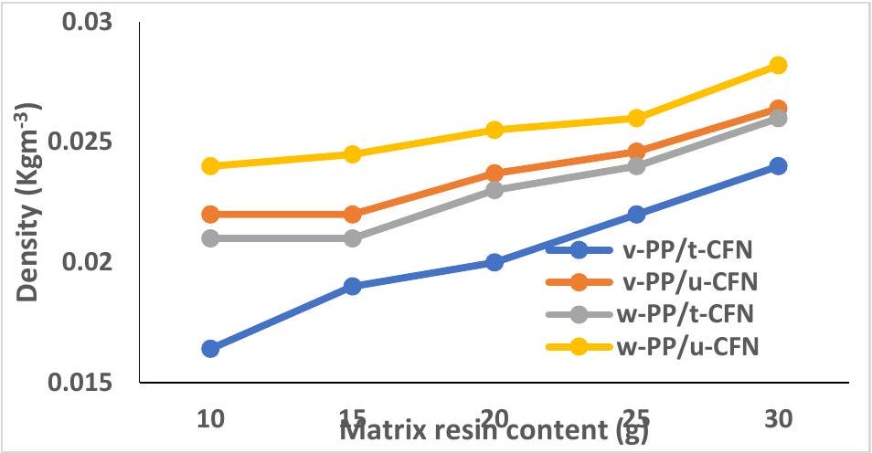
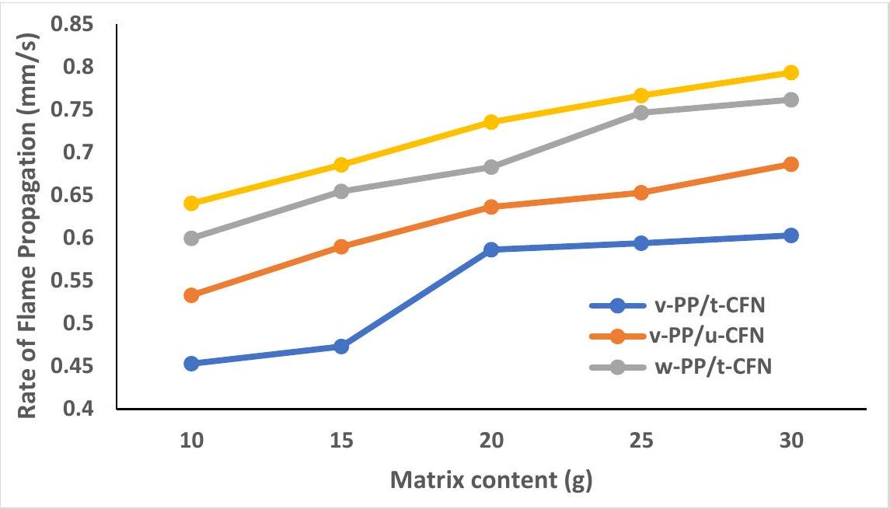
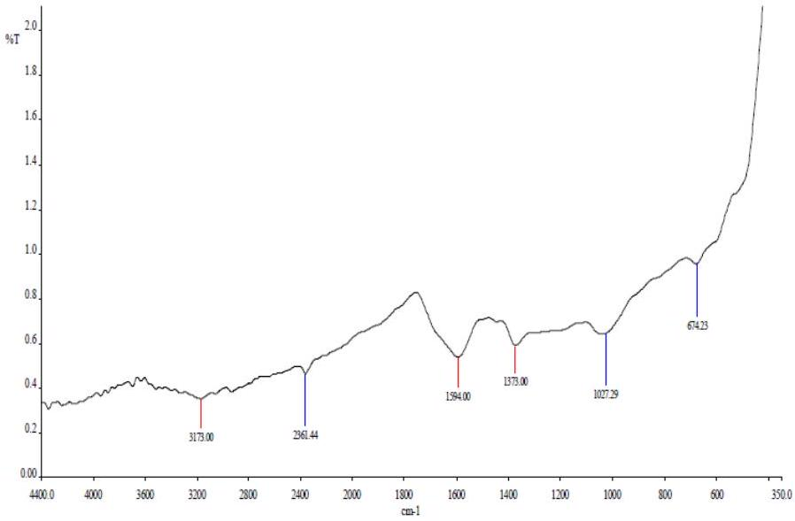
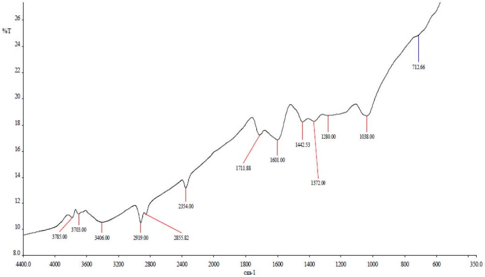
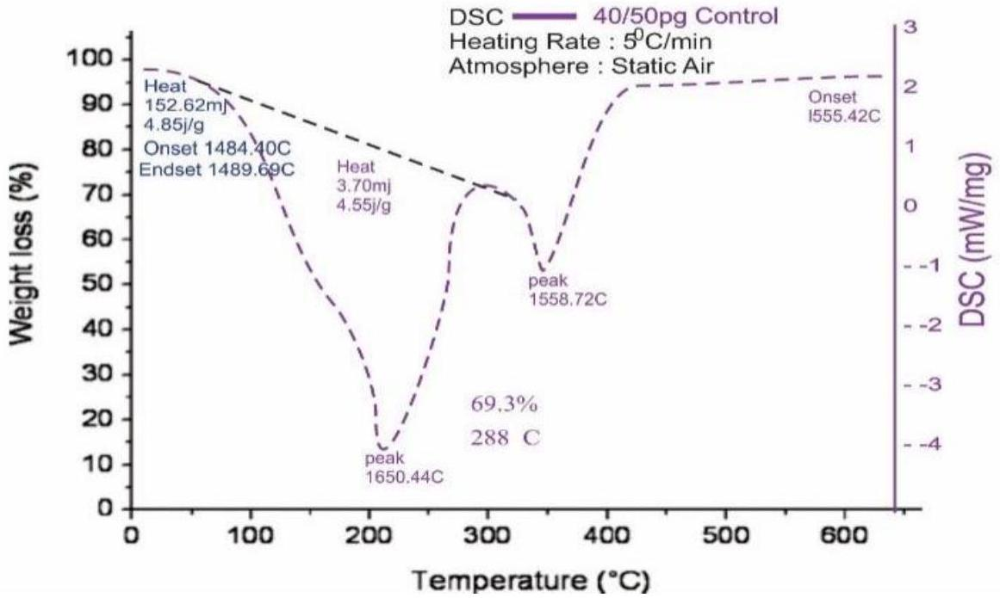
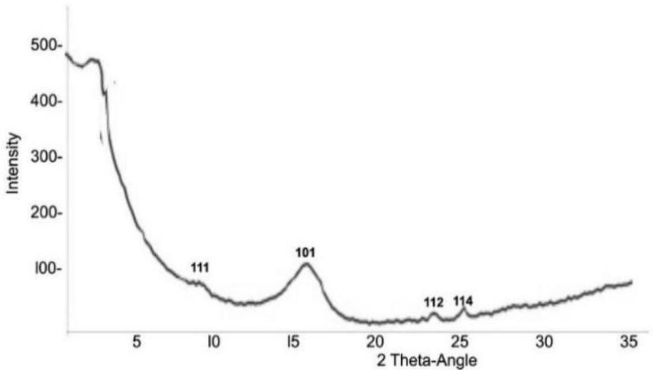
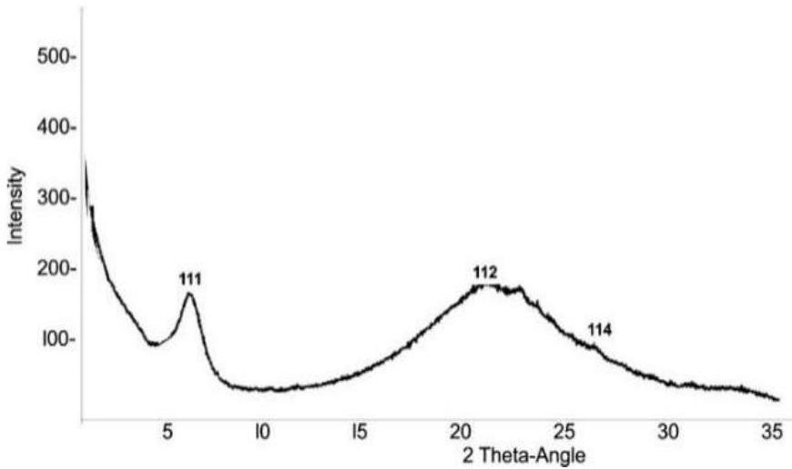

# Structural and Thermal Analysis of Polypropylene Composites Reinforced with Canarium schweinfurthii Nut-Shell Particles 

Atoshi M A ${ }^{\mathbf{1}}$, Garindo $\mathbf{B}^{\mathbf{2}}$, Aikhoje E.F ${ }^{\mathbf{1}}$, Abubakar M. Y ${ }^{\mathbf{1}}$ ${ }^{1}$ Department of Industrial Chemistry, Federal University Wukari, Taraba State, Nigeria ${ }^{2}$ Department of Chemistry, Federal University Wukari, Taraba State, Nigeria *Corresponding Author: ago@fuwukari.edu.ng

Received: 28 ${ }^{\text {th }}$ May 2026; Revised: $10{ }^{\text {th }}$ Jun 2026; Accepted: $20{ }^{\text {th }}$ Jun 2026

#### Abstract

This study investigates the structural, thermal, and flammability characteristics of polypropylene (PP) composites reinforced with treated and untreated Canarium schweinfurthii (CFN) nut-shell particles, utilizing both virgin and recycled PP matrices. Composites were fabricated via melt-compounding with a fixed filler content, and the effects of matrix content on density, flame propagation, thermal behavior, chemical structure, and crystallinity were systematically evaluated. Results show that increasing matrix content led to higher densities, ranging from $0.0164-0.0282 \mathrm{~kg} / \mathrm{m}^{3}$, with treated CFN composites exhibiting superior densification due to enhanced interfacial adhesion. Flame propagation rates increased with decreasing polymer content, reaching 0.793 mm/s in untreated CFN/recycled PP composites, reflecting the vulnerability of bio-fillers under low matrix fractions. FTIR analysis revealed a reduction in hydroxyl and hemicellulose-related bands in treated composites, indicating improved fiber-matrix compatibility and reduced moisture absorption. DSC thermograms demonstrated enhanced thermal stability in treated composites, with degradation onset at 148.40°C, a major exothermic peak at 165.44°C, and 69.3\% mass loss at 288°C, reflecting stabilized fiber-matrix interactions. XRD patterns confirmed increased crystallinity in treated composites, with sharper peaks at 15° (101), 20° (112), and 25° (114), while untreated composites retained more amorphous regions, compromising mechanical performance. Overall, alkaline treatment of CFN fillers significantly improves density, thermal stability, flammability resistance, and structural ordering of PP-based composites.

Keywords: Canarium schweinfurthii, polypropylene composites, alkaline treatment, density, flame propagation, crystallinity
How to cite this article: Atoshi MA, Garindo B, Aikhoje EF, Abubakar MY. Structural and thermal analysis of polypropylene composites reinforced with Canarium schweinfurthii nut-shell particles. NextGen Chem Discov. 2026 Apr-Jun;2(2):61-77.
Conflict of interest: None

## Introduction

The growing global emphasis on sustainable material development has intensified interest in the utilization of agricultural residues as reinforcing agents in polymer composites. Among these strategies, the incorporation of lignocellulosic waste into thermoplastic matrices has emerged as a promising approach for enhancing material performance while simultaneously addressing environmental concerns associated with biomass disposal (Salazar-Cruz et al., 2022). Polypropylene remains one of the most widely used thermoplastics due to its low density, chemical resistance, and ease of processing. However, its relatively limited stiffness and moderate thermal resistance often restrict its use in demanding structural applications. Reinforcing polypropylene with natural fillers derived from agro-industrial waste provides a viable route to overcome these limitations while promoting resource sustainability.
The growing need to balance industrialization and make the environment sustainable has increased the interest in finding alternative materials that would minimize ecological footprints without compromising functional performance (Archibong et al., 2026). A material called composite features at least two different substances that combine structurally at the microscopic size. Two constituents form a composite structure where the reinforcing element exists inside the matrix structure. (Shamsudden et al., 2025).
One such underutilized biomass resource is the nutshell of Canarium schweinfurthii, a lignocellulosic byproduct generated in significant quantities during fruit processing. The rigid cellular architecture and high lignin content of these shells suggest strong potential as a reinforcing phase in polymeric systems. When dispersed within a polypropylene matrix, the shell particles may act as heterogeneous nucleation sites that influence the crystallization behavior of the polymer, thereby altering its structural and thermal characteristics. Understanding how these natural particles interact with the polymer phase is therefore essential for tailoring composite properties and ensuring reliable performance under thermal and mechanical stress (Tran et al., 2025).
The development of such bio-reinforced materials requires a detailed investigation of the filler-matrix interface, since the compatibility between hydrophilic lignocellulosic particles and the hydrophobic polypropylene matrix is inherently limited. Poor interfacial adhesion often results in particle agglomeration and interfacial voids, which can compromise the structural integrity of the composite. To address this challenge, maleic anhydride-grafted polypropylene is frequently employed as a compatibilizing agent during melt processing. The reactive functional groups of this compatibilizer promote interfacial bonding between the filler surface and the polymer chains, thereby enhancing stress transfer efficiency and improving overall composite stability (Benchikh et al., 2024; Soares et al., 2023). Characterizing the thermal behavior of these reinforced systems is crucial for evaluating their suitability for industrial applications. Thermogravimetric analysis provides valuable insights into the degradation profile and thermal stability of the composites, revealing how the presence of biomass fillers influences decomposition pathways and service temperature limits. In parallel, scanning electron microscopy offers direct visualization of the composite morphology, enabling detailed observation of particle dispersion and interfacial adhesion within the polymer matrix. These analyses collectively provide important information on the structural mechanisms governing composite performance.
Additional structural characterization techniques further deepen the understanding of filler-induced modifications in the polymer matrix. X-ray diffraction analysis enables the identification of crystalline phases and evaluates how the incorporation of Canarium schweinfurthii shell particles affects nucleation density and crystal orientation in polypropylene (Jordá-Reolid et al., 2023). Complementary to this, Fouriertransform infrared spectroscopy allows the identification of chemical interactions at the filler-matrix
interface, confirming whether compatibilization strategies effectively promote interfacial bonding and structural stabilization of the composite system (Barhoumi et al., 2025).
Beyond thermal and structural analyses, the rheological behavior of the composite melt is also a critical parameter for large-scale processing technologies such as extrusion and injection molding. Variations in filler loading can significantly influence melt viscosity and flow behavior, which ultimately determine processing efficiency and product quality. Furthermore, the presence of lignocellulosic fillers may alter the moisture absorption characteristics of the composite, affecting its dimensional stability and long-term durability in humid environments. Evaluating these hygrothermal effects is therefore essential for predicting material performance under real service conditions. Particle size distribution and surface characteristics of the reinforcing phase also play a significant role in governing the crystallization kinetics of the polymer matrix. These factors influence nucleation efficiency, crystal growth rate, and final morphology of the composite structure. Dynamic mechanical analysis provides further insights into the viscoelastic behavior of the reinforced material, revealing changes in stiffness, damping capability, and thermal transition behavior across a broad temperature range. Such analyses are fundamental for establishing a comprehensive structure-property relationship within bio-based composite systems.
The present study aims to systematically evaluate the thermal, structural, and morphological characteristics of polypropylene composites reinforced with Canarium schweinfurthii nut shell particles. By integrating multiple analytical techniques and examining the influence of filler content, this work seeks to establish a deeper understanding of the interactions governing composite performance. The outcomes of this investigation contribute to the valorization of agricultural residues and support the development of sustainable polymer composites with improved thermal stability and structural integrity suitable for advanced industrial applications.

Figure 1: Conceptual Framework of Natural Fiber-Reinforced Polymer Composite Development

## Materials and Method   Materials

The raw materials used in this study were obtained from different regions within Nigeria to ensure accessibility and relevance to local resource utilization. Canarium schweinfurthii (commonly known as Atili) nut shells were collected from Barkin-Ladi Local Government Area in Plateau State, Nigeria. The collected agricultural residues were thoroughly washed with distilled water to remove adhering dirt and organic impurities before being air-dried under ambient laboratory conditions. The dried shells were subsequently processed into fine particles through mechanical pulverization and then sieved using a $\mathbf{4 5} \boldsymbol{\mu} \mathbf{m}$ mesh to obtain uniform particle size distribution suitable for composite fabrication.
All grinding, sieving, and preliminary preparation processes were carried out at the Chemistry Laboratory of Modibbo Adama University (MAU), Yola, to ensure controlled processing conditions prior to composite formulation and characterization. The use of standardized preparation procedures ensured
consistency in particle size and material quality, which is essential for achieving reproducible composite performance. The polymer matrix consisted primarily of polypropylene (PP) pellets, which were procured from Jemita Market in Yola, Adamawa State, Nigeria. In addition, recycled polypropylene (rPP) obtained from post-consumer sachet water packaging materials was incorporated as part of the polymer matrix to promote sustainable material utilization. To enhance compatibility between the hydrophobic polypropylene matrix and the hydrophilic lignocellulosic filler, maleic anhydride-grafted polypropylene (MAPP) was used as a compatibilizing agent (Sigma-Aldrich, Germany).
Analytical-grade chemicals were used during material processing. Xylene (analytical grade, Sigma-Aldrich, Germany) served as the solvent for dissolving polypropylene during composite preparation. Sodium hydroxide (NaOH) pellets, hydrochloric acid (HCl), and sodium chloride (NaCl) used in treatment and preparation steps were obtained from Merck KGaA (Darmstadt, Germany). Distilled water used for cleaning and sample preparation was produced in the MAU laboratory. The laboratory equipment employed in this study included a digital analytical weighing balance (Ohaus Corporation, USA) for accurate mass measurements, as well as standard laboratory tools such as spatulas, funnels, and borosilicate test tubes (Pyrex, Corning Inc., USA) for safe material handling. Thermal processing was carried out using a temperature-controlled oil bath equipped with a digital thermometer (IKA Works GmbH, Germany) to ensure precise temperature monitoring during composite preparation.
Composite molding was performed using a custom-fabricated aluminum mold, while consolidation and shaping of the composite materials were achieved using a locally fabricated manual heat press extrusion machine. This setup enabled controlled melting, mixing, and compression of the composite material under regulated temperature and pressure conditions.
Preparation of Canarium schweinfurthii Nut Shell Composite Using Solvent Method
The prepared Canarium schweinfurthii nut shells were first air-dried to remove surface moisture and then oven-dried at 100 °C for 24 hours to eliminate residual moisture that could negatively affect composite processing. After drying, the shells were allowed to cool to room temperature before being mechanically milled into fine powder using a laboratory grinder. The powdered material was subsequently sieved through a $\mathbf{4 5} \boldsymbol{\mu} \mathbf{m}$ mesh sieve to obtain uniform particle size suitable for homogeneous dispersion within the polymer matrix.
For composite fabrication, a measured volume of xylene solvent was transferred into a clean borosilicate beaker. Subsequently, 10 g of polypropylene resin was added to the solvent. The mixture was heated on a temperature-controlled hot plate at approximately 150 °C until the polypropylene completely dissolved, forming a homogeneous polymer solution.
Predetermined amounts of the prepared Canarium schweinfurthii nut shell powder were accurately weighed using the digital analytical balance and gradually introduced into the molten polypropylene-xylene solution. The mixture was continuously stirred for approximately five minutes at the same temperature to ensure uniform dispersion of the reinforcing particles throughout the polymer matrix. The resulting composite mixture was carefully poured into a rectangular aluminum mold with approximate dimensions of 2 cm thickness, 2 cm width, and 8 cm length. The molded samples were allowed to cure and stabilize under ambient laboratory conditions for approximately 40 hours, following the ASTM D618-99 standard conditioning procedure, before being subjected to subsequent thermal, structural, and morphological characterization analyses.
Preparation of Composite Samples
The Canarium schweinfurthii nut shells were first cleaned thoroughly to remove adhering impurities and dried in an oven at 80 °C for 24 h to eliminate moisture. The dried shells were subsequently ground and
sieved to obtain a uniform particle size distribution suitable for composite fabrication. Polypropylene pellets were used as the polymer matrix, while maleic anhydride-grafted polypropylene (MAPP) served as a compatibilizing agent to improve filler-matrix adhesion.
The composite materials were prepared through melt compounding using a twin-screw extruder operating at temperatures ranging from 170-190 °C. Predetermined weight fractions of nut shell particles were mixed with polypropylene and the compatibilizer to ensure uniform dispersion within the matrix. The extruded material was pelletized and subsequently molded into test specimens using an injection molding machine under controlled processing conditions. These samples were then used for thermal, structural, and morphological characterization.

## Thermogravimetric Analysis (TGA)

Thermogravimetric analysis was conducted to evaluate the thermal stability and degradation behavior of the polypropylene composites reinforced with Canarium schweinfurthii nut shell particles. Approximately 5-10 mg of each composite sample was placed in a platinum crucible and heated from room temperature to 700 °C under a nitrogen atmosphere to prevent oxidative degradation. The heating rate was maintained at $10^{\circ} \mathrm{C} \mathrm{min}^{-1}$ throughout the analysis.
The weight loss profile obtained from the thermogravimetric curve was used to determine the onset degradation temperature, maximum degradation temperature, and residual char content. These parameters provided insight into how the incorporation of lignocellulosic particles influences the thermal resistance and decomposition characteristics of the polypropylene matrix.

## Scanning Electron Microscopy (SEM)

Scanning electron microscopy was employed to investigate the surface morphology and interfacial adhesion between the polypropylene matrix and the Canarium schweinfurthii shell particles. Prior to analysis, the fractured surfaces of composite samples were coated with a thin layer of gold using a sputter coater to improve electrical conductivity.
The microstructural observations were conducted using a scanning electron microscope operated at an accelerating voltage between 10 and 20 kV. The images obtained provided detailed information regarding particle dispersion, interfacial bonding, and the presence of microvoids or agglomerations within the composite structure. These morphological features are critical indicators of the mechanical performance and structural integrity of the reinforced polymer system.

## X-ray Diffraction (XRD)

X-ray diffraction analysis was carried out to determine the crystalline structure and phase composition of the polypropylene composites. The measurements were performed using an X-ray diffractometer equipped with Cu-Ka radiation $(\lambda=1.5406 \AA)$. The diffraction patterns were recorded over a $2 \theta$ range of 5° to 60° at a scanning rate of 2° $\mathrm{min}^{-1}$. The resulting diffraction peaks were analyzed to identify changes in crystallinity and crystal orientation induced by the addition of Canarium schweinfurthii shell particles. Variations in peak intensity and position were used to evaluate the nucleating effect of the natural filler on the polypropylene matrix and to determine how filler incorporation influences the formation of specific crystalline phases.

## Fourier Transform Infrared Spectroscopy (FTIR)

Fourier-transform infrared spectroscopy was used to identify functional groups and potential chemical interactions occurring between the polypropylene matrix and the lignocellulosic filler. The FTIR spectra were recorded using an infrared spectrometer operating in the range of $4000-400 \mathrm{~cm}^{-1}$. Samples were analyzed using the attenuated total reflectance (ATR) technique, which allowed direct measurement without extensive sample preparation. Characteristic absorption bands corresponding to cellulose, hemicellulose, lignin, and polypropylene were examined to detect possible interfacial interactions and
confirm the effectiveness of the compatibilizer in promoting bonding between the hydrophilic filler and the hydrophobic polymer matrix.

## Dynamic Mechanical Analysis (DMA)

Dynamic mechanical analysis was performed to evaluate the viscoelastic behavior of the polypropylene composites. Rectangular specimens were subjected to oscillatory deformation using a dynamic mechanical analyzer operating in a three-point bending mode.
The measurements were conducted over a temperature range of -50 °C to 150 °C at a constant heating rate of 3 °C $\min ^{-1}$ and a fixed oscillation frequency of 1 Hz. The storage modulus, loss modulus, and damping factor $(\tan \delta)$ were recorded as functions of temperature. These parameters provided valuable information about the stiffness, energy dissipation capability, and glass transition behavior of the composites. Changes in these properties were analyzed to understand the reinforcing effect of Canarium schweinfurthii nut shell particles and their influence on the dynamic mechanical performance of the polypropylene matrix.

## Density Test

The density of the composites was determined following ASTM D792 standards. Each composite sample's mass was recorded using an analytical balance, and the volume was calculated from the dimensions of each sample (length × breadth × width), which were precisely measured with a digital vernier caliper. The density of the samples was then calculated as the mass-to-volume ratio $\left(\mathrm{kg} / \mathrm{m}^{3}\right)$ using the formula in Equation 1 (Ago et al., 2024):

$$
\begin{equation*}
\text { Density }=\frac{\text { Mass }}{\text { Volume }} \mathrm{kg} / \mathrm{m}^{3} \tag{1}
\end{equation*}
$$

This method provides an accurate measurement of the composite's density (Lawal, 2019)

## Flammability Test (ASTM D635)

To find out how quickly different samples burn, the process starts by marking a 20 mm section on each specimen. Each specimen is then secured horizontally in a retort stand, ensuring that a 60 mm portion extends beyond the clamp. The free end of the sample is set on fire, and the time taken for the sample to ignite is noted as the ignition time (It). The specimen is allowed to burn until it reaches the 20 mm mark, and the distance burned (Dp) is then measured. The relative rates of burning can be calculated using the following expression in Equation 2 (Dass et al., 2016:

$$
\begin{equation*}
\text { Relative rate of burning= } \frac{\mathrm{Dp}}{\mathrm{It}} \tag{2}
\end{equation*}
$$

Where $\mathrm{D}_{\mathrm{p}}=$ Propagation distance measured in mm, $\mathrm{P}_{\mathrm{t}}=$ Flame propagation time measured in seconds, $\mathrm{I}_{\mathrm{t}}=$ Ignition time measured in seconds

Results

Figure 2: Effect of matrix content on density of treated and untreated Canarium schweinfurthii fruit nut with unused and waste polypropylene-based composites at constant filler

Figure 2 illustrates the influence of matrix concentration on the density of composites reinforced with treated and untreated Canarium schweinfurthii fruit nut-shell (CFN) particles using both unused and recycled polypropylene matrices while maintaining a constant filler proportion. The results reveal a progressive increase in composite density as the matrix content increases across all composite categories. For the treated CFN reinforced with unused polypropylene, density values increased from $\mathbf{0 . 0 1 6 4} \mathbf{~ k g / m}^{\mathbf{3}} \mathbf{~ t o}$ $\mathbf{0 . 0 2 4} \mathbf{~ k g} / \mathbf{m}^{\mathbf{3}}$ as the matrix concentration increased. Similarly, the untreated CFN reinforced with unused polypropylene exhibited density values ranging from $\mathbf{0 . 0 2 2} \mathbf{~ k g} / \mathbf{m}^{\mathbf{3}}$ to $\mathbf{0 . 0 2 6 4} \mathbf{~ k g} / \mathbf{m}^{\mathbf{3}}$. In the case of composites produced using recycled polypropylene, the treated CFN composite displayed density values between $\mathbf{0 . 0 2 1} \mathbf{~ k g} / \mathbf{m}^{\mathbf{3}}$ and $\mathbf{0 . 0 2 6 ~ k g} / \mathbf{m}^{\mathbf{3}}$, whereas the untreated CFN composite recorded values ranging from 0.024 $\mathrm{kg} / \mathrm{m}^{3}$ to $0.0282 \mathrm{~kg} / \mathrm{m}^{3}$.
The gradual increase in density with increasing matrix content can be attributed to the greater contribution of the polymer phase to the overall mass and compactness of the composite structure. As the polypropylene content increases, the polymer matrix occupies a larger proportion of the internal volume of the composite and improves the encapsulation of filler particles, resulting in enhanced packing efficiency and reduced internal void spaces within the material.
Furthermore, differences observed between treated and untreated CFN composites can be associated with variations in interfacial adhesion between the lignocellulosic filler and the polypropylene matrix. Surfacetreated particles generally exhibit improved compatibility with the polymer phase, which promotes better dispersion and stronger filler-matrix interactions. In contrast, untreated particles often display poorer interfacial bonding, which may result in the formation of micro-voids or interfacial gaps that negatively affect the overall densification of the composite structure (Balogun et al., 2025). These interfacial defects can facilitate the entrapment of air during the fabrication process, thereby preventing the formation of a fully consolidated composite matrix (Kumar et al., 2024).
Consequently, the presence of such voids in untreated composites can contribute to deviations from the theoretical density of the material. In contrast, chemically treated fillers tend to promote stronger interfacial adhesion with the polypropylene matrix, resulting in a more homogeneous structure with fewer defects at the interface (Munusamy et al., 2026; Cionita et al., 2022). This improved interaction between the polymer matrix and the nut-shell particles can lead to a reduction in pore size and volume within the composite, which is often associated with enhanced cross-linking or interfacial bonding between the two phases (Ali, 2023). The improved structural integration resulting from enhanced filler-matrix adhesion ultimately contributes to lower porosity and greater densification within the composite material. As a result, composites with stronger interfacial bonding typically exhibit improved structural compactness and more stable physical properties (Wong et al., 2025). These observations highlight the critical role of matrix composition and filler treatment in controlling the density and structural integrity of lignocellulosicreinforced polypropylene composites.

Figure 3: Effect of matrix content on rate of flame propagation of treated and untreated Canarium schweinfurthii fruit nut (CFN) with unused and waste polypropylene-based composites at constant Polypropylene.

Figure 3 illustrates the influence of matrix content on the flame propagation rate of composites reinforced with treated and untreated Canarium schweinfurthii fruit nut-shell (CFN) particles using both virgin and recycled polypropylene matrices, while maintaining a constant filler fraction. The results reveal that matrix composition significantly affects the flammability characteristics of the developed composites.
The observed trend indicates that decreasing the proportion of polymer resin in the composite leads to a reduction in ignition resistance and consequently promotes faster flame propagation. This behavior is reflected in the measured flame spread rates for all composite categories. For the unused polypropylene composite reinforced with treated CFN, the flame propagation rate increased from 0.45 mm/s to 0.63 mm/s as the matrix proportion decreased. A similar trend was observed for the unused polypropylene reinforced with untreated CFN, where the flame propagation rate increased from 0.53 mm/s to 0.686 mm/s.
A comparable pattern was also recorded for composites fabricated with recycled polypropylene. The treated CFN/waste polypropylene composite exhibited an increase in flame propagation rate from 0.60 mm/s to 0.762 mm/s, while the untreated CFN/waste polypropylene composite showed a rise from 0.64 mm/s to 0.793 mm/s. These results suggest that composites containing lower polymer matrix content become more susceptible to flame spread. This behaviour can be attributed to the structural role of the polymer matrix in shielding the lignocellulosic reinforcement from direct thermal exposure. When the matrix fraction is sufficiently high, the polymer phase forms a continuous encapsulating structure around the filler particles, which can slow heat penetration and delay the release of combustible volatiles. However, when the polymer content decreases, this protective mechanism becomes compromised, thereby exposing a greater surface area of the cellulosic reinforcement to the flame and accelerating its thermal decomposition (Ao et al., 2023).
Furthermore, the increased particle loading associated with lower matrix concentrations elevates the amount of combustible biomass within the composite. This condition facilitates the candlewick effect, where the fibrous lignocellulosic particles promote capillary transport of pyrolysis products and support rapid moisture evaporation and volatile release during combustion (Aloka et al., 2024; Decsov et al., 2023). As a result, the exposed bio-fillers effectively bypass the thermal shielding normally provided by the polymer phase, leading to a reduction in the ignition threshold of the composite system (Suruji, 2023).

These observations are consistent with the well-documented thermal sensitivity of natural fibres. Lignocellulosic materials composed primarily of cellulose, hemicellulose, and lignin undergo rapid pyrolytic degradation when subjected to elevated temperatures, particularly when the protective binder envelope surrounding them is diminished (Muralidharan et al., 2024). Consequently, the increased exposure of these organic constituents enhances the surface fuel-to-oxidizer ratio, which promotes exothermic oxidation reactions capable of sustaining a self-propagating flame front.
In addition, composites reinforced with untreated fillers may experience poorer interfacial adhesion with the polymer matrix, resulting in micro-voids or interfacial gaps that facilitate heat and oxygen diffusion during combustion. Such structural irregularities can further accelerate flame spread. Conversely, surfacetreated fillers tend to improve matrix-filler compatibility and reduce interfacial defects, thereby slightly moderating flame propagation.
The results demonstrate that the proportion of polymer matrix plays a critical role in determining the fire behaviour of CFN-reinforced polypropylene composites. Increasing the matrix content enhances structural continuity and thermal shielding, thereby reducing flame spread. These findings highlight the importance of optimizing both interfacial adhesion and matrix-to-filler ratio to improve the fire safety performance of bio-composite materials (Kanaginahal et al., 2023).

Figure 4a: FTIR Spectrum for Alkaline Treated Canarium schweinfurthii nut/polypropylene composite

Figure 4b: FTIR Spectrum for Untreated Canarium schweinfurthii nut/polypropylene composite

The Fourier Transform Infrared (FTIR) spectra of the treated fig 4a and untreated Canarium schweinfurthii nut shell (CFN) 4b reinforced polypropylene composites provide insight into the chemical interactions occurring within the composite structure. The spectral features mainly reflect the contributions of the polypropylene matrix and the lignocellulosic components of the CFN filler, as well as the chemical modifications introduced through alkaline treatment.
The absorption peaks observed at $\mathbf{2 9 2 4} \mathbf{~ c m}^{-\mathbf{1}}$ and $\mathbf{2 8 5 0} \mathbf{~ c m}^{-\mathbf{1}}$ correspond to the asymmetric and symmetric C-H stretching vibrations of aliphatic hydrocarbons present in the polypropylene backbone. The appearance of these peaks in both treated and untreated composites confirms that the polypropylene matrix maintains its chemical stability during composite processing. This indicates that the alkaline treatment primarily modifies the surface chemistry of the CFN reinforcement rather than altering the polymer structure.
A notable spectral feature occurs near $\mathbf{1 7 3 0} \mathbf{~ c m}^{-\mathbf{1}}$, which is typically associated with C=O stretching vibrations originating from ester or carbonyl groups present in hemicellulose and other lignocellulosic constituents. In the treated composite, the reduction in the intensity of this peak suggests the partial removal of hemicellulose and other amorphous components during the alkaline treatment process. The elimination of these components exposes more cellulose-rich surfaces and increases the surface roughness of the filler, thereby enhancing the mechanical interlocking between the CFN particles and the polypropylene matrix.
The broad absorption band between 3400 and $\mathbf{3 5 0 0 ~ c m}^{-\mathbf{1}}$ corresponds to O-H stretching vibrations associated with hydroxyl groups in cellulose and absorbed moisture within the lignocellulosic structure. In the treated composite, this band appears less intense compared with the untreated sample, indicating a reduction in the number of accessible hydroxyl groups after alkaline treatment. When this band appears diminished in the treated samples, it signifies a reduction in the hygroscopic nature of the filler due to the successful elimination of hydrophilic hydroxyl groups. This decrease in intensity indicates that the alkaline treatment effectively lowers the density of reactive -OH sites, thereby reducing the overall moisture absorption capacity of the composite (Kumar et al., 2025).
Furthermore, the modification of the fiber surface chemistry contributes to improved interfacial interaction with the polypropylene matrix. The reduction of polar hydroxyl sites decreases the likelihood of water accumulation at the filler-matrix interface, which often leads to the formation of micro-voids and weak interfacial bonding in untreated natural fiber composites. By minimizing these defects, the treated filler can establish stronger physical interlocking with the surrounding polymer matrix (Asyiqin et al., 2023). Such interfacial stabilization is essential for maintaining long-term structural integrity, particularly in applications where the composites are exposed to humid or moisture-prone environments (Mohammed et al., 2025).
Additional peaks at $\mathbf{1 4 5 0} \mathbf{~ c m}^{\boldsymbol{-} \mathbf{1}}$ and $\mathbf{1 3 7 5} \mathbf{~ c m}^{\boldsymbol{-} \mathbf{1}}$ correspond to $\mathbf{C H}_{\mathbf{2}}$ bending and $\mathbf{C H}_{\mathbf{3}}$ deformation vibrations associated with polypropylene. The persistence of these peaks across the spectra of both treated and untreated composites confirms that the fundamental chemical structure of the polymer matrix remains intact throughout the processing and treatment procedures.
In contrast, the FTIR spectrum of the untreated CFN/PP composite exhibits more pronounced lignocellulosic absorption bands, indicating a higher presence of cellulose, hemicellulose, and lignin components. The stronger hydroxyl-related absorption bands reflect a higher degree of hydrophilicity and moisture affinity. This characteristic can negatively influence the interfacial adhesion between the hydrophilic filler and the hydrophobic polypropylene matrix, resulting in weaker stress transfer and increased susceptibility to moisture-induced degradation. The comparative FTIR results demonstrate that
alkaline treatment effectively modifies the surface chemistry of CFN reinforcement by reducing hemicellulose content and decreasing the availability of hydroxyl groups responsible for moisture absorption. These chemical changes improve compatibility between the hydrophilic lignocellulosic filler and the hydrophobic polypropylene matrix, leading to enhanced interfacial bonding, reduced moisture sensitivity, and improved composite durability.

Figure 5: DSC Spectrum for Treated Canarium schweinfurthii Nut-shell/Polypropylene Composite.

The Differential Scanning Calorimetry (DSC) thermogram of the alkaline-treated Canarium schweinfurthii nut shell (CFN) reinforced polypropylene composite provides important information regarding the thermal transitions and stability of the composite material. The observed thermal behavior reflects the influence of alkaline treatment on the structural interaction between the lignocellulosic reinforcement and the polypropylene matrix. The DSC thermogram indicates that the thermal degradation of the treated composite begins at an onset temperature of approximately 148.40 °C and ends near 148.69 °C, representing a defined thermal transition associated with the removal of residual moisture and volatile substances within the natural filler. The elimination of these volatile compounds during alkaline treatment improves the thermal stability of the composite by reducing the presence of thermally unstable extractives that may otherwise promote premature degradation.
A distinct exothermic peak observed at approximately 165.44 °C represents a key thermal event associated with molecular reorganization within the polypropylene matrix. During this stage, the treated CFN particles act as nucleating agents that promote the alignment and crystallization of polymer chains. The formation of these crystalline domains strengthens the structural framework of the composite and enhances its resistance to thermal deformation and degradation.
At a higher temperature of approximately $288^{\circ} \mathrm{C}$, the composite exhibits a significant mass loss of about 69.3 \%, which corresponds to the thermal degradation of the lignocellulosic framework of the CFN reinforcement, particularly the cellulose and lignin constituents. This degradation behavior reflects the intrinsic thermal instability of these polysaccharide components when exposed to temperatures beyond their structural tolerance. The decomposition process typically occurs through a multi-stage mechanism, in which the volatile degradation products generated from hemicellulose and cellulose can further accelerate the breakdown of surrounding polymer structures (Masuelli, 2021).

Following this major degradation stage, a charred residue remains, indicating that portions of the composite possess thermally stable structures capable of resisting complete decomposition. The presence of this residue suggests that alkaline treatment contributes to the stabilization of the fiber-matrix interface by removing thermally labile extractives that could otherwise accelerate mass loss during heating (Bichang'a et al., 2024; Kumar et al., 2025). The reduction of these unstable constituents improves the structural integrity of the composite during thermal exposure.
Additionally, the formation of a carbonaceous char layer during decomposition can act as a protective barrier that slows heat transfer and restricts oxygen diffusion into the material. This protective layer, combined with improved interfacial bonding between the treated fibers and polypropylene matrix, contributes to the enhanced thermal resistance and fire retardancy observed in the treated CFN/PP composite system (Kumar et al., 2024).
The improved degradation profile also reflects the removal of less stable hemicellulose components during alkaline treatment. Since hemicellulose decomposes at lower temperatures compared with cellulose and lignin, its reduction increases the thermal threshold required for bulk material breakdown. Consequently, the treated composite exhibits a more stable degradation pattern and improved resistance to thermal deterioration (Rao et al., 2024).
In contrast, the untreated CFN/PP composite generally exhibits lower thermal stability due to the presence of untreated fiber surfaces containing moisture, extractives, and higher concentrations of hemicellulose. These components weaken fiber-matrix interactions and facilitate earlier thermal degradation. Therefore, the DSC analysis confirms that alkaline treatment significantly enhances the thermal durability, structural stability, and fire resistance of CFN/PP composites by improving fiber surface chemistry and strengthening the interfacial bonding within the composite structure.

Figure 6a: XRD Spectrum for alkaline-treated Canarium schweinfurthii Nut

The X-ray diffraction (XRD) patterns of both treated and untreated Canarium schweinfurthii (CFN) reinforced polypropylene (PP) composites reveal notable differences in structural ordering and crystallinity. Figure 6a shows the XRD spectrum for the alkaline-treated CFN/PP composite, while Figure 6b displays the spectrum for the untreated CFN/PP composite. The peak positions for both samples remain consistent, confirming that the fundamental crystalline phases of the polymer matrix are maintained regardless of treatment. However, a clear distinction emerges in peak intensity and sharpness between the treated and untreated composites.
In Figure 8, the treated CFN/PP composite exhibits sharper and more intense peaks around 15° (101), 20° (112), and 25° (114), indicating a higher degree of crystallinity. This enhancement is attributed to the
alkaline treatment, which removes amorphous components such as hemicellulose and lignin from the filler. The elimination of these disordered constituents allows the cellulose chains to realign efficiently, forming a more organized crystalline structure. The improved crystallinity strengthens interfacial bonding between the fibers and the polymer matrix, providing additional adhesion sites and promoting better mechanical interlocking, which enhances stress transfer under load.
In contrast, Figure 6b illustrates the untreated CFN/PP composite, which exhibits broader and less intense diffraction peaks, indicative of a higher proportion of amorphous material. The presence of these amorphous regions limits fiber-matrix adhesion, reduces stress transfer efficiency, and potentially compromises mechanical performance. Furthermore, the less ordered structure may retain higher hydrophilicity due to exposed hydroxyl groups, which can impede compatibility with the hydrophobic PP matrix.
The observed structural modifications in the treated composite (Figure 6a) are consistent with mechanisms seen in other cellulosic polymer systems, where alkali-induced delignification reduces hydroxyl group density, exposing crystalline cellulose and decreasing fiber hydrophilicity. This chemical modification not only enhances fiber-matrix compatibility but also increases surface roughness and effective surface area, providing additional mechanical interlocking sites that improve tensile and flexural strength. The combination of higher crystallinity, optimized interfacial adhesion, and enhanced mechanical interlocking explains the superior structural and performance characteristics of the treated CFN/PP composite relative to the untreated sample (KUMAR et al., 2024; Melyna \& Afridana, 2023; Kumar et al., 2025; Lee et al., 2021; Mani et al., 2024).
The XRD analysis confirms that alkaline treatment significantly enhances the crystallinity of CFN fillers (Figure 6a), improving the structural organization and mechanical stability of the polypropylene-based composite. Meanwhile, the untreated composites (Figure 6b) retain more amorphous regions, highlighting the importance of chemical treatment in optimizing bio-composite performance.

Figure 6b: XRD Spectrum for untreated Canarium schweinfurthii Nut

## Conclusion

The study demonstrates that alkaline treatment of Canarium schweinfurthii nut-shell fillers enhances the performance of polypropylene-based composites. Treated CFN particles improved filler-matrix adhesion, reduced moisture absorption, and promoted higher crystallinity, resulting in superior density, thermal stability, and mechanical integrity compared with untreated composites. The polymer matrix content significantly influences flame propagation and structural consolidation, with higher PP fractions providing better thermal shielding and lower flammability. These findings confirm that surface modification of bio-
fillers is critical for optimizing the physical, thermal, and fire-resistance properties of lignocellulosicreinforced polymer composites, providing a sustainable pathway for producing high-performance biocomposite materials suitable for industrial applications.

## References

[1]. Aloka NAK, Jayasinghe R, Priyadarshana G, Nilmini AHLR. Influence of fibre loading on the physico-mechanical properties of water hyacinth (Eichhornia crassipes) fibre reinforced polyethylene composites. Asian J Chem. 2024;36(8):1772. doi:10.14233/ajchem.2024.31699.
[2]. Ali R. Impact of wood particles (reed)/polypropylene composites on the physical and structural properties. Research Square. 2023. doi:10.21203/rs.3.rs-3508708/v1.
[3]. Ao X, Vázquez-López A, Mocerino D, González C, Wang D. Flame retardancy and fire mechanical properties for natural fiber/polymer composite: A review. Compos Part B Eng. 2023;268:111069. doi:10.1016/j.compositesb.2023.111069.
[4]. Asyiqin N, Nasharudin M, Sulaiman NA, Mohammad N, Raihan W, Jaafar WNRW, et al. The effect of heat treatment and chemical treatment on natural fibre to the durability of wood plastic composites - A review. J Mater Explor Find. 2023;2(2). doi:10.7454/jmef.v2i2.1023.
[5]. Balogun OA, Akinwande AA, Adediran AA, Sriariyanun M, Tee KF. Tensile, durability and thermal conductivity assessment of jute/Tetracarpidium conophorum reinforced polypropylene composites. Cellulose Chem Technol. 2025;59:375. doi:10.35812/cellulosechemtechnol.2025.59.33.
[6]. Barhoumi N, Attia-Essaies S, Samet A, Ghanem A, Khlifi K, Majid F. Eco-friendly polypropylene composite reinforced with natural fillers: Mechanical properties and wear resistance. MATEC Web Conf. 2025;414:03003. doi:10.1051/matecconf/202541403003.
[7]. Benchikh L, Aouissi T, Aitferhat Y, Chorfi H, Abacha I, Kebaili M, et al. Effect of different compatibilization routes on the mechanical, thermal and rheological properties of polypropylene/cellulose nanocrystals nanocomposites. Polym Bull. 2024;81(12):11007. doi:10.1007/s00289-024-05225-w.
[8]. Bichang'a DO, Oladele IO, Alabi OO, Aramide FO, Oluseye O, Borisade SG, et al. Coconut shell agro-waste-derived cellulosic powder as a potential reinforcement for sustainable polymeric composite application. Research Square. 2024. doi:10.21203/rs.3.rs-4374947/v1.
[9]. Cionita T, Siregar JP, Wong LS, Cheng WH, Fitriyana DF, Jaafar J, et al. The influence of filler loading and alkaline treatment on the mechanical properties of palm kernel cake filler reinforced epoxy composites. Polymers. 2022;14(15):3063. doi:10.3390/polym14153063.
[10]. Decsov KE, Ötvös B, Thanh TTN, Bocz K. The effect of cellulose fibre length on the efficiency of an intumescent flame retardant system in poly(lactic acid). Fire. 2023;6(3):97. doi:10.3390/fire6030097.
[11]. Jordá-Reolid M, Moreno V, García AM, Covas JA, Gómez-Caturla J, Martínez JI, et al. Incorporation of argan shell flour in a biobased polypropylene matrix for the development of high environmentally friendly composites by injection molding. Polymers. 2023;15(12):2743. doi:10.3390/polym15122743.
[12]. Kanaginahal GM, Tambrallimath V, Murthy M, Mahale RS, Patil A, Pawar SY, et al. Flammability studies of natural fiber-reinforced polymer composites fabricated by additive manufacturing technology: A review. J Inst Eng (India) Ser D. 2023;105(2):1291. doi:10.1007/s40033-023-00509-3.
[13]. Kumar SMV, Jeyakumar R, Sakthivelmurugan E. Evaluation of physico-mechanical, water absorption and thermal properties of Alstonia macrophylla fiber reinforced polypropylene composites. Cellulose Chem Technol. 2024;58:547. doi:10.35812/cellulosechemtechnol.2024.58.51.

[14]. Archibong CS, Donatus RB, Kime B, Abubakar MY, Abdullahi KN, Adam AB. Development of an emulsion paint from the copolymer composite of monomethylol urea and expanded polystyrene waste. Niger Res J Chem Sci. 2026;14(1):184-203.
[15]. Shamsuddeen R, Haruna AS, Auwal Z, Abdulkadir HF, Adam AB, Yahaya M, et al. Effect of flexural strength and density properties of sugarcane bagasse reinforced unsaturated polyester composite. Rom J Ecol Environ Chem. 2025;7:1. doi:10.21698/rjeec.2025.105.
[16]. Kumar SS, Shyamala P, Pati PR, Mishra DK, Sharma VS, Tank G, et al. Investigation and machine learning-based prediction of mechanical properties in hybrid natural fiber composites. Sci Rep. 2025;15(1). doi:10.1038/s41598-025-18944-5.
[17]. Lee CH, Abdan K, Lee SH. Importance of interfacial adhesion condition on characterization of plant-fiber-reinforced polymer composites: A review. Polymers. 2021;13(3):438. doi:10.3390/polym13030438.
[18]. Mani SK, Selvaraj S, Sivanantham G, Sahayaraj AF, Iyyadurai J, Mani M. Advancements in chemical modifications using NaOH to explore the chemical, mechanical and thermal properties of natural fiber polymer composites. Int Polym Process. 2024;39(4):406. doi:10.1515/ipp-2024-0002.
[19]. Masuelli M. Fiber-reinforced plastics. In: IntechOpen eBooks. 2021. doi:10.5772/intechopen.95632.
[20]. Melyna E, Afridana AP. The effect of coffee husk waste addition with alkalisation treatment on the mechanical properties of polypropylene composites. Ekuilibium. 2023;7(1):14. doi:10.20961/equilibrium.v7i1.68556.
[21]. Mohammed M, Mohammed AMM, Oleiwi JK, Adam T, Betar BO, Gopinath SCB, et al. Influence of fiber treatments on water absorption behavior in natural fiber-reinforced polymer composites: A review. Al Rafidain J Eng Sci. 2025;3(1):410. doi:10.61268/t9882p37.
[22]. Munusamy Y, Muniyadi M, Tan WC, Al-mahmodi AF, Suyambulingam I. Toward sustainable polymer composites: Synergetic effects of surface-treated Mimusops elengi seed shell powder on polypropylene properties. J Thermoplast Compos Mater. 2026. doi:10.1177/08927057261416860.
[23]. Muralidharan ND, Subramanian J, Rajamanickam SK, Krishnasamy P, Thiagamani SMK, Khan A. Flame retardant characteristics of natural fibre reinforced polymer composites: A thematic review. Polym Compos. 2024;45(14):12530. doi:10.1002/pc.28699.
[24]. Rao HJ, Melnikov A, Fakhr EA, Pulikkalparambil H, Spitas C. Isolation and alkali treatment of novel natural fiber from Chinese burr stalk for sustainable polymer composites and versatile applications. Research Square. 2024. doi:10.21203/rs.3.rs-5317079/v1.
[25]. Salazar-Cruz BA, Chávez-Cinco MY, Morales-Cepeda AB, Ramos-Galván CE, Rivera-Armenta JL. Evaluation of thermal properties of composites prepared from pistachio shell particles treated chemically and polypropylene. Molecules. 2022;27(2):426. doi:10.3390/molecules27020426.
[26]. Sayeed MM, Sayem ASM, Haider J, Akter S, Habib MM, Rahman H, et al. Assessing mechanical properties of jute, kenaf, and pineapple leaf fiber-reinforced polypropylene composites: Experiment and modelling. Polymers. 2023;15(4):830. doi:10.3390/polym15040830.
[27]. Soares C, Moura EAB, Arenhardt V, Deliza EEV, Filho FSP. Biotechnology management in the Amazon and the production of polypropylene/Brazil nut shell fiber biocomposite. Rev Gest Secret. 2023;14(7):10734. doi:10.7769/gesec.v14i7.2424.
[28]. Suruji NFA. Physical and mechanical properties of bamboo fibres filled with calcium carbonate powder reinforced epoxy composites for roofing application. Int J Res Appl Sci Eng Technol. 2023;11(11):1254. doi:10.22214/ijraset.2023.56551.

[29]. Tran TMN, Prabhakar M, Lee D, Song J. Enhanced mechanical and thermal properties of green PP composites reinforced with bio-hybrid fibers and agro-waste fillers. Adv Compos Hybrid Mater. 2025;8(2). doi:10.1007/s42114-025-01277-2.
[30]. Wong D, Debnath S, Anwar M, Reddy MM, Abdullah AH, Lim CI, et al. Mechanical strength performance and development of water hyacinth particle reinforced thermoset polymer composites. Discov Polym. 2025;2(1). doi:10.1007/s44347-025-00036-2.
